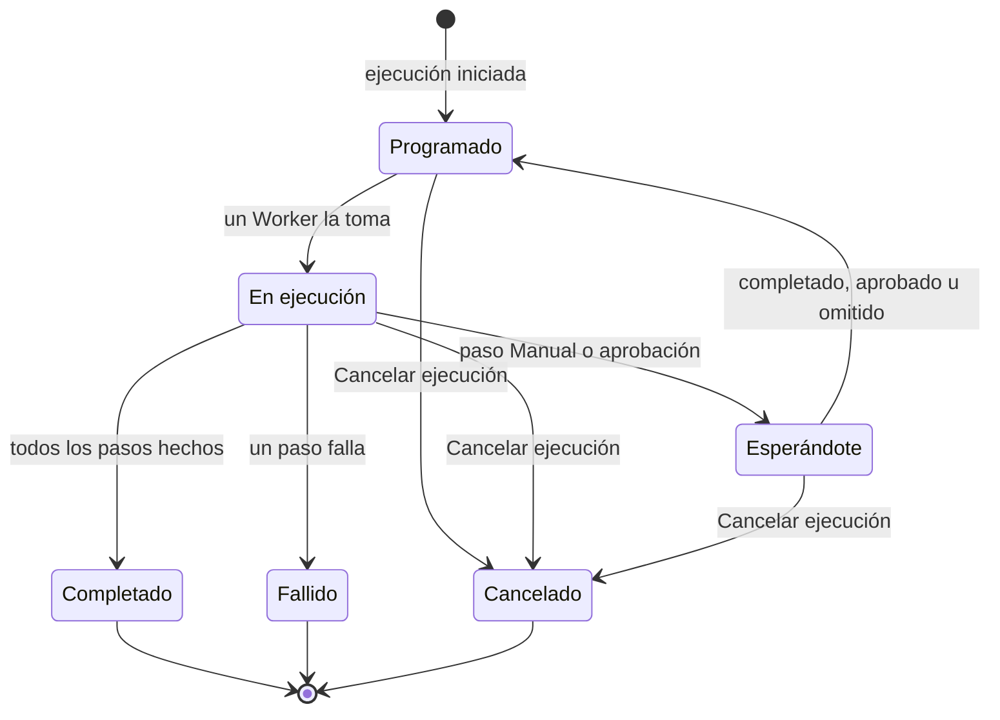

# Ejecutar un runbook

Cada ejecución de un runbook es una **ejecución**: una instantánea de los pasos del runbook, recorridos en orden, con el estado y la salida de cada paso registrados. Esta página es para quienes responden, inician ejecuciones y las hacen avanzar: cómo empieza una ejecución, qué muestra la página de ejecución y cómo completar, aprobar, omitir y cancelar pasos.

:::cards
- [Iniciar una ejecución](#iniciar-una-ejecución): Desde un incidente, una alerta o un evento, o desde el propio runbook.
- [La vista de ejecución](#la-vista-de-ejecución): Qué muestra cada paso mientras una ejecución está en curso.
- [Completar, aprobar y omitir pasos](#completar-aprobar-y-omitir-pasos): Qué paso acepta una decisión, y cuándo.
- [Solución de problemas](#solución-de-problemas): Ejecuciones que no empiezan o no terminan.
:::

## Cómo avanza una ejecución

Una ejecución nueva está **Programado** hasta que un Worker la toma y la marca como **En ejecución**. Se pausa como **Esperándote** en un paso Manual, o después de un paso que necesita aprobación, y vuelve a la cola en cuanto alguien actúa. Una ejecución que espera a una persona nunca caduca. Termina como **Completado**, **Fallido** o **Cancelado**.

## Iniciar una ejecución

Una ejecución de runbook se crea de tres maneras:

1. **Automáticamente mediante una regla**: una [regla de runbook](/docs/runbooks/rules) la inicia cuando se crea un incidente, una alerta o un evento de mantenimiento programado que coincide. Una regla de remediación automática también puede iniciar una; consulta [AI SRE](/docs/ai/ai-sre).
2. **Manualmente desde un evento**: haz clic en **Ejecutar runbook** en un incidente, una alerta o un evento de mantenimiento programado. La ejecución queda unida a ese evento.
3. **Manualmente desde la página del runbook**: haz clic en **Ejecutar ahora** en la página **Vista general** de un runbook. La ejecución no queda unida a ningún incidente, alerta ni evento de mantenimiento programado.

Para iniciar una a mano:

:::tabs
@tab Desde un evento
1. Abre el incidente, la alerta o el evento de mantenimiento programado y ve a su página **Runbooks**.
2. Haz clic en **Ejecutar runbook**. El diálogo **Ejecutar un runbook** muestra los runbooks del proyecto que están activados.
3. Haz clic en **Ejecutar** junto al runbook. La ejecución aparece en la lista del evento: haz clic en **Ver** para abrirla.
@tab Desde el runbook
1. Abre el runbook desde **Runbooks**.
2. En su **Vista general**, haz clic en **Ejecutar ahora**.
3. Se abre la página de la ejecución.
:::

Iniciar una ejecución requiere Project Owner, Project Admin, Project Member, Runbook Admin o Runbook Member, o el permiso **Create Runbook Execution**. Runbook Viewer y Viewer ven **Ejecutar ahora** bloqueado, con el motivo. Consulta [Permisos](/docs/runbooks/configuration#permisos).

## La vista de ejecución

Abre cualquier ejecución para ver su lista de comprobación. La parte superior de la página muestra el **Estado** de la ejecución, su **Progreso** (pasos hechos sobre el total), **Iniciado** (cuándo empezó) y **Activado por** (qué la inició). Cada paso muestra:

- **Indicador de estado** — Pendiente, En ejecución, Esperándote, Hecho, Omitido, Fallido o Cancelado.
- **Título y descripción** — copiados del runbook en el momento de la ejecución.
- **Salida** (plegable) — stdout, valores de retorno, respuestas HTTP o la respuesta de la IA.
- **Mensaje de error** si el paso falló.
- En el paso que espera la ejecución: **Marcar como completado** (un paso Manual) o **Aprobar y continuar** (un paso con **Requerir aprobación**), y **Omitir**.
- Mientras la ejecución está en pausa, **Omitir** en los pasos automatizados posteriores que no requieren aprobación.

Mientras la ejecución está en curso, la página se actualiza sola cada 30 segundos. Haz clic en **Actualizar** para ver el estado más reciente al instante.

## Completar, aprobar y omitir pasos

Solo el paso que espera la ejecución se puede marcar como completado, aprobar u omitir para que la ejecución continúe. Un paso Manual o un paso con **Requerir aprobación** no se puede marcar ni omitir antes de que la ejecución llegue a él: su función es detener la ejecución, así que solo acepta una decisión cuando la ejecución está allí (en el caso de una aprobación, cuando el paso ya se ha ejecutado y puedes ver su salida).

Mientras la ejecución está en pausa, también puedes omitir un paso automatizado posterior que no requiere aprobación, para que no se ejecute cuando la ejecución continúe. La ejecución sigue en pausa en el paso que te espera. No se puede omitir mientras hay pasos ejecutándose: espera a que la ejecución se pause o cancélala. Cada paso registra quién lo completó u omitió.

| El paso | Completar o aprobar | Omitir |
| --- | --- | --- |
| El que espera la ejecución | Sí | Sí |
| Un paso automatizado posterior, sin **Requerir aprobación** | No | Sí, mientras la ejecución está en pausa |
| Un paso Manual posterior, o uno con **Requerir aprobación** | No | No |
| Cualquier paso, mientras hay pasos ejecutándose | No | No |

Completar, aprobar, omitir y cancelar requieren los mismos roles que iniciar una ejecución, o el permiso **Edit Runbook Execution**.

## Intercalar pasos manuales y automatizados

El flujo clásico:

| # | Paso | Qué pasa |
| --- | --- | --- |
| 1 | Bash: capturar el estado del sistema | Se ejecuta en su Runner en cuanto empieza la ejecución. |
| 2 | Manual: «Avisar a los clientes con el banner de la página de estado». | La ejecución se pausa hasta que alguien hace clic en **Marcar como completado**. |
| 3 | HTTP request: avisar al DBA a través de PagerDuty | Se ejecuta en el Worker. |
| 4 | Manual: «Confirmar que la base de datos secundaria es ahora la primaria». | La ejecución vuelve a pausarse. |
| 5 | HTTP request: publicar el aviso de normalidad en un webhook de Slack | Se ejecuta y la ejecución queda **Completado**. |

Los pasos 2 y 4 pausan la ejecución hasta que alguien los marca. Los pasos 1, 3 y 5 se ejecutan automáticamente. Toda la ejecución es una sola ejecución, una sola línea de tiempo y una sola fuente de verdad.

## Cancelar una ejecución

Haz clic en **Cancelar ejecución** en la página de la ejecución. El estado pasa a `Cancelled` y no empieza ningún paso posterior. Un paso que ya se está ejecutando no se interrumpe, pero su resultado no se registra: el paso queda `Cancelled`. Los trabajos que aún esperan a un Runner se cancelan; un Runner que ya está ejecutando un script lo termina, pero su resultado no se acepta.

## Límites de salida

La salida de cada paso tiene un límite de **50 KB**, para que un script desbocado no infle la base de datos. La salida más larga se corta con una marca. Si necesitas artefactos más grandes, escríbelos desde el script en un almacenamiento de objetos o en un registro y pon la URL en la salida.

## Volver a ejecutar un runbook

Una ejecución es un registro único e inmutable. Para volver a ejecutar el runbook, haz clic en **Ejecutar de nuevo** en una ejecución terminada, o en **Ejecutar ahora** en el runbook. Ambas crean una ejecución nueva con los pasos actuales del runbook, sin unirla a ningún evento. Para volver a ejecutarlo en un incidente, usa **Ejecutar runbook** en la página **Runbooks** del incidente. La ejecución original queda intacta para el registro de auditoría.

## Encontrar ejecuciones anteriores

| Dónde | Qué muestra |
| --- | --- |
| Las **Ejecuciones** de un runbook | Todas las ejecuciones de ese runbook, con filtros por estado y fecha de inicio, y una columna **Activado por**. |
| **Runbooks → Ejecuciones** | Todas las ejecuciones de todos los runbooks del proyecto. |
| La página **Runbooks** de un incidente, una alerta o un evento | Las ejecuciones unidas a él. La vista general del evento también las muestra, en cuanto hay alguna. |

## Solución de problemas

:::details Ejecutar ahora está bloqueado
Tu rol lee runbooks pero no los ejecuta: el botón dice «No tienes permiso para iniciar ejecuciones de runbooks en este proyecto.» Pide Runbook Member o el permiso **Create Runbook Execution**.
:::

:::details Iniciar una ejecución falla con "Runbook is disabled" o "Runbook has no steps to run"
El interruptor **Ejecutar este runbook** del runbook está desactivado, en su página **Ajustes**, o no tiene pasos guardados. Activa el interruptor, o añade pasos y haz clic en **Guardar pasos**.
:::

:::details Un paso falló porque le falta un Runner o una credencial
El mensaje dice, por ejemplo, "Bash step is missing a Runner. Pick one under Runbooks → Runners." El paso se guardó sin **Runner**, o un paso SSH o Kubernetes sin **Credencial**. Abre los **Pasos** del runbook, elige lo que le falta al paso, haz clic en **Guardar pasos** y vuelve a ejecutar el runbook.
:::

:::details Un paso falló porque ningún agente de runbook lo tomó
El mensaje dice "No runbook agent picked up this step before the wait window expired." El Runner del paso no reclamó el trabajo dentro de su tiempo de espera de reclamación. Comprueba en **Runbooks → Agentes de runbook** que el Runner está **Conectado** y que **Ejecuta runbooks** está activado. Consulta [Agentes de runbook](/docs/runbooks/agents#solución-de-problemas).
:::

:::details La ejecución lleva horas esperando
Una ejecución que espera a una persona nunca caduca. Ábrela y actúa en el paso marcado como **Esperándote**, o haz clic en **Cancelar ejecución**.
:::

:::details Un paso dice que puede haberse ejecutado en parte
El Worker de OneUptime que ejecutaba el paso se reinició o dejó de responder, y la ejecución se marcó como fallida en lugar de quedarse en curso. Comprueba el sistema de destino antes de volver a ejecutar el runbook.
:::

## Siguientes pasos

:::cards
- [Crear un runbook](/docs/runbooks/authoring): Añadir pasos Manual y aprobaciones donde deba decidir una persona.
- [Reglas de runbook](/docs/runbooks/rules): Iniciar ejecuciones automáticamente en los incidentes nuevos.
- [Agentes de runbook](/docs/runbooks/agents): Mantener conectados los Runners que necesitan tus pasos.
:::
