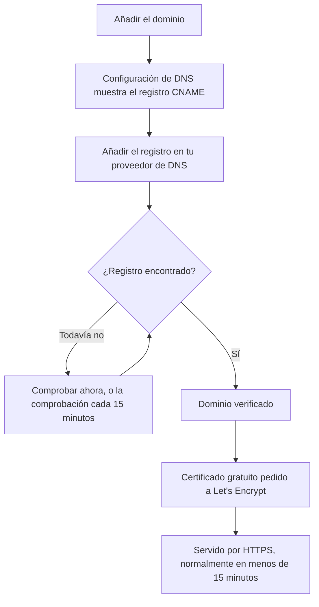

# Marca y dominios de la página de estado

Tu página de estado es la pantalla de OneUptime que miran tus clientes, así que debería parecerse a ti y vivir en tu propio dominio, como `status.yourcompany.com`. Esta página recorre la página **Marca** tarjeta por tarjeta y después pone la página de estado en tu dominio: añade el dominio, añade un registro DNS y el certificado SSL gratuito llega solo.

:::cards
- [La página Marca](#la-página-marca): Logotipo, título, favicon, enlaces, pie de página, colores e idiomas.
- [HTML, CSS y JavaScript personalizados](#html-css-y-javascript-personalizados): Todo lo que los ajustes integrados no cubren.
- [Dominios personalizados](#dominios-personalizados): Tu propio nombre de host, con un certificado gratuito.
- [La columna Estado](#leer-la-columna-estado-del-dominio): En qué punto está cada dominio de su camino a HTTPS.
:::

## Dónde está cada ajuste de marca

Abre una página de estado: la sección **Marca** de su menú lateral tiene tres entradas:

| Página | Qué defines ahí |
| ---- | ------------------ |
| **Marca** | Logotipo e imagen de portada, título y descripción de la página, favicon, enlaces de la cabecera, la descripción de la página de vista general, la línea de copyright y los enlaces del pie de página. Plegados en **Más ajustes**: los colores del gráfico de historial, los idiomas y la indexación en motores de búsqueda. |
| **Dominios personalizados** | Tu propio dominio, su registro DNS y su certificado SSL gratuito. |
| **HTML, CSS y JavaScript** | HTML de la cabecera, HTML del pie de página, CSS personalizado y JavaScript personalizado. |

Tres cosas que parecen de marca están en cambio en **Páginas de estado → tu página → Avanzado → Ajustes avanzados** (`{id}/settings`), porque deciden qué muestra la página y no su aspecto: el porcentaje de tiempo de actividad general, qué estados de monitor cuentan contra el tiempo de actividad y la línea «Powered by OneUptime». Las tres son filas de la tarjeta **Lo que muestra tu página de estado** de esa pantalla.

Antes, la marca estaba repartida en pantallas separadas: **Marca esencial**, **Cabecera**, **Pie de página**, **Página de vista general** e **Idiomas**. Sus antiguas direcciones (`{id}/header-style`, `{id}/footer-style`, `{id}/overview-page-branding` y `{id}/languages`) abren ahora la página **Marca**, así que los marcadores y enlaces antiguos siguen funcionando.

## La página Marca

**Páginas de estado → tu página → Marca → Marca** (`{id}/branding`). Cada tarjeta se guarda por separado. Tras el logotipo, el título y el favicon, las tarjetas siguen tu página de estado de arriba abajo: los enlaces de la cabecera, el texto de la parte superior de la vista general y después el pie de página. Lo que poca gente cambia está plegado en **Más ajustes**, al final.

### Logotipo e imagen de portada

La primera tarjeta, **Logotipo e imagen de portada**, tiene un botón **Editar imágenes** que abre dos pasos:

| Paso | Campos |
| ---- | ------ |
| **Logotipo** | La subida del logotipo (texto de ejemplo `Upload logo`) y **Texto alternativo del logotipo** (texto de ejemplo `Logo of My Company`). Si dejas el texto alternativo vacío, se usa el título de la página de estado. |
| **Imagen de portada** | **Portada**, una subida (texto de ejemplo `Upload cover image`) para el banner ancho detrás de la cabecera, y **Texto alternativo de la imagen de portada**. Deja el texto alternativo vacío si la portada es puramente decorativa. |

El logotipo, la imagen de portada y el favicon son archivos subidos en el propio proyecto de la página de estado, y eso se comprueba cada vez que se guarda uno, desde el panel, la API, Terraform o un flujo de trabajo. Un archivo subido en otro proyecto se rechaza con las mismas palabras que un archivo que ya no existe: "The logo's file could not be found. Upload the logo again.", "The cover image's file could not be found. Upload the cover image again." o "The favicon's file could not be found. Upload the favicon again." Volver a subir la imagen desde la página lo arregla.

Tu página de estado solo muestra imágenes de su propio proyecto; una imagen que no puede mostrar se omite, como si la página no tuviera ninguna. El panel, la API y Terraform leen las imágenes de la página de la misma manera: una imagen de otro proyecto vuelve como ninguna imagen. Los correos que envía la página (a los suscriptores, y a los usuarios privados sobre su inicio de sesión) muestran su logotipo de la misma forma: un logotipo que la página no puede mostrar también se omite de ellos, en lugar de mostrarse como una imagen rota.

### Título, descripción y favicon

- **Título y descripción**: la tarjeta indica que también se usa para SEO. **Editar** abre **Título de la página** (texto de ejemplo `Please enter page title here.`) y **Descripción de la página**. Los buscadores y las vistas previas de enlaces los muestran, así que escríbelos para un cliente, no para tu equipo.
- **Favicon**: **Editar favicon** abre la subida de **Favicon**: el pequeño icono de la pestaña del navegador.

### Enlaces de la cabecera

La tabla **Enlaces de la cabecera** contiene los enlaces de la cabecera de la página de estado, como tu sitio web, tu documentación o un portal de soporte. Cada enlace tiene un **Título** y un **Enlace** (una URL, texto de ejemplo `https://link.com`), y se reordenan arrastrando. Sin enlaces, la tabla dice **No hay enlace de encabezado de estado para esta página de estado**, con **Crear Enlace del encabezado de la página de estado** debajo.

### Descripción de la página de vista general

**Descripción de la página de vista general** es lo primero que aparece en la vista general de la página de estado, por encima de los anuncios, el estado general y tus recursos. **Editar descripción** abre un campo Markdown. Úsalo para una frase de contexto: qué cubre esta página y adónde acudir para obtener soporte. Una imagen que pongas en ella se muestra a todos los visitantes de la página.

### Pie de página

- **Información de copyright**: **Editar copyright** abre un campo, **Información de copyright**, con el texto de ejemplo `Acme, Inc.`.
- **Enlaces del pie de página**: el mismo par **Título** y **Enlace** que los enlaces de la cabecera, ordenados arrastrando. Sin enlaces, dice «No hay enlace de pie de página de estado para esta página de estado.»

Los enlaces de la cabecera son para navegar; los del pie de página, para la letra pequeña, como el aviso legal, la privacidad y los términos.

### Más ajustes

La última sección de la página está plegada en **Más ajustes**, porque poca gente cambia lo que contiene. Plegada, su cabecera nombra sus cuatro secciones (**Color de barra predeterminado**, **Reglas de color de las barras**, **Idiomas** e **Indexación en motores de búsqueda**) y muestra cada una que difiere de lo que trae una página de estado nueva: un color de barra predeterminado distinto del verde con el que empieza toda página, cualquier regla de color de barra, un idioma predeterminado distinto del inglés, una lista de idiomas más corta o la indexación desactivada. Haz clic en ella para abrirla: es una sola tarjeta, con las cuatro secciones una debajo de otra, cada una con su título y su botón, separadas por divisores.

**Colores del gráfico de historial.** Son los únicos ajustes de color integrados de una página de estado.

- **Color de barra predeterminado del gráfico de historial**: **Editar color de barra predeterminado** abre el selector **Color de barra predeterminado**. Toda página de estado nueva empieza con verde. Con reglas de color, es también el color de un día al que no se aplica ninguna regla. Un día del que la página no tiene datos siempre se dibuja en gris.
- **Reglas para los colores de las barras del gráfico de historial**: una tabla ordenada de reglas que ordenas arrastrando. Cada regla tiene **Cuando el % de tiempo de actividad es mayor o igual que** y **Entonces, usa este color de barra**; las columnas de la tabla dicen `When Uptime Percent >=` y `Then, Bar Color is`. El color de una regla nueva ya viene elegido, uno que las demás reglas aún no usan; elige en su lugar el que quieras. El orden importa, así que coloca las reglas en el orden en que quieras que se evalúen. Sin reglas, la barra de cada día toma el color del estado de monitor más bajo de ese día.

Cuántos días abarca el gráfico no se define aquí. Eso es **Historial de tiempo de actividad**, en la tarjeta **Lo que muestra tu página de estado** de **Avanzado → Ajustes avanzados**, de 1 a 90 días. Qué estados de monitor cuentan como caída es **Cuenta como tiempo de inactividad**, en la misma fila de esa tarjeta.

**Idiomas.** La sección **Idiomas** define el selector de idioma que los visitantes tienen en el pie de página. **Editar idiomas** abre dos campos:

| Campo | Qué hace |
| ----- | ------------ |
| **Idioma predeterminado** | El idioma que ven los visitantes nuevos, elegido de una lista que nombra cada idioma en su propia lengua y en inglés (`Deutsch (German)`). Su valor predeterminado es el inglés, y los visitantes siempre pueden cambiarlo desde el pie de página. |
| **Idiomas habilitados** | Una selección múltiple, texto de ejemplo `All languages`. Déjala vacía y se ofrecen todos los idiomas admitidos; elige algunos y el pie de página solo lista esos. |

OneUptime incluye diecisiete idiomas: inglés, alemán, francés, español, italiano, portugués, neerlandés, danés, noruego, sueco, ruso, japonés, coreano, chino (simplificado), chino (tradicional), hindi y persa.

**Indexación en motores de búsqueda.** Un interruptor, **Permitir que los motores de búsqueda indexen esta página de estado**, decide si Google, Bing y otros buscadores pueden incluir la página. Está activado de forma predeterminada. No hay botón **Editar**: el interruptor se guarda en cuanto lo cambias. Desactívalo y la página se sirve con `noindex, nofollow` (una etiqueta meta robots y una cabecera `X-Robots-Tag`); cualquiera que tenga el enlace puede seguir abriéndola. Los buscadores pueden tardar unas semanas en retirar una página que ya habían indexado.

> [!TIP]
> Desactiva **Permitir que los motores de búsqueda indexen esta página de estado** mientras una página sea solo interna o aún se esté configurando, para que una página a medio hacer no empiece a posicionarse con el nombre de tu marca.

## Porcentaje de tiempo de actividad y estados de inactividad

Ambos están en la fila **Historial de tiempo de actividad** de la tarjeta **Lo que muestra tu página de estado**, en **Páginas de estado → tu página → Avanzado → Ajustes avanzados** (`{id}/settings`). No hay botón **Editar**: cada uno se guarda en cuanto lo cambias.

- **Mostrar porcentaje de tiempo de actividad general**: un interruptor, desactivado de forma predeterminada. Mientras está activado, **Precisión** a su lado elige cuántos decimales muestra el porcentaje: `99%`, `99.9%`, `99.99%` (el predeterminado) o `99.999%`. En OneUptime Cloud, activar el porcentaje requiere el plan **Scale**; su precisión puede cambiarse en todos los planes.
- **Cuenta como tiempo de inactividad**: los estados de monitor, como etiquetas de colores, cuyo tiempo cuenta contra el tiempo de actividad en esta página. Aquí decides, por ejemplo, si un estado degradado cuenta contra el tiempo de actividad. Siempre queda al menos un estado elegido.

Antes eran dos tarjetas propias, **Porcentaje de tiempo de actividad general** y **Estados de monitor de tiempo de inactividad**, cada una tras un botón **Editar**. Consulta [Visión general de las páginas de estado](/docs/status-pages/index#elegir-qué-se-muestra-en-la-página) para el resto de la tarjeta.

## HTML, CSS y JavaScript personalizados

**Páginas de estado → tu página → Marca → HTML, CSS y JavaScript** (`{id}/custom-code`) tiene cuatro tarjetas, cada una editada por separado y guardada en una columna de la página de estado:

| Tarjeta | Columna | Qué contiene |
| ---- | ------ | ------------- |
| **HTML de la cabecera** | `headerHTML` | HTML añadido a la cabecera de la página (texto de ejemplo `Insert Custom HTML here.`). |
| **HTML del pie de página** | `footerHTML` | HTML añadido al pie de la página. |
| **CSS personalizado** | `customCSS` | Estilos para toda la página (texto de ejemplo `Insert Custom CSS here.`). |
| **JavaScript personalizado** | `customJavaScript` | Un script que ejecuta la página (texto de ejemplo `Insert Custom JavaScript here.`). |

> [!IMPORTANT]
> El HTML, el CSS y el JavaScript personalizados solo se sirven en un dominio personalizado verificado. Están desactivados en la dirección predeterminada `/status-page/:id`, porque esa dirección comparte el origen con sesión iniciada de OneUptime.

En OneUptime Cloud, añadir o cambiar cualquiera de ellos requiere el plan **Growth**. Vaciarlos funciona en todos los planes, así que el código personalizado que añadió una prueba siempre se puede quitar.

**No hay selector de tema.** Las páginas de estado de OneUptime no tienen ajuste de tema ni de color de marca: los únicos ajustes de color integrados en cualquier parte son **Color de barra predeterminado** y las reglas de color de las barras del gráfico de historial, en **Más ajustes** de la página **Marca**. Las fuentes, los colores de fondo, los colores de acento y los retoques de diseño pasan todos por **CSS personalizado**. Si buscabas un campo de «color de marca», esta es la respuesta: no existe, y este cuadro es la forma de hacerlo.

> [!WARNING]
> El JavaScript personalizado se ejecuta en los navegadores de tus visitantes, en una página que se abre precisamente cuando alguien cree que algo está roto. Mantenlo pequeño, aloja tú mismo lo que cargue siempre que puedas y pruébalo antes de confiar en él.

## Dominios personalizados

De forma predeterminada, una página de estado está disponible en la URL de vista previa de su pantalla **Vista general**. Para ponerla en tu propio nombre de host, ve a **Páginas de estado → tu página → Marca → Dominios personalizados** (`{id}/domains`).

La tarjeta **Dominios personalizados** dice qué hacer: apunta el registro CNAME de cada dominio al registro CNAME de páginas de estado de tu instalación, y OneUptime emite el certificado SSL del dominio y lo renueva por ti. Si no hay nada configurado, la tabla dice **No se encontraron dominios personalizados**, con **Crear Dominio de la página de estado** debajo. La tabla tiene dos columnas, **Dominio** y **Estado**, y filtros para **Dominio**, **CNAME válido** y **SSL aprovisionado**.

Poner la página en tu dominio lleva tres pasos, y solo los dos primeros son tuyos:

1. **Añadir el dominio**: un subdominio y uno de tus dominios verificados.
2. **Añadir su registro CNAME** en tu proveedor de DNS. El cuadro de diálogo **Configuración de DNS** muestra el registro en cuanto añades el dominio.
3. **El certificado SSL gratuito se emite automáticamente** en cuanto se encuentra el registro. No hay ningún botón que pulsar.



### Antes de empezar

- **El dominio padre debe estar verificado.** La lista **Dominio** solo ofrece los dominios verificados en **Ajustes del proyecto → Dominios**, donde demuestras que un dominio es tuyo con un registro TXT. El enlace **Añadir un dominio** junto al campo abre esa página en una pestaña nueva.
- **Tu instalación necesita un registro CNAME de páginas de estado.** OneUptime Cloud tiene uno. En una instalación autoalojada, apúntalo a un nombre de host que apunte a tu servidor de OneUptime (un registro A), y asegúrate de que el servidor responde en el puerto 80, donde Let's Encrypt lo comprueba. Sin él, la tarjeta y el cuadro de diálogo **Configuración de DNS** dicen «Custom Domains not enabled for this OneUptime installation» en lugar de mostrar un registro.

:::tabs
@tab Docker Compose
```ini title="config.env"
STATUS_PAGE_CNAME_RECORD=oneuptime.yourcompany.com
```
@tab Kubernetes
```yaml title="values.yaml"
statusPage:
  cnameRecord: oneuptime.yourcompany.com
```
:::

### Añadir el dominio

:::steps
#### Abrir Crear Dominio de la página de estado

En **Dominios personalizados**, haz clic en **Crear Dominio de la página de estado**. El cuadro de diálogo ocupa una sola página.

#### Escribir el subdominio

En **Subdominio** (texto de ejemplo `status (leave blank for root)`), escribe solo la etiqueta, como `status`, no el nombre de host completo. Déjalo vacío, o escribe `@`, para usar el dominio raíz (apex).

#### Elegir el dominio

En **Dominio** (texto de ejemplo `Select domain`), elige uno de tus dominios verificados. Un dominio que no has verificado no aparece, porque se rechazaría.

#### Mantener el certificado gratuito o subir el tuyo

**Más campos** está plegado, y su cabecera dice qué certificado usará el dominio: «Emitimos un certificado SSL gratuito para este dominio y lo renovamos automáticamente.» Ábrelo solo para usar un certificado propio: activa **Subir certificado personalizado** y pega el **Certificado** y la **Clave privada del certificado** en formato PEM. Ambos pasan entonces a ser obligatorios.

#### Crear el dominio

Haz clic en **Crear Dominio de la página de estado**. El cuadro de diálogo se cierra y se abre la **Configuración de DNS** del nuevo dominio, con el registro que hay que añadir.
:::

El nombre completo de un dominio queda fijado al añadirlo, así que **Editar** solo cambia su certificado. Para usar otro subdominio, añade ese dominio y elimina el antiguo.

### Configuración de DNS y verificación

El cuadro de diálogo **Configuración de DNS** muestra el registro que hay que añadir en tu proveedor de DNS, un campo por fila, cada uno con un botón de copiar:

| Campo | Qué escribir |
| ----- | ------------- |
| **Tipo** | `CNAME` |
| **Nombre** | El dominio completo que añadiste, por ejemplo `status.yourcompany.com` |
| **Valor** | El registro CNAME de páginas de estado de tu instalación |

> [!NOTE]
> Para un dominio raíz, sin subdominio, el cuadro de diálogo añade una nota: muchos proveedores de DNS no permiten ahí un registro CNAME. Usa en su lugar el registro ALIAS, ANAME o de aplanamiento de CNAME de tu proveedor, con el mismo valor.

OneUptime comprueba cada dominio sin verificar cada 15 minutos y verifica el tuyo en cuanto su registro está activo, vuelvas o no. Para comprobarlo al momento, haz clic en **Comprobar ahora**:

- **El registro aún no se encuentra.** El cuadro de diálogo sigue abierto y dice qué registro buscó. Un registro DNS nuevo puede tardar un rato en aparecer: vuelve a hacer clic en **Comprobar ahora** más tarde, o deja que lo haga la comprobación de cada 15 minutos.
- **El registro se encuentra.** El cuadro de diálogo dice «Tu registro CNAME está verificado.» y qué pasa después con el certificado. El certificado gratuito se pide en ese momento.

Hasta que un dominio esté verificado y su certificado esté listo, su fila tiene una acción **Configuración de DNS** que abre el mismo cuadro de diálogo. En un dominio verificado cuyo pedido de certificado falla una y otra vez, o cuyo certificado ha caducado, **Comprobar ahora** vuelve a pedirlo ahí y muestra por qué falló el último pedido. Pide como mucho una vez por dominio cada 15 minutos; entretanto, OneUptime sigue intentándolo por su cuenta.

### Certificados SSL

Cada dominio personalizado recibe un certificado gratuito de Let's Encrypt, emitido y renovado automáticamente. No hay nada que pulsar:

- **Comprobar ahora** pide el certificado en cuanto se encuentra el registro. El cuadro de diálogo dice entonces que el certificado suele estar activo en menos de 15 minutos.
- Cuando la comprobación de cada 15 minutos verifica un dominio, pide el certificado del dominio en esa misma comprobación.
- La renovación es automática, mucho antes de que caduque el certificado. Si tu DNS no responde un momento mientras se renueva un certificado, el certificado se sigue sirviendo y se renueva en un intento posterior. Una comprobación de DNS fallida nunca retira un certificado que aún es válido.

Un certificado nuevo se sirve en menos de 15 minutos desde su emisión, porque esa es la frecuencia con la que los certificados se escriben en los servidores que responden por tu dominio. La columna Estado dice _normalmente_ en menos de 15 minutos: cuando muchos dominios esperan a la vez, se procesan de pocos en pocos.

Cada certificado de OneUptime se pide desde una cuenta compartida de Let's Encrypt, y Let's Encrypt limita cuántos pedidos nuevos puede hacer una cuenta en poco tiempo y cuántas veces puede fallar un pedido para el mismo dominio. OneUptime mantiene todos sus pedidos (dominios nuevos, **Comprobar ahora**, reemisiones y renovaciones) dentro de esos límites en conjunto, y las renovaciones siempre van primero, así que una avalancha de dominios nuevos nunca retrasa las renovaciones que mantienen en línea los dominios existentes.

Si un pedido falla, la columna Estado lo dice, con el motivo en la línea de debajo, y **Comprobar ahora** en **Configuración de DNS** también lo muestra. OneUptime sigue intentándolo por su cuenta, esperando un poco más tras cada fallo consecutivo, de modo que un dominio cuyo pedido falla una y otra vez no agote los pedidos que necesitan todos los demás dominios. Las causas habituales son un registro CAA en tu dominio que no permite `letsencrypt.org` y, en una instalación autoalojada, un servidor al que Let's Encrypt no puede llegar por el puerto 80; en una instalación autoalojada, los registros del worker tienen los detalles. Cuando hayas corregido la causa, haz clic en **Comprobar ahora** para volver a pedirlo al momento. Hace como mucho un pedido por dominio cada 15 minutos; un clic entretanto muestra cómo fue el último pedido.

Si subiste tu propio certificado en **Más campos**, OneUptime sirve ese en su lugar, en menos de 15 minutos desde que lo guardas. Sube su sustituto antes de que caduque editando el dominio.

### Volver a emitir un certificado

La renovación automática cubre el caso normal, pero a veces quieres un certificado completamente nuevo ahora mismo: una clave privada que prefieres no conservar, un certificado que no le gusta a tu propio escáner o un dominio que cambió aguas arriba. En cuanto se ha pedido un certificado gratuito para un dominio, su fila muestra una acción **Volver a emitir SSL**.

Su cuadro de diálogo, **Volver a emitir el certificado SSL de esta página de estado**, pide a Let's Encrypt un certificado nuevo para el dominio y sustituye con él el que se está sirviendo. Tu página de estado sigue en línea con el certificado existente mientras tanto, y el nuevo se sirve en menos de 15 minutos. Haz clic en **Volver a emitir el certificado SSL** para pedirlo.

> [!NOTE]
> Un dominio solo se puede volver a emitir una vez cada 24 horas. Let's Encrypt limita la frecuencia con la que puede emitirse el mismo dominio, y cada certificado de OneUptime se pide desde una cuenta compartida, incluidas las renovaciones automáticas que mantienen en línea las páginas de todos los demás. Dentro de ese plazo, el cuadro de diálogo te dice cuánto falta en lugar de hacer el pedido. Si en ese momento se está pidiendo un certificado para el dominio, o los pedidos de Let's Encrypt de la instalación se han agotado por ahora, el cuadro de diálogo lo dice, no se pide nada y la pulsación no cuenta como tu reemisión.

La acción no aparece en un dominio que usa un certificado que subiste tú: no hay certificado de Let's Encrypt que volver a emitir, así que sube uno nuevo editando el dominio. Tampoco aparece antes de que se pida el primer certificado del dominio, cosa que ocurre sola en cuanto se verifica su registro CNAME.

El mismo botón, con el mismo límite de 24 horas, está en los dominios personalizados de los paneles, en **Paneles → tu panel → Marca → Dominios personalizados**, que funcionan igual que los dominios personalizados de las páginas de estado: consulta [Compartir y paneles públicos](/docs/dashboards/sharing#dominios-personalizados).

### Leer la columna Estado del dominio

La columna **Estado** dice en qué punto está cada dominio de su camino a HTTPS, en uno de siete estados. Cuando un pedido ha fallado, el motivo aparece en la línea de debajo.

| Lo que dice la columna Estado | Qué significa |
| --------------------------- | ------------- |
| Esperando al DNS: añade el registro CNAME. | El registro CNAME aún no se encuentra. Abre **Configuración de DNS** para ver el registro, añádelo en tu proveedor de DNS y después haz clic en **Comprobar ahora** o espera a la comprobación de cada 15 minutos. |
| Emitiendo un certificado gratuito, normalmente en menos de 15 minutos. | El registro está verificado y el certificado se está pidiendo o escribiendo. No hay nada que hacer. |
| Todavía no se ha podido emitir un certificado gratuito. Lo seguimos intentando. | El registro está verificado, pero el pedido de su certificado falló, por el motivo de la línea de debajo. Corrige la causa, abre **Configuración de DNS** y haz clic en **Comprobar ahora** para volver a pedirlo al momento. |
| Certificado caducado. Seguimos intentando renovarlo. | El certificado del dominio ha caducado porque sus renovaciones fallaron. Abre **Configuración de DNS** y haz clic en **Comprobar ahora** para renovarlo al momento y ver por qué. |
| Certificado emitido, se renueva automáticamente. | Listo. El dominio sirve su certificado por HTTPS, y OneUptime lo renueva. |
| Certificado emitido, pero su renovación ha fallado. Lo seguimos intentando. | El dominio sigue sirviendo un certificado válido, pero su última renovación falló, por el motivo de la línea de debajo. OneUptime lo vuelve a intentar mucho antes de que caduque el certificado. |
| Usa tu certificado subido. | El registro está verificado y el dominio se sirve con el certificado que subiste. |

:::details Un dominio sigue en «Esperando al DNS» mucho después de añadir el registro
Comprueba que el nombre del registro sea el dominio completo, como `status.yourcompany.com`, y que su valor coincida exactamente con el registro CNAME de tu instalación. En un dominio raíz, usa un registro ALIAS, ANAME o CNAME aplanado. Después haz clic en **Comprobar ahora** en **Configuración de DNS**.
:::

:::details La columna Estado dice que no se pudo emitir un certificado gratuito
Busca en tu dominio un registro CAA que deje fuera `letsencrypt.org` y, en una instalación autoalojada, comprueba que tu servidor responde en el puerto 80. Corrige la causa y haz clic en **Comprobar ahora** en **Configuración de DNS** para volver a pedirlo.
:::

### Quién puede comprobar y volver a emitir

**Comprobar ahora**, pedir el certificado de un dominio y **Volver a emitir SSL** cambian el dominio, así que necesitan permiso para editarlo: **Edit Status Page Domain**, o un rol que lo incluya (Project Owner, Project Admin, Project Member, Status Page Admin o Status Page Member).

Alguien que solo puede leer el dominio, como un Viewer o un Status Page Viewer, sigue viendo la columna **Estado** y el registro que hay que añadir en **Configuración de DNS**. Para esa persona, **Comprobar ahora** y **Volver a emitir SSL** están bloqueados y dicen qué permiso necesita. OneUptime sigue comprobando cada dominio y pidiendo su certificado por su cuenta de todos modos.

Lo mismo vale para las claves de API. Una clave que solo puede leer los dominios de páginas de estado no puede llamar a `verify-cname`, `order-ssl` ni `reissue-ssl` en `/status-page-domain`. Dale **Read Status Page Domain** y **Edit Status Page Domain** si lo necesita.

## Powered by OneUptime

La línea «Powered by OneUptime» no es un ajuste de marca. Es el último interruptor de la tarjeta **Lo que muestra tu página de estado**, en **Páginas de estado → tu página → Avanzado → Ajustes avanzados** (`{id}/settings`): **Mostrar la marca Powered By OneUptime**, activado de forma predeterminada. Desactívalo para ocultar la línea; se guarda al momento. En OneUptime Cloud, ocultarla requiere el plan **Scale**.

## Próximos pasos

:::cards
- [Visión general de las páginas de estado](/docs/status-pages/index): Qué muestra la página y quién puede verla.
- [Recursos y grupos de la página de estado](/docs/status-pages/resources-and-groups): Elige lo que los visitantes ven realmente en la página.
- [Suscriptores y anuncios](/docs/status-pages/subscribers): Los correos que llevan tu logotipo y enlazan a tu dominio.
- [API pública](/docs/status-pages/public-api): Lee la página como JSON, también en tu propio dominio.
:::
