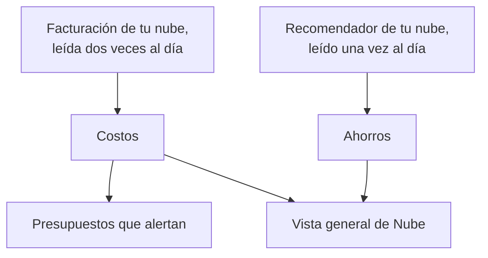

# Costos y ahorros en la nube

Una cuenta en la nube conectada también dice cuánto cuesta y cómo podría costar menos. OneUptime lee los costos de cada día de la propia facturación de tu nube y las recomendaciones del propio recomendador de tu nube, los muestra en **Nube → Gasto → Costos** y **Nube → Gasto → Ahorros**, lista tus Savings Plans, reservas y descuentos por compromiso de uso en **Nube → Gasto → Compromisos**, y alerta antes de que un mes cueste más que su presupuesto en **Nube → Gasto → Presupuestos**.

:::cards
- [Amazon Web Services](#amazon-web-services): Cost Explorer y Cost Optimization Hub, cada uno activado una vez.
- [Microsoft Azure](#microsoft-azure): Cost Management y Azure Advisor, con un rol más.
- [Google Cloud](#google-cloud): Tu exportación de facturación a BigQuery y el Recommender.
- [Facturado, amortizado y neto](#facturado-amortizado-y-neto): Cada costo de tres maneras, para que los compromisos y los créditos caigan donde fue el dinero.
- [Compromisos y renovaciones](#compromisos-y-renovaciones): Cada compromiso, alertas antes de que termine uno o mientras se usa poco, y qué renovar o comprar.
- [Presupuestos](#presupuestos): Una alerta cuando el gasto de un mes supera una parte de su presupuesto.
:::

## Cómo funciona


```mermaid title="De la facturación de tu nube a las páginas de Nube"
flowchart TB
    bill["Facturación de tu nube,<br/>leída dos veces al día"] --> costs["Costos"]
    rec["Recomendador de tu nube,<br/>leído una vez al día"] --> savings["Ahorros"]
    costs --> budgets["Presupuestos que alertan"]
    costs --> overview["Vista general de Nube"]
    savings --> overview
```

- **Los costos vienen de la propia facturación de tu nube.** AWS Cost Explorer, Azure Cost Management y la exportación de facturación de Google Cloud a BigQuery, en la moneda en que se factura la cuenta, cada uno guardado facturado, amortizado y neto: consulta [Facturado, amortizado y neto](#facturado-amortizado-y-neto). Cada cifra es la de un día, en días UTC, como los factura tu nube.
- **Una nube informa del último día o dos con retraso.** Cada lectura vuelve a tomar la última semana, y todo el mes pasado en los primeros días de un mes, así que el costo de un día se asienta a medida que tu nube lo termina. La primera lectura de una conexión retrocede hasta el inicio del penúltimo mes.
- **La proyección del mes es el ritmo de la última semana.** Es lo que el mes ha costado hasta ahora, con cada día que queda al promedio de los últimos siete días completos.
- **Los ahorros vienen del propio recomendador de tu nube.** AWS Cost Optimization Hub, Azure Advisor y el Recommender de Google Cloud: un tamaño menor, un recurso inactivo, un compromiso que vale la pena, cada uno con lo que ahorraría al mes. Una recomendación que aplicas o descartas en la consola de tu nube desaparece en la siguiente lectura.

## Antes de empezar

- **Una cuenta conectada.** [Conectar una cuenta en la nube](/docs/telemetry/cloud-accounts) con el comando de configuración actual: permite que la conexión lea costos y recomendaciones. Una conexión creada antes no lee ninguno de los dos hasta que vuelvas a ejecutar su comando.

## Amazon Web Services

La conexión lee los costos con `ce:GetCostAndUsage`, sus compromisos con `ce:GetSavingsPlansCoverage`, `ce:GetSavingsPlansUtilization`, `ce:GetSavingsPlansUtilizationDetails`, `ce:GetReservationCoverage` y `ce:GetReservationUtilization`, los Savings Plans comprados con `savingsplans:DescribeSavingsPlans`, y las recomendaciones con `cost-optimization-hub:ListRecommendations` y `cost-optimization-hub:GetRecommendation`. El comando de configuración concede las lecturas de Cost Explorer como tres familias, `ce:GetCostAndUsage*`, `ce:GetSavingsPlans*` y `ce:GetReservation*`, todas ellas lecturas, para que el usuario de una clave de acceso siga cabiendo en los 2048 caracteres que IAM permite a su política. Cost Explorer y Cost Optimization Hub necesitan activarse antes en la cuenta:

:::steps
### Activar Cost Explorer

Abre Cost Explorer una vez en la consola de AWS Billing and Cost Management: AWS prepara los costos de la cuenta en menos de un día. Conecta la cuenta de administración de la organización para leer los costos de cada cuenta miembro.

### Activar Cost Optimization Hub

Abre Cost Optimization Hub en la misma consola y actívalo, para la organización desde su cuenta de administración o solo para la cuenta. Sus recomendaciones llegan en menos de un día.
:::

Cost Explorer cobra $0.01 por cada solicitud: una lectura de los costos hace dos o unas pocas más, una para facturado y amortizado y otra para neto, y los compromisos se leen con cuatro al día para su cobertura y uso, y seis a doce más al día para los de cada uno. La API de Savings Plans y Cost Optimization Hub son gratuitos.

### Costos por recurso

Cost Explorer también indica lo que cuesta cada recurso, de los últimos 14 días, una vez activados los datos a nivel de recurso. En la consola AWS Billing and Cost Management, abre las preferencias de Cost Management y activa los datos a nivel de recurso con granularidad diaria, para la organización desde su cuenta de administración. AWS los prepara en 48 horas.

Luego edita la conexión en **Nube → Conectar** y, en **Más campos**, activa **Costos por recurso**. La conexión los lee con `ce:GetCostAndUsageWithResources` una vez al día: los 14 días la primera vez y después los tres últimos de nuevo, con unas pocas solicitudes cada vez. Lo que lee se queda con los costos de la cuenta después de que Cost Explorer lo olvide. Una conexión creada antes necesita volver a ejecutar su comando de configuración, que añade la acción.

## Microsoft Azure

La aplicación lee los costos con el rol **Cost Management Reader**, en el mismo ámbito que **Monitoring Reader**: el comando de configuración concede ambos. Las recomendaciones de Azure Advisor se leen con **Monitoring Reader**, así que no hay nada que activar. Para dar el rol a una aplicación creada antes, ejecuta:

```bash
az role assignment create --assignee <APP_ID> --role "Cost Management Reader" --scope /subscriptions/<SUBSCRIPTION_ID>
```

Cost Management responde por cada suscripción, con el recurso al que corresponde cada costo, y leerlo no cuesta nada. Cuando no puede responder por una suscripción, los **Costos** de la cuenta dicen por qué.

Cost Management limita la rapidez con la que se leen los costos de un inquilino, igual para todos los que los leen: cada consulta cuesta una unidad de procesamiento de consultas (QPU) por cada mes de datos que lee, y un inquilino tiene 12 QPU cada 10 segundos, 60 por minuto y 600 por hora. OneUptime lee las suscripciones de un inquilino una tras otra dentro de dos tercios de cada cuota, espera lo que Cost Management pida cuando rechaza una consulta y sigue en la siguiente lectura donde se quedó. Una suscripción aún sin leer dice **En cola**, con cuándo se lee; una que ya tiene cifras las conserva mientras tanto. Su costo amortizado se lee en cada lectura y su costo real una vez al día, así que la primera lectura de una suscripción consulta Cost Management dos veces y gasta el doble de unidades de consulta: las primeras cifras de un inquilino grande tardan unas pocas lecturas más.

Las reservas y los planes de ahorro del inquilino se leen con **Reservations Reader** y **Savings plan Reader**, que Azure concede en el ámbito del propio inquilino, donde solo un administrador global con acceso elevado puede concederlos. El comando de configuración lo intenta, y lo dice cuando no puede. Para concederlos más tarde, como administrador global con acceso elevado:

```bash
az role assignment create --assignee <APP_ID> --role "Reservations Reader" --scope /providers/Microsoft.Capacity
az role assignment create --assignee <APP_ID> --role "Savings plan Reader" --scope /providers/Microsoft.BillingBenefits
```

Sin ellos, los costos y las recomendaciones se leen como antes, y **Nube → Gasto → Compromisos** indica qué rol conceder.

## Google Cloud

Google Cloud no tiene ninguna API para los costos de un proyecto: OneUptime los lee de la exportación de tu cuenta de facturación a BigQuery.

:::steps
### Exportar tu facturación a BigQuery

En la consola de Google Cloud, abre Billing, luego Billing export, y activa la exportación del costo de uso detallado a un conjunto de datos de BigQuery. Google la escribe con unas horas de retraso, desde el día en que la activas.

### Permitir que la cuenta de servicio la lea

Da a la cuenta de servicio de la conexión **BigQuery Data Viewer** en el conjunto de datos de la exportación. El comando de configuración ya le dio **BigQuery Job User**, para ejecutar la consulta en su propio proyecto.

### Indicar la tabla de la exportación

Edita la conexión en **Nube → Conectar** y, en **Más campos**, pon en **Tabla de la exportación de facturación** el nombre completo de la tabla: `<PROJECT_ID>.<DATASET>.gcp_billing_export_resource_v1_<BILLING_ACCOUNT_ID>`.
:::

La exportación detallada indica el recurso al que corresponde cada costo; la estándar solo dice el servicio y la región. BigQuery factura la consulta: el primer 1 TiB al mes es gratuito, luego $6.25 por TiB, y un mes de una exportación ocupa de unos pocos megabytes a unos pocos gigabytes. Las recomendaciones de tipo de máquina y de recursos inactivos del Recommender se leen con **Compute Recommender Viewer**, que concede el comando de configuración, y no cuestan nada. Los compromisos de Compute Engine se listan desde Cloud Asset Inventory con **Cloud Asset Viewer**, que el comando de configuración ya concede: no hay nada más que dar.

## Facturado, amortizado y neto

Cada costo se guarda de tres maneras, y **Nube → Gasto → Costos**, los **Costos** de una cuenta, la vista general de Nube y los presupuestos muestran la que elijas:

- **Facturado** es cada cargo el día en que tu nube lo facturó, antes de créditos y reembolsos. Un Savings Plan o una reserva pagados por adelantado son un solo cargo grande el día de su compra, y el uso que cubren parece gratis el resto de su plazo.
- **Amortizado** reparte las tarifas de cada compromiso sobre los días y recursos que cubre, para que el dinero caiga donde se gastó. Sigue siendo antes de créditos y reembolsos. Es lo que muestran las páginas salvo que elijas otra.
- **Neto** es el amortizado, menos créditos, reembolsos y descuentos: lo que suma la factura.

| | Facturado | Amortizado | Neto |
|---|---|---|---|
| AWS | El costo no combinado (unblended) de Cost Explorer | El costo amortizado de Cost Explorer | El costo amortizado neto de Cost Explorer, con créditos y reembolsos |
| Azure | El costo real de Cost Management | El costo amortizado de Cost Management | El costo amortizado: Azure descuenta los créditos en la cuenta de facturación, que la conexión de una suscripción no lee |
| Google Cloud | El costo de la exportación | El costo menos los créditos de los descuentos por compromiso de uso y de las suscripciones | El costo menos todos los créditos |

El selector sobre las cifras cambia la base en la página, y OneUptime recuerda tu elección en este proyecto, en tu navegador. La base propia del proyecto, con la que se abren las páginas y que vigilan los presupuestos, está en **Nube → Ajustes → Ajustes de costos**. Un presupuesto puede vigilar una base propia: edítalo y define **Base de costo**.

Los costos leídos antes de que se guardaran los tres muestran su cifra facturada en cada base. Cada conexión vuelve a leer sus costos una vez, tan atrás como una primera lectura, para que cada base se complete.

## Formas de gastar menos

**Nube → Gasto → Ahorros** enumera cada recomendación, el mayor ahorro primero: qué hacer, en qué recurso, qué cambiaría y cuánto ahorra al mes. La franja de arriba las suma, en total y por tipo: un tamaño menor, un recurso inactivo, un compromiso. Una recomendación enlaza a la página de su recurso cuando OneUptime tiene el recurso.

### Ajuste de tamaño con las propias lecturas de OneUptime

Un recurso del que no se ocupa ningún recomendador, porque no está activado, no cubre su tipo o lo considera demasiado nuevo, lo dimensiona OneUptime con las lecturas de CPU y memoria que su conexión tomó en los últimos 14 días. OneUptime dimensiona instancias EC2, bases de datos RDS y clústeres de ElastiCache en AWS, máquinas virtuales, servidores flexibles de PostgreSQL y MySQL y planes de App Service en Azure, y máquinas virtuales de Compute Engine e instancias de Cloud SQL en Google Cloud:

- **Sobreaprovisionado** cuando el tamaño la mitad de grande, o una cuarta parte, aún tendría margen: en el tamaño menor, el percentil 95 de su CPU sería como mucho del 60 %, su lectura de CPU más alta como mucho del 100 % y el pico de su memoria como mucho del 70 %, cuando se lee su memoria.
- **Infraaprovisionado** cuando el percentil 95 de su CPU es del 85 % o más, o el pico de su memoria del 90 % o más: el tamaño el doble de grande.

Un recurso se dimensiona en cuanto tiene 6 días de lecturas. Su página muestra su **Ajuste de tamaño** junto a lo que cuesta, y uno sobreaprovisionado aparece en **Nube → Gasto → Ahorros**, con OneUptime como origen. Lo que ahorra un cambio es su parte de lo que el recurso costó en los últimos 30 días, así que se conoce en cuanto tu nube factura el recurso por su nombre: la exportación detallada de Azure y de Google Cloud lo hace, y AWS también una vez activado Costos por recurso. Una instancia EC2 solo informa de su memoria con el agente de CloudWatch, y una máquina virtual de Compute Engine solo con el Ops Agent: sin él, se dimensiona solo por su CPU. Los tamaños con ráfagas, como t3, la serie B y e2-micro, nunca se dimensionan.

### Compromisos

**Nube → Gasto → Ahorros** y los **Costos** de una cuenta muestran cuánto del gasto de los últimos 30 días pagaron los compromisos de cada cuenta, y cuánto de ellos se usó, una línea por tipo:

- AWS: Savings Plans e instancias reservadas, desde Cost Explorer. La cuenta de administración de una organización los lee para cada cuenta de la organización.
- Azure: planes de ahorro y reservas, desde Cost Management, en costo amortizado.
- Google Cloud: descuentos por compromiso de uso, desde tu exportación de facturación. La exportación no dice cuánto de un compromiso quedó sin usar, así que no se muestra cuánto se usa.

Una cuenta sin compromisos indica lo que se ejecutó a tarifas bajo demanda y que un compromiso pagaría a menor precio. Las cifras de cada tipo son las de su nube, y los tipos nunca se suman: una reserva y un Savings Plan pueden contar ambos el gasto de la misma máquina como suyo para cubrir. Cada compromiso por separado aparece en **Nube → Gasto → Compromisos**: consulta [Compromisos y renovaciones](#compromisos-y-renovaciones).

## Compromisos y renovaciones

**Nube → Gasto → Compromisos** lista cada Savings Plan, reserva y descuento por compromiso de uso que tus conexiones pueden leer, para que ninguno termine sin que lo notes:

- **Compromisos activos**, arriba, cuenta los activos y los que terminan en 90 días, **Utilización** cuánto de ellos se usó en los últimos 30 días y lo que quedó sin usar, y **Cobertura** cuánto del gasto cubren.
- **Terminan pronto** lista los que terminan en 90 días y no se renuevan solos, cada uno con su plan de renovación: qué comprar para conservar su descuento (su compromiso por hora o sus instancias, en la parte que se usó), cuánto cuesta y ahorra al mes, cuándo se amortiza y cuánto del gasto está cubierto ahora y cuando termine. **Renovar en la consola** abre la página donde tu nube lo renueva.
- **Todos los compromisos** es la lista completa: qué es y qué cubre cada uno, su cuenta, cuándo termina, su plazo y opción de pago, cuánto de él se usó en los últimos 30 días, y el uso que pagó y lo que ahorró.
- **Planes de compra** son lo que el recomendador de tu nube sugiere comprar, cada uno con lo que costaría y ahorraría al mes, cuándo se amortizaría y cómo cambiaría la cobertura. **Comprar en la consola** abre la página donde comprarlo.
- Debajo, los compromisos de cada cuenta por tipo, como los muestran sus **Costos**, y cuándo alertan los compromisos, con **Cambiar alertas**.

OneUptime solo planifica: nunca compra, renueva ni devuelve un compromiso. Tú compras en la consola de tu nube.

| | De dónde vienen los compromisos | Qué se sabe de cada uno |
|---|---|---|
| AWS | Los Savings Plans e instancias reservadas de Cost Explorer, cada uno con su propio uso, y la API de Savings Plans para los planes comprados, incluidos los que están en cola para empezar | Su fin, plazo, opción de pago, compromiso por hora o instancias, tarifas y uso en los últimos 30 y 7 días |
| Azure | Las reservas y los planes de ahorro del inquilino | Su fin, plazo, plan de facturación, si se renueva solo, y uso en los últimos 30 y 7 días |
| Google Cloud | Los compromisos de Compute Engine, desde Cloud Asset Inventory | Su fin, plan, recursos y si se renueva solo. Google Cloud no dice cuánto de un compromiso se usa |

La cuenta de administración de una organización lista los de cada cuenta en AWS. Los descuentos por compromiso de uso basados en el gasto, que Google Cloud guarda en la cuenta de facturación en lugar de en un proyecto, aún no se listan.

### Alertas de compromisos

Los compromisos generan alertas, que avisan por las políticas de guardia como cualquier alerta. En **Nube → Ajustes → Ajustes de costos**, **Alertas de compromisos** dice cuándo:

- **Alertar antes de que termine un compromiso**: 90, 30 y 7 días antes de su fin para empezar. Una alerta en el más cercano de esos días que el compromiso ha alcanzado, y cada uno más cercano sustituye al anterior. Un compromiso que se renueva solo, o cuya renovación está en cola para empezar cuando termine, no genera ninguna.
- **Alertar cuando la utilización sea inferior a**: 80 % para empezar, de los últimos 7 días de un compromiso, una vez que ha funcionado una semana. La alerta se resuelve cuando vuelve su uso.
- **Alertar cuando la cobertura baje de**: 60 % para empezar, del gasto que los compromisos de un tipo de una cuenta podrían cubrir, tras haber cubierto más. Se resuelve cuando vuelve la cobertura. Vacío, la cobertura no genera ninguna alerta.

**Alertar sobre compromisos** las desactiva todas, y **Gravedad de la alerta**, **Políticas de guardia** y **Propietarios** dicen lo graves que son, a quién se avisa y de quién son. Cada alerta dice qué cubre el compromiso y qué pagó, y apunta a su plan de renovación. Una alerta se resuelve sola cuando su compromiso termina, se renueva o deja de listarse.

## Presupuestos

:::steps
### Crear un presupuesto

En **Nube → Gasto → Presupuestos**, crea un presupuesto: su **Importe mensual**, la **Cuenta** a la que se aplica, o ninguna para todas las cuentas, y la **Base de costo** que cuenta, o ninguna para la del proyecto.

### Elegir cuándo alerta

**Alertar en** recibe las partes del presupuesto en las que alertar, en porcentaje: 80 y 100 para empezar. **Alertar si va camino de superarse** también alerta, una vez al mes, cuando el ritmo de la última semana llevaría el mes por encima del presupuesto. **Alertar en días inusuales** también alerta el día después de un día que costó mucho más de lo habitual: consulta [Días inusuales](#días-inusuales). **Gravedad de la alerta** y **Políticas de guardia** dicen lo graves que son las alertas y a quién se avisa.
:::

Un presupuesto se comprueba tras cada lectura de los costos y cada hora. Cuando el gasto del mes supera un umbral, se genera una alerta por él, la más alta si una lectura supera varios a la vez, y un nuevo mes resuelve las alertas del mes pasado. Un presupuesto solo cuenta las cuentas que se facturan en su moneda, sobre su base: un presupuesto amortizado no se dispara por un compromiso pagado por adelantado, que uno facturado cuenta el día de su compra.

Los agentes de IA pueden crear y cambiar presupuestos a través del [servidor MCP](/docs/ai/mcp-server), y los scripts con el comando `oneuptime cloud-budget` de la CLI: consulta [Operaciones de recursos](/docs/cli/resource-operations).

### Días inusuales

Tras cada lectura, cada uno de los últimos 14 días completos de una cuenta se compara con los 14 días anteriores. Un día es inusual cuando un servicio costó el doble de su día habitual o más, o la cuenta entera una vez y media su día habitual o más. En ambos casos debe ser al menos 10 más de lo habitual, en la moneda de la cuenta, y al menos el 5 % del día habitual de la cuenta, para que unos centavos nunca cuenten como un pico. Lo habitual de un día es la mediana de los 14 días anteriores, así que un pico aislado apenas lo mueve, y una cuenta solo se juzga cuando tiene una semana de costos.

**Nube → Gasto → Costos** marca los días inusuales en el gasto diario, sobre sus barras, y los muestra debajo. Sobre todas las cuentas, cada marca abre los **Costos** de su cuenta. Un presupuesto que incluye la cuenta genera una alerta por cada cuenta y día, al día siguiente, que nombra cada servicio que se disparó. Un pico que dura varios días se avisa el día en que empezó, y un día de hace más de una semana no se avisa. Un presupuesto creado antes de que existieran estas alertas no las genera hasta que lo edites y las actives.

## Adónde va el dinero

**Nube → Gasto → Costos** desglosa el gasto de un periodo por servicio, región, cuenta o recurso, y de tres formas más:

- Por entorno de plataformas de aplicaciones: el servicio de plataforma de cada entorno en su cuenta y región, como Amazon ECS o Cloud Run, y los recursos de un entorno de Elastic Beanstalk por la etiqueta que AWS les pone.
- Por aplicación: lo que una plataforma factura a una aplicación por su nombre, como un servicio de Cloud Run o una Container App. Amazon ECS factura sus tareas y App Service sus planes, así que los costos de sus aplicaciones quedan en su entorno.
- Por etiqueta: cada valor de la etiqueta que elijas. Un costo conserva las etiquetas que tenía al leerse: las etiquetas de una exportación de facturación de Google Cloud o, si no, las del recurso al que se factura, lo que en AWS necesita Costos por recurso.

Debajo de la lista, la tarjeta dice a cuánto ascendió el resto: lo que no está en ningún entorno, lo que se factura a un entorno en conjunto o lo que no tiene la etiqueta. Los costos leídos antes de que se guardaran las etiquetas se vuelven a leer una vez, tan atrás como una primera lectura, para que se completen sus etiquetas.

## Qué ves en OneUptime

- **La vista general de Nube.** **Nube → Vista general** muestra el gasto del mes frente al del mes pasado hasta el mismo día, los servicios que más cuestan y las mayores formas de gastar menos, junto a lo que necesita atención.
- **El gasto de cada día.** **Nube → Gasto → Costos** dibuja cada uno de los últimos 30 días con los días que costaron mucho más de lo habitual marcados, muestra esos días y desglosa un periodo por servicio, región, cuenta, recurso, entorno de plataformas de aplicaciones, aplicación o etiqueta, facturado, amortizado o neto. Las cuentas cuyos costos no se leen aparecen debajo, cada una con el motivo.
- **Cada compromiso.** **Nube → Gasto → Compromisos** lista cada uno con cuándo termina y cuánto de él se usa, los que terminan pronto con qué renovar, y qué comprar.
- **Los costos de una cuenta.** Los **Costos** de una cuenta muestran lo mismo solo para la cuenta, con sus compromisos y sus formas de gastar menos.
- **El costo de un recurso.** La página de un recurso muestra lo que costó este mes y en los últimos 30 días cuando su nube lo factura por su nombre, con sus formas de gastar menos y su ajuste de tamaño.

## Solución de problemas

:::details Una cuenta dice Necesita permiso
La conexión todavía no puede leer los costos de la cuenta. Vuelve a ejecutar su comando de configuración desde **Nube → Conectar**: añade lo que necesita leer los costos. En Google Cloud, da también a la cuenta de servicio **BigQuery Data Viewer** en el conjunto de datos de la exportación.
:::

:::details Una cuenta dice Sin configurar
Su nube todavía no tiene costos que dar. En AWS, activa Cost Explorer; en Google Cloud, indica la tabla de la exportación en **Tabla de la exportación de facturación**. Las primeras cifras llegan con la siguiente lectura, en menos de 12 horas.
:::

:::details Una cuenta dice En cola
Sus costos esperan su turno: Azure Cost Management limita la rapidez con la que se leen los costos de un inquilino. La cuenta dice cuándo se leen, en la primera lectura de la conexión a partir de entonces, y no hay nada que hacer. Una cuenta que ya tiene cifras las conserva mientras tanto.
:::

:::details Costos por recurso dice Sin configurar
Los datos a nivel de recurso no están activados para la cuenta. Actívalos con granularidad diaria en las preferencias de Cost Management de la consola AWS Billing and Cost Management, desde la cuenta de administración de la organización para sus miembros. AWS los prepara en 48 horas, y la lectura del día siguiente los toma.
:::

:::details Los compromisos dicen Necesita permiso
La conexión aún no puede leer los Savings Plans ni las reservas de la cuenta. Vuelve a ejecutar su comando de configuración desde **Nube → Conectar**: añade las acciones con las que se leen. En Azure, un administrador global con acceso elevado concede **Reservations Reader** y **Savings plan Reader**: consulta [Microsoft Azure](#microsoft-azure).
:::

:::details Amortizado y neto muestran lo mismo que facturado
Los costos leídos antes de que se guardaran los tres muestran su cifra facturada en cada base hasta la siguiente lectura de costos de la conexión, que los vuelve a leer tan atrás como la primera. En Azure, el neto es siempre el costo amortizado.
:::

:::details Un compromiso termina y no llegó ninguna alerta
Un compromiso que se renueva solo, o cuya renovación está en cola para empezar cuando termine, no genera ninguna, y tampoco uno de un proyecto cuyas alertas de compromisos están desactivadas en **Nube → Ajustes → Ajustes de costos**. Una alerta también necesita que el proyecto tenga una gravedad de alerta.
:::

:::details Las cifras dejan fuera una cuenta
Las cifras están en la moneda en que se factura la mayoría de tus cuentas. Una cuenta facturada en otra aparece debajo con su moneda, y un presupuesto solo cuenta las cuentas facturadas en la suya.
:::

:::details Este mes es más bajo que en la consola de tu nube
Tu nube informa del último día o dos con retraso, y las cifras facturadas y amortizadas son antes de créditos y reembolsos. Las siguientes lecturas se ponen al día. Compara con la base que muestra la consola de tu nube: AWS se abre en los costos no combinados, que son los facturados.
:::

## Próximos pasos

:::cards
- [Conectar una cuenta en la nube](/docs/telemetry/cloud-accounts): Conecta otra cuenta o vuelve a ejecutar su comando.
- [Recursos en la nube](/docs/telemetry/cloud-resources): Las métricas de cada recurso, desde un recopilador propio.
- [Observabilidad de costos de Kubernetes](/docs/telemetry/kubernetes-cost): Lo que cuesta cada carga de trabajo de Kubernetes.
:::
