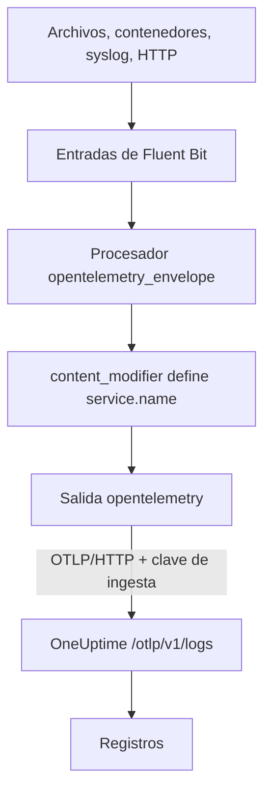

# Fluent Bit

[Fluent Bit](https://docs.fluentbit.io/manual) es un agente ligero que recopila registros de archivos, systemd, contenedores, syslog, HTTP y muchas otras fuentes. Su [salida OpenTelemetry](https://docs.fluentbit.io/manual/pipeline/outputs/opentelemetry) envía lo que recopila al endpoint OpenTelemetry (OTLP) de OneUptime, donde los registros se pueden buscar en **Productos → Registros**.

:::cards
- [Configurar Fluent Bit](#configurar-fluent-bit): Añade la salida OpenTelemetry y ponle nombre a tu servicio.
- [Ejemplo completo](#ejemplo-completo): Un archivo de configuración entero para empezar.
- [OneUptime autoalojado](#oneuptime-autoalojado): Apunta Fluent Bit a tu propia instancia.
:::

## Cómo funciona



Fluent Bit envuelve cada registro en un sobre de OpenTelemetry para que pueda llevar atributos de recurso como `service.name`. Después, la salida OpenTelemetry envía los registros a OneUptime con tu clave de ingesta en la cabecera `x-oneuptime-token`. OneUptime los guarda bajo el servicio que nombra `service.name` y crea ese servicio la primera vez que envía.

## Antes de empezar

- **Instalar Fluent Bit**: consulta la [guía de instalación](https://docs.fluentbit.io/manual/installation/getting-started-with-fluent-bit). La configuración de esta página usa el formato YAML de Fluent Bit y el procesador `opentelemetry_envelope`, así que usa una versión actual.
- **Un proyecto de OneUptime.** En OneUptime Cloud, la telemetría se factura por GB ingerido —consulta los [precios](https://oneuptime.com/pricing)— y un proyecto del plan Free necesita un método de pago antes de poder enviar telemetría.
- **Una clave de ingesta de telemetría.** Si no tienes una:

:::steps
### Abrir las claves de ingesta

Ve a **Productos → Ajustes del proyecto**, abre **Telemetría y APM** en el menú lateral y selecciona **Claves de ingesta**.


### Crear una clave

Haz clic en **Crear clave de ingesta**. El diálogo ya tiene rellenado el nombre de la clave y elegido **Servidor** —el tipo de clave con el que envía una aplicación o un collector—, así que haz clic en **Crear clave de ingesta** para crearla, o cámbiale antes el nombre.

### Copiar el secreto

La nueva clave se abre en su propia página. Copia su **Clave secreta**: es el `YOUR_TELEMETRY_INGESTION_TOKEN` de la configuración de abajo.


:::

## Configurar Fluent Bit

Fluent Bit lee su configuración YAML de un archivo como `/etc/fluent-bit/fluent-bit.yaml`.

:::steps
### Añadir la salida OpenTelemetry

Añade una salida `opentelemetry` que envíe a OneUptime. Mantén la salida `stdout` mientras pruebas si quieres ver los registros en local:

```yaml title="fluent-bit.yaml"
pipeline:
  outputs:
    - name: stdout
      match: "*"
    - name: opentelemetry
      match: "*"
      host: "oneuptime.com"
      port: 443
      metrics_uri: "/otlp/v1/metrics"
      logs_uri: "/otlp/v1/logs"
      traces_uri: "/otlp/v1/traces"
      tls: On
      header:
        - x-oneuptime-token YOUR_TELEMETRY_INGESTION_TOKEN
```

### Envolver los registros en un sobre de OpenTelemetry y nombrar el servicio

Añade el procesador `opentelemetry_envelope` a cada entrada, seguido de un `content_modifier` que defina `service.name`. Sustituye `YOUR_SERVICE_NAME` por el nombre con el que deben aparecer los registros en OneUptime:

```yaml title="fluent-bit.yaml"
pipeline:
  inputs:
    - name: tail # or any other input
      path: /var/log/my-app/*.log

      processors:
        logs:
          - name: opentelemetry_envelope

          - name: content_modifier
            context: otel_resource_attributes
            action: upsert
            key: service.name
            value: YOUR_SERVICE_NAME
```

### Reiniciar Fluent Bit

Reinicia el servicio de Fluent Bit, o arráncalo con `fluent-bit -c /etc/fluent-bit/fluent-bit.yaml`. En pocos segundos los registros aparecen en **Productos → Registros**, y el servicio aparece en **Productos → Servicios**.
:::

## Ejemplo completo

Esta configuración recibe registros por HTTP en el puerto `8888` y los reenvía a OneUptime:

```yaml title="fluent-bit.yaml"
service:
  flush: 1
  log_level: info

pipeline:
  inputs:
    - name: http
      listen: 0.0.0.0
      port: 8888

      processors:
        logs:
          - name: opentelemetry_envelope

          - name: content_modifier
            context: otel_resource_attributes
            action: upsert
            key: service.name
            value: YOUR_SERVICE_NAME

  outputs:
    - name: stdout
      match: "*"
    - name: opentelemetry
      match: "*"
      host: "oneuptime.com"
      port: 443
      metrics_uri: "/otlp/v1/metrics"
      logs_uri: "/otlp/v1/logs"
      traces_uri: "/otlp/v1/traces"
      tls: On
      header:
        - x-oneuptime-token YOUR_TELEMETRY_INGESTION_TOKEN
```

Sustituye la entrada `http` por las entradas que necesites —por ejemplo `tail` para archivos de registro o `systemd` para el journal— y mantén los dos procesadores en cada una de ellas.

## OneUptime autoalojado

Pon en `host` el host de tu instancia de OneUptime. Si se sirve por HTTP simple en lugar de HTTPS, pon también en `port` el puerto en el que escucha (normalmente `80`) y quita `tls`:

```yaml title="fluent-bit.yaml"
pipeline:
  outputs:
    - name: stdout
      match: "*"
    - name: opentelemetry
      match: "*"
      host: "your-oneuptime-instance.com"
      port: 80
      metrics_uri: "/otlp/v1/metrics"
      logs_uri: "/otlp/v1/logs"
      traces_uri: "/otlp/v1/traces"
      header:
        - x-oneuptime-token YOUR_TELEMETRY_INGESTION_TOKEN
```

## Solución de problemas

:::details Fluent Bit registra `401` desde la salida OpenTelemetry
Falta la clave de ingesta, es desconocida o ha caducado. Revisa la línea `header`: es `x-oneuptime-token`, un espacio y después la **Clave secreta** de la clave.
:::

:::details Fluent Bit registra `402` o `422`
`402`: en OneUptime Cloud, el proyecto está en el plan Free y no tiene método de pago. Añade uno en **Ajustes del proyecto → Facturación y facturas → Facturación**. `422`: la clave está deshabilitada, o es una clave de navegador. Vuelve a activar **Habilitado** en los ajustes de la clave, o crea una clave de **Servidor**.
:::

:::details Los registros llegan a un servicio inesperado
El servicio sale de `service.name`. Comprueba que cada entrada tenga el procesador `opentelemetry_envelope` seguido del `content_modifier` que lo define.
:::

:::details No llega nada y Fluent Bit registra errores de conexión
Comprueba que `tls: On` y `port: 443` estén definidos para un endpoint HTTPS, y que el host donde se ejecuta Fluent Bit pueda llegar a tu host de OneUptime en ese puerto.
:::

Si tienes alguna pregunta o necesitas ayuda con la configuración, escríbenos a support@oneuptime.com.

## Próximos pasos

:::cards
- [Canalizaciones de registros](/docs/telemetry/log-pipelines): Analiza y enriquece los registros que envía Fluent Bit.
- [Sintaxis de búsqueda](/docs/telemetry/search-syntax): Encuentra los registros en el explorador de registros.
- [OpenTelemetry](/docs/telemetry/open-telemetry): Endpoints, claves y límites para toda la telemetría.
- [Fluentd](/docs/telemetry/fluentd): Usa Fluentd en su lugar.
:::
