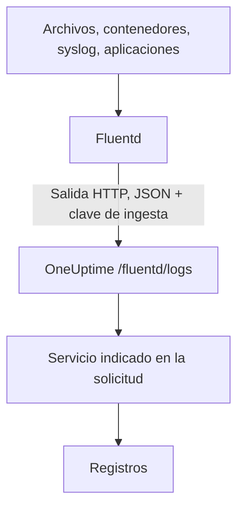

# Fluentd

[Fluentd](https://www.fluentd.org/) recopila registros de archivos, contenedores, syslog, aplicaciones y [muchas otras fuentes](https://www.fluentd.org/datasources). Su [salida HTTP](https://docs.fluentd.org/output/http) integrada los envía al endpoint de Fluentd de OneUptime, donde se pueden buscar en **Productos → Registros**.

:::cards
- [Configurar Fluentd](#configurar-fluentd): Añade una salida HTTP que apunte a OneUptime.
- [Cómo se leen los registros](#cómo-se-leen-los-registros): Qué campos se convierten en el mensaje, la severidad y los atributos.
- [OneUptime autoalojado](#oneuptime-autoalojado): Apunta Fluentd a tu propia instancia.
:::

## Cómo funciona



Fluentd envía los registros por lotes en JSON, con tu clave de ingesta en la cabecera `x-oneuptime-token` y el nombre del servicio en `x-oneuptime-service-name`. OneUptime convierte cada registro en un registro de ese servicio y crea el servicio la primera vez que envía.

## Antes de empezar

- **Instalar Fluentd**: consulta la [guía de instalación](https://docs.fluentd.org/installation).
- **Un proyecto de OneUptime.** En OneUptime Cloud, la telemetría se factura por GB ingerido —consulta los [precios](https://oneuptime.com/pricing)— y un proyecto del plan Free necesita un método de pago antes de poder enviar telemetría.
- **Una clave de ingesta de telemetría.** Si no tienes una:

:::steps
### Abrir las claves de ingesta

Ve a **Productos → Ajustes del proyecto**, abre **Telemetría y APM** en el menú lateral y selecciona **Claves de ingesta**.


### Crear una clave

Haz clic en **Crear clave de ingesta**. El diálogo ya tiene rellenado el nombre de la clave y elegido **Servidor** —el tipo de clave con el que envía una aplicación o un collector—, así que haz clic en **Crear clave de ingesta** para crearla, o cámbiale antes el nombre.

### Copiar el secreto

La nueva clave se abre en su propia página. Copia su **Clave secreta**: es el `YOUR_SERVICE_TOKEN` de la configuración de abajo.


:::

## Configurar Fluentd

El archivo de configuración de Fluentd suele ser `/etc/fluent/fluentd.conf`, o `/etc/td-agent/td-agent.conf` en el antiguo paquete td-agent.

:::steps
### Añadir una salida HTTP

Añade una sección `<match>` que envíe los registros a OneUptime. Sustituye `YOUR_SERVICE_TOKEN` por tu clave de ingesta y `YOUR_SERVICE_NAME` por el nombre con el que deben aparecer los registros (el que quieras):

```text title="fluentd.conf"
# Match all patterns
<match **>
  @type http

  endpoint https://oneuptime.com/fluentd/logs
  open_timeout 2

  headers {"x-oneuptime-token":"YOUR_SERVICE_TOKEN", "x-oneuptime-service-name":"YOUR_SERVICE_NAME"}

  content_type application/json
  json_array true

  <format>
    @type json
  </format>
  <buffer>
    flush_interval 10s
    chunk_limit_size 900k
  </buffer>
</match>
```

`json_array true` envía cada fragmento del búfer como un único array JSON, y `flush_interval 10s` envía el búfer cada 10 segundos. `chunk_limit_size 900k` mantiene cada solicitud por debajo de 1 MB, lo máximo que OneUptime acepta en este endpoint.

### Reiniciar Fluentd

Reinicia el servicio de Fluentd para que cargue la nueva salida.

### Comprobar que llegan los registros

Pocos segundos después del siguiente vaciado, los registros aparecen en **Productos → Registros**. El servicio aparece en **Productos → Servicios**; si todavía no existía, OneUptime lo crea.
:::

## Ejemplo completo

Esta configuración recibe registros por el protocolo forward de Fluentd en el puerto `24224` y los envía todos a OneUptime:

```text title="fluentd.conf"
####
## Source descriptions:
##

## built-in TCP input
## @see https://docs.fluentd.org/input/forward
<source>
  @type forward
  port 24224
  bind 0.0.0.0
</source>

<match **>
  @type http

  endpoint https://oneuptime.com/fluentd/logs
  open_timeout 2

  headers {"x-oneuptime-token":"YOUR_SERVICE_TOKEN", "x-oneuptime-service-name":"YOUR_SERVICE_NAME"}

  content_type application/json
  json_array true

  <format>
    @type json
  </format>
  <buffer>
    flush_interval 10s
    chunk_limit_size 900k
  </buffer>
</match>
```

Para enviar distintas fuentes como distintos servicios, usa una sección `<match>` por etiqueta, cada una con su propio `x-oneuptime-service-name`.

## Cómo se leen los registros

OneUptime lee estos campos de cada registro:

| Campo del registro | Se lee del primer campo presente entre | Notas |
| --- | --- | --- |
| Cuerpo | `message`, `log`, `msg`, `body`, `text` | La línea de registro. Un registro sin ninguno de ellos se guarda completo, como JSON. |
| Severidad | `level`, `severity`, `loglevel`, `log_level`, `priority`, `severityText`, `severity_text` | Nombres como `trace`, `debug`, `info`, `notice`, `warn`, `error`, `critical` y `fatal`, en mayúsculas o minúsculas. Cualquier otro valor se guarda como `Unspecified`. |
| ID de traza | `trace_id`, `traceId`, `traceid` | Enlaza el registro con su traza. |
| ID de span | `span_id`, `spanId`, `spanid` | Enlaza el registro con su span. |
| Servicio | la cabecera `x-oneuptime-service-name` | `Fluentd` cuando la cabecera no está definida. |
| Hora | — | La hora a la que OneUptime recibe el registro. |

Cualquier otro campo se convierte en un atributo llamado `fluentd.` seguido del nombre del campo, por el que puedes buscar y filtrar: un campo `container_name` es `@fluentd.container_name` en el explorador de registros. Un objeto anidado se aplana con puntos, como `fluentd.kubernetes.pod_name`, y una lista se guarda como JSON.

Los registros de Fluentd pasan por tus [canalizaciones de registros](/docs/telemetry/log-pipelines), filtros de descarte y reglas de enmascaramiento como cualquier otro registro.

## OneUptime autoalojado

Sustituye `https://oneuptime.com` en `endpoint` por la URL de tu instancia de OneUptime: `http(s)://YOUR_ONEUPTIME_HOST/fluentd/logs`.

## Solución de problemas

:::details Fluentd registra `401` desde la salida HTTP
Falta la clave de ingesta, es desconocida o ha caducado. Revisa el valor de `x-oneuptime-token` en `headers`.
:::

:::details Fluentd registra `402` o `422`
`402`: en OneUptime Cloud, el proyecto está en el plan Free y no tiene método de pago. Añade uno en **Ajustes del proyecto → Facturación y facturas → Facturación**. `422`: la clave está deshabilitada, o es una clave de navegador. Vuelve a activar **Habilitado** en los ajustes de la clave, o crea una clave de **Servidor**.
:::

:::details Fluentd registra `413`
La solicitud supera 1 MB, lo máximo que OneUptime acepta en este endpoint. Pon `chunk_limit_size 900k` en la sección `<buffer>`, como en la configuración de arriba.
:::

:::details Los registros llegan al servicio `Fluentd`
Falta la cabecera `x-oneuptime-service-name`. Añádela a `headers` en cada sección `<match>`.
:::

:::details El cuerpo del registro muestra todo el registro como JSON
OneUptime toma el cuerpo del primer campo presente entre `message`, `log`, `msg`, `body` o `text`, y guarda el registro completo cuando no tiene ninguno. Cambia el nombre del campo que contiene tu línea de registro a uno de esos, por ejemplo con el filtro `record_transformer` de Fluentd.
:::

Si tienes alguna pregunta o necesitas ayuda con la configuración, escríbenos a support@oneuptime.com.

## Próximos pasos

:::cards
- [Canalizaciones de registros](/docs/telemetry/log-pipelines): Analiza y enriquece los registros que envía Fluentd.
- [Sintaxis de búsqueda](/docs/telemetry/search-syntax): Encuentra los registros en el explorador de registros.
- [Fluent Bit](/docs/telemetry/fluentbit): Un agente más ligero que envía por OpenTelemetry.
- [Monitor de registros](/docs/monitor/logs-monitor): Alerta cuando aparezcan registros que coincidan.
:::
