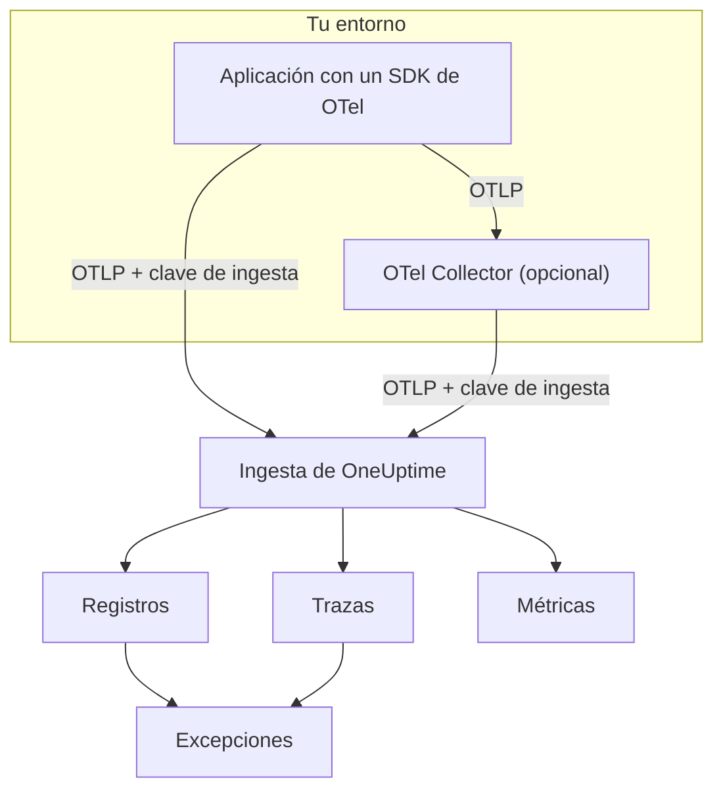

# OpenTelemetry

OneUptime ingiere registros, métricas y trazas a través del OpenTelemetry Protocol (OTLP). Apunta cualquier SDK de OpenTelemetry, o un OpenTelemetry Collector, a OneUptime con una clave de ingesta, y tus datos aparecen en **Registros**, **Trazas**, **Métricas** y **Excepciones**. Esta página hace que un servicio envíe datos en pocos minutos y después cubre los endpoints, los límites y los errores que necesitas conocer en producción.

:::cards
- [Inicio rápido](#inicio-rápido): Crea una clave, define cuatro variables de entorno y añade el SDK.
- [Usar un Collector](#enviar-a-través-de-un-opentelemetry-collector): Añade OneUptime como exportador a un collector que ya ejecutas.
- [Endpoints y límites](#endpoints-y-límites): URL, puertos, codificaciones, límites de tamaño y códigos de estado.
- [Solución de problemas](#solución-de-problemas): Qué revisar cuando no llegan datos.
:::

## Cómo funciona

Tu aplicación exporta OTLP directamente a OneUptime, o a un OpenTelemetry Collector que lo reenvía. Cada solicitud lleva tu clave de ingesta en la cabecera `x-oneuptime-token`, y OneUptime usa la clave para encontrar tu proyecto.



- **Los servicios se crean por ti.** El atributo de recurso `service.name` (definido con `OTEL_SERVICE_NAME`) da nombre al servicio al que pertenecen tus datos. OneUptime crea el servicio la primera vez que envía y lo muestra en **Productos → Servicios**.
- **Los errores se convierten en excepciones.** Los eventos de excepción de los spans y las excepciones registradas en los registros se agrupan en incidencias en **Excepciones**; consulta [Excepciones a partir de registros](#excepciones-a-partir-de-registros).

## Antes de empezar

- Un proyecto de OneUptime en el que puedas crear claves de ingesta: pueden hacerlo los propietarios y administradores del proyecto, y cualquiera con el permiso **Create Telemetry Ingestion Key**.
- Una aplicación a la que puedas añadir un SDK de OpenTelemetry, o un OpenTelemetry Collector.
- HTTPS saliente (puerto 443) desde tu aplicación o collector hacia `oneuptime.com`, o hacia tu propio host de OneUptime.

> [!NOTE]
> En OneUptime Cloud, la telemetría se factura por GB ingerido. Un proyecto en el plan Free necesita un método de pago antes de poder enviar telemetría; el diálogo que crea la clave muestra los precios.

## Inicio rápido

:::steps
### Crear una clave de ingesta

1. Ve a **Productos → Ajustes del proyecto**.
2. En el menú lateral, abre **Telemetría y APM** y selecciona **Claves de ingesta**.
3. Haz clic en **Crear clave de ingesta**. El diálogo rellena un nombre y elige el tipo de clave **Servidor**, que es con el que envía una aplicación o un collector. Cámbiale el nombre si quieres y luego haz clic en **Crear clave de ingesta**.


La nueva clave se abre en su propia página. Copia su **Clave secreta**: es el token que envías como `x-oneuptime-token`.


### Definir las variables de entorno de OpenTelemetry

Todos los SDK de OpenTelemetry leen las mismas variables de entorno estándar, así que este paso es igual en todos los lenguajes.

| Variable de entorno | Valor | Para qué sirve |
| --- | --- | --- |
| `OTEL_EXPORTER_OTLP_ENDPOINT` | `https://oneuptime.com/otlp` | Adónde enviar. El SDK añade por sí mismo `/v1/traces`, `/v1/metrics` y `/v1/logs`. |
| `OTEL_EXPORTER_OTLP_HEADERS` | `x-oneuptime-token=YOUR_ONEUPTIME_INGESTION_KEY` | Envía tu clave de ingesta con cada solicitud. |
| `OTEL_EXPORTER_OTLP_PROTOCOL` | `http/protobuf` | OTLP sobre HTTP. Algunos SDK usan gRPC por defecto, que utiliza otro endpoint. |
| `OTEL_SERVICE_NAME` | `my-service` | El servicio bajo el que aparecen tus datos en OneUptime. |

```bash
export OTEL_EXPORTER_OTLP_ENDPOINT="https://oneuptime.com/otlp"
export OTEL_EXPORTER_OTLP_HEADERS="x-oneuptime-token=YOUR_ONEUPTIME_INGESTION_KEY"
export OTEL_EXPORTER_OTLP_PROTOCOL="http/protobuf"
export OTEL_SERVICE_NAME="my-service"
```

¿Autoalojado? Sustituye `https://oneuptime.com` por la URL de tu instancia de OneUptime, por ejemplo `https://oneuptime.example.com/otlp`. Para etiquetar las excepciones con un entorno, define también `OTEL_RESOURCE_ATTRIBUTES` como `deployment.environment=production`.

### Añadir OpenTelemetry a tu aplicación

Elige tu lenguaje. Cada configuración lee las variables de entorno anteriores, así que en tu código no aparece ningún endpoint ni ninguna clave.

:::tabs
@tab Node.js
Instala el SDK, las instrumentaciones automáticas y los exportadores OTLP/HTTP:

```bash
npm install @opentelemetry/sdk-node @opentelemetry/auto-instrumentations-node \
  @opentelemetry/exporter-trace-otlp-proto @opentelemetry/exporter-metrics-otlp-proto \
  @opentelemetry/exporter-logs-otlp-proto @opentelemetry/sdk-metrics @opentelemetry/sdk-logs
```

Crea el SDK en un archivo propio:

```javascript title="instrumentation.js"
const { NodeSDK } = require("@opentelemetry/sdk-node");
const { getNodeAutoInstrumentations } = require("@opentelemetry/auto-instrumentations-node");
const { OTLPTraceExporter } = require("@opentelemetry/exporter-trace-otlp-proto");
const { OTLPMetricExporter } = require("@opentelemetry/exporter-metrics-otlp-proto");
const { OTLPLogExporter } = require("@opentelemetry/exporter-logs-otlp-proto");
const { PeriodicExportingMetricReader } = require("@opentelemetry/sdk-metrics");
const { BatchLogRecordProcessor } = require("@opentelemetry/sdk-logs");

// The exporters read OTEL_EXPORTER_OTLP_ENDPOINT and OTEL_EXPORTER_OTLP_HEADERS.
const sdk = new NodeSDK({
  traceExporter: new OTLPTraceExporter(),
  metricReader: new PeriodicExportingMetricReader({
    exporter: new OTLPMetricExporter(),
  }),
  logRecordProcessors: [new BatchLogRecordProcessor(new OTLPLogExporter())],
  instrumentations: [getNodeAutoInstrumentations()],
});

sdk.start();
```

Cárgalo antes del código de tu aplicación:

```bash
node --require ./instrumentation.js app.js
```
@tab Python
Instala la distribución de OpenTelemetry y el exportador, y después las instrumentaciones de las bibliotecas que usa tu aplicación:

```bash
pip install opentelemetry-distro opentelemetry-exporter-otlp
opentelemetry-bootstrap -a install
```

Inicia tu aplicación a través de `opentelemetry-instrument`. Exporta trazas, métricas y registros; la variable de logging también envía los registros escritos con el módulo `logging` de Python:

```bash
OTEL_PYTHON_LOGGING_AUTO_INSTRUMENTATION_ENABLED=true opentelemetry-instrument python app.py
```
@tab Go
Añade el SDK y los exportadores OTLP/HTTP:

```bash
go get go.opentelemetry.io/otel go.opentelemetry.io/otel/sdk go.opentelemetry.io/otel/sdk/metric \
  go.opentelemetry.io/otel/exporters/otlp/otlptrace/otlptracehttp \
  go.opentelemetry.io/otel/exporters/otlp/otlpmetric/otlpmetrichttp
```

Crea los proveedores de tracer y meter al iniciar el programa:

```go title="main.go"
package main

import (
	"context"
	"log"

	"go.opentelemetry.io/otel"
	"go.opentelemetry.io/otel/exporters/otlp/otlpmetric/otlpmetrichttp"
	"go.opentelemetry.io/otel/exporters/otlp/otlptrace/otlptracehttp"
	sdkmetric "go.opentelemetry.io/otel/sdk/metric"
	sdktrace "go.opentelemetry.io/otel/sdk/trace"
)

func main() {
	ctx := context.Background()

	// Both exporters read OTEL_EXPORTER_OTLP_ENDPOINT and OTEL_EXPORTER_OTLP_HEADERS.
	traceExporter, err := otlptracehttp.New(ctx)
	if err != nil {
		log.Fatal(err)
	}
	tracerProvider := sdktrace.NewTracerProvider(sdktrace.WithBatcher(traceExporter))
	defer tracerProvider.Shutdown(ctx)
	otel.SetTracerProvider(tracerProvider)

	metricExporter, err := otlpmetrichttp.New(ctx)
	if err != nil {
		log.Fatal(err)
	}
	meterProvider := sdkmetric.NewMeterProvider(
		sdkmetric.WithReader(sdkmetric.NewPeriodicReader(metricExporter)),
	)
	defer meterProvider.Shutdown(ctx)
	otel.SetMeterProvider(meterProvider)

	// Your application code.
}
```

Los proveedores toman `OTEL_SERVICE_NAME` del entorno. Para los registros, añade `otlploghttp` con un puente de logs como `otelslog`; lee las mismas variables.
@tab Java
Descarga el agente Java de OpenTelemetry y conéctalo a tu aplicación. No hace falta cambiar el código:

```bash
curl -L -O https://github.com/open-telemetry/opentelemetry-java-instrumentation/releases/latest/download/opentelemetry-javaagent.jar
java -javaagent:opentelemetry-javaagent.jar -jar my-app.jar
```

El agente instrumenta los frameworks y bibliotecas habituales, y exporta trazas, métricas y los registros escritos mediante Logback o Log4j.
@tab .NET
Añade los paquetes de OpenTelemetry para ASP.NET Core:

```bash
dotnet add package OpenTelemetry.Extensions.Hosting
dotnet add package OpenTelemetry.Exporter.OpenTelemetryProtocol
dotnet add package OpenTelemetry.Instrumentation.AspNetCore
dotnet add package OpenTelemetry.Instrumentation.Http
```

Registra OpenTelemetry al arrancar. `UseOtlpExporter()` envía trazas, métricas y registros, y lee las variables `OTEL_EXPORTER_OTLP_*`:

```csharp title="Program.cs"
using OpenTelemetry;
using OpenTelemetry.Metrics;
using OpenTelemetry.Trace;

var builder = WebApplication.CreateBuilder(args);

builder.Services.AddOpenTelemetry()
    .WithTracing(tracing => tracing
        .AddAspNetCoreInstrumentation()
        .AddHttpClientInstrumentation())
    .WithMetrics(metrics => metrics
        .AddAspNetCoreInstrumentation()
        .AddHttpClientInstrumentation())
    .WithLogging()
    .UseOtlpExporter();

var app = builder.Build();
app.Run();
```

¿Usas Serilog? Consulta [Serilog](/docs/telemetry/serilog) para enviar sus registros a OneUptime.
:::

### Comprobar que llegan los datos

Pregunta a OneUptime si acepta tu clave:

```bash
curl -i -H "x-oneuptime-token: YOUR_ONEUPTIME_INGESTION_KEY" \
  https://oneuptime.com/otlp/v1/validate
```

Una clave que funciona devuelve `200` con `"valid": true`. Cualquier otra cosa devuelve `401` con un mensaje que indica el problema: desconocida, deshabilitada o caducada.

Después ejecuta tu aplicación y úsala durante un minuto. Abre **Productos → Servicios**: tu servicio aparece con el nombre que definiste en `OTEL_SERVICE_NAME`, con sus registros, trazas, métricas y excepciones. **Productos → Registros**, **Productos → Trazas** y **Productos → Métricas** muestran los mismos datos de todos los servicios.
:::

:::details Enviar un registro de prueba sin SDK
OTLP/HTTP también acepta JSON, así que puedes publicar un registro con `curl`. El valor `9` de `severityNumber` lo convierte en un registro informativo:

```bash
curl -i https://oneuptime.com/otlp/v1/logs \
  -H "Content-Type: application/json" \
  -H "x-oneuptime-token: YOUR_ONEUPTIME_INGESTION_KEY" \
  -d '{
    "resourceLogs": [{
      "resource": {
        "attributes": [
          { "key": "service.name", "value": { "stringValue": "my-service" } }
        ]
      },
      "scopeLogs": [{
        "logRecords": [{
          "severityNumber": 9,
          "body": { "stringValue": "Hello from curl" }
        }]
      }]
    }]
  }'
```

Un `200` significa que el registro se aceptó. Aparece en **Productos → Registros** en pocos segundos, en el servicio `my-service`.
:::

## Enviar a través de un OpenTelemetry Collector

Ejecuta un collector si ya tienes uno, si quieres agrupar, filtrar o enriquecer los datos en un solo lugar, o para mantener la clave de ingesta fuera de tus aplicaciones. Tus aplicaciones exportan al collector, y solo el collector habla con OneUptime.

:::steps
### Añadir OneUptime como exportador

Añade un exportador `otlphttp` que apunte a OneUptime y haz pasar cada pipeline por él:

```yaml title="otel-collector-config.yaml"
receivers:
  otlp:
    protocols:
      grpc:
        endpoint: 0.0.0.0:4317
      http:
        endpoint: 0.0.0.0:4318

processors:
  batch: {}

exporters:
  otlphttp:
    endpoint: https://oneuptime.com/otlp
    headers:
      x-oneuptime-token: YOUR_ONEUPTIME_INGESTION_KEY

service:
  pipelines:
    traces:
      receivers: [otlp]
      processors: [batch]
      exporters: [otlphttp]
    metrics:
      receivers: [otlp]
      processors: [batch]
      exporters: [otlphttp]
    logs:
      receivers: [otlp]
      processors: [batch]
      exporters: [otlphttp]
```

Mantén los valores por defecto del exportador: envía protobuf comprimido con gzip, y OneUptime acepta ambos. No definas una cabecera `Content-Type` en el exportador: OneUptime elige su decodificador según esa cabecera, así que un tipo de contenido JSON delante de bytes protobuf rompe la ingesta.

### Ejecutar el collector

:::tabs
@tab Docker
```bash
docker run -d --name otel-collector \
  -p 4317:4317 -p 4318:4318 \
  -v "$(pwd)/otel-collector-config.yaml:/etc/otelcol-contrib/config.yaml" \
  otel/opentelemetry-collector-contrib:latest
```
@tab Linux
```bash
otelcol-contrib --config otel-collector-config.yaml
```
:::

El collector escucha OTLP en el puerto `4317` (gRPC) y `4318` (HTTP), los puertos a los que envían los SDK por defecto.

### Apuntar tus aplicaciones al collector

En tus aplicaciones, define `OTEL_EXPORTER_OTLP_ENDPOINT` con la dirección del collector, por ejemplo `http://localhost:4318`, y elimina `OTEL_EXPORTER_OTLP_HEADERS`: el collector añade la clave. Mantén `OTEL_SERVICE_NAME` en cada aplicación.

Los datos llegan a OneUptime exactamente igual que en el inicio rápido. Si no llegan, el registro del propio collector dice por qué; consulta [Solución de problemas](#solución-de-problemas).
:::

¿Ya exportas a otro proveedor? Añade el exportador `otlphttp` junto al existente y enumera ambos en los `exporters` de cada pipeline para enviar a los dos mientras comparas. Para recopilar también métricas del host y archivos de registro, consulta la guía [Host OpenTelemetry Collector](/docs/telemetry/host-otel-collector).

## Endpoints y límites

| Ajuste | OTLP/HTTP (recomendado) | OTLP/gRPC |
| --- | --- | --- |
| Endpoint | `https://oneuptime.com/otlp` | `https://oneuptime.com:443` |
| Autenticación | Cabecera `x-oneuptime-token` | Metadato `x-oneuptime-token` |
| Codificación | Protobuf (`application/x-protobuf`) o JSON (`application/json`) | Protobuf |
| Compresión | Ninguna, `gzip`, `deflate` o `zstd` | Ninguna o `gzip` |
| Tamaño de solicitud | Hasta 4 MB por solicitud en `/otlp` | Hasta 4 MB por mensaje |

Sobre HTTP, cada señal tiene su propia ruta bajo el endpoint. Los SDK y el collector la añaden por ti; defínela tú solo cuando una herramienta pida una URL completa.

| Señal | URL de OTLP/HTTP |
| --- | --- |
| Trazas | `https://oneuptime.com/otlp/v1/traces` |
| Métricas | `https://oneuptime.com/otlp/v1/metrics` |
| Registros | `https://oneuptime.com/otlp/v1/logs` |
| Perfiles | `https://oneuptime.com/otlp/v1/profiles` |

Para el perfilado continuo, la mayoría de los perfiladores envían en su lugar al endpoint compatible con Pyroscope; consulta [Perfilado continuo](/docs/telemetry/profiles). Un collector que exporta perfiles OTLP debe definir el `profiles_endpoint` del exportador como `https://oneuptime.com/otlp/v1/profiles`, porque por defecto envía los perfiles a una ruta de desarrollo que OneUptime no sirve.

### OTLP sobre gRPC

OneUptime sirve OTLP/gRPC en el mismo host que la aplicación web, en el puerto 443 con TLS. Define `OTEL_EXPORTER_OTLP_PROTOCOL` como `grpc` y `OTEL_EXPORTER_OTLP_ENDPOINT` como `https://oneuptime.com:443`, y envía la misma cabecera `x-oneuptime-token`. En un collector, usa el exportador `otlp` con `endpoint: oneuptime.com:443` y los mismos `headers`.

En una instalación autoalojada, gRPC solo llega a OneUptime por HTTPS: una conexión HTTP sin cifrar (h2c) se rechaza. Si tu instancia se sirve por HTTP simple, usa OTLP/HTTP.

Dos ajustes de una clave solo se aplican a OTLP/HTTP: su **Límite de solicitudes por minuto** y su **Nombre de servicio fijado**. Los datos enviados por gRPC conservan el `service.name` con el que se enviaron y no cuentan para el límite.

### Respuestas

OneUptime responde a una exportación en cuanto los datos están en cola, y los datos aparecen unos segundos después.

| Respuesta | Estado gRPC | Significado | Qué hacer |
| --- | --- | --- | --- |
| `200` | `OK` | Aceptado. | Nada. |
| `401` | `UNAUTHENTICATED` | Falta la clave, es desconocida o ha caducado. | Compara el valor de `x-oneuptime-token` con la **Clave secreta** de la clave. |
| `402` | `PERMISSION_DENIED` | Solo OneUptime Cloud: el proyecto está en el plan Free y no tiene método de pago. | Añade uno en **Ajustes del proyecto → Facturación y facturas → Facturación**. |
| `413` | — | La solicitud supera el límite de tamaño. | Envía lotes más pequeños. |
| `415` | — | `Content-Encoding` no admitido. | Usa `gzip`, `deflate` o `zstd`, o ninguna compresión. |
| `422` | `PERMISSION_DENIED` | La clave está deshabilitada, o es una clave de navegador usada fuera de sus orígenes permitidos. | Vuelve a habilitar la clave, o envía con una clave de servidor. |
| `429` | — | Se alcanzó el **Límite de solicitudes por minuto** de la clave. | Nada al principio: los exportadores reintentan tras el tiempo de `Retry-After`. Sube el límite si sigue pasando. |
| `503` | `UNAVAILABLE` | OneUptime se está iniciando, o la cola de ingesta no está disponible. | Nada: los exportadores OTLP reintentan un `503` por sí mismos. |

`401`, `402`, `413`, `415` y `422` son errores permanentes para los exportadores OTLP: el exportador descarta el lote y registra el error en lugar de reintentarlo.

### Reinicios y actualizaciones

Mientras OneUptime se reinicia o se actualiza, responde a las exportaciones con `503` y `Retry-After: 5` hasta que está listo, y los exportadores las vuelven a enviar. El exportador de un collector sigue reintentando durante cinco minutos por defecto (`retry_on_failure`) y guarda en su `sending_queue` lo que no pudo enviar, así que deja ambos activados. El tiempo en que OneUptime no estaba recibiendo nunca se cuenta en contra de tus servidores, hosts u otros recursos: consulta [Cuando OneUptime no recibe datos](/docs/monitor/when-oneuptime-is-not-receiving#al-arrancar).

### Claves de ingesta

La página de cada clave, en **Ajustes del proyecto → Telemetría y APM → Claves de ingesta**, tiene estos ajustes:

| Ajuste | Para qué sirve |
| --- | --- |
| **Tipo de clave** | **Servidor** (el predeterminado) para aplicaciones, collectors y agentes. **Navegador** para claves que se publican en una página web: solo de escritura, y aceptadas únicamente desde sus **Orígenes permitidos**. No se puede cambiar después de crear la clave. |
| **Orígenes permitidos** | Los orígenes web desde los que funciona una clave de navegador, como `https://app.example.com`. Se ignora en una clave de servidor. |
| **Nombre de servicio fijado** | Si se define, sustituye `service.name` en todo lo que se envía con esta clave por OTLP/HTTP. |
| **Habilitado** | Desactívalo para dejar de aceptar al instante los datos enviados con la clave, sin eliminarla. |
| **Caduca el** | A partir de esta fecha la clave se rechaza. Vacío significa que nunca caduca. |
| **Límite de solicitudes por minuto** | El máximo de solicitudes OTLP/HTTP por minuto que se aceptan con la clave, sumando todos los clientes que la usan. Vacío significa sin límite en una clave de servidor, y 6000 en una clave de navegador. |
| **Usado por última vez el** | Cuándo se aceptaron datos por última vez con la clave. Úsalo para encontrar claves que puedes rotar o eliminar sin riesgo. |

**Restablecer clave secreta** en la página de la clave sustituye el secreto. Toda aplicación y todo collector que envíe con el anterior será rechazado hasta que lo actualices.

## OneUptime autoalojado

Todo lo de esta página funciona igual con tu propia instalación. Usa tu URL de OneUptime donde esta página dice `https://oneuptime.com`:

- `OTEL_EXPORTER_OTLP_ENDPOINT` es `https://YOUR-ONEUPTIME-HOST/otlp`, o `http://YOUR-ONEUPTIME-HOST/otlp` si sirves OneUptime por HTTP simple.
- El ingress incluido acepta solicitudes de hasta 4 MB en `/otlp`. Un proxy que pongas delante de OneUptime puede tener un límite menor (ingress-nginx fija `proxy-body-size` en 1 MB por defecto), así que súbelo también para `/otlp`, o los exportadores recibirán `413`.
- Si está definido `DISABLE_TELEMETRY_INGESTION=true`, OneUptime acepta todas las exportaciones y no guarda nada. Compruébalo primero cuando una instancia autoalojada no muestra ningún dato.

## Excepciones a partir de registros

OneUptime encuentra excepciones dentro de tus **registros** y las reúne en la misma vista **Excepciones** que alimentan los errores de las trazas. Cada registro ya pertenece a un servicio o host, así que la excepción se atribuye a él. Las excepciones de registros y de trazas comparten la agrupación por huella, de modo que un error notificado tanto por una traza como por un registro se convierte en una sola incidencia.

Hay dos formas en que un registro se convierte en excepción:

| Detección | Registros a los que se aplica | Cómo funciona |
| --- | --- | --- |
| **Atributos de excepción** (recomendado) | Cualquier registro | Un registro con el atributo de OpenTelemetry `exception.type`, `exception.message` o `exception.stacktrace` se convierte directamente en una excepción. La mayoría de las integraciones de logging los definen cuando registras una excepción: los appenders de Logback y Log4j, Serilog, la instrumentación de logging de Python. Es preciso y funciona en cualquier lenguaje. |
| **Traza de pila en el cuerpo** | Registros de error y fatales que no llevan un ID de traza y un ID de span | OneUptime analiza los primeros 16 KB del cuerpo en busca de una traza de pila de JavaScript, Python, Java, Go, Ruby, C#/.NET o PHP, y extrae de ella el tipo, el mensaje y los frames. Un registro escrito dentro de un span se omite, porque el span ya notifica la excepción. |

El análisis del cuerpo es adecuado para registros de texto plano como stdout sin procesar, journald o syslog que lee un collector. Una traza de pila de varias líneas tiene que llegar como un único registro, así que activa la recombinación multilínea en el collector; consulta la guía [Host OpenTelemetry Collector](/docs/telemetry/host-otel-collector).

La detección está activada por defecto. En una instalación autoalojada, desactívala definiendo `TELEMETRY_LOG_EXCEPTION_EXTRACTION_ENABLED=false` en el servicio `app`, y también en el `worker` si ejecutas el worker dedicado del chart de Helm.

## Solución de problemas

:::details No aparecen datos y el exportador registra `401`
Falta la clave, es desconocida o ha caducado. Comprueba que `OTEL_EXPORTER_OTLP_HEADERS` sea `x-oneuptime-token=` seguido de la **Clave secreta** de la clave, sin comillas ni espacios dentro del valor, y que la clave pertenezca al proyecto que estás mirando. La solicitud de validación de [Comprobar que llegan los datos](#comprobar-que-llegan-los-datos) indica cuál de estos casos es.
:::

:::details El exportador registra `422`
La clave está deshabilitada, o es una clave de navegador. Vuelve a activar **Habilitado** en los ajustes de la clave, o crea una clave de **Servidor**: una clave de navegador solo se acepta desde una página web en uno de sus orígenes permitidos.
:::

:::details El exportador registra `402`
El proyecto está en el plan Free de OneUptime Cloud y no tiene método de pago, y la telemetría se factura según el uso. Añade un método de pago en **Ajustes del proyecto → Facturación y facturas → Facturación**, y las exportaciones vuelven a aceptarse.
:::

:::details El exportador registra `404`
El SDK está enviando a una ruta equivocada. `OTEL_EXPORTER_OTLP_ENDPOINT` debe terminar en `/otlp`, sin barra final y sin `/v1/...`: eso lo añade el SDK. Si defines una variable específica de una señal como `OTEL_EXPORTER_OTLP_TRACES_ENDPOINT`, esta espera la URL completa, por ejemplo `https://oneuptime.com/otlp/v1/traces`.
:::

:::details No pasa nada y el SDK registra errores de conexión
Probablemente el SDK está exportando por gRPC a un endpoint HTTP, o a `localhost`. Define `OTEL_EXPORTER_OTLP_PROTOCOL=http/protobuf`, o usa el endpoint gRPC descrito en [OTLP sobre gRPC](#otlp-sobre-grpc). Comprueba también que el proceso ve realmente las variables de entorno: en un contenedor, defínelas en el contenedor, no en tu shell.
:::

:::details El collector registra `Exporting failed` con `413`
Un lote supera el límite de tamaño. Reduce el tamaño de los lotes, por ejemplo con `send_batch_max_size: 1000` en el procesador `batch`. Si te autoalojas detrás de tu propio proxy, revisa también el límite de tamaño de cuerpo de ese proxy.
:::

:::details Los datos llegan al servicio equivocado, o a Unknown Service
El servicio sale del atributo de recurso `service.name`. Define `OTEL_SERVICE_NAME` en cada aplicación. Si la clave tiene un **Nombre de servicio fijado**, cada exportación OTLP/HTTP con esa clave se archiva bajo ese nombre.
:::

## Próximos pasos

:::cards
- [Sintaxis de búsqueda](/docs/telemetry/search-syntax): Filtra registros, trazas, métricas y excepciones en los exploradores.
- [Pipelines de registros](/docs/telemetry/log-pipelines): Analiza y enriquece los registros a medida que llegan.
- [Monitor de registros](/docs/monitor/logs-monitor): Recibe una alerta cuando aparezcan registros coincidentes.
- [Host OpenTelemetry Collector](/docs/telemetry/host-otel-collector): Recopila métricas del host y archivos de registro con un collector.
:::
