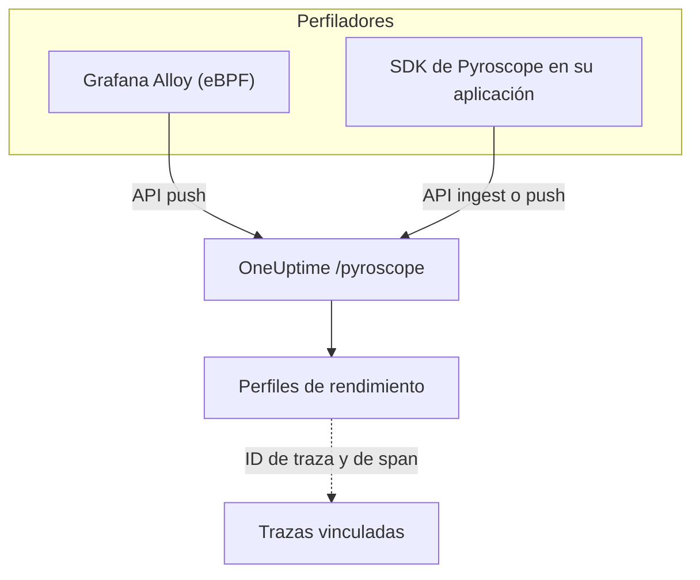

# Perfilado continuo

El perfilado continuo muestra en qué gasta su aplicación el tiempo de CPU y la memoria, función por función. OneUptime expone una **API de ingesta compatible con Pyroscope**, así que todo lo que puede enviar datos a un servidor Pyroscope (el perfilador eBPF de Grafana Alloy o un SDK de Pyroscope para su lenguaje) puede enviarlos a OneUptime, y usted lee el resultado como gráficos de llamas junto a sus registros, métricas y trazas.

:::cards
- [Enviar perfiles](#enviar-perfiles): Grafana Alloy con eBPF, o un SDK de Pyroscope en su aplicación.
- [Endpoint de ingesta](#endpoint-de-ingesta): La URL base y las tres formas de pasar la clave.
- [Comprobar que funciona](#comprobar-que-funciona): Revisar la clave, la página y el estado de las subidas.
- [Explorar perfiles](#explorar-perfiles-en-oneuptime): Gráficos de llamas, funciones principales, comparaciones y enlaces a trazas.
:::

## Cómo funciona

Un perfilador muestrea sus procesos y sube un perfil cada pocos segundos al endpoint `/pyroscope` de OneUptime, con su clave de ingesta. OneUptime guarda cada perfil bajo el servicio que nombra y lo dibuja como gráfico de llamas en **Perfiles de rendimiento**.



## Antes de empezar

Necesita una clave de ingesta de telemetría de tipo **Servidor**. Si todavía no tiene una:

:::steps
### Abrir las claves de ingesta

Vaya a **Productos → Ajustes del proyecto**, abra **Telemetría y APM** en el menú lateral y seleccione **Claves de ingesta**.


### Crear una clave

Haga clic en **Crear clave de ingesta**. El cuadro de diálogo trae el nombre de la clave ya rellenado y **Servidor** elegido (el tipo de clave con el que envía una aplicación o un colector), así que haga clic en **Crear clave de ingesta** para crearla, o cámbiele antes el nombre.

### Copiar el secreto

La nueva clave se abre en su propia página. Copie su **Clave secreta**: es el token de ingesta que los ejemplos de abajo llaman `YOUR_ONEUPTIME_INGESTION_TOKEN`.


:::

## Endpoint de ingesta

| Ajuste | Valor |
| --- | --- |
| URL base (dirección del servidor Pyroscope) | `https://oneuptime.com/pyroscope` |
| Cabecera de autenticación | `x-oneuptime-token: YOUR_ONEUPTIME_INGESTION_TOKEN` |

Los clientes añaden su propia ruta a la URL base (`/ingest` en la mayoría de los SDK de Pyroscope, `/push.v1.PusherService/Push` en Grafana Alloy y en el SDK de .NET desde v0.14), así que siempre configura solo la URL base, sin barra final.

OneUptime lee el token de ingesta de cualquiera de estas fuentes; use la que admita su cliente:

| Método | Cuándo usarlo |
| --- | --- |
| Cabecera `x-oneuptime-token` | Clientes que permiten añadir cabeceras personalizadas. |
| `Authorization: Bearer <token>` | SDK con una opción `authToken` / `auth_token`: es lo que envían. |
| Autenticación HTTP basic, con el token como **contraseña** (cualquier nombre de usuario) | Clientes que solo ofrecen usuario y contraseña de basic auth. |

> [!NOTE]
> ¿Aloja OneUptime usted mismo? Sustituya `https://oneuptime.com` por su propio host, por ejemplo `https://YOUR-ONEUPTIME-HOST/pyroscope`.

## Formatos de perfil admitidos

| Formato | Enviado por | Admitido |
| --- | --- | --- |
| pprof (protobuf binario, opcionalmente comprimido con gzip) | SDK de Pyroscope para Go, Node.js y .NET; Grafana Alloy | Sí |
| Texto folded / collapsed | SDK de Pyroscope para Python, Ruby y Rust (su formato de subida predeterminado) | Sí |
| JFR (Java Flight Recorder) | Agente Java de Pyroscope | Todavía no: use Grafana Alloy para los servicios Java |

## Enviar perfiles

Grafana Alloy perfila todos los procesos de un host sin cambiar el código y es la forma recomendada de empezar. Un SDK de Pyroscope, en cambio, se ejecuta dentro de su aplicación.

:::tabs
@tab Grafana Alloy
[Grafana Alloy](https://grafana.com/docs/alloy/latest/) recopila con eBPF los perfiles de CPU de todos los procesos de un host Linux: sin agente dentro de su aplicación y sin cambios de código. Funciona con Go, Rust, C/C++, Java, Python, Ruby, PHP, Node.js y .NET.

Cree la configuración de Alloy:

```hcl title="alloy-config.alloy"
discovery.process "all" {
  refresh_interval = "60s"
}

discovery.relabel "alloy_profiles" {
  targets = discovery.process.all.targets

  rule {
    action       = "replace"
    source_labels = ["__meta_process_exe"]
    target_label  = "service_name"
  }
}

pyroscope.ebpf "default" {
  targets    = discovery.relabel.alloy_profiles.output
  forward_to = [pyroscope.write.oneuptime.receiver]

  collect_interval = "15s"
  sample_rate      = 97
}

pyroscope.write "oneuptime" {
  endpoint {
    url = "https://oneuptime.com/pyroscope"
    headers = {
      "x-oneuptime-token" = "YOUR_ONEUPTIME_INGESTION_TOKEN",
    }
  }
}
```

Ejecútelo con Docker. eBPF necesita un contenedor privilegiado con el espacio de nombres PID del host:

```yaml title="docker-compose.yml"
services:
  alloy:
    image: grafana/alloy:latest
    privileged: true
    pid: host
    volumes:
      - ./alloy-config.alloy:/etc/alloy/config.alloy
      - /proc:/proc:ro
      - /sys:/sys:ro
    command:
      - run
      - /etc/alloy/config.alloy
```

O ejecútelo directamente en el host:

```bash
alloy run alloy-config.alloy
```

La regla de reetiquetado nombra el servicio de cada perfil según el ejecutable del proceso.
@tab Go
El SDK de Go sube pprof. Apunte su dirección de servidor a la URL base de OneUptime y pase su token de ingesta como token de autenticación:

```go
import "github.com/grafana/pyroscope-go"

pyroscope.Start(pyroscope.Config{
    ApplicationName: "my-service",
    ServerAddress:   "https://oneuptime.com/pyroscope",
    AuthToken:       "YOUR_ONEUPTIME_INGESTION_TOKEN",
    ProfileTypes: []pyroscope.ProfileType{
        pyroscope.ProfileCPU,
        pyroscope.ProfileAllocObjects,
        pyroscope.ProfileAllocSpace,
        pyroscope.ProfileInuseObjects,
        pyroscope.ProfileInuseSpace,
        pyroscope.ProfileGoroutines,
    },
})
```
@tab Node.js
El SDK de Node.js sube pprof:

```javascript
const Pyroscope = require("@pyroscope/nodejs");

Pyroscope.init({
  serverAddress: "https://oneuptime.com/pyroscope",
  appName: "my-service",
  authToken: "YOUR_ONEUPTIME_INGESTION_TOKEN",
});

Pyroscope.start();
```
@tab Python
El SDK de Python sube texto folded:

```python
import pyroscope

pyroscope.configure(
    application_name="my-service",
    server_address="https://oneuptime.com/pyroscope",
    auth_token="YOUR_ONEUPTIME_INGESTION_TOKEN",
)
```
@tab .NET
El perfilador .NET de Pyroscope es un perfilador CLR nativo: no necesita cambios de código y se activa por completo con variables de entorno. Descargue la versión para su imagen desde [pyroscope-dotnet releases](https://github.com/grafana/pyroscope-dotnet/releases) (`glibc` o `musl` para Alpine, `x86_64` o `aarch64`) y cárguela en el runtime:

```dockerfile title="Dockerfile"
FROM alpine:3.20 AS pyroscope-profiler
ARG PYROSCOPE_DOTNET_VERSION=1.5.1
ADD https://github.com/grafana/pyroscope-dotnet/releases/download/pyroscope-${PYROSCOPE_DOTNET_VERSION}/pyroscope.${PYROSCOPE_DOTNET_VERSION}-glibc-x86_64.tar.gz /tmp/pyroscope.tar.gz
RUN mkdir -p /pyroscope && tar -xzf /tmp/pyroscope.tar.gz -C /pyroscope

FROM mcr.microsoft.com/dotnet/aspnet:10.0
# ... your application ...
COPY --from=pyroscope-profiler /pyroscope /pyroscope
ENV CORECLR_ENABLE_PROFILING=1
ENV CORECLR_PROFILER={BD1A650D-AC5D-4896-B64F-D6FA25D6B26A}
ENV CORECLR_PROFILER_PATH=/pyroscope/Pyroscope.Profiler.Native.so
ENV LD_PRELOAD=/pyroscope/Pyroscope.Linux.ApiWrapper.x64.so
ENV LD_LIBRARY_PATH=/pyroscope
```

Después apúntelo a OneUptime, por ejemplo en su entorno de Kubernetes / Helm:

```bash
PYROSCOPE_APPLICATION_NAME=my-service
PYROSCOPE_PROFILING_ENABLED=1
PYROSCOPE_SERVER_ADDRESS=https://oneuptime.com/pyroscope
PYROSCOPE_BASIC_AUTH_USER=oneuptime
PYROSCOPE_BASIC_AUTH_PASSWORD=YOUR_ONEUPTIME_INGESTION_TOKEN
```

El token de ingesta va en la contraseña de basic auth. El nombre de usuario puede ser cualquier valor no vacío, pero el perfilador no envía ninguna credencial si no están definidos los dos. Para enviar el token como cabecera, defina `PYROSCOPE_HTTP_HEADERS={"x-oneuptime-token":"YOUR_ONEUPTIME_INGESTION_TOKEN"}`.

Cómo se pasa el token depende de la versión del perfilador. Las versiones 1.5 y posteriores ignoran `PYROSCOPE_AUTH_TOKEN`, así que si actualiza desde una versión anterior y mantiene ese ajuste, todas las subidas se rechazan con `401`:

| Versión de pyroscope-dotnet | Sube a | Ajuste del token |
| --- | --- | --- |
| v0.13 y anteriores | `/pyroscope/ingest` | `PYROSCOPE_AUTH_TOKEN` |
| v0.14 a 1.4 | `/pyroscope/push.v1.PusherService/Push` | `PYROSCOPE_AUTH_TOKEN` |
| 1.5 y posteriores | `/pyroscope/push.v1.PusherService/Push` | `PYROSCOPE_BASIC_AUTH_USER=oneuptime` y `PYROSCOPE_BASIC_AUTH_PASSWORD=<token>` (deben definirse ambos), o `PYROSCOPE_HTTP_HEADERS={"x-oneuptime-token":"<token>"}` |

Las versiones anteriores a 1.0 se etiquetan `v<version>-pyroscope` en lugar de `pyroscope-<version>` (por ejemplo `https://github.com/grafana/pyroscope-dotnet/releases/download/v0.13.0-pyroscope/pyroscope.0.13.0-glibc-x86_64.tar.gz`); el GUID del perfilador y los nombres de archivo son los mismos en todas las versiones.

El perfilado de CPU está activado por defecto. Los perfilados de tiempo real, asignaciones, excepciones y contención de bloqueos son opcionales: defina `PYROSCOPE_PROFILING_WALLTIME_ENABLED`, `PYROSCOPE_PROFILING_ALLOCATION_ENABLED`, `PYROSCOPE_PROFILING_EXCEPTION_ENABLED` o `PYROSCOPE_PROFILING_LOCK_ENABLED` como `true`. Las etiquetas estáticas van en `PYROSCOPE_LABELS` (`key:value,key:value`).

El perfilador sube cada 15 segundos y **no** comprime sus subidas, así que un servicio con carga puede enviar varios MB por subida. El ingress propio de OneUptime acepta hasta 16 MB en `/pyroscope`; si hay otro proxy delante de OneUptime (por ejemplo ingress-nginx, cuyo `proxy-body-size` predeterminado es de 1 MB), suba también su límite de tamaño para `/pyroscope`, o las subidas grandes se rechazarán con `413` antes de llegar a OneUptime.
@tab Java
El agente Java de Pyroscope sube perfiles en formato JFR, que OneUptime todavía no ingiere. Perfile los servicios Java con Grafana Alloy (la pestaña **Grafana Alloy**) en su lugar: captura perfiles de CPU de la JVM sin agente ni cambios de código.
:::

**Ruby** y **Rust** funcionan como Go, Node.js y Python: instale el [SDK de Pyroscope para su lenguaje](https://grafana.com/docs/pyroscope/latest/configure-client/) y ponga la dirección del servidor en `https://oneuptime.com/pyroscope` con su token de ingesta como token de autenticación (o, si su versión del SDK solo ofrece basic auth, como contraseña de basic auth).

## Tipos de perfil admitidos

Un pprof puede declarar varios tipos de muestra; cada perfil subido se guarda bajo uno de ellos: el tiempo de CPU (`cpu` en nanosegundos) si lo tiene; si no, el tiempo real; si no, los bytes en uso y luego los asignados; y si no, el primer tipo que declara. Cualquier tipo se guarda y se puede ver; los tipos siguientes tienen agrupación, unidades y etiquetas propias en OneUptime:

| Tipo de perfil | Se muestra como | Unidad |
| --- | --- | --- |
| `cpu`, `samples` | Tiempo de CPU | nanosegundos |
| `wall` | Tiempo real transcurrido | nanosegundos |
| `inuse_space`, `alloc_space`, `heap` | Memoria (bytes) | bytes |
| `inuse_objects`, `alloc_objects` | Memoria (número de objetos) | recuento |
| `mutex`, `contention`, `block` | Contención de bloqueos | nanosegundos |
| `goroutine` | Goroutines (Go) | recuento |

Todo lo demás (por ejemplo, un tipo de muestra personalizado) aparece en «Otro» con su nombre original.

## Comprobar que funciona

:::steps
### Comprobar su token

Los endpoints de ingesta responden con `401` a un token ausente o no válido, pero la mayoría de los perfiladores no lo muestran en ningún sitio donde usted vaya a verlo (el perfilador .NET, por ejemplo, solo registra las respuestas HTTP en el nivel debug). Consulte directamente el endpoint de validación:

```bash
curl -i -H "x-oneuptime-token: YOUR_ONEUPTIME_INGESTION_TOKEN" \
  https://oneuptime.com/otlp/v1/validate
```

Un token válido devuelve `200` con `{"valid": true, ...}`, y su `keyType` debe ser `Server`: una clave de navegador también es válida, pero no puede enviar perfiles. Un token desconocido, revocado, desactivado o caducado devuelve `401`.

### Abrir la página de perfiles

En el panel de OneUptime, vaya a **Productos → Perfiles de rendimiento**. Con el intervalo de recopilación de 15 segundos de Alloy (o el intervalo de subida de 10 a 15 segundos de los SDK), los primeros perfiles y sus gráficos de llamas aparecen uno o dos minutos después de que arranque el agente.

### Comprobar el servicio

Los perfiles se asocian al servicio de telemetría que nombran `application_name` / `appName` / `PYROSCOPE_APPLICATION_NAME` del SDK (o el nombre del ejecutable del proceso con la regla de reetiquetado de Alloy de arriba).

### ¿Sigue sin aparecer nada? Mire el estado de las subidas

Para el perfilador .NET, defina `DD_TRACE_DEBUG=1` en la aplicación durante un minuto: registrará entonces una línea `PyroscopePprofSink <status>` por cada subida. `200` significa que OneUptime la aceptó; `401` es el token; `404` suele significar que a `PYROSCOPE_SERVER_ADDRESS` le falta el sufijo `/pyroscope`; `413` significa que un proxy delante de OneUptime rechazó la subida por su tamaño (consulte la pestaña **.NET** en [Enviar perfiles](#enviar-perfiles)). Si aloja OneUptime usted mismo, el registro de acceso del ingress (nginx) anota el mismo estado para cada petición a `/pyroscope`.
:::

## Explorar perfiles en OneUptime

**Productos → Perfiles de rendimiento** abre un resumen de en qué se va el tiempo en sus servicios, y **Todos los perfiles** lista cada subida. Elija qué analizar: **Todo**, **Tiempo de CPU**, **Memoria** o **Bloqueos**, o un tipo concreto como **Tiempo real transcurrido** o **Goroutines**.

La página de un perfil tiene tres vistas:

| Vista | Qué muestra |
| --- | --- |
| **Gráfico de llamas** | Cada barra es una función de la pila de llamadas, y su anchura es proporcional al tiempo o los recursos que consumió. Haga clic en una función para ampliarla y ver quién la llama y a quién llama. |
| **Funciones principales** | Las funciones del perfil, ordenadas por tiempo propio o total. **Only my code** oculta los frames de bibliotecas. |
| **Diff vs. baseline** | El perfil comparado con un periodo anterior (**vs. hace 1 hora**, **vs. ayer** o **vs. la semana pasada**), con las funciones **Más empeorados** y **Más mejorados**. |

**Descargar pprof** guarda el perfil para herramientas locales como `go tool pprof`.

### Correlación con trazas

Cuando un perfil lleva ID de traza y de span (por ejemplo, como etiquetas de muestra `trace_id` / `span_id`), puede ir directamente de un span lento de una traza al perfil de CPU o memoria correspondiente para entender exactamente qué código se ejecutaba, y **Abrir la traza vinculada** hace el camino inverso.

La pestaña **Perfil** de un span incluye también las muestras vinculadas a los spans anidados bajo él, porque los perfiladores suelen atribuir el tiempo de CPU de una petición a un span hijo en lugar de al span de la propia petición.

## Retención de datos

Los perfiles se conservan durante la retención de telemetría de su proyecto: **Ajustes del proyecto → Telemetría y APM → Retención de datos** fija la **Retención predeterminada (días)**, 15 días si no la cambia. Los datos se eliminan automáticamente al terminar el periodo de retención. Los planes que incluyen excepciones de retención también pueden conservar los perfiles más o menos tiempo que el resto de la telemetría, o fijar la retención por servicio en la página **Ajustes** del servicio.

## Próximos pasos

:::cards
- [Monitor de perfiles](/docs/monitor/profiles-monitor): Alertar sobre los perfiles que envían sus servicios, por número y tipo.
- [OpenTelemetry](/docs/telemetry/open-telemetry): Enviar las trazas a las que se vinculan sus perfiles.
- [Agente de Kubernetes](/docs/telemetry/kubernetes-agent): Perfilar un clúster entero con el perfilador eBPF del agente.
:::
