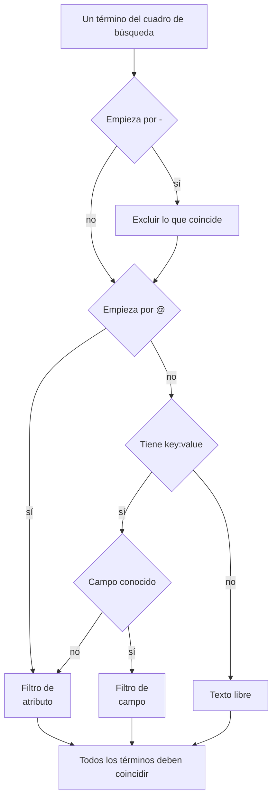

# Sintaxis de búsqueda

El cuadro de búsqueda sobre los exploradores de registros, trazas, métricas y excepciones habla un único lenguaje de consulta. Una consulta es una lista de filtros separados por espacios, y **todos los filtros deben coincidir**: no hay un OR implícito entre filtros. Use esta página como referencia mientras busca.

:::cards
- [Los dos tipos de filtro](#los-dos-tipos-de-filtro): Campos integrados, atributos y texto libre.
- [Coincidencia de valores](#coincidencia-de-valores): Comodines, «contiene», comparaciones y listas.
- [Excluir](#excluir): Invertir cualquier filtro con un `-` inicial.
- [Campos por señal](#campos-por-señal): Por qué puede filtrar en cada explorador.
:::

## Cómo se lee una consulta

```text
severity:error @platform.team:a* -@http.method:GET timeout
```

Se lee así: registros de nivel error cuyo atributo `platform.team` empieza por `a`, cuyo atributo `http.method` no es `GET` y cuyo mensaje menciona `timeout`.

| Término | Tipo | Coincide con |
| --- | --- | --- |
| `severity:error` | Campo | La gravedad del registro es Error. |
| `@platform.team:a*` | Atributo | El atributo `platform.team` empieza por `a`. |
| `-@http.method:GET` | Atributo excluido | El atributo `http.method` es cualquier cosa menos `GET`. |
| `timeout` | Texto libre | El mensaje contiene `timeout`. |

Cada término separado por espacios se lee por separado y luego todos se combinan con AND:



## Los dos tipos de filtro

| Forma | Filtra | Ejemplo |
| --- | --- | --- |
| `field:value` | Un campo integrado de la señal | `severity:error` |
| `@attribute:value` | Un atributo de OpenTelemetry de la fila | `@http.status_code:500` |
| palabras sueltas | El mensaje (registros), el nombre del span (trazas), el nombre de la métrica (métricas) o el mensaje de la excepción (excepciones) | `connection refused` |

Un `key:value` suelto cuya clave no es un campo conocido se trata como atributo, así que `k8s.pod:api-0` y `@k8s.pod:api-0` significan lo mismo. El prefijo `@` siempre significa «buscar en los atributos», con una excepción: en el explorador de excepciones, `@type:`, `@service:`, `@env:` y `@class:` siguen filtrando esos campos.

El texto que simplemente contiene dos puntos sigue siendo texto: `https://example.com` y `12:30` se buscan como palabras, no se leen como filtros.

## Coincidencia de valores

Todo lo de esta tabla funciona con cualquier atributo y con la mayoría de los campos integrados; [Campos por señal](#campos-por-señal) indica los campos que leen un valor de forma más sencilla.

| Usted escribe | Coincide con |
| --- | --- |
| `@k:abc` | exactamente `abc` |
| `@k:a*` | todo lo que empieza por `a`: `abc`, `alpha` |
| `@k:*c` | todo lo que termina en `c` |
| `@k:a*c` | empieza por `a` y termina en `c` |
| `@k:a?c` | `?` es exactamente un carácter: `abc`, `axc`, pero no `ac` |
| `@k:*` | el atributo está presente y no está vacío |
| `@k:~abc` | contiene `abc` en cualquier parte |
| `@k:!abc` | todo menos `abc` |
| `@k:>100` | mayor que 100. También `>=`, `<`, `<=` |
| `@k:(a OR b)` | cualquiera de los dos valores. `@k:[a, b]` es lo mismo |
| `@k:(a* OR b*)` | cualquiera de los dos patrones |

Las coincidencias con comodines y con «contiene» ignoran mayúsculas y minúsculas; la coincidencia exacta no, porque compara con el valor exactamente como se guardó.

### Valores con espacios

Ponga el valor entre comillas dobles:

```text
name:"SELECT wp_options"
@k8s.container.name:"my container"
```

Las comillas protegen los **espacios**, no los comodines: `@k:"a b*"` sigue coincidiendo con todo lo que empieza por `a b`.

### `*`, `?` y otros signos literales

Una barra invertida hace literal el carácter siguiente:

| Usted escribe | Coincide con |
| --- | --- |
| `@k:a\*b` | exactamente `a*b` |
| `@k:\~abc` | exactamente `~abc` |
| `@k:\>5` | exactamente `>5` |

Los valores que contienen `%` o `_` no necesitan escape: siempre son literales.

## Excluir

Un `-` inicial invierte cualquier filtro, incluidos los anteriores:

| Usted escribe | Coincide con |
| --- | --- |
| `-severity:debug` | todo menos debug |
| `-@platform.team:a*` | todo aquello cuyo `platform.team` **no** empieza por `a`, incluidas las filas que no tienen `platform.team` |
| `-@k:*` | el atributo falta o está vacío |
| `-@k:(a OR b)` | ninguno de los dos valores |
| `-@k:>100` | 100 o menos |
| `-@k:~abc` | no contiene `abc` |

En el explorador de trazas, `-` solo excluye atributos. `-status:error` se lee como texto que buscar en los nombres de span, y no encuentra nada; pida en su lugar los valores que quiere, como `status:(ok OR unset)`.

## Campos por señal

Los nombres de campo no distinguen mayúsculas y minúsculas: `statusMessage:` y `statusmessage:` son el mismo campo.

### Registros

| Campo | Alias | Notas |
| --- | --- | --- |
| `severity` | `level` | `fatal`, `error`, `warning` (o `warn`), `info` (o `information`), `debug`, `trace`, `unspecified`, con cualquier combinación de mayúsculas |
| `service` | | Nombre del servicio, escrito completo, con cualquier combinación de mayúsculas |
| `trace` | | ID de traza |
| `span` | | ID de span |
| `message` | `msg`, `log`, `body` | La línea de registro. Las palabras sueltas también la buscan |

### Trazas

Los campos de traza aceptan un valor simple o una lista como `status:(ok OR unset)`, y `duration` además acepta `>` y `<`. Los comodines, `~`, `!` y un `-` inicial aquí solo funcionan con atributos.

| Campo | Notas |
| --- | --- |
| `service` | Nombre del servicio |
| `name` | Nombre del span. Un único valor coincide con cualquier parte del nombre. Las palabras sueltas también lo buscan |
| `status` | `ok`, `error`, `unset` (unset = No se estableció ningún estado de error, el valor predeterminado de OpenTelemetry) |
| `kind` | `server`, `client`, `producer`, `consumer`, `internal` |
| `duration` | Milisegundos: `duration:>500`, `duration:<200` o un valor exacto |
| `statusMessage` | Texto del mensaje de estado. Un único valor coincide con cualquier parte del texto |
| `hasException` | `true` o `false` |
| `trace`, `span` | ID |

### Métricas

| Campo | Notas |
| --- | --- |
| `name` | Nombre de la métrica. Un valor simple coincide con cualquier parte del nombre, así que `name:http.server` encuentra `http.server.request.duration`. Las palabras sueltas también lo buscan |
| `service` | Nombre del servicio. Un valor simple coincide con cualquier parte del nombre |

### Excepciones

| Campo | Alias | Notas |
| --- | --- | --- |
| `type` | `exceptionType` | Tipo de excepción, por ejemplo `type:TypeError` |
| `env` | `environment` | Entorno, del atributo de recurso `deployment.environment` |
| `service` | | Nombre del servicio. Un valor simple coincide con cualquier parte del nombre |
| `class` | `errorClass` | De quién es la culpa del error: `code-fault`, `user-error`, `expected-denial`, `infrastructure` o `unknown` |

Las palabras sueltas buscan en el mensaje de la excepción.

El explorador de **Eventos de seguridad** usa el mismo lenguaje con campos propios, como `severity`, `tactic` y `user`: consulte [Eventos de seguridad](/docs/telemetry/security-events).

## Combinar filtros

Los filtros se combinan con AND. Se puede escribir `AND` entre ellos y no cambia nada:

```text
severity:error service:api          # both must hold
severity:error AND service:api      # identical
```

No hay OR ni NOT **entre** filtros: los `OR` y `NOT` escritos ahí se omiten, así que `NOT severity:debug` significa lo mismo que `severity:debug`. Excluya con un `-` inicial (`-severity:debug`) y, para aceptar cualquiera de dos valores de una misma clave, use la forma de lista:

```text
@http.method:(GET OR POST)
```

Dos filtros sobre la misma clave se combinan con AND; así se escribe un intervalo o un patrón con dos extremos:

```text
@http.status_code:>=500 @http.status_code:<=599
@k:a* @k:*z
```

## Chips y el cuadro de búsqueda

Pulsar Intro sobre un término `key:value` lo aplica, normalmente como un chip sobre los resultados. Un chip conserva el valor exactamente como se escribió, así que un comodín sigue siendo un comodín. Un término que un chip no puede llevar, como un `-key:value` excluido, se queda en el cuadro de búsqueda y filtra desde ahí. Hacer clic en un valor de la barra lateral de facetas añade el mismo tipo de chip, con su valor escapado: un valor guardado que contiene `*` filtra por ese valor literal, no como patrón.

Los chips forman parte de la vista guardada y de la URL de la página, así que un filtro sobrevive a una recarga, a un marcador y a un enlace compartido.

## Conviene saber

- Las **claves** de atributo se comparan sin distinguir mayúsculas y minúsculas en los filtros con comodín, «contiene», prefijo y sufijo, así que no tiene que recordar si se ingirió como `requestId` o como `requestid`.
- Un filtro `-@k:...` también coincide con filas que nunca tuvieron el atributo: una fila sin `platform.team` evidentemente no empieza por `a`.
- Las comparaciones numéricas funcionan con valores de atributo guardados como texto; un valor que no es un número nunca cumple una comparación.

## Próximos pasos

:::cards
- [Hacer zoom en un intervalo de tiempo](/docs/telemetry/charts-and-time-ranges): Acotar los exploradores al momento que importa.
- [Canalizaciones de registros](/docs/telemetry/log-pipelines): Convertir partes de una línea de registro en atributos que se pueden buscar.
- [Monitor de registros](/docs/monitor/logs-monitor): Alertar cuando aparezcan los registros que busca.
- [OpenTelemetry](/docs/telemetry/open-telemetry): Enviar registros, métricas y trazas para buscarlos.
:::
