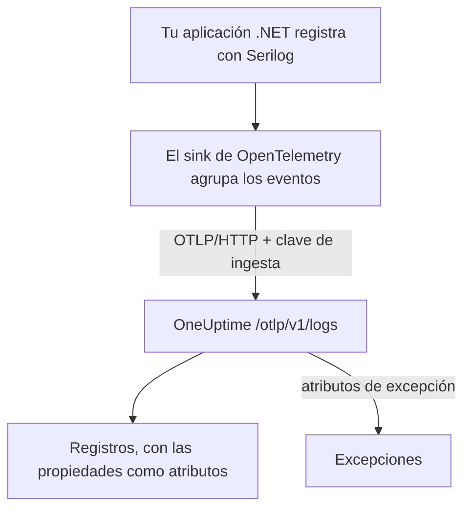

# Serilog (.NET)

[Serilog](https://serilog.net) es la biblioteca de registro estructurado más popular de .NET. Con el sink oficial [`Serilog.Sinks.OpenTelemetry`](https://github.com/serilog/serilog-sinks-opentelemetry), cada evento que tu aplicación registra con Serilog se envía a OneUptime mediante el OpenTelemetry Protocol (OTLP) y se puede buscar en **Productos → Registros** con sus propiedades estructuradas, su severidad y su correlación con las trazas.

No hay que instalar ningún paquete propio de OneUptime: el sink habla con el mismo endpoint OTLP que OneUptime expone para todos los datos de OpenTelemetry. Funciona con aplicaciones de consola, worker services, aplicaciones ASP.NET Core y cualquier otra cosa que se ejecute en .NET.

:::cards
- [Configurar el sink](#configurar-el-sink): Instala dos paquetes y configúralos en el código o en `appsettings.json`.
- [Excepciones](#excepciones): Las excepciones registradas se convierten en incidencias en Excepciones.
- [Solución de problemas](#solución-de-problemas): Qué revisar cuando no llega ningún registro.
:::

## Cómo funciona



El sink agrupa los eventos de registro y los envía en segundo plano. Cada propiedad con nombre se convierte en un atributo del registro, y una excepción registrada con Serilog llega con los atributos que OneUptime convierte en una incidencia.

## Antes de empezar

- Un proyecto de OneUptime. En OneUptime Cloud, la telemetría se factura por GB ingerido —consulta los [precios](https://oneuptime.com/pricing)— y un proyecto del plan Free necesita un método de pago antes de poder enviar telemetría.
- Una aplicación .NET que use Serilog, o que pueda usarlo.
- Una clave de ingesta de telemetría para autenticar tus registros. Si no tienes una:

:::steps
### Abrir las claves de ingesta

Ve a **Productos → Ajustes del proyecto**, abre **Telemetría y APM** en el menú lateral y selecciona **Claves de ingesta**.


### Crear una clave

Haz clic en **Crear clave de ingesta**. El diálogo ya tiene rellenado el nombre de la clave y elegido **Servidor** —el tipo de clave con el que envía una aplicación o un collector—, así que haz clic en **Crear clave de ingesta** para crearla, o cámbiale antes el nombre.

### Copiar el secreto

La nueva clave se abre en su propia página. Copia su **Clave secreta**: es el `YOUR_TELEMETRY_INGESTION_TOKEN` de los ejemplos de abajo.


:::

## Lo que necesitas de OneUptime

| Ajuste | Valor |
| ------------- | ------------------------------------------------------------ |
| Endpoint OTLP | `https://oneuptime.com/otlp` |
| Cabecera de autenticación | `x-oneuptime-token: YOUR_TELEMETRY_INGESTION_TOKEN` |
| Nombre del servicio | El nombre con el que debe aparecer tu servicio, p. ej. `my-service` |

> [!NOTE]
> ¿Alojas OneUptime tú mismo? Sustituye `https://oneuptime.com/otlp` por `https://YOUR-ONEUPTIME-HOST/otlp` (o `http://...` si no terminas TLS). Todo lo demás sigue igual.

Con el protocolo en `HttpProtobuf`, el sink añade la ruta `/v1/logs` al endpoint, así que la URL final a la que envía es `https://oneuptime.com/otlp/v1/logs`. Solo tienes que indicar el endpoint base `/otlp`.

## Configurar el sink

:::steps
### Instalar los paquetes NuGet

Añade Serilog y el sink de OpenTelemetry a tu proyecto:

```bash
dotnet add package Serilog
dotnet add package Serilog.Sinks.OpenTelemetry
```

Si configuras el sink desde `appsettings.json`, añade también `Serilog.Settings.Configuration`. Para aplicaciones ASP.NET Core, añade `Serilog.AspNetCore`, que conecta Serilog con el host y con la canalización de solicitudes:

```bash
dotnet add package Serilog.Settings.Configuration
dotnet add package Serilog.AspNetCore
```

### Configurar las opciones del sink

Apunta el sink a tu endpoint OTLP de OneUptime, pon el protocolo en `HttpProtobuf`, pasa tu token de ingesta como cabecera y etiqueta los registros con un `service.name`. Configúralo en el código, en `appsettings.json` o en el host de ASP.NET Core:

:::tabs
@tab En el código
```csharp title="Program.cs"
using Serilog;
using Serilog.Sinks.OpenTelemetry;

Log.Logger = new LoggerConfiguration()
    .MinimumLevel.Information()
    .Enrich.FromLogContext()
    .WriteTo.Console() // optional: keep local logs too
    .WriteTo.OpenTelemetry(options =>
    {
        // Base OTLP endpoint. The sink appends /v1/logs automatically.
        options.Endpoint = "https://oneuptime.com/otlp";
        options.Protocol = OtlpProtocol.HttpProtobuf;

        // Authenticate with your OneUptime telemetry ingestion token.
        options.Headers = new Dictionary<string, string>
        {
            ["x-oneuptime-token"] = "YOUR_TELEMETRY_INGESTION_TOKEN"
        };

        // Identify your service in OneUptime.
        options.ResourceAttributes = new Dictionary<string, object>
        {
            ["service.name"] = "my-service",
            ["deployment.environment"] = "production"
        };
    })
    .CreateLogger();

try
{
    Log.Information("Application starting up");
    // ... your application code ...
}
finally
{
    // Flush any buffered logs before the process exits.
    Log.CloseAndFlush();
}
```
@tab appsettings.json
Pon los ajustes del sink en `appsettings.json`:

```json title="appsettings.json"
{
  "Serilog": {
    "Using": ["Serilog.Sinks.OpenTelemetry"],
    "MinimumLevel": "Information",
    "WriteTo": [
      {
        "Name": "OpenTelemetry",
        "Args": {
          "endpoint": "https://oneuptime.com/otlp",
          "protocol": "HttpProtobuf",
          "headers": {
            "x-oneuptime-token": "YOUR_TELEMETRY_INGESTION_TOKEN"
          },
          "resourceAttributes": {
            "service.name": "my-service",
            "deployment.environment": "production"
          }
        }
      }
    ]
  }
}
```

Después, construye el logger a partir de la configuración:

```csharp title="Program.cs"
using Serilog;
using Microsoft.Extensions.Configuration;

IConfiguration configuration = new ConfigurationBuilder()
    .AddJsonFile("appsettings.json")
    .Build();

Log.Logger = new LoggerConfiguration()
    .ReadFrom.Configuration(configuration)
    .CreateLogger();
```
@tab ASP.NET Core
Para ASP.NET Core (hosting mínimo, .NET 6 o posterior), usa `Serilog.AspNetCore` para que Serilog sustituya al logger predeterminado y capture también los registros del framework y de las solicitudes:

```csharp title="Program.cs"
using Serilog;
using Serilog.Sinks.OpenTelemetry;

var builder = WebApplication.CreateBuilder(args);

builder.Host.UseSerilog((context, services, configuration) =>
{
    configuration
        .ReadFrom.Configuration(context.Configuration)
        .Enrich.FromLogContext()
        .WriteTo.OpenTelemetry(options =>
        {
            options.Endpoint = "https://oneuptime.com/otlp";
            options.Protocol = OtlpProtocol.HttpProtobuf;
            options.Headers = new Dictionary<string, string>
            {
                ["x-oneuptime-token"] = "YOUR_TELEMETRY_INGESTION_TOKEN"
            };
            options.ResourceAttributes = new Dictionary<string, object>
            {
                ["service.name"] = "my-service"
            };
        });
});

var app = builder.Build();

// Logs one summary event per HTTP request.
app.UseSerilogRequestLogging();

app.MapGet("/", () => "Hello World");
app.Run();
```
:::

> [!IMPORTANT]
> El sink agrupa los eventos de registro y los envía de forma asíncrona. Llama siempre a `Log.CloseAndFlush()` (o libera el logger) antes de que tu aplicación termine; si no, puede perderse el último lote de registros. En ASP.NET Core, `Serilog.AspNetCore` lo hace por ti en un apagado ordenado.

> [!TIP]
> Mantén el token fuera del control de versiones. Léelo de una variable de entorno o de un almacén de secretos e inyéctalo en la configuración al arrancar, en lugar de confirmarlo en `appsettings.json`.

### Escribir registros

Usa Serilog como siempre. Las propiedades estructuradas se conservan y se convierten en atributos que puedes buscar en OneUptime:

```csharp
Log.Information("Order {OrderId} placed by {CustomerId} for {Amount:C}",
    orderId, customerId, amount);

Log.Warning("Payment gateway slow: {LatencyMs}ms", latencyMs);
```

Cada propiedad con nombre (`OrderId`, `CustomerId`, `Amount`, `LatencyMs`) se envía como atributo del registro, así que puedes filtrar y buscar por ellas en el explorador de **Productos → Registros**.

### Comprobar que llegan los registros

Ejecuta tu aplicación y escribe algunos eventos de registro. En pocos segundos aparecen en **Productos → Registros** y en la página de tu servicio en **Productos → Servicios**; el servicio se llama como el `service.name` que configuraste (`my-service`). Sus propiedades estructuradas están disponibles como filtros.
:::

## Excepciones

Cuando registras una excepción con Serilog, el sink adjunta al registro los atributos de OpenTelemetry `exception.type`, `exception.message` y `exception.stacktrace`:

```csharp
try
{
    ProcessPayment();
}
catch (Exception ex)
{
    Log.Error(ex, "Failed to process payment for order {OrderId}", orderId);
}
```

OneUptime detecta estos atributos y agrupa el error en una incidencia en **Excepciones**, por huella y atribuido al servicio correcto. Un error que notifican a la vez una traza y un registro se fusiona en una sola incidencia. Consulta [Excepciones a partir de registros](/docs/telemetry/open-telemetry#excepciones-a-partir-de-registros) para ver cómo funciona la detección.

## Correlación con trazas

Si tu aplicación también está instrumentada con el SDK de OpenTelemetry para .NET para trazas, los eventos de Serilog emitidos dentro de un span activo reciben automáticamente el `TraceId` y el `SpanId` actuales (forma parte de los `IncludedData` predeterminados del sink). Así OneUptime enlaza una línea de registro directamente con la traza en la que ocurrió, y puedes saltar de un registro a la solicitud que lo rodea y volver.

Para enviar también trazas y métricas, consulta la configuración de .NET en el [inicio rápido de OpenTelemetry](/docs/telemetry/open-telemetry#inicio-rápido).

## Solución de problemas

:::details No aparece ningún registro
Revisa el valor de `x-oneuptime-token` y confirma que pertenece al proyecto que estás mirando. Comprueba que el endpoint sea `https://oneuptime.com/otlp` (solo la ruta base: no añadas `/v1/logs` tú mismo). Para ver por qué falla el sink, activa al arrancar la salida de errores propia de Serilog con `Serilog.Debugging.SelfLog.Enable(Console.Error)`: muestra el código de estado con el que responde OneUptime.
:::

:::details Los registros solo aparecen al cerrar la aplicación, o faltan los últimos
Asegúrate de que `Log.CloseAndFlush()` se ejecute al apagar. El sink agrupa los eventos, así que los registros en búfer se pierden si el proceso termina sin vaciarlos.
:::

:::details 401 Unauthorized, y no se ingiere nada
Falta la clave, es desconocida o ha caducado. Comprueba que el nombre de la cabecera sea exactamente `x-oneuptime-token` y que su valor sea la **Clave secreta** de la clave.
:::

:::details 402 o 422, y no se ingiere nada
`402`: en OneUptime Cloud, el proyecto está en el plan Free y no tiene método de pago. Añade uno en **Ajustes del proyecto → Facturación y facturas → Facturación**. `422`: la clave está deshabilitada, o es una clave de navegador. Vuelve a activar **Habilitado** en los ajustes de la clave, o crea una clave de **Servidor**.
:::

:::details Los registros llegan con un nombre de servicio incorrecto
Define `service.name` en `ResourceAttributes` (código) o `resourceAttributes` (appsettings.json). Sin él, tus registros se guardan con el nombre provisional que envía el sink en su lugar, y no con el de tu servicio.
:::

:::details Errores de conexión con una instancia autoalojada
Asegúrate de que el protocolo coincida con el esquema de tu endpoint (`https://` o `http://`) y de que tu host de OneUptime sea accesible desde la aplicación.
:::

Si tienes alguna pregunta o necesitas ayuda, escríbenos a support@oneuptime.com.

## Próximos pasos

:::cards
- [OpenTelemetry](/docs/telemetry/open-telemetry): Envía también trazas y métricas desde .NET.
- [Canalizaciones de registros](/docs/telemetry/log-pipelines): Analiza y enriquece los registros al llegar.
- [Monitor de registros](/docs/monitor/logs-monitor): Alerta cuando aparezcan registros que coincidan.
- [Sintaxis de búsqueda](/docs/telemetry/search-syntax): Filtra por tus propiedades de Serilog.
:::
