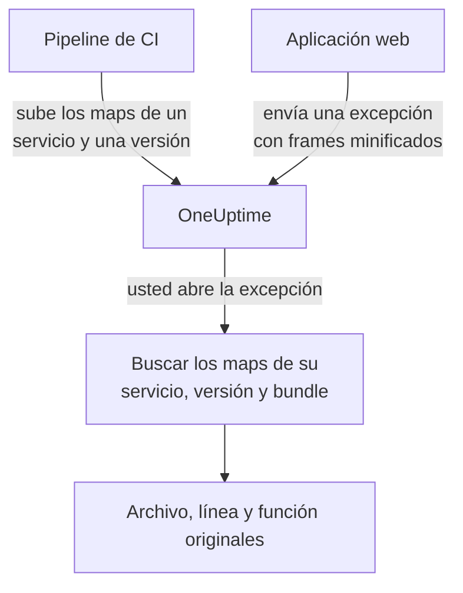

# Source maps

Suba a OneUptime los source maps de su build de front-end, y las excepciones del navegador en **Excepciones** mostrarán sus nombres de archivo, líneas y funciones originales en lugar de los minificados. Esta página es para desarrolladores de front-end que ya envían telemetría del navegador a OneUptime.

:::cards
- [Cómo funciona la coincidencia](#cómo-funciona-la-coincidencia): Nombre del servicio, versión y archivo del bundle.
- [Subir source maps](#subir-source-maps): Una sola petición `curl` desde la CI.
- [Límites](#límites): Tamaños, cantidades y los ajustes para autoalojamiento.
- [Ver trazas de pila resueltas](#ver-trazas-de-pila-resueltas): Cómo se ve un frame resuelto.
:::

## Descripción general

Los bundles de front-end de producción están minificados, así que una excepción del navegador capturada con el SDK web de OpenTelemetry llega con frames de pila como estos:

```text
TypeError: Cannot read properties of undefined (reading 'id')
    at e.onSelect (https://app.example.com/assets/main.a8f1b2.js:1:48291)
```

Suba a OneUptime los source maps de su build y el panel de excepciones resolverá esos frames al archivo, la línea y el nombre de función originales y, cuando el map se construyó con `sourcesContent`, a las líneas cercanas de su código fuente original.

Los maps se suben a OneUptime mediante una API autenticada y **nunca se descargan de su sitio**, así que puede (y debería) seguir construyendo con `hidden-source-map` (webpack) o `sourcemap: 'hidden'` (Vite / Rollup) y no publicar nunca los archivos `.map` junto a sus bundles.



## Cómo funciona la coincidencia

Un source map se guarda con tres claves:

| Clave | Debe coincidir con |
|---|---|
| Nombre del servicio | El atributo de recurso de OpenTelemetry `service.name` con el que su aplicación web envía telemetría |
| Versión del servicio | El atributo de recurso `service.version` (su identificador de versión) |
| Ruta del bundle | El archivo minificado para el que se generó el map, por ejemplo `main.a8f1b2.js` |

Cuando abre una excepción, OneUptime busca los maps subidos para el servicio y la versión de esa excepción, asocia cada frame de pila con un bundle por nombre de archivo (los sufijos de ruta bastan: `main.a8f1b2.js` coincide con `https://app.example.com/assets/main.a8f1b2.js`) y resuelve la línea y la columna minificadas a través del map. La resolución ocurre de forma diferida al ver la excepción, nunca durante la ingesta, así que un map subido unos minutos *después* del primer error de una nueva versión se aplica igualmente de forma retroactiva.

## Antes de empezar

- Una clave de ingesta de telemetría de tipo **Servidor**, de **Ajustes del proyecto → Telemetría y APM → Claves de ingesta**. Consulte [Crear una clave de ingesta](/docs/telemetry/open-telemetry#crear-una-clave-de-ingesta).
- Una aplicación web que ya envía excepciones a OneUptime con el SDK web de OpenTelemetry: consulte [Configuración para navegadores](/docs/rum/browser-setup).
- Un build que genere source maps, con `sourcesContent` incluido (lo predeterminado en la mayoría de los bundlers) si quiere fragmentos de código alrededor de cada frame.

## Subir source maps

:::steps
### Enviar `service.version` con su telemetría

Su aplicación web debe enviar `service.version`, y debe ser la misma cadena con la que sube los maps:

```javascript
import { resourceFromAttributes } from "@opentelemetry/resources";

const resource = resourceFromAttributes({
  "service.name": "my-web-app",
  "service.version": "1.4.2", // same value you upload maps with
});
```

Sirve cualquier identificador de versión estable (una versión semántica, el SHA de un commit de git, un número de build) siempre que el `serviceVersion` subido y el atributo de recurso `service.version` sean la misma cadena.

### Subir los maps después de cada build de producción

Suba desde la CI, con su clave de ingesta en la cabecera `x-oneuptime-token`:

```bash
curl --fail -X POST "https://oneuptime.com/source-maps/v1/upload" \
  -H "x-oneuptime-token: YOUR_TELEMETRY_INGESTION_KEY" \
  -F "serviceName=my-web-app" \
  -F "serviceVersion=1.4.2" \
  -F "sourcemap=@dist/assets/main.a8f1b2.js.map" \
  -F "sourcemap=@dist/assets/vendor.9c3d4e.js.map"
```

En las instalaciones autoalojadas, sustituya `oneuptime.com` por su host de OneUptime. `Authorization: Bearer YOUR_KEY` se acepta como alternativa a la cabecera `x-oneuptime-token`.

### Comprobar la subida

Una subida correcta devuelve un cuerpo JSON con los maps guardados, para que la CI pueda verificarlo. Los maps también aparecen en la página **Source maps** del servicio en OneUptime.
:::

Un paso típico de CI sube todos los maps que generó el build:

```bash
VERSION="$(git rev-parse --short HEAD)"

find dist -name "*.js.map" -print0 | while IFS= read -r -d '' map; do
  curl --fail -X POST "https://oneuptime.com/source-maps/v1/upload" \
    -H "x-oneuptime-token: $ONEUPTIME_INGESTION_KEY" \
    -F "serviceName=my-web-app" \
    -F "serviceVersion=$VERSION" \
    -F "sourcemap=@$map"
done
```

### Reglas de subida

- La ruta del bundle de cada archivo subido es su nombre sin el `.map` final: `main.a8f1b2.js.map` pasa a ser `main.a8f1b2.js`. Si el nombre de su archivo de map no sigue esa convención, suba un archivo por petición y pase un campo `bundlePath` explícito.
- Volver a subir el mismo bundle para el mismo servicio y la misma versión sustituye el map anterior, así que los reintentos de la CI no causan problemas.
- Los archivos deben ser JSON de [source map v3](https://tc39.es/ecma426/) (lo que genera cualquier bundler moderno; también se admiten los maps indexados con `sections`).
- Si el operador de su instalación autoalojada desactivó la ingesta de telemetría (`DISABLE_TELEMETRY_INGESTION`), las subidas devuelven una respuesta de éxito vacía y no se guarda nada, el mismo comportamiento que tiene en ese modo todo endpoint de ingesta de telemetría. Una subida real siempre devuelve un cuerpo JSON con los maps guardados, así que la CI puede distinguir los dos casos.

## Límites

Cada archivo `.map` puede ocupar hasta 50 MB, pero el ingress también limita el **cuerpo completo de la petición** a 50 MB, así que suba los maps grandes de uno en uno. Se aceptan hasta 50 archivos por petición, y una versión (servicio + versión) puede contener como máximo 1000 maps en total; una subida que superara esa cifra se rechaza con un mensaje que nombra el límite. Un build que genere más maps de los que acepta una petición simplemente envía varias peticiones: las subidas de una misma versión se acumulan.

Las instalaciones autoalojadas pueden cambiar estos valores. Los cinco son variables de entorno normales, y el chart de Helm los expone en `sourceMaps` dentro de `values.yaml`:

| `values.yaml` | Variable de entorno | Predeterminado |
| --- | --- | --- |
| `sourceMaps.maxMapsPerRelease` | `SOURCE_MAP_MAX_MAPS_PER_RELEASE` | `1000` |
| `sourceMaps.maxFilesPerRequest` | `SOURCE_MAP_MAX_FILES_PER_REQUEST` | `50` |
| `sourceMaps.maxFileSizeBytes` | `SOURCE_MAP_MAX_FILE_SIZE_BYTES` | `52428800` |
| `sourceMaps.maxBytesPerResolve` | `SOURCE_MAP_MAX_BYTES_PER_RESOLVE` | `536870912` |
| `sourceMaps.retentionDays` | `SOURCE_MAP_RETENTION_DAYS` | `90` |

`maxMapsPerRelease` es el que conviene subir si su build supera el valor predeterminado; es solo un límite de forma del almacenamiento, porque la resolución está acotada por `maxBytesPerResolve` y no por la cantidad de maps de una versión. `maxFilesPerRequest` y `maxFileSizeBytes` solo se pueden **reducir**: el cuerpo multipart se analiza antes de autenticar la petición, así que los topes compartidos por encima de ellos son los que se aplican a cualquier llamante no autenticado, y un valor mayor se reduce en lugar de aplicarse.

## Ver trazas de pila resueltas

Abra cualquier excepción en **Excepciones** del panel. Los frames resueltos con un source map muestran una insignia **Con source map** y presentan el nombre de función y la ubicación de archivo originales; al desplegar un frame se ve el fragmento de código fuente original (cuando el map incluye `sourcesContent`) junto a la ubicación minificada.

Los maps subidos de un servicio se pueden revisar y eliminar en **Productos → Servicios → su servicio → Source maps**, que lista la versión, el bundle, el tamaño y la hora de subida de cada map.

## Retención

Los source maps se conservan 90 días tras la subida y después se eliminan automáticamente. Un map solo es útil mientras las excepciones de su versión estén dentro de su ventana de retención de telemetría, así que este plazo supera con holgura el de las excepciones que desminifica. Vuelva a subir los maps de una versión si los necesita de nuevo.

## Seguridad

- Los maps se suben por un endpoint autenticado y se guardan en su proyecto de OneUptime: nunca se descargan de su sitio web, así que los source maps ocultos siguen ocultos.
- El contenido bruto de un map (que incluye su código fuente original si se construyó con `sourcesContent`) solo pueden volver a leerlo los propietarios y administradores del proyecto, y quien tenga el permiso **Read Telemetry Source Map**. Los demás miembros del equipo solo ven los frames resueltos y las pocas líneas de código alrededor de cada punto de fallo de las excepciones a las que ya tienen acceso.
- Al eliminar un servicio se eliminan sus source maps.

## Solución de problemas

:::details Los frames siguen minificados
La versión de la excepción no tiene maps que coincidan. Compruebe que el `service.version` que envía su aplicación es exactamente el `serviceVersion` con el que subió, que `serviceName` coincide con `service.name` y que se subió un map para ese archivo de bundle: la página **Source maps** del servicio lista la versión y el bundle de cada map.
:::

:::details La subida se rechaza porque un map es demasiado grande
Un map puede ocupar hasta 50 MB, y la petición completa también. Suba los maps grandes de uno en uno, como hace el bucle de CI de arriba.
:::

## Próximos pasos

:::cards
- [Configuración para navegadores](/docs/rum/browser-setup): Enviar trazas y excepciones del navegador con el SDK web de OpenTelemetry.
- [Monitor de excepciones](/docs/monitor/exceptions-monitor): Alertar cuando aparezcan excepciones nuevas.
- [OpenTelemetry](/docs/telemetry/open-telemetry): Endpoints, claves y límites para toda la telemetría.
:::
