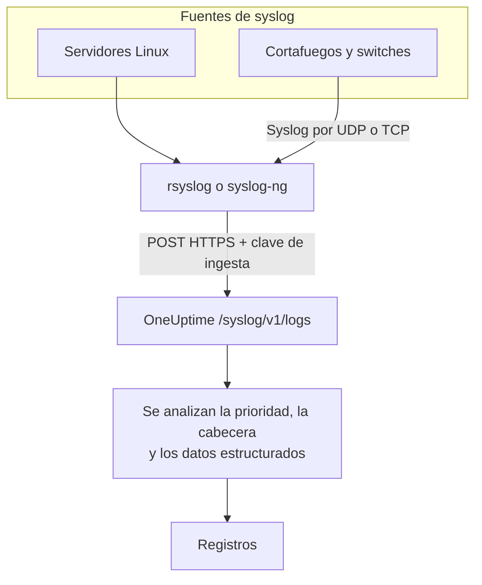

# Syslog

OneUptime acepta syslog por HTTPS. Envía mensajes RFC 5424 o RFC 3164 a `/syslog/v1/logs` con tu clave de ingesta, y cada uno se convierte en un registro que puedes buscar, con su prioridad, facility, severidad, host, aplicación y datos estructurados como atributos. Úsalo para reenviar desde rsyslog, syslog-ng o cualquier relé que pueda hacer solicitudes HTTP.

:::cards
- [Enviar un mensaje de prueba](#enviar-un-mensaje-de-prueba): Una sola solicitud `curl`.
- [Reenviar desde rsyslog](#reenviar-desde-rsyslog): Envía todo lo que recibe un servidor o un relé.
- [Atributos extraídos](#atributos-extraídos): Lo que OneUptime extrae de cada mensaje.
- [Solución de problemas](#solución-de-problemas): Solicitudes rechazadas y servicios inesperados.
:::

## Cómo funciona



OneUptime responde en cuanto ha leído los mensajes de la solicitud, y los analiza y guarda un momento después. El texto del mensaje queda en el cuerpo del registro; todo lo demás se convierte en un atributo.

> [!TIP]
> Los dispositivos de red que monitorizas con una sonda de OneUptime pueden enviar su syslog directamente a la sonda por UDP, sin relé; los registros aparecen entonces en el dispositivo en OneUptime. Consulta [Guías por fabricante de red](/docs/monitor/network-vendor-guides).

## Antes de empezar

- **Un proyecto de OneUptime**: en OneUptime Cloud, la telemetría se factura por GB ingerido, y un proyecto del plan Free necesita un método de pago antes de poder enviar telemetría.
- **Clave de ingesta de telemetría**: crea una clave de **Servidor** en **Productos → Ajustes del proyecto → Telemetría y APM → Claves de ingesta** y copia su **Clave secreta**. La envías en la cabecera `x-oneuptime-token`.
- **Reenviador de syslog**: cualquier herramienta capaz de enviar solicitudes HTTP POST (por ejemplo `curl`, `rsyslog` mediante `omhttp`, o `syslog-ng` con su destino HTTP).
- **Nombre del servicio (opcional)**: define la cabecera `x-oneuptime-service-name` para agrupar los registros entrantes bajo un servicio de telemetría concreto. Si no la defines, OneUptime recurre al `APP-NAME` del syslog, al nombre de host o a `Syslog`.

## Endpoint

```http
POST https://oneuptime.com/syslog/v1/logs
```

| Cabecera | Obligatoria | Valor |
| --- | --- | --- |
| `x-oneuptime-token` | Sí | Tu clave de ingesta. |
| `Content-Type` | Sí, para cuerpos JSON | `application/json` |
| `x-oneuptime-service-name` | No | El servicio al que pertenecen los registros. |
| `Content-Encoding` | No | `gzip`, para un cuerpo comprimido. |

Sustituye `oneuptime.com` por tu host si alojas OneUptime tú mismo.

## Cuerpo de la solicitud

Envía una carga JSON con un array `messages`. Se admiten los formatos RFC 5424 y RFC 3164 (BSD), y puedes mezclarlos en una misma solicitud:

```json
{
  "messages": [
    "<34>1 2025-03-02T14:48:05.003Z web-01 nginx 7421 ID47 [env@32473 host=\"web-01\"] 502 on /api/login",
    "<13>Feb  5 17:32:18 db-01 postgres[2419]: connection received from 10.0.0.12"
  ]
}
```

### Formatos de cuerpo admitidos

| Cuerpo | Cómo enviarlo |
| --- | --- |
| Un objeto JSON con un array `messages` | `Content-Type: application/json`: lo recomendado. |
| Un array JSON de mensajes | `Content-Type: application/json`. |
| Un objeto JSON con un solo `message` | `Content-Type: application/json`. Un valor con varias líneas se lee como varios mensajes. |
| Mensajes separados por saltos de línea | Comprimidos con gzip y enviados con `Content-Encoding: gzip`. |

Un cuerpo de texto plano que no esté comprimido con gzip no se lee, y la solicitud se rechaza con `400`. Un cuerpo comprimido con gzip siempre se lee como mensajes separados por saltos de línea, así que no comprimas un cuerpo JSON. Mantén cada solicitud por debajo de 1 MB: el ingress de OneUptime no amplía el límite predeterminado de nginx para el cuerpo de la solicitud en este endpoint.

## Enviar un mensaje de prueba

```bash
curl \
  -X POST https://oneuptime.com/syslog/v1/logs \
  -H "Content-Type: application/json" \
  -H "x-oneuptime-token: YOUR_TELEMETRY_KEY" \
  -H "x-oneuptime-service-name: production-web" \
  -d '{
    "messages": [
      "<34>1 2025-03-02T14:48:05.003Z web-01 nginx 7421 ID47 [env@32473 host=\"web-01\"] 502 on /api/login"
    ]
  }'
```

Un `200` significa que el mensaje se aceptó. Abre **Productos → Registros**: el registro aparece en el servicio `production-web` con el cuerpo `502 on /api/login`, la severidad `Error` y los atributos de [Atributos extraídos](#atributos-extraídos).

## Reenviar desde rsyslog

rsyslog envía a OneUptime con su módulo de salida HTTP, `omhttp`.

:::steps
### Asegurarte de que `omhttp` está disponible

La configuración de abajo lo carga con `module(load="omhttp")`. Si rsyslog informa de que no puede cargar el módulo, instala el paquete que proporciona `omhttp` en tu distribución.

### Añadir el destino de OneUptime

Crea `/etc/rsyslog.d/oneuptime.conf`. La plantilla reconstruye cada mensaje como una línea RFC 5424 y la envuelve en el cuerpo JSON que espera OneUptime:

```text title="/etc/rsyslog.d/oneuptime.conf"
module(load="omhttp")

template(name="OneUptimeJson" type="string"
         string="{\"messages\":[\"<%PRI%>1 %TIMESTAMP:::date-rfc3339% %HOSTNAME% %APP-NAME% %PROCID% %MSGID% - %msg:::json%\"]}")

action(
  type="omhttp"
  server="oneuptime.com"
  serverport="443"
  usehttps="on"
  restpath="syslog/v1/logs"
  httpheaders=[
    "x-oneuptime-token: YOUR_TELEMETRY_KEY",
    "x-oneuptime-service-name: rsyslog-demo"
  ]
  template="OneUptimeJson"
)
```

`restpath` recibe la ruta sin la barra inicial. `omhttp` envía por defecto un `Content-Type` JSON, que es lo que produce esta plantilla.

### Comprobar la configuración y reiniciar rsyslog

```bash
sudo rsyslogd -N1
sudo systemctl restart rsyslog
```

`rsyslogd -N1` valida la configuración sin arrancar rsyslog. Tras el reinicio, los mensajes nuevos aparecen en **Productos → Registros**, en el servicio `rsyslog-demo`.
:::

La acción reenvía todos los mensajes que maneja rsyslog: los programas locales, el journal de systemd cuando rsyslog lo lee y todo lo que recibe de la red.

### Retransmitir el syslog de los dispositivos de red

Los cortafuegos, switches y otros dispositivos suelen enviar syslog solo por UDP o TCP. Apúntalos a un relé rsyslog y deja que el relé reenvíe por HTTPS. Añade un listener a la configuración del relé, antes de la `action`:

```text title="/etc/rsyslog.d/oneuptime.conf"
module(load="imudp")
input(type="imudp" port="514")
```

Pon en `x-oneuptime-service-name` un nombre como `perimeter-firewall`, o quita la cabecera para que los registros de cada dispositivo se agrupen por su nombre de host. Muchos dispositivos escriben su mensaje como pares `key=value`; un [Key=Value Parser](/docs/telemetry/log-pipelines#keyvalue-parser) los convierte en atributos.

:::details Enviar por lotes en lugar de una solicitud por mensaje
rsyslog puede agrupar los mensajes y comprimirlos con gzip, lo que OneUptime lee como mensajes separados por saltos de línea. Sustituye la plantilla y la acción por:

```text title="/etc/rsyslog.d/oneuptime.conf"
template(name="OneUptimeLine" type="string"
         string="<%PRI%>1 %TIMESTAMP:::date-rfc3339% %HOSTNAME% %APP-NAME% %PROCID% %MSGID% - %msg%")

action(
  type="omhttp"
  server="oneuptime.com"
  serverport="443"
  usehttps="on"
  restpath="syslog/v1/logs"
  httpheaders=["x-oneuptime-token: YOUR_TELEMETRY_KEY"]
  template="OneUptimeLine"
  batch="on"
  batch.format="newline"
  compress="on"
)
```

Mantén `compress="on"`: OneUptime solo lee mensajes separados por saltos de línea de un cuerpo comprimido con gzip.
:::

### Otros reenviadores

- **syslog-ng**: usa su destino HTTP con la misma URL, las mismas cabeceras y el mismo cuerpo JSON.
- **Fluent Bit**: recibe el syslog con la entrada `syslog` de Fluent Bit y reenvíalo como cualquier otro registro. Consulta [Fluent Bit](/docs/telemetry/fluentbit).

## Atributos extraídos

OneUptime añade automáticamente los siguientes atributos a cada entrada de registro:

| Atributo | Valor | Del mensaje de prueba |
| --- | --- | --- |
| `syslog.priority` | La prioridad, `<PRI>` | `34` |
| `syslog.facility.code`, `syslog.facility.name` | La facility, a partir de la prioridad | `4`, `security` |
| `syslog.severity.code`, `syslog.severity.name` | La severidad, a partir de la prioridad | `2`, `critical` |
| `syslog.version` | La versión de RFC 5424 | `1` |
| `syslog.hostname` | `HOSTNAME` | `web-01` |
| `syslog.appName` | `APP-NAME`, o la etiqueta de RFC 3164 | `nginx` |
| `syslog.processId` | `PROCID` | `7421` |
| `syslog.messageId` | `MSGID` | `ID47` |
| `syslog.structured.raw` | Los datos estructurados de RFC 5424, tal como se enviaron | `[env@32473 host="web-01"]` |
| `syslog.structured.*` | Cada parámetro de los datos estructurados, aplanado | `syslog.structured.env_32473.host` = `web-01` |
| `syslog.raw` | El mensaje original, para la trazabilidad | la línea completa |

Estos atributos se pueden buscar en el explorador de **Productos → Registros**, por ejemplo `@syslog.severity.name:error` o `@syslog.hostname:web-01`. Consulta [Sintaxis de búsqueda](/docs/telemetry/search-syntax).

El mensaje en sí queda en el cuerpo del registro. Cortafuegos como Sophos XGS y Fortinet FortiGate lo escriben como pares `key=value` (`log_component="IPSec" con_name="HQ-Branch1" status="Terminated"`); añade un procesador **Key=Value Parser** en una [canalización de registros](/docs/telemetry/log-pipelines#keyvalue-parser) para convertir también esos pares en atributos.

### Severidad

| Severidad de syslog | Código | Severidad en OneUptime |
| --- | --- | --- |
| Emergency, Alert | `0`, `1` | `Fatal` |
| Critical, Error | `2`, `3` | `Error` |
| Warning | `4` | `Warning` |
| Notice, Informational | `5`, `6` | `Information` |
| Debug | `7` | `Debug` |
| Sin prioridad en el mensaje | — | `Unspecified` |

Un mensaje sin marca de tiempo se guarda con la hora a la que OneUptime lo recibió.

### Servicio

Cada registro se guarda bajo un servicio de telemetría, que OneUptime crea la primera vez que envía. El servicio es el primero disponible de:

1. la cabecera `x-oneuptime-service-name`;
2. el `APP-NAME` (o la etiqueta) del mensaje;
3. el nombre de host del mensaje;
4. `Syslog`.

## Solución de problemas

:::details HTTP 401
Falta la clave, es desconocida o ha caducado. Comprueba que la cabecera `x-oneuptime-token` lleve la **Clave secreta** de una clave de ingesta del proyecto que debe recibir los registros.
:::

:::details HTTP 402 o 422
`402`: en OneUptime Cloud, el proyecto está en el plan Free y no tiene método de pago. Añade uno en **Ajustes del proyecto → Facturación y facturas → Facturación**. `422`: la clave está deshabilitada, o es una clave de navegador. Vuelve a activar **Habilitado** en los ajustes de la clave, o crea una clave de **Servidor**.
:::

:::details HTTP 400, o no aparece ningún registro
Confirma que el cuerpo de la solicitud contiene realmente líneas de syslog, como JSON con `Content-Type: application/json`. Los cuerpos vacíos, y los de texto plano sin comprimir con gzip, se rechazan con HTTP 400.
:::

:::details HTTP 413
La solicitud es mayor de lo que acepta el ingress. Envía menos mensajes por solicitud.
:::

:::details Los registros llegan con un nombre de servicio inesperado
Define `x-oneuptime-service-name` para anular la detección predeterminada, que usa el `APP-NAME` y después el nombre de host.
:::

## Próximos pasos

:::cards
- [Canalizaciones de registros](/docs/telemetry/log-pipelines): Convierte los mensajes `key=value` en atributos.
- [Reglas de grabación de registros](/docs/telemetry/log-recording-rules): Convierte los números de tu syslog en métricas.
- [Monitor de registros](/docs/monitor/logs-monitor): Alerta cuando lleguen mensajes de syslog que coincidan.
:::
