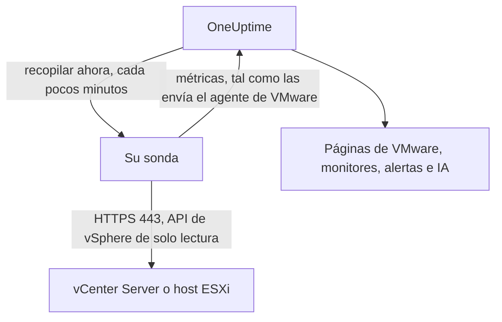

# VMware sin agente

Supervise un vCenter Server, o un host ESXi independiente, sin instalar nada: introduzca en OneUptime la dirección de vCenter y una cuenta de solo lectura, elija la sonda que puede alcanzarlo, y la sonda recopila los mismos datos que el [agente de VMware](/docs/telemetry/vmware). No hay ningún agente que instalar, actualizar o mantener en ejecución, ni ninguna máquina propia que aprovisionar.

:::cards
- [Antes de empezar](#antes-de-empezar): Una sonda que alcance vCenter y una cuenta de solo lectura.
- [Conectar un vCenter](#conectar-un-vcenter): Cuatro campos, una prueba y un nombre.
- [Solución de problemas](#solución-de-problemas): Qué significa cada mensaje y qué lo soluciona.
:::

## Cómo funciona

Cada pocos minutos la sonda inicia sesión en vCenter con la cuenta que guardó, lee el inventario, los contadores de rendimiento y las estadísticas de vSAN, y los envía a OneUptime. Llegan exactamente igual que los del agente de VMware, así que cada página de VMware, cada [monitor de VMware](/docs/monitor/vmware-monitor), cada plantilla de alerta y OneUptime AI los leen de la misma manera. La sonda mantiene su sesión de vCenter entre recopilaciones, para que el registro de eventos de vCenter no se llene de inicios de sesión.

## ¿Sonda o agente?

| | Una sonda (esta página) | El agente de VMware |
|---|---|---|
| Qué ejecuta usted | Una sonda que ya ejecuta, o una nueva | El agente, en una máquina propia |
| Dónde se guarda la cuenta | Cifrada en OneUptime, enviada solo a la sonda | En el archivo `.env` del agente |
| A qué necesita llegar | A vCenter por TCP 443, desde la sonda | A vCenter por TCP 443, desde el agente |
| vCenter más grande | Unos 48 MiB de métricas por recopilación | Sin límite |
| Syslog de ESXi y el agente de IA | No incluidos | Incluidos |

Ambos envían los mismos datos. Puede cambiar un vCenter de uno a otro en cualquier momento desde su página **Ajustes**.

## Antes de empezar

- **Una sonda que pueda alcanzar vCenter por TCP 443.** Suele ser una [sonda personalizada](/docs/probe/custom-probe) en la red de vCenter. En OneUptime Cloud, las sondas compartidas nunca reciben una contraseña de vCenter, así que añada una sonda propia. En una instancia autoalojada, las sondas propias de la instancia también pueden recopilar.
- **Un usuario de vSphere con el rol Read-Only** en el objeto vCenter de nivel superior, con **Propagate to children** marcado. Siga [Crear el usuario de vSphere de solo lectura](/docs/telemetry/vmware#create-the-read-only-vsphere-user): es la misma cuenta que usa el agente.

> [!IMPORTANT]
> Sin **Propagate to children**, el usuario inicia sesión pero no ve nada, y la sonda informa de que la cuenta no puede leer el inventario de vCenter.

## Conectar un vCenter

:::steps
### Abrir los vCenter
En OneUptime, abra **VMware → Todos los vCenter** y haga clic en **Conectar vCenter**.

### Introducir la dirección y la cuenta
Introduzca la dirección en la que abre vSphere Client, como `https://vcsa.example.com`, el nombre de usuario con su dominio, como `oneuptime@vsphere.local`, y su contraseña. Elija la sonda que alcanza vCenter.

### Probar la conexión
En el paso siguiente, haga clic en **Probar conexión**. La sonda inicia sesión, lee lo que la cuenta puede ver y cierra la sesión, y el resultado indica cuántos centros de datos, clústeres, hosts, máquinas virtuales y almacenes de datos encontró.

### Confiar en el certificado de vCenter
De forma predeterminada, vCenter usa un certificado de su propia autoridad, en el que la sonda no confía. La prueba muestra entonces el certificado: compare su huella con la del propio vCenter y haga clic en **Confiar en este certificado**.

### Darle un nombre y conectar
El nombre predeterminado es el nombre de host de vCenter. Haga clic en **Conectar vCenter** para guardar.
:::

La **Vista general** del vCenter muestra una tarjeta **Recopilación de datos**. Indica **Comprobando** hasta la primera recopilación, que empieza en menos de un minuto, después **Recopilando**, y el inventario se completa.

## Certificados

La sonda nunca omite la verificación de certificados. Cada conexión completa un protocolo de enlace TLS completo, y después:

- si no hay ningún certificado de confianza, el certificado de vCenter debe proceder de una autoridad en la que confíe la máquina de la sonda, para la dirección introducida;
- si hay un certificado de confianza, vCenter debe presentar exactamente ese certificado, identificado por su huella SHA-256. No se acepta nada más, ni siquiera un certificado de confianza pública.

Para comprobar una huella, abra vSphere Client en **Administration → Certificates → Certificate Management**, o ejecute `openssl s_client -connect vcsa.example.com:443 </dev/null | openssl x509 -noout -fingerprint -sha256` desde la máquina de la sonda.

Cuando se renueva el certificado de vCenter, la recopilación se detiene con **El certificado de vCenter cambió** y se muestra el nuevo certificado. No se envía nada a vCenter hasta que confíe en él, desde la página **Vista general** o **Ajustes** del vCenter.

## La contraseña guardada

La contraseña está cifrada y es de solo escritura: nadie puede volver a leerla, y la API nunca la devuelve. Solo se envía a la sonda que recopila el vCenter, que la mantiene en memoria.

Una contraseña guardada solo se envía a la dirección, a través de la sonda y al certificado para los que se introdujo. Cambiar la dirección, la sonda o el certificado de confianza vuelve a pedir la contraseña, así que nadie que pueda editar el vCenter puede enviarla a otro sitio. Confiar en el certificado que la sonda encontró en la dirección guardada la conserva.

## Cambiar entre el agente y una sonda

Abra la página **Ajustes** del vCenter. Su tarjeta **Recopilación de datos** ofrece **Recopilar con una sonda** para un vCenter que envía el agente, y **Usar el agente de VMware** para uno que recopila una sonda. Al cambiar al agente se olvida la contraseña guardada.

> [!WARNING]
> Detenga el agente de VMware en cuanto la primera recopilación de la sonda tenga éxito. Mientras ambos se ejecuten, cada métrica llegará dos veces.

## Referencia

| Ajuste | Predeterminado | Notas |
|---|---|---|
| Recopilar cada | 2 minutos | De 1 a 60 minutos. Recopile un vCenter grande con menos frecuencia para no sobrecargarlo. |
| Recopilaciones a la vez | 4 por sonda | Una recopilación más lenta que su intervalo se omite, nunca se acumula. |
| Recopilación más grande | Unos 48 MiB | Los vCenter más grandes necesitan el agente de VMware. |
| Prueba de conexión | 90 segundos para empezar | Una prueba que ninguna sonda recoge a tiempo, o que dura más de 2 minutos, se da por fallida. |

## Solución de problemas

:::details El certificado de vCenter no es de confianza
vCenter presenta un certificado de su propia autoridad. Compare la huella mostrada con el certificado de vCenter y haga clic en **Confiar en este certificado**.
:::

:::details vCenter rechazó el inicio de sesión
Use el nombre de usuario completo con su dominio, como `oneuptime@vsphere.local`, y compruebe la contraseña y que la cuenta no esté bloqueada. Cámbielos con **Editar conexión** en la página **Ajustes** del vCenter.
:::

:::details El usuario no puede leer el inventario de vCenter
Asigne al usuario el rol Read-Only en el objeto vCenter de nivel superior, con **Propagate to children** marcado.
:::

:::details La sonda no obtiene respuesta de vCenter
La red de la sonda no puede alcanzar vCenter por TCP 443. Permita el tráfico en el firewall, o elija una sonda en la red de vCenter.
:::

:::details La sonda no recogió esto
La sonda está desconectada, o ejecuta una versión de OneUptime anterior a la recopilación de VMware. Compruebe que está conectada en la tabla **Sondas personalizadas**, y actualícela.
:::

:::details Este vCenter es demasiado grande para recopilarlo con una sonda
Sus métricas superan lo que puede ocupar un envío de una sonda. Use el [agente de VMware](/docs/telemetry/vmware) para este vCenter.
:::

## Próximos pasos

:::cards
- [Monitor de VMware](/docs/monitor/vmware-monitor): Alertas sobre hosts, máquinas virtuales, almacenes de datos y clústeres.
- [Sonda personalizada](/docs/probe/custom-probe): Ejecute una sonda en la red de vCenter.
- [Agente de VMware](/docs/telemetry/vmware): Recopile un vCenter con el agente en su lugar.
:::
