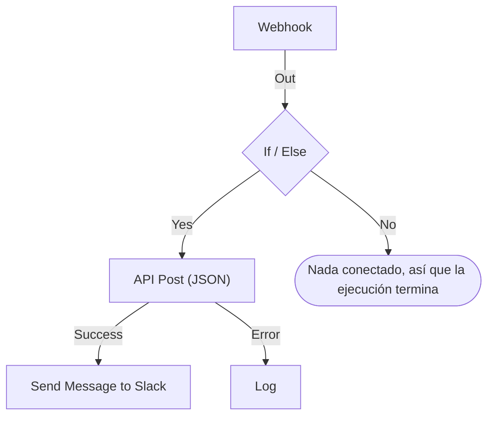

# Crear un flujo de trabajo

Un flujo de trabajo se construye en su **Constructor**: un lienzo donde añades bloques, los conectas y rellenas sus ajustes. Esta página recorre la creación de un flujo de trabajo, cómo [añadir bloques](#añadir-bloques), [conectarlos](#conectar-bloques) y [configurarlos](#configurar-un-bloque), [pasar valores entre ellos](#usar-valores-de-bloques-anteriores) y [activar el flujo de trabajo](#activarlo).

Para crear un flujo de trabajo, abre **Flujos de trabajo** y haz clic en **Crear flujo de trabajo**. El diálogo **Crear un flujo de trabajo** te pregunta primero cómo quieres empezar y, después, un nombre. Una plantilla que necesita ajustes propios, como una URL de webhook de Slack, te los pide en un paso más y los guarda como variables del flujo de trabajo, para que puedas cambiarlos más adelante sin editar el flujo de trabajo.

Elige cómo empezar:

- **Empezar desde cero**, en la parte superior del diálogo, te da un lienzo vacío. La mayoría de los flujos de trabajo empiezan aquí.
- **O empieza con una plantilla** muestra unas pocas plantillas **Recomendadas**. Para las demás, elige una categoría junto al cuadro de búsqueda, como **Incidentes**, **Monitores** o **Jira**, o **Todas las plantillas**, o escribe en **Buscar plantillas…**. Todas las palabras que escribas tienen que coincidir.

Haz clic en una plantilla para ver lo que hace: su disparador, los bloques que la forman y los ajustes que te pedirá. Después haz clic en **Usar esta plantilla**, o haz doble clic en la plantilla. En el cuadro de búsqueda, las teclas de flecha eligen una plantilla e **Intro** la usa. `/` te devuelve al cuadro de búsqueda.

Los flujos de trabajo se crean desactivados, así que nada se ejecuta hasta que los actives. Un flujo de trabajo nuevo se abre en el **Constructor**, el lienzo donde lo diseñas.

## El lienzo

Un flujo de trabajo creado desde cero se abre con un único bloque discontinuo que dice **Elige qué inicia este flujo de trabajo**. Ese bloque es el punto de partida: haz clic en él para elegir un disparador. Un flujo de trabajo creado a partir de una plantilla se abre con sus bloques ya colocados.

Todo flujo de trabajo tiene exactamente un **disparador** en la parte superior. Todo lo demás es un **componente** que hace algo. Para cambiar el disparador, elimínalo: el marcador discontinuo vuelve a su lugar y, al hacer clic en él, puedes elegir otro. Al eliminar un bloque también se eliminan sus líneas, así que vuelve a conectar el nuevo disparador al primer bloque.

Los cambios se guardan automáticamente. Una píldora en la barra de herramientas lo indica: **Guardando…** mientras el cambio está en curso, después **Guardado**, o **No se pudo guardar** si no ha funcionado. El lienzo no tiene botón de guardar ni un paso de publicación aparte.

## Añadir bloques

| Para añadir            | Haz clic en                                                    | Panel que se abre               |
| ---------------------- | -------------------------------------------------------------- | ------------------------------- |
| El disparador          | El bloque marcador discontinuo                                 | **Añadir desencadenante**       |
| Cualquier otro bloque  | **Añadir componente**, en la barra de herramientas sobre el lienzo | **Añadir componente**        |

Los dos paneles se abren con los bloques que usan la mayoría de los flujos de trabajo, en **Populares**, seguidos del resto de bloques integrados. En **Recursos de OneUptime**, haz clic en un recurso como **Incidente** para ver qué puedes hacer con él; **Explorar todos los recursos** los muestra todos. O busca: escribe unas palabras, como `create incident`, y la coincidencia más cercana aparece primero. Pulsa `/` para ir al cuadro de búsqueda, las teclas de flecha para moverte por los resultados e **Intro** para añadir el bloque resaltado. Al hacer clic en un bloque, se añade.

Un bloque nuevo aparece debajo del bloque más bajo del lienzo, y un disparador nuevo ocupa el lugar del bloque discontinuo en la parte superior. El bloque nuevo queda seleccionado y, si aparece fuera de la vista, el lienzo se desplaza lo justo para mostrarlo. Sus ajustes no se abren solos: haz clic en el bloque cuando estés listo para configurarlo. Hasta que se rellenen sus ajustes obligatorios, dice **Haz clic para configurar**.

Arrastra los bloques adonde quieras; el lienzo los ajusta a una cuadrícula mientras los mueves. Las posiciones de los bloques se guardan, así que la siguiente persona ve la misma disposición que dejaste.

## Qué hay en un bloque

| Campo                                 | Qué hace                                                                                                                                                                                                                                                                                                         |
| ------------------------------------- | ---------------------------------------------------------------------------------------------------------------------------------------------------------------------------------------------------------------------------------------------------------------------------------------------------------------- |
| **Identificador** (en **ID**)         | El ID corto que aparece en el bloque, como `log-1`. Es la forma en que otros bloques se refieren a este, así que cambiarle el nombre rompe todas las referencias `{{local.components.…}}` que apuntan a él. El encabezado del bloque es el nombre propio del componente y no se puede cambiar.                         |
| **Ajustes**                           | Lo que el bloque necesita para hacer su trabajo: una URL, un canal de Slack, el cuerpo de un mensaje. Los campos opcionales llevan la etiqueta **(Opcional)**; todo lo demás es obligatorio. Un interruptor de encendido y apagado no lleva ninguna de las dos, porque siempre tiene un valor. Los ajustes menos usados están plegados en **Más campos**, cuyo encabezado los nombra y muestra los que tienen valor. |
| **Entrada**                           | El punto del borde superior, donde llegan las líneas de los bloques anteriores. Los disparadores no tienen: nada se ejecuta antes que ellos.                                                                                                                                                                      |
| **Salidas**                           | Los puntos del borde inferior, rotulados justo encima, de donde salen las líneas hacia los bloques siguientes. Muchos bloques tienen salidas **Success** y **Error** separadas para que puedas tratar ambos casos.                                                                                                |

## Conectar bloques

Arrastra desde un punto de la parte inferior de un bloque hasta el punto de la parte superior del siguiente. La línea que trazas decide qué se ejecuta después.

- Si conectas desde **Success**, el siguiente bloque solo se ejecuta cuando el anterior funcionó.
- Si conectas desde **Error**, el siguiente bloque solo se ejecuta cuando el anterior falló.
- Si no conectas una salida, ese camino simplemente se detiene.

Puedes conectar una salida a varios bloques. Todos se ejecutan, pero uno tras otro, en una sola cola, no en paralelo. No dependas del orden entre ramas ni cuentes con que se solapen en el tiempo.

Cada bloque se ejecuta como mucho una vez por ejecución. Una línea que lleva a un bloque que ya se ejecutó — hacia arriba en el lienzo, o desde una segunda rama después de que la primera llegara a él — detiene la ejecución con un error, así que un flujo de trabajo no puede entrar en bucle.

## Configurar un bloque

Haz clic en un bloque para abrir sus ajustes en un diálogo, o llega a él con **Tab** y pulsa **Intro**. Rellena los ajustes y haz clic en **Guardar**.

Cada ajuste tiene el campo que necesita su valor:

| El ajuste contiene                               | Obtienes                                                                       |
| ------------------------------------------------ | ------------------------------------------------------------------------------ |
| Palabras: un mensaje, un prompt, un valor que registrar | Un cuadro que crece mientras escribes. **Intro** empieza una línea nueva. |
| Un valor corto: una URL, un ID, un asunto        | Una sola línea.                                                                |
| Código o HTML                                    | Un editor de código.                                                           |
| JSON                                             | Un editor de JSON.                                                             |
| Encendido o apagado                              | Un interruptor con su nombre al lado. Haz clic en el interruptor o en su nombre para cambiarlo. |

El diálogo se abre en lo que más probablemente has venido a buscar. Para un disparador **Webhook**, es su URL, con un botón **Copiar URL**, los métodos que acepta y una solicitud de ejemplo. Para un disparador **Manual**, es cómo se inicia el flujo de trabajo. Cualquier otro bloque se abre en sus ajustes. Un bloque sin ajustes no tiene sección **Ajustes**.

Debajo, de arriba abajo:

- **ID**, **Entradas** y **Salidas**, uno al lado del otro: el identificador del bloque, desde dónde se llega a él y qué se ejecuta después.
- **Retornos** — los datos que este bloque pasa a los pasos posteriores. Cada valor muestra la referencia exacta que lo lee, con un botón para copiarla.
- **Cómo se usa** — qué hace el bloque en una frase, los pasos para configurarlo, un ejemplo para copiar y los errores más habituales. El ejemplo se construye a partir de tu flujo de trabajo: usa el ID de este bloque, y los valores del disparador donde mete datos en un mensaje. **Más información** abre la explicación larga, y los enlaces llevan a la guía completa. Todos los bloques tienen una, y el botón **Cómo se usa** de la parte superior del diálogo salta directamente a ella.

El pie contiene:

- **Eliminar** — quita este bloque. Pregunta antes y nombra el bloque por su tipo y su identificador, como **Send Email (send-email-2)**, para que sepas cuál de varios bloques iguales se va.
- **Ejecutar solo este paso** — ejecuta solo este bloque, sin el resto del flujo de trabajo. Los valores que habría leído de otros pasos llegan vacíos, y todo lo que envíe, escriba o elimine ocurre de verdad. Se salta todas las condiciones anteriores al bloque, así que solo pueden usarlo las personas que pueden editar el flujo de trabajo.

### Usar valores de bloques anteriores

La mayoría de los ajustes pueden usar un valor de un bloque anterior o una variable: así fluyen los datos de un bloque al siguiente. Cada uno de esos ajustes tiene un botón **{ }** al final. Abre una lista de los valores que puedes usar: cada bloque anterior por su nombre, con cada valor que devuelve — cómo se llama, qué contiene y su tipo —, y después las variables de tu flujo de trabajo y las globales. Busca en ella, elige uno con el ratón o con las teclas de flecha e **Intro**, y el valor se coloca donde está el cursor.

En el ajuste, un valor se muestra como una ficha, como **Webhook › Request Body**. Pasa el cursor por encima para ver la referencia que representa, `{{local.components.webhook-1.returnValues.request-body}}`, que es lo que se guarda. El cursor salta una ficha de una vez, **Backspace** la quita entera y copiarla copia la referencia. Si conoces la sintaxis, escribe `{{` en su lugar: la misma lista se abre debajo del ajuste y se va filtrando mientras escribes.

- **Solo se ofrecen los valores que existirán.** Es decir, el disparador y los bloques que se ejecutan antes que este. Un bloque que se ejecuta después aún no tiene salida. Mientras un bloque no esté conectado, solo se muestran los valores del disparador, y la lista lo indica.
- **Un registro se abre en sus campos.** Un bloque Find One u On Create devuelve un registro completo. Elígelo para ver sus campos, empezando por los que lee el **Select Fields** del bloque. Un valor JSON o un conjunto de cabeceras se abre en un cuadro donde escribes una ruta, como `title` o `alerts[0].status`.
- **Cuando un bloque ya se ha ejecutado, la lista sabe qué hay dentro de sus valores.** Cada valor dice lo que contenía en la última ejecución — `"production"` o `3 fields` —, y un valor JSON o un conjunto de cabeceras se abre en los campos que tenía, cada uno con su contenido. Así, del **Request Body** de un Webhook eliges **incident.title** en lugar de escribir una ruta. La búsqueda también encuentra estos campos: escribe `title`, o `{{` y el principio de una ruta. Los campos de un registro también muestran lo que contenían. Los campos vienen de la última ejecución, así que uno que una solicitud posterior omita llega vacío en esa ejecución. Un valor que parece un secreto, como una cabecera `Authorization`, un token o una contraseña, se muestra sin su contenido.
- **Un Webhook que aún no ha recibido ninguna solicitud lo dice** en la parte superior de sus valores, con **Copy test request**: un comando `curl` que envía `{"message": "Hello"}` a la URL del webhook del flujo de trabajo. Ejecútalo en un terminal mientras la lista está abierta, y los campos de la solicitud aparecen en ella en cuanto termina la ejecución que inicia, normalmente en segundos. El flujo de trabajo tiene que estar habilitado; si no, la solicitud se rechaza. Solo las personas que pueden ver la URL del webhook tienen el botón. Un disparador Incoming Email que aún no ha recibido ningún correo lo dice en el mismo sitio; envía un correo a su dirección, y sus cabeceras y adjuntos aparecen de la misma forma.
- **Los editores de código tienen Insert value en su barra de herramientas.** En JSON, añade las comillas que necesita un valor dentro de un documento. **Run Custom JavaScript** lee los valores a través de sus **Arguments**, así que su código no tiene selector.
- **Los números, las contraseñas, los interruptores y las fechas mantienen su propio control,** con **{ }** al lado. Un valor elegido sustituye al control, y **abc** vuelve a la escritura.

Una ficha se vuelve ámbar cuando lo que lee no está: un bloque al que se cambió el nombre o que se eliminó, un valor que el bloque no devuelve, un bloque que se ejecuta después o una variable que no existe. Su tooltip dice cuál es el caso. Consulta [Variables](/docs/workflows/variables) para ver la sintaxis de las referencias.

## Comprobaciones mientras construyes

El Constructor revisa todo el grafo cada vez que lo cambias e informa de lo que encuentra en una píldora de la barra de herramientas. Haz clic en la píldora para abrir **Problemas con este flujo de trabajo**, que enumera cada problema y te lleva al bloque responsable. En el lienzo, un bloque cuyos ajustes obligatorios siguen vacíos dice **Haz clic para configurar**, y un bloque con cualquier otro problema lleva una insignia en la esquina: roja para un error, ámbar para una advertencia. Pasa el cursor por la insignia para leer qué ocurre.

Detecta los errores que, si no, son invisibles hasta que una ejecución sale mal:

- un flujo de trabajo sin disparador;
- dos bloques con el mismo ID, o un ID con un punto;
- un bloque al que no llega ninguna conexión;
- un ajuste obligatorio vacío;
- JSON mal formado;
- espacios dentro de `{{ }}`;
- referencias a un paso o a un valor de retorno que no existe.

Hay algo que no puede comprobar: si existe el nombre de una variable. Los ajustes de un bloque sí pueden: una referencia a una variable que no existe aparece allí como una ficha ámbar. En cualquier otro lugar, una variable renombrada solo se nota en el registro de la ejecución.

## Tu primer flujo de trabajo

La forma más rápida de familiarizarte con el lienzo es un flujo de trabajo de dos bloques que inicias a mano:

:::steps
1. Haz clic en el bloque marcador discontinuo y, luego, en **Manual** en el panel **Añadir desencadenante**.
2. Haz clic en **Añadir componente** y, luego, en **Registro**, en **Populares**. El bloque nuevo aparece debajo del disparador. Conecta el punto **Execute** del disparador con el punto de entrada del bloque Log, más abajo.
3. Haz clic en el bloque Log, que dice **Haz clic para configurar**, y escribe `Hello from ` en su **Value**. Haz clic en **{ }** y, luego, en **JSON**, en **Manual**. El ajuste muestra **Manual › JSON** y guarda `{{local.components.manual-1.returnValues.value}}`. `manual-1` es el **Identificador** del disparador, que aparece en el bloque disparador. Haz clic en **Guardar**.
4. Activa **Habilitado** en la parte superior del Constructor. Un flujo de trabajo deshabilitado no se puede ejecutar en absoluto, ni siquiera a mano; si te saltas esto, **Ejecutar flujo de trabajo** te pide activarlo primero.
5. De vuelta en el **Constructor**, haz clic en **Ejecutar flujo de trabajo**, pon `{ "name": "Ada" }` en el campo **JSON**, haz clic en **Ejecutar flujo de trabajo manualmente** y confirma con **Ejecutar**.
6. Se abre solo un panel **Ejecución del flujo de trabajo** que sigue la ejecución. El registro muestra `Value:` seguido de `Hello from { "name": "Ada" }`.
:::

Ese ciclo — añadir, conectar, configurar, ejecutar, leer el registro — es como construirás todos los flujos de trabajo.

> [!TIP]
> El JSON que escribes en **Ejecutar flujo de trabajo** llega al disparador Manual como el texto que escribiste. Para leer uno de sus campos, como `name`, añade un bloque **Text to JSON**, pon el **JSON** del disparador en su **Text** y lee el campo del **JSON** de ese bloque: `{{local.components.text-to-json-1.returnValues.json.name}}`.

## Activarlo

Los flujos de trabajo nuevos empiezan deshabilitados, igual que cualquier flujo de trabajo que dupliques o importes. Mientras un flujo de trabajo está desactivado, el Constructor lo indica encima del lienzo, con un botón **Activar flujo de trabajo**.

El interruptor **Habilitado** está en la parte superior del **Constructor**, junto a **Añadir componente** y **Ejecutar flujo de trabajo**. También está en la página **Vista general** del flujo de trabajo, cuya tarjeta **Detalles del flujo de trabajo** muestra el estado actual con una píldora verde **Habilitado** o roja **Deshabilitado**: haz clic en **Editar flujo de trabajo** y abre **Más campos**. Solo las personas que pueden editar el flujo de trabajo pueden activarlo o desactivarlo; los demás ven el interruptor en gris.

Un flujo de trabajo deshabilitado no puede ejecutarse en absoluto, se inicie como se inicie:

| Iniciado por                                               | Mientras el flujo de trabajo está desactivado                                                                                                                                              |
| ---------------------------------------------------------- | ------------------------------------------------------------------------------------------------------------------------------------------------------------------------------------------ |
| Su disparador: una programación, un evento de OneUptime o un correo | Se ignora.                                                                                                                                                                        |
| **Ejecutar flujo de trabajo** o **Ejecutar solo este paso** | El Constructor pregunta en su lugar **¿Activar este flujo de trabajo?**. **Activar y ejecutar** (o **Activar y ejecutar paso**) activa el flujo de trabajo y después ejecuta lo que pediste, con los valores que diste. |
| Una llamada a su URL de webhook                            | Se rechaza con HTTP 400 y "This workflow is turned off, so it can't run. Turn it on with the Enabled switch at the top of its Builder, then try again."                                      |
| El bloque **Execute Workflow** de otro flujo de trabajo     | Ese bloque toma su camino **Error**, y el error nombra el flujo de trabajo al que llamó.                                                                                                    |

Así que el orden es: constrúyelo, pruébalo con **Ejecutar flujo de trabajo**, lee el registro de la ejecución y vuelve a desactivar **Habilitado** si aún no quieres que salte su disparador. Para probar un solo bloque sin ejecutarlo todo, usa **Ejecutar solo este paso** en los ajustes de ese bloque.

Para pausar un flujo de trabajo sin eliminarlo, desactiva **Habilitado**. No se inicia ninguna ejecución nueva. Una ejecución que está en curso termina, pero una que está aparcada en un bloque **Sleep** se cancela al despertar y se registra como un error.

## Ordenar el lienzo

- Arrastra los bloques para moverlos. La disposición se guarda.
- Para eliminar una línea, arrastra uno de sus extremos fuera del punto y suéltalo en una zona vacía del lienzo.
- Para eliminar un bloque, haz clic en él y usa **Eliminar** al pie de su diálogo de ajustes. Seleccionar un bloque o una línea y pulsar la tecla de retroceso también lo quita.
- No hay forma de duplicar un solo bloque. **Duplicar Flujo de trabajo** en la página **Ajustes** del flujo de trabajo copia todo. El nombre de la copia viene rellenado, numerado a partir de los flujos de trabajo del proyecto ("Nightly Sync" se copia como "Nightly Sync 2"), y la copia se abre, deshabilitada.
- Apila los bloques de arriba abajo para que se lean en la dirección en la que se ejecutan: las entradas están en el borde superior y las salidas en el inferior, así que el flujo va naturalmente hacia abajo.

## Siguientes pasos

:::cards
- [Disparadores](/docs/workflows/triggers): Las cinco formas en que puede empezar un flujo de trabajo.
- [Componentes](/docs/workflows/components): Todos los bloques que puedes añadir, con sus ajustes y salidas.
- [Variables](/docs/workflows/variables): Mueve datos entre bloques y mantén los secretos fuera de ellos.
- [Ejecuciones](/docs/workflows/runs-and-logs): Comprueba lo que hizo cada ejecución, paso a paso.
:::
