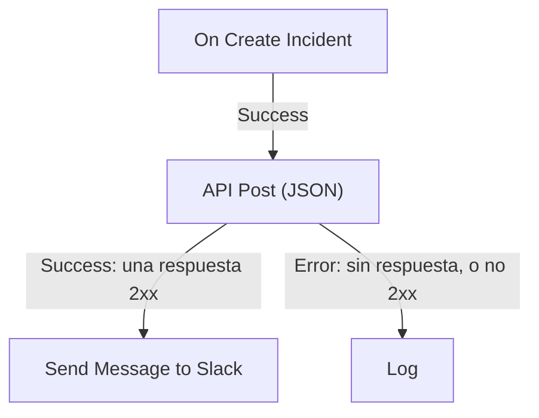

# Componentes de flujo de trabajo

Los componentes son los bloques que añades después del disparador. Cada uno hace una sola cosa — envía un mensaje, llama a una API, comprueba una condición, cambia un registro de OneUptime — y después toma una de sus salidas hacia los bloques conectados a ella. Esta página es el catálogo: lo que necesita cada bloque, lo que devuelve y cuándo toma cada salida.

Rara vez la necesitarás abierta mientras construyes. Los ajustes de cada bloque terminan con **Cómo se usa**: qué hace el bloque, los pasos para configurarlo, un ejemplo construido a partir de tu propio flujo de trabajo y los errores más habituales. Para añadir y conectar bloques, consulta [Crear un flujo de trabajo](/docs/workflows/authoring).

:::cards
- [Enviar un mensaje](#slack): Slack, Microsoft Teams, Discord, Telegram, IRC y correo electrónico.
- [Llamar a una API](#api): Envía una solicitud a cualquier API HTTP y lee la respuesta.
- [Añadir lógica](#conditions): Ramifica según un valor, transforma datos, espera o registra.
- [Trabajar con registros de OneUptime](#componentes-de-datos-de-oneuptime): Busca, crea, actualiza y elimina monitores, incidentes y más.
:::

## ¿Qué componente debo usar?

| Para…                                                         | Usa                                                               |
| ------------------------------------------------------------- | ----------------------------------------------------------------- |
| Publicar en una herramienta de chat                           | [Slack](#slack), [Microsoft Teams](#microsoft-teams), [Discord](#discord), [Telegram](#telegram) o [IRC](#irc) |
| Enviar un correo a través de tu propio servidor de correo     | [Email](#email)                                                   |
| Llamar a cualquier otra API o a tu propio servicio            | [API](#api)                                                       |
| Resumir, clasificar o redactar texto                          | [Generate Text with AI](#generate-text-with-ai)                   |
| Tomar un camino u otro según un valor                         | [Conditions](#conditions)                                         |
| Transformar datos entre dos bloques                           | [JSON](#json) o [Custom Code](#custom-code)                       |
| Esperar antes del bloque siguiente                            | [Sleep](#sleep)                                                   |
| Iniciar otro flujo de trabajo                                 | [Execute Workflow](#execute-workflow)                             |
| Leer o cambiar incidentes, monitores y otros registros        | [Componentes de datos de OneUptime](#componentes-de-datos-de-oneuptime)  |

Un bloque dedicado es mejor que uno genérico: el bloque de Slack conoce los límites de Slack, y un bloque de registros conoce los campos del registro, así que obtienes errores y registros más claros que con un bloque **API** que haga el mismo trabajo.

## Cómo funciona cada bloque

Un bloque se ejecuta cuando el bloque anterior toma la salida conectada a él. Lee sus ajustes, hace su trabajo y después toma una de sus salidas. Solo los bloques conectados a esa salida se ejecutan a continuación.



- Los **Ajustes** son lo que rellenas. Los ajustes marcados **(Opcional)** pueden dejarse vacíos. Los ajustes menos usados están plegados en **Más campos**.
- Las **Salidas** son los puntos del borde inferior. La mayoría de los bloques tienen **Success** y **Error**; [Conditions](#conditions) tiene **Yes** y **No**.
- Los **Retornos** son los valores que un bloque pasa a los bloques posteriores, como el **Response Body** de una API. Un bloque posterior lee uno con `{{local.components.<block ID>.returnValues.<value ID>}}`; el botón **{ }** de un ajuste lo inserta por ti. Consulta [Variables](/docs/workflows/variables#salidas-de-componentes-datos-de-bloques-anteriores).

Un bloque que toma **Error** no hace fallar la ejecución: la ejecución sigue el camino **Error**, o termina ahí si no hay nada conectado a él. En cambio, un ajuste obligatorio vacío, o un ajuste que nunca puede funcionar, detiene la ejecución con un error.

## API

Haz una solicitud HTTP a cualquier URL. Hay un bloque por método: **API Get (JSON)**, **API Post (JSON)**, **API Put (JSON)**, **API Patch (JSON)** y **API Delete (JSON)**.

| Ajuste              | Qué hace                                                                                                                             |
| ------------------- | ------------------------------------------------------------------------------------------------------------------------------------ |
| **URL**             | La dirección a la que llamar, `http` o `https`.                                                                                      |
| **Request Body**    | El JSON que enviar. Normalmente solo lo necesitan las solicitudes `POST`, `PUT` y `PATCH`.                                           |
| **Request Headers** | Las cabeceras que enviar, como una clave de API. En **Más campos**. Sus valores se ocultan en el registro de la ejecución.            |

| Salida      | Cuándo                                                                                         |
| ----------- | ---------------------------------------------------------------------------------------------- |
| **Success** | El servidor respondió con un estado 2xx.                                                       |
| **Error**   | La solicitud falló: no se pudo llegar al servidor, o respondió con cualquier otro estado.      |

En ambos casos, el bloque devuelve **Response Status**, **Response Headers** y **Response Body**, además de **Error** con el motivo cuando falló. Lee un campo de una respuesta JSON añadiendo su nombre a la referencia, como en `{{local.components.api-get-1.returnValues.response-body.id}}`.

Las redirecciones no se siguen, así que apunta el bloque a la dirección que responde. Las solicitudes salen de OneUptime: una URL que se resuelve a una dirección de red privada se rechaza a menos que un administrador autoalojado la permita, y la ejecución se detiene con el motivo. Consulta [Acceso de red saliente](/docs/workflows/configuration#acceso-de-red-saliente).

## AI

### Generate Text with AI

Genera una respuesta de texto a partir de un prompt y un contexto JSON opcional. El bloque usa el proveedor de LLM predeterminado del proyecto, o el proveedor global de la instalación cuando el proyecto no tiene ninguno. Los proveedores se configuran de forma centralizada en **Ajustes del proyecto → IA → Proveedores de LLM**; sus claves y endpoints nunca son ajustes del bloque.

| Ajuste                    | Qué hace                                                                                                                                                          |
| ------------------------- | ----------------------------------------------------------------------------------------------------------------------------------------------------------------- |
| **System Instructions**   | Indicaciones opcionales sobre el papel, el tono y las restricciones del modelo.                                                                                  |
| **Prompt**                | La tarea. Se envía exactamente como la escribes, así que el Markdown sirve, y puede incluir variables y valores de bloques anteriores.                           |
| **Context**               | JSON opcional que envías deliberadamente. Se añade después de un marcador explícito de fin de mensaje y se trata como datos no fiables.                          |
| **Temperature**           | En **Más campos**. La variación, de `0` a `1`; el valor predeterminado es `0.2`, para una automatización predecible. Los modelos actuales de Claude, Opus 4.7 y posteriores y todos los modelos Claude 5, eligen su propio muestreo: OneUptime omite **Temperature** en sus solicitudes, así que no tiene ningún efecto en ellos. |
| **Maximum Output Tokens** | En **Más campos**. De `1` a `4096`; el valor predeterminado es `1024`.                                                                                           |

System Instructions, Prompt y el Context serializado están limitados en conjunto a 50.000 caracteres. Una imagen incrustada en ellos en base64, como la captura de pantalla de un monitor sintético en la descripción de un incidente, se sustituye por una nota breve como `[image omitted: PNG, 340 KB]` antes de medirlos, porque el modelo lee texto, no imágenes. El registro de la ejecución dice qué se omitió. La solicitud al proveedor dura como máximo 60 segundos y se intenta una sola vez. Como máximo pueden ejecutarse a la vez tres solicitudes de IA de flujos de trabajo por proyecto.

Devuelve **Response** (el texto generado), **Provider** y **Model** (lo que respondió), **Total Tokens** y **Completion Tokens** (el uso que informó el proveedor), **LLM Log ID** (la entrada de la llamada en los registros de IA) y **Error**.

Conecta **Success** a los bloques que usan la respuesta, y **Error** a una alternativa: los fallos de validación, acceso, proveedor, presupuesto, facturación y tiempo de espera lo toman todos. El bloque no envía herramientas, así que el modelo no puede consultar OneUptime, llamar a API ni cambiar datos por su cuenta.

> [!WARNING]
> La salida del modelo es texto no fiable. Revísala antes de que llegue a los clientes, y nunca dejes que solo un texto libre de la IA decida una acción destructiva. Consulta [Componentes de IA](/docs/workflows/configuration#componentes-de-ia) para ver qué se envía al proveedor, qué se registra y cuánto cuesta.

## Slack

Publica un mensaje en un canal de Slack a través de un webhook entrante.

| Ajuste                         | Qué hace                                                                                                                                                                                                     |
| ------------------------------ | ------------------------------------------------------------------------------------------------------------------------------------------------------------------------------------------------------------ |
| **Slack Incoming Webhook URL** | El webhook del canal en el que publicar. Debe empezar por `https://hooks.slack.com/services/`. La guía de Slack para [crear uno](https://api.slack.com/messaging/webhooks) lleva un par de minutos.            |
| **Message Text**               | El texto que enviar. Se envía exactamente como lo escribes, así que usa el formato propio de Slack: `*bold*`, `_italic_`, `~strikethrough~` y `<https://example.com|a link>`. Un texto más largo que una sección de Slack (3.000 caracteres) se envía en varias; a partir de diez secciones se corta y termina con "… (truncated — see OneUptime for the full text)". |

**Success** salta cuando Slack aceptó el mensaje y **Error** cuando lo rechazó, con el motivo de Slack en **Error**. Estos bloques publican a través del webhook de sus ajustes, no de la conexión de Slack de tu proyecto.

## Microsoft Teams

Publica un mensaje en un canal de Microsoft Teams. El bloque se llama **Send Message to Teams**.

| Ajuste                         | Qué hace                                                                                                                                                                                                                                       |
| ------------------------------ | ---------------------------------------------------------------------------------------------------------------------------------------------------------------------------------------------------------------------------------------------- |
| **Teams Incoming Webhook URL** | El webhook del canal en el que publicar, una URL `https` en `office.com`, `office365.com`, `logic.azure.com` o `environment.api.powerplatform.com`. La guía de Microsoft muestra cómo [crear uno con Workflows de Teams](https://support.microsoft.com/en-us/teams/apps-service/create-incoming-webhooks-with-workflows-for-microsoft-teams). |
| **Message Text**               | El texto que enviar. Un mensaje más grande de lo que admite un webhook entrante (unos 12.000 caracteres, medidos tal como se envían) se corta y termina con "… (truncated — see OneUptime for the full text)".                                    |

## Discord

Publica un mensaje en un canal de Discord a través de un webhook entrante.

| Ajuste                           | Qué hace                                                                                                                                           |
| -------------------------------- | -------------------------------------------------------------------------------------------------------------------------------------------------- |
| **Discord Incoming Webhook URL** | El webhook del canal, una URL `https` en `discord.com` o `discordapp.com`.                                                                         |
| **Message Text**                 | El texto que enviar. Un mensaje de más de 2.000 caracteres, el límite de Discord, se corta y termina con "… (truncated — see OneUptime for the full text)". |

## Telegram

Envía un mensaje a un chat de Telegram con un bot.

| Ajuste                 | Qué hace                                                                                                                                           |
| ---------------------- | -------------------------------------------------------------------------------------------------------------------------------------------------- |
| **Telegram Bot Token** | El token que BotFather dio a tu bot, como `123456789:ABCdef…`. Un token con cualquier otra forma detiene la ejecución, sin que el token se escriba en el registro. |
| **Chat ID**            | El chat en el que publicar: su ID, o el `@username` de un canal. Añade primero el bot al grupo o al canal. Para escribir a una persona, esta debe haber iniciado un chat con el bot. |
| **Message Text**       | El texto que enviar. Un mensaje de más de 4.096 caracteres, el límite de Telegram, se corta y termina con "… (truncated — see OneUptime for the full text)". |

Cuando Telegram rechaza el mensaje, **Error** salta con el motivo de Telegram.

## IRC

Publica un mensaje en un canal de IRC de cualquier red de IRC: Libera.Chat, OFTC o un servidor propio. IRC no tiene webhooks, así que el bloque se conecta él mismo al servidor, entra en el canal, envía el mensaje y se va.

| Ajuste           | Qué hace                                                                                                                                                                                                                                           |
| ---------------- | -------------------------------------------------------------------------------------------------------------------------------------------------------------------------------------------------------------------------------------------------- |
| **IRC Server**   | El nombre de host del servidor, como `irc.libera.chat`. Solo el nombre: sin `ircs://` y sin puerto.                                                                                                                                                |
| **Channel**      | El canal en el que publicar, como `#ops`. Tiene que ser un canal: un apodo escrito aquí se rechaza en lugar de recibir un mensaje privado.                                                                                                          |
| **Message Text** | El texto que enviar. Cada línea sale como un mensaje de IRC propio, y una línea larga se divide para que quepa. Un mensaje se envía como máximo en 15 líneas de IRC: uno más largo se recorta, y su última línea lo indica. IRC no tiene Markdown, así que el texto se envía tal cual; los códigos de formato propios de IRC, como la negrita y los colores, funcionan. |

En **Más campos**:

| Ajuste                                   | Qué hace                                                                                                                                                                                                           |
| ---------------------------------------- | ------------------------------------------------------------------------------------------------------------------------------------------------------------------------------------------------------------------ |
| **Nickname**                             | Quién envía el mensaje. Por defecto `OneUptime`. Si el apodo está ocupado, el bloque lo prueba con un guion bajo o un número añadido, y después con uno en lugar de sus últimos caracteres, para un servidor que no admite un apodo más largo. |
| **Port**                                 | El puerto del servidor. Por defecto `6697`, o `6667` con **Disable TLS** activado.                                                                                                                                 |
| **Disable TLS**                          | El bloque se conecta por TLS y comprueba el certificado del servidor. Actívalo solo para un servidor que no ofrezca TLS; cualquier contraseña se envía entonces sin cifrar. Para confiar en un certificado de tu propia autoridad de certificación, una instalación autoalojada define `NODE_EXTRA_CA_CERTS` en su lugar. |
| **Channel Key**                          | La clave de un canal que la tenga (modo `+k`).                                                                                                                                                                     |
| **Send Without Joining**                 | Publica sin entrar en el canal, para que el canal no vea al bloque llegar e irse. Solo funciona donde el canal acepta mensajes de fuera (sin modo `+n`).                                                           |
| **Server Password**                      | Una contraseña que el servidor o tu bouncer piden al conectar.                                                                                                                                                    |
| **SASL Username** y **SASL Password**    | Inicia sesión en tu cuenta en las redes que usan SASL, como Libera.Chat, que lo exige para las conexiones desde algunas direcciones de nube y de VPN. Rellena los dos o ninguno.                                     |

**Success** salta cuando el servidor ha aceptado todas las líneas. El bloque lo comprueba pidiendo al servidor que responda a un ping después de la última línea: un servidor responde en orden, así que cualquier rechazo del mensaje llega antes. Un bouncer como ZNC responde él mismo al ping, así que el bloque escucha un segundo más para recibir la respuesta de la red que hay detrás.

**Error** salta cuando no se puede llegar al servidor, o este rechaza la conexión, el apodo, una contraseña o el canal, o rechaza el mensaje. Transmite el motivo, con las propias palabras del servidor cuando las dio. En cambio, un **IRC Server**, un **Channel** o un **Message Text** que falte, o un ajuste que nunca podría funcionar, detiene la ejecución.

Cada ejecución del bloque es una conexión propia, y las redes de IRC limitan la frecuencia con que una misma dirección puede conectarse: una ráfaga de mensajes puede rechazarse con un motivo como "Reconnecting too fast", y toma **Error** como cualquier otro rechazo. Para un flujo de trabajo que puede saltar muchas veces por minuto, reúne lo que tenga que decir en un solo mensaje, o envíalo a través de un servidor propio.

Guarda las contraseñas en [variables globales secretas](/docs/workflows/variables#variables-globales) y usa la variable en el ajuste; se ocultan en los registros de ejecución en cualquier caso. Las conexiones a direcciones de loopback (`localhost`, `127.0.0.1`), de enlace local y de metadatos de la nube se rechazan. En OneUptime Cloud, un servidor en una dirección de red privada, o un nombre que se resuelve a una, también se rechaza. Las instalaciones autoalojadas pueden llegar a un servidor de IRC de su propia red, a menos que `DATA_SOURCE_BLOCK_PRIVATE_ADDRESSES` esté definido como `true`.

## Email

Envía un correo a través de un servidor SMTP que indicas en el bloque. El bloque se llama **Send Email**.

| Ajuste                                  | Qué hace                                                                                              |
| --------------------------------------- | ----------------------------------------------------------------------------------------------------- |
| **From Email**                          | El remitente, por ejemplo `Alerts <alerts@company.com>`.                                              |
| **To Email**                            | La dirección del destinatario. Separa varias direcciones con comas o puntos y comas.                  |
| **Subject**                             | El asunto.                                                                                            |
| **Email Body**                          | El mensaje, enviado como HTML.                                                                        |
| **SMTP HOST** y **SMTP Port**           | El servidor de correo al que conectarse.                                                              |
| **SMTP Username** y **SMTP Password**   | Opcionales. Rellena los dos o ninguno.                                                                |
| **Use Implicit TLS**                    | Actívalo para TLS implícito, normalmente en el puerto 465. Déjalo desactivado para STARTTLS, normalmente en el puerto 587. |

**Success** salta cuando el servidor SMTP aceptó el mensaje. **Error** salta cuando se rechaza el host SMTP, no se puede llegar al servidor o este rechaza el mensaje, y transmite el mensaje de error. En cambio, un **To Email**, un **From Email**, un **SMTP HOST** o un **SMTP Port** que falte detiene la ejecución.

El bloque se conecta directamente al servidor de sus ajustes. No usa los ajustes de [SMTP](/docs/emails/smtp) de tu proyecto ni el propio servidor de correo de OneUptime, y los correos que envía no aparecen en los registros de notificaciones. Para comprobar lo que hizo, mira las [Ejecuciones](/docs/workflows/runs-and-logs) del flujo de trabajo.

Las conexiones a direcciones de loopback (`localhost`, `127.0.0.1`), de enlace local y de metadatos de la nube se rechazan. En OneUptime Cloud, un host SMTP en una dirección de red privada, o un nombre que se resuelve a una, también se rechaza. Las instalaciones autoalojadas pueden llegar a un servidor de correo de su propia red, a menos que `DATA_SOURCE_BLOCK_PRIVATE_ADDRESSES` esté definido como `true`. Un host rechazado toma la salida **Error**, y no se envía nada.

## Custom Code

Ejecuta unas pocas líneas de JavaScript cuando los demás bloques no pueden hacer lo que necesitas. El bloque se llama **Run Custom JavaScript**.

| Ajuste              | Qué hace                                                                                                                             |
| ------------------- | ------------------------------------------------------------------------------------------------------------------------------------ |
| **JavaScript Code** | Tu código. Lo que devuelva con `return` se convierte en el **Value** del bloque. Puede usar `await`.                                |
| **Arguments**       | Un objeto JSON de valores que pasar al código, que los lee como `args`. Pon aquí las variables y los valores de bloques anteriores; el propio código no puede leerlos. |

```json title="Arguments"
{ "title": "{{local.components.incident-on-create-1.returnValues.model.title}}" }
```

```javascript title="JavaScript Code"
const words = args.title.split(" ");

return {
  shortTitle: words.slice(0, 5).join(" "),
  wordCount: words.length,
};
```

Un bloque posterior lee el título corto como `{{local.components.javascript-1.returnValues.returnValue.shortTitle}}`.

El código se ejecuta en un sandbox con `args`, `console.log` (que escribe en el registro de la ejecución), `axios` para solicitudes HTTP, `crypto` y `sleep`. No tiene sistema de archivos ni proceso, y sus solicitudes se someten a las mismas reglas de direcciones que el bloque API. Tiene 5 segundos por defecto; una instalación autoalojada lo cambia con `WORKFLOW_SCRIPT_TIMEOUT_IN_MS`.

**Success** salta con el **Value** devuelto, y **Error** cuando el código lanza una excepción o se queda sin tiempo, con el mensaje en **Error**. Para scripts más pesados, usa un [Runbook](/docs/runbooks/index) en su lugar.

## JSON

Convierte entre texto y JSON, o combina dos objetos JSON.

| Bloque           | Recibe                                   | Devuelve                                                                                                   |
| ---------------- | ---------------------------------------- | ---------------------------------------------------------------------------------------------------------- |
| **JSON to Text** | **JSON**, un objeto                      | **Text**: el objeto como cadena. Útil cuando el bloque siguiente espera texto.                             |
| **Text to JSON** | **Text**, que puede ocupar varias líneas | **JSON**: el objeto analizado, para que puedas leer sus campos. Úsalo con JSON que llegó como texto.      |
| **Merge JSON**   | **JSON 1** y **JSON 2**                  | **JSON**: un objeto con las claves de ambos. Cuando los dos tienen una clave, gana **JSON 2**.             |

**Text to JSON** toma **Error** cuando el texto no es JSON. Una entrada que falte, o una entrada de **Merge JSON** que no sea un objeto, detiene la ejecución.

## Conditions

Ramifica según una comparación. En el panel **Añadir componente**, este bloque se llama **If / Else**, en **Populares**.

Sus ajustes se leen como una frase: **Si** *valor que comprobar* *comparación* *valor con el que comparar*, continúa por **Yes**, si no, por **No**. Debajo de los ajustes, la condición se lee en palabras, para que veas que dice lo que quieres. En el lienzo, el bloque también muestra su condición, por ejemplo *Si environment is equal to “production”*.

| Ajuste             | Qué hace                                                                                                                                 |
| ------------------ | ---------------------------------------------------------------------------------------------------------------------------------------- |
| **Value to check** | Normalmente un valor de un bloque anterior. Pulsa **{ }** en el cuadro para elegir uno, o escribe `{{`.                                   |
| **Comparison**     | Cómo comparar, en palabras. Las comparaciones aparecen más abajo.                                                                        |
| **Compare with**   | Con qué comparar, escrito o elegido de la misma forma. **está vacío**, **no está vacío**, **is true** e **is false** no lo usan.         |
| **Comparar como**  | Plegado bajo la comparación: **Text**, **Número** o **True / False**. Elige **Text** para ordenar fechas escritas `2026-10-01`, o **Número** para que `200` y `200.0` sean iguales. |

Las comparaciones:

- **is equal to** e **is not equal to**;
- para texto: **contiene**, **no contiene**, **comienza con** y **termina con**;
- para números: **es mayor que**, **is greater than or equal to**, **es menor que** e **is less than or equal to**;
- **está vacío** y **no está vacío**, que comprueban si el valor está presente;
- **is true** e **is false**.

Las comparaciones de números comparan números y las de texto comparan texto, así que rara vez necesitas **Comparar como**. Cómo se comparan los valores:

- Como texto, las mayúsculas cuentan: `Error` no es `error`.
- Como números, un texto que no es un número cuenta como `0`. Los ajustes señalan un valor escrito así.
- Como verdadero o falso, solo `true` cuenta como verdadero.
- **está vacío** se cumple con la ausencia de valor, un texto en blanco, una lista o un objeto vacío, o un valor que el bloque anterior no tenía, como un campo que el webhook no envió. `0` y `false` son valores, así que no están vacíos.

**Yes** se ejecuta cuando se cumple la condición y **No** cuando no. Los bloques configurados antes de que los ajustes tuvieran estos nombres se ejecutan exactamente igual que antes. Ya no se ofrece una opción antigua: comparar un valor como **Null** o **Undefined**, que ignoraba lo que contenía el valor. Un bloque que todavía la usa lo indica al abrirlo; elige **está vacío** para comprobar si falta un valor.

## Sleep

Pausa la ejecución antes del bloque siguiente, para dar a otro sistema un momento para ponerse al día o para hacer un seguimiento más tarde.

**Days**, **Hours**, **Minutes** y **Seconds** se suman. La espera más larga es de 30 días: una más larga se recorta a 30 días, y el registro de la ejecución lo indica.

Mientras espera, la ejecución se aparta con el estado **Esperando** y se retoma cuando se cumple el tiempo, así que una espera larga no bloquea nada. Una ejecución cuyo flujo de trabajo se desactivó o se archivó mientras tanto se cancela al despertar.

## Log

Escribe un valor en el registro de la ejecución. No cambia nada más, lo que lo convierte en la forma más fácil de ver qué contenía un valor.

**Value** es lo que escribir. Puede ocupar varias líneas e incluir valores de bloques anteriores, como `{{local.components.webhook-1.returnValues.request-body}}`. El bloque toma **Out** cuando termina.

## Execute Workflow

Inicia otro flujo de trabajo del mismo proyecto. Tu flujo de trabajo continúa sin esperar a que el otro termine.

| Ajuste        | Qué hace                                                                                                                                  |
| ------------- | ----------------------------------------------------------------------------------------------------------------------------------------- |
| **Workflow**  | El flujo de trabajo que iniciar. Debe estar habilitado y, para recibir argumentos, tener un disparador **Manual**.                        |
| **Arguments** | El JSON que pasar. El disparador Manual del otro flujo de trabajo pasa cada clave como un valor propio: con `{"customerId": "42"}`, lee `{{local.components.manual-1.returnValues.customerId}}`. |

**Out** salta en cuanto el otro flujo de trabajo queda en cola. **Error** salta cuando no puede: no se encuentra, está desactivado o archivado, o iniciarlo crearía un bucle.

Úsalo para compartir lógica común: construye una vez un flujo de trabajo «publicar en el canal del incidente» e inícialo desde todos los flujos de trabajo que lo necesiten. Una cadena de flujos de trabajo que se inician unos a otros no puede volver sobre sí misma y tiene como máximo 10 niveles. Consulta [Configuración y seguridad](/docs/workflows/configuration#límite-al-llamar-a-otros-flujos-de-trabajo).

## Componentes de datos de OneUptime

Para cada tipo de registro de OneUptime (monitores, incidentes, alertas, páginas de estado, políticas de guardia y muchos más), el panel **Añadir componente** tiene estos componentes: en **Recursos de OneUptime**, haz clic en el tipo de registro (**Explorar todos los recursos** tiene los que no se muestran), o busca por el nombre del tipo. Cada título se genera a partir del tipo de registro, así que el conjunto de Monitor dice:

| Componente               | Qué hace                                                                       |
| ------------------------ | ------------------------------------------------------------------------------ |
| **Find One Monitor**     | Lee un registro que coincide con la consulta.                                  |
| **Find Many Monitors**   | Lee una lista de registros que coinciden con la consulta.                      |
| **Create One Monitor**   | Añade un registro a partir de un objeto JSON.                                  |
| **Create Many Monitors** | Añade varios registros a partir de un array JSON.                              |
| **Update One Monitor**   | Aplica los datos que escribir a un registro coincidente.                       |
| **Update Many Monitors** | Aplica los datos que escribir a los registros coincidentes, hasta **Limit**.   |
| **Delete One Monitor**   | Elimina un registro coincidente.                                               |
| **Delete Many Monitors** | Elimina los registros coincidentes, hasta **Limit**.                           |

El mismo conjunto te da tres disparadores: **On Create Monitor**, **On Update Monitor** y **On Delete Monitor**. Consulta [Disparadores](/docs/workflows/triggers#disparadores-de-eventos-de-oneuptime).

Un tipo solo ofrece los componentes que permite su modelo. Un tipo de solo lectura tiene los dos componentes Find y nada más, así que, si no encuentras **Delete One Monitor** en el panel, ese tipo no lo permite.

Así es como un flujo de trabajo lee y cambia los datos de OneUptime. Por ejemplo, un webhook de tu herramienta de CI puede usar **Create One Incident** para abrir un incidente con los detalles del fallo.

Estos componentes actúan como Project Admin del proyecto del flujo de trabajo: lo que un Project Admin no puede hacer, o lo que tu plan no incluye, se rechaza, y el registro de la ejecución dice por qué. Consulta [Qué pueden hacer los pasos de un flujo de trabajo](/docs/workflows/configuration#qué-pueden-hacer-los-pasos-de-un-flujo-de-trabajo).

### Declarar un incidente a partir de una plantilla

**Create One Incident** puede declarar el incidente a partir de una de tus [plantillas de incidente](/docs/incidents/settings#plantillas-de-incidente): elígela en **Incident Template**, el primer ajuste del paso. La plantilla rellena todos los campos que **JSON Object** deja fuera — el título, la descripción, la gravedad, el estado inicial, los monitores y otros recursos, las políticas de guardia, las etiquetas, las páginas de estado y los campos personalizados — y sus propietarios pasan a ser los propietarios del incidente. Todo lo que definas en **JSON Object** prevalece sobre la plantilla, estado incluido, así que con una plantilla elegida **JSON Object** solo necesita lo que deba ser distinto, y puede quedar vacío.

El incidente guarda la plantilla de la que se declaró en `createdIncidentTemplateId`. Esa columna la define OneUptime: un paso que la envía en **JSON Object** se rechaza, y su registro de ejecución te remite a **Incident Template**. Una plantilla de otro proyecto, o una que se eliminó, hace que el paso tome su salida **Error**, y en un plan que no incluye plantillas de incidente el paso se rechaza indicando el plan que necesita. Consulta [Cómo se aplica una plantilla](/docs/incidents/settings#cómo-se-aplica-una-plantilla).

## Trabajar con registros

Cada campo de un componente de datos se basa en los nombres de **columna** del propio registro: los mismos nombres que usa la API, no las etiquetas del formulario del panel. La columna de ID es `_id`. La forma `id` se acepta como alias en cualquier sitio donde puedas escribir un nombre de columna, pero `_id` es lo que devuelve un registro, así que es lo que debes leer a la salida:

```json
{ "_id": "00000000-0000-0000-0000-000000000000" }
```

**Query** decide sobre qué registros actúa el componente. Las claves son columnas y los valores, lo que debe coincidir:

```json
{ "monitorType": "Website", "isEnabled": true }
```

Una consulta siempre se limita al proyecto en el que se ejecuta el flujo de trabajo. No puedes llegar a los registros de otro proyecto, y no necesitas añadir tú mismo el proyecto a la consulta.

**JSON Object** en Create One, **JSON Array** en Create Many y **Data (JSON Object)** en los componentes Update llevan los campos que escribir, con las mismas claves:

```json
{ "name": "Checkout API", "monitorType": "Website" }
```

Una clave que no es una columna se ignora en lugar de rechazarse — el registro de la ejecución nombra las que descartó, así que míralo cuando un campo no llegue. **Select Fields**, en los componentes Find y en los disparadores, usa las mismas claves de columna con valores `true`: `{"_id": true, "name": true}`.

Los **campos personalizados** son una sola columna, `customFields`, que guarda el valor de cada campo personalizado con el nombre del campo. Los componentes Update solo cambian los campos personalizados que nombras, y todos los demás conservan su valor:

```json
{ "customFields": { "Notification Count": 1 } }
```

define **Notification Count** y deja los demás campos personalizados del registro como estaban. Pon un campo personalizado a `null` para vaciarlo, o pon el propio `customFields` a `null` para vaciarlos todos. Dos flujos de trabajo que actualizan a la vez campos personalizados distintos del mismo registro se aplican los dos. Esto vale solo para los componentes Update: la API de OneUptime escribe `customFields` completo, así que una solicitud a ella debe llevar todos los campos personalizados que quieras conservar.

Rara vez escribes estas claves tú mismo. En los ajustes del componente, **Añadir un campo** (o **Añadir una condición** en una consulta) muestra las columnas del modelo por su nombre, con el tipo de valor que admite cada una. Búscalas por nombre, por clave de columna o por lo que hace el campo, y pulsa **Intro** para añadir la mejor coincidencia. En una creación, aparecen primero los campos sin los que no se puede crear el registro, después los campos principales del modelo (los que rellena por ti si los omites) y después todo lo demás.

Los campos que OneUptime rellena por sí mismo no se ofrecen al escribir un registro: el `_id` del registro, **Creado en**, **Actualizado en**, **Creado por el usuario**, los slugs, los números de registro y los estados de notificación. Quién creó, archivó o resolvió un registro, y cuándo, nunca lo define un flujo de trabajo: un registro que crea un flujo de trabajo no tiene creador, un valor que un flujo de trabajo envía para uno de esos campos junto a otros campos se ignora, y un Update que no envía nada más falla con un mensaje que los nombra. Una actualización solo ofrece los campos que pueden cambiar después de que exista un registro. Una consulta sí ofrece el ID, las marcas de tiempo y **Creado por el usuario**, porque son útiles para filtrar. **Eliminado el** no se ofrece en ningún sitio: los registros se eliminan del todo, así que siempre está vacío.

**Skip** y **Limit** son dos campos numéricos de Find Many, Update Many y Delete Many, en **Más campos**: `Skip: 0` con `Limit: 100` toma las cien primeras coincidencias. **Limit** vale `10` por defecto, y en Update Many y Delete Many limita cuántos registros se escriben de verdad, no solo cuántos se devuelven. Así que `Items Deleted: 10` significa que se eliminaron diez registros, no que coincidieran diez. Sube **Limit** cuando quieras cambiar más de diez.

**Success** y **Error** indican si la consulta se ejecutó, no lo que encontró. Una consulta que no coincide con nada devuelve `0` y sale igualmente por **Success**: eso no es un fallo. Para ramificar según si algo coincidió, lee el recuento devuelto en un bloque **If / Else**.

## Siguientes pasos

:::cards
- [Variables](/docs/workflows/variables): Pasa valores entre bloques y mantén los secretos fuera de ellos.
- [Ejecuciones](/docs/workflows/runs-and-logs): Mira lo que cada bloque recibió y devolvió en una ejecución.
- [Configuración y seguridad](/docs/workflows/configuration): Límites, permisos y lo que pueden hacer los pasos.
:::
