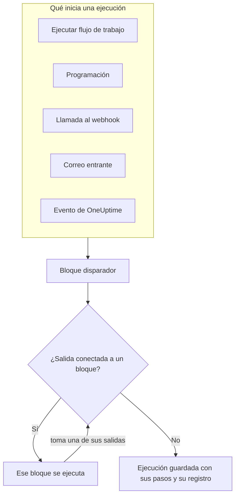
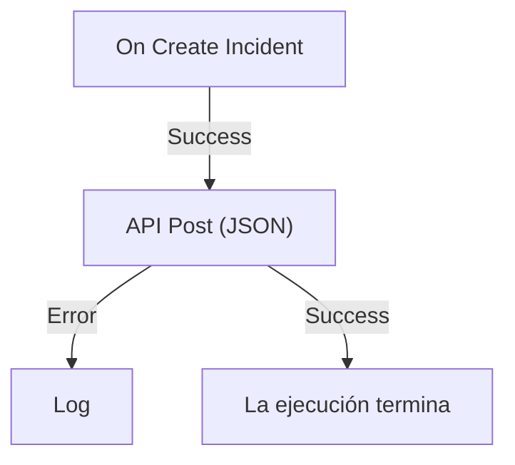

# Visión general de los flujos de trabajo

Los flujos de trabajo automatizan el trabajo en OneUptime sin código. Colocas bloques en un lienzo, los conectas, y el flujo de trabajo se ejecuta solo cada vez que salta su disparador: se crea un incidente, vence una programación, otra herramienta llama a una URL o llega un correo electrónico. Úsalos para conectar OneUptime con el resto de tu stack y para encargarte del seguimiento rutinario mientras trabajas en el problema en sí.

:::cards
- [Crear un flujo de trabajo](/docs/workflows/authoring): Crea un flujo de trabajo y, luego, añade, conecta y configura sus bloques en el lienzo.
- [Disparadores](/docs/workflows/triggers): Inicia un flujo de trabajo a mano, según una programación, desde un webhook, un correo electrónico o un evento de OneUptime.
- [Componentes](/docs/workflows/components): Todos los bloques que puedes añadir, desde llamadas a API hasta registros de OneUptime.
- [Ejecuciones](/docs/workflows/runs-and-logs): Mira lo que hizo cada ejecución, paso a paso.
:::

## Cómo funciona un flujo de trabajo

Todo flujo de trabajo tiene tres partes:

1. **Un disparador** — lo que inicia el flujo de trabajo: una ejecución manual, una programación, una llamada a un webhook, un correo entrante o un evento en OneUptime, como un incidente nuevo. Todo flujo de trabajo tiene exactamente uno.
2. **Componentes** — lo que hace el flujo de trabajo: enviar un mensaje, llamar a una API, comprobar una condición, crear o actualizar un registro de OneUptime.
3. **Conexiones** — las líneas que trazas de un bloque al siguiente. Deciden qué se ejecuta después de qué.

Cuando salta el disparador, OneUptime inicia una **ejecución**. Cada bloque termina tomando una de sus salidas, como **Success** o **Error**, **Yes** o **No**, y solo los bloques conectados a esa salida se ejecutan a continuación. Cuando no hay ningún bloque conectado a la salida que tomó un bloque, ese camino termina. La ejecución se guarda con su estado, el camino que siguió y lo que cada bloque recibió y devolvió.



Todo esto lo construyes visualmente en un lienzo. La mayoría de los flujos de trabajo no necesitan código; cuando alguno lo necesita, un bloque **Run Custom JavaScript** ejecuta unas pocas líneas de JavaScript.

## Qué puedes hacer con los flujos de trabajo

- **Conectar OneUptime con tus otras herramientas** — publicar en Slack, Microsoft Teams, Discord, Telegram o IRC, crear tickets de Jira o enviar una solicitud a cualquier API de tu stack.
- **Reaccionar a lo que pasa en OneUptime** — cuando se crea un incidente, avisar al canal adecuado y abrir un ticket automáticamente.
- **Ejecutar tareas de forma programada** — cada cinco minutos, cada noche, cada lunes por la mañana.
- **Recibir datos desde fuera** — dejar que otros sistemas inicien un flujo de trabajo llamando a su URL o escribiendo a su dirección de correo.
- **Reutilizar automatizaciones comunes** — constrúyela una vez e iníciala desde cualquier otro flujo de trabajo con un bloque **Execute Workflow**.

## Términos clave

| Término                | Qué significa                                                                                                      |
| ---------------------- | ------------------------------------------------------------------------------------------------------------------ |
| **Flujo de trabajo**   | La automatización completa: un nombre, un lienzo de bloques y un interruptor para activarla o desactivarla.        |
| **Disparador**         | El primer bloque. Decide cuándo se ejecuta el flujo de trabajo. Todo flujo de trabajo tiene exactamente uno.      |
| **Componente**         | Cualquier otro bloque: envía un mensaje, hace una solicitud, comprueba una condición o cambia un registro.        |
| **Salida**             | Un punto en la parte inferior de un bloque, como **Success** o **Error**. Las líneas que salen de él llevan a los bloques siguientes. |
| **Ejecución**          | Una ejecución del flujo de trabajo, guardada con su estado, sus marcas de tiempo y lo que hizo cada bloque.        |
| **Variable global**    | Un valor, como una clave de API, que guardas una vez y usas en cualquier flujo de trabajo del proyecto.            |

## Antes de empezar

- **Un plan que incluya flujos de trabajo.** En OneUptime Cloud, los flujos de trabajo necesitan el plan **Growth** o superior, y cada plan permite un número de ejecuciones cada 30 días — consulta [Límites del plan](/docs/workflows/configuration#límites-del-plan). Las instalaciones autoalojadas sin facturación no tienen ninguno de estos límites.
- **Permiso para construir.** Crear y cambiar flujos de trabajo requiere **Workflow Admin**, **Project Admin** o **Project Owner**, o un rol personalizado con los permisos correspondientes. Un **Workflow Member** puede abrir flujos de trabajo y ejecutarlos a mano, pero no cambiarlos. Consulta [Permisos](/docs/workflows/configuration#permisos).

## Dónde encontrar los flujos de trabajo en OneUptime

Abre **Productos** en la barra superior y elige **Flujos de trabajo**, en **Paneles y automatización**. Su menú contiene:

- **Flujos de trabajo** — tu lista de flujos de trabajo. Crea uno nuevo o abre uno existente.
- **Variables globales** — valores compartidos por todos tus flujos de trabajo.
- **Registros → Ejecuciones** — el historial de ejecuciones de todos los flujos de trabajo de tu proyecto.
- **Ajustes → Reglas de etiquetas** y **Reglas del propietario** — etiqueta los flujos de trabajo nuevos y asigna sus propietarios automáticamente.
- **Avanzado → Archivado** — los flujos de trabajo que archivaste. Nunca se ejecutan y no aparecen en la lista; desarchívalos desde aquí. Consulta [Archivar un flujo de trabajo](/docs/workflows/configuration#archivar-un-flujo-de-trabajo).
- **Desarrolladores** — cómo gestionar los flujos de trabajo con Terraform, la API o un asistente de IA.

Abre un flujo de trabajo concreto y su propio menú contiene:

- **Vista general** — nombre, descripción, etiquetas y el interruptor **Habilitado**.
- **Constructor** — el lienzo donde diseñas el flujo de trabajo, con el interruptor **Habilitado** arriba.
- **Variables del flujo de trabajo** — valores limitados a este único flujo de trabajo.
- **Registros → Ejecuciones** — cada ejecución de este flujo de trabajo, con sus detalles.
- **Propietarios** — las personas y los equipos responsables del flujo de trabajo.
- **Desarrolladores** — cómo gestionar este flujo de trabajo con Terraform, la API o un asistente de IA.
- **Ajustes** — duplicar, exportar y archivar.

**Ajustes** está en la sección **Avanzado** del menú, junto con **Registros de auditoría** y **Eliminar flujo de trabajo**. **Avanzado** y **Desarrolladores** empiezan contraídas, en este menú y en todos los demás, para que las páginas que usas a diario aparezcan primero. Haz clic en el nombre de una sección para mostrar sus páginas. Se abre sola cuando estás en una de ellas.

## Construye tu primer flujo de trabajo

Todo flujo de trabajo se construye de la misma manera:

:::steps
1. **Crear** — elige un punto de partida y, luego, dale un nombre a tu flujo de trabajo. Consulta [Crear un flujo de trabajo](/docs/workflows/authoring).
2. **Elegir un disparador** — manual, programado, webhook, correo entrante o un evento de OneUptime. Consulta [Disparadores](/docs/workflows/triggers).
3. **Añadir componentes** — añade acciones al lienzo y conéctalas. Consulta [Componentes](/docs/workflows/components).
4. **Activarlo** — activa **Habilitado** en la parte superior del **Constructor**. Un flujo de trabajo deshabilitado no puede ejecutarse en absoluto, ni siquiera a mano.
5. **Probar** — haz clic en **Ejecutar flujo de trabajo** en el **Constructor** y observa la ejecución mientras ocurre.
:::

El ejemplo siguiente recorre estos pasos para un flujo de trabajo real.

## Ejemplo: enviar los incidentes nuevos a un webhook

Este flujo de trabajo envía un resumen JSON de cada incidente nuevo a una URL tuya — un sistema de tickets, un almacén de datos, cualquier cosa que acepte un webhook — y escribe el motivo en el registro de la ejecución cuando la solicitud falla.



> [!TIP]
> La plantilla **Forward new incidents to another system** construye este mismo flujo de trabajo por ti. La encontrarás en **Incidentes** al crear un flujo de trabajo.

:::steps
### Crear el flujo de trabajo

Abre **Flujos de trabajo** y haz clic en **Crear flujo de trabajo**. Haz clic en **Empezar desde cero**, nombra el flujo de trabajo `Send new incidents to a webhook` y haz clic en **Crear flujo de trabajo**.

El flujo de trabajo nuevo se abre en el **Constructor**, desactivado.

### Añadir el disparador

Haz clic en el bloque discontinuo **Elige qué inicia este flujo de trabajo** y, luego, en **On Create Incident**, en **Populares**, dentro del panel **Añadir desencadenante**.

El disparador ocupa el lugar del bloque discontinuo. El ID que aparece en él, `incident-on-create-1`, es como los bloques posteriores se refieren a él.

### Elegir los campos del incidente

Haz clic en el disparador. En **Select Fields**, marca los campos que debe llevar la solicitud, como el título y la descripción, y haz clic en **Guardar**.

El disparador pasa el incidente nuevo con esos campos. Un campo que no seleccionas llega vacío.

### Añadir el bloque de API

Haz clic en **Añadir componente** y, luego, en **API Post (JSON)**, en **Populares**. Arrastra desde el punto **Success** del disparador hasta el punto superior del bloque nuevo.

### Rellenar la solicitud

Haz clic en el bloque de API, que dice **Haz clic para configurar**. Pon tu endpoint en **URL**. En **Request Body**, escribe el JSON que quieres enviar, usando **{ }** para insertar los campos del incidente donde los necesites, y haz clic en **Guardar**.

```json title="Request Body"
{
  "id": "{{local.components.incident-on-create-1.returnValues.model._id}}",
  "title": "{{local.components.incident-on-create-1.returnValues.model.title}}",
  "description": "{{local.components.incident-on-create-1.returnValues.model.description}}"
}
```

Cada referencia `{{…}}` se sustituye por el valor del incidente cuando se ejecuta el flujo de trabajo. Consulta [Variables](/docs/workflows/variables) para ver la sintaxis.

### Capturar los fallos

Haz clic en **Añadir componente** y, luego, en **Registro**. Conecta a él el punto **Error** del bloque de API y, después, pon como **Value** del bloque Log `Could not send the incident: {{local.components.api-post-1.returnValues.error}}`.

Una solicitud que falla — una URL inaccesible o una respuesta que no es 2xx — toma ahora este camino, y el registro de la ejecución dice por qué.

### Activarlo

Activa **Habilitado** en la parte superior del **Constructor**.

### Probarlo

Haz clic en **Ejecutar flujo de trabajo**, introduce el **ID del incidente** de un incidente de este proyecto, haz clic en **Ejecutar flujo de trabajo manualmente** y confirma con **Ejecutar**.

Se abre un panel **Ejecución del flujo de trabajo** que sigue la ejecución. Abre el paso **API Post (JSON)** para ver el cuerpo que envió y la respuesta que recibió.
:::

A partir de ahora, cada incidente nuevo del proyecto inicia una ejecución. Las encontrarás todas en las [Ejecuciones](/docs/workflows/runs-and-logs) del flujo de trabajo.

> [!NOTE]
> La solicitud sale de OneUptime. En OneUptime Cloud, la URL debe ser accesible desde internet. Una instalación autoalojada rechaza las direcciones de red privada a menos que un administrador las permita — consulta [Acceso de red saliente](/docs/workflows/configuration#acceso-de-red-saliente).

## Cómo encajan los flujos de trabajo con el resto de OneUptime

- Los **monitores** detectan el problema. Los **incidentes** y las **alertas** lo registran. Los **flujos de trabajo** reaccionan a él.
- Los **runbooks** son procedimientos de respuesta que tu equipo sigue ante un incidente, una alerta o un mantenimiento: pasos manuales, aprobaciones y scripts, con personas en el proceso. Los flujos de trabajo se ejecutan sin supervisión. Usa un [runbook](/docs/runbooks/index) cuando una persona tenga que tomar decisiones por el camino, y un flujo de trabajo cuando todos los pasos sean automáticos.
- Las **conexiones del espacio de trabajo** vinculan un proyecto con Slack y Microsoft Teams para los canales de incidentes y las notificaciones. Los bloques de Slack y Microsoft Teams de los flujos de trabajo no las usan: cada bloque publica a través de su propia URL de webhook entrante.

## Siguientes pasos

:::cards
- [Crear un flujo de trabajo](/docs/workflows/authoring): Trabaja con el lienzo, los bloques y sus ajustes.
- [Variables](/docs/workflows/variables): Pasa datos entre bloques y mantén los secretos fuera de tus flujos de trabajo.
- [Configuración y seguridad](/docs/workflows/configuration): Permisos, límites y seguridad antes de pasar a producción.
:::
