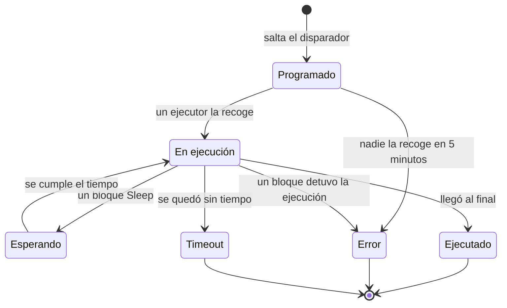

# Ejecuciones de flujo de trabajo

Cada vez que se ejecuta un flujo de trabajo, OneUptime guarda un registro de lo que pasó: cuándo se ejecutó, si funcionó y lo que cada bloque recibió y devolvió. Ese registro se llama **ejecución**. Las ejecuciones te sirven para confirmar que un flujo de trabajo funcionó, depurar uno que no funcionó y revisar la actividad pasada.

:::cards
- [Estados de una ejecución](#estados-de-una-ejecución): Qué significan Programado, Esperando, Ejecutado y los demás estados.
- [Leer una ejecución](#leer-una-ejecución): Sigue el camino que tomó una ejecución, bloque a bloque.
- [Solución de problemas](#solución-de-problemas): Un flujo de trabajo que no se ejecutó, un bloque que nunca se ejecutó, un valor que llegó vacío.
:::

## Dónde encontrarlas

| Página                                                 | Qué ves                                                                                            |
| ------------------------------------------------------ | -------------------------------------------------------------------------------------------------- |
| **Flujos de trabajo → Registros → Ejecuciones**        | Todas las ejecuciones de todos los flujos de trabajo del proyecto. Filtra por nombre del flujo de trabajo, estado y fecha. |
| **Flujo de trabajo → Registros → Ejecuciones**         | Solo las ejecuciones de este flujo de trabajo. Esta tiene un filtro **ID de ejecución** en lugar de un filtro de flujo de trabajo. |
| **Una ejecución concreta**                             | Se abre con el botón **Ver registros** de la fila de una ejecución: las filas en sí no se pueden pulsar. |

Iniciar una ejecución desde el **Constructor** abre la misma vista **Ejecución del flujo de trabajo**, que ya sigue la ejecución, así que la ves ocurrir en lugar de buscarla después.

## Estados de una ejecución

| Estado                              | Qué significa                                                                                                                                                                                                                                                         |
| ----------------------------------- | --------------------------------------------------------------------------------------------------------------------------------------------------------------------------------------------------------------------------------------------------------------------- |
| **Programado**                      | Saltó el disparador y la ejecución está en cola esperando un ejecutor. Normalmente una fracción de segundo. Una ejecución que sigue programada después de 5 minutos falla: nadie la recogió.                                                                          |
| **En ejecución**                    | El flujo de trabajo está en curso.                                                                                                                                                                                                                                    |
| **Esperando**                       | La ejecución está aparcada en un bloque **Sleep** y se reanudará sola. No ocupa ningún worker mientras espera.                                                                                                                                                       |
| **Ejecutado**                       | La ejecución llegó al final sin fallar. Es el estado de éxito: la píldora dice **Ejecutado**, no «Éxito».                                                                                                                                                             |
| **Error**                           | Un bloque detuvo la ejecución. También se usa cuando una ejecución en cola nunca se recoge, cuando se pierde la reanudación de una ejecución dormida, cuando no se puede resolver una expresión de programación y cuando el flujo de trabajo se desactivó o se archivó mientras la ejecución esperaba en un bloque **Sleep**. |
| **Timeout**                         | La ejecución duró más de lo permitido: 2 minutos por defecto. Consulta [Cuánto puede durar una ejecución](/docs/workflows/configuration#cuánto-puede-durar-una-ejecución).                                                                                                    |
| **Execution Exceeded Current Plan** | El proyecto ha agotado sus ejecuciones de flujos de trabajo de los últimos 30 días, o la suscripción está impagada. La ejecución se registra pero no se ejecuta. Solo en OneUptime Cloud.                                                                            |

Un bloque que toma su salida **Error** — un bloque API que recibió un 4xx, por ejemplo — no hace fallar la ejecución. Los bloques conectados a **Error** se ejecutan, y la ejecución termina igualmente como **Ejecutado**. El propio paso se dibuja en rojo para que lo encuentres.

## Leer una ejecución

Haz clic en **Ver registros** en una ejecución para abrirla. La vista **Ejecución del flujo de trabajo** tiene dos pestañas, **Pasos** y **Registro completo**.

### La pestaña Pasos

El camino que siguió la ejecución, una tarjeta numerada por bloque, en el orden en que se ejecutaron. Sin abrir nada, cada tarjeta muestra:

- El título y el ID del bloque, si **Completado con éxito** o **Fallido**, y cuánto tardó.
- Qué salida tomó, con el nombre que tiene en el lienzo, y adónde llevó: el número y el nombre del paso siguiente, o una nota que dice que no hay nada conectado a ella, así que la ejecución o esa rama terminó ahí. Un paso al que llevó pero que nunca se ejecutó dice **(no se ejecutó)**. La salida Error se dibuja en rojo; Yes y No son simplemente el camino que siguió la ejecución. Pasa el cursor por el nombre de la salida para ver qué significa.
- El error del paso, si falló, y cualquier advertencia sobre él — por ejemplo, una referencia `{{…}}` que no se resolvió en nada.

Abre una tarjeta para ver dos bloques de detalle:

| Bloque       | Qué muestra                                                                                                                                                                                                     |
| ------------ | --------------------------------------------------------------------------------------------------------------------------------------------------------------------------------------------------------------- |
| **Recibido** | Los ajustes que recibió el bloque, por nombre y en el orden en que los muestra su lista de ajustes, después de rellenar todas las variables. Un ajuste que hace referencia a otro paso o a una variable muestra la referencia junto al valor en que se convirtió, y **No se resolvió** cuando no se convirtió en nada. |
| **Devueltos** | Lo que produjo, con el ID de cada valor (la última parte de una referencia `returnValues`). Las listas y los objetos se muestran con sangría.                                                                  |

Los pasos fallidos, los pasos con una advertencia y el único paso de una ejecución empiezan abiertos. El contador de la pestaña **Pasos** se pone rojo cuando algo falló y ámbar cuando un paso tiene una advertencia.

Algunas ejecuciones se leen de otra manera:

- **Una prueba de un solo paso.** Una ejecución iniciada con **Ejecutar solo este paso** dice **Solo se ejecutó este paso** en la parte superior. Los pasos anteriores no se ejecutaron, así que faltan los valores que lee de ellos (espera una advertencia **No se resolvió** para esos), y los pasos posteriores dicen **(no se ejecutó en esta prueba)**. Usa **Ejecutar flujo de trabajo** para probar todo el camino.
- **Una ejecución que se detuvo entre pasos.** Si la ejecución se detuvo por un motivo que ningún paso explica — agotó su tiempo entre pasos, o falló antes de su primer paso —, el camino termina con **La ejecución se detuvo aquí** y el motivo.
- **Una ejecución dormida.** Una ejecución que espera en un bloque **Sleep** termina con **En reposo** y la hora a la que continuará sola; los pasos posteriores al Sleep dicen **(aún no se ha ejecutado)**.

El ID que aparece bajo el título de cada paso es exactamente lo que va en una referencia `{{local.components.<id>.returnValues.…}}`, lo que hace de esta la forma más rápida de escribir bien una referencia.

Los valores que se muestran son los que recibió el bloque, después de rellenar las variables y antes de que el bloque hiciera nada con ellos, con dos excepciones: los secretos y los campos que el bloque marca como sensibles se ocultan, y un valor de más de 4.000 caracteres se recorta con "… (truncated)". Una ejecución conserva sus últimos 100 pasos; una ejecución larga o reanudada a menudo muestra una nota ámbar donde se descartaron los anteriores. Las ejecuciones registradas antes de que se guardaran los nombres de las salidas muestran la salida por su ID, sin adónde llevó.

### La pestaña Registro completo

El registro bruto, línea a línea, que escribió el ejecutor, incluido todo lo que los propios bloques registraron, como el valor de un bloque **Log** o el `console.log` de un script. Úsalo cuando la pestaña Pasos no explique el fallo.

## Copiar y descargar una ejecución

En la parte superior de la vista **Ejecución del flujo de trabajo**, junto a su botón de cerrar, **Copiar registro** pone todo el **Registro completo** en tu portapapeles, listo para pegarlo en un chat o un ticket. **Descargar** guarda la ejecución como archivo:

| Descarga                            | Qué obtienes                                                                                                                                                                                                                           |
| ----------------------------------- | -------------------------------------------------------------------------------------------------------------------------------------------------------------------------------------------------------------------------------------- |
| **Descargar registro**              | Un archivo `.txt` con el registro completo tal como lo escribió el ejecutor, por largo que sea, bajo un encabezado breve: el nombre y el ID del flujo de trabajo, el ID de la ejecución, su estado y cuándo se programó, empezó y terminó. |
| **Descargar ejecución como JSON**   | Un archivo `.json` con los mismos datos como datos, los pasos que muestra la pestaña **Pasos** (lo que cada uno recibió y devolvió, y qué salida tomó) y el registro como una lista de líneas. Los pasos tienen la misma forma en que la API devuelve el `stepTrace` de una ejecución y, como en la pestaña **Pasos**, son los últimos 100 de la ejecución. El registro siempre está completo. |

Las mismas dos descargas están en el menú **⋯** de cada ejecución en las dos listas de ejecuciones, así que puedes guardar una ejecución sin abrirla. Una ejecución que iniciaste desde el **Constructor** se puede copiar o descargar mientras sigue en curso; obtienes lo que ha registrado hasta ese momento.

Los archivos se nombran según el flujo de trabajo, la ejecución y cuándo empezó, en UTC, así que una carpeta de ellos se ordena por flujo de trabajo y después por hora: `nightly-sync-run-<run id>-2026-09-30T10-00-01.txt`.

Una descarga no contiene nada que no pudieras leer ya en la ejecución. Los secretos y los campos que un bloque marca como sensibles se ocultan cuando se registra la ejecución, así que también están ocultos en el archivo, y cualquiera que pueda abrir una ejecución puede descargarla.

## Solución de problemas

:::details Mi flujo de trabajo no se ejecutó
1. Asegúrate de que el flujo de trabajo está **Habilitado**: el interruptor está en la parte superior de su **Constructor**, que lo indica encima del lienzo cuando el flujo de trabajo está desactivado. Los flujos de trabajo nuevos empiezan deshabilitados, y un flujo de trabajo deshabilitado rechaza todas las ejecuciones, incluidas las manuales. Una llamada de webhook a él recibe HTTP 400 con un mensaje que explica cómo activarlo.
2. Para un disparador de eventos de OneUptime, confirma que el evento ocurrió de verdad: abre el registro y revisa su historial. Un disparador **On Update** con **Listen on** solo salta cuando cambió uno de esos campos.
3. Para un disparador webhook, confirma que el otro sistema envía a la URL correcta. La mayoría de las herramientas registran cuándo envían un webhook: míralo ahí.
4. Para un disparador programado, confirma que la expresión cron coincide con la hora que esperas. Las programaciones se ejecutan en UTC.

Si la ejecución sí aparece, con el estado **Execution Exceeded Current Plan**, el proyecto ha agotado sus ejecuciones de flujos de trabajo de los últimos 30 días, o la suscripción está impagada. El registro de la ejecución indica el recuento y el límite de tu plan. Esto solo se aplica a OneUptime Cloud.
:::

:::details Un bloque posterior nunca se ejecutó
Un bloque que no se ejecuta suele ser un problema de conexión. Abre el **Constructor** y comprueba:

- ¿Está conectada la salida del bloque anterior a la entrada de este bloque?
- ¿Tomó el bloque anterior una salida distinta de la que esperabas — **Error** en lugar de **Success**, o **No** en lugar de **Yes**? La pestaña **Pasos** dice qué salida tomó y adónde llevó, o que no hay nada conectado a ella.
:::

:::details Un valor llegó vacío, o como texto {{…}}
Abre la ejecución y mira el paso. Una referencia que no se resolvió aparece señalada en el propio paso como advertencia, y su ajuste en el bloque **Recibido** está marcado como **No se resolvió**.

- Si ves el texto literal `{{local.components.…}}`, la referencia no se resolvió. Normalmente es una errata en el ID del componente o en el ID del valor de retorno: recuerda que es el **Identificador** del bloque, no el nombre que se muestra en él. Comprueba también cómo está escrito `local.components`: `{{local.componets.api-get-1.returnValues.response-body}}` se envía como texto literal y la ejecución sigue indicando **Ejecutado**. Si la ejecución era una prueba de **Ejecutar solo este paso**, el bloque anterior no se ejecutó en absoluto: ejecuta el flujo de trabajo completo en su lugar.
- Si ves **Texto vacío**, el bloque anterior se ejecutó pero no produjo ese campo.

La misma advertencia está en la pestaña **Registro completo**, en una línea que empieza por `Warning:`.
:::

:::details Funciona cuando lo ejecuto a mano, pero no desde el disparador
Abre el **Constructor**, haz clic en **Ejecutar flujo de trabajo** y rellena los campos del disparador con valores que se parezcan a lo que envía el disparador real. Después compara los valores **Recibido** de esa ejecución con los de la ejecución real, uno al lado del otro. La diferencia suele estar en el nombre o el tipo de un solo campo.
:::

## Volver a ejecutar un flujo de trabajo

No hay un botón de «reintentar esta ejecución». Las ejecuciones antiguas nunca se vuelven a ejecutar automáticamente, porque sus efectos secundarios — mensajes de Slack, llamadas a API, tickets — podrían no ser seguros de repetir. Para rehacer el trabajo, corrige el flujo de trabajo y deja que el siguiente disparador real lo lance, o abre el **Constructor** y haz clic en **Ejecutar flujo de trabajo** con los mismos valores.

## ¿Cuánto tiempo se conservan las ejecuciones?

En OneUptime Cloud, las ejecuciones se conservan **30 días** y después se eliminan: por eso las dos listas de ejecuciones dicen que cubren los últimos 30 días. Las instalaciones autoalojadas conservan las ejecuciones hasta que las eliminas; si un flujo de trabajo se ejecuta muy a menudo y satura tu historial, desactívalo o elimínalo.

Las ejecuciones registradas antes de que se añadiera el seguimiento de pasos no tienen contenido en **Pasos** y solo muestran su **Registro completo**.

## Siguientes pasos

:::cards
- [Configuración y seguridad](/docs/workflows/configuration): Límites de tiempo, límites del plan y lo que se oculta en los registros.
- [Variables](/docs/workflows/variables): La sintaxis de las referencias que usan tus bloques.
- [Componentes](/docs/workflows/components): Lo que devuelve cada bloque y cuándo toma cada salida.
:::
