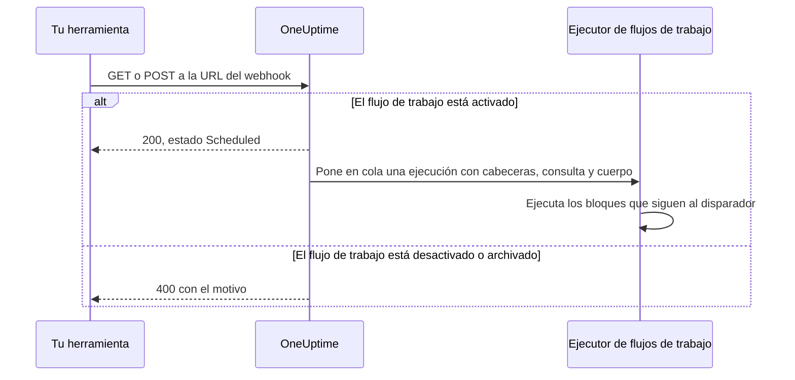
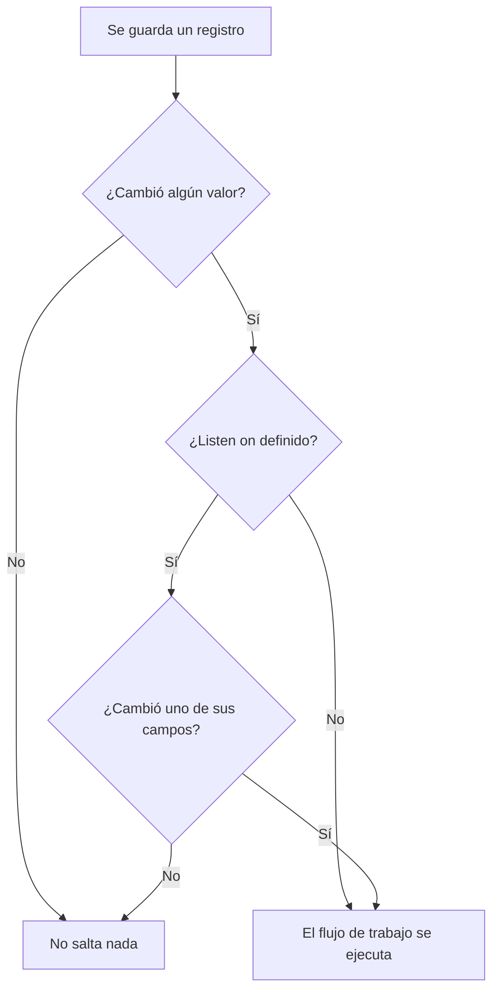

# Disparadores de flujo de trabajo

Un disparador es el primer bloque de un flujo de trabajo: decide cuándo se ejecuta el flujo de trabajo. Todo flujo de trabajo tiene exactamente un disparador. Puedes elegir entre cinco tipos.

:::cards
- [Manual](#manual): Inicia el flujo de trabajo desde el Constructor o desde otro flujo de trabajo.
- [Programación](#schedule): Ejecútalo según una programación periódica, escrita como expresión cron.
- [Webhook](#webhook): Deja que otro sistema lo inicie llamando a una URL.
- [Correo entrante](#incoming-email): Inícialo con cada correo enviado a su propia dirección.
- [Disparadores de eventos de OneUptime](#disparadores-de-eventos-de-oneuptime): Reacciona cuando se crea, actualiza o elimina un registro.
:::

Para añadir el disparador, haz clic en el bloque discontinuo **Elige qué inicia este flujo de trabajo** en el lienzo de un flujo de trabajo nuevo. Para cambiarlo, elimina el bloque disparador y el bloque discontinuo vuelve. Consulta [Crear un flujo de trabajo](/docs/workflows/authoring#añadir-bloques).

## ¿Qué disparador debo usar?

| Si quieres…                                    | Elige                       |
| ---------------------------------------------- | --------------------------- |
| Hacer clic en un botón para ejecutar el flujo de trabajo | **Manual**        |
| Ejecutarlo según una programación periódica    | **Programación**            |
| Que otro sistema envíe datos                   | **Webhook**                 |
| Iniciarlo a partir de un correo                | **Incoming Email**          |
| Reaccionar a algo dentro de OneUptime          | **Evento de OneUptime**     |

Un flujo de trabajo solo puede tener un disparador. Si necesitas dos formas de iniciar la misma automatización, construye la lógica compartida en un flujo de trabajo con un disparador **Manual** e inícialo desde dos flujos de trabajo «envoltorio» ligeros con un bloque **Execute Workflow**.

## Manual

Ejecuta el flujo de trabajo cuando quieras: haz clic en **Ejecutar flujo de trabajo** en la página **Constructor**, rellena el **JSON** del disparador, haz clic en **Ejecutar flujo de trabajo manualmente** y confirma con **Ejecutar**. Otro flujo de trabajo también puede iniciarlo, con un bloque **Execute Workflow**.

Útil para: automatizaciones de un clic para las que quieres un botón, como «rotar esta clave» o «enviar una alerta de prueba», y lógica que compartes entre flujos de trabajo.

**Retornos**: **JSON** — aquello con lo que se inició la ejecución.

- Desde **Ejecutar flujo de trabajo**, es el JSON que escribiste, como texto. Para leer uno de sus campos, pásalo primero por un bloque **Text to JSON**.
- Desde un bloque **Execute Workflow**, cada clave de los **Arguments** del bloque es un valor propio. Con `{"customerId": "42"}`, un bloque posterior lee `{{local.components.manual-1.returnValues.customerId}}`, donde `manual-1` es el ID del disparador Manual.

## Schedule

Ejecuta el flujo de trabajo según una programación periódica. Indica la frecuencia en **Schedule at**: elige una de las **Programaciones habituales**, escribe una expresión de **Cron personalizado** o elige una **Variable** que contenga una. Debajo del campo, la programación se describe en palabras, con sus **Próximas ejecuciones**.

Útil para: limpieza nocturna, sincronización cada hora, informes semanales.

Las horas están en UTC, así que convierte desde tu zona horaria al elegir la hora. Las cinco partes de una expresión cron son el minuto, la hora, el día del mes, el mes y el día de la semana:

| Expresión     | Se ejecuta                              |
| ------------- | --------------------------------------- |
| `*/5 * * * *` | Cada 5 minutos.                         |
| `0 * * * *`   | Cada hora, a la hora en punto.          |
| `0 0 * * *`   | Cada día a medianoche UTC.              |
| `0 9 * * 1-5` | Cada día laborable a las 9:00 UTC.      |
| `0 9 * * 1`   | Cada lunes a las 9:00 UTC.              |

No se programa nada mientras el flujo de trabajo está desactivado. Una programación **Variable** lee una variable del flujo de trabajo o global, como `{{local.variables.schedule}}`. Si no resulta en una expresión cron válida, el flujo de trabajo no se programa, y una ejecución fallida en su lista de ejecuciones explica por qué.

Para probar el flujo de trabajo sin esperar a la programación, haz clic en **Ejecutar flujo de trabajo** en el **Constructor**: inicia una ejecución al momento.

## Webhook

OneUptime le da al flujo de trabajo una URL propia. Cualquier cosa que llame a esa URL inicia el flujo de trabajo, con las cabeceras, los parámetros de consulta y el cuerpo de la solicitud.

Útil para: recibir datos en OneUptime desde otra herramienta — callbacks de CI/CD, alertas de otra monitorización, registros en tu CRM.

Para obtener la URL, haz clic en el disparador Webhook en el lienzo. La URL está en la parte superior de sus ajustes, con un botón **Copiar URL**, los métodos que acepta y un comando `curl` que puedes pegar en un terminal para probarlo:

```bash
curl -X POST "https://oneuptime.example.com/workflow/trigger/<secret key>" \
  -H "Content-Type: application/json" \
  -d '{"message": "Hello"}'
```

La URL acepta tanto `GET` como `POST`. Quien llama recibe una confirmación rápida, `{"status": "Scheduled"}` — el flujo de trabajo se ejecuta en segundo plano, así que quien llama nunca ve lo que hace. Una llamada a un flujo de trabajo desactivado o archivado se rechaza con HTTP 400 y el motivo.



**Retornos**:

| Valor                    | Qué contiene                                                                                                         |
| ------------------------ | -------------------------------------------------------------------------------------------------------------------- |
| **Request Headers**      | Todas las cabeceras de la solicitud, por su nombre en minúsculas, como `content-type`.                               |
| **Request Query Params** | Los parámetros de la cadena de consulta de la URL, por su nombre.                                                    |
| **Request Body**         | El cuerpo que envió quien llama. Un cuerpo JSON, enviado con `Content-Type: application/json`, se puede leer campo a campo. |

Lee un campo añadiendo su nombre a la referencia, como en `{{local.components.webhook-1.returnValues.request-body.message}}`.

Cuando ha llegado una solicitud, el selector de valores de cada bloque posterior al disparador sabe lo que contenía: muestra los campos del cuerpo, las cabeceras y los parámetros de consulta, cada uno con su contenido, para que puedas elegir `incident.title` en lugar de escribir una ruta. Hasta entonces, indica que no ha llegado ninguna solicitud y ofrece **Copy test request**, un comando `curl` para la URL; los campos aparecen en cuanto termina la ejecución que inicia esa solicitud. Consulta [Usar valores de bloques anteriores](/docs/workflows/authoring#usar-valores-de-bloques-anteriores).

Para probar el flujo de trabajo sin la otra herramienta, haz clic en **Ejecutar flujo de trabajo** en el **Constructor** y escribe cabeceras, parámetros de consulta y un cuerpo.

### Mantén la URL en privado

La última parte de la URL es la clave secreta del flujo de trabajo, y cualquiera que tenga la URL puede iniciar el flujo de trabajo. Por eso la clave está oculta hasta que haces clic en **Mostrar**, y **Copiar URL** copia la URL completa sin mostrarla.

Si la URL se filtra, haz clic en **Restablecer URL** en el mismo lugar: el flujo de trabajo recibe una URL nueva y la antigua deja de funcionar al instante, así que actualiza todo lo que la llame. Solo las personas que pueden editar el flujo de trabajo pueden ver o restablecer su URL — consulta [Seguridad de los webhooks](/docs/workflows/configuration#seguridad-de-los-webhooks).

> [!WARNING]
> Trata la URL como una contraseña. Cualquiera que la tenga puede iniciar tu flujo de trabajo, sin iniciar sesión.

## Incoming Email

OneUptime le da al flujo de trabajo una dirección de correo propia. Cada correo enviado a esa dirección inicia el flujo de trabajo, con el correo: quién lo envió, para quién era, el asunto, el texto y el HTML, las cabeceras y los nombres de los adjuntos.

Útil para: actuar sobre correos de sistemas que no pueden llamar a un webhook — alertas de herramientas de monitorización antiguas, avisos de estado de un proveedor, el informe que envía por correo un proceso nocturno.

Para obtener la dirección, haz clic en el disparador Incoming Email en el lienzo. La dirección está en la parte superior de sus ajustes, con un botón **Copiar dirección**. Dásela a lo que deba iniciar el flujo de trabajo: una herramienta que solo sabe enviar correos, los ajustes de notificación de un proveedor o una regla de reenvío de tu propio buzón.

Cada correo inicia su propia ejecución. El correo llega al flujo de trabajo tanto si la dirección está en Para como en CC, como copia oculta o a través de una regla de reenvío. Un correo que nombra la dirección dos veces inicia una sola ejecución.

**Retornos**:

| Valor           | Qué contiene                                                                                            |
| --------------- | ------------------------------------------------------------------------------------------------------- |
| **From**        | La dirección del remitente.                                                                             |
| **To**          | Todos los destinatarios del correo, en una sola línea, como `ops@example.com, oncall@example.com`.      |
| **CC**          | Todos los destinatarios en copia, en una sola línea.                                                    |
| **Subject**     | El asunto.                                                                                              |
| **Body**        | El texto sin formato del correo.                                                                        |
| **HTML Body**   | El HTML del correo, cuando lo tiene. Body y HTML Body se cortan cada uno en 1 MB.                        |
| **Headers**     | Todas las cabeceras del correo, por su nombre en minúsculas, como `message-id`.                         |
| **Attachments** | El nombre, el tipo y el tamaño de cada archivo adjunto. Los archivos en sí no se guardan.               |
| **Received At** | Cuándo recibió OneUptime el correo.                                                                     |

Cuando ha llegado un correo, el selector de valores de cada bloque posterior al disparador sabe lo que contenía: muestra cada cabecera y cada adjunto que tenía el correo, con su contenido, para que puedas elegir `headers.message-id` en lugar de escribir una ruta. Hasta entonces, indica que todavía no ha llegado ningún correo a la dirección. Consulta [Usar valores de bloques anteriores](/docs/workflows/authoring#usar-valores-de-bloques-anteriores).

Para probar el flujo de trabajo sin enviar un correo, haz clic en **Ejecutar flujo de trabajo** en la página **Constructor** y rellena un remitente, un asunto y un cuerpo. Los valores que dejes fuera llegan vacíos.

El correo inicia el flujo de trabajo solo mientras está activado. El correo a un flujo de trabajo desactivado se ignora, igual que el correo a un flujo de trabajo cuyo disparador ya no es Incoming Email.

### Mantén la dirección en privado

La parte de la dirección anterior a la `@` contiene la clave secreta del flujo de trabajo, y cualquiera que tenga la dirección puede iniciar el flujo de trabajo. Por eso la clave está oculta hasta que haces clic en **Mostrar**, y **Copiar dirección** copia la dirección completa sin mostrarla.

Si la dirección se filtra, haz clic en **Restablecer dirección** en el mismo lugar: el flujo de trabajo recibe una dirección nueva, y el correo a la antigua se ignora a partir de entonces, así que da la nueva a todo lo que escribe al flujo de trabajo. Solo las personas que pueden editar el flujo de trabajo pueden ver o restablecer su dirección — consulta [Seguridad del correo entrante](/docs/workflows/configuration#seguridad-del-correo-entrante).

> [!WARNING]
> Cualquiera puede poner cualquier remitente en un correo, así que **From** no prueba quién lo envió. Comprueba algo que solo sepa el remitente real antes de que un paso haga algo importante.

> [!NOTE]
> En una instalación autoalojada, OneUptime recibe el correo a través de un proveedor de correo entrante que configura tu administrador — consulta [Correo entrante de SendGrid](/docs/self-hosted/sendgrid-inbound-email). Hasta entonces, el disparador no tiene dirección, y sus ajustes lo indican.

## Disparadores de eventos de OneUptime

Casi todo en OneUptime — monitores, incidentes, alertas, eventos de mantenimiento programado, páginas de estado, políticas de guardia, equipos — puede disparar un flujo de trabajo. Cada uno ofrece hasta tres eventos:

- **On Create** — salta cuando se añade uno nuevo.
- **On Update** — salta cuando se cambia uno. Guardar un registro con los valores que ya tiene, como un formulario guardado sin cambios o un interruptor enviado tal como ya está, no es un cambio y no lo dispara.
- **On Delete** — salta cuando se elimina uno.

Así construyes «cuando pase X en OneUptime, haz Y» sin tener que comprobar las cosas en un bucle.

**On Update** se puede limitar a algunos campos con **Listen on**: entonces solo salta cuando una actualización cambia uno de ellos, a cualquier valor — desactivar un interruptor o vaciar un campo cuenta.



**On Create** y **On Update** pasan el registro al bloque siguiente, con los campos que eliges en el **Select Fields** del disparador. Por ejemplo, el disparador **Incident → On Create** pasa el incidente nuevo, así que el bloque siguiente puede leer su título, su descripción, su gravedad o cualquier otro campo que hayas seleccionado, como `{{local.components.incident-on-create-1.returnValues.model.title}}`. Un campo que no seleccionaste llega vacío.

**On Delete** solo pasa el ID del registro eliminado: el registro ya no existe cuando se ejecuta el flujo de trabajo, así que sus otros campos no se pueden leer.

Para probar un disparador de evento sin esperar al evento, haz clic en **Ejecutar flujo de trabajo** en el **Constructor** e introduce el ID de un registro existente, como un **ID del incidente**. La ejecución lee ese registro con los campos que seleccionaste.

### Los eventos más usados

| Recurso                                   | Qué hacen los equipos con él                                                              |
| ----------------------------------------- | ----------------------------------------------------------------------------------------- |
| **Incidente**                             | Reaccionar cuando se declara, se actualiza (reconocido, resuelto) o se elimina un incidente. |
| **Alerta**                                | Los mismos tres eventos, para las alertas.                                                |
| **Monitor**                               | Reaccionar cuando se añade, se edita o se quita un monitor.                               |
| **Evento de mantenimiento programado**    | Anunciar una ventana de mantenimiento automáticamente cuando se programa.                 |
| **Suscriptor de la página de estado**     | Dar la bienvenida a alguien que se suscribe a una página de estado.                       |
| **Política de guardia**                   | Sincronizar los cambios de la política con otro sistema de turnos.                        |

En el panel **Añadir desencadenante** están en **Recursos de OneUptime**: haz clic en el recurso y, luego, en el disparador. **Explorar todos los recursos** los tiene todos, y el cuadro de búsqueda encuentra un disparador a partir de unas pocas palabras, como `incident created`.

## Siguientes pasos

:::cards
- [Componentes](/docs/workflows/components): Las acciones que añades después del disparador.
- [Variables](/docs/workflows/variables): Lee en los bloques posteriores lo que pasó el disparador.
- [Ejecuciones](/docs/workflows/runs-and-logs): Confirma que tu disparador saltó y mira lo que trajo.
:::
