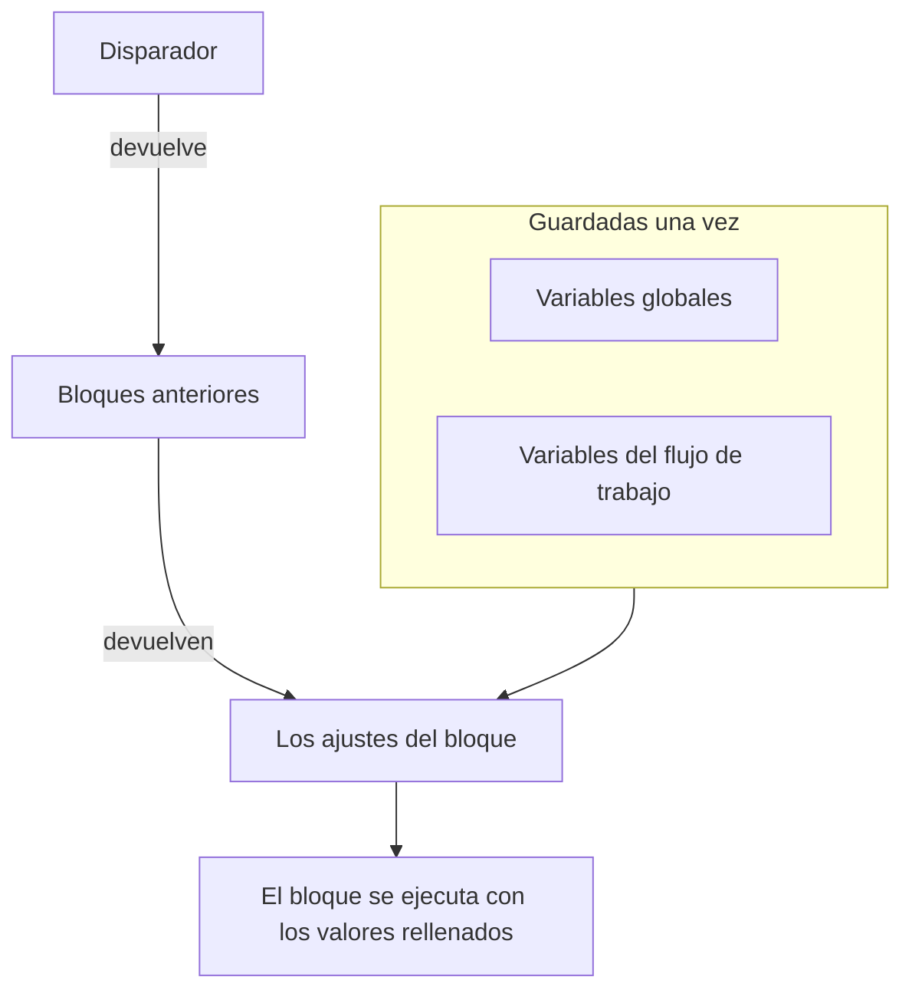
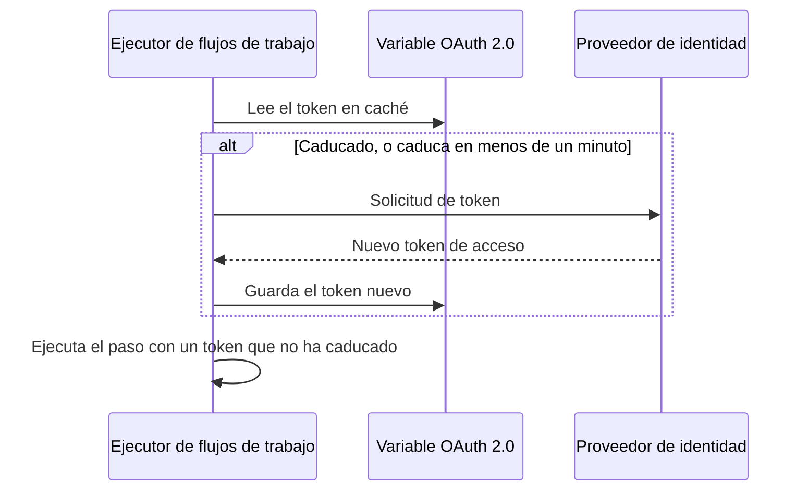

# Variables de flujo de trabajo

Las variables son la forma en que los datos se mueven por un flujo de trabajo: del disparador al primer bloque, de un bloque al siguiente, y de los valores que guardas una vez a cada bloque que los necesita. El ajuste de un bloque lee un valor con una referencia entre dobles llaves, y el ejecutor lo rellena justo antes de que se ejecute el bloque.

| Valor                          | De dónde viene                                                       | Cómo lo lee un bloque                                 |
| ------------------------------ | -------------------------------------------------------------------- | ----------------------------------------------------- |
| **Variable global**            | Guardada en **Flujos de trabajo → Variables globales**               | `{{global.variables.NAME}}`                          |
| **Variable del flujo de trabajo** | Guardada en la página **Variables del flujo de trabajo** de un flujo de trabajo | `{{local.variables.NAME}}`                |
| **El valor de un bloque anterior** | Lo que devolvió el disparador o un bloque anterior en esta ejecución | `{{local.components.BLOCK_ID.returnValues.VALUE_ID}}` |



Rara vez escribes una referencia. Haz clic en **{ }** al final de un ajuste, o escribe `{{` en él, y elige el valor de una lista. Consulta [Usar valores de bloques anteriores](/docs/workflows/authoring#usar-valores-de-bloques-anteriores).

## Variables globales

Valores de todo el proyecto que guardas una vez y reutilizas en todos los flujos de trabajo: claves de API, URL, nombres de canales — cualquier cosa que no quieras copiar en diez flujos de trabajo distintos.

:::steps
### Abrir las variables globales

Ve a **Flujos de trabajo → Variables globales** y haz clic en **Crear Variable del flujo de trabajo**.

### Dar nombre a la variable

En el paso **Variable**, rellena:

- **Nombre** — cómo te referirás a ella. Al menos dos caracteres, sin espacios, y solo letras, números, guiones y guiones bajos. `UPPER_SNAKE_CASE` es un buen hábito porque destaca en tus bloques.
- **Descripción** — opcional, texto libre para recordar para qué sirve.

Haz clic en **Siguiente**.

### Darle un valor

En el paso **Valor**, rellena:

- **Contenido** — el valor en sí. Es un campo de texto largo, así que los valores de varias líneas funcionan.
- **Secreto** — cuando está activado, el valor se borra de los registros de ejecución y de las trazas de los pasos.

Haz clic en **Crear Variable del flujo de trabajo**. Para cambiar el nombre o la descripción antes de hacerlo, haz clic en **Variable** en la lista de pasos junto al formulario (visible en pantallas anchas); lo que escribiste en cualquiera de los dos pasos se conserva.
:::

Usa una variable global en cualquier flujo de trabajo con:

```text
{{global.variables.NAME}}
```

Por ejemplo, si guardaste tu clave de PagerDuty como `PAGERDUTY_KEY`, cualquier bloque puede usarla como `{{global.variables.PAGERDUTY_KEY}}`: el editor guarda la referencia, y el registro del flujo de trabajo borra el valor secreto resuelto.

La lista muestra el nombre y la descripción de cada variable. Haz clic en **Ver** en una fila para abrir la página de la variable. Indica si la variable es estática u OAuth 2.0, y es donde haces todo lo demás:

| Botón                                        | Qué hace                                                                                                                                         |
| -------------------------------------------- | ------------------------------------------------------------------------------------------------------------------------------------------------ |
| **Editar variable**                          | Cambia el nombre, la descripción y — para una variable estática que aún no es secreta — la marca de secreto. Una vez secreta, una variable sigue siéndolo. |
| **Actualizar contenido**                     | Sustituye un valor estático. El contenido guardado no se puede volver a leer, así que escribes el valor nuevo completo.                          |
| **Usar en flujos de trabajo**                | Muestra la referencia exacta que pegar en tus bloques, con un botón para copiarla.                                                               |
| **Eliminar Variable del flujo de trabajo**   | La elimina, después de pedirte confirmación. La confirmación nombra la variable, para que compruebes que es la que quieres.                      |

Para crear en su lugar una variable de **token de acceso OAuth 2.0**, abre el menú **Más** (**⋯**) junto a **Crear Variable del flujo de trabajo** y elige **Crear variable OAuth 2.0**. Las variables OAuth 2.0 tienen [su propia sección](#variables-oauth-20-tokens-que-se-renuevan-solos) más abajo. El tipo de una variable no se puede cambiar después de guardarla.

También puedes actualizar una variable a través de la API, lo que se explica [al final de esta página](#actualizar-una-variable-desde-un-flujo-de-trabajo). Las variables globales y del flujo de trabajo son una función del plan Growth.

## Variables locales de un flujo de trabajo

Variables limitadas a un flujo de trabajo, que se gestionan en **Variables del flujo de trabajo** en el menú de ese flujo de trabajo. Funcionan igual que las variables globales: **Crear Variable del flujo de trabajo** crea una variable estática, el menú **Más** (**⋯**) crea una variable OAuth 2.0 y **Ver** abre la página de una variable. Haz referencia a ellas con:

```text
{{local.variables.NAME}}
```

Usa una para un valor que solo necesita ese flujo de trabajo, como la URL de webhook de Slack de una plantilla. Las plantillas que piden ajustes los guardan como variables del flujo de trabajo, para que puedas cambiarlos más adelante sin editar los bloques.

## Variables OAuth 2.0 (tokens que se renuevan solos)

Un token bearer pegado en una variable estática funciona hasta que caduca, normalmente en menos de una hora. A partir de ahí, cada ejecución que lo usa falla con `401 Unauthorized` hasta que alguien pega uno nuevo. Una variable de **token de acceso OAuth 2.0** guarda lo que necesita el intercambio de tokens de OAuth en lugar del token en sí, y OneUptime mantiene el token al día.

La usas exactamente como cualquier otra variable:

```http
Authorization: Bearer {{global.variables.CRM_API_TOKEN}}
```

### Cómo se mantiene válido el token



- La primera vez que un flujo de trabajo usa la variable, OneUptime pide un token de acceso al endpoint de tokens de tu proveedor de identidad y lo guarda.
- Antes de cada paso que hace referencia a la variable, el ejecutor comprueba el token. Si ha caducado, o caduca en el próximo minuto, se obtiene uno nuevo antes de que se ejecute el paso. El componente siempre recibe un token que no ha caducado, por mucho tiempo que la variable haya estado sin usarse y por mucho que dure la ejecución.
- Solo los pasos que hacen referencia de verdad a la variable provocan una renovación. Una ejecución que nunca usa una variable nunca obtiene su token, y no falla porque ese proveedor esté caído.
- Cuando muchas ejecuciones necesitan un token nuevo en el mismo momento, una de ellas lo obtiene y las demás usan ese.
- Si el proveedor no dice cuándo caduca un token (sin `expires_in`, y el token no es un JWT con un claim `exp`), OneUptime obtiene uno nuevo una vez por ejecución y lo comparte entre los pasos de esa ejecución.

### Tipos de concesión

| Tipo de concesión              | Úsalo para                                                                                                                                                                                                                                          |
| ------------------------------ | --------------------------------------------------------------------------------------------------------------------------------------------------------------------------------------------------------------------------------------------------- |
| **Client Credentials**         | OneUptime inicia sesión como tu aplicación. La opción habitual para API de servidor a servidor como Microsoft Graph, las API de Auth0 u Okta, o un servicio interno detrás de Keycloak.                                                             |
| **Token de actualización**     | Acceso delegado en nombre de un usuario. Autoriza la aplicación una vez (por ejemplo, en el OAuth playground de tu proveedor o con Postman) y pega el token de actualización que obtengas. OneUptime lo intercambia por tokens de acceso, y guarda cada nuevo token de actualización si tu proveedor los rota. También funciona un cliente público sin secreto de cliente. |

### Crear una

**Crear variable OAuth 2.0** pide una cosa en cada paso:

1. **Variable**: el nombre con el que los flujos de trabajo se refieren a ella, y una descripción.
2. **Proveedor**: elige tu **Proveedor de identidad** y OneUptime rellena su **URL del token**:

   | Proveedor de identidad | URL del token que rellena |
   |---|---|
   | Microsoft Entra ID | `https://login.microsoftonline.com/{tenant-id}/oauth2/v2.0/token` |
   | Google | `https://oauth2.googleapis.com/token` |
   | Okta | `https://{your-domain}/oauth2/default/v1/token` |
   | Auth0 | `https://{your-domain}/oauth/token` |

   Sustituye la parte entre llaves por tu propio valor, como tu ID de directorio (inquilino) o tu dominio de Okta. El formulario no avanza mientras la URL tenga una. Para cualquier otro proveedor, elige **Otro proveedor** e introduce tú mismo su endpoint de tokens. Después elige el **Tipo de concesión**. Al elegir Google se selecciona **Token de actualización**, porque los clientes OAuth de Google no pueden usar Client Credentials. El proveedor solo rellena el formulario; no se guarda con la variable.
3. **Credenciales**: el **ID de cliente** y el **Secreto de cliente** de la aplicación que registraste con el proveedor y, para el tipo Refresh Token, el **Token de actualización**. Un cliente público con el tipo Refresh Token puede dejar vacío el secreto de cliente.
4. **Avanzado**, todo opcional:
   - **Alcance**: separado por espacios. Déjalo vacío para obtener los alcances predeterminados del proveedor. Para Client Credentials, Microsoft Entra ID necesita un alcance que termine en `/.default` (como `https://graph.microsoft.com/.default`) y Okta necesita un alcance personalizado.
   - **Parámetros adicionales**: campos de formulario extra para la solicitud de token, como `audience` para Auth0 (necesario para Client Credentials) o `resource` para Azure AD v1. Cualquiera que pueda leer la variable puede leerlos, así que no pongas secretos aquí.
   - **Autenticación del cliente**: si el ID y el secreto de cliente van en una cabecera HTTP Basic (lo predeterminado) o en el cuerpo de la solicitud. Si tu proveedor responde `invalid_client`, prueba la otra opción.

Debajo de algunos campos, el formulario añade una línea de ayuda para el proveedor que elegiste, por ejemplo dónde muestra Microsoft Entra ID tu ID de inquilino, y que su secreto de cliente es el **Value** del secreto, no su **Secret ID**.

Cuando guardas una variable OAuth 2.0 nueva, OneUptime obtiene su primer token de inmediato y te dice lo que respondió el proveedor. Una errata en el secreto o en la URL aparece en ese momento, no horas después en una ejecución fallida. Obtener un token escribe en la variable, así que necesita permiso para editar variables del flujo de trabajo; si puedes crear variables pero no editarlas, la primera ejecución de un flujo de trabajo que use la variable obtiene su token en su lugar.

La página de la variable (haz clic en **Ver** en su fila) tiene una tarjeta **Ajustes de OAuth 2.0**. **Editar configuración** recorre los mismos pasos **Proveedor** (URL del token), **Credenciales** (ID de cliente) y **Avanzado** (alcance, parámetros adicionales, autenticación del cliente). **Siguiente** avanza y **Guardar cambios** está en el último paso. Todos los pasos ya están rellenados, así que la lista de pasos junto al formulario abre cualquiera de ellos: cambia un ajuste en su paso y después abre el último paso y guarda. El tipo de concesión queda fijo una vez guardado.

### La tarjeta Token de acceso

La tarjeta **Token de acceso** de la página de una variable OAuth 2.0 muestra uno de estos estados:

| Estado                     | Qué significa                                                                                                                        |
| -------------------------- | ------------------------------------------------------------------------------------------------------------------------------------ |
| **Valid**                  | El token en caché aún no ha caducado.                                                                                                |
| **Caducado**               | Normal en una variable que ningún flujo de trabajo ha usado últimamente. La siguiente ejecución que la use obtiene un token nuevo.   |
| **Aún no obtenido**        | No se ha obtenido ningún token desde que se creó la variable o se cambiaron sus ajustes.                                             |
| **No expiry reported**     | El proveedor no dijo cuándo caduca el token, así que cada ejecución obtiene uno nuevo.                                               |
| **La actualización falló** | El último intento de obtener un token falló. El motivo del proveedor se muestra completo, con cuándo ocurrió. La siguiente renovación correcta lo borra. |

**Actualizar ahora**, debajo del estado, obtiene un token nuevo de inmediato. Úsalo para comprobar ajustes nuevos sin ejecutar un flujo de trabajo. **Actualizar credenciales**, en la tarjeta **Ajustes de OAuth 2.0**, sustituye el secreto de cliente o el token de actualización y después obtiene un token con ellos. Cambiar cualquier ajuste (URL del token, ID de cliente, alcance, etc.) descarta el token en caché, así que la siguiente ejecución obtiene uno con los ajustes nuevos.

### Cuando el proveedor dice que no

El paso que necesitaba el token falla antes de ejecutarse, y el registro de la ejecución nombra la variable y cita la respuesta del proveedor, por ejemplo `Could not get an OAuth 2.0 access token for {{global.variables.CRM_API_TOKEN}}: The token endpoint refused the request (HTTP 400): invalid_grant - Token has been expired or revoked.` El mismo motivo aparece en la tarjeta **Token de acceso** de la variable. `invalid_grant` en una variable Refresh Token casi siempre significa que el propio token de actualización ha caducado o se ha revocado, y la solución es **Actualizar credenciales**.

Si la renovación falla mientras el token en caché aún no ha caducado de verdad (solo estaba dentro del margen de un minuto), el paso sigue adelante con el token en caché y el registro lo indica.

### Seguridad

- Las variables OAuth 2.0 siempre son secretas. El token de acceso se sustituye por `[REDACTED]` en los registros de ejecución y en las trazas de los pasos, incluido un token que se sustituyó a mitad de una ejecución.
- El secreto de cliente, el token de actualización y el token de acceso se cifran en la base de datos y nunca se pueden volver a leer a través de la API ni del panel. **Actualizar ahora** indica cuándo caduca el token nuevo, nunca el token.
- La URL del token tiene que ser `http` o `https`. Las solicitudes a direcciones de loopback, de enlace local y de metadatos de la nube se rechazan. En OneUptime Cloud también se rechazan las direcciones de red privada. Las instalaciones autoalojadas pueden llegar a un proveedor de identidad de su propia red. OneUptime no sigue redirecciones en las solicitudes de token, así que apunta la URL del token a la dirección en la que responde realmente el endpoint. Una solicitud de token desiste a los 20 segundos.

### Pasar un token estático existente a OAuth 2.0

El tipo de una variable queda fijo una vez guardada. Elimina la variable estática y crea una variable OAuth 2.0 con el **mismo nombre**. Los flujos de trabajo se refieren a las variables por su nombre, así que usan la nueva sin ningún cambio.

## Salidas de componentes (datos de bloques anteriores)

Cada disparador y cada componente puede producir datos durante una ejecución. Inserta una referencia con el botón **{ }** de cualquier ajuste, o escribiendo `{{` en él, en lugar de escribirla entera: inserta los ID exactos que espera el ejecutor y muestra el valor como una ficha con el nombre del bloque y del valor.

También puedes empezar por el bloque que produce el valor: sus ajustes muestran cada salida en **Retornos**, con la referencia exacta y un botón para copiarla.

Haz referencia a la salida de un bloque anterior así:

```text
{{local.components.COMPONENT_ID.returnValues.FIELD_ID}}
```

`COMPONENT_ID` es el **Identificador** del bloque: el ID corto que aparece en el bloque, no el nombre que se muestra en él. Los bloques nuevos reciben uno como `api-get-1`, y puedes cambiarle el nombre en la sección **ID** del bloque. Cambiarlo rompe todas las referencias que ya apuntan a él, igual que cambiar el nombre de una variable. `FIELD_ID` es el ID del valor, y una ruta detrás de él lee un campo de un valor JSON.

| Después de un bloque como…                                | Lee                                                                                    |
| --------------------------------------------------------- | -------------------------------------------------------------------------------------- |
| Un bloque **API** cuyo ID es `lookup-user`                | Su código de estado: `{{local.components.lookup-user.returnValues.response-status}}`. Su cuerpo: `{{local.components.lookup-user.returnValues.response-body}}`. |
| Un bloque **Run Custom JavaScript** cuyo ID es `transform` | Lo que devolvió: `{{local.components.transform.returnValues.returnValue}}`.          |
| Un disparador **On Create Incident** cuyo ID es `incident-on-create-1` | El título del incidente: `{{local.components.incident-on-create-1.returnValues.model.title}}`. Los disparadores de registros devuelven un solo valor, `model`, y profundizas en él. |

Los valores de los bloques solo existen durante la ejecución actual. Cada ejecución nueva empieza de cero.

## Dónde funcionan las variables

Casi todos los campos de texto aceptan variables:

- La URL de un bloque API.
- El texto del mensaje en Slack, Teams, Discord, Telegram, IRC, Email.
- El asunto y el cuerpo de un correo.
- Las cabeceras y los campos del cuerpo (dentro de valores de cadena).
- Los dos lados de un bloque **If / Else**.

En los campos JSON — **Data (JSON Object)**, **Query** y **Select Fields** en los componentes de registros, el **Request Body** de un bloque API, los **Arguments** de **Run Custom JavaScript** — una referencia se rellena según dónde esté:

- **Entre comillas, es texto.** `{"title": "Down: {{local.components.ci-webhook.returnValues.request-body.service}}"}` mete el valor en la cadena. Las comillas, las barras invertidas y los saltos de línea del valor se escapan, así que el JSON sigue siendo válido y el valor sigue siendo una sola cadena.
- **Sola, es el propio valor.** `{"customFields": {{local.components.transform.returnValues.returnValue}}}` inserta el objeto entero, una lista sigue siendo una lista y un número sigue siendo un número. Un texto que es JSON en sí — `5`, `true` o un objeto que un bloque devolvió como texto JSON — entra como ese valor. Cualquier otro texto entra como una cadena.

Una referencia dentro de las comillas de una clave también es texto. Si necesitas construir una estructura de forma dinámica, constrúyela con un bloque **Run Custom JavaScript** y pasa su salida al bloque siguiente.

El bloque **Run Custom JavaScript** no recibe las variables automáticamente: no se inyecta nada en el sandbox. Pon `{{global.variables.NAME}}` (o cualquier referencia de componente) en el campo JSON **Arguments** del bloque; esos valores se sustituyen antes de que se ejecute el script y llegan como `args`.

## Recorrer arrays

Dentro de un campo de texto puedes repetir un fragmento de texto para cada elemento de una lista con `{{#each path}}…{{/each}}`. Dentro del bloque, `{{property}}` lee del elemento actual, `{{@index}}` es su posición empezando en 0, y `{{this}}` es el propio elemento en listas de valores simples. Los nombres dentro de un bloque `{{#each}}` se recortan, así que los espacios sobrantes no hacen daño ahí, a diferencia de en cualquier otro sitio.

Por ejemplo, este **Message Text** enumera todas las alertas que envió un webhook:

```text title="Message Text"
{{#each local.components.ci-webhook.returnValues.request-body.alerts}}
- {{@index}}: {{name}} is {{status}}
{{/each}}
```

## Ejemplos

### Construir un payload a partir de un webhook

Llega un webhook con un cuerpo como `{ "service": "checkout", "status": "failed" }`. Para convertirlo en un incidente de OneUptime:

1. Un disparador **Webhook** con el ID `ci-webhook`.
2. Un bloque **If / Else**: **Value to check** es el campo `status` del Request Body del webhook (`{{local.components.ci-webhook.returnValues.request-body.status}}`), **Comparison** es **is equal to** y **Compare with** es `failed`.
3. Desde la rama **Yes**, un bloque **Create One Incident** con:
   - Título: `CI build failed: {{local.components.ci-webhook.returnValues.request-body.service}}`
   - Descripción: `See {{local.components.ci-webhook.returnValues.request-body.url}} for the logs.`

### Usar un secreto en una llamada a una API

Un flujo de trabajo que llama a PagerDuty:

1. Guarda `PAGERDUTY_KEY` como variable global secreta.
2. En el bloque **API**, pon la cabecera `Authorization` a `Token token={{global.variables.PAGERDUTY_KEY}}`.

La clave queda fuera del flujo de trabajo y de los registros.

### Encadenar dos llamadas a una API

La primera llamada te da un ID que necesita la segunda:

1. Componente **API** `lookup-order`: en su **URL**, después de `/orders?email=`, usa **{ }** para insertar el JSON del disparador manual con la ruta `email`.
2. Componente **API** `cancel-order`: `POST /orders/{{local.components.lookup-order.returnValues.response-body.id}}/cancel`.

Si `lookup-order` falla, salta su salida **Error** en lugar de **Success**. Conéctala a un bloque de Email o de Slack para que los fallos no pasen desapercibidos.

## Actualizar una variable desde un flujo de trabajo

Un patrón habitual es rotar una credencial según una programación: obtener un token nuevo de un tercero y guardarlo de vuelta en la variable para que la siguiente ejecución lo recoja. Hazlo con un bloque **API** que llame a la API de OneUptime.

Si la credencial es un token de acceso OAuth 2.0, no necesitas construir esto tú. Una [variable OAuth 2.0](#variables-oauth-20-tokens-que-se-renuevan-solos) obtiene y renueva el token por sí sola.

Envía `PUT /api/workflow-variable/<variable-id>` con una cabecera `ApiKey` y — esta es la parte en la que la gente tropieza — los campos que quieres cambiar **envueltos en un objeto `data`**:

```json title="Request Body"
{
  "data": {
    "content": "{{local.components.get-token.returnValues.response-body.access_token}}"
  }
}
```

Un cuerpo plano sin la envoltura `data` se rechaza con un 400. Envía solo los campos que de verdad quieras cambiar; `name` y `description` pueden quedarse fuera de la carga.

La clave de API necesita **Edit Workflow Variables**. No hace falta permiso de lectura: la actualización no vuelve a leer la fila.

Dos cosas a vigilar:

- **No cambies el nombre de una variable a la que haces referencia.** `name` forma parte de `{{local.variables.NAME}}`. Cambiarlo deja sin resolver todas las referencias existentes, y una referencia sin resolver se pasa tal cual como texto literal — consulta [Trampas habituales](#trampas-habituales).
- **Una variable se puede escribir así, pero nunca volver a leer.** `content` es de solo escritura a través de la API para todas las variables, secretas o no. Eso es lo que hace de una variable un lugar seguro para guardar un token que rota. Marcarla como secreta, además, mantiene el valor fuera de los registros de ejecución y de las trazas de los pasos.

## Trampas habituales

- **Usa { } (o escribe `{{`).** Inserta los ID exactos de componente, de valor de retorno y de variable que espera el ejecutor, y solo ofrece valores que existen cuando se ejecuta el bloque.
- **Los nombres de las variables distinguen mayúsculas y minúsculas.** `{{global.variables.MyKey}}` y `{{global.variables.mykey}}` son distintos.
- **Una referencia que no se resuelve se deja tal cual, no se vacía.** Hacer referencia a algo que no existe no es un error, y tampoco te da una cadena vacía: las llaves pasan tal cual, así que `{{local.components.api-get-1.returnValues.body}}` con un ID de paso mal escrito acaba literalmente en tu mensaje de Slack, tu URL o el cuerpo de tu solicitud, y la ejecución sigue indicando **Ejecutado**. La pestaña **Pasos** de la ejecución muestra en el paso una advertencia que nombra cualquier referencia que se haya colado, y marca el ajuste en el que estaba como **No se resolvió**; el registro de la ejecución lleva la misma línea de advertencia.
- **El panel de problemas no puede comprobar los nombres de las variables.** Señala las referencias de componente que no puede emparejar — un ID de paso desconocido, un valor de retorno desconocido, una raíz mal formada — antes de guardar. No puede saber si una variable existe. Los ajustes de un bloque sí: una referencia a una variable que falta aparece allí como una ficha ámbar. Fuera de eso, una variable renombrada solo la detecta el registro de la ejecución.
- **Los espacios dentro de las llaves no se recortan.** `{{ local.variables.NAME }}` es una búsqueda distinta de `{{local.variables.NAME}}` y nunca se resuelve. La única excepción es dentro de un bloque `{{#each}}`, donde los nombres se recortan.

## Siguientes pasos

:::cards
- [Componentes](/docs/workflows/components): Lo que necesita y devuelve cada bloque.
- [Ejecuciones](/docs/workflows/runs-and-logs): Mira en qué valor se convirtió cada referencia en una ejecución.
- [Configuración y seguridad](/docs/workflows/configuration#secretos): Mantén los secretos fuera de los bloques, las exportaciones y los registros.
:::
