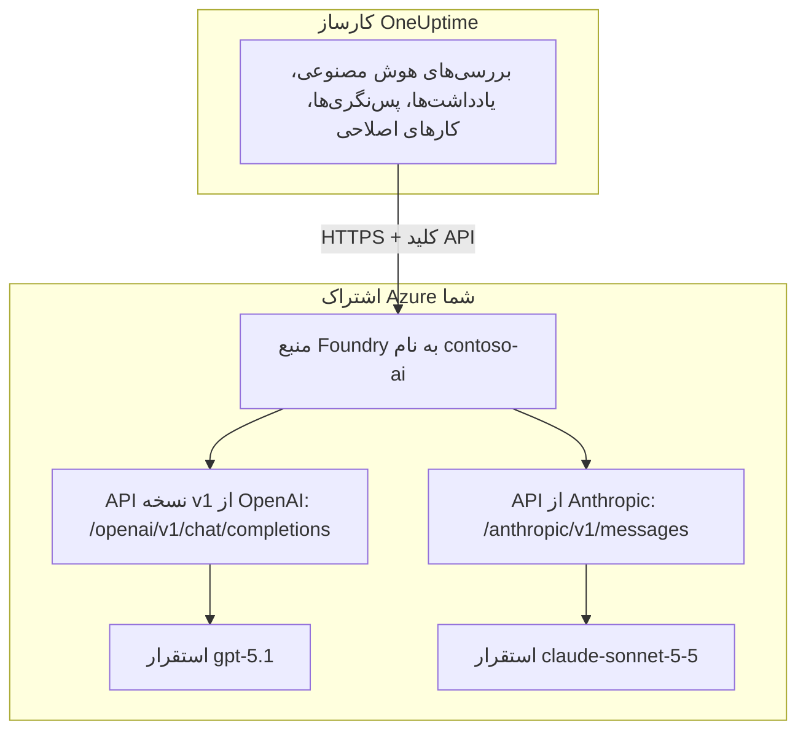

# Microsoft Foundry و Azure OpenAI

قابلیت‌های هوش مصنوعی OneUptime را روی مدل‌هایی اجرا کنید که در Microsoft Foundry (نام پیشین Azure AI Foundry) یا Azure OpenAI مستقر می‌کنید. OneUptime هر درخواست را مستقیم به منبع شما در اشتراک Azure خودتان می‌فرستد، پس پرامپت‌ها و پاسخ‌ها را همان استقراری پردازش می‌کند که انتخاب کرده‌اید، در همان جایی که انتخاب کرده‌اید. این صفحه شما را از یک اشتراک خالی تا یک ارائه‌دهنده آماده به کار همراهی می‌کند: منبع Azure، استقرار مدل، نقطه پایانی و کلید، تنظیمات OneUptime، شبکه، و کاری که هنگام شکست یک درخواست باید کرد.

:::cards
- [راه‌اندازی Azure](#راهاندازی-microsoft-foundry): یک منبع بسازید، مدلی مستقر کنید، نقطه پایانی و کلید آن را کپی کنید.
- [اتصال OneUptime](#اتصال-oneuptime): چهار فیلد در تنظیمات پروژه، سپس دکمه آزمایش.
- [میزبانی شخصی](#پیکربندی-نمونه-با-میزبانی-شخصی-با-متغیرهای-محیطی): یک ارائه‌دهنده برای همه پروژه‌ها، از متغیرهای محیطی.
- [عیب‌یابی](#عیبیابی): 401، 403، استقرار پیدا نشده، api-version.
:::

## چگونه کار می‌کند

OneUptime منبع Foundry شما را از کارساز OneUptime و از راه HTTPS فرامی‌خواند، هرگز از مرورگر کاربران. هر درخواست یکی از کلیدهای API منبع را همراه دارد و نام استقراری را که باید پاسخ دهد مشخص می‌کند.



یک نوع ارائه‌دهنده، **Azure OpenAI / Microsoft Foundry**، همه استقرارهای منبع را پوشش می‌دهد. نشانی پایه به OneUptime می‌گوید کدام API را فرابخواند:

| مدلی که مستقر می‌کنید | API که OneUptime فرامی‌خواند | نشانی پایه |
| --- | --- | --- |
| مدل‌های OpenAI، مانند GPT-5.1 و GPT-4.1 | OpenAI v1 chat completions | `https://contoso-ai.openai.azure.com/openai/v1` |
| Foundry Models با پشتیبانی از chat completions، مانند DeepSeek و Grok | OpenAI v1 chat completions | `https://contoso-ai.services.ai.azure.com/openai/v1` |
| Claude | Anthropic Messages | `https://contoso-ai.services.ai.azure.com/anthropic` |

> [!IMPORTANT]
> قابلیت‌های هوش مصنوعی OneUptime ابزار فرامی‌خوانند: هنگام کار، پایشگرها، رخدادها و داده‌های تله‌متری شما را جست‌وجو می‌کنند. مدلی مستقر کنید که از فراخوانی ابزار (function calling) پشتیبانی کند. دکمه **آزمایش** ارائه‌دهنده این را برایتان بررسی می‌کند.

## پیش از شروع

به یک اشتراک Azure، نقشی که بتوانید با آن منبع را بسازید و بخوانید، و نقشی در OneUptime که بتواند ارائه‌دهنده LLM اضافه کند نیاز دارید.

| برای | آنچه در Azure لازم است |
| --- | --- |
| ساختن منبع | **Owner** یا **Contributor** روی گروه منابع، یا **Foundry Account Owner** |
| مستقر کردن مدل | **Owner** یا **Contributor** روی گروه منابع، یا **Foundry Owner** یا **Foundry Account Owner** روی منبع. Claude افزون بر این به اجازه اشتراک پیشنهادهای Azure Marketplace نیاز دارد |
| خواندن کلیدهای منبع | نقشی با `Microsoft.CognitiveServices/accounts/listKeys/action`، مانند **Owner**، **Contributor** یا **Cognitive Services Contributor** |

خود OneUptime به هیچ نقش Azure نیازی ندارد. یک کلید به‌تنهایی و بدون بررسی نقش به همه استقرارهای منبع دسترسی می‌دهد، پس آن را مانند گذرواژه نگه دارید.

در OneUptime، افزودن ارائه‌دهنده به یک پروژه به **Project Owner**، **Project Admin**، **Project Member**، **Settings Admin**، **Settings Member** یا **Create LLM** نیاز دارد. یک نمونه با میزبانی شخصی می‌تواند به‌جای آن، از متغیرهای محیطی یک ارائه‌دهنده برای همه پروژه‌ها ثبت کند که به دسترسی به کارساز نیاز دارد.

## راه‌اندازی Microsoft Foundry

:::steps
### یک منبع بسازید

در [درگاه Foundry](https://ai.azure.com) یک منبع Foundry بسازید یا یکی از منابع موجود را برگزینید. منبع Azure OpenAI نیز به همین شکل کار می‌کند. نام منبع را یادداشت کنید: بخش نخست نقطه پایانی آن است، مانند `contoso-ai` در `https://contoso-ai.openai.azure.com`.

منطقه‌ای را برگزینید که مدل دلخواه شما را ارائه می‌دهد. فعلاً دسترسی شبکه منبع را برای همه شبکه‌ها باز بگذارید؛ [نیازمندی‌های شبکه](#نیازمندیهای-شبکه) توضیح می‌دهد کی و چگونه آن را ببندید.

### یک مدل مستقر کنید

در درگاه Foundry، **Discover** و سپس **Models** را برگزینید و یک مدل انتخاب کنید، مثلاً `gpt-5.1` یا `claude-sonnet-5-5`. **Deploy** و سپس **Custom settings** را برگزینید:

- **Deployment name**: Foundry نام مدل را در آن می‌گذارد. OneUptime استقرار را با همین نام درخواست می‌کند، پس آن را دقیق یادداشت کنید.
- **Deployment type**: تعیین می‌کند پرامپت‌ها کجا پردازش شوند. [داده‌های شما کجا پردازش می‌شوند](#دادههای-شما-کجا-پردازش-میشوند) را ببینید.

**Deploy** را برگزینید و صبر کنید تا وضعیت استقرار **Succeeded** شود.

### نقطه پایانی و یک کلید را کپی کنید

در [درگاه Azure](https://portal.azure.com) منبع را باز کنید و سپس به **Resource Management** > **Keys and Endpoint** بروید. **Endpoint** و **KEY 1** را کپی کنید. **KEY 2** را برای چرخش کلید نگه دارید: OneUptime را به آن بسپارید، سپس **KEY 1** را دوباره بسازید.

در درگاه Foundry، همین کلید در زبانه **Details** استقرار، کنار **Target URI** آن دیده می‌شود.
:::

:::details خط فرمان را ترجیح می‌دهید؟
همین گام‌ها با Azure CLI. برای `--model-version` نسخه‌ای را بدهید که کاتالوگ مدل‌ها برای آن مدل فهرست می‌کند.

```bash
az cognitiveservices account create \
  --name contoso-ai --resource-group oneuptime-ai \
  --kind AIServices --sku S0 --location eastus2 \
  --custom-domain contoso-ai

az cognitiveservices account deployment create \
  --name contoso-ai --resource-group oneuptime-ai \
  --deployment-name gpt-5.1 \
  --model-name gpt-5.1 --model-version <version> --model-format OpenAI \
  --sku-name GlobalStandard --sku-capacity 50

# KEY 1
az cognitiveservices account keys list \
  --name contoso-ai --resource-group oneuptime-ai \
  --query key1 --output tsv
```

با `--custom-domain contoso-ai`، نقطه پایانی منبع `https://contoso-ai.openai.azure.com` است.
:::

## اتصال OneUptime

:::steps
### ارائه‌دهندگان LLM را باز کنید

به **تنظیمات پروژه** > **هوش مصنوعی** > **ارائه‌دهندگان LLM** بروید و روی **ساخت ارائه‌دهنده LLM** کلیک کنید.

### برای ارائه‌دهنده نام بگذارید

در **اطلاعات پایه** یک **نام** وارد کنید، مانند `Azure gpt-5.1`، و در صورت تمایل **توضیحات**. روی **بعدی** کلیک کنید.

### تنظیمات ارائه‌دهنده را پر کنید

| فیلد | چه وارد کنید |
| --- | --- |
| **ارائه‌دهنده LLM** | **Azure OpenAI / Microsoft Foundry** |
| **کلید API** | **KEY 1** یا **KEY 2** منبع |
| **نام مدل** | نام استقرار، دقیقاً همان‌طور که Foundry نشان می‌دهد، مانند `gpt-5.1` |
| **نشانی پایه** | نقطه پایانی منبع همراه با `/openai/v1`، مانند `https://contoso-ai.openai.azure.com/openai/v1`. برای Claude: `https://contoso-ai.services.ai.azure.com/anthropic` |

**تنظیم به‌عنوان پیش‌فرض**، زیر **فیلدهای بیشتر**، روشن است: قابلیت‌های هوش مصنوعی از ارائه‌دهنده پیش‌فرض پروژه استفاده می‌کنند. روی **ساخت ارائه‌دهنده LLM** کلیک کنید.

### اتصال را آزمایش کنید

در ردیف ارائه‌دهنده روی **آزمایش** کلیک کنید. ارائه‌دهنده‌ای که کار می‌کند پاسخ می‌دهد "Connection successful. The LLM provider responded to a test prompt and used tool calling." اگر آزمایش شکست بخورد، پیام می‌گوید Azure چه پاسخی داد و چه چیزی را باید تغییر دهید؛ [عیب‌یابی](#عیبیابی) را ببینید.
:::

ارائه‌دهنده کامل‌شده، به‌عنوان نمونه:

```text
نام: Azure gpt-5.1
ارائه‌دهنده LLM: Azure OpenAI / Microsoft Foundry
کلید API: <KEY 1 منبع contoso-ai>
نام مدل: gpt-5.1
نشانی پایه: https://contoso-ai.openai.azure.com/openai/v1
```

از این پس قابلیت‌های هوش مصنوعی پروژه از این استقرار استفاده می‌کنند. در OneUptime Cloud، هزینه درخواست‌های آن‌ها از اعتبار هوش مصنوعی پروژه پرداخت نمی‌شود: Azure آن‌ها را به حساب اشتراک شما می‌گذارد.

## قالب‌های نشانی پایه

OneUptime نقطه پایانی را به همان شکل‌هایی می‌پذیرد که درگاه Azure و درگاه Foundry نشان می‌دهند، و هر درخواست را به نشانی کنار آن می‌فرستد. شکل‌های کوتاه را ترجیح دهید: نشانی پایه حداکثر 100 نویسه جا دارد.

| نشانی پایه | درخواست‌ها به این نشانی می‌روند |
| --- | --- |
| `https://contoso-ai.openai.azure.com` | `https://contoso-ai.openai.azure.com/openai/v1/chat/completions` |
| `https://contoso-ai.openai.azure.com/openai/v1` | `https://contoso-ai.openai.azure.com/openai/v1/chat/completions` |
| `https://contoso-ai.services.ai.azure.com/openai/v1` | `https://contoso-ai.services.ai.azure.com/openai/v1/chat/completions` |
| `https://contoso-ai.openai.azure.com/openai/deployments/gpt-4o` | `https://contoso-ai.openai.azure.com/openai/deployments/gpt-4o/chat/completions?api-version=2024-10-21` |
| `https://contoso-ai.services.ai.azure.com/anthropic` | `https://contoso-ai.services.ai.azure.com/anthropic/v1/messages` |

- **API نسخه v1** (`/openai/v1`) API کنونی Microsoft است. به `api-version` نیاز ندارد، نام استقرار را به‌عنوان مدل می‌گیرد، و به مدل‌های OpenAI و دیگر Foundry Models به یک شکل پاسخ می‌دهد. برای ارائه‌دهندگان تازه از آن استفاده کنید.
- **نشانی استقرار** (`/openai/deployments/<name>`) خودش استقرار را نام می‌برد، و Azure به‌جای **نام مدل** از همین نام پیروی می‌کند. اگر نشانی پایه `api-version` خودش را نداشته باشد، OneUptime `api-version=2024-10-21` را اضافه می‌کند. ارائه‌دهندگانی که این‌گونه ذخیره شده‌اند مانند گذشته کار می‌کنند.
- **Target URI یک استقرار**، که کامل از درگاه Foundry چسبانده شود، نیز کار می‌کند، به شرطی که در 100 نویسه جا شود.
- **Claude**: Foundry مدل Claude را تنها از راه Anthropic Messages API و در مسیر `/anthropic` منبع ارائه می‌دهد. OneUptime آن را با همان کلید فرامی‌خواند. نوع ارائه‌دهنده **Anthropic** نیز با همان نشانی پایه به آن می‌رسد.

## پیکربندی نمونه با میزبانی شخصی با متغیرهای محیطی

در نمونه‌ای با میزبانی شخصی، متغیرهای `GLOBAL_LLM_PROVIDER_*` هنگام راه‌اندازی یک ارائه‌دهنده LLM سراسری ثبت می‌کنند که هر پروژه بدون ارائه‌دهنده خودش از آن استفاده می‌کند، از جمله کارهای اصلاحی هوش مصنوعی. ارائه‌دهنده خود پروژه همیشه مقدم است.

```bash
GLOBAL_LLM_PROVIDER_TYPE=AzureOpenAI
GLOBAL_LLM_PROVIDER_NAME=Azure gpt-5.1
GLOBAL_LLM_PROVIDER_BASE_URL=https://contoso-ai.openai.azure.com/openai/v1
GLOBAL_LLM_PROVIDER_MODEL_NAME=gpt-5.1
GLOBAL_LLM_PROVIDER_API_KEY=<KEY 1 of contoso-ai>
```

:::tabs
@tab Docker Compose
متغیرها را به `config.env` اضافه کنید، سپس OneUptime را به همان روشی که راه‌اندازی کرده بودید دوباره راه‌اندازی کنید:

```bash
(export $(grep -v '^#' config.env | xargs) && docker compose up --remove-orphans -d)
```
@tab Kubernetes
کلید را در یک Secret نگه دارید و متغیرها را با `extraEnv` سراسری چارت بفرستید:

```bash
kubectl create secret generic azure-foundry \
  --namespace oneuptime --from-literal=api-key='<KEY 1 of contoso-ai>'
```

```yaml title="values.yaml"
extraEnv:
  - name: GLOBAL_LLM_PROVIDER_TYPE
    value: AzureOpenAI
  - name: GLOBAL_LLM_PROVIDER_NAME
    value: Azure gpt-5.1
  - name: GLOBAL_LLM_PROVIDER_BASE_URL
    value: https://contoso-ai.openai.azure.com/openai/v1
  - name: GLOBAL_LLM_PROVIDER_MODEL_NAME
    value: gpt-5.1
  - name: GLOBAL_LLM_PROVIDER_API_KEY
    valueFrom:
      secretKeyRef:
        name: azure-foundry
        key: api-key
```

سپس `helm upgrade` را با این مقدارها اجرا کنید.
:::

ارائه‌دهنده از متغیرها پیروی می‌کند: اگر آن‌ها را تغییر دهید، در راه‌اندازی بعدی به‌روز می‌شود، و اگر `GLOBAL_LLM_PROVIDER_TYPE` را بردارید، حذف می‌شود. اگر برای این نوع کلید یا نشانی پایه کم باشد، گزارش راه‌اندازی آن را نام می‌برد. همه متغیرها و انواع ارائه‌دهنده را در [ارائه‌دهندگان LLM](/docs/ai/llm-provider) ببینید.

## نیازمندی‌های شبکه

کارساز OneUptime روی درگاه 443 به نام میزبان منبع، مانند `contoso-ai.openai.azure.com` یا `contoso-ai.services.ai.azure.com`، اتصال HTTPS باز می‌کند. این ترافیک خروجی را در دیوار آتش یا پراکسی خود مجاز کنید.

- **OneUptime Cloud** از راه اینترنت به منبع می‌رسد، پس منبع باید ترافیک عمومی را بپذیرد. برای دور نگه داشتن منبع از اینترنت، OneUptime را خودتان میزبانی کنید.
- **میزبانی شخصی، نقطه پایانی خصوصی**: منبع را پشت یک نقطه پایانی خصوصی در شبکه مجازی‌ای بگذارید که کارساز OneUptime به آن دسترسی دارد، و منطقه‌های DNS خصوصی `privatelink.openai.azure.com`، `privatelink.services.ai.azure.com` و `privatelink.cognitiveservices.azure.com` را به آن پیوند دهید تا نام میزبان معمول منبع به نشانی خصوصی آن تبدیل شود. نشانی پایه تغییر نمی‌کند.
- **نشانی‌های خصوصی**: نمونه با میزبانی شخصی به نشانی‌های خصوصی وصل می‌شود، مگر آنکه `DATA_SOURCE_BLOCK_PRIVATE_ADDRESSES=true` تنظیم شده باشد. ارائه‌دهنده LLM سراسری در هر دو حالت به آن‌ها وصل می‌شود.
- **قاعده‌های شبکه روی منبع**: در **Networking** منبع، گزینه **Selected networks and private endpoints** همه چیز دیگر را بیرون نگه می‌دارد. درخواستی که قاعده‌ای ردش کند با 403 شکست می‌خورد.

## داده‌های شما کجا پردازش می‌شوند

نوع استقراری که هنگام مستقر کردن مدل برمی‌گزینید تعیین می‌کند Azure پرامپت‌های OneUptime و پاسخ‌های مدل را کجا پردازش کند. داده‌های ذخیره‌شده در جغرافیای Azure منبع می‌مانند.

| نوع استقرار | پرامپت‌ها و پاسخ‌ها کجا پردازش می‌شوند |
| --- | --- |
| Global Standard, Global Provisioned | در هر منطقه Azure |
| Data Zone Standard, Data Zone Provisioned | تنها درون منطقه داده: ایالات متحده، اتحادیه اروپا یا آسیا و اقیانوسیه |
| Standard, Regional Provisioned | درون جغرافیای Azure منبع |

استقرارهای Claude یا **Hosted on Azure** هستند یا **Hosted on Anthropic**. برای نگه داشتن پرامپت‌ها و پاسخ‌ها درون Azure، **Hosted on Azure** را برگزینید. برای جزئیات، [انواع استقرار](https://learn.microsoft.com/en-us/azure/foundry/foundry-models/concepts/deployment-types) در مستندات Microsoft را ببینید.

## نمونه درخواست و پاسخ

برای بررسی یک استقرار بیرون از OneUptime، همان درخواستی را که OneUptime می‌فرستد با `curl` برای آن بفرستید:

:::tabs
@tab OpenAI v1 API
```bash
curl https://contoso-ai.openai.azure.com/openai/v1/chat/completions \
  -H "Content-Type: application/json" \
  -H "api-key: $AZURE_API_KEY" \
  -d '{
    "model": "gpt-5.1",
    "messages": [
      { "role": "user", "content": "Reply with the word: OK" }
    ]
  }'
```

پاسخ، کوتاه‌شده:

```json
{
  "id": "chatcmpl-7R1nGnsXO8n4oi9UPz2f3UHdgAYMn",
  "object": "chat.completion",
  "model": "gpt-5.1",
  "choices": [
    {
      "index": 0,
      "finish_reason": "stop",
      "message": { "role": "assistant", "content": "OK" }
    }
  ],
  "usage": { "prompt_tokens": 12, "completion_tokens": 2, "total_tokens": 14 }
}
```
@tab Anthropic API
```bash
curl https://contoso-ai.services.ai.azure.com/anthropic/v1/messages \
  -H "Content-Type: application/json" \
  -H "x-api-key: $AZURE_API_KEY" \
  -H "anthropic-version: 2023-06-01" \
  -d '{
    "model": "claude-sonnet-5-5",
    "max_tokens": 1024,
    "messages": [
      { "role": "user", "content": "Reply with the word: OK" }
    ]
  }'
```

پاسخ، کوتاه‌شده:

```json
{
  "id": "msg_01XFDUDYJgAACzvnptvVoYEL",
  "type": "message",
  "role": "assistant",
  "model": "claude-sonnet-5-5",
  "content": [{ "type": "text", "text": "OK" }],
  "stop_reason": "end_turn",
  "usage": { "input_tokens": 14, "output_tokens": 4 }
}
```
:::

درخواست‌های خود OneUptime چیزهای بیشتری دارند: دستورهای آن، گفت‌وگو، ابزارهایی که مدل می‌تواند فرابخواند، و سقف توکن. از پاسخ، متن، فراخوانی‌های ابزار، دلیل توقف مدل و مصرف توکن را می‌خواند که **تنظیمات پروژه** > **هوش مصنوعی** > **گزارش‌های هوش مصنوعی** برای هر درخواست نشان می‌دهد. **پارامترهای اضافی** ارائه‌دهنده به هر درخواست افزوده می‌شوند.

## Microsoft Entra ID و منابع بدون کلید

OneUptime با یکی از کلیدهای API منبع وارد آن می‌شود. ورود با Microsoft Entra ID، به‌عنوان Service Principal یا Managed Identity، هنوز پشتیبانی نمی‌شود.

اگر سازمان شما دسترسی با کلید را برای منابع هوش مصنوعی خاموش کند (`disableLocalAuth`)، درخواست‌ها با `AuthenticationTypeDisabled` شکست می‌خورند. یا دسترسی با کلید را روی منبعی که OneUptime استفاده می‌کند مجاز کنید، یا Azure API Management را جلوی آن بگذارید:

1. استقرار منبع را به‌عنوان یک API از نوع Azure OpenAI در API Management درون‌ریزی کنید. سپس API Management با Managed Identity خودش وارد منبع می‌شود.
2. نام سرآیند کلید اشتراک API را `api-key` بگذارید.
3. در OneUptime، **نشانی پایه** را نشانی API در API Management برای آن استقرار بگذارید، مانند `https://contoso-apim.azure-api.net/aoai/openai/deployments/gpt-5.1`، همراه با `api-version` که استقرار نیاز دارد، مانند هر نشانی استقرار. **کلید API** را یک کلید اشتراک API Management بگذارید.

مدل‌های Claude که تنها Microsoft Entra ID را می‌پذیرند، مانند Claude Mythos، هنوز قابل استفاده نیستند.

## عیب‌یابی

OneUptime آنچه را باید تغییر کند در ابتدای خطا می‌آورد و سپس پاسخ خود Azure را. دکمه **آزمایش** خطا را کامل نشان می‌دهد؛ **گزارش‌های هوش مصنوعی** 490 نویسه نخست آن را نگه می‌دارند.

:::details "Azure did not accept the API key" (401)
کلید نادرست است، دوباره ساخته شده، یا از آنِ منبع دیگری است. **KEY 1** را دوباره از **Keys and Endpoint** منبعی که نشانی پایه به آن اشاره می‌کند کپی کنید و در **کلید API** بچسبانید.
:::

:::details "Key-based authentication is turned off for this resource" (403)
Azure پاسخ `AuthenticationTypeDisabled` داد: منبع تنها Microsoft Entra ID را می‌پذیرد. [Microsoft Entra ID و منابع بدون کلید](#microsoft-entra-id-و-منابع-بدون-کلید) را ببینید.
:::

:::details "Azure refused the request" (403)
یک قاعده شبکه روی منبع جلوی درخواست را گرفت. تنظیمات **Networking** منبع را با [نیازمندی‌های شبکه](#نیازمندیهای-شبکه) مقایسه کنید.
:::

:::details "This resource has no deployment named ..." (404)
Azure پاسخ `DeploymentNotFound` داد. **نام مدل** را دقیقاً همان نام استقرار بگذارید که درگاه Foundry فهرست می‌کند. استقراری که در چند دقیقه اخیر ساخته شده ممکن است هنوز آماده نباشد. اگر نشانی پایه یک نشانی استقرار است، نامی را بررسی کنید که پس از `/openai/deployments/` می‌آید.
:::

:::details "Azure found nothing at this address" (404)
نشانی پایه به هیچ API از Azure OpenAI نمی‌رسد. نقطه پایانی منبع را همراه با `/openai/v1` به کار ببرید، مانند `https://contoso-ai.openai.azure.com/openai/v1`. نقطه پایانی استنتاج مدل در Azure AI Inference SDK که کنار گذاشته شده (`/models`) چنین API نیست: روی همان منبع از `/openai/v1` استفاده کنید.
:::

:::details "This model needs api-version ... or later" (400)
نشانی استقرار تا وقتی نسخه دیگری نگوید `api-version=2024-10-21` را درخواست می‌کند، و مدل‌های تازه‌تر، مانند سری o و GPT-5، نسخه‌هایی به این قدمت را رد می‌کنند. نشانی پایه را به API نسخه v1، یعنی `https://contoso-ai.openai.azure.com/openai/v1`، تغییر دهید و نام استقرار را در **نام مدل** بگذارید. یا نسخه‌ای را که Azure نام می‌برد، مانند `?api-version=2024-12-01-preview`، به نشانی پایه بیفزایید.
:::

:::details "Azure's v1 API takes no dated api-version" (400)
نشانی پایه به `/openai/v1` ختم می‌شود و یک `api-version` تاریخ‌دار هم دارد. `api-version` را از نشانی پایه بردارید.
:::

:::details "نشانی پایه نمی‌تواند بیشتر از 100 نویسه باشد."
یک Target URI همراه با `api-version` اغلب از این بلندتر است. نقطه پایانی منبع را همراه با `/openai/v1` به کار ببرید و نام استقرار را در **نام مدل** بگذارید.
:::

:::details "...could not be reached" یا "...host name could not be resolved"
کارساز OneUptime نتوانست به منبع وصل شود. در OneUptime Cloud، منبع باید از اینترنت در دسترس باشد. در نمونه با میزبانی شخصی، بررسی کنید که کارساز نام میزبان منبع را پیدا می‌کند، برای نقطه پایانی خصوصی از راه منطقه DNS خصوصی، و اینکه HTTPS خروجی مجاز است.
:::

:::details درخواست‌های بیش از حد (429)
سهمیه توکن در دقیقه استقرار تمام شده است. قابلیت‌های هوش مصنوعی صبر می‌کنند و دوباره تلاش می‌کنند، تا ده بار در حدود پنج دقیقه، و سپس شکست را گزارش می‌دهند؛ دکمه **آزمایش** زودتر دست می‌کشد. سهمیه استقرار را در درگاه Foundry بالا ببرید، یا آن را به نوع استقرار دیگری ببرید.
:::

## گام‌های بعدی

:::cards
- [ارائه‌دهندگان LLM](/docs/ai/llm-provider): همه انواع ارائه‌دهنده، و اینکه پروژه چگونه یکی را برمی‌گزیند.
- [AI SRE](/docs/ai/ai-sre): بررسی‌هایی که روی این ارائه‌دهنده اجرا می‌شوند.
- [Ask AI](/docs/ai/ask-ai): پرسش‌هایی درباره سامانه شما، با پاسخ در داشبورد.
:::
