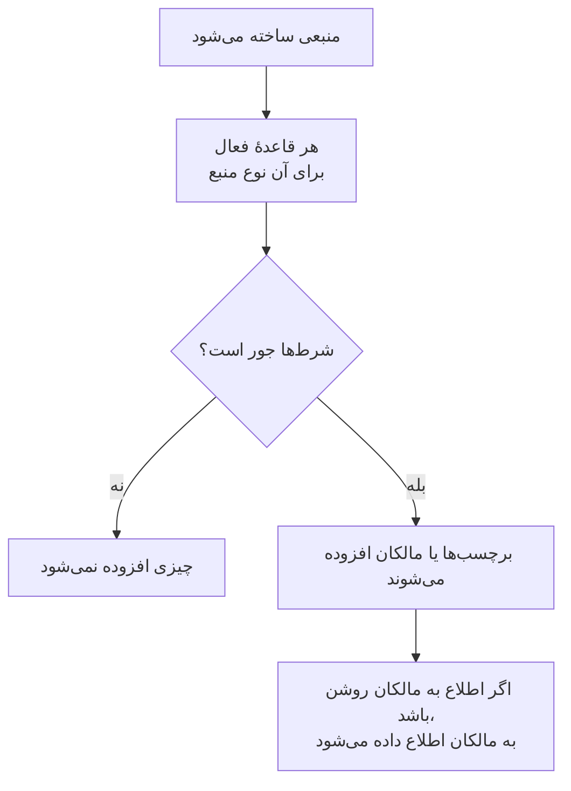

# قواعد برچسب و مالکیت

قواعد برچسب و قواعد مالکیت منابع شما را برایتان مرتب می‌کنند. یک **قاعدهٔ برچسب** به هر منبع تازه‌ای که با آن جور باشد برچسب می‌زند، و یک **قاعدهٔ مالکیت** کاربران و تیم‌ها را به‌عنوان مالک به آن می‌افزاید. به این ترتیب یک حادثهٔ تازهٔ پایگاه داده برچسب _Database_ می‌گیرد و مالکش تیم پایگاه داده می‌شود، بی‌آنکه کسی لازم باشد آن را به یاد بسپارد.

:::cards
- [ساختن یک قاعده](#ساختن-یک-قاعده): دو گام: قاعده با چه چیزی جور می‌شود، سپس چه چیزی می‌افزاید.
- [به ارث بردن برچسب‌ها و مالکان](#به-ارث-بردن-برچسبها-و-مالکان): آنچه مانیتورها، میزبان‌ها و سرویس‌های یک رویداد دارند را منتقل کنید.
- [قواعد کی اجرا می‌شوند](#قواعد-کی-اجرا-میشوند): روی منابع تازه، و **Run Now** برای منابعی که از پیش دارید.
:::

## چگونه کار می‌کند

قواعد هنگام ساخته شدن یک منبع اجرا می‌شوند. هر قاعدهٔ فعال شرط‌هایش را روی منبع تازه بررسی می‌کند، و هر قاعده‌ای که جور باشد آنچه را می‌افزاید، می‌افزاید.

برچسب‌ها و مالکان تعیین می‌کنند که منابع را چگونه پالایش و گروه‌بندی می‌کنید، OneUptime دربارهٔ آن‌ها به چه کسی اطلاع می‌دهد، و [دسترسی‌های محدود به برچسب و محدود به مالکیت](/docs/permissions/index) به کدام منابع می‌رسند. قواعد آن‌ها را یکدست نگه می‌دارند، بی‌آنکه کسی لازم باشد آن را به یاد بسپارد.

## قواعد را کجا پیدا کنید

هر محصولی که برچسب و مالک دارد، هر دو قاعده را زیر **تنظیمات** خود دارد (در حوادث، هشدارها و تعمیر و نگهداری زمان‌بندی‌شده، زیر **قواعد**): مانیتورها، حوادث و اپیزودهای حادثه، هشدارها و اپیزودهای هشدار، رویدادهای تعمیر و نگهداری زمان‌بندی‌شده، صفحات وضعیت، سرویس‌ها، میزبان‌ها، خوشه‌های Kubernetes، میزبان‌های Docker، خوشه‌های Docker Swarm، میزبان‌های Podman، خوشه‌های Proxmox، VMware vCenterها، خوشه‌های Ceph، آرایه‌های ذخیره‌سازی، پایگاه‌های داده، صف‌ها، ناوگان‌های IoT، توابع بدون سرور، منابع ابری، برنامه‌های RUM، داشبوردها، سیاست‌های آنکال، زمان‌بندی‌های آنکال، سیاست‌های تماس ورودی، گردش‌های کاری، رانبوک‌ها، دستگاه‌های شبکه و SLOها.

برای نمونه، قواعد برچسب مانیتور در **مانیتورها** > **تنظیمات** > **قواعد برچسب** هستند، و قواعد برچسب حادثه در **حوادث** > **قواعد** > **قواعد برچسب**. **تنظیمات** و **قواعد** در منوی کناری در آغاز بسته‌اند: برای باز کردن، روی عنوان بخش کلیک کنید. صفحه‌های حوادث و هشدارها یک زبانهٔ **Incident Rules** (یا **Alert Rules**) و یک زبانهٔ **Episode Rules** دارند.

## ساختن یک قاعده

هر قاعدهٔ برچسب و مالکیت به یک شیوه و در دو گام ساخته می‌شود.

:::steps
### فهرست قواعد را باز کنید

صفحهٔ **قواعد برچسب** یا **قواعد مالکیت** محصول را باز کنید و روی دکمهٔ ساختن آن کلیک کنید که به نام قاعده است، برای نمونه **ساخت Monitor Label Rule**.

### انتخاب کنید قاعده با چه چیزی جور شود

در گام **تطبیق**، برای هر شرطی که منبع باید داشته باشد، روی **افزودن شرط** کلیک کنید. با دو شرط یا بیشتر، **تطبیق با همه** یا **تطبیق با هر یک** را انتخاب کنید. قاعده‌ای بدون شرط با هر منبع تازه‌ای جور می‌شود.

### انتخاب کنید قاعده چه چیزی بیفزاید

در گام **برچسب‌ها**، **برچسب‌هایی که باید افزوده شوند** را برگزینید. در قاعدهٔ مالکیت، این گام **مالکان** است: **افزودن مالک** یک فهرست از افراد و تیم‌ها باز می‌کند.

**نام** از روی انتخاب‌های شما پر می‌شود (*افزودن Production*، *افزودن Platform به‌عنوان مالک*) و تا وقتی نامی از خودتان ننویسید، همراه انتخاب‌هایتان تغییر می‌کند. قاعده‌ای که فقط به ارث می‌برد، به‌جای آن به نام چیزی نامیده می‌شود که از آن به ارث می‌برد (پایین‌تر را ببینید).

### فیلدهای بسته را بررسی کنید

**فیلدهای بیشتر** شامل **توضیحات** اختیاری است و، در قاعدهٔ مالکیت، **اطلاع به مالکان** که به‌طور پیش‌فرض روشن است: مالکانی که یک قاعده می‌افزاید همان اعلان «شما به‌عنوان مالک افزوده شدید» را می‌گیرند که مالکی که دستی افزوده شده می‌گیرد. برای افزودن بی‌صدای مالکان، آن را خاموش کنید.

### قاعده را ذخیره کنید

در گام آخر، دوباره روی دکمه‌ای که به نام قاعده است کلیک کنید، مانند **ساخت Monitor Label Rule**. قاعده فعال آغاز می‌شود و فهرست آن را با نشان سبز **فعال** نشان می‌دهد.
:::

قاعدهٔ تازه باید چیزی بیفزاید: دست‌کم یک برچسب (یا مالک) یا، در قاعدهٔ حادثه، هشدار یا تعمیر و نگهداری زمان‌بندی‌شده، چیزی که به ارث می‌برد (پایین‌تر را ببینید). برای متوقف کردن یک قاعده بدون حذف آن، **فعال** را در فرم ویرایش آن خاموش کنید؛ آنگاه فهرست نشان قرمز **غیرفعال** را نشان می‌دهد.

### قاعده هر طور ساخته شود

همین برای قاعده‌ای که از راه API، Terraform، یک گردش کاری یا [وارد کردن قواعد برچسب](/docs/configuration/label-rule-import-export) ساخته شود نیز صدق می‌کند: OneUptime قاعدهٔ تازه‌ای را که چیزی نمی‌افزاید رد می‌کند، با پیامی که فیلدهایی را که باید پر شوند نام می‌برد. این پیام‌ها در همهٔ زبان‌ها به انگلیسی نمایش داده می‌شوند.

| قاعده | پیام |
| --- | --- |
| قاعدهٔ برچسب | This label rule adds nothing. Choose at least one label in Labels to Add. |
| قاعدهٔ برچسب حادثه، هشدار یا تعمیر و نگهداری زمان‌بندی‌شده | This label rule adds nothing. Choose at least one label in Labels to Add, or turn on an Inherit Labels switch. |
| قاعدهٔ مالکیت | This owner rule adds nothing. Choose at least one user or team in Owner Users or Owner Teams. |
| قاعدهٔ مالکیت حادثه، هشدار یا تعمیر و نگهداری زمان‌بندی‌شده | This owner rule adds nothing. Choose at least one user or team in Owner Users or Owner Teams, or turn on an Inherit Owners switch. |

- **API**: `labelsToAdd` (یا `ownerUsers` / `ownerTeams`) را روی دست‌کم یک رکورد از پروژه تنظیم کنید، یا یکی از کلیدهای `inheritLabelsFrom…` (`inheritOwnersFrom…`) قاعده را روی `true`، که یک مقدار بولی JSON است.
- **Terraform**: منبع قاعدهٔ برچسب یا مالکیتی که چیزی برای افزودن ندارد، در `terraform apply` با پیام بالا شکست می‌خورد. به آن `labels_to_add` (یا `owner_users` / `owner_teams`) بدهید یا یکی از کلیدهای به ارث بردن آن را روشن کنید.

به قواعدی که از پیش دارید دست زده نمی‌شود: [ویرایش یک قاعده](#ویرایش-یک-قاعده) را ببینید.

## به ارث بردن برچسب‌ها و مالکان

قواعد حادثه، هشدار و تعمیر و نگهداری زمان‌بندی‌شده می‌توانند آنچه منابع درگیر در یک رویداد دارند را نیز منتقل کنند. زیر **برچسب‌هایی که باید افزوده شوند** (یا **مالکان**)، بخش بستهٔ **به ارث بردن برچسب‌ها** (یا **به ارث بردن مالکان**) شش کلید دارد:

- **به ارث بردن برچسب‌ها از مانیتورها**: هر برچسب مانیتورهای حادثه به خود حادثه هم زده می‌شود. یک هشدار یک مانیتور دارد، پس در قاعدهٔ هشدار این کلید **به ارث بردن برچسب‌ها از مانیتور** است (و در قاعدهٔ مالکیت هشدار، **به ارث بردن مالکان از مانیتور**).
- **به ارث بردن برچسب‌ها از میزبان‌ها**، **به ارث بردن برچسب‌ها از خوشه‌های Kubernetes**، **به ارث بردن برچسب‌ها از میزبان‌های Docker**، **Inherit Labels From Podman Hosts** و **به ارث بردن برچسب‌ها از سرویس‌ها** همین کار را برای آن منابع انجام می‌دهند.

قواعد مالکیت همین شش کلید را برای مالکان دارند (**به ارث بردن مالکان از مانیتورها** و مانند آن). تا وقتی هیچ کلیدی روشن نیست، بخش بسته می‌گوید برای چیست؛ در قاعده‌ای که به ارث می‌برد، خودش باز می‌شود. قواعد اپیزود کلید به ارث بردن ندارند.

قاعده‌ای که به ارث می‌برد می‌تواند **برچسب‌هایی که باید افزوده شوند** (یا **مالکان**) را خالی بگذارد: آنچه را به ارث می‌برد می‌افزاید. چنین قاعده‌ای به نام چیزی نامیده می‌شود که از آن به ارث می‌برد:

| کلیدهای روشن | نام |
| --- | --- |
| **به ارث بردن برچسب‌ها از مانیتورها** | *به ارث بردن برچسب‌ها از مانیتورها* |
| **به ارث بردن برچسب‌ها از مانیتورها** و **به ارث بردن برچسب‌ها از میزبان‌ها** | *به ارث بردن برچسب‌ها از مانیتورها, میزبان‌ها* |
| **به ارث بردن برچسب‌ها از مانیتور**، در قاعدهٔ هشدار | *به ارث بردن برچسب‌ها از مانیتور* |

نام همراه کلیدها تغییر می‌کند تا وقتی برچسبی برگزینید (آنگاه قاعده به نام برچسب‌هایش نامیده می‌شود) یا نامی از خودتان بنویسید.

## ویرایش یک قاعده

فرم ویرایش یک قاعده همان دو گام را دارد و کلید **فعال** را می‌افزاید. این فرم بر آنچه قاعده می‌افزاید پافشاری نمی‌کند: قاعده‌ای که پیش از آنکه OneUptime این را بخواهد ذخیره شده، از راه API، Terraform، وارد کردن یا فرم قدیمی، ممکن است هیچ چیزی نیفزاید، و یک ویرایش هم ممکن است هر آنچه قاعده می‌افزاید را بردارد.

چنین قاعده‌ای همچنان می‌تواند تغییر نام یابد، خاموش یا حذف شود، از راه API و Terraform نیز. فهرست کنار وضعیت قاعده‌ای که چیزی نمی‌افزاید **چیزی نمی‌افزاید** را نشان می‌دهد، و صفحهٔ خود قاعده نیز. آن را ویرایش کنید تا انتخاب کنید چه بیفزاید، یا حذفش کنید.

## قواعد کی اجرا می‌شوند

هر قاعدهٔ فعال هنگام ساخته شدن یک منبع اجرا می‌شود، چه از داشبورد و چه از راه API، و هر قاعده‌ای که جور باشد آنچه را می‌افزاید، می‌افزاید:

- چند قاعدهٔ جور همهٔ برچسب‌ها و مالکان خود را می‌افزایند.
- یک قاعده هرگز چیزی را برنمی‌دارد: نه برچسب‌ها یا مالکانی که کسی دستی افزوده، و نه آن‌هایی که خودش افزوده است.
- قاعدهٔ غیرفعال کاری نمی‌کند.

قاعده‌ای که امروز می‌نویسید روی منابعی اعمال می‌شود که پس از آن ساخته می‌شوند. برای اعمال آن روی منابعی که از پیش دارید، از **Run Now** استفاده کنید: [اجرای قواعد روی منابع موجود](/docs/configuration/run-rules-now) را ببینید. قواعد برچسب را می‌توان میان پروژه‌ها نیز کپی کرد: [وارد کردن و صادر کردن قواعد برچسب](/docs/configuration/label-rule-import-export) را ببینید.

## گام‌های بعدی

:::cards
- [اجرای قواعد روی منابع موجود](/docs/configuration/run-rules-now): یک قاعده را روی منابعی که از پیش دارید اعمال کنید.
- [وارد کردن و صادر کردن قواعد برچسب](/docs/configuration/label-rule-import-export): قواعد برچسب را به‌صورت JSON میان پروژه‌ها کپی کنید.
- [تنظیمات و خودکارسازی حادثه](/docs/incidents/settings): قواعد دیگری که یک حادثه می‌تواند اجرا کند.
- [قواعد برچسب و مالکیت SLO](/docs/slo/label-and-owner-rules): قواعد SLO با چه چیزی جور می‌شوند.
:::
