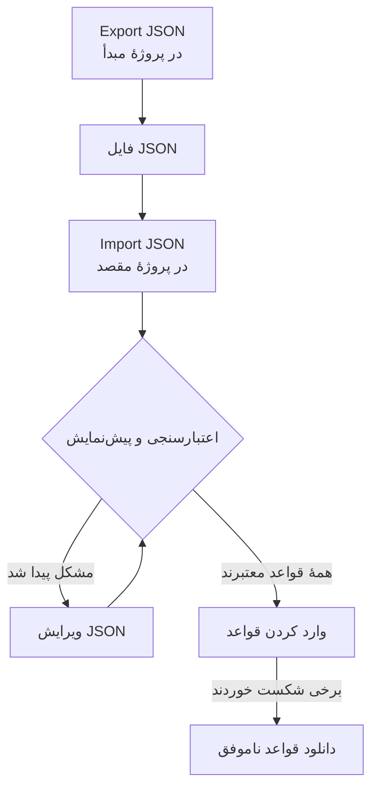

# وارد کردن و صادر کردن قواعد برچسب

قواعد برچسب را به‌صورت یک فایل JSON میان پروژه‌ها کپی کنید، یا چندین قاعده را یک‌جا بسازید. هر صفحهٔ **قواعد برچسب**، از جمله حوادث، هشدارها، مانیتورها و دستگاه‌های شبکه، در منوی **گزینه‌های بیشتر** (**⋯**) خود کنش‌های **Export JSON** و **Import JSON** را دارد. تنها استثنا VMware است: قواعد برچسب vCenter آن هیچ‌کدام از این دو را ندارند.



## صادر کردن قواعد

**گزینه‌های بیشتر** را باز کنید و **Export JSON** را برگزینید تا همهٔ قواعد آن نوع در پروژهٔ کنونی دانلود شوند. خروجی شامل قواعد صفحه‌های دیگر جدول نیز می‌شود و پالایه‌های جدول را نادیده می‌گیرد.

فایل وضعیت فعال بودن، شرط‌ها، برچسب‌هایی که باید افزوده شوند و گزینه‌های به ارث بردن برچسب هر قاعده را نگه می‌دارد. شناسه‌های پروژه، شناسه‌های قاعده و فیلدهای ممیزی کنار گذاشته می‌شوند.

برچسب‌ها، مانیتورها و شدت‌های پیوندشده با نام دقیقشان نوشته می‌شوند. وارد کردن آن‌ها را نمی‌سازد: باید از پیش در پروژهٔ مقصد وجود داشته باشند.

## وارد کردن قواعد

:::steps
### Import JSON را باز کنید

صفحهٔ **قواعد برچسب** پروژهٔ مقصد را باز کنید و **گزینه‌های بیشتر** > **Import JSON** را برگزینید.

### فایل را بیفزایید

یک فایل خروجی JSON را بارگذاری کنید، یا محتوای آن را جای‌گذاری کنید.

### اعتبارسنجی و پیش‌نمایش

**Validate and preview** را برگزینید. پیش از آنکه هیچ قاعده‌ای ساخته شود، همهٔ قواعد بررسی می‌شوند، و منابعی که به آن‌ها ارجاع داده شده باید با نام‌های یکتا و جور در پروژهٔ مقصد وجود داشته باشند.

### پیش‌نمایش را بازبینی کنید

نام قواعد، وضعیت فعال بودن، برچسب‌ها و شرط‌ها را بررسی کنید. یک دستهٔ بزرگ صفحه به صفحه نشان داده می‌شود. برای اصلاح چیزی، **Edit JSON** را برگزینید و دوباره اعتبارسنجی کنید.

### وارد کنید

دکمهٔ وارد کردن را که تعداد قواعد را می‌شمارد (برای نمونه **Import ۲ rules**) برگزینید و تا نمایش نتیجه‌ها پنجره را باز نگه دارید.
:::

وارد کردن قواعد تازه می‌افزاید و قواعد موجود را نگه می‌دارد، پس وارد کردن دوبارهٔ همان فایل یک نسخهٔ دیگر می‌سازد. دسترسی‌های معمول ساختن و اعتبارسنجی سرور روی هر قاعده اعمال می‌شوند.

اگر برخی قواعد شکست بخورند، **Download failed rules** را برگزینید تا فقط همان ردیف‌ها ذخیره شوند، آن‌ها را اصلاح کنید و آن فایل را دوباره وارد کنید. اگر زمان یک درخواست به پایان رسید، پیش از تلاش دوباره فهرست قواعد را بررسی کنید: شاید سرور قاعده را پیش از گم شدن پاسخ ذخیره کرده باشد.

## ساختن یک دسته با JSON

یک قاعدهٔ موجود را صادر کنید تا نمونه‌ای برای نوع منبع خود داشته باشید، سپس ورودی‌های آرایهٔ `items` را ویرایش کنید یا بیفزایید. این نمونه دو قاعدهٔ برچسب مانیتور می‌سازد. برچسب‌های `Production` و `Infrastructure` باید از پیش در پروژهٔ مقصد وجود داشته باشند.

```json title="monitor-label-rules.json"
{
  "fileType": "oneuptime-label-rules",
  "schemaVersion": 1,
  "resourceType": "MonitorLabelRule",
  "items": [
    {
      "name": "Production API monitors",
      "description": "Label production API monitors automatically",
      "isEnabled": true,
      "monitorNamePattern": "^api-prod-",
      "monitorLabels": [],
      "labelsToAdd": ["Production"]
    },
    {
      "name": "Database monitors",
      "isEnabled": false,
      "monitorNamePattern": "^database-",
      "labelsToAdd": ["Infrastructure"]
    }
  ]
}
```

| فیلد | چه چیزی در آن است |
| --- | --- |
| `fileType` | همیشه `oneuptime-label-rules`. |
| `schemaVersion` | همیشه `1`. |
| `resourceType` | نوع قاعده‌ای که فایل در خود دارد، مانند `MonitorLabelRule`. |
| `items` | قواعد، برای هر کدام یک شیء. فایل دست‌کم به یک قاعده نیاز دارد. |

برای `isEnabled` از مقدار بولی JSON، برای الگوها از متن، و برای منابع پیوندشده از آرایه‌ای از نام‌ها استفاده کنید.

این موارد کل دسته را پیش از گام وارد کردن متوقف می‌کنند: الگوهای نامعتبر، فیلدهای ناشناخته، نام‌های جاافتاده و ارجاع‌های مبهم. قاعده‌ای که چیزی نمی‌افزاید هم همین‌طور است، یعنی `labelsToAdd` خالی و، در قاعدهٔ حادثه، هشدار یا تعمیر و نگهداری زمان‌بندی‌شده، هیچ کلید `inheritLabelsFrom…` که روی `true` باشد، چون OneUptime از ساختن چنین قاعده‌ای خودداری می‌کند ([قواعد برچسب و مالکیت](/docs/configuration/label-and-owner-rules#قاعده-هر-طور-ساخته-شود) را ببینید). اگر چنین قاعده‌ای پیش از این بررسی ذخیره شده باشد، ممکن است در خروجی باشد؛ پیش از وارد کردن به آن برچسبی بدهید یا آن را از فایل بردارید.

> [!NOTE]
> فایل‌ها و JSON جای‌گذاری‌شده به ۱۰ MB محدودند.

## کپی میان انواع منبع

`resourceType` اصلی را در فایل نگه دارید و **Import JSON** را در صفحهٔ مقصد باز کنید. الگوهای سازگار نام اصلی یا عنوان، الگوهای توضیحات و برچسب‌های پیش‌نیاز به فیلدهای مقصد نگاشت می‌شوند، و پیش‌نمایش این نگاشت‌ها را فهرست می‌کند تا بتوانید بازبینی‌شان کنید. ارجاع‌های شدت حادثه و هشدار با نام‌های شدت مقصد سنجیده می‌شوند.

شرط‌ها یا کنش‌هایی که مقصد پشتیبانی نمی‌کند جلوی وارد کردن را می‌گیرند. برای نمونه، یک قاعدهٔ حادثه که به مانیتورهای مشخصی محدود شده، بدون ویرایش آن شرط‌ها نمی‌تواند به قواعد دستگاه شبکه کپی شود.

> [!WARNING]
> قواعد برچسب دستگاه شبکه و SLO افزون بر عبارت‌های منظم، از تطبیق با نویسهٔ عام نیز پشتیبانی می‌کنند. در جابه‌جایی میان این قواعد و انواع دیگر قاعده، الگوهایی که `*` یا فاصلهٔ آغاز و پایان دارند رد می‌شوند، چون آنجا به شکل دیگری جور می‌شوند. آن الگوها را برای مقصد ویرایش کنید، یا قاعده را در همان نوع منبع نگه دارید. قواعد برچسب دستگاه شبکه و SLO می‌توانند هر الگویی را با هم مبادله کنند، چون به یک شکل جور می‌شوند.

## گام‌های بعدی

:::cards
- [قواعد برچسب و مالکیت](/docs/configuration/label-and-owner-rules): یک قاعدهٔ برچسب با چه چیزی جور می‌شود و چه می‌افزاید.
- [اجرای قواعد روی منابع موجود](/docs/configuration/run-rules-now): قواعد واردشده را روی منابعی که از پیش دارید اعمال کنید.
:::
