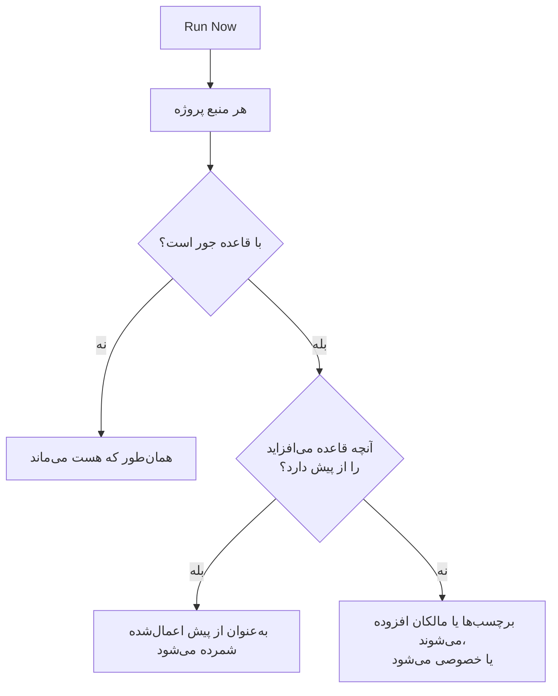

# اجرای قواعد روی منابع موجود

قواعد برچسب، قواعد مالکیت و قواعد حریم خصوصی هنگام **ساخته شدن** یک منبع خودکار اجرا می‌شوند. پس قاعده‌ای که امروز می‌نویسید روی مانیتورها، حوادث یا میزبان‌هایی که از پیش دارید کاری نمی‌کند. **Run Now** این شکاف را پر می‌کند: یک قاعده را روی هر منبعی که از پیش در پروژه هست اعمال می‌کند.

## کدام قواعد را می‌توان اجرا کرد

- **قواعد برچسب** و **قواعد مالکیت**، برای هر منبعی که آن‌ها را دارد: مانیتورها، حوادث، اپیزودهای حادثه، هشدارها، اپیزودهای هشدار، رویدادهای تعمیر و نگهداری زمان‌بندی‌شده، صفحات وضعیت، سرویس‌ها، میزبان‌ها، خوشه‌های Kubernetes، میزبان‌های Docker، خوشه‌های Docker Swarm، میزبان‌های Podman، خوشه‌های Proxmox، VMware vCenterها، خوشه‌های Ceph، آرایه‌های ذخیره‌سازی، پایگاه‌های داده، صف‌ها، ناوگان‌های IoT، توابع بدون سرور، منابع ابری، برنامه‌های RUM، داشبوردها، سیاست‌های آنکال، زمان‌بندی‌های آنکال، سیاست‌های تماس ورودی، گردش‌های کاری، رانبوک‌ها، دستگاه‌های شبکه و SLOها.
- **قواعد حریم خصوصی**، برای حوادث، هشدارها، اپیزودهای حادثه و اپیزودهای هشدار.
- **Monitor Rules** روی یک صفحهٔ وضعیت. این‌ها از پیش هر بار که قاعده‌ای ذخیره شود صفحه را دوباره همگام می‌کنند؛ اجرای یکی از آن‌ها صفحه را همان دم دوباره همگام می‌کند.
- **Monitor Rules** روی یک SLO. این‌ها از پیش هر بار که قاعده‌ای ذخیره شود SLO را دوباره همگام می‌کنند؛ اجرای یکی از آن‌ها مانیتورهای SLO را همان دم دوباره همگام می‌کند. [مانیتورها و قواعد مانیتور](/docs/slo/monitor-rules) را ببینید.

قواعدی که به‌جای توصیف یک منبع کاری انجام می‌دهند، یعنی **قواعد آنکال**، **قواعد رانبوک**، **قواعد رفع خودکار مشکل** و **قواعد گروه‌بندی**، روی رکوردهای موجود اجرا نمی‌شوند. اجرای آن‌ها برای حوادثی که دیگر تمام شده‌اند افراد را فرامی‌خواند، رانبوک اجرا می‌کرد، رفع مشکل آغاز می‌کرد یا اپیزودها را از نو سامان می‌داد.

## پیش از شروع

برای اجرای یک قاعده به دسترسی ویرایش قاعده **و** دسترسی ویرایش منابعی که تغییر می‌دهد نیاز دارید؛ برای نمونه، یک قاعدهٔ برچسب مانیتور هم به دسترسی ویرایش قاعدهٔ برچسب مانیتور نیاز دارد و هم به دسترسی ویرایش مانیتور. قواعد مالکیت به دسترسی افزودن مالک نیز نیاز دارند. قواعد مانیتور روی یک صفحهٔ وضعیت یا یک SLO فقط به دسترسی ویرایش قاعده نیاز دارند.

> [!IMPORTANT]
> دسترسی محدود به برچسب‌های مشخص، یا به منابعی که مالکشان هستید، کافی نیست: یک اجرا می‌تواند هر منبع پروژه را تغییر دهد. فهرست‌های مسدودسازی تیم همان‌طور اعمال می‌شوند که در هر جای دیگر، و مسدودسازی محدود به برخی برچسب‌ها هم به حساب می‌آید: اجرا منابع دارای آن برچسب‌ها را تغییر می‌داد، پس مسدودسازی برچسب‌دار روی ویرایش منابعی که قاعده تغییر می‌دهد اجرا را رد می‌کند.

قواعد یک شبکه هم وقتی آن‌ها را روی دستگاه‌هایی که از پیش دارید اجرا می‌کنید همین را می‌خواهند. **Run Now** یک قاعدهٔ واگذاری سایت یا قاعدهٔ برچسب دستگاه به دسترسی ویرایش قاعده و **Edit Network Device** نیاز دارد. **Dry Run** و **Run Rule** یک قاعدهٔ ورود خودکار به دسترسی ویرایش قاعده، **Create Network Device** و، وقتی قاعده یک قالب مانیتور دارد، **Create Monitor** نیاز دارند. هر کدام باید به کل پروژه برسد. [ورود خودکار با Auto Import Rules](/docs/monitor/network-device-monitor#ورود-خودکار-با-auto-import-rules) را ببینید.

## اجرای یک قاعده

:::steps
### فهرست قواعد را باز کنید

صفحهٔ قواعد را باز کنید، برای نمونه **مانیتورها** > **تنظیمات** > **قواعد برچسب**.

### Run Now را برگزینید

منوی **⋯** را در انتهای ردیف قاعده باز کنید و **Run Now** را برگزینید، یا **مشاهده** و سپس **Run Now** را در صفحهٔ خود قاعده برگزینید. یک گفتگو می‌گوید اجرا چه خواهد کرد.

### انتخاب کنید که به مالکان تازه اطلاع داده شود یا نه

برای یک قاعدهٔ مالکیت، انتخاب کنید که **Notify the owners this run adds** روشن باشد یا نه. به‌طور پیش‌فرض خاموش است، و فقط وقتی اثر دارد که خود قاعده **اطلاع به مالکان** را روشن داشته باشد. به یک مالک برای هر منبعی که به آن افزوده می‌شود یک بار اطلاع داده می‌شود.

### قاعده را اجرا کنید

**Run Rule** را برگزینید و گفتگو را باز نگه دارید. در یک پروژهٔ بزرگ، گفتگو نشان می‌دهد اجرا تا کجا پیش رفته است.

### گزارش را بخوانید

وقتی اجرا تمام شد، گفتگو گزارش می‌دهد قاعده با چند منبع جور شد، چند منبع را تغییر داد، و چند منبع از پیش آنچه قاعده می‌افزاید را داشتند.
:::

## اجرای چند قاعده

قواعد را در جدول برگزینید، منوی کنش‌های گروهی را باز کنید و **Run Now** را انتخاب کنید. قواعد برگزیده یکی پس از دیگری اجرا می‌شوند.

- به مالکانی که با یک اجرای گروهی افزوده می‌شوند هرگز اطلاع داده نمی‌شود. برای اطلاع دادن به آن‌ها، به‌جای آن یک قاعدهٔ تکی را اجرا کنید.
- قاعده‌ای که نمی‌تواند اجرا شود، برای نمونه چون غیرفعال است، همراه با دلیل فهرست می‌شود، و قواعد دیگر همچنان اجرا می‌شوند.

## یک اجرا چه می‌کند

- **فقط می‌افزاید.** برچسب‌ها زده می‌شوند، مالکان افزوده می‌شوند، منابع خصوصی می‌شوند. چیزی برداشته نمی‌شود و چیزی عمومی نمی‌شود، پس اجرای دوبارهٔ یک قاعده بی‌خطر است: اجرای دوم گزارش می‌دهد که همه چیز از پیش اعمال شده بود.
- **هر منبع پروژه ارزیابی می‌شود**، از جمله حوادث و هشدارهای حل‌شده.
- **مالکان موجود نادیده گرفته می‌شوند** و هرگز دو بار افزوده نمی‌شوند.
- **فقط برچسب‌های خود پروژهٔ شما افزوده می‌شوند.** برچسبی که قاعده نام می‌برد و دیگر یکی از برچسب‌های پروژهٔ شما نیست نادیده گرفته می‌شود، و برچسب‌های دیگر قاعده همچنان افزوده می‌شوند. وقتی قاعده‌ای روی یک منبع تازه اجرا می‌شود هم همین برقرار است.
- **قاعده به همان شیوهٔ هنگام ساخته شدن اعمال می‌شود**، از جمله برچسب‌ها و مالکانی که از مانیتورها، میزبان‌ها و سرویس‌های یک حادثه به ارث می‌رسند. جایی که منبع فید فعالیت دارد، فید ثبت می‌کند کدام قاعده آن را تغییر داد.
- **قواعد غیرفعال اجرا نمی‌شوند.** نخست قاعده را فعال کنید.
- **قواعد مانیتور صفحهٔ وضعیت** مانیتورهایی را که با آن‌ها جورند می‌افزایند و مانیتورهایی را که پیش‌تر افزوده‌اند و دیگر جور نیستند برمی‌دارند. به مانیتورهایی که دستی به صفحه افزوده شده‌اند هرگز دست زده نمی‌شود.
- **یک اجرا حداکثر ۱۰۰٬۰۰۰ منبع را پوشش می‌دهد.** در پروژه‌ای بزرگ‌تر اجرا متوقف می‌شود و این را می‌گوید؛ برای ادامه، قاعده را دوباره اجرا کنید.

## گام‌های بعدی

:::cards
- [قواعد برچسب و مالکیت](/docs/configuration/label-and-owner-rules): قواعدی را که یک اجرا اعمال می‌کند بنویسید.
- [وارد کردن و صادر کردن قواعد برچسب](/docs/configuration/label-rule-import-export): نخست قواعد برچسب را از پروژه‌ای دیگر بیاورید.
- [تنظیمات و خودکارسازی حادثه](/docs/incidents/settings): قواعد حادثه، از جمله قواعد حریم خصوصی.
:::
