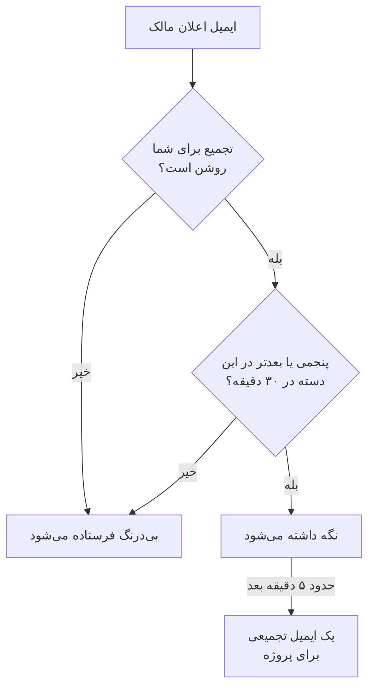

# تجمیع اعلان‌ها

وقتی چیزی به‌شدت خراب می‌شود، به‌ندرت فقط یک بار خراب می‌شود. یک پیوند بالادستی ناپایدار چهل مانیتور را از کار می‌اندازد، چهل حادثه اعلام، تأیید و برطرف می‌شود، و هر مالک برای هر گام یک ایمیل می‌گیرد: دویست پیام در یک صندوق ورودی، و دیگر کسی آن‌ها را نمی‌خواند.

این رگبارها را OneUptime خودکار در یک ایمیل جمع می‌کند. این قابلیت برای همه روشن است و چیزی برای پیکربندی ندارد — اما اگر ترجیح می‌دهید هر اعلان ایمیل جداگانهٔ خودش باشد، می‌توانید پروژه به پروژه [تجمیع را برای خودتان خاموش کنید](#خاموش-کردن-تجمیع-برای-خودتان).

:::cards
- [چگونه کار می‌کند](#چگونه-کار-میکند): چهار ایمیل بی‌درنگ می‌روند؛ بقیه با هم می‌رسند.
- [آنچه هرگز تجمیع نمی‌شود](#آنچه-هرگز-تجمیع-نمیشود): فراخوان آنکال، ایمیل‌های امنیتی، صورت‌حساب و مشترکان.
- [خاموش کردن تجمیع](#خاموش-کردن-تجمیع-برای-خودتان): دوباره هر اعلان را در ایمیل جداگانهٔ خودش بگیرید.
- [ایمیل‌های روتین کمتر](#کم-کردن-بیشتر): ایمیل‌های اطلاع‌رسانی را یک‌جا خاموش کنید.
:::

## چگونه کار می‌کند

هر ایمیل اعلان مالک که می‌گیرید در برابر بودجه‌ای کوچک شمرده می‌شود که به ازای هر پروژه، هر گیرنده، هر نشانی ایمیل و هر **دستهٔ** منبع نگه داشته می‌شود — حادثه‌ها، هشدارها، مانیتورها، نگهداری زمان‌بندی‌شده، صفحه‌های وضعیت، پروب‌ها، SLOها و مانند آن.



- **چهار ایمیل نخست** هر دسته در هر بازهٔ سی‌دقیقه‌ای بی‌درنگ فرستاده می‌شوند، درست همان‌طور که همیشه بوده. همان موضوع، همان قالب، همان پیوندها.
- **پنجمی و هر ایمیل بعدی** در آن بازه نگه داشته می‌شود.
- حدود پنج دقیقه بعد، هر آنچه برای شما در آن پروژه نگه داشته شده — در همهٔ دسته‌ها — به‌صورت **یک** ایمیل می‌رسد که آنچه رخ داده را فهرست می‌کند، با پیوندی به هر منبع.

تجمیع اعلان‌هایی را در بر می‌گیرد که هنگام فرستاده شدنش هنوز مشترکشان هستید. اگر ایمیل رویدادی را در حالی که اعلان‌هایش در صف‌اند خاموش کنید، آن اعلان‌ها از تجمیع کنار گذاشته می‌شوند. روشن کردن دوبارهٔ ایمیل در آینده، آن به‌روزرسانی‌های ردشده را دوباره نمی‌فرستد.

زیر آستانه، این قابلیت هیچ کاری نمی‌کند. پروژه‌ای که روزی سه ایمیل مالک تولید می‌کند همچنان همان سه ایمیل را جداگانه می‌فرستد.

## ایمیل تجمیعی چه شکلی است

خط موضوع پیش از باز کردن ایمیل، اندازه *و نوع* طوفان را به شما می‌گوید:

```text
[Acme Production] 112 notifications: 63 Monitors, 41 Incidents, 6 Alerts +2 more
```

درون ایمیل، کارت خلاصه مجموع، بازهٔ زمانی‌ای که تجمیع پوشش می‌دهد و تفکیک بر پایهٔ دسته را نشان می‌دهد. زیر آن، اعلان‌ها در یک بخش برای هر دسته گروه‌بندی می‌شوند، فوری‌ترین نخست — حادثه‌ها، سپس هشدارها، سپس مانیتورها و پروب‌هایی که متوجه آن‌ها شدند — تا نخستین چیز زیر خلاصه، نخستین چیزی باشد که ارزش کلیک دارد.

هر بخش به جای یک ردیف برای هر رویداد، یک ردیف برای هر منبع دارد:

- **ردیف‌ها نشان می‌دهند هر منبع به کجا رسیده است.** اگر حادثه‌ای ساخته، سپس تأیید و سپس برطرف شده باشد، آن یک ردیف در تازه‌ترین وضعیتش است، و همین تجمیع را از سه ایمیل جداگانه *به‌روزتر* می‌کند.
- **شمارش‌ها جور درمی‌آیند.** هر ردیف زمان آخرین به‌روزرسانی‌اش را دارد، و ردیفی که چند به‌روزرسانی را در خود گرفته می‌گوید چندتا، پس بخش‌ها و کارت خلاصه همیشه به یک مجموع می‌رسند.
- **شدت و وضعیت نشان داده می‌شوند.** کارت‌های هشدار و حادثه شدت و وضعیت آخرین اعلانشان را نشان می‌دهند، از جمله نام‌های سفارشی. اعلان‌های قدیمی‌تر صف که این جزئیات را ندارند همچنان نمایش داده می‌شوند و فقط برچسب‌های ناموجود حذف می‌شوند.

زمان‌ها به وقت UTC نشان داده می‌شوند و هرگاه تجمیع بیش از یک روز را بپوشاند، تاریخ هم آورده می‌شود.


## آنچه هرگز تجمیع نمی‌شود

تجمیع فقط به اعلان‌های مالک و عضو دست می‌زند — خانوادهٔ «چیزی که مسئولش هستید تغییر کرده است». به چیز دیگری نمی‌تواند برسد، چون درون همان یک مسیر کدی قرار دارد که این اعلان‌ها از آن می‌گذرند، و هیچ اعلان دیگری از آن نمی‌گذرد.

هرگز به تأخیر نمی‌افتند و هرگز شمرده نمی‌شوند:

| دسته | نمونه‌ها |
| ----------------------------------------- | ---------------------------------------------------------------------------------------------------- |
| فراخوان آنکال | هر فراخوان سیاست تشدید و هر درخواست تأیید |
| زمان‌بندی آنکال | «اکنون آنکال هستید»، «نفر بعدی آنکال شما هستید»، «شیفت شما به‌زودی شروع می‌شود»، «شیفت شما دوباره واگذار شد» |
| امنیت حساب | بازنشانی گذرواژه، تأیید ایمیل، تغییر گذرواژه، استفاده یا بازتولید کد پشتیبان دومرحله‌ای |
| اطلاعیه‌های مدیریتی دربارهٔ حساب شما | یک مدیر روش‌های اعلان یا قواعد آنکال شما را تغییر داده است |
| صورت‌حساب و موجودی | فاکتورها، اشتراک معوق، «چون کارت رد شد نتوانستیم کسی را فرا بخوانیم» |
| سلامت نمونه | هشدارهای Postgres، Valkey و ClickHouse به مدیران نمونه |
| مشترکان صفحهٔ وضعیت | هر ایمیلی که صفحهٔ وضعیت شما به مشترکان خودتان می‌فرستد |
| نقض SLA | بی‌درنگ فرستاده می‌شوند، هرچند از نوع اعلان «حادثه ساخته شد» دوباره استفاده می‌کنند |

فقط ایمیل تحت تأثیر است. پیامک، تماس تلفنی، اعلان پوش، WhatsApp، Telegram، Slack، Microsoft Teams و وب‌هوک‌ها بی‌درنگ تحویل داده می‌شوند، درست مانند گذشته — حتی برای اعلان‌هایی که ایمیلشان نگه داشته شد.

## محدودیت‌ها

| محدودیت | مقدار |
| --- | --- |
| اعلان‌ها در یک ایمیل تجمیعی | حداکثر **۵۰۰**. بیش از آن در صف می‌ماند و با تجمیع بعدی، حداکثر پنج دقیقه بعد، فرستاده می‌شود. |
| ردیف‌های نمایش‌داده‌شده در یک ایمیل تجمیعی | حداکثر **۱۰۰**. ردیف‌ها به ازای هر منبع ادغام می‌شوند، پس یعنی ۱۰۰ منبع متمایز؛ فراتر از آن، ایمیل مجموع کامل را گزارش می‌کند و شما را به پروژه پیوند می‌دهد. |
| ایمیل‌های تجمیعی به یک گیرنده از یک پروژه | حداکثر **۱۲** در ساعت. |
| تأخیر افزوده برای یک اعلان نگه‌داشته‌شده | در بدترین حالت حدود شش دقیقه. |

سقف ساعتی را پایگاه داده اعمال می‌کند، نه یک زمان‌سنج، پس حتی در طوفانی که ساعت‌ها طول بکشد هم پابرجا می‌ماند.

## خاموش کردن تجمیع برای خودتان

برخی دسته‌بندی را می‌خواهند. برخی دیگر هر اعلان را همان لحظهٔ رسیدن بایگانی می‌کنند، یا صندوق را به ابزاری می‌سپارند که این کار را می‌کند، و ایمیل تجمیعی این روند را به هم می‌زند. برای همین تجمیع را می‌توان برای هر نفر و در هر پروژه خاموش کرد.

:::steps
### باز کردن ترجیحات ایمیل

در پروژه به **تنظیمات کاربر → ترجیحات ایمیل** بروید — همان صفحه‌ای که پایین هر ایمیل تجمیعی به آن پیوند دارد.

### خاموش کردن Email Rollup

در کارت **Email Rollup** کلید را خاموش کنید. تغییر خودبه‌خود ذخیره می‌شود و سپس کارت این را نشان می‌دهد: "Off: every notification arrives as its own email, immediately."
:::

وقتی خاموش باشد، هر ایمیل اعلان مالک و عضو در آن پروژه دوباره جداگانه و بی‌درنگ برایتان فرستاده می‌شود: همان موضوع، همان قالب، همان پیوندها، بدون آستانه و بدون انتظار پنج‌دقیقه‌ای. هر آنچه هنگام خاموش کردن از پیش برایتان در صف بوده، چند دقیقه بعد به‌صورت یک تجمیع پایانی می‌رسد؛ پس از آن همه‌چیز یکی‌یکی می‌آید.

این کلید **فقط مال شماست و به یک پروژه محدود است**. خاموش کردنش آنچه همکارانتان می‌گیرند را تغییر نمی‌دهد و به پروژه‌های دیگر منتقل نمی‌شود — بنابراین پروژهٔ پرسروصدای تولید می‌تواند همچنان تجمیع کند در حالی که پروژهٔ آرام داخلی همه‌چیز را جداگانه می‌فرستد، یا برعکس. تا وقتی هر کس خودش خاموشش نکند، برای همه روشن است.

آنچه به آن دست **نمی‌زند**:

- **اینکه کدام اعلان‌ها را می‌گیرید.** این تنظیمِ به ازای هر نوع رویداد و هر کانال در **تنظیمات کاربر → تنظیمات اعلان** است، یک صفحه آن‌سوتر. تجمیع و این کلید فقط تعیین می‌کنند آن اعلان‌ها در چند ایمیل بسته‌بندی شوند.
- **فراخوان آنکال و ایمیل‌های شیفت**، **ایمیل‌های امنیت حساب**، **ایمیل‌های صورت‌حساب**، هشدارهای سلامت نمونه و ایمیل‌های مشترکان صفحهٔ وضعیت. هیچ‌کدام از این‌ها اصلاً تجمیع نمی‌شوند، پس خاموش کردن تجمیع چیزی را برایشان تغییر نمی‌دهد — [آنچه هرگز تجمیع نمی‌شود](#آنچه-هرگز-تجمیع-نمیشود) را ببینید.
- **هر کانال دیگر.** پیامک، تماس تلفنی، پوش، WhatsApp، Telegram، Slack، Microsoft Teams و وب‌هوک‌ها از پیش بی‌درنگ هستند.

## کم کردن بیشتر

تجمیع به‌روزرسانی‌های روتین را کنار هم بسته‌بندی می‌کند؛ می‌توانید دریافت بیشترشان را هم متوقف کنید.

:::steps
### باز کردن ترجیحات از یک ایمیل تجمیعی

پیوند ترجیحات را در پایین یک ایمیل تجمیعی باز کنید، یا به **تنظیمات کاربر → ترجیحات ایمیل** بروید.

### انتخاب Reduce routine emails

در کارت **Fewer routine emails** گزینهٔ **Reduce routine emails** را انتخاب کنید. وقتی تغییر ذخیره شد، کارت می‌گوید: **ایمیل‌های روتین خاموش شد.**
:::

این کار ایمیل‌های اطلاع‌رسانی زیر را در پروژهٔ کنونی برای شما خاموش می‌کند:

- یادداشت‌هایی که روی حادثه‌ها، هشدارها، اپیزودها و نگهداری زمان‌بندی‌شده گذاشته می‌شوند.
- اطلاعیه‌هایی که می‌گویند به‌عنوان مالک یک منبع افزوده شده‌اید.
- مانیتورها و صفحه‌های وضعیت تازه.
- حادثه‌ها یا هشدارهایی که به اپیزودهای موجود افزوده می‌شوند.
- افزوده شدن به یک سیاست آنکال یا برداشته شدن از آن.

انتخاب‌های کنونی شما برای ساخته شدن حادثه و هشدار، تغییر وضعیت، یادآوری‌ها، واگذاری حادثه، سلامت مانیتور و شیفت‌های آنکال سر جایشان می‌مانند، و هیچ ایمیلی که خاموش کرده بودید روشن نمی‌شود. فراخوان آنکال، کانال‌های دیگر تحویل، ایمیل‌های حساب، ایمیل‌های صورت‌حساب و ایمیل‌های مشترکان صفحهٔ وضعیت تحت تأثیر قرار نمی‌گیرند.

تغییرها با هم ذخیره می‌شوند. برای روشن کردن دوبارهٔ هر ایمیل جداگانه، کلیدهای به ازای هر رویداد را در **تنظیمات کاربر → تنظیمات اعلان** بازبینی کنید. این ترجیحات بر اعلان‌هایی که در انتظار تجمیع‌اند هم اعمال می‌شوند؛ ایمیلی که فرستاده شده را نمی‌توان پس گرفت. تجمیع ایمیل همچنان تنظیمی جداگانه است که دسته‌بندی رویدادهایی را که نگه می‌دارید کنترل می‌کند.

## عیب‌یابی

:::details یک ایمیل اعلان چند دقیقه دیرتر رسید
آن ایمیل پنجمین یا بعدتر در دسته‌اش در سی دقیقه بود، پس نگه داشته شد و حدود پنج دقیقه بعد در یک تجمیع فرستاده شد. دنبال یک ایمیل تجمیعی از همان پروژه بگردید: اعلان یک ردیف در آن است. فراخوان آنکال و کانال‌های دیگر به تأخیر نیفتادند.
:::

:::details تجمیع را خاموش کردم و باز هم یک ایمیل تجمیعی گرفتم
اعلان‌هایی که هنگام خاموش کردن از پیش برایتان در صف بودند، چند دقیقه بعد به‌صورت یک تجمیع پایانی می‌رسند. پس از آن همه‌چیز یکی‌یکی و هر کدام در یک ایمیل می‌آید.
:::

:::details به‌روزرسانی‌ای که انتظارش را داشتم در ایمیل تجمیعی نیست
هر ردیف یک منبع را در تازه‌ترین وضعیتش نشان می‌دهد، پس حادثه‌ای که ساخته، تأیید و برطرف شده یک ردیف است، همراه با شمار به‌روزرسانی‌هایی که در خود گرفته. همچنین اگر در حالی که اعلانی در صف بود، ایمیل آن رویداد را در **تنظیمات کاربر → تنظیمات اعلان** خاموش کرده باشید، آن اعلان کنار گذاشته می‌شود.
:::

## گام‌های بعدی

:::cards
- [پیکربندی SMTP](/docs/emails/smtp): ایمیل‌های OneUptime را از راه سرور ایمیل خودتان بفرستید.
- [قواعد تشدید](/docs/on-call/escalation-rules): فراخوان آنکال چگونه به افراد می‌رسد، بدون اینکه هرگز تجمیع شود.
:::
