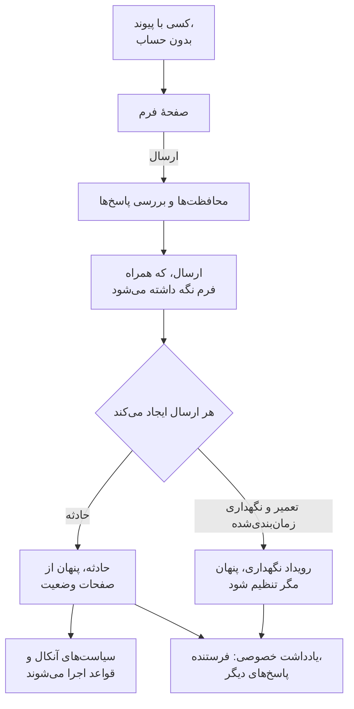

# نمای کلی فرم‌ها

فرم صفحه‌ای است که هر کسی که پیوندش را دارد می‌تواند آن را پر کند، بدون حساب OneUptime. هر ارسال چیزی در پروژهٔ شما می‌سازد: یک **حادثه** برای گزارش مشکل، یا یک **رویداد تعمیر و نگهداری زمان‌بندی‌شده** برای درخواست‌های تغییر و نگهداری. پرسش‌های فرم را در یک سازندهٔ کشیدن و رها کردن می‌سازید، تعیین می‌کنید پاسخ‌ها چگونه به رکورد تبدیل شوند، و پیوند را با کسانی که باید از آن استفاده کنند به اشتراک می‌گذارید.

وقتی از فرم استفاده کنید که کسانی که مشکلی را می‌بینند، یا به تغییری نیاز دارند، همان کسانی نیستند که حوادث و نگهداری شما را اداره می‌کنند: کارشناسان پشتیبانی، همکاران بخشی دیگر، مدیر یک فروشگاه، تیم عملیات یک مشتری. آن‌ها پیوند را باز می‌کنند، به پرسش‌های شما پاسخ می‌دهند و **ارسال** را می‌زنند. تیم شما یک حادثه یا رویداد معمولی می‌گیرد، با پاسخ‌ها در فیلدهایش و یک یادداشت خصوصی که ثبت می‌کند چه کسی آن را فرستاده است.

:::cards
- [نخستین فرم خود را بسازید](#نخستین-فرم-خود-را-بسازید): از یک فرم خالی تا پیوندی که بتوانید به اشتراک بگذارید.
- [ساختن فرم](/docs/forms/building): پرسش‌ها، انواع پاسخ، پرسش‌های پنهان، قالب‌ها و برندینگ.
- [ارسال چه چیزی ایجاد می‌کند](/docs/forms/on-submit): پاسخ‌ها و تنظیمات چگونه به یک حادثه یا رویداد نگهداری تبدیل می‌شوند.
- [اشتراک‌گذاری و امنیت](/docs/forms/sharing-and-security): پیوند، فهرست IPهای مجاز، محدودیت نرخ و عیب‌یابی.
:::

## یک فرم چگونه کار می‌کند



هر درخواست نخست از محافظت‌های فرم می‌گذرد: صفحهٔ خود فرم، محدودیت‌های نرخ، فهرست IPهای مجاز و کپچا. ارسالی که پاسخ‌هایش جور باشد نگه داشته می‌شود و یک رکورد می‌سازد که از روی پاسخ‌ها، تنظیمات **هنگام ارسال** فرم و، برای یک حادثه، قالب حادثهٔ آن پر می‌شود. هیچ چیزی که می‌سازد به صفحهٔ وضعیت نمی‌رسد تا وقتی تیم شما تصمیم بگیرد.

## در یک نگاه

- **یک محصول مستقل** — **فرم‌ها** در منوی محصولات، در `/dashboard/{projectId}/forms` است. هر فرم پیوند خودش را دارد، مانند `https://oneuptime.com/accounts/form/<share-key>` در OneUptime Cloud.
- **بدون نیاز به حساب** — هر کسی که پیوند را دارد می‌تواند فرم را باز و ارسال کند، بی‌آنکه وارد شود.
- **یک سازنده، نه یک صفحهٔ تنظیمات** — پرسش‌های خودتان را بیفزایید (پاسخ‌های کوتاه، پاراگراف‌ها، فهرست‌های کشویی، تاریخ‌ها، چک‌باکس‌ها و موارد دیگر)، فیلدهای آنچه فرم می‌سازد (عنوان، توضیحات، شدت، مانیتورها، برچسب‌ها، آغاز و پایان)، فیلدهای سفارشی شما، و نام و ایمیل فرستنده. آن‌ها را با کشیدن مرتب کنید، پیش‌نمایش فرم را ببینید، ذخیره کنید.
- **شما تعیین می‌کنید هر مقدار از کجا بیاید** — صفحهٔ **هنگام ارسال** هر فیلد حادثه یا رویداد تازه را کنار منبعش فهرست می‌کند: یک پاسخ، یک پیش‌فرض، تنظیمی که همیشه اعمال می‌شود، یا قالب حادثه.
- **پنهان تا وقتی کسی منتشرش کند** — حوادثی که از یک فرم می‌آیند هنگام اعلام هرگز روی صفحات وضعیت نشان داده نمی‌شوند یا برای مشترکان فرستاده نمی‌شوند؛ رویدادهای نگهداری هم همین‌طور، مگر آنکه فرم چیز دیگری بگوید.
- **محافظت لایه‌لایه** — کلید **پذیرش ارسال‌ها**، یک **فهرست IPهای مجاز** اختیاری، رد کردن درخواست‌های وب‌سایت‌های دیگر، محدودیت‌های نرخ، کپچای نمونه، و محدودیت اندازه برای هر پاسخ.
- **هر ارسال نگه داشته می‌شود** — صفحهٔ **ارسال‌ها**ی هر فرم، و **فرم‌ها** > **ارسال‌ها** برای همهٔ فرم‌ها، پاسخ‌ها را فهرست می‌کنند و به آنچه هر ارسال ساخته پیوند می‌دهند.
- **برندینگ خودتان** — در بخش **برندینگ** صفحهٔ **ساخت**، یک لوگو برای بالای صفحهٔ فرم و یک فاوآیکن برای زبانهٔ مرورگر بارگذاری کنید. تا وقتی این کار را نکنید، فرم لوگو و فاوآیکن OneUptime را نشان می‌دهد.
- **قالب‌هایی برای موارد رایج** — مجموعه‌های نام‌دار پاسخ، مانند **قطعی برنامه** یا **نگهداری برنامه‌ریزی‌شده**، را ذخیره کنید، و افراد یکی را در بالای فرم برمی‌گزینند تا فرم پر شود، یا پیوند خود آن را باز می‌کنند. هر قالب همچنین می‌تواند یک پرسش را برای مورد خودش اجباری، اختیاری یا پنهان کند. یک فرم، و یک نشانک، به کار کل تیم می‌آید.
- **پرسش‌های پنهان** — پرسشی را که کسی نباید ناچار به پاسخش باشد، مانند توضیحات حادثه، پنهان کنید و بگذارید هر قالب به‌جای او پاسخ دهد، یا آن را برای مواردی که لازم دارند بپرسید.
- **تکثیر فرم** — فرمی برای تیمی دیگر را از روی فرمی که کار می‌کند آغاز کنید، با پرسش‌ها، قالب‌ها و تنظیماتش.

## یک فرم چه چیزی می‌تواند بسازد

هنگام ساختن یک فرم، انتخاب می‌کنید **هر ارسال ایجاد می‌کند** چه چیزی را. می‌توانید آن را بعداً در صفحهٔ **هنگام ارسال** فرم تغییر دهید.

| هر ارسال ایجاد می‌کند | برای چه | چه رخ می‌دهد |
| --- | --- | --- |
| **حادثه** | گزارش‌های مشکل | یک حادثه بی‌درنگ اعلام می‌شود، پس سیاست‌های آنکال و قواعد شما اجرا می‌شوند و به افراد آنکال خبر داده می‌شود. تا وقتی یک پاسخ‌دهنده منتشرش نکند، از صفحات وضعیت دور می‌ماند. |
| **تعمیر و نگهداری زمان‌بندی‌شده** | درخواست‌های تغییر و نگهداری | یک رویداد نگهداری برای بازه‌ای که فرستنده می‌خواهد زمان‌بندی می‌شود. مگر آنکه فرم چیز دیگری بگوید، از صفحات وضعیتش دور می‌ماند و به هیچ مشترکی خبر نمی‌دهد. |

فرم‌ها با این دو آغاز می‌شوند، و انواع دیگری از رکورد در راه است.

## پیش از شروع

- **طرحی که فرم‌ها را در بر بگیرد.** در OneUptime Cloud، فرم‌ها به طرح **Growth** یا بالاتر نیاز دارند. [طرح](#طرح) را ببینید.
- **دسترسی ساختن فرم.** **Create Form** از آنِ مالکان و مدیران پروژه است، و نقش‌هایی که آن را به ایشان می‌دهید. [دسترسی‌ها](#دسترسیها) را ببینید.
- **برای فرم حادثه، یک شدت.** هر حادثه به یک شدت نیاز دارد: از یک پرسش، از تنظیمات فرم یا از قالب حادثهٔ آن. بدون آن، هر ارسالی رد می‌شود. [ارسال چه چیزی ایجاد می‌کند](/docs/forms/on-submit#how-a-submission-becomes-an-incident) را ببینید.

## نخستین فرم خود را بسازید

:::steps
### فرم را بسازید

**فرم‌ها** را از منوی محصولات باز کنید و روی **ایجاد فرم** کلیک کنید. به فرم یک نام بدهید (عنوان صفحهٔ عمومی آن، یکتا در پروژه)، انتخاب کنید **هر ارسال ایجاد می‌کند** چه چیزی را، و اگر خواستید یک توضیح به Markdown که در بالای صفحهٔ عمومی نشان داده می‌شود.

### پرسش‌هایش را بسازید

فرم در صفحهٔ **ساخت** خود باز می‌شود و از پیش عنوان، توضیحات و فرستنده را می‌پرسد (و، برای فرم نگهداری، زمان آغاز و پایان نگهداری را). پرسش‌ها را بیفزایید، بردارید و جابه‌جا کنید، سپس روی **ذخیره تغییرات** کلیک کنید. [ساختن فرم](/docs/forms/building) را ببینید.

### تعیین کنید ارسال چه چیزی بسازد

در **هنگام ارسال**، بررسی کنید که یک ارسال چگونه به حادثه یا رویداد تبدیل می‌شود، و روی **ویرایش تنظیمات** کلیک کنید تا به آن پیش‌فرض‌هایی بدهید: یک شدت، یک قالب حادثه، مانیتورها و برچسب‌هایی که همیشه پیوست شوند، و مالکانی که خبر بگیرند. [ارسال چه چیزی ایجاد می‌کند](/docs/forms/on-submit) را ببینید.

### اگر افراد موارد یکسانی گزارش می‌کنند، قالب بیفزایید

در **قالب‌ها**، برای هر موردی که افراد زیاد گزارش می‌کنند یک قالب ذخیره کنید: فرم آن‌ها را بالای پرسش‌هایش فهرست می‌کند، خودش را از روی قالب برگزیده پر می‌کند و پرسش‌ها را همان‌طور که آن قالب می‌گوید می‌پرسد. پرسشی که یک مورد لازم دارد می‌تواند در قالب آن مورد اجباری و در بقیه پنهان باشد. [قالب‌ها](/docs/forms/building#templates) را ببینید.

### پیوند را به اشتراک بگذارید

در **اشتراک‌گذاری**، پیوند را کپی کنید و برای کسانی بفرستید که باید از فرم استفاده کنند. [اشتراک‌گذاری و امنیت](/docs/forms/sharing-and-security) را ببینید.
:::

> [!IMPORTANT]
> فرم تازه به محض ساخته شدن در حالت **پذیرش ارسال‌ها** است، اما تا وقتی پیوندش را به اشتراک نگذارید کسی به آن دسترسی ندارد. نخست پرسش‌ها و محافظت‌هایش را آماده کنید.

## صفحه‌های یک فرم

| صفحه | چه چیزی در آن است |
| --- | --- |
| **ساخت** | نام و توضیحات فرم، **برندینگ** آن (لوگو و فاوآیکن، بسته)، و سازنده: پرسش‌هایش، جعبهٔ پرسش‌ها و **پیش‌نمایش**. |
| **قالب‌ها** | مجموعه‌های نام‌دار پاسخ که افراد می‌توانند فرم را از آن‌ها آغاز کنند، اینکه هر کدام پرسش‌ها را چگونه می‌پرسد، قالبی که فرم با آن باز می‌شود، و پیوند خود هر کدام. |
| **هنگام ارسال** | آنچه هر ارسال می‌سازد، و اینکه هر فیلد آن چگونه پر می‌شود. **ویرایش تنظیمات** پیش‌فرض‌ها و آنچه همیشه اعمال می‌شود را تغییر می‌دهد. |
| **اشتراک‌گذاری** | **پذیرش ارسال‌ها**، **پیوند اشتراک‌گذاری**، پیامی که پس از ارسال نشان داده می‌شود، و **فهرست IPهای مجاز**. |
| **ارسال‌ها** | هر ارسالی که از راه فرم انجام شده، تازه‌ترین نخست، با پاسخ‌هایش و آنچه ساخته است. |
| **تکثیر فرم** | زیر **پیشرفته**: نسخه‌ای از فرم که برایتان نام‌گذاری می‌شود، با پرسش‌ها، قالب‌ها، تنظیمات هنگام ارسال، برندینگ، پیام سپاس و فهرست IPهای مجاز آن، و پیوندی از آنِ خودش. نسخه خاموش آغاز می‌شود و در سازندهٔ خودش باز می‌شود. |
| **حذف فرم** | حذف فرم، زیر **پیشرفته**. ارسال‌های آن همراهش حذف می‌شوند؛ حوادث و رویدادهایی که ساخته حذف نمی‌شوند. |

بخش **توسعه‌دهنده** در منوی فرم، مانند هر منبع دیگر، صفحه‌های Terraform، API و دستیار هوش مصنوعی آن را دارد.

## فرم‌ها و قالب‌های حادثه

قالب و فرم هر دو شما را از دو بار تایپ کردن یک حادثه بی‌نیاز می‌کنند، اما به کار افراد متفاوتی می‌آیند:

| | قالب حادثه | فرم |
| --- | --- | --- |
| چه کسی از آن استفاده می‌کند | تیم شما، واردشده به OneUptime | هر کسی که پیوند را دارد، بدون حساب |
| کجا | **ساخت از روی قالب** در فهرست حوادث | صفحه‌ای مستقل، در پیوند فرم |
| چه چیزی را می‌توانند تغییر دهند | هر فیلد حادثه، پیش از اعلام آن | فقط پاسخ پرسش‌هایی که شما برگزیده‌اید |
| چه می‌بینند | مانیتورها، سیاست‌ها، مالکان و همهٔ فیلدهای شما | نام، توضیحات و پرسش‌های فرم، و فقط گزینه‌هایی که خواستید ارائه دهید |
| صفحات وضعیت | آنچه قالب و فرم اعلام می‌گویند | پنهان تا وقتی یک پاسخ‌دهنده حادثه را منتشر کند |

این دو با هم کار می‌کنند. به یک فرم حادثه در صفحهٔ **هنگام ارسال** آن یک **قالب حادثه** بدهید تا هر حادثه‌ای که اعلام می‌کند از روی آن قالب اعلام شود: قالب را برای آنچه تیم شما روی حادثه لازم دارد بسازید، و فرم را برای آنچه می‌خواهید از فرستنده بپرسید.

## ارسال‌ها

صفحهٔ **ارسال‌ها**ی یک فرم هر ارسالی را که از راه آن انجام شده فهرست می‌کند، تازه‌ترین نخست، با **زمان ارسال**، **ارسال‌شده توسط** (نام و ایمیلی که فرستنده داده، یا **ناشناس**) و **ساخته‌شده**، که پیوندی به حادثه یا رویدادی است که ساخته است. **مشاهدهٔ پاسخ‌ها** هر پاسخ را همان‌طور که فرستنده داده نشان می‌دهد. **فرم‌ها** > **ارسال‌ها** ارسال‌های همهٔ فرم‌های پروژه را فهرست می‌کند.

ارسال‌ها را فرم می‌نویسد، هرگز دستی نوشته نمی‌شوند، و ویرایش‌پذیر نیستند. حذف یک ارسال پاسخ‌هایش و نام و ایمیل فرستنده را از فهرست برمی‌دارد؛ حادثه یا رویدادی که ساخته می‌ماند، و یادداشت خصوصی روی آن هم که جزئیات فرستنده و پاسخ‌ها را تکرار می‌کند. وقتی حادثه یا رویداد حذف شود، ارسالش می‌ماند و ستون **ساخته‌شده** آن **از آن پس حذف شده** را نشان می‌دهد.

> [!WARNING]
> وقتی داده‌های شخصی کسی را پاک می‌کنید، حذف ارسال کافی نیست: یادداشت خصوصی روی حادثه یا رویدادی که ساخته را هم ویرایش یا حذف کنید.

## دسترسی‌ها

فرم‌ها به افرادی بیرون از تیم شما اجازه می‌دهند در پروژهٔ شما حادثه و رویداد نگهداری بسازند، پس مالکان و مدیران پروژه، و نقش‌هایی که دسترسی‌های **Form** را به آن‌ها می‌دهید، آن‌ها را مدیریت می‌کنند. این دسترسی‌ها در گروه **Form** در [مرجع دسترسی‌ها](/docs/permissions/reference) هستند:

| دسترسی | چه اجازه‌ای می‌دهد | چه کسی به‌طور پیش‌فرض دارد |
| --- | --- | --- |
| **Create Form** | ساختن فرم‌ها و تکثیر آن‌ها. | Project Owner, Project Admin |
| **Edit Form** | تغییر یک فرم: پرسش‌ها، برندینگ، قالب‌ها، تنظیمات هنگام ارسال، **پذیرش ارسال‌ها**، پیوند و **فهرست IPهای مجاز** آن. | Project Owner, Project Admin |
| **Delete Form** | حذف یک فرم، و همراه آن ارسال‌هایش. | Project Owner, Project Admin |
| **Read Form** | دیدن فرم‌ها، پرسش‌ها، تنظیمات و پیوندهایشان. | موارد بالا، به‌علاوهٔ Project Member، Viewer، و نقش‌های حادثه و تعمیر و نگهداری زمان‌بندی‌شده |
| **Read Form Submission** | دیدن ارسال‌ها و پاسخ‌هایشان. | Project Owner, Project Admin |
| **Delete Form Submission** | حذف ارسال‌ها. | Project Owner, Project Admin |

ارسال‌ها آنچه غریبه‌ها تایپ کرده‌اند را نگه می‌دارند (نام‌ها، نشانی‌های ایمیل، و پاسخ‌هایی که شاید هرگز به رکورد نرسند)، پس تا **Read Form Submission** را ندهید فقط مالکان و مدیران پروژه آن‌ها را می‌بینند. هر کسی که بتواند یک فرم را بخواند، می‌تواند پیوندش را ببیند و به اشتراک بگذارد. ارسال یک فرم به هیچ دسترسی‌ای نیاز ندارد. برای اینکه نقش‌ها و دسترسی‌های جزئی چگونه با هم ترکیب می‌شوند، [کاربران، تیم‌ها و دسترسی‌ها](/docs/permissions/index) را ببینید.

## طرح

در OneUptime Cloud، فرم‌ها به طرح **Growth** یا بالاتر نیاز دارند، و **فهرست IPهای مجاز** یک فرم به **Scale**، چه هنگام ساختن فرم تنظیم شود چه بعداً ویرایش شود. پیوندهای پروژه‌ای که طرحش پایین‌تر از **Growth** است، یا اشتراکش پرداخت نشده، پیام در دسترس نبودن را نشان می‌دهند و چیزی ساخته نمی‌شود.

## فرم‌ها از راه API

فرم‌ها یک منبع معمولی API در `/api/form` هستند، و ارسال‌هایشان در `/api/form-submission`، که می‌توانید آن‌ها را بخوانید و حذف کنید اما نمی‌توانید بسازید یا ویرایش کنید. [مرجع API](/reference) ساختار کامل درخواست‌ها و پاسخ‌ها را دارد.

### پرسش‌ها و تنظیمات

پرسش‌های یک فرم ستون `fields` آن هستند، یک فهرست JSON به ترتیبی که فرم آن‌ها را می‌پرسد، و تنظیمات هنگام ارسال آن `targetSettings` آن:

```json
{
  "data": {
    "targetType": "Incident",
    "fields": [
      {
        "id": "what",
        "source": "TargetField",
        "targetField": "title",
        "label": "What is wrong?",
        "isRequired": true
      },
      {
        "id": "office",
        "source": "Question",
        "type": "Dropdown",
        "label": "Which office are you in?",
        "dropdownOptions": "Berlin\nLondon",
        "isRequired": false
      },
      {
        "id": "email",
        "source": "Submitter",
        "submitterField": "Email",
        "label": "Your Email",
        "isRequired": true
      }
    ],
    "targetSettings": {
      "incidentSeverityId": "<severity-id>",
      "labelIds": ["<label-id>"]
    }
  }
}
```

هر پرسش یک `id` از آنِ خودش (حروف، رقم‌ها، `-` و `_`)، یک `source`، یک `label`، و `helpText` و `isRequired` اختیاری دارد:

| `source` | چه می‌پرسد |
| --- | --- |
| `Question` | پرسشی از خود فرم، که بر پایهٔ `type` پاسخ داده می‌شود: `Text`، `LongText`، `Markdown`، `Number`، `Dropdown`، `MultiSelectDropdown`، `Boolean`، `Date` یا `DateTime`. یک فهرست کشویی `dropdownOptions` خود را، هر کدام در یک خط، فهرست می‌کند. |
| `TargetField` | یکی از فیلدهای آنچه فرم می‌سازد، که با `targetField` نام برده می‌شود: `title`، `description`، `incidentSeverityId`، `monitors`، `labels` و `impactStartedAt` برای یک حادثه؛ `title`، `description`، `startsAt`، `endsAt`، `monitors`، `statusPages` و `labels` برای یک رویداد نگهداری. فیلدی که با انتخاب پاسخ داده می‌شود، رکوردهایی را که پیشنهاد می‌کند در `allowedOptionIds` فهرست می‌کند. |
| `TargetCustomField` | یکی از فیلدهای سفارشی حادثه یا رویداد، که با `customFieldId` نام برده می‌شود. |
| `Submitter` | `Name` یا `Email` فرستنده، که با `submitterField` نام برده می‌شود. |

پرسشی که `isHidden` آن روی `true` است در صفحهٔ عمومی نشان داده نمی‌شود، هرگز اجباری نیست، و فقط از روی قالبی که یک ارسال نام می‌برد پاسخ داده می‌شود، مگر آنکه آن قالب آن را بپرسد. `isRequired` و `isHidden` پیش‌فرض فرم هستند؛ هر قالب می‌تواند پرسش را به شیوهٔ خودش بپرسد.

### قالب‌ها در API

قالب‌های یک فرم ستون `templates` آن هستند، یک فهرست JSON به ترتیبی که فرم آن‌ها را فهرست می‌کند. هر قالب یک `id` از آنِ خودش (حروف، رقم‌ها، `-` و `_`)، یک `name` تا ۱۰۰ نویسه که در فرم یکتاست، و `answers` با کلید شناسهٔ پرسش دارد، هر کدام همان‌طور که یک ارسال می‌فرستد: متن، یک عدد، `true` یا `false`، مقدار یک گزینه، یا فهرستی از مقدارها برای چندگزینه‌ای. `isDefault` با مقدار `true` آن را قالبی می‌کند که فرم با آن باز می‌شود؛ یک فرم حداکثر یکی از این دارد، و حداکثر ۵۰ قالب.

`fieldSettings`، که آن هم با شناسهٔ پرسش کلید می‌خورد، می‌گوید قالب یک پرسش را چگونه می‌پرسد: `Required`، `Optional` یا `Hidden`. پرسشی که فهرست نکند (یا به‌صورت `null` فهرست کند) همان‌طور که فرم می‌پرسد پرسیده می‌شود، و پرسش‌های `startsAt` و `endsAt` یک رویداد نگهداری فقط می‌توانند `Required` باشند:

```json
{
  "data": {
    "templates": [
      {
        "id": "outage",
        "name": "Application Outage",
        "isDefault": true,
        "answers": {
          "what": "The application is down",
          "office": "Berlin"
        },
        "fieldSettings": {
          "office": "Required",
          "email": "Optional"
        }
      }
    ]
  }
}
```

پرسش‌ها، قالب‌ها و تنظیمات هر بار که ذخیره شوند بررسی می‌شوند، چه از داشبورد، API، Terraform یا یک گردش کاری، و فهرستی که قاعده‌ای را بشکند با پیامی که نام می‌برد چه چیزی نادرست است رد می‌شود. `shareKey`، کلید درون پیوند فرم، را OneUptime هنگام ساختن فرم تنظیم می‌کند، و تغییر آن همان کاری است که **بازنشانی پیوند** انجام می‌دهد.

### برندینگ در API

برندینگ یک فرم `logoFileId`، `logoAltText` و `faviconFileId` آن است. نخست تصویر را با `POST /api/file` در پروژهٔ فرم بارگذاری کنید (با یک کلید API آن پروژه، یا واردشده به‌عنوان یکی از اعضای آن با شناسهٔ پروژه در سرآیند `tenantid`)، و `name`، `fileType` آن مانند `image/png`، و بایت‌ها را به base64 در `file` بفرستید، و `_id` برگشتی را تنظیم کنید. بارگذاری در پروژه‌ای که عضوش نیستید با "You can upload files only to a project you are a member of." رد می‌شود. هر بارگذاری خصوصی است: `isPublic` را OneUptime تنظیم می‌کند، هر چه درخواست بگوید. هر تصویر هنگام ذخیرهٔ فرم بررسی می‌شود: باید در پروژهٔ فرم بارگذاری شده باشد، و لوگو باید تصویری PNG، JPEG، GIF، WebP یا SVG با حجم ۵۱۲ KB یا کمتر باشد، و فاوآیکن یکی از همین‌ها یا یک ICO با حجم ۱۲۸ KB یا کمتر. برای بازگشت به تصویرهای OneUptime، شناسه را روی `null` بگذارید. [برندینگ](/docs/forms/building#branding) را ببینید.

### خواندن ارسال‌ها

برای فهرست کردن ارسال‌های یک فرم:

```bash
curl -X POST https://oneuptime.com/api/form-submission/get-list \
  -H "apikey: $ONEUPTIME_API_KEY" \
  -H "Content-Type: application/json" \
  -d '{
    "query": { "formId": "<form-id>" },
    "select": { "submitterName": true, "submitterEmail": true, "answers": true, "incidentId": true, "scheduledMaintenanceId": true, "createdAt": true },
    "limit": 50,
    "skip": 0
  }'
```

### گردش‌های کاری

فرم‌ها اجزای گردش کاری خودکار ساخته‌شده را دارند: **On Create Form**، **On Update Form** و مانند آن. برای انجام کاری روی آنچه یک فرم ساخته، از **On Create Incident** یا **On Create Scheduled Maintenance** استفاده کنید.

### نقطه‌های پایانی خود صفحهٔ عمومی

صفحهٔ عمومی با دو مسیر کار می‌کند که به کلید API نیاز ندارند: `GET /api/form/public/<shareKey>`، که نام، توضیحات و پرسش‌های فرم را برمی‌گرداند، و در صورت وجود لوگو، متن جایگزین لوگو و فاوآیکن آن (تصویرها به base64) و قالب‌هایش را با پاسخ‌هایشان به پرسش‌هایی که صفحه می‌پرسد؛ و `POST /api/form/public/<shareKey>/submit`، که فرم را ارسال می‌کند و قالبی را که فرستنده از آن آغاز کرده در `templateId` نام می‌برد. این‌ها نقطه‌های پایانی خود صفحه‌اند، نه یک API برای ساختن چیزی روی آن: هر فراخوانی از محافظت‌های فرم می‌گذرد ([اشتراک‌گذاری و امنیت](/docs/forms/sharing-and-security) را ببینید)، و همراه صفحه تغییر می‌کنند. برای ساختن حادثه از کد خودتان، از `POST /api/incident` با یک کلید API استفاده کنید: [اعلام یک حادثه](/docs/incidents/declaring-incidents) را ببینید.

## فرم‌های حادثهٔ شما کجا رفتند

فرم‌ها جای **Incident Forms** را می‌گیرند که زیر **حوادث** > **تنظیمات** > **فرم‌ها** بودند. هر فرم حادثه هنگام ارتقا با همان پیوند و همان ارسال‌ها به اینجا منتقل شد:

- پرسش‌هایش پرسش‌های سازنده شدند: عنوان، توضیحات مگر آنکه پنهان بود، شدت وقتی فرستنده می‌توانست آن را برگزیند، هر فیلد سفارشی که می‌پرسید (به ترتیبی که فیلدهای سفارشی مرتب شده بودند)، و **Your Name** و **Your Email**، که اجباری‌اند مگر آنکه فرم گزارش ناشناس را مجاز می‌دانست.
- شدت و قالب حادثهٔ آن پیش‌فرض‌های **هنگام ارسال** آن شدند.
- کلید **فعال**، پیام موفقیت و **فهرست IPهای مجاز** آن تغییری نکردند، و پیوندش هم: پیوندهای قدیمی `/accounts/incident-form/<share-key>` فرم را در نشانی تازه‌اش باز می‌کنند.
- دسترسی‌های **Incident Form** برای هر تیم و کلید API که آن‌ها را داشت به دسترسی‌های **Form** تبدیل شدند.

صفحه‌های قدیمی داشبورد به صفحه‌های تازه هدایت می‌شوند.

## گام‌های بعدی

:::cards
- [ساختن فرم](/docs/forms/building): پرسش‌ها، انواع پاسخ، فیلدهای پیوندشده، فیلدهای سفارشی و پیش‌نمایش.
- [ارسال چه چیزی ایجاد می‌کند](/docs/forms/on-submit): پاسخ‌ها و تنظیمات هنگام ارسال چگونه به یک حادثه یا رویداد نگهداری تبدیل می‌شوند.
- [اشتراک‌گذاری و امنیت](/docs/forms/sharing-and-security): پیوند، فهرست IPهای مجاز، محدودیت‌های نرخ، کپچا و عیب‌یابی.
- [اعلام یک حادثه](/docs/incidents/declaring-incidents): راه‌های دیگر اعلام حادثه.
:::
