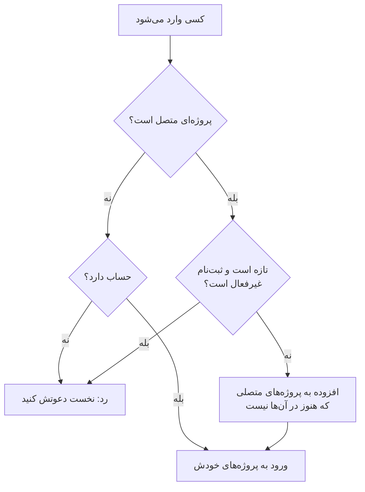

# SSO سراسری

SSO سراسری به یک **مدیر نمونه** در OneUptime (مدیر ارشد) امکان می‌دهد یک ارائه‌دهنده هویت SAML 2.0 یا OpenID Connect (OIDC) را **یک بار**، در سطح نمونه، پیکربندی کند و آن را به هر پروژه‌ای روی سرور وصل کند. به‌جای اینکه هر مالک پروژه ارائه‌دهنده هویت خودش را پیکربندی کند، یک مدیر ارشد ارائه‌دهنده‌ای برپا می‌کند که به کل نمونه خدمت می‌دهد.

> [!NOTE]
> SSO سراسری، از جمله کلید «Require SSO for Login» برای کل نمونه، بخشی از همهٔ نسخه‌های OneUptime است: هر نمونهٔ خودمیزبان آن را دارد، از جمله Community Edition، و به مجوز نیازی ندارد. این کار مدیریت نمونه است، پس به OneUptime Cloud مربوط نمی‌شود. برای اینکه ببینید هر نسخه چه چیزهایی دارد، [نسخه سازمانی](/docs/self-hosted/enterprise) را ببینید.

:::cards
- [برپا کردن یک ارائه‌دهنده](#برپا-کردن-sso-سراسری): آن را بسازید، نشانی‌های OneUptime را به ارائه‌دهنده هویت خود بدهید و آن را بیازمایید.
- [کاربران چگونه وارد می‌شوند](#کاربران-چگونه-وارد-میشوند): فقط اعضای موجود، یا تازه‌واردانی که به پروژه‌های متصل شما افزوده می‌شوند.
- [اعمال SSO](#اعمال-sso): SSO را برای یک پروژه یا کل نمونه الزامی کنید.
- [خاموش کردن یک ارائه‌دهنده](#خاموش-کردن-یا-حذف-یک-ارائهدهنده): چه چیزی پایان می‌یابد و OneUptime کدام تغییرها را رد می‌کند.
:::

## SSO سراسری در برابر SSO پروژه

|                  | SSO پروژه                                    | SSO سراسری                                          |
| ---------------- | -------------------------------------------- | --------------------------------------------------- |
| پیکربندی به دست  | مالک/مدیر پروژه (تنظیمات پروژه)              | مدیر ارشد نمونه (Admin Dashboard)                   |
| دامنه            | یک پروژه                                     | کل نمونه، قابل اتصال به هر پروژه                    |
| نتیجهٔ ورود       | دسترسی به همان یک پروژه                      | دسترسی به هر پروژه‌ای که کاربر به آن راه دارد        |

برای ارائه‌دهندهٔ خود یک پروژه، [SSO](/docs/identity/sso) را ببینید.

## برپا کردن SSO سراسری

:::steps
### باز کردن فهرست ارائه‌دهندگان

:::tabs
@tab SAML
به‌عنوان مدیر ارشد وارد شوید و Admin Dashboard را با **تنظیمات مدیریت** در منوی کاربری خود باز کنید. سپس به **تنظیمات** > **احراز هویت** > **Global SSO** بروید.
@tab OpenID Connect
به‌عنوان مدیر ارشد وارد شوید و Admin Dashboard را با **تنظیمات مدیریت** در منوی کاربری خود باز کنید. سپس به **تنظیمات** > **احراز هویت** > **Global OIDC** بروید.
:::

### ساختن ارائه‌دهنده

:::tabs
@tab SAML
- روی **Create Global SSO** کلیک کنید.
- یک **نام**، و **Sign On URL** و **Issuer** را از ارائه‌دهنده هویت خود وارد کنید و **Public Certificate** را بچسبانید. بقیه در **فیلدهای بیشتر** از پیش پر شده‌اند: **Signature Method** (`RSA-SHA256`)، **Digest Method** (`SHA256`) و یک توضیح (`Sign in with` و نام). فقط اگر IdP شما لازم دارد آن‌ها را تغییر دهید. ذخیره کردن، صفحهٔ ارائه‌دهنده را باز می‌کند.
@tab OpenID Connect
- روی **Create Global OIDC** کلیک کنید.
- یک **نام**، **Issuer URL**، و **Client ID** و **Client Secret** برنامه‌ای را که در IdP خود ثبت کرده‌اید وارد کنید. چسباندن نشانی کشف IdP در **Issuer URL** هم کار می‌کند. بقیه در **فیلدهای بیشتر** از پیش پر شده‌اند: **Discovery URL** (صادرکننده و پس از آن `/.well-known/openid-configuration`)، **Scopes** (`openid email profile`)، نام‌های claim یعنی `email` و `name`، و یک توضیح (`Sign in with` و نام). فقط اگر IdP شما لازم دارد آن‌ها را تغییر دهید. ذخیره کردن، صفحهٔ ارائه‌دهنده را باز می‌کند.
:::

### کپی کردن نشانی‌های OneUptime در ارائه‌دهنده هویت

:::tabs
@tab SAML
در صفحهٔ ارائه‌دهنده، کارت **Identity Provider URLs** مقدارهای **ACS URL (Assertion Consumer Service / Reply URL)** و **Issuer (Entity ID)** را نشان می‌دهد. هر دو را در ارائه‌دهنده هویت خود (Okta، Microsoft Entra ID، OneLogin، JumpCloud و دیگران) بچسبانید.
@tab OpenID Connect
در صفحهٔ ارائه‌دهنده، کارت **Identity Provider URL** مقدار **Redirect URI (Callback URL)** را نشان می‌دهد. آن را به نشانی‌های بازگشت مجاز ارائه‌دهنده هویت خود بیفزایید.
:::

### روشن کردن ارائه‌دهنده

ارائه‌دهندهٔ تازه خاموش آغاز می‌شود. در صفحهٔ ارائه‌دهنده روی **Edit Configuration** کلیک کنید و **فعال** را روشن کنید.

فعال کردن یک ارائه‌دهندهٔ سراسری فقط گزینهٔ «Sign in with SSO» را به صفحهٔ ورود می‌افزاید — هرگز SSO را اجباری نمی‌کند و کسی را بیرون نمی‌گذارد، پس فعال کردن، آزمودن و در صورت نیاز غیرفعال کردن دوباره‌اش بی‌خطر است.

### آزمودن ارائه‌دهنده

از پیوند کارت **Test this SSO provider** (برای OpenID Connect، **Test this OIDC provider**) برای اجرای یک ورود کامل از راه ارائه‌دهنده هویت خود استفاده کنید. لازم نیست نخست پروژه‌ای وصل کنید: آزمون شما را به پروژه‌هایی وارد می‌کند که از پیش عضوشان هستید. برای کار کردن پیوند، ارائه‌دهنده باید فعال باشد.
:::

## کاربران چگونه وارد می‌شوند

رفتار یک ارائه‌دهندهٔ سراسری بستگی دارد به اینکه پروژه‌ای به آن وصل کرده باشید یا نه:

- **بدون پروژهٔ متصل (همهٔ پروژه‌ها / نخست دعوت):** کاربران می‌توانند با این ارائه‌دهنده وارد شوند و به **هر پروژه‌ای که از پیش عضوش هستند** برسند. کاربران تازه خودکار ساخته **نمی‌شوند** — کاربر باید نخست به یک پروژه دعوت شود. این را برای SSO سراسر شرکت به کار ببرید، جایی که عضویت‌ها در جای دیگری مدیریت می‌شوند.

- **با پروژه‌های متصل (تأمین خودکار):** ارائه‌دهنده را باز کنید و با جدول **Attached Projects** یک یا چند پروژه را همراه با مجموعه‌ای از تیم‌های پیش‌فرض وصل کنید. کاربرانی که وارد می‌شوند در اولین ورود به‌صورت **خودکار تأمین** می‌شوند و به تیم‌های پیش‌فرض افزوده می‌شوند. پروژه‌ای که وصل می‌کنید از ابتدا با تیم اعضای آن انتخاب شده است؛ اگر کاربران تازه‌وارد باید با دسترسی دیگری شروع کنند، تیم‌های دیگری انتخاب کنید. برای ساختن فهرست، هر بار یک پروژه + تیم اضافه کنید؛ برای تغییر یک اتصال، آن را حذف و دوباره اضافه کنید.

کسی که از پیش عضو یک پروژهٔ متصل است، تیم‌هایی را که آنجا دارد نگه می‌دارد.

دو کلید روی ارائه‌دهنده این را تغییر می‌دهند. هر دو خاموش آغاز می‌شوند و زیر **فیلدهای بیشتر** جمع شده‌اند:

| کلید | وقتی روشن است چه می‌کند |
| --- | --- |
| **Disable Sign Up with SSO** | افراد باید پیش از آنکه بتوانند با این ارائه‌دهنده وارد شوند به یک پروژه دعوت شده باشند، حتی وقتی پروژه‌هایی متصل‌اند. در نخستین ورود هیچ فرد تازه‌ای ساخته نمی‌شود. |
| **Restrict to Attached Projects** | ورود با این ارائه‌دهنده الزام SSO را فقط در پروژه‌های متصل به آن برآورده می‌کند، پس کسانی که از پیش وارد شده‌اند ممکن است دسترسی به پروژه‌های دیگر را از دست بدهند. وقتی خاموش است، الزام را در هر پروژه‌ای که شخص به آن تعلق دارد برآورده می‌کند، و پروژه‌های متصل فقط تعیین می‌کنند تازه‌واردان کجا افزوده شوند. |

## اعمال SSO

پیکربندی یک ارائه‌دهندهٔ سراسری کسی را به استفاده از آن وادار نمی‌کند؛ ورود با گذرواژه همچنان کار می‌کند. برای الزامی کردن SSO، الزام را برای یک پروژه یا کل نمونه روشن کنید:

- **برای هر پروژه:** یک پروژه می‌تواند SSO را الزامی کند و در صورت تمایل یک ارائه‌دهندهٔ _مشخص_ (پروژه‌ای یا سراسری) را الزامی کند. [الزامی کردن SSO برای پروژهٔ شما](/docs/identity/sso#الزامی-کردن-sso-برای-پروژهٔ-شما) را ببینید.
- **برای کل نمونه:** **Admin** > **تنظیمات** > **احراز هویت** کلید **الزامی کردن SSO برای ورود** را دارد که SSO را برای همهٔ کاربران نمونه اجباری می‌کند. پیش از روشن شدن از شما تأیید می‌خواهد و به محض تأیید ذخیره می‌شود. مدیران ارشد معاف می‌مانند تا بیرون نمانند.

روشن کردن **الزامی کردن SSO برای ورود** به یک ارائه‌دهنده SSO نیاز دارد که افراد را وارد کند، تا هیچ‌کس به خاطر آن بیرون نماند:

- برای کل نمونه، هر پروژه‌ای که خودش SSO را الزامی نمی‌کند به یکی نیاز دارد: یکی از ارائه‌دهندگان SAML یا OIDC خود پروژه که روشن است، یا یک ارائه‌دهندهٔ سراسری روشن که افراد را به آن وارد می‌کند. تا وقتی پروژه‌ای هیچ‌کدام را ندارد، روشن کردن کلید رد می‌شود و پیام آن پروژه‌ها را نام می‌برد (یا، وقتی زیادند، چند تای نخست و تعداد کل را). نخست یک ارائه‌دهندهٔ سراسری، یا ارائه‌دهنده‌ای در آن پروژه‌ها، را روشن کنید. پروژه‌ای که ارائه‌دهندهٔ مشخصی را الزامی می‌کند به همان نیاز دارد: تا وقتی آن خاموش، حذف‌شده یا ناتوان از وارد کردن افراد به پروژه است، پیام آن پروژه را جداگانه نام می‌برد — نخست آن ارائه‌دهنده را روشن کنید، یا ارائه‌دهندهٔ دیگری را آنجا الزامی کنید.
- برای یک پروژه، همین از آن پروژه خواسته می‌شود، و اگر ارائه‌دهنده‌ای را الزامی کرده باشد، از آن ارائه‌دهنده.
- ذخیره‌ای که **الزامی کردن SSO برای ورود** را روشن می‌فرستد در حالی که از پیش روشن است — همراه با تنظیم‌های دیگر یا از API — به همین شکل بررسی می‌شود، برای نمونه یا برای یک پروژه، و همچنین ذخیره‌ای که ارائه‌دهنده‌ای را نام می‌برد که یک پروژه از پیش الزامی کرده است.
- برای یک پروژهٔ تازه، که هنوز ارائه‌دهنده‌ای از خودش ندارد: تا وقتی نمونه SSO را الزامی می‌کند، ساختن پروژه به یک ارائه‌دهندهٔ سراسری روشن نیاز دارد که افراد را به همهٔ پروژه‌ها وارد کند، وگرنه هیچ‌کس، از جمله سازنده‌اش، نمی‌توانست آن را باز کند. بدون آن، ساختن پروژه رد می‌شود و پیام از یک مدیر سرور می‌خواهد که یکی را روشن کند. مدیران ارشد همچنان می‌توانند پروژه بسازند. پروژه‌ای که با **الزامی کردن SSO برای ورود** روشن ساخته می‌شود هم، هر کس که آن را بسازد، به همین نیاز دارد.

خاموش کردن آن هرگز رد نمی‌شود.

## خاموش کردن یا حذف یک ارائه‌دهنده

خاموش کردن یک ارائه‌دهندهٔ سراسری، حذف آن یا محدود کردنش به پروژه‌های متصل، ورودهایی را که داده است در جایی که دیگر افراد را وارد نمی‌کند پایان می‌دهد. در جایی که SSO الزامی است، کسانی که با آن وارد شده‌اند باید در درخواست بعدی دوباره با SSO وارد شوند، صفحه‌هایی که باز دارند بی‌درنگ دیگر به‌روزرسانی زنده نمی‌گیرند، و کلاینت MCPی که کسی پس از ورود با آن وصل کرده است در پروژه از کار می‌افتد.

روشن کردن دوبارهٔ ارائه‌دهنده آن ورودها را برنمی‌گرداند: افراد دوباره با آن وارد می‌شوند. ارائه‌دهنده‌ای که هنگام ارتقای شما از پیش خاموش بود، در زمان ارتقا خاموش‌شده به شمار می‌آید.

گواهی یا کلید محرمانه کلاینت تازه، نشانی‌های دیگر یا نام تازه همه را وارد نگه می‌دارد.

### هر پروژه‌ای که SSO را الزامی می‌کند راهی برای ورود نگه می‌دارد

پروژه‌ای که SSO را الزامی می‌کند، خودش یا چون کل نمونه الزامی می‌کند، همیشه ارائه‌دهنده‌ای نگه می‌دارد که افراد بتوانند با آن به پروژه وارد شوند. پس این تغییرها تا وقتی چنین پروژه‌ای را کاملاً بی‌ارائه‌دهنده بگذارند، یا ارائه‌دهندهٔ الزامی‌اش را از آن بگیرند، رد می‌شوند:

- خاموش کردن یک ارائه‌دهندهٔ سراسری، حذف آن یا محدود کردنش به پروژه‌های متصل؛
- برای ارائه‌دهنده‌ای که به پروژه‌های متصلش محدود است: وصل کردن نخستین پروژه‌اش (تا آن زمان افراد را به همهٔ پروژه‌ها وارد می‌کند)، خاموش کردن یک اتصال، بردن آن به پروژه یا ارائه‌دهندهٔ دیگر، یا برداشتن آن.

پیام پروژه‌ها را، یا چند تای نخست و تعداد کل را، نام می‌برد. نخست ارائه‌دهندهٔ دیگری برایشان روشن کنید، از خودشان یا سراسری، یا آنجا **الزامی کردن SSO برای ورود** را خاموش کنید. پروژه‌ای که درست همین ارائه‌دهنده را الزامی می‌کند جداگانه نام برده می‌شود: نخست ارائه‌دهندهٔ دیگری را آنجا الزامی کنید، یا **الزامی کردن SSO برای ورود** را خاموش کنید.

تغییرهایی که به یک ارائه‌دهنده امکان می‌دهند افراد بیشتری را وارد کند — روشن کردن آن یا یک اتصال، برداشتن محدودیت — هرگز رد نمی‌شوند. این تغییرها بی‌درنگ به همهٔ سرورهای برنامه می‌رسند، همان‌طور که خاموش کردن **الزامی کردن SSO برای ورود**: افراد بی‌درنگ می‌توانند با آن ارائه‌دهنده وارد شوند. فقط وقتی تغییر دیگری در همان ارائه‌دهنده درست در همان لحظه ذخیره شود، ممکن است تا یک دقیقه طول بکشد تا یک سرور برنامه همراه شود.

دو تغییر در اینکه چه کسی می‌تواند وارد شود، یکی پس از دیگری بررسی می‌شوند. اگر تغییر دیگری در همان لحظه در حال ذخیره باشد و بیش از معمول طول بکشد — روشن کردن **الزامی کردن SSO برای ورود** برای کل نمونه همهٔ پروژه‌ها را می‌خواند — تغییر با "Another change to who can sign in with SSO is being saved. Try again in a moment." رد می‌شود: دوباره ذخیره‌اش کنید. پروژه‌ای که در آن لحظه ساخته می‌شود هم منتظر آن تغییر می‌ماند، و اگر بیش از حد منتظر بماند با "The server's SSO settings are being changed. Create the project again in a moment." رد می‌شود.

## رفع اشکال

:::details "You must be invited to a project on this OneUptime instance before you can sign in with SSO"
شخص هنوز حساب OneUptime ندارد، و ارائه‌دهنده هم حسابی نمی‌سازد: یا هیچ پروژه‌ای به آن وصل نیست، یا **Disable Sign Up with SSO** روشن است. او را به یک پروژه دعوت کنید، یا پروژه‌ای را به ارائه‌دهنده وصل کنید.
:::

:::details "This SSO provider does not grant access to any project you are a member of"
**Restrict to Attached Projects** روشن است و شخص عضو هیچ پروژه‌ای نیست که به ارائه‌دهنده وصل باشد. یکی از پروژه‌های او را وصل کنید، یا او را به یک پروژهٔ متصل بیفزایید.
:::

:::details "You are not a member of any project on this OneUptime instance"
شخص حساب دارد اما به هیچ پروژه‌ای تعلق ندارد، و ارائه‌دهنده جایی برای افزودن او ندارد. او را به یک پروژه دعوت کنید، یا پروژه‌ای با تیم‌های پیش‌فرض را به ارائه‌دهنده وصل کنید.
:::

:::details "Issuer URL does not match"
برای یک ارائه‌دهنده SAML، صادرکننده در پاسخ ارائه‌دهنده هویت شما همان **Issuer** ذخیره‌شده روی ارائه‌دهنده نیست. آن را دوباره از ارائه‌دهنده هویت خود کپی کنید؛ این دو باید دقیقاً یکی باشند.
:::

## گام‌های بعدی

:::cards
- [SSO](/docs/identity/sso): ارائه‌دهنده SAML یا OIDC خود یک پروژه را برپا کنید.
- [SCIM](/docs/identity/scim): بگذارید ارائه‌دهنده هویت شما افراد را خودکار بیفزاید و بردارد.
- [کاربران، تیم‌ها و دسترسی‌ها](/docs/permissions/index): تیم‌هایی که تازه‌واردان به آن‌ها می‌پیوندند به آن‌ها چه اجازه‌ای می‌دهند.
:::
