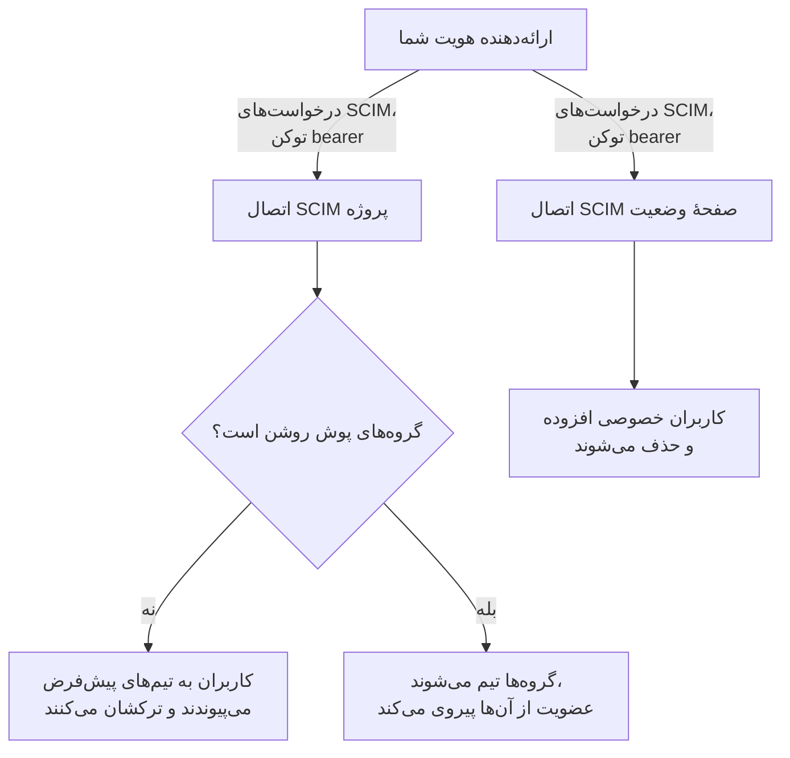
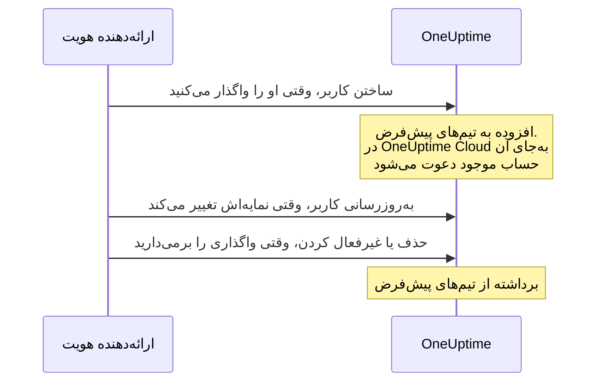
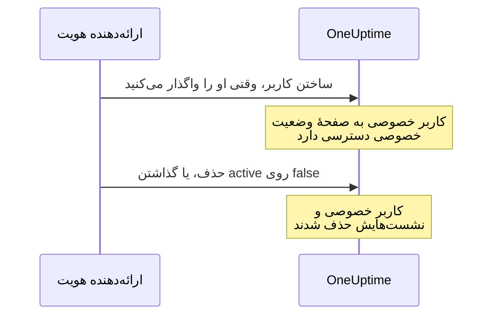

# SCIM

SCIM (System for Cross-domain Identity Management) تأمین افراد و لغو دسترسی آن‌ها را خودکار انجام می‌دهد. ارائه‌دهنده هویت شما (IdP) — Microsoft Entra ID، Okta یا هر سامانهٔ SCIM 2.0 دیگری — وقتی افراد را واگذار می‌کنید آن‌ها را به پروژه‌های OneUptime و صفحه‌های وضعیت خصوصی شما می‌افزاید، و وقتی واگذاری را برمی‌دارید آن‌ها را برمی‌دارد.

> [!NOTE]
> **نسخه:** SCIM بخشی از OneUptime Enterprise Edition است. در OneUptime Cloud از طرح **Scale** به بالا در دسترس است. نصب‌های خودمیزبان به ایمیج Enterprise Edition و یک مجوز نیاز دارند. [نسخه سازمانی](/docs/self-hosted/enterprise) را ببینید. بدون مجوز معتبر (پس از دورهٔ آزمایشی ۱۴ روزه، یا ۳۰ روز پس از پایان اعتبار یک مجوز)، درخواست‌های SCIM تا فعال شدن یک مجوز رد می‌شوند.

:::cards
- [برپا کردن SCIM پروژه](#برپا-کردن-scim-پروژه): یک اتصال بسازید و نشانی و توکن آن را به IdP خود بدهید.
- [برپا کردن SCIM صفحهٔ وضعیت](#برپا-کردن-scim-صفحهٔ-وضعیت): کاربران خصوصی یک صفحهٔ وضعیت را تأمین کنید.
- [وصل کردن ارائه‌دهنده هویت](#وصل-کردن-ارائهدهنده-هویت): گام به گام برای Microsoft Entra ID و Okta.
- [پرسش‌های متداول](#پرسشهای-متداول): کاربران موجود، لغو دسترسی، تغییر ایمیل.
:::

## چگونه کار می‌کند

ارائه‌دهنده هویت شما هر بار که کسی را واگذار می‌کنید، تغییر می‌دهید یا واگذاری‌اش را برمی‌دارید، نقطه پایانی SCIM در OneUptime را با احراز هویت از راه یک توکن bearer فرا می‌خواند. آنچه درخواست تغییر می‌دهد به جای اتصال بستگی دارد:



یکپارچه‌سازی SCIM این مزایا را دارد:

- **تأمین خودکار کاربر**: کاربران وقتی در IdP شما واگذار می‌شوند در OneUptime ساخته می‌شوند.
- **لغو خودکار دسترسی کاربر**: کاربران وقتی واگذاری‌شان در IdP شما برداشته می‌شود از OneUptime برداشته می‌شوند.
- **همگام‌سازی ویژگی‌های کاربر**: اطلاعات کاربر میان IdP شما و OneUptime یکسان می‌ماند.
- **مدیریت متمرکز دسترسی**: دسترسی به OneUptime از سامانهٔ مدیریت هویت موجود شما مدیریت می‌شود.

SCIM و [SSO](/docs/identity/sso) مستقل‌اند: SCIM تعیین می‌کند چه کسی در یک پروژه است، و SSO اینکه چگونه وارد می‌شوند. بیشتر سازمان‌ها هر دو را به کار می‌برند.

## SCIM برای پروژه‌ها

SCIM پروژه به ارائه‌دهندگان هویت امکان می‌دهد اعضای تیم را درون پروژه‌های OneUptime مدیریت کنند.

### برپا کردن SCIM پروژه

فقط مالک پروژه می‌تواند اتصال SCIM یک پروژه را بیفزاید یا تغییر دهد، یا توکن bearer آن را ببیند یا بازنشانی کند: از راه SCIM، ارائه‌دهنده هویت شما می‌تواند افراد را به هر تیمی در پروژه بیفزاید.
:::steps
1. **رفتن به تنظیمات پروژه**

   - به پروژه OneUptime خود بروید
   - به **تنظیمات پروژه** > **امنیت** > **SCIM** بروید

2. **پیکربندی تنظیمات SCIM**

   - یک **نام** وارد کنید. **تیم‌های پیش‌فرض** با تیم اعضای پروژه شما آغاز می‌شود: کاربران تازه به این تیم‌ها افزوده می‌شوند
   - زیر **فیلدهای بیشتر**، **تأمین خودکار کاربران** (افزودن کاربران وقتی در IdP شما واگذار می‌شوند) و **لغو خودکار دسترسی کاربران** (برداشتن کاربران وقتی واگذاری‌شان در IdP شما برداشته می‌شود) روشن‌اند و **فعال کردن گروه‌های پوش** خاموش است. اگر لازم است همان‌جا تغییرشان دهید
   - ذخیره کنید. پنجره‌ای با **SCIM Base URL** و **Bearer Token** برای پیکربندی IdP شما بی‌درنگ باز می‌شود

3. **پیکربندی ارائه‌دهنده هویت**

   - از **SCIM Base URL** در پنجره استفاده کنید. در OneUptime Cloud این نشانی `https://oneuptime.com/identity/scim/v2/<scim-id>` است؛ یک نصب خودمیزبان میزبان خودش را نشان می‌دهد
   - احراز هویت با توکن bearer را با **Bearer Token** در پنجره پیکربندی کنید
   - ویژگی‌های کاربر را نگاشت کنید (ایمیل الزامی است). [وصل کردن ارائه‌دهنده هویت](#وصل-کردن-ارائهدهنده-هویت) جزئیات Microsoft Entra ID و Okta را دارد
:::

برای دیدن دوبارهٔ نشانی‌ها، در سطر اتصال **مشاهده نشانی‌های SCIM** را انتخاب کنید. **بازنشانی توکن Bearer** توکن را جایگزین می‌کند؛ ارائه‌دهنده هویت خود را با توکن تازه به‌روز کنید.

### کاربر پروژه چگونه تأمین می‌شود



کسی که از پیش حساب OneUptime داشت، وقتی دعوت را در OneUptime Cloud بپذیرد می‌پیوندد ([پرسش‌های متداول](#پرسشهای-متداول) را ببینید). دسترسی‌ای که از راه تیم‌هایی جز تیم‌های پیش‌فرض اتصال داده شده است دست نمی‌خورد.

## SCIM برای صفحه‌های وضعیت

SCIM صفحهٔ وضعیت به ارائه‌دهندگان هویت امکان می‌دهد کاربران خصوصی صفحهٔ وضعیت را، که به صفحه‌های وضعیت خصوصی دسترسی دارند، تأمین کنند و دسترسی‌شان را لغو کنند.

### برپا کردن SCIM صفحهٔ وضعیت

:::steps
1. **رفتن به تنظیمات صفحهٔ وضعیت**

   - **صفحات وضعیت** را باز کنید و صفحهٔ وضعیت خود را انتخاب کنید
   - به **امنیت** > **SCIM** بروید

2. **پیکربندی تنظیمات SCIM**

   - یک **نام** وارد کنید. زیر **فیلدهای بیشتر**، **تأمین خودکار کاربران** (افزودن کاربران خصوصی وقتی در IdP شما واگذار می‌شوند) و **لغو خودکار دسترسی کاربران** (حذف کاربران خصوصی وقتی واگذاری‌شان در IdP شما برداشته می‌شود) روشن‌اند. اگر لازم است همان‌جا تغییرشان دهید
   - ذخیره کنید. پنجره‌ای با **SCIM Base URL** و **Bearer Token** برای پیکربندی IdP شما بی‌درنگ باز می‌شود

3. **پیکربندی ارائه‌دهنده هویت**

   - از **SCIM Base URL** در پنجره استفاده کنید. در OneUptime Cloud این نشانی `https://oneuptime.com/identity/status-page-scim/v2/<scim-id>` است
   - احراز هویت با توکن bearer را با توکنی که نشان داده می‌شود پیکربندی کنید
   - ویژگی‌های کاربر را نگاشت کنید (ایمیل الزامی است)
:::

برای دیدن دوبارهٔ نشانی‌ها، در سطر اتصال **نمایش نشانی‌های نقطه پایانی SCIM** را انتخاب کنید.

SCIM صفحهٔ وضعیت فقط از کاربران پشتیبانی می‌کند. از گروه‌ها یا تأمین گروه پشتیبانی نمی‌کند.

### کاربر خصوصی چگونه تأمین می‌شود



> [!WARNING]
> لغو دسترسی، کاربر خصوصی صفحهٔ وضعیت و همهٔ نشست‌هایش برای آن صفحهٔ وضعیت را برای همیشه حذف می‌کند. اگر کاربر بعداً دوباره واگذار شود، به‌عنوان کاربر خصوصی تازه تأمین می‌شود. وقتی **لغو خودکار دسترسی کاربران** خاموش است، به‌روزرسانی‌هایی که `active` را روی `false` می‌گذارند نادیده گرفته می‌شوند و درخواست‌های DELETE رد می‌شوند.

## وصل کردن ارائه‌دهنده هویت

هر ارائه‌دهندهٔ زیر با ساختن یک اتصال SCIM پروژه در OneUptime آغاز می‌شود و سپس ارائه‌دهنده هویت شما را به آن وصل می‌کند.

### Microsoft Entra ID (پیش‌تر Azure AD)

Microsoft Entra ID مدیریت هویت در سطح سازمانی را با تأمین SCIM فراهم می‌کند. به این‌ها نیاز دارید:

- یک tenant در Microsoft Entra ID با مجوز Premium P1 یا P2 (برای تأمین خودکار لازم است).
- یک پروژه OneUptime روی طرح **Scale** یا بالاتر در OneUptime Cloud.
- دسترسی مدیر به Microsoft Entra ID و OneUptime هر دو.

:::steps
#### ساختن اتصال SCIM برای Entra ID

1. به داشبورد OneUptime خود وارد شوید
2. به **تنظیمات پروژه** > **امنیت** > **SCIM** بروید
3. روی **ساخت SCIM** کلیک کنید
4. یک نام آشنا وارد کنید (برای نمونه «Microsoft Entra ID Provisioning»)
5. گزینه‌ها را بررسی کنید:
   - **تیم‌های پیش‌فرض**: با تیم اعضای پروژه شما آغاز می‌شود؛ کاربران تازه به این تیم‌ها افزوده می‌شوند
   - **تأمین خودکار کاربران** و **لغو خودکار دسترسی کاربران**: روشن، زیر **فیلدهای بیشتر**
   - **فعال کردن گروه‌های پوش**: زیر **فیلدهای بیشتر**؛ اگر می‌خواهید عضویت تیم‌ها را با گروه‌های Entra ID مدیریت کنید روشنش کنید
6. پیکربندی را ذخیره کنید
7. **SCIM Base URL** و **Bearer Token** را از پنجره‌ای که باز می‌شود کپی کنید — برای Entra ID به آن‌ها نیاز دارید

#### ساختن یک برنامهٔ سازمانی در Entra ID

1. به [Microsoft Entra admin center](https://entra.microsoft.com) وارد شوید
2. به **Identity** > **Applications** > **Enterprise applications** بروید
3. روی **+ New application** و سپس **+ Create your own application** کلیک کنید
4. یک نام وارد کنید (برای نمونه «OneUptime»)
5. **Integrate any other application you don't find in the gallery (Non-gallery)** را انتخاب کنید و روی **Create** کلیک کنید

#### وصل کردن Entra ID به OneUptime

1. در برنامهٔ سازمانی OneUptime خود به **Provisioning** بروید و روی **Get started** کلیک کنید
2. **Provisioning Mode** را روی **Automatic** بگذارید
3. زیر **Admin Credentials**، **Tenant URL** را روی **SCIM Base URL** از OneUptime (برای نمونه `https://oneuptime.com/identity/scim/v2/<scim-id>`) و **Secret Token** را روی **Bearer Token** بگذارید
4. برای بررسی پیکربندی روی **Test Connection** و سپس روی **Save** کلیک کنید

#### نگاشت ویژگی‌های کاربر در Entra ID

1. در بخش Provisioning روی **Mappings** و سپس **Provision Azure Active Directory Users** کلیک کنید
2. نگاشت‌های ویژگی زیر را پیکربندی کنید، آن‌هایی را که لازم ندارید بردارید و روی **Save** کلیک کنید:

| ویژگی Azure AD                                                | ویژگی SCIM در OneUptime         | الزامی    |
| ------------------------------------------------------------- | ------------------------------ | --------- |
| `userPrincipalName`                                           | `userName`                     | بله       |
| `mail`                                                        | `emails[type eq "work"].value` | پیشنهادی  |
| `displayName`                                                 | `displayName`                  | پیشنهادی  |
| `givenName`                                                   | `name.givenName`               | اختیاری   |
| `surname`                                                     | `name.familyName`              | اختیاری   |
| `Switch([IsSoftDeleted], , "False", "True", "True", "False")` | `active`                       | پیشنهادی  |

#### نگاشت گروه‌ها در Entra ID (اختیاری)

اگر **فعال کردن گروه‌های پوش** را در OneUptime روشن کرده‌اید:

1. به **Mappings** برگردید و روی **Provision Azure Active Directory Groups** کلیک کنید
2. **Enabled** را روی **Yes** بگذارید
3. نگاشت‌های ویژگی زیر را پیکربندی کنید و روی **Save** کلیک کنید:

| ویژگی Azure AD | ویژگی SCIM در OneUptime |
| -------------- | ----------------------- |
| `displayName`  | `displayName`           |
| `members`      | `members`               |

#### واگذاری کاربران و گروه‌ها در Entra ID

1. در برنامهٔ سازمانی OneUptime خود به **Users and groups** بروید
2. روی **+ Add user/group** کلیک کنید، کاربران و گروه‌هایی را که باید در OneUptime تأمین شوند انتخاب کنید و روی **Assign** کلیک کنید

#### آغاز تأمین در Entra ID

1. به **Provisioning** > **Overview** بروید و روی **Start provisioning** کلیک کنید
2. نخستین چرخهٔ تأمین آغاز می‌شود؛ نخستین همگام‌سازی می‌تواند تا ۴۰ دقیقه طول بکشد
3. خطاها را در **Provisioning logs** بررسی کنید. کسانی که واگذار کرده‌اید در تیم‌های پروژه در OneUptime نمایش داده می‌شوند
:::

### Okta

Okta مدیریت هویت انعطاف‌پذیر با پشتیبانی از SCIM فراهم می‌کند. به این‌ها نیاز دارید:

- یک tenant در Okta با تأمین (قابلیت Lifecycle Management).
- یک پروژه OneUptime روی طرح **Scale** یا بالاتر در OneUptime Cloud.
- دسترسی مدیر به Okta و OneUptime هر دو.

:::steps
#### ساختن اتصال SCIM برای Okta

1. به داشبورد OneUptime خود وارد شوید
2. به **تنظیمات پروژه** > **امنیت** > **SCIM** بروید
3. روی **ساخت SCIM** کلیک کنید
4. یک نام آشنا وارد کنید (برای نمونه «Okta Provisioning»)
5. گزینه‌ها را بررسی کنید:
   - **تیم‌های پیش‌فرض**: با تیم اعضای پروژه شما آغاز می‌شود؛ کاربران تازه به این تیم‌ها افزوده می‌شوند
   - **تأمین خودکار کاربران** و **لغو خودکار دسترسی کاربران**: روشن، زیر **فیلدهای بیشتر**
   - **فعال کردن گروه‌های پوش**: زیر **فیلدهای بیشتر**؛ اگر می‌خواهید عضویت تیم‌ها را با گروه‌های Okta مدیریت کنید روشنش کنید
6. پیکربندی را ذخیره کنید
7. **SCIM Base URL** و **Bearer Token** را از پنجره‌ای که باز می‌شود کپی کنید — برای Okta به آن‌ها نیاز دارید

#### ساختن یا باز کردن برنامهٔ Okta

در Okta Admin Console به **Applications** > **Applications** بروید:

- اگر از پیش Okta را برای SSO در OneUptime به کار می‌برید، همان برنامه را باز کنید.
- وگرنه روی **Create App Integration** کلیک کنید، **SAML 2.0** را انتخاب کنید، نامش را «OneUptime» بگذارید و برپایی SAML را کامل کنید ([SSO](/docs/identity/sso) را ببینید).

#### روشن کردن تأمین SCIM در Okta

1. به زبانهٔ **General** برنامهٔ OneUptime خود بروید
2. در بخش **App Settings** روی **Edit** کلیک کنید، زیر **Provisioning** گزینهٔ **SCIM** را انتخاب کنید و روی **Save** کلیک کنید
3. یک زبانهٔ تازهٔ **Provisioning** نمایش داده می‌شود

#### وصل کردن Okta به OneUptime

1. در زبانهٔ **Provisioning** روی **Integration**، سپس **Configure API Integration** کلیک کنید و **Enable API integration** را علامت بزنید
2. این‌ها را پیکربندی کنید:
   - **SCIM connector base URL**: **SCIM Base URL** از OneUptime (برای نمونه `https://oneuptime.com/identity/scim/v2/<scim-id>`)
   - **Unique identifier field for users**: `userName`
   - **Supported provisioning actions**: Import New Users and Profile Updates، Push New Users، Push Profile Updates و، اگر از تأمین گروه‌محور استفاده می‌کنید، Push Groups
   - **Authentication Mode**: **HTTP Header**
   - **Authorization**: **Bearer Token** از OneUptime. OneUptime سرآیند `Authorization: Bearer <token>` را انتظار دارد؛ اگر Okta از پیش واژهٔ Bearer را جلوی فیلد نشان می‌دهد، فقط توکن را وارد کنید
3. برای بررسی اتصال روی **Test API Credentials** و سپس روی **Save** کلیک کنید

#### انتخاب آنچه Okta تأمین می‌کند

1. در زبانهٔ **Provisioning** روی **To App** و سپس **Edit** کلیک کنید
2. **Create Users**، **Update User Attributes** و **Deactivate Users** را روشن کنید و روی **Save** کلیک کنید

#### نگاشت ویژگی‌های کاربر در Okta

تا **Attribute Mappings** پایین بروید و این نگاشت‌ها را بررسی کنید. آن‌هایی را که لازم ندارید بردارید:

| ویژگی Okta         | ویژگی SCIM در OneUptime          | جهت             |
| ------------------ | ------------------------------- | --------------- |
| `userName`         | `userName`                      | از Okta به برنامه |
| `user.email`       | `emails[primary eq true].value` | از Okta به برنامه |
| `user.firstName`   | `name.givenName`                | از Okta به برنامه |
| `user.lastName`    | `name.familyName`               | از Okta به برنامه |
| `user.displayName` | `displayName`                   | از Okta به برنامه |

#### فرستادن گروه‌ها از Okta (اختیاری)

اگر **فعال کردن گروه‌های پوش** را در OneUptime روشن کرده‌اید:

1. به زبانهٔ **Push Groups** بروید و روی **+ Push Groups** کلیک کنید
2. **Find groups by name** یا **Find groups by rule** را انتخاب کنید
3. گروه‌هایی را که باید فرستاده شوند جست‌وجو و انتخاب کنید و روی **Save** کلیک کنید

#### واگذاری افراد در Okta

1. به زبانهٔ **Assignments** بروید
2. روی **Assign** > **Assign to People** یا **Assign to Groups** کلیک کنید، کسانی را که باید تأمین شوند انتخاب کنید، برای هر کدام روی **Assign** و سپس روی **Done** کلیک کنید

#### بررسی تأمین در Okta

1. در Okta Admin Console به **Reports** > **System Log** بروید و بر پایهٔ برنامهٔ OneUptime خود پالایش کنید
2. بررسی کنید که رویدادهای تأمین موفق بوده‌اند و افراد در تیم‌های پروژه در OneUptime نمایش داده می‌شوند
:::

### دیگر ارائه‌دهندگان هویت

پیاده‌سازی SCIM در OneUptime از مشخصات SCIM v2.0 پیروی می‌کند و با هر ارائه‌دهنده هویت سازگاری کار می‌کند:

| تنظیم | مقدار |
| --- | --- |
| SCIM Base URL | **SCIM Base URL** از OneUptime: `https://oneuptime.com/identity/scim/v2/<scim-id>` برای یک پروژه، یا `https://oneuptime.com/identity/status-page-scim/v2/<scim-id>` برای یک صفحهٔ وضعیت |
| احراز هویت | توکن HTTP Bearer |
| شناسهٔ یکتای کاربر | `userName`، که باید یک نشانی ایمیل معتبر باشد |
| عملیات | GET، POST، PUT، PATCH و DELETE برای Users، در SCIM پروژه و SCIM صفحهٔ وضعیت. Groups فقط در SCIM پروژه پشتیبانی می‌شود. |

## مرجع API در SCIM

مسیرها نسبت به **SCIM Base URL** اتصال‌اند.

| نقطه پایانی              | روش‌ها                  | توضیحات                                                |
| ------------------------ | ----------------------- | ------------------------------------------------------ |
| `/ServiceProviderConfig` | GET                     | قابلیت‌های سرور SCIM                                    |
| `/Schemas`               | GET                     | طرح‌واره‌های منابع موجود                                |
| `/ResourceTypes`         | GET                     | انواع منابع موجود                                      |
| `/Users`                 | GET, POST               | فهرست کردن و ساختن کاربران                             |
| `/Users/{id}`            | GET, PUT, PATCH, DELETE | مدیریت تک‌تک کاربران                                    |
| `/Groups`                | GET, POST               | فهرست کردن و ساختن گروه‌ها/تیم‌ها (فقط SCIM پروژه)      |
| `/Groups/{id}`           | GET, PUT, PATCH, DELETE | مدیریت تک‌تک گروه‌ها (فقط SCIM پروژه)                   |
| `/Bulk`                  | POST                    | چند عملیات در یک درخواست                               |

آنچه `/ServiceProviderConfig` گزارش می‌دهد:

| قابلیت | پشتیبانی |
| --- | --- |
| PATCH | بله |
| Bulk | بله، تا ۱٬۰۰۰ عملیات و ۱ مگابایت در هر درخواست |
| Filter | بله، تا ۲۰۰ نتیجه |
| مرتب‌سازی | بله |
| تغییر گذرواژه | خیر |
| ETag | خیر |
| احراز هویت | توکن HTTP Bearer |

گروهی که ارائه‌دهنده هویت شما می‌سازد در پروژه به تیمی با همان نام تبدیل می‌شود؛ اگر تیمی با آن نام از پیش باشد، به‌جای ساختن تیم تازه همان به کار می‌رود.

:::details طرح‌وارهٔ کاربر SCIM
```json
{
  "schemas": ["urn:ietf:params:scim:schemas:core:2.0:User"],
  "userName": "user@example.com",
  "name": {
    "givenName": "John",
    "familyName": "Doe",
    "formatted": "John Doe"
  },
  "displayName": "John Doe",
  "emails": [
    {
      "value": "user@example.com",
      "type": "work",
      "primary": true
    }
  ],
  "active": true
}
```
:::

:::details طرح‌وارهٔ گروه SCIM
```json
{
  "schemas": ["urn:ietf:params:scim:schemas:core:2.0:Group"],
  "displayName": "Engineering Team",
  "members": [
    {
      "value": "user-id-here",
      "display": "user@example.com"
    }
  ]
}
```
:::

## طرح‌ها و مجوزها

در OneUptime Cloud، SCIM به طرح **Scale** نیاز دارد. یک نصب خودمیزبان، همان‌طور که یادداشت بالای صفحه می‌گوید، به Enterprise Edition و یک مجوز نیاز دارد.

### زیر طرح Scale

در OneUptime Cloud تأمین SCIM فقط تا وقتی کاملاً کار می‌کند که پروژه روی **Scale** یا بالاتر باشد. زیر آن — پس از پایان یک دورهٔ آزمایشی Scale یا پایین آمدن طرح — اتصال‌های SCIM پروژه، و صفحه‌های وضعیتش، فقط افراد را برمی‌دارند تا هر کسی که می‌رود همچنان دسترسی‌اش را از دست بدهد:

- **همچنان کار می‌کند:** غیرفعال کردن یک کاربر (`active` روی `false`، در اتصالی که برای برداشتن افرادی که غیرفعال می‌کند تنظیم شده است)، حذف یک کاربر، برداشتن اعضا از یک گروه (`Remove` در Entra ID روی `members` با اعضا به‌عنوان مقدار، `remove` در Okta روی `members[value eq "..."]`، یا جایگزین کردن اعضا با بخشی از کسانی که گروه از پیش دارد)، حذف یک گروه، و یک درخواست `Bulk` که فقط از `DELETE` تشکیل شده باشد. به جست‌وجوها هم پاسخ داده می‌شود — فهرست کردن و پالایش کاربران و گروه‌ها، که ارائه‌دهندگان هویت پیش از برداشتن کسی انجام می‌دهند — اما زیر طرح، یک جست‌وجو هرگز کسی را نمی‌سازد.
- **رد می‌شود:** ساختن یک کاربر یا گروه، فعال کردن دوبارهٔ یک کاربر (`active` روی `true` برای کسی که اتصال او را به یکی از تیم‌هایش برمی‌گرداند)، افزودن کسی به گروهی که در آن نیست، و تغییر فقط ایمیل یا نام یک کاربر یا نام یک گروه. درخواستی که کسی را می‌افزاید کلاً رد می‌شود، حتی وقتی هم‌زمان افرادی را برمی‌دارد، چون یک `PATCH` در SCIM همه یا هیچ است. رد شدن یک `402` با خطایی در قالب SCIM است که ارائه‌دهنده هویت شما نشان می‌دهد: `SCIM provisioning needs the Scale plan. This project's plan does not include it, so its SCIM connections can only remove people: requests that add or change people or groups are refused. The connections are kept: upgrade the project to Scale in Project Settings > Billing and they work fully again.` هر رد شدن در لاگ‌های SCIM اتصال هم ثبت می‌شود.
- **برداشتنی که نمایه را هم تغییر می‌دهد** — غیرفعال کردنی که ایمیل یا نام تازه‌ای می‌فرستد، یا به‌روزرسانی گروهی که اعضا را برمی‌دارد و گروه را تغییر نام می‌دهد — انجام می‌شود و ایمیل، نام یا نام گروه را همان‌گونه که بود باقی می‌گذارد. ارائه‌دهندگان هویت آنچه را متفاوت می‌بینند دوباره می‌فرستند، پس تغییری که یک بار رد شده با درخواست‌های بعدی‌شان بازمی‌گردد، و برداشتن هرگز منتظر طرح نمی‌ماند. غیرفعال کردن در اتصالی که افرادی را که غیرفعال می‌کند برنمی‌دارد (لغو خودکار دسترسی خاموش است، یا به‌جای آن گروه‌ها فرستاده می‌شوند) کسی را برنمی‌دارد، پس ایمیل یا نام تازه‌ای که همراهش فرستاده شود به‌عنوان تغییری جداگانه رد می‌شود.
- **به درخواستی که چیزی را تغییر نمی‌دهد مانند همیشه پاسخ داده می‌شود** — `PUT` یک کاربر در Okta همان‌گونه که هست، با `active` روی `true`، برای کسی که از پیش در همهٔ تیم‌های اتصال است؛ افزودن کسی به گروهی که از پیش در آن است؛ ایمیلی که با حروف بزرگ و کوچک دیگری دوباره فرستاده شده است؛ ویژگی‌هایی که OneUptime نگه نمی‌دارد، مانند عنوان شغلی یا بخش. کاربر خصوصی یک صفحهٔ وضعیت یا روی صفحه است یا اصلاً نیست، پس `active` روی `true` هرگز چنین کاربری را تغییر نمی‌دهد.

چیزی حذف نمی‌شود. به **Scale** ارتقا دهید تا اتصال‌ها همان‌گونه که هستند دوباره کاملاً کار کنند، با همان توکن bearer و بی‌نیاز از برپایی دوباره در ارائه‌دهنده هویت شما؛ تغییر طرح ظرف یک دقیقه اعمال می‌شود. ارائه‌دهندگان هویت بر پایهٔ زمان‌بندی خودشان به فراخوانی ادامه می‌دهند: Okta رد شدن‌ها را میان خطاهای تأمین خود نشان می‌دهد، و Entra ID آن‌ها را در لاگ‌های تأمین خود نشان می‌دهد و ممکن است کاری را که پیوسته شکست می‌خورد قرنطینه کند، که همگام‌سازی‌ها — از جمله برداشتن‌ها — را تا حدود یک بار در روز کند می‌کند. پس از ارتقا، تأمین را آنجا دوباره آغاز کنید تا کسانی که در این میان افزوده شده‌اند تأمین شوند.

زیر **Scale**، **تنظیمات پروژه** > **امنیت** > **SCIM** و صفحهٔ **SCIM** یک صفحهٔ وضعیت اتصال‌ها را زیر پیشنهاد ارتقای طرح نشان می‌دهند (**اتصال‌های SCIM که هنوز تنظیم شده‌اند**) و می‌گویند که فقط افراد را برمی‌دارند. برای کنار گذاشتن یک اتصال آن را حذف کنید. افزودن یک اتصال، تغییر آن یا جایگزین کردن توکن bearer آن به **Scale** نیاز دارد. فهرست توکن‌های bearer را نشان نمی‌دهد، و در هر طرحی فقط مالکان پروژه می‌توانند یک توکن را بخوانند.

## رفع اشکال

از زبانهٔ **لاگ‌ها** زیر **تنظیمات پروژه** > **امنیت** > **SCIM** (یا در صفحهٔ **SCIM** صفحهٔ وضعیت) شروع کنید. این زبانه درخواست‌های SCIMی را که ارائه‌دهنده هویت شما فرستاده است با وضعیتشان فهرست می‌کند، و **مشاهده جزئیات** درخواست و پاسخ OneUptime را نشان می‌دهد.

:::details Entra ID: Test Connection شکست می‌خورد
بررسی کنید که **Tenant URL** دقیقاً همان **SCIM Base URL** باشد که OneUptime نشان می‌دهد، و **Secret Token** همان **Bearer Token** کنونی باشد. پس از **بازنشانی توکن Bearer**، توکن قدیمی دیگر کار نمی‌کند.
:::

:::details Okta: آزمون اعتبارنامه‌های API شکست می‌خورد، یا درخواست‌ها 401 Unauthorized می‌گیرند
**SCIM connector base URL** و توکن را بررسی کنید. OneUptime سرآیند `Authorization: Bearer <token>` را می‌خواند، پس مطمئن شوید واژهٔ Bearer دقیقاً یک بار فرستاده می‌شود. اگر توکن گم شده یا لو رفته است، در OneUptime **بازنشانی توکن Bearer** را انتخاب کنید و Okta را به‌روز کنید.
:::

:::details کاربران تأمین نمی‌شوند
بررسی کنید که کاربران در ارائه‌دهنده هویت شما به برنامه واگذار شده‌اند، تأمین آنجا روشن است و نگاشت‌های ویژگی درست‌اند. در Entra ID، **Provisioning logs** هر خطا را نشان می‌دهد؛ در Okta، **System Log**.
:::

:::details کاربران تکراری در Okta
مطمئن شوید `userName` یکتاست و با نشانی ایمیل کاربر یکی است.
:::

:::details خطا در فرستادن گروه‌ها
بررسی کنید که گروه‌ها در ارائه‌دهنده هویت شما وجود دارند و اعضای درستی دارند، و **فعال کردن گروه‌های پوش** در OneUptime روشن است.
:::

:::details تغییرهای Entra ID دیر می‌رسند
Entra ID بر پایهٔ زمان‌بندی خودش تأمین می‌کند: نخستین همگام‌سازی می‌تواند تا ۴۰ دقیقه طول بکشد، و همگام‌سازی‌های بعدی حدوداً هر ۴۰ دقیقه اجرا می‌شوند. کاری که Entra ID قرنطینه کرده است کمتر همگام‌سازی می‌کند؛ خطاهای **Provisioning logs** را برطرف کنید و کار را دوباره آغاز کنید.
:::

## پرسش‌های متداول

:::details وقتی دسترسی یک کاربر لغو می‌شود چه رخ می‌دهد؟
لغو دسترسی را می‌توان با یک درخواست DELETE یا با گذاشتن `active` روی `false` در یک به‌روزرسانی PUT/PATCH درخواست کرد:

- **SCIM پروژه**: با روشن بودن **لغو خودکار دسترسی کاربران**، کاربر از تیم‌های پیش‌فرض پیکربندی‌شده در تنظیمات SCIM برداشته می‌شود، در حالی که حساب OneUptime او می‌ماند. دسترسی از راه تیم‌های دیگر تأثیری نمی‌پذیرد. وقتی گروه‌های پوش روشن‌اند، عضویت تیم‌ها از راه تأمین گروه مدیریت می‌شود.
- **SCIM صفحهٔ وضعیت**: با روشن بودن **لغو خودکار دسترسی کاربران**، کاربر خصوصی صفحهٔ وضعیت و همهٔ نشست‌هایش برای آن صفحهٔ وضعیت برای همیشه حذف می‌شوند. این کار حساب کاربری جداگانهٔ OneUptime را در یک پروژه حذف نمی‌کند.
:::

:::details آیا می‌توانم SCIM را بدون SSO به کار ببرم؟
بله، SCIM و SSO قابلیت‌های مستقلی‌اند. می‌توانید SCIM را برای تأمین کاربران به کار ببرید و بگذارید کاربران با گذرواژهٔ OneUptime خود یا هر روش احراز هویت دیگری وارد شوند.
:::

:::details با کاربرانی که از پیش در OneUptime هستند چه کنم؟
وقتی SCIM می‌کوشد کاربری را بسازد که از پیش وجود دارد (تطبیق بر پایهٔ ایمیل)، OneUptime کاربر تکراری نمی‌سازد. آنچه پس از آن رخ می‌دهد به این بستگی دارد که OneUptime کجا اجرا می‌شود:

- **خودمیزبان**: کاربر موجود بی‌درنگ به تیم‌های پیش‌فرض پیکربندی‌شده (یا، با گروه‌های پوش، به تیم‌های آن گروه) افزوده می‌شود.
- **OneUptime Cloud**: حساب OneUptime از آنِ خود شخص است، نه از آنِ یک پروژه خاص؛ پس SCIM نمی‌تواند به خواست خودش کسی را عضو پروژه شما کند. در عوض، کاربر موجود به تیم‌ها **دعوت** می‌شود و همان ایمیل دعوت همیشگی را دریافت می‌کند. او وقتی عضو می‌شود که دعوت‌ها را از **دعوت‌های پروژه** در OneUptime بپذیرد، یا ورود یکپارچه (SSO) پروژه شما را از راه ایمیلی تأیید کند که OneUptime در نخستین ورود او با SSO می‌فرستد. تا آن زمان به‌عنوان معلق نمایش داده می‌شود. همین قاعده وقتی هم برقرار است که یک گروه، کاربر موجودی را بیفزاید که هنوز عضو پروژه شما نیست.

کاربرانی که خود SCIM می‌سازد و کاربرانی که عضو پروژه شما هستند، در هر دو حالت بی‌درنگ افزوده می‌شوند. تأیید SSO پروژه شما کسی را عضو می‌کند، پس او هم بی‌درنگ افزوده می‌شود؛ کسی که از آن پس پروژه شما را ترک کرده است، دوباره دعوت می‌شود.
:::

:::details آیا SCIM می‌تواند نشانی ایمیل یا نام کاربر را تغییر دهد؟
نشانی ایمیل حساب OneUptime همان چیزی است که شخص با آن به همهٔ پروژه‌هایی که عضوشان است وارد می‌شود، و پیوندهای بازنشانی گذرواژه‌اش به همان نشانی فرستاده می‌شود. بنابراین:

- **OneUptime Cloud**: SCIM هرگز نشانی ایمیل را تغییر نمی‌دهد. درخواستی که نشانی ایمیل را تغییر دهد با خطای SCIM با کد `400` از نوع `mutability` رد می‌شود و هیچ بخشی از آن درخواست اعمال نمی‌شود؛ ارائه‌دهنده هویت شما دلیل آن را نشان می‌دهد. از کاربر بخواهید نشانی‌اش را خودش از نمایه OneUptime خود تغییر دهد. درخواستی که همان نشانی کنونی حساب را تکرار کند تغییر به شمار نمی‌آید و موفق می‌شود.
- **خودمیزبان**: SCIM نشانی ایمیل را تنها برای کاربری تغییر می‌دهد که به این پروژه پیوسته، عضو هیچ پروژهٔ دیگری نیست و مدیر OneUptime نیست. هر تغییر دیگری به همان شکل رد می‌شود.

نام‌ها همه‌جا از همین قاعده پیروی می‌کنند: SCIM نام را تنها برای کاربری به‌روز می‌کند که به این پروژه پیوسته، عضو هیچ پروژهٔ دیگری نیست و مدیر OneUptime نیست. برای دیگران نام همان‌گونه که هست می‌ماند و باقی درخواست همچنان موفق می‌شود.
:::

:::details تفاوت تیم‌های پیش‌فرض و گروه‌های پوش چیست؟
- **تیم‌های پیش‌فرض**: همهٔ کاربرانی که از راه SCIM تأمین می‌شوند به همان تیم‌های از پیش تعریف‌شده افزوده می‌شوند
- **گروه‌های پوش**: عضویت تیم‌ها را ارائه‌دهنده هویت شما مدیریت می‌کند، پس کاربران گوناگون می‌توانند بر پایهٔ گروه‌هایشان در IdP در تیم‌های گوناگونی باشند
:::

:::details همگام‌سازی هر چند وقت رخ می‌دهد؟
این به ارائه‌دهنده هویت شما بستگی دارد:

- **Microsoft Entra ID**: نخستین همگام‌سازی می‌تواند تا ۴۰ دقیقه طول بکشد؛ همگام‌سازی‌های بعدی هر ۴۰ دقیقه رخ می‌دهند
- **Okta**: برای بیشتر عملیات تقریباً بی‌درنگ، با همگام‌سازی‌های کامل دوره‌ای
:::

## گام‌های بعدی

:::cards
- [SSO](/docs/identity/sso): بگذارید کسانی که SCIM تأمین می‌کند با ارائه‌دهنده هویت شما وارد شوند.
- [کاربران، تیم‌ها و دسترسی‌ها](/docs/permissions/index): تیم‌های پیش‌فرض به کاربران تازه چه اجازه‌ای می‌دهند.
- [SSO سراسری](/docs/identity/global-sso): یک ارائه‌دهنده هویت برای همهٔ پروژه‌های یک نمونهٔ خودمیزبان.
:::
