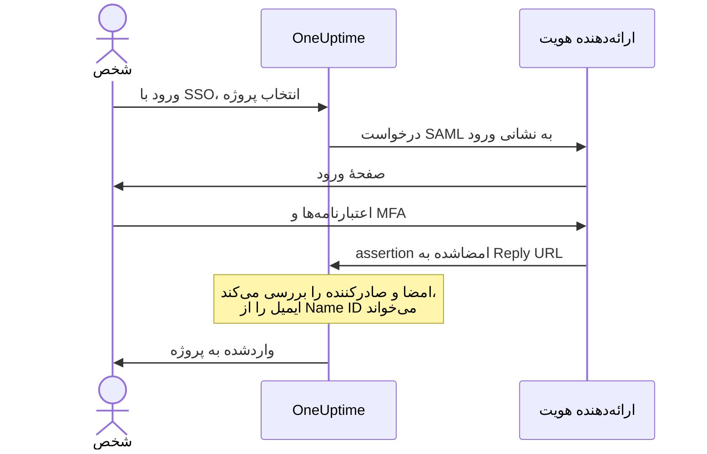

# SSO

ورود یکپارچه (SSO) به افراد پروژهٔ شما امکان می‌دهد با ارائه‌دهنده هویت (IdP) سازمانتان، از راه SAML 2.0 یا OpenID Connect، به OneUptime وارد شوند. دسترسی، گذرواژه‌ها و احراز هویت چندعاملی را در یک جا مدیریت می‌کنید و می‌توانید SSO را برای همهٔ افراد پروژه الزامی کنید.

> [!NOTE]
> **نسخه:** SSO، از جمله «Require SSO for login»، بخشی از همهٔ نسخه‌های OneUptime است: نصب‌های خودمیزبان آن را در Community Edition دارند و به مجوز نیازی نیست. در OneUptime Cloud از طرح **Scale** به بالا در دسترس است. برای اینکه ببینید هر نسخه چه چیزهایی دارد، [نسخه سازمانی](/docs/self-hosted/enterprise) را ببینید.

:::cards
- [برپا کردن یک ارائه‌دهنده SAML](#برپا-کردن-sso): آن را در OneUptime بسازید و دو نشانی به IdP خود بدهید.
- [راهنمای ارائه‌دهندگان هویت](#راهنمای-ارائهدهندگان-هویت): Keycloak، Microsoft Entra ID و Okta، گام به گام.
- [OpenID Connect](#openid-connect-oidc): به‌جای آن با یک برنامه OIDC وارد شوید.
- [الزامی کردن SSO](#الزامی-کردن-sso-برای-پروژهٔ-شما): SSO را تنها راه ورود به پروژه کنید.
:::

## ورود با SAML چگونه کار می‌کند

یک ارائه‌دهنده SAML یک پروژه را به یک برنامه در ارائه‌دهنده هویت شما وصل می‌کند. کسی که وارد می‌شود، پروژه را در صفحهٔ **ورود با SSO** در OneUptime انتخاب می‌کند، در IdP شما وارد می‌شود و واردشده بازمی‌گردد.



OneUptime فقط چند چیز را از assertionی که IdP شما می‌فرستد می‌خواند:

| از assertion | OneUptime با آن چه می‌کند |
| --- | --- |
| امضا | آن را با **گواهی عمومی** ارائه‌دهنده بررسی می‌کند. پاسخ باید امضا شده باشد و نباید رمزنگاری شده باشد. |
| Issuer | باید دقیقاً با **صادرکننده** ارائه‌دهنده یکی باشد. |
| Name ID | نشانی ایمیل شخص. باید یک نشانی ایمیل معتبر باشد. |
| `http://schemas.microsoft.com/identity/claims/displayname` | نام شخص، که OneUptime هنگام ساختن حساب او به کار می‌برد. اختیاری. |

کسانی که برای نخستین بار وارد می‌شوند به **تیم‌ها**ی ارائه‌دهنده می‌پیوندند، و همین تیم‌ها تعیین می‌کنند که چه کاری می‌توانند بکنند: [نقش‌ها و تیم‌ها برای کاربران SSO](#نقشها-و-تیمها-برای-کاربران-sso) را ببینید.

> [!NOTE]
> در OneUptime Cloud، نخستین باری که کسی با یکی از ارائه‌دهندگان SAML یا OIDC پروژه به آن پروژه وارد می‌شود، OneUptime به‌جای وارد کردن او، پیوندی برایش ایمیل می‌کند. او پیوند را باز می‌کند، تأیید می‌کند که ورود یکپارچهٔ پروژه می‌تواند او را وارد کند، و ورود را ادامه می‌دهد. پیوند ۲۴ ساعت کار می‌کند. این کار برای هر پروژه یک بار انجام می‌شود، و اگر پروژه را ترک کند و برگردد، دوباره انجام می‌شود. نصب‌های خودمیزبان افراد را بی‌درنگ وارد می‌کنند.

## برپا کردن SSO

به دسترسی افزودن ارائه‌دهندگان SSO نیاز دارید — **Project Owner**، **Project Admin** یا **Create Project SSO** — و در OneUptime Cloud به طرح **Scale**. برای سمت ارائه‌دهنده هویت خود، [راهنمای ارائه‌دهندگان هویت](#راهنمای-ارائهدهندگان-هویت) را ببینید.

:::steps
1. **رفتن به تنظیمات پروژه**

   - به پروژه OneUptime خود بروید
   - به **تنظیمات پروژه** > **امنیت** > **SSO** بروید

2. **ساخت پیکربندی SSO**

   - روی **ساخت SSO** کلیک کنید
   - یک **نام** برای پیکربندی SSO وارد کنید (برای نمونه «Keycloak SAML» یا «Okta SAML»)
   - **نشانی ورود** را از ارائه‌دهنده هویت خود وارد کنید
   - **صادرکننده** (Entity ID) را از ارائه‌دهنده هویت خود وارد کنید
   - **گواهی عمومی** را از ارائه‌دهنده هویت خود بچسبانید
   - در گام **ورود**، **تیم‌ها** با تیم اعضای پروژه شما آغاز می‌شود: کسانی که برای نخستین بار وارد می‌شوند به این تیم‌ها می‌پیوندند. فقط تیم‌هایی پذیرفته می‌شوند که خودتان بتوانید کسی را به آن‌ها دعوت کنید: تیمی که دسترسی بیشتری از دسترسی شما می‌دهد، زیر **تیم‌ها** نام برده می‌شود
   - بقیه در **فیلدهای بیشتر** از پیش پر شده‌اند: **روش امضا** (`RSA-SHA256`)، **روش خلاصه‌سازی** (`SHA256`) و یک توضیح («Sign in with» و نام). فقط اگر ارائه‌دهنده هویت شما لازم دارد آن‌ها را تغییر دهید

3. **گرفتن فراداده SSO از OneUptime**
   - ذخیره کردن، پنجرهٔ **SSO Configuration** را باز می‌کند. می‌توانید آن را دوباره با دکمهٔ **مشاهده پیکربندی SSO** باز کنید
   - **Identifier (Entity ID)** را کپی کنید، مانند `https://oneuptime.com/<project-id>/<provider-id>` — در پیکربندی IdP شما لازم است
   - **Reply URL (Assertion Consumer Service URL)** را کپی کنید، مانند `https://oneuptime.com/identity/idp-login/<project-id>/<provider-id>` — در پیکربندی IdP شما لازم است
   - ارائه‌دهندهٔ تازه خاموش آغاز می‌شود. وقتی IdP شما این دو مقدار را داشت، ارائه‌دهنده را ویرایش کنید و **فعال** را روشن کنید

4. **آزمودن ارائه‌دهنده**
   - پیوند کارت **Test Single Sign On (SSO)** را باز کنید و در صفحه‌ای که باز می‌شود ارائه‌دهنده را انتخاب کنید. به صفحهٔ ورود ارائه‌دهنده هویت خود فرستاده می‌شوید و سپس واردشده به OneUptime برمی‌گردید
   - وقتی کار کرد، می‌توانید SSO را برای پروژه [الزامی کنید](#الزامی-کردن-sso-برای-پروژهٔ-شما)
:::

## راهنمای ارائه‌دهندگان هویت

ارائه‌دهنده هویت خود را انتخاب کنید. هر راهنما مقدارهای IdP را می‌گیرد، ارائه‌دهنده را در OneUptime می‌سازد و سپس **Identifier (Entity ID)** و **Reply URL** را از OneUptime به IdP می‌دهد.

:::tabs
@tab Keycloak
Keycloak یک راه‌حل متن‌باز و پرطرفدار برای مدیریت هویت و دسترسی است. به یک نمونهٔ در حال اجرای Keycloak با یک realm، و دسترسی مدیر به Keycloak و OneUptime هر دو نیاز دارید.

:::steps
1. **گردآوری مقدارهای realm**

   - **نشانی ورود**: `https://<your-keycloak-domain>/auth/realms/<your-realm>/protocol/saml`
   - **صادرکننده**: `https://<your-keycloak-domain>/auth/realms/<your-realm>`
   - **گواهی**: گواهی امضای realm. `https://<your-keycloak-domain>/auth/realms/<your-realm>/protocol/saml/descriptor` را باز کنید و مقدار `X509Certificate` را کپی کنید، یا **Realm settings** > **Keys** را باز کنید و روی **Certificate** کلید RS256 کلیک کنید

   Keycloak ۱۷ و نسخه‌های بعدی این نشانی‌ها را بدون پیشوند `/auth` ارائه می‌کنند. گواهی را میان خط‌های خودش بگذارید، این‌گونه:

   ```text
   -----BEGIN CERTIFICATE-----
   MIICnzCCAYcCBgFyPZ8QFzANBgkqhkiG.......
   -----END CERTIFICATE-----
   ```

2. **ساخت ارائه‌دهنده در OneUptime**

   به **تنظیمات پروژه** > **امنیت** > **SSO** بروید، روی **ساخت SSO** کلیک کنید و این‌ها را پر کنید:
   - **نام**: یک نام توصیفی (برای نمونه `my-project-oneuptime`)
   - **نشانی ورود** و **صادرکننده**: مقدارهای بالا
   - **گواهی عمومی**: گواهی، میان خط‌های `BEGIN CERTIFICATE` و `END CERTIFICATE` خودش
   - **روش امضا** و **روش خلاصه‌سازی**: از پیش در **فیلدهای بیشتر** تنظیم شده‌اند (`RSA-SHA256` و `SHA256`)

   ذخیره کنید و **Identifier (Entity ID)** و **Reply URL (Assertion Consumer Service URL)** را از پنجره‌ای که باز می‌شود کپی کنید.

3. **ساخت کلاینت Keycloak**

   در Keycloak، **Clients** را در realm خود باز کنید و یک کلاینت بسازید یا کلاینتی موجود را ویرایش کنید:
   - **Client Protocol** (نوع کلاینت): `saml`
   - **Client ID**: **Identifier (Entity ID)** از OneUptime
   - **Root URL** و **Valid Redirect URIs**: نشانی OneUptime شما
   - **Assertion Consumer Service POST Binding URL**: **Reply URL (Assertion Consumer Service URL)** از OneUptime

4. **تنظیم کلاینت**

   - **Name ID Format** را روی `email` بگذارید و **Force Name ID Format** را روشن کنید، تا Keycloak همیشه ایمیل را به‌عنوان Name ID بفرستد
   - در زبانهٔ **Keys** کلاینت، **Client signature required** (در **Signing keys config**) را خاموش کنید: OneUptime درخواست‌هایش را امضا نمی‌کند

5. **روشن کردن و آزمودن ارائه‌دهنده**

   در OneUptime ارائه‌دهنده را ویرایش کنید و **فعال** را روشن کنید، سپس پیوند کارت **Test Single Sign On (SSO)** را باز کنید و ارائه‌دهنده را انتخاب کنید. باید به صفحهٔ ورود Keycloak و سپس دوباره به OneUptime فرستاده شوید.
:::
@tab Microsoft Entra ID
Microsoft Entra ID (پیش‌تر Azure AD / Active Directory) سرویس هویت ابری Microsoft است. به یک tenant نیاز دارید که از برنامه‌های سازمانی با SAML SSO پشتیبانی کند، و دسترسی مدیر به Entra ID و OneUptime هر دو.

:::steps
1. **ساخت یک برنامهٔ سازمانی در Entra ID**

   - به [Microsoft Entra admin center](https://entra.microsoft.com) وارد شوید
   - به **Identity** > **Applications** > **Enterprise applications** بروید، روی **+ New application** و سپس **+ Create your own application** کلیک کنید
   - یک نام وارد کنید (برای نمونه «OneUptime»)، **Integrate any other application you don't find in the gallery (Non-gallery)** را انتخاب کنید و روی **Create** کلیک کنید

2. **کپی کردن مقدارهای SAML از Entra ID**

   - در برنامه به **Single sign-on** بروید و **SAML** را انتخاب کنید
   - در **SAML Certificates**، **Certificate (Base64)** را دانلود کنید، فایل را در یک ویرایشگر متن باز کنید و محتوایش را کپی کنید
   - در **Set up OneUptime**، **Login URL** و **Microsoft Entra Identifier** (در tenantهای قدیمی‌تر **Azure AD Identifier**) را کپی کنید

3. **ساخت ارائه‌دهنده در OneUptime**

   به **تنظیمات پروژه** > **امنیت** > **SSO** بروید، روی **ساخت SSO** کلیک کنید و این‌ها را پر کنید:
   - **نام**: یک نام توصیفی (برای نمونه `Azure AD SAML`)
   - **نشانی ورود**: **Login URL**
   - **صادرکننده**: **Microsoft Entra Identifier**
   - **گواهی عمومی**: گواهی Base64، همراه با خط‌های `BEGIN CERTIFICATE` و `END CERTIFICATE`
   - **روش امضا** و **روش خلاصه‌سازی**: از پیش در **فیلدهای بیشتر** تنظیم شده‌اند (`RSA-SHA256` و `SHA256`)

   ذخیره کنید و **Identifier (Entity ID)** و **Reply URL (Assertion Consumer Service URL)** را از پنجره‌ای که باز می‌شود کپی کنید.

4. **دادن نشانی‌های OneUptime به Entra ID**

   در **Basic SAML Configuration** روی **Edit** کلیک کنید و این‌ها را تنظیم کنید:
   - **Identifier (Entity ID)**: **Identifier (Entity ID)** از OneUptime
   - **Reply URL (Assertion Consumer Service URL)**: **Reply URL** از OneUptime

   روی **Save** کلیک کنید.

5. **فرستادن ایمیل به‌عنوان Name ID**

   در **Attributes & Claims** روی **Edit** کلیک کنید:
   - **Unique User Identifier (Name ID)** را روی نشانی ایمیل کاربر بگذارید: `user.mail`، یا `user.userprincipalname` در جایی که همان نشانی ایمیل است
   - **Name identifier format** را روی `Email address` بگذارید
   - اگر خواستید، یک claim با نام `http://schemas.microsoft.com/identity/claims/displayname` و ویژگی منبع `user.displayname` بیفزایید تا حساب‌های تازه نام شخص را بگیرند. OneUptime دیگر claimها را نادیده می‌گیرد

6. **واگذاری کاربران و گروه‌ها**

   در **Users and groups** برنامه روی **+ Add user/group** کلیک کنید، کاربران و گروه‌هایی را که باید دسترسی SSO بگیرند انتخاب کنید و روی **Assign** کلیک کنید.

7. **روشن کردن و آزمودن ارائه‌دهنده**

   در OneUptime ارائه‌دهنده را ویرایش کنید و **فعال** را روشن کنید، سپس پیوند کارت **Test Single Sign On (SSO)** را باز کنید و ارائه‌دهنده را انتخاب کنید. باید به صفحهٔ ورود Microsoft و سپس دوباره به OneUptime فرستاده شوید.
:::
@tab Okta
Okta یک بستر هویت پرکاربرد با SAML SSO است. به یک سازمان Okta با دسترسی مدیر، و دسترسی مدیر به OneUptime نیاز دارید.

:::steps
1. **ساخت یک برنامهٔ SAML در Okta**

   - در Okta Admin Console به **Applications** > **Applications** بروید و روی **Create App Integration** کلیک کنید
   - **SAML 2.0** را انتخاب کنید و روی **Next** کلیک کنید، «OneUptime» را به‌عنوان **App name** وارد کنید و روی **Next** کلیک کنید
   - Okta پیش از نشان دادن نشانی‌های خودش، نشانی‌های OneUptime را می‌خواهد. فعلاً نشانی OneUptime خود (برای نمونه `https://oneuptime.com`) را به‌عنوان **Single sign-on URL** و **Audience URI (SP Entity ID)** وارد کنید: هر دو را در گام ۴ جایگزین می‌کنید
   - **Name ID format** را روی `EmailAddress` و **Application username** را روی `Email` بگذارید
   - روی **Next** کلیک کنید، **I'm an Okta customer adding an internal app** را انتخاب کنید و روی **Finish** کلیک کنید

2. **کپی کردن مقدارهای SAML از Okta**

   در زبانهٔ **Sign On** برنامه، در **SAML Signing Certificates**، گواهی فعال را پیدا کنید:
   - روی **Actions** > **View IdP metadata** کلیک کنید و **نشانی ورود** (Identity Provider Single Sign-On URL) و **صادرکننده** (Identity Provider Issuer) را کپی کنید
   - روی **Actions** > **Download certificate** کلیک کنید، فایل `.cert` را در یک ویرایشگر متن باز کنید و محتوایش را کپی کنید

3. **ساخت ارائه‌دهنده در OneUptime**

   به **تنظیمات پروژه** > **امنیت** > **SSO** بروید، روی **ساخت SSO** کلیک کنید و این‌ها را پر کنید:
   - **نام**: یک نام توصیفی (برای نمونه `Okta SAML`)
   - **نشانی ورود** و **صادرکننده**: مقدارهای Okta
   - **گواهی عمومی**: گواهی، همراه با خط‌های `BEGIN CERTIFICATE` و `END CERTIFICATE`
   - **روش امضا** و **روش خلاصه‌سازی**: از پیش در **فیلدهای بیشتر** تنظیم شده‌اند (`RSA-SHA256` و `SHA256`)

   ذخیره کنید و **Identifier (Entity ID)** و **Reply URL (Assertion Consumer Service URL)** را از پنجره‌ای که باز می‌شود کپی کنید.

4. **دادن نشانی‌های OneUptime به Okta**

   در زبانهٔ **General** برنامه، در **SAML Settings** روی **Edit** و سپس **Next** کلیک کنید و این‌ها را تنظیم کنید:
   - **Single sign-on URL**: **Reply URL (Assertion Consumer Service URL)** از OneUptime
   - **Audience URI (SP Entity ID)**: **Identifier (Entity ID)** از OneUptime

   اگر خواستید، یک attribute statement با نام `http://schemas.microsoft.com/identity/claims/displayname` و مقدار `user.firstName + " " + user.lastName` بیفزایید تا حساب‌های تازه نام شخص را بگیرند. روی **Next** و سپس **Finish** کلیک کنید.

5. **واگذاری افراد**

   در زبانهٔ **Assignments** روی **Assign** > **Assign to People** یا **Assign to Groups** کلیک کنید، کسانی را که باید دسترسی SSO بگیرند انتخاب کنید، برای هر کدام روی **Assign** و سپس روی **Done** کلیک کنید.

6. **روشن کردن و آزمودن ارائه‌دهنده**

   در OneUptime ارائه‌دهنده را ویرایش کنید و **فعال** را روشن کنید، سپس پیوند کارت **Test Single Sign On (SSO)** را باز کنید و ارائه‌دهنده را انتخاب کنید. باید به صفحهٔ ورود Okta و سپس دوباره به OneUptime فرستاده شوید.
:::
@tab دیگر
SSO در OneUptime از SAML 2.0 استفاده می‌کند و با هر ارائه‌دهنده هویت سازگاری کار می‌کند:

:::steps
1. **نشانی ورود** (نقطه پایانی SSO آن)، **صادرکننده** (Entity ID آن) و **گواهی عمومی** (گواهی امضای X.509 آن) را از ارائه‌دهنده هویت خود بگیرید. اگر IdP شما آن‌ها را فقط پس از ساختن یک برنامه نشان می‌دهد، برنامه را با نشانی OneUptime خود به‌عنوان نشانی‌های موقت بسازید.
2. در OneUptime ارائه‌دهنده را با این مقدارها بسازید و **Identifier (Entity ID)** و **Reply URL (Assertion Consumer Service URL)** را از پنجرهٔ **SSO Configuration** (یا **مشاهده پیکربندی SSO**) کپی کنید.
3. در برنامهٔ SAML ارائه‌دهنده هویت خود، **Assertion Consumer Service URL / Reply URL** و **Entity ID / Audience URI** را روی مقدارهای OneUptime، و **Name ID Format** را روی نشانی ایمیل بگذارید.
4. **روش امضا** (`RSA-SHA256`) و **روش خلاصه‌سازی** (`SHA256`) از پیش در **فیلدهای بیشتر** تنظیم شده‌اند؛ فقط اگر ارائه‌دهنده هویت شما به شکل دیگری امضا می‌کند آن‌ها را تغییر دهید
5. **فعال** را برای ارائه‌دهنده روشن کنید و آن را با پیوند کارت **Test Single Sign On (SSO)** بیازمایید.
:::
:::

## OpenID Connect (OIDC)

یک پروژه می‌تواند از راه یک ارائه‌دهنده OpenID Connect هم وارد شود، مانند Google Workspace، Okta، Microsoft Entra ID، Auth0 یا Keycloak. به دسترسی افزودن ارائه‌دهندگان OIDC (**Project Owner**، **Project Admin** یا **Create Project OIDC**) و در OneUptime Cloud به طرح **Scale** نیاز دارید.

:::steps
1. نزد ارائه‌دهنده هویت خود یک برنامه (یک کلاینت OIDC) ثبت کنید که بتواند از جریان authorization code با PKCE استفاده کند، و **نشانی صادرکننده**، **شناسه کلاینت** و **کلید محرمانه کلاینت** آن را کپی کنید.
2. در OneUptime به **تنظیمات پروژه** > **امنیت** > **OIDC** بروید و روی **ساخت OIDC** کلیک کنید.
3. یک **نام** (آنچه افراد در صفحهٔ ورود می‌بینند)، **نشانی صادرکننده**، **شناسه کلاینت** و **کلید محرمانه کلاینت** را وارد کنید. می‌توانید به‌جای آن نشانی کشف ارائه‌دهنده را در **نشانی صادرکننده** بچسبانید.
4. در گام **ورود**، **تیم‌ها** با تیم اعضای پروژه شما آغاز می‌شود: کسانی که برای نخستین بار وارد می‌شوند به این تیم‌ها می‌پیوندند. بقیه در **فیلدهای بیشتر** از پیش پر شده‌اند: **نشانی کشف** (صادرکننده و پس از آن `/.well-known/openid-configuration`)، **دامنه‌ها** (`openid email profile`)، نام‌های claim یعنی `email` و `name`، و یک توضیح («Sign in with» و نام). فقط اگر ارائه‌دهنده شما لازم دارد آن‌ها را تغییر دهید. فقط تیم‌هایی پذیرفته می‌شوند که خودتان بتوانید کسی را به آن‌ها دعوت کنید: تیمی که دسترسی بیشتری از دسترسی شما می‌دهد، زیر **تیم‌ها** نام برده می‌شود.
5. ذخیره کنید. پنجرهٔ **OIDC Configuration** با **Redirect URI** باز می‌شود: آن را به نشانی‌های بازگشت مجاز برنامهٔ خود بیفزایید. ارائه‌دهندهٔ تازه خاموش آغاز می‌شود، پس سپس آن را ویرایش کنید و **فعال** را روشن کنید.
6. پیش از الزامی کردن SSO برای پروژه، با پیوند کارت **Test OpenID Connect (OIDC)** از راه ارائه‌دهنده وارد شوید.
:::

## نقش‌ها و تیم‌ها برای کاربران SSO

OneUptime نقش‌ها یا گروه‌های ارائه‌دهنده هویت شما را نگاشت نمی‌کند. اینکه کسی چه کاری می‌تواند بکند از تیم‌هایی می‌آید که در آن‌ها عضو است: یک ارائه‌دهنده تازه‌واردان را به **تیم‌ها**ی خود می‌افزاید، و شما تیم‌ها و دسترسی‌هایشان را در OneUptime مدیریت می‌کنید، همان‌طور که [کاربران، تیم‌ها و دسترسی‌ها](/docs/permissions/index) توضیح می‌دهد. برای اینکه عضویت تیم‌ها با ارائه‌دهنده هویت شما هماهنگ بماند، از [SCIM](/docs/identity/scim) استفاده کنید.

تیم‌های یک ارائه‌دهنده تعیین می‌کنند کسانی که با آن وارد می‌شوند چه کاری می‌توانند بکنند، پس یک ارائه‌دهنده فقط با تیم‌هایی ذخیره می‌شود که ذخیره‌کننده بتواند کسی را به آن‌ها دعوت کند. هر ذخیره دوباره آن‌ها را بررسی می‌کند: ارائه‌دهنده‌ای که تیم‌هایش دسترسی بیشتری از دسترسی شما می‌دهند، فقط به دست کسی تغییر می‌کند که دسترسی‌اش آن‌ها را پوشش دهد، مانند مالک پروژه. ارائه‌دهندگانی که پیش از این بررسی ذخیره شده‌اند، همچنان افراد را به تیم‌هایشان وارد می‌کنند. هر کسی که بتواند یک ارائه‌دهنده را ویرایش کند، همچنان می‌تواند آن را خاموش کند، تا بتوان آن را بی‌درنگ متوقف کرد.

## الزامی کردن SSO برای پروژهٔ شما

برپا کردن یک ارائه‌دهنده کسی را از ورود با گذرواژه باز نمی‌دارد. برای اینکه SSO تنها راه ورود به پروژه شود، از کلید **الزامی کردن SSO برای ورود** در **تنظیمات پروژه** > **امنیت** > **SSO**، زیر ارائه‌دهندگانتان، استفاده کنید:

:::steps
1. نخست ارائه‌دهنده خود را با پیوند کارت **Test Single Sign On (SSO)** بیازمایید.
2. **الزامی کردن SSO برای ورود** را روشن کنید. OneUptime پیش از ذخیرهٔ هر چیزی می‌پرسد: از آن پس همهٔ افراد پروژه، از جمله خود شما، برای باز کردن آن باید با SSO وارد شوند، و هر کسی که با گذرواژه وارد شده است تا وقتی با SSO وارد نشود از پروژه بیرون می‌ماند.
3. برای تأیید روی **الزامی کردن SSO** کلیک کنید. کلید بی‌درنگ ذخیره می‌شود؛ دکمهٔ ذخیرهٔ جداگانه‌ای وجود ندارد.
:::

روشن کردن **الزامی کردن SSO برای ورود** به ارائه‌دهنده‌ای نیاز دارد که افراد را به پروژه وارد کند: یکی از ارائه‌دهندگان SAML یا OIDC خود پروژه که روشن است، یا یک ارائه‌دهندهٔ سراسری روشن که افراد را به آن وارد می‌کند. بدون آن، OneUptime نمی‌پذیرد و می‌گوید نخست یک ارائه‌دهنده را برای پروژه روشن کنید و بیازمایید. اگر ارائه‌دهنده‌ای را انتخاب کنید که پروژه الزامی می‌کند، باید یکی از همین‌ها باشد، و وقتی بعداً ارائه‌دهندهٔ دیگری را الزامی کنید هم همین پرسیده می‌شود.

ذخیره‌ای که **الزامی کردن SSO برای ورود** را روشن می‌فرستد در حالی که از پیش روشن است، یا ارائه‌دهنده‌ای را نام می‌برد که پروژه از پیش الزامی کرده است، به همین شکل بررسی می‌شود — API، Terraform و ابزارهای دیگر اغلب در هر ذخیره همهٔ تنظیم‌ها را می‌فرستند. پس تا وقتی پروژه هیچ ارائه‌دهنده‌ای ندارد که افراد را وارد کند، یا ارائه‌دهندهٔ الزامی آن از آن پس خاموش شده است، چنین ذخیره‌ای با همان کلمات رد می‌شود، هر چیز دیگری هم که تغییر دهد: نخست یک ارائه‌دهنده را روشن کنید، ارائه‌دهندهٔ دیگری را الزامی کنید، یا **الزامی کردن SSO برای ورود** را خاموش کنید.

یک پروژهٔ تازه هم به همین قاعده پایبند است. هنوز ارائه‌دهنده‌ای از خودش ندارد، پس ساختن آن با **الزامی کردن SSO برای ورود** روشن — که فقط یک مدیر ارشد می‌تواند — به یک ارائه‌دهندهٔ سراسری روشن نیاز دارد که افراد را به همهٔ پروژه‌ها وارد کند، و بدون آن با همان کلمات رد می‌شود. پروژه را بسازید، ارائه‌دهنده‌اش را برپا کنید و بیازمایید، سپس کلید را روشن کنید.

تا وقتی کل سرور SSO را الزامی می‌کند (**Admin** > **تنظیمات** > **احراز هویت** > **الزامی کردن SSO برای ورود**)، ساختن هر پروژه‌ای هم به چنین ارائه‌دهندهٔ سراسری‌ای نیاز دارد، وگرنه هیچ‌کس، از جمله سازنده‌اش، نمی‌توانست پروژه را باز کند. بدون آن، ساختن پروژه رد می‌شود و پیام از یک مدیر سرور می‌خواهد که یکی را روشن کند. مدیران ارشد همچنان می‌توانند پروژه بسازند.

خاموش کردن **الزامی کردن SSO برای ورود** به محض تغییر کلید ذخیره می‌شود و اعضا را بی‌درنگ با گذرواژه‌شان راه می‌دهد — مگر اینکه کسی درست در همان لحظه دوباره روشنش کند، که در آن صورت ممکن است تا یک دقیقه طول بکشد تا یک سرور برنامه همراه شود. مالکان پروژه، مدیران پروژه و اعضایی که دسترسی **Edit Project** دارند می‌توانند آن را تغییر دهند؛ بقیه کلید را قفل‌شده می‌بینند، همراه با دسترسی‌ای که لازم دارند.

> [!NOTE]
> در OneUptime Cloud، الزامی کردن SSO به طرح **Scale** نیاز دارد و خاموش کردن آن در هر طرحی کار می‌کند. زیر Scale، **تنظیمات پروژه** > **امنیت** > **SSO** پیشنهاد ارتقای طرح را نشان می‌دهد؛ پروژه‌ای که یک دورهٔ آزمایشی Scale آن را با SSO الزامی رها کرده است، **الزامی کردن SSO برای ورود** را هم همان‌جا، زیر پیشنهاد، می‌یابد تا بتوان آن را خاموش کرد. روشن کردن دوبارهٔ آن به **Scale** نیاز دارد.

## خاموش کردن یا حذف یک ارائه‌دهنده

| آنچه تغییر می‌دهید | کسانی که با این ارائه‌دهنده وارد شده‌اند |
| --- | --- |
| خاموش کردن یا حذف آن | در جایی که SSO الزامی است، در درخواست بعدی دوباره با SSO وارد می‌شوند |
| گواهی یا کلید محرمانه کلاینت تازه، نشانی‌های دیگر، نام تازه یا تیم‌های دیگر | وارد می‌مانند |
| روشن کردن آن | بی‌درنگ می‌توانند با آن وارد شوند |

خاموش کردن یا حذف یک ارائه‌دهنده SAML یا OIDC، ورودهایی را که داده است پایان می‌دهد. در پروژه‌ای که SSO را الزامی می‌کند، خودش یا چون کل سرور الزامی می‌کند:

- هر کسی که با آن وارد شده است باید در درخواست بعدی دوباره با SSO وارد شود، و صفحه‌هایی که باز دارند بی‌درنگ دیگر به‌روزرسانی زنده نمی‌گیرند.
- کلاینت MCPی که کسی پس از ورود با آن وصل کرده است، در پروژه از کار می‌افتد. پس از ورود با SSO دوباره آن را وصل کنید.
- روشن کردن دوبارهٔ ارائه‌دهنده آن ورودها را برنمی‌گرداند: افراد دوباره با آن وارد می‌شوند.

تغییر هر چیز دیگری در یک ارائه‌دهنده همه را وارد نگه می‌دارد: گواهی یا کلید محرمانه کلاینت تازه، نشانی‌های دیگر، نام تازه یا تیم‌های دیگر. ورودهایشان هنگام انجام شدن بررسی شده‌اند، و ورود بعدی از تنظیم‌های تازه استفاده می‌کند.

تا وقتی پروژه SSO را الزامی می‌کند، OneUptime راهی برای ورود نگه می‌دارد: نمی‌توانید آخرین ارائه‌دهنده‌ای را که افراد می‌توانند با آن به پروژه وارد شوند — با شمردن ارائه‌دهندگان سراسری‌ای که افراد را به آن وارد می‌کنند — یا ارائه‌دهنده‌ای را که پروژه الزامی می‌کند، خاموش یا حذف کنید. نخست **الزامی کردن SSO برای ورود** را خاموش کنید.

روشن کردن یک ارائه‌دهنده به افراد امکان می‌دهد بی‌درنگ با آن وارد شوند.

وقتی کل سرور SSO را الزامی می‌کند (**Admin** > **تنظیمات** > **احراز هویت** > **الزامی کردن SSO برای ورود**)، هر پروژه به همین شکل راهی برای ورود نگه می‌دارد، حتی پروژه‌ای که خودش SSO را الزامی نمی‌کند: نخست ارائه‌دهندهٔ دیگری را برای آن روشن کنید.

ارائه‌دهندگان سراسری هم به همین قاعده پایبندند: تغییری در یکی از آن‌ها یا در پروژه‌های متصل به آن، که پروژه‌ای را که SSO را الزامی می‌کند بی‌ارائه‌دهنده بگذارد، با نام بردن از آن پروژه رد می‌شود. [SSO سراسری](/docs/identity/global-sso#خاموش-کردن-یا-حذف-یک-ارائهدهنده) را ببینید.

در جایی که نه پروژه و نه سرور SSO را الزامی نمی‌کنند، خاموش کردن یک ارائه‌دهنده ورودهای تازه با آن را متوقف می‌کند. کسانی که از پیش وارد شده‌اند وارد می‌مانند، همان‌طور که کسانی که با گذرواژه وارد شده‌اند.

## ارائه‌دهندگانی که زیر طرح Scale مانده‌اند

ارائه‌دهنده SAML یا OIDCی که پروژه هنوز دارد، پس از پایان دورهٔ آزمایشی Scale یا پایین آمدن طرح، همچنان افراد را وارد می‌کند. پس زیر Scale، صفحه‌های **SSO** و **OIDC** ارائه‌دهندگان پروژه را زیر پیشنهاد ارتقا فهرست می‌کنند (**ارائه‌دهندگان SAML که هنوز تنظیم شده‌اند**، **ارائه‌دهندگان OIDC که هنوز تنظیم شده‌اند**):

- **خاموش کردن** یک ارائه‌دهنده را بی‌درنگ متوقف می‌کند. OneUptime نخست می‌پرسد.
- **حذف** آن را پاک می‌کند.

افزودن یک ارائه‌دهنده، تغییر آن یا روشن کردن دوباره‌اش به **Scale** نیاز دارد. کسانی که هر کدام را می‌توانند انجام دهند همان‌هایی هستند که در Scale: خاموش کردن یک ارائه‌دهنده به دسترسی ویرایش آن و حذفش به دسترسی حذف آن نیاز دارد.

تا وقتی پروژه هنوز SSO را الزامی می‌کند، صفحه‌های **SSO** و **OIDC** آن **الزامی کردن SSO برای ورود** را هم نشان می‌دهند: پیش از خاموش کردن آخرین ارائه‌دهنده، آن را خاموش کنید. تا آن زمان آخرین ارائه‌دهنده‌ای که افراد می‌توانند با آن وارد شوند خاموش یا حذف نمی‌شود، تا هیچ‌کس از پروژه بیرون نماند.

صفحه‌های **SSO** و **OIDC** یک صفحهٔ وضعیت هم ارائه‌دهندگان خود آن را به همین شکل فهرست می‌کنند. تا وقتی صفحهٔ وضعیت هنوز SSO را الزامی می‌کند، هر دو صفحه **الزامی کردن SSO برای ورود** را هم نشان می‌دهند: پیش از خاموش کردن ارائه‌دهندگانش آن را خاموش کنید، وگرنه کاربران خصوصی آن اصلاً نمی‌توانند وارد شوند.

## رفع اشکال

:::details "SSO Config not found"
ارائه‌دهنده خاموش است، یا پیوند برای ارائه‌دهنده‌ای است که دیگر وجود ندارد. ارائه‌دهندهٔ تازه خاموش آغاز می‌شود: آن را ویرایش کنید و **فعال** را روشن کنید.
:::

:::details "No teams added."
شخص هنوز در پروژه نیست، و ارائه‌دهنده هیچ **تیم‌ها**یی ندارد که او را به آن‌ها بیفزاید. ارائه‌دهنده را ویرایش کنید و دست‌کم یک تیم، مانند تیم اعضای پروژه، انتخاب کنید.
:::

:::details "Issuer URL does not match"
صادرکننده در assertion از IdP شما، **صادرکننده** ارائه‌دهنده نیست. آن را دوباره از IdP خود کپی کنید — نشانی realm در Keycloak، **Microsoft Entra Identifier**، یا Identity Provider Issuer در Okta — تا این دو دقیقاً یکی باشند.
:::

:::details ورود با خطای امضا یا گواهی شکست می‌خورد
گواهی امضای کنونی IdP را در **گواهی عمومی** بچسبانید، همراه با خط‌های `BEGIN CERTIFICATE` و `END CERTIFICATE`. برای Entra ID گواهی **Base64** را دانلود کنید، نه گواهی خام را؛ برای Okta گواهی امضای فعال را؛ برای Keycloak گواهی realm درست را.
:::

:::details "Encrypted SAML Responses are not supported"
OneUptime رمز assertionها را نمی‌گشاید. رمزنگاری assertion را برای برنامه در IdP خود خاموش کنید تا یک assertion امضاشدهٔ رمزنگاری‌نشده بفرستد.
:::

:::details "SAML response did not include a valid email address"
OneUptime نشانی ایمیل را از Name ID می‌خواند. Name ID را روی ایمیل کاربر بگذارید: در Keycloak **Name ID Format** با مقدار `email` همراه با **Force Name ID Format**، در Entra ID **Unique User Identifier (Name ID)**، یا در Okta **Name ID format** با مقدار `EmailAddress` و **Application username** با مقدار `Email`. نشانی باید با حساب OneUptime شخص یکی باشد.
:::

:::details Entra ID: AADSTS700016
**Identifier (Entity ID)** در Entra ID با مقدار OneUptime یکی نیست. آن را دوباره از **مشاهده پیکربندی SSO** کپی کنید؛ هر دو مقدار باید یکسان باشند.
:::

:::details Okta: ۴۰۴ یا ناهمخوانی audience
**Single sign-on URL** در Okta باید دقیقاً **Reply URL** از OneUptime باشد، و **Audience URI** دقیقاً **Identifier (Entity ID)** از OneUptime. بررسی کنید که هر دو جای مقدارهای موقت را گرفته‌اند.
:::

:::details کاربر به برنامه واگذار نشده است
Entra ID و Okta فقط کسانی را وارد می‌کنند که به برنامه واگذار شده‌اند. کاربر، یا گروهی را که در آن است، واگذار کنید.
:::

:::details Keycloak: حلقهٔ بازگشت
بررسی کنید که **Valid Redirect URIs** و **Assertion Consumer Service POST Binding URL** روی کلاینت در realm درست، مانند بالا تنظیم شده باشند.
:::

## گام‌های بعدی

:::cards
- [SSO سراسری](/docs/identity/global-sso): یک ارائه‌دهنده هویت برای همهٔ پروژه‌های یک نمونهٔ خودمیزبان.
- [SCIM](/docs/identity/scim): بگذارید ارائه‌دهنده هویت شما افراد را خودکار بیفزاید و بردارد.
- [کاربران، تیم‌ها و دسترسی‌ها](/docs/permissions/index): تیم‌هایی که تازه‌واردان به آن‌ها می‌پیوندند به آن‌ها چه اجازه‌ای می‌دهند.
:::
