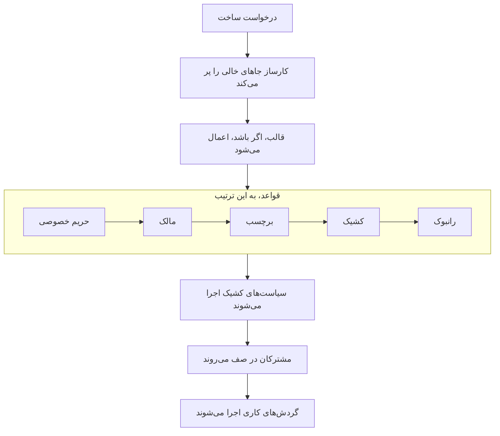

# اعلام یک حادثه

اعلام حادثه رکوردی می‌سازد که تیم شما از روی آن کار می‌کند: شماره، شدت و وضعیتی آغازین می‌گیرد، سیاست‌های کشیکش آدم‌ها را فرا می‌خوانند، و — مگر خلافش را بگویید — مشترکان صفحه وضعیت از آن باخبر می‌شوند. این صفحه پنج راه اعلام حادثه را، فیلدبه‌فیلد، می‌پیماید و آنچه را همان لحظه که حادثه پدید می‌آید رخ می‌دهد توضیح می‌دهد.

:::cards
- [اعلام دستی](#اعلام-دستی): فرم سه‌گامی، فیلدبه‌فیلد.
- [اعلام از روی قالب](#اعلام-از-روی-قالب): همان نوع حادثه، هر بار از پیش پرشده.
- [اعلام از معیارهای مانیتور](#اعلام-خودکار-از-معیارهای-مانیتور): بگذارید بررسی ناموفق آن را برایتان باز کند.
- [اعلام از راه API](#اعلام-از-راه-api): از کد خودتان، یک اسکریپت یا ابزاری دیگر.
:::

## پنج راه اعلام حادثه

پنج راه هست که حادثه‌ای به OneUptime می‌رسد، و همه به یک جا ختم می‌شوند: سطری در جدول `Incident` با یک شدت، یک وضعیت جاری و فهرستی از منابع متأثر. تفاوت فقط در این است که چه کسی فیلدها را پر می‌کند — شما در ساعت سه بامداد، قالبی ذخیره‌شده، معیارهای یک مانیتور، کد خودتان که API را فرا می‌خواند، یا کسی بیرون از تیمتان که فرمی را پر می‌کند.

| اگر می‌خواهید… | برگزینید |
| ------------------------------------------------------------ | --------------------------------------------------------------------------- |
| حادثه‌ای را دستی باز کنید و همه‌چیز را پر کنید | جادوگر **Declare Incident** |
| نوع تکرارشونده‌ای از حادثه را با فیلدهای از پیش پرشده باز کنید | **Create from Template** |
| وقتی بررسی‌های یک مانیتور ناموفق می‌شوند یکی خودکار باز شود | پالایه معیاری با **When filters match, declare an incident.** |
| از کد خودتان، یک اسکریپت یا ابزاری دیگر یکی باز کنید | `POST /api/incident` |
| آدم‌های بیرون از تیمتان از راه یک پیوند مشکلی را گزارش دهند | یک [فرم](/docs/forms/index) |

هر پنج راه همان مدل را می‌نویسند، پس حادثه‌ای که پروبی باز کرده دقیقاً مانند حادثه‌ای است که پاسخ‌دهنده‌ای دستی باز کرده — جز چند ستون دفترداری که کارساز روی حادثه‌های خودکار می‌گذارد. یکپارچه‌سازی‌ها هم آن را می‌نویسند: [Huntress](/docs/integrations/huntress) برای هر گزارش حادثه‌ای که SOC آن می‌فرستد یک حادثه باز می‌کند.

> [!TIP]
> می‌توانید حادثه‌ای را از روی هشدارها هم اعلام کنید: **Declare Incident** روی فهرست هشدارها، در سرصفحه یک هشدار یا در صفحه **Linked Incidents** یک هشدار همان جادوگر را، از پیش پرشده از روی هشدارها، باز می‌کند و آن‌ها را به حادثه تازه پیوند می‌دهد. جعبه‌ای روی فرم، که به‌طور پیش‌فرض تیک‌خورده است، هشدارها را تصدیق هم می‌کند تا تشدیدشان متوقف شود. [هشدارهای پیوندشده](/docs/incidents/linked-alerts) را ببینید.

## اعلام دستی

فرم **Declare New Incident** حادثه را در سه گام می‌پرسد — **Incident Details**، **Resources Affected** و **On-Call & Roles** — و سپس خلاصه‌ای برای بازبینی نشان می‌دهد. وقتی پروژه شما برخی از فیلدهای سفارشی حادثه را هنگام ساخت می‌پرسد، گام چهارمی به نام **Details** درست پس از **Resources Affected** می‌آید.

:::steps
1. **Incidents → All Incidents** را باز کنید و بالا سمت راست فهرست **Incidents** روی **Declare Incident** کلیک کنید. فرم روی **Incident Details** باز می‌شود.
2. یک **Title** بنویسید و یک **Incident Severity** برگزینید. باقی فرم اختیاری است.
3. با **Next** از گام‌های بعدی بگذرید و آنچه اکنون می‌دانید پر کنید: مانیتورها و دیگر منابع، سیاست‌های کشیک، نقش‌ها.
4. خلاصه را بخوانید و روی **Declare Incident** کلیک کنید. به حادثه تازه می‌رسید، و **Incident Feed** آن شروع به ثبت می‌کند.
:::

فقط گام نخست فیلد الزامی دارد، به‌علاوه هر فیلد سفارشی‌ای که مدیرانتان **Required on Create** علامت زده‌اند و گام **Details** آن را می‌پرسد. هر گام پیش از خلاصه یک **Next** ساده دارد، و **Declare Incident** روی خلاصه، گام آخر، است. اگر عجله دارید، **Incident Details** را پر کنید و بی آنکه گام‌های دیگر را پر کنید **Next** را بزنید: پیوست کردن منابع، افزودن سیاست‌های کشیک و واگذاری نقش‌ها می‌تواند تا صفحه‌های خود حادثه صبر کند. زدن **Enter** در یک فیلد هم به گام بعد می‌رود؛ هرگز پیش از خلاصه اعلام نمی‌کند.

> [!TIP]
> گزینه‌هایی که بیشتر حادثه‌ها هرگز لازم ندارند، تاشده زیر سرتیتر **More fields** در پایان گامشان منتظر می‌مانند؛ برای باز کردنشان روی آن کلیک کنید. تا وقتی تاشده است، سرتیتر نام آنچه را درون آن است می‌آورد و هر گزینه‌ای را که تنظیم شده باشد با مقدارش نشان می‌دهد — مثلاً از سوی یک قالب، یا هشدار خصوصی‌ای که از روی آن اعلام می‌کنید — و وقتی چیزی در آن نیاز به اصلاح داشته باشد خودبه‌خود باز می‌شود. خلاصه یکی از این گزینه‌ها را فقط وقتی فهرست می‌کند که تنظیم شده باشد — جز **Notify Status Page Subscribers**، که همیشه آن را، با اینکه به چه کسانی خبر می‌رسد، فهرست می‌کند.

**از صفحه خود یک منبع.** **Declare Incident** در زبانه **Incidents** یک مانیتور، یک میزبان، یک سرویس، یک خوشه یا بیشتر منابع دیگر همان فرم را باز می‌کند، در حالی که آن منبع از پیش در **Resources Affected** برگزیده شده است، پس یک عنوان و یک شدت تمام چیزی است که لازم دارد، و حادثه در همان زبانه‌ای که از آن آغاز کردید نشان داده می‌شود.

:::details کدام صفحه‌های منابع آن را پیشنهاد می‌کنند، و چه چیزی را برمی‌گزینند
**Declare Incident** در زبانه **Incidents** یک مانیتور، یک میزبان، یک خوشه Kubernetes، ‏Proxmox، ‏Ceph یا Docker Swarm، یک میزبان Docker یا Podman، یک vCenter، یک آرایه ذخیره‌سازی، یک ناوگان IoT، یک پایگاه داده یا یک سرویس همان جادوگر را باز می‌کند، در حالی که آن منبع از پیش در **Resources Affected** برگزیده شده (مانیتور زیر **Monitors**، و هر چیز دیگری زیر **Other Affected Resources**)، پیش از هر چیزی که قالبی بیفزاید. **Create from Template** در آن زبانه هم منبع را نگه می‌دارد. مسیر راهنما (breadcrumbs) از راه زبانه همان منبع برمی‌گردد، و پس از اعلام، مانند فهرست حادثه‌ها، به حادثه تازه می‌رسید.

زبانه **Incidents** یک آیتم موجودی، میزبان، سرویس یا خوشه Kubernetes را برمی‌گزیند که آیتم به آن اشاره دارد، و مسیر راهنما از راه زبانه همان منبع برمی‌گردد. **Create Alert** در زبانه **Alerts** یک منبع هم همین‌گونه کار می‌کند: از یک مانیتور، **Monitor** هشدار را پر می‌کند، و از هر چیز دیگری، **Other Affected Resources** را.

منبع با مجوزهای خود شما جستجو می‌شود: اگر نتوانید آن را بخوانید، یا حذف شده باشد، فرم بی هیچ انتخابی باز می‌شود.
:::

### گام ۱ — Incident Details

- **Title** — الزامی. خلاصه یک‌خطی‌ای که همه در فهرست، در Slack، و (اگر حادثه دیدنی باشد) روی صفحه وضعیت شما می‌بینند. جانگهدار: `Incident Title`.
- **Incident Severity** — الزامی. یکی از شدت‌های پیکربندی‌شده پروژه‌تان؛ پروژه‌های تازه با **Critical Incident**، **Major Incident** و **Minor Incident** بذر می‌شوند.
- **Description** — اختیاری، به مارک‌داون. این فیلدی است که روی صفحه وضعیت نمایش داده می‌شود، پس آن را برای مشتریان بنویسید نه برای تیمتان. تصویری که در آن بگذارید، تا وقتی حادثه روی صفحه‌های وضعیت دیدنی است به همه، و تا وقتی پنهان است فقط به اعضای پروژه‌تان نشان داده می‌شود. بعداً می‌توانید از **Description** در منوی کناری حادثه ویرایشش کنید.

زیر **More fields**:

- **Declared At** — از لحظه‌ای آغاز می‌شود که صفحه را باز کرده‌اید. این مهر زمانی است که هر مدتی روی حادثه از آن سنجیده می‌شود، پس اگر چیزی را ثبت می‌کنید که زودتر آغاز شده، تاریخش را عقب ببرید.
- **Initial State** — اختیاری، و در آغاز خالی. اگر خالی بماند، حادثه در وضعیتی آغاز می‌شود که `isCreatedState` دارد، که پروژه‌های تازه آن را **Identified** بذر می‌کنند — یا، وقتی از روی قالب اعلام می‌کنید، در وضعیت آغازین قالب. وضعیتی بعدی را فقط وقتی برگزینید که حادثه‌ای را ثبت می‌کنید که از پیش از آن نقطه گذشته بوده، تأییدشده یا برطرف‌شده. چنین حادثه‌ای کسی را فرانمی‌خواند — [حادثه‌ای که از پیش تأییدشده یا برطرف‌شده اعلام می‌شود](#حادثهای-که-از-پیش-تأییدشده-یا-برطرفشده-اعلام-میشود) را ببینید.
- **Labels** — اختیاری. برچسب‌ها حادثه‌های مرتبط را گروه می‌کنند تا بتوانید بر پایه آن‌ها پالایش کنید، و تیمی که مجوزهایش به برچسب‌ها محدود شده فقط حادثه‌هایی را می‌بیند که یکی از برچسب‌هایش را دارند.
- **Private Incident** — جعبه انتخاب، به‌طور پیش‌فرض خاموش (`isPrivate`). حادثه خصوصی فقط برای کاربران مالکش، اعضای تیم‌های مالکش، مدیران پروژه و مالکان پروژه دیدنی است — و صرف‌نظر از هر تنظیم دیگری، از جمله صفحه‌های وضعیتی که به آن‌ها محدود شده، از هر صفحه وضعیتی پنهان است. فهرست حادثه‌ها این‌ها را با نشان قرمز **Private** مشخص می‌کند.

> [!NOTE]
> **هشدارها و اپیزودها هم در وضعیتی که برمی‌گزینید آغاز می‌شوند.** **Create Alert**، و **Create Episode** در فهرست‌های اپیزود حادثه و اپیزود هشدار، همین **Initial State** را زیر **More fields** دارند. اگر خالی بماند، هشدار یا اپیزود در وضعیت ساخت پروژه آغاز می‌شود. وضعیتی بعدی را برگزینید تا هشدار یا اپیزودی را ثبت کنید که از پیش تأییدشده یا برطرف‌شده بوده: در همان وضعیت آغاز می‌شود، خط زمانی وضعیتش با همان شروع می‌شود، و اپیزودی که برطرف‌شده ثبت شود از همان آغاز برطرف‌شده به شمار می‌آید. به مالکانش جداگانه درباره این نخستین وضعیت خبر داده نمی‌شود، و مشترکان صفحه وضعیتِ یک اپیزود حادثه یک بار، هنگام ساخته شدن اپیزود، از آن باخبر می‌شوند. هشدار یا اپیزودی که این‌گونه ثبت شود، مانند حادثه، کسی را فرانمی‌خواند: [حادثه‌ای که از پیش تأییدشده یا برطرف‌شده اعلام می‌شود](#حادثهای-که-از-پیش-تأییدشده-یا-برطرفشده-اعلام-میشود) را ببینید. از راه API، همین انتخاب `currentAlertStateId` یا `currentIncidentStateId` است — [وضعیتی که رکورد تازه در آن آغاز می‌شود](/docs/api-reference/api-reference#وضعیتی-که-رکورد-تازه-در-آن-آغاز-میشود) را ببینید.

:::details نوشتن در ویرایشگر مارک‌داون
توضیحات — مانند یادداشت‌ها، ریشه علت، اصلاح و فیلدهای سفارشی متن غنی — در ویرایشگر مارک‌داون نوشته می‌شود. ویرایشگر در حالت دیداری باز می‌شود، که متن را قالب‌بندی‌شده نشان می‌دهد؛ **Markdown** در نوار ابزار آن به حالت مارک‌داون می‌رود، که منبع مارک‌داون را نشان می‌دهد، و **Visual** به حالت دیداری برمی‌گرداند. در یک فهرست، **Indent** و **Outdent** در نوار ابزار آن، یا Tab و Shift+Tab، یک آیتم را زیر آیتم بالایی‌اش می‌برند و دوباره بیرون می‌آورند؛ جایی که چیزی برای رفتن زیرش نیست، و بیرون از فهرست، Tab مثل همیشه به فیلد بعدی می‌رود. در حالت دیداری، **Code Block**، **Table** و **Task List** در میانه یا انتهای یک خط، خط را در جای نشانگر می‌شکنند و بلوک تازه را در خط‌هایی از آن خودش می‌گذارند — در لبه واژه‌ای پررنگ، پیوند یا کد درون‌خطی هم، بی آنکه قالب‌بندی خالی‌ای به جا بگذارند — و **Task List** درون آیتم یک فهرست، کارش را به فهرست همان آیتم می‌افزاید، نه به‌صورت زیرکار. در حالت مارک‌داون، **Code Block** و **Table** در جای نشانگر گذاشته می‌شوند، پس پیش از آن‌ها خطی تازه آغاز کنید، **Task List** خطی را که نشانگر در آن است به یک کار تبدیل می‌کند، و **Numbered List** هر سطح از فهرستی تودرتو را از ۱ شماره می‌زند. نوار ابزار در یک خط می‌ماند: فرم‌هایی که این ویرایشگر را دارند در پنجره‌ای پهن باز می‌شوند، پس در بیشتر صفحه‌ها همه دکمه‌ها جا می‌شوند، و جایی که جا نشوند — روی گوشی یا در پنجره‌ای باریک — دکمه‌هایی که جا نمی‌شوند به همان ترتیب زیر **More formatting** (**⋯**) در انتهای نوار ابزار می‌روند، و هر کدام را که آنجا برگزینید همان‌جا که نشانگر بود اعمال می‌شود. در باریک‌ترین صفحه‌ها کلید **Markdown** هم به زیر آن می‌رود.

**برگرداندن.** در حالت دیداری، Ctrl+Z (در Mac، Cmd+Z) تغییراتتان را یکی‌یکی، از تازه‌ترین، برمی‌گرداند — هم آنچه تایپ کرده‌اید و هم ویرایش‌های خود ویرایشگر: تورفتگی یا بیرون‌آمدگی، بلوکی که در خطی گذاشته، چسباندن متن قالب‌بندی‌شده یا یک بلوک — و Ctrl+Shift+Z (Cmd+Shift+Z) یا Ctrl+Y آن‌ها را به همان ترتیب دوباره انجام می‌دهد. در حالت مارک‌داون، Ctrl+Z تورفتگی یا بیرون‌آمدگی، تغییر دکمه‌های فهرست و چسباندن متن قالب‌بندی‌شده را برمی‌گرداند، اما آنچه دکمه‌های **Code Block**، **Table** و **Horizontal Rule** می‌گذارند را نه.

**چسباندن در آن.** چسباندن از Word، ‏Google Docs یا یک صفحه OneUptime — مثلاً توضیحات حادثه‌ای دیگر — فهرست‌ها و تودرتویی‌شان، پیوندها و قالب‌بندی را نگه می‌دارد، و نشانه‌های `•` چسبانده‌شده به فهرستی واقعی تبدیل می‌شوند. پیوندهایی که فقط یک آیکن‌اند، مانند لنگر کنار سرتیترها در GitHub، کنار گذاشته می‌شوند. در حالت دیداری، کد یا نقل‌قولی که درون یک خط چسبانده شود با شکستن خط بلوکی از آن خودش می‌شود، و فهرستی که درون آیتم یک فهرست چسبانده شود به‌جای تودرتو شدن درون آن آیتم، به فهرست همان آیتم می‌پیوندد — اگر در آیتم خالی‌ای چسبانده شود که Enter به جا می‌گذارد، جای همان آیتم را می‌گیرد — اما بلوک کد، نقل‌قول یا جدولی که درون آیتم چسبانده شود درون آن می‌ماند. در حالت مارک‌داون، آنچه چسباندن به بلوک تبدیل می‌کند — کد، نقل‌قول، فهرست، سرتیتر، چند بند — وقتی در میانه یک خط بنشیند، در خط‌هایی از آن خودش گذاشته می‌شود، با یک خط خالی در هر سو، و فهرستی که در انتهای خط یک آیتم فهرست، یا پس از یک `- ` تنها، چسبانده شود با تورفتگی همان آیتم به فهرستش می‌پیوندد؛ مارک‌داونی که به‌صورت متن ساده کپی کرده‌اید دقیقاً همان‌طور که هست در جای نشانگر می‌نشیند. هر چه درون بلوک کد بچسبانید دقیقاً همان‌طور که کپی کرده‌اید می‌ماند. چسباندن روی گزینشی که چند آیتم، بند یا خانه جدول را در بر می‌گیرد، آن را جایگزین می‌کند، همان‌گونه که تایپ کردن می‌کرد. در حالت دیداری، چسباندن یا دکمه **Code** روی خانه‌های جدول همه خانه‌ها و ستون‌ها را نگه می‌دارد، چسباندن هیچ نشانه فهرست، نقل‌قول یا بلوک کد خالی‌ای به جا نمی‌گذارد، و وقتی گزینش درون بلوک کدی پایان می‌یابد، فقط باقی همان خط کد به متن می‌پیوندد.

**کپی کردن از یک یادداشت.** بلوک کدی که از یک یادداشت یا توضیحات کپی شود به‌صورت بلوک کد به همان زبان چسبانده می‌شود، و خطی از آن هم که با شکست خطش کپی شود — همان‌گونه که سه‌بار کلیک در Chrome، ‏Edge و Safari آن را کپی می‌کند — همین‌طور. واژه یا بخشی از یک خط که از بلوک کد کپی شود به‌صورت کد درون‌خطی چسبانده می‌شود. در Chrome، ‏Edge و Safari، خط‌هایی که از نمای کدی کپی شوند که به‌صورت جدول کشیده شده — زبانه YAML یک منبع Kubernetes، قاب‌های ردیابی پشته یک استثنا — به‌صورت متن ساده‌شان و با تورفتگی‌شان چسبانده می‌شوند.
:::

### گام ۲ — Resources Affected

مانیتورها نخست و جداگانه می‌آیند، چون صفحه‌های وضعیت حادثه را از راه مانیتورهایش می‌بینند، و وضعیتی که مانیتورها به آن تغییر می‌کنند درست زیر آن‌ها قرار دارد.

- **Monitors** — جعبه جستجویی که مانیتورهای متأثر از حادثه را پیوست می‌کند؛ زبانه **Labels** آن هر مانیتوری را که برچسبی دارد یک‌جا می‌افزاید. صفحه وضعیت وقتی حادثه‌ای را نشان می‌دهد، و به مشترکانش درباره‌اش خبر می‌دهد، که یکی از مانیتورهای حادثه را فهرست کرده باشد، پس همین‌ها تعیین می‌کنند کدام صفحه‌های وضعیت از آن باخبر شوند (`monitors` روی حادثه).
- **Change Monitor Status to** — اختیاری، و فقط وقتی نشان داده می‌شود که دست‌کم یک مانیتور برگزیده شده باشد. وضعیت مانیتوری را برمی‌گزیند که روی هر مانیتور پیوست‌شده به این حادثه اعمال می‌شود، پس اعلام حادثه و تنزل‌یافته علامت زدن مانیتورها به‌جای دو کنش یکی است. اعلام از روی قالبی که وضعیتی تعیین کرده با وضعیت همان قالب آغاز می‌شود، که به محض برگزیدن یک مانیتور نشان داده می‌شود. وقتی هیچ مانیتوری برگزیده نشده، هیچ وضعیتی ذخیره نمی‌شود، حتی وضعیت قالب؛ آخرین مانیتور را بردارید تا این فیلد کنار برود، تا وقتی مانیتور دیگری برگزینید که انتخاب شما را برمی‌گرداند. وضعیت یک مانیتور میان همه صفحه‌های وضعیتی که آن را فهرست کرده‌اند مشترک است، پس اگر زیر **More fields** صفحه‌هایی برگزیده باشید، فرم یادآوری می‌کند که این تغییر روی صفحه‌هایی که برنگزیده‌اید هم دیده می‌شود.
- **Other Affected Resources** — جعبه جستجوی دومی برای هر چیز دیگری که حادثه بر آن اثر دارد: میزبان‌ها، خوشه‌های Kubernetes، میزبان‌های Docker و Podman، خوشه‌های Proxmox، ‏Ceph و Docker Swarm، vCenterها، آرایه‌های ذخیره‌سازی، ناوگان‌های IoT، پایگاه‌های داده و سرویس‌ها — هر آنچه جز مانیتورها کارت **Affected Resources** خودِ حادثه پیشنهاد می‌کند. زیر پوسته این‌ها روابط جداگانه‌ای روی حادثه‌اند (`hosts`، `kubernetesClusters`، `dockerHosts`، `podmanHosts`، `services` و بیشتر)، اما فرم آن‌ها را در یک انتخابگر یکی می‌کند.

یک مانیتور می‌تواند بگوید چه چیزی را می‌پاید — **Monitor → Overview → Linked Resources**، همان گونه‌های منابع **Other Affected Resources**. چنین مانیتوری را برگزینید و آنچه به آن پیوند دارد بی‌درنگ به **Other Affected Resources** افزوده می‌شود، و خطی زیر فیلد می‌گوید چه چیزی افزوده شد. هر چه نمی‌خواهید پیش از اعلام بردارید: تا روی فرم هستید چیزی دوباره برای آن مانیتور افزوده نمی‌شود، و برداشتن مانیتور آنچه را افزوده بود به جا می‌گذارد. وقتی مانیتوری از یک قالب یا از صفحه‌ای که روی آن اعلام کردید می‌آید هم همین رخ می‌دهد، و در **Create Alert** و **Schedule Maintenance** هم.

کارت **Affected Resources** حادثه هم هنگام ویرایش بعدی به همین شکل می‌پرسد: **Monitors**، **Change Monitor Status to** وقتی مانیتوری هست، سپس **Other Affected Resources**. ذخیره حادثه‌ای که دیگر مانیتوری ندارد وضعیتی را که داشت نگه می‌دارد.

زیر **More fields**:

- **Limit to these status pages** — اختیاری. اگر خالی بماند، حادثه روی هر صفحه وضعیتی که مانیتورهایش را فهرست کرده نشان داده می‌شود و به مشترکانش خبر می‌دهد. اگر اینجا صفحه‌هایی برگزینید، فقط صفحه‌های برگزیده از میان آن‌ها به کار می‌روند؛ زبانه **Labels** هر صفحه‌ای را که برچسبی دارد یک‌جا می‌افزاید. فرم وقتی صفحه برگزیده‌ای هیچ‌کدام از مانیتورهای حادثه را فهرست نکرده باشد هشدار می‌دهد، و نیز وقتی حادثه خصوصی است، که آن را از هر صفحه وضعیتی پنهان می‌کند. [یک صفحه وضعیت برای هر مخاطب](/docs/status-pages/one-status-page-per-audience) را ببینید.
- **Notify Status Page Subscribers** — جعبه انتخاب، به‌طور پیش‌فرض روشن. کنترل می‌کند که آیا درباره ساخته شدن حادثه به مشترکان خبر داده شود (`shouldStatusPageSubscribersBeNotifiedOnIncidentCreated`). تا کردنش زیر **More fields** چیزی از کارش را تغییر نمی‌دهد: همچنان تیک‌خورده آغاز می‌شود و خلاصه همیشه فهرستش می‌کند. زیر آن، و دوباره در خلاصه پیش از ثبت، **Will notify** صفحه‌های وضعیتی را که خبردار می‌شوند با شمار «حداکثر» مشترکان برای هر کانال فهرست می‌کند، و صفحه‌هایی را که خبردار نمی‌شوند با دلیلش. وقتی کسی خبردار نخواهد شد (هیچ مانیتوری پیوست نشده، هیچ صفحه وضعیتی مانیتورها را فهرست نکرده، یا صفحه‌ها هنوز مشترکی ندارند) چیزی نشان نمی‌دهد، و فقط وقتی هشدار می‌دهد که محدوده صفحه وضعیت حادثه دلیلش باشد. در خلاصه، **Preview**، کنار **Yes**، ایمیلی را نشان می‌دهد که مشترکان هرکدام از آن صفحه‌های وضعیت دریافت می‌کنند، و **Send test to me** آن را به ایمیل حساب خود شما می‌فرستد؛ [پیش‌نمایش ایمیل پیش از فرستادن](/docs/status-pages/subscribers#پیشنمایش-ایمیل-پیش-از-فرستادن) را ببینید. برای نویز داخلی‌ای که باز هم می‌خواهید ثبت شود خاموشش کنید. حادثه آن‌گاه به‌طور پیش‌فرض بی‌صدا می‌ماند: یادداشت‌های عمومی تازه روی آن، و پنجره تغییر وضعیت در صفحه نمای کلی‌اش (**Acknowledge**، **Resolve**، یا برگزیدن وضعیتی دیگر)، با جعبه **Notify Status Page Subscribers** خودشان خاموش آغاز می‌شوند. فرم دستی در صفحه **State Timeline** و کنش انبوه **Change State** در فهرست حادثه‌ها همچنان با آن روشن آغاز می‌شوند.

> [!IMPORTANT]
> **حتی وقتی زائد به نظر می‌رسد مانیتورها را پیوست کنید.** پیوند میان حادثه و صفحه وضعیت از راه مانیتورهای حادثه می‌گذرد: صفحه وضعیت وقتی حادثه‌ای را نشان می‌دهد، و به مشترکانش درباره‌اش خبر می‌دهد، که یکی از منابعش یکی از مانیتورهای حادثه باشد. **Limit to these status pages** فقط می‌تواند این فهرست را تنگ‌تر کند، هرگز به آن نمی‌افزاید، و صفحه وضعیتی که **Only Show Incidents Scoped to This Page** را روشن دارد فقط حادثه‌های محدودشده به خودش را نشان می‌دهد. حادثه‌ای که هیچ مانیتوری پیوست ندارد به هیچ مشترک صفحه وضعیتی خبر نمی‌دهد. [منابع و گروه‌های صفحه وضعیت](/docs/status-pages/resources-and-groups) را ببینید.

پرچم **Should be visible on status page?** ‏(`isVisibleOnStatusPage`) روی جادوگر نیست؛ پیش‌فرضش true است. بعداً از **Settings** در منوی کناری حادثه تغییرش دهید، جایی که با برچسب **Visible on Status Page** آمده است.

**اعلام پنهان و انتشار بعدی.** حادثه‌ای که هنگام ساخته شدن از صفحه‌های وضعیت پنهان است به هیچ مشترکی خبر نمی‌دهد، و وضعیت اعلانش **Skipped: hidden from status pages** خوانده می‌شود. وقتی بعداً **Visible on Status Page** را روشن می‌کنید، فرم ویرایش **Notify subscribers that this incident was created** را پیشنهاد می‌کند، تا روال اعلام پنهان، دریافتن اینکه چه کسانی درگیرند و سپس انتشار، همچنان به آن‌ها خبر بدهد. تا حادثه برطرف نشده تیک‌خورده آغاز می‌شود و پس از برطرف شدن تیک‌نخورده، تا انتشار حادثه‌ای قدیمی برای ثبت در سابقه آن را تازه اعلام نکند. فقط وقتی پیشنهاد می‌شود که حادثه با **Notify Status Page Subscribers** روشن اعلام شده باشد و خصوصی نباشد — پس نه برای حادثه‌ای که از راه یک [فرم](/docs/forms/on-submit) گزارش شده، که پنهان و با این گزینه خاموش اعلام می‌شود. از راه API، همراه به‌روزرسانی‌ای که `isVisibleOnStatusPage` را `true` می‌کند `"miscDataProps": {"notifySubscribersOfIncidentCreatedOnPublish": true}` را بفرستید، یا خودتان `subscriberNotificationStatusOnIncidentCreated` را به `Pending` برگردانید. پس‌رویدادنامه‌ای که هنگام پنهان بودن حادثه منتشر شده به جعبه‌ای نیاز ندارد: روشن کردن **Visible on Status Page** آن را یک بار می‌فرستد، چنان‌که در [پس‌رویدادنامه](/docs/status-pages/subscribers#پسرویدادنامه) آمده است.

### Details — فیلدهای سفارشی حادثه شما

این گام فقط وقتی پدیدار می‌شود که دست‌کم یک فیلد سفارشی حادثه در **Incidents → Settings → Custom Fields** گزینه **Show on Create** را روشن داشته باشد — یا، وقتی از روی قالبی اعلام می‌کنید، وقتی **Custom Fields on Create** قالب فیلدی را بپرسد. این گام همان فیلدها را، به ترتیب **Order** آن‌ها — همان ترتیبی که در آن صفحه تنظیمات کشیده شده‌اند — با ورودی‌ای که نوعشان می‌خواهد می‌پرسد: فهرست کشویی، عدد، تاریخ، کلید بله/خیر، متن بلند، یا متن غنی در ویرایشگر مارک‌داون. این گام برای کسی که نمی‌تواند فیلدهای سفارشی حادثه پروژه را بخواند هم کنار گذاشته می‌شود: در OneUptime Cloud این کار به طرح **Growth** یا بالاتر، و نقشی که بتواند فیلدهای سفارشی حادثه را ببیند، نیاز دارد.

- فیلدی که **Required on Create** دارد باید پیش از اعلام پر شود. فیلد بله/خیرِ الزامی — مثلاً یک تأیید — باید روشن شود.
- مقدار 0 یا کلیدی که خاموش مانده پاسخ است، و به‌عنوان پاسخ ذخیره می‌شود.
- فیلدی که مقدارش از فیلد سفارشی یک مانیتور کپی می‌شود، وقتی حادثه مانیتوری دارد پرسیده نمی‌شود، چون مقدار هنگام ساخت حادثه از مانیتور کپی می‌شود.
- اعلام از روی قالب این گام را با مقادیر قالب آغاز می‌کند، و مقادیر قالب برای فیلدهایی که این گام نمی‌پرسد همان‌طور که هستند نگه داشته می‌شوند. مقداری که در این گام پاک کنید پاک می‌ماند. مقداری از قالب که دیگر با فیلدش جور نیست — گزینه‌ای از فهرست کشویی که از آن پس حذف شده — کنار گذاشته می‌شود و حادثه را رد نمی‌کند.
- اعلام از روی قالب از **Custom Fields on Create** قالب هم پیروی می‌کند. فیلدی که قالب **Required** یا **Optional** کرده پرسیده می‌شود حتی وقتی پروژه آن را هنگام ساخت نشان نمی‌دهد، فیلدی که **Hidden** کرده پرسیده نمی‌شود — مقدار قالب برای آن همچنان اعمال می‌شود — و فیلدی که روی **Default** مانده از **Show on Create** و **Required on Create** خودش پیروی می‌کند. [فیلدهای سفارشی هنگام ساخت](/docs/incidents/settings#فیلدهای-سفارشی-هنگام-ساخت) را ببینید.

**Required on Create** فقط در داشبورد بررسی می‌شود، و **Custom Fields on Create** یک قالب هم همین‌طور. حادثه‌هایی که مانیتورها، API، ‏Slack، ‏Microsoft Teams یا هوش مصنوعی می‌سازند می‌توانند فیلدی را خالی بگذارند، و هر فیلد پس از آن در صفحه **Custom Fields** حادثه اختیاری می‌ماند، تا درست کردن یک مقدار در میانه قطعی هرگز همه بقیه را نخواهد. برای نوع‌ها و تنظیم‌های فیلد، [فیلدهای سفارشی](/docs/incidents/settings#فیلدهای-سفارشی) را ببینید.

### گام ۳ — On-Call & Roles

- **On-Call Policy** — انتخابگر چندگزینه‌ای سیاست‌های کشیکی که هنگام ساخته شدن این حادثه اجرا می‌شوند. این به `onCallDutyPolicies` روی حادثه نگاشت می‌شود.
- **Assign Incident Roles** — چه کسی هر نقشی را که پروژه‌تان تعریف می‌کند بر عهده می‌گیرد، یک کارت برای هر نقش. نقشی با برچسب **Primary** که خالی بگذارید از آن خودتان است: هنگام اعلام حادثه آن را بر عهده می‌گیرید، و خلاصه این را می‌گوید. نقشی که یک نفر را می‌پذیرد، پس از آنکه کسی را گرفت این را می‌گوید؛ نقشی که چند نفر را می‌پذیرد انتخابگرش را نگه می‌دارد.

این تنها جایی است که سیاست کشیکی مستقیم به حادثه پیوست می‌شود. شدت‌ها سیاست کشیک ندارند — شدت یک برچسب است، و فقط به‌عنوان *معیار تطبیق* درون یک قاعده کشیک بر فراخوانی اثر می‌گذارد. قواعدی که در **Incidents → Rules → On-Call Rules** پیکربندی شده‌اند سیاست‌هایشان را روی آنچه اینجا برمی‌گزینید می‌افزایند؛ مجموعه نهایی‌ای که اجرا می‌شود اجتماع بدون تکرار هر دو است. حادثه‌ای که در وضعیتی بعدی اعلام شود هیچ‌کدام را اجرا نمی‌کند — [حادثه‌ای که از پیش تأییدشده یا برطرف‌شده اعلام می‌شود](#حادثهای-که-از-پیش-تأییدشده-یا-برطرفشده-اعلام-میشود) را ببینید.

خود نقش‌ها در **Incidents → Settings → Incident Roles** پیکربندی می‌شوند. پروژه تازه یک نقش دارد، Incident Commander؛ Responder، ‏Communications Lead یا هر چیز دیگری را که فرایند شما لازم دارد همان‌جا بیفزایید. اگر کسی را برای Incident Commander برنگزینید، هنگام اعلام حادثه خودتان Incident Commander آن می‌شوید.

## اعلام از روی قالب

اگر مدام همان شکل از حادثه را اعلام می‌کنید — همان الگوی عنوان، همان شدت، همان سیاست کشیک — یک بار آن را به‌عنوان قالب ذخیره کنید و سپس از رویش اعلام کنید:

:::steps
1. در فهرست **Incidents**، روی **Create from Template** (دکمه خطی کنار **Declare Incident**) کلیک کنید. پنجره **Create Incident from Template** با فهرست کشویی **Select Incident Template** باز می‌شود.
2. قالبی برگزینید. فرم ساخت از پیش پرشده باز می‌شود.
3. هر چه این بار فرق دارد تغییر دهید، سپس گام‌ها را بپیمایید و مانند همیشه اعلام کنید.
:::

اگر پروژه شما هنوز قالبی ندارد، به‌جایش پنجره **No Incident Templates** را با دکمه **Create Template** می‌بینید که شما را به **Incidents → Settings → Incident Templates** می‌برد.

قالب‌ها با جادوگر چهارگامی خودشان ساخته می‌شوند — **Template Info**، **Incident Details**، **Resources Affected**، **On-Call** — به‌علاوه گام‌های **Custom Fields** و **Custom Fields on Create** پس از **Resources Affected** وقتی پروژه شما فیلدهای سفارشی حادثه دارد. **Initial Incident State**، **Owners** و **Labels** قالب زیر **More fields** در پایان **Incident Details** هستند. **Resources Affected** همان‌طور می‌پرسد که فرم اعلام — **Monitors**، سپس **Change Monitor Status to**، سپس **Other Affected Resources**، با **Limit to these status pages** زیر **More fields** — جز اینکه قالب همیشه وضعیت مانیتور را می‌پرسد: این وضعیت روی مانیتورهایی هم اعمال می‌شود که هنگام اعلام حادثه از روی قالب برگزیده می‌شوند. فیلدها این‌ها هستند:

| فیلد | کاربرد |
| ------------------------------- | ------------------------------------------------------ |
| **Template Name** | قالب در انتخابگر با آن شناخته می‌شود. |
| **Template Description** | یادداشتی برای خودِ آینده‌تان درباره اینکه کی سراغش بروید. |
| **Title** | عنوانی که روی حادثه از پیش پر می‌شود. |
| **Description** | توضیحات مارک‌داونی که روی حادثه از پیش پر می‌شود. |
| **Incident Severity** | شدتی که روی حادثه از پیش پر می‌شود. |
| **Initial Incident State** | وضعیتی که حادثه‌های این قالب در آن آغاز می‌شوند. اگر خالی بماند، وضعیت آغازین معمول. حادثه‌ای که تأییدشده یا برطرف‌شده آغاز شود کسی را فرانمی‌خواند. |
| **Monitors** | مانیتورهایی که پیوست می‌شوند. |
| **Change Monitor Status to** | وضعیت مانیتوری که روی مانیتورهای حادثه اعمال می‌شود، از جمله مانیتورهایی که هنگام اعلام برگزیده می‌شوند. |
| **Other Affected Resources** | میزبان‌ها، خوشه‌ها و سرویس‌هایی که پیوست می‌شوند. |
| **Limit to these status pages** | صفحه‌های وضعیتی که حادثه به آن‌ها محدود می‌شود. |
| **On-Call Policy** | سیاست‌هایی که هنگام ساخت حادثه اجرا می‌شوند. |
| **Owners** | افراد و تیم‌هایی که مالک حادثه‌های ساخته‌شده از این قالب‌اند، برگزیده از یک فهرست. |
| **Labels** | برچسب‌هایی که به حادثه اعمال می‌شوند. |
| **Custom Fields** | مقادیر فیلدهای سفارشی حادثه. |
| **Custom Fields on Create** | گام **Details** کدام فیلدهای سفارشی را بپرسد، و کدام باید پر شوند. |

چند قاعده سریع:

- قالب‌ها از فهرست قالب‌ها ویرایش‌شدنی نیستند — یکی می‌سازید، سپس برای تغییرش بازش می‌کنید.
- قالب فقط فیلدی را پر می‌کند که خالی گذاشته‌اید. در صفحه ساخت، قالب به‌عنوان پیش‌پرکردنی اعمال می‌شود که می‌توانید بازنویسی‌اش کنید؛ روی کارساز — برای فرمی که از روی قالب اعلام می‌کند — فیلدی فقط وقتی از قالب پر می‌شود که درخواست آن فیلد را `undefined` گذاشته باشد. هر چه فراخواننده داده همیشه برنده است.
- گام **Details** از **Custom Fields on Create** قالب پیروی می‌کند، چنان‌که [بالاتر آمد](#details-فیلدهای-سفارشی-حادثه-شما).
- مقادیر فیلدهای سفارشی فیلد به فیلد ادغام می‌شوند. مقادیر قالب فیلدهای سفارشی‌ای را پر می‌کنند که حادثه بدون آن‌ها اعلام شده؛ مقداری که در گام **Details** گذاشته شود، یا در `customFields` درخواست فرستاده شود، همیشه برنده است — `0`، `false` و `null` هم. فیلدی که از فیلد سفارشی یک مانیتور کپی می‌شود همچنان مقدار مانیتور را می‌گیرد.
- مقادیر فیلدهای سفارشی یک قالب موجود روی کارت **Custom Fields** آن، کنار دیگر کارت‌هایش، هستند.
- **Owners** قالب وقتی افزوده می‌شوند که کانال‌های Slack و Microsoft Teams حادثه ساخته شده‌اند، پس قاعده اعلانی که مالکان حادثه را به کانال تازه دعوت می‌کند آن‌ها را هم دعوت می‌کند. اعلام از روی قالب در داشبورد آن‌ها را بدون اعلان «شما افزوده شدید» می‌افزاید؛ [فرمی](/docs/forms/on-submit) که قالب دارد به آن‌ها خبر می‌دهد، و اعلان **Incident created** حادثه را تا افزوده شدن آن‌ها نگه می‌دارد، تا به خود آن‌ها برسد نه به مالکان پروژه.

## اعلام خودکار از معیارهای مانیتور

بیشتر حادثه‌ها نباید به انسانی نیاز داشته باشند که تایپشان کند. معیارهای یک مانیتور می‌توانند همان لحظه که پالایه‌ای برآورده می‌شود حادثه‌ای اعلام کنند:

:::steps
1. مانیتور را باز کنید، در منوی کناری‌اش **Criteria** را برگزینید و روی **Edit Monitoring Criteria** کلیک کنید. (مانیتور تازه همین معیارها را هنگام ساختش می‌پرسد.)
2. در پالایه معیاری که باید اعلام کند، **When filters match, declare an incident.** را روشن کنید. بخش **Create Incident** با دکمه **Add Incident** پدیدار می‌شود — یک پالایه معیار می‌تواند بیش از یک حادثه اعلام کند.
3. فیلدهای حادثه (در ادامه) را پر کنید و ذخیره کنید. دفعه بعد که پالایه برآورده شود، حادثه اعلام می‌شود و سیاست‌های کشیکش را فرا می‌خواند.
:::

هر مدخل حادثه این‌ها را دارد:

- **Incident Title** — از قالب‌بندی پشتیبانی می‌کند؛ جانگهدار چیزی مانند `{{monitorName}} is down` پیشنهاد می‌دهد.
- **Severity** — الزامی.
- **Incident Description** — قالب‌بندی‌شدنی هم هست.
- **On-Call → On-Call Policies** — سیاست‌هایی که هنگام ساخت این حادثه اجرا می‌شوند.
- **Incident Roles** — چه کسی هر نقش را در حادثه بر عهده می‌گیرد، روی همان کارت‌های **Assign Incident Roles** فرم اعلام، یک کارت برای هر نقش. وقتی پروژه‌تان نقش حادثه دارد نشان داده می‌شود.
- **Ownership & Labels → Owners** (افراد و تیم‌ها، برگزیده از یک فهرست)، **Labels**.
- **More fields → Auto Resolve Incident** (وقتی معیارها دیگر برآورده نشوند حادثه را خودکار برطرف می‌کند)، **Show Incident on Status Page**، **Private Incident** و **Remediation Notes**.

برای فهرست کامل جانگهدارهای `{{variable}}` که می‌توانید در عنوان، توضیحات و یادداشت‌های اصلاح به کار ببرید، [قالب‌بندی حادثه و هشدار](/docs/monitor/incident-alert-templating) را ببینید.

حادثه‌هایی که این‌گونه ساخته می‌شوند به دست کارساز برچسب می‌خورند: `isCreatedAutomatically` تنظیم می‌شود، `createdCriteriaId` ثبت می‌کند کدام پالایه معیار اجرا شد، و `createdByProbe` ثبت می‌کند کدام پروب آن را دید. هر چیز دیگری درباره‌شان دقیقاً مانند حادثه‌ای دستی رفتار می‌کند.

حادثه‌ای که یک مانیتور اعلام می‌کند به آنچه مانیتور می‌پاید پیوند می‌شود: هر چه پیکربندی‌اش نام می‌برد (میزبانِ مانیتور میزبان، خوشه مانیتور Kubernetes، سرویس‌های مانیتور لاگ) و هر چیزی زیر **Linked Resources** آن. پیکربندی مانیتور وب‌سایت یا API هیچ زیرساختی را نام نمی‌برد، پس آن را به خوشه، میزبان‌ها یا پایگاه داده پشت سایت پیوند دهید: آن‌گاه حادثه‌هایش روی صفحه‌های همان منابع هستند، و هوش مصنوعی OneUptime می‌تواند آنجا بررسی‌شان کند و اصلاح هوش مصنوعی خوشه یا منبع می‌تواند روی آن‌ها کار کند ([AI SRE](/docs/ai/ai-sre) را ببینید). هشدارهایی که یک مانیتور می‌سازد هم به همین شکل پیوند می‌شوند.

## اعلام از راه API

مدل حادثه یک نقطه پایانی استاندارد CRUD دارد، پس `POST /api/incident` یکی می‌سازد. با کلید APIای که در **Project Settings → Advanced → API Keys** تولید شده احراز هویت کنید و آن را در هدر `apikey` بفرستید — کلید پروژه را شناسایی می‌کند، پس لازم نیست شناسه پروژه را جدا بدهید.

```bash
curl -X POST https://oneuptime.com/api/incident \
  -H "apikey: $ONEUPTIME_API_KEY" \
  -H "Content-Type: application/json" \
  -d '{
    "data": {
      "title": "Checkout latency above SLO",
      "description": "Investigating elevated p99 latency on the checkout service.",
      "incidentSeverityId": "<incident-severity-id>"
    }
  }'
```

فیلدهای مفید بدنه درخواست:

| فیلد | الزامی | توضیح |
| ------------------------ | -------- | ------------------------------------------------------------------------------------------------------------------------------------------------------------------------------------------------------------------------------------------- |
| `title` | بله | عنوان حادثه. |
| `incidentSeverityId` | بله | یکی از شدت‌های پروژه‌تان. کارساز بررسی می‌کند که به همان پروژه کلید API تعلق داشته باشد، و اگر نه درخواست را رد می‌کند. |
| `declaredAt` | خیر | اینجا اختیاری است هرچند فرم الزامی‌اش می‌کند. اگر آن را نفرستید کارساز زمان جاری را به کار می‌برد. |
| `currentIncidentStateId` | خیر | وضعیتی که حادثه در آن آغاز می‌شود؛ اگر نفرستید، وضعیت ساخت. مانند شدت، با پروژه کلید API سنجیده می‌شود. همین بررسی برای وضعیت مانیتور پشت **Change Monitor Status to** هم اعمال می‌شود. |
| `statusPages` | خیر | شناسه‌های صفحه‌های وضعیتی که حادثه به آن‌ها محدود می‌شود، همه از همان پروژه. برای رسیدن به هر صفحه وضعیتی که مانیتورهای حادثه را فهرست کرده، آن را نفرستید. `isScopedToStatusPages` از روی آن به دست می‌آید، و مقداری که برایش بفرستید نادیده گرفته می‌شود. [یک صفحه وضعیت برای هر مخاطب](/docs/status-pages/one-status-page-per-audience) را ببینید. |
| `customFields` | خیر | مقادیر فیلدهای سفارشی حادثه، با نام هر فیلد به‌عنوان کلید. هر مقداری که می‌فرستید باید با فیلدش جور باشد — عدد برای فیلد **Number**، یکی از گزینه‌ها برای **Dropdown (single select)** — وگرنه درخواست با خطای `400` که فیلد را نام می‌برد رد می‌شود. **Required on Create** اینجا بررسی نمی‌شود. [مقادیر فیلدهای سفارشی از راه API](/docs/incidents/settings#مقادیر-فیلدهای-سفارشی-از-راه-api) را ببینید. |

کلید API نمی‌تواند از روی قالب اعلام کند: درخواستی که `createdIncidentTemplateId` بفرستد رد می‌شود. آن ستون را خود OneUptime تنظیم می‌کند، برای حادثه‌هایی که از راه یک [فرم](/docs/forms/on-submit) گزارش می‌شوند و برای گام **Create One Incident** یک گردش کار، که از روی قالبی اعلام می‌کند که زیر تنظیم **Incident Template** آن برگزیده شده ([اعلام حادثه از روی قالب](/docs/workflows/components) را ببینید). برای اعلام از روی قالب از راه API، قالب را از `/api/incident-templates` بخوانید و مقادیرش را در درخواست بفرستید.

نقطه‌های پایانی مرتبط `/api/incident-state`، `/api/incident-severity` و `/api/incident-state-timeline` هستند. [مرجع API](/reference) تولیدشده شکل دقیق درخواست و پاسخ هرکدام را دارد، از جمله اینکه فیلدهای رابطه‌ای مانند مانیتورها چگونه بیان می‌شوند.

## گزارش از راه فرم

راه پنجم برای آدم‌های بیرون از تیم شماست. فرم صفحه‌ای است که به‌صورت پیوند به اشتراک می‌گذارید: هر کسی که آن را دارد می‌تواند بدون حساب OneUptime مشکلی را گزارش دهد، و هر ارسال یک حادثه اعلام می‌کند. شما می‌سازید که فرم چه بپرسد — عنوان، توضیحات، شدت، مانیتورها، فیلدهای سفارشی، پرسش‌های خودتان — و تعیین می‌کنید پاسخ‌ها چگونه حادثه شوند: شدتی پیش‌فرض، قالب حادثه‌ای برای اعلام از رویش، و مانیتورها، برچسب‌ها، سیاست‌های کشیک و مالکانی که همیشه افزوده شوند.

حادثه‌هایی که این‌گونه گزارش می‌شوند پنهان از صفحه‌های وضعیت و با **Notify Status Page Subscribers** خاموش اعلام می‌شوند، تا پاسخ‌دهنده‌ای پیش از آنکه چیزی عمومی شود آن‌ها را بسنجد، و یادداشتی خصوصی ثبت می‌کند چه کسی آن‌ها را گزارش کرده است. فرم‌ها محصولی جداگانه‌اند، زیر **Forms** در منوی **Products**، و می‌توانند رویداد نگهداری زمان‌بندی‌شده هم بسازند؛ [فرم‌ها](/docs/forms/index) را ببینید.

## شماره و پیشوند حادثه

هر حادثه شماره‌ای ترتیبی از شمارنده‌ای به ازای هر پروژه می‌گیرد که کارساز هنگام ساخت می‌دهد. دو ستون نگهش می‌دارند: `incidentNumber` (عدد صحیح خام) و `incidentNumberWithPrefix` (آنچه واقعاً می‌بینید). بدون پیشوند پیکربندی‌شده، مقدار نمایشی `#42` است.

:::steps
1. به **Incidents → Settings → Number Prefix** بروید و روی **Update** کلیک کنید.
2. پیشوند را در **Incident Number Prefix** بنویسید. فیلد همان‌طور که تایپ می‌کنید شماره را پیش‌نمایش می‌دهد: `INC-` آن را `INC-42` می‌کند. برای نگه داشتن `#` پیش‌فرض خالی بگذاریدش.
3. روی **Save Changes** کلیک کنید. حادثه‌هایی که از این پس اعلام می‌شوند پیشوند تازه را می‌گیرند؛ حادثه‌های موجود شماره خود را نگه می‌دارند.
:::

همان پنجره **Incident Episode Number Prefix** را هم برای شماره‌گذاری اپیزود دارد. [پیشوندهای شماره](/docs/incidents/settings#پیشوندهای-شماره) قاعده‌هایی را که یک پیشوند پیروی می‌کند فهرست می‌کند.

شماره نخستین ستون فهرست حادثه‌هاست، به حادثه پیوند می‌دهد، و در **Overview** حادثه به‌عنوان **Incident Number** نشان داده می‌شود.

## همان لحظه که حادثه‌ای اعلام می‌شود چه رخ می‌دهد

فراخوان ساخت بیش از نوشتن یک سطر انجام می‌دهد:



به ترتیب:

1. **کارساز جاهای خالی را پر می‌کند.** `declaredAt` به‌طور پیش‌فرض اکنون می‌شود، وضعیت جاری به‌طور پیش‌فرض وضعیت `isCreatedState` پروژه، و شماره حادثه و شماره پیشونددار از شمارنده پروژه داده می‌شوند.
2. **قالبی اعمال می‌شود**، وقتی یک فرم یا گام **Create One Incident** یک گردش کار حادثه را از روی قالبی اعلام می‌کند (`createdIncidentTemplateId`) — که فقط فیلدهایی را پر می‌کند که فراخواننده تعریف‌نشده گذاشته؛ وضعیتی که فراخواننده نام ببرد بر وضعیت قالب برنده است. داشبورد به‌جای آن قالب را در خود فرم، پیش از فرستادن درخواست، اعمال می‌کند.
3. **قواعد حریم خصوصی اجرا می‌شوند** و وقتی قاعده‌ای منطبق چنین بگوید حادثه را خصوصی علامت می‌زنند. این نخستین موتور قاعده‌ای است که اجرا می‌شود، پس هر چیز پس از آن تنظیم درست حریم خصوصی را می‌بیند.
4. **قواعد مالک اجرا می‌شوند** و کاربران و تیم‌های مالکی را که قواعد منطبق نام می‌برند می‌افزایند.
5. **قواعد برچسب اجرا می‌شوند** و برچسب‌هایی را که با حادثه جورند می‌افزایند.
6. **قواعد کشیک اجرا می‌شوند.** هر قاعده فعالی در **Incidents → Rules → On-Call Rules** که معیارهایش برآورده شوند سیاست‌هایش را به حادثه می‌افزاید. ترتیب اولویتی نیست و هیچ قاعده‌ای بقیه را متوقف نمی‌کند — همه قواعد منطبق اجرا می‌شوند و سیاست‌ها بدون تکرار می‌شوند.
7. **قواعد رانبوک اجرا می‌شوند** و رانبوک‌های منطبق را پیوست و آغاز می‌کنند. [رانبوک‌ها](/docs/runbooks/index) را ببینید.
8. **سیاست‌های کشیک اجرا می‌شوند.** هر سیاستی روی حادثه — برگزیده در جادوگر، به ارث رسیده از یک قالب، یا افزوده‌شده به دست یک قاعده — به‌طور موازی با نوع رویداد `IncidentCreated` اجرا می‌شود. ناکامی یک سیاست بقیه را متوقف نمی‌کند. سیاست بایگانی‌شده کسی را فرانمی‌خواند: گزارش اجرای آن روی حادثه می‌گوید که چون سیاست بایگانی شده اجرا نشد. حادثه‌ای که از پیش تأییدشده یا برطرف‌شده اعلام شود هیچ‌کدام را اجرا نمی‌کند؛ [حادثه‌ای که از پیش تأییدشده یا برطرف‌شده اعلام می‌شود](#حادثهای-که-از-پیش-تأییدشده-یا-برطرفشده-اعلام-میشود) را در ادامه ببینید.
9. **مشترکان در صف گذاشته می‌شوند**، اگر **Notify Status Page Subscribers** روشن مانده باشد و حادثه روی صفحه وضعیت دیدنی باشد. تحویل را کاری پس‌زمینه‌ای انجام می‌دهد، نه درجا با درخواست شما، و به صفحه‌های وضعیتی می‌رود که حادثه به آن‌ها می‌رسد: صفحه‌هایی که مانیتورهایش را فهرست کرده‌اند، تنگ‌شده با **Limit to these status pages**، و وقتی محدود نشده، بدون صفحه‌هایی که فقط حادثه‌های محدودشده به خودشان را نشان می‌دهند. صفحه وضعیت بایگانی‌شده چیزی نمی‌فرستد. پیشرفتش به‌صورت **Subscriber Notification Status** در **Overview** حادثه دیده می‌شود: آنچه روی هر صفحه وضعیت فرستاده شد و آنچه ناموفق بود، و پس از به سرانجام رسیدن، **Retry** یا **Resend**. [بررسی آنچه فرستاده شد](/docs/status-pages/subscribers#بررسی-آنچه-فرستاده-شد) را ببینید.
10. **گردش‌های کاری اجرا می‌شوند.** تریگر **On Create Incident** هر گردش کاری‌ای را که روی آن ساخته شده آغاز می‌کند. [نمای کلی گردش‌های کاری](/docs/workflows/index) را ببینید.

از آنجا حادثه زنده است: در نشان **Active Incidents** منوی کناری Incidents شمرده می‌شود (هر وضعیتی بالای وضعیت برطرف‌شده‌تان فعال شمرده می‌شود)، روی صفحه‌های وضعیتی که یکی از مانیتورهایش را دارند پدیدار می‌شود (اگر محدودش کرده باشید، فقط روی صفحه‌های برگزیده)، و **State Timeline** آن شروع به ثبت می‌کند.

### حادثه‌ای که از پیش تأییدشده یا برطرف‌شده اعلام می‌شود

برگزیدن یک **Initial State** بعدی — در فرم، از راه **Initial Incident State** یک قالب، یا با `currentIncidentStateId` از API، ‏Terraform یا یک گردش کار — حادثه‌ای را ثبت می‌کند که کسی از پیش به آن رسیدگی می‌کند، یا از پیش تمام شده است. با آن مانند یک وضعیت اضطراری تازه رفتار نمی‌شود:

```mermaid title="آنچه حادثه تازه به راه می‌اندازد، بسته به وضعیتی که در آن آغاز می‌شود"
flowchart TB
    start{"وضعیت آغازین"} -->|"وضعیت ساخت، پیش‌فرض"| live["تازه شمرده می‌شود: کشیک را فرا می‌خواند"]
    start -->|"در وضعیت تأییدشده یا پس از آن"| acked["ثبت می‌شود: کسی را فرانمی‌خواند"]
    start -->|"در وضعیت برطرف‌شده یا پس از آن"| over["تمام‌شده ثبت می‌شود"]
    over --> quiet["بی گروه‌بندی، رانبوک، هوش مصنوعی، کانال یا SLA"]
```

- **در وضعیت تأییدشده پروژه‌تان یا پس از آن** — **Acknowledged**، یا هر وضعیتی که در **Incidents → Settings → Incident State** پایین‌تر از آن قرار گرفته — هیچ سیاست کشیکی اجرا نمی‌شود، پس کسی فراخوانده نمی‌شود. حادثه همچنان سیاست‌هایش را فهرست می‌کند، آن‌هایی که برگزیده‌اید و آن‌هایی که قواعد کشیک می‌افزایند، و خوراک آن در یک خط می‌گوید چرا: _No one was paged. This incident was created already acknowledged, so its on-call policy **Primary** was not run._ SLA آن، اگر قاعده‌ای به آن SLA بدهد، از پیش پاسخ‌داده‌شده آغاز می‌شود. هر چیز دیگری در ادامه مانند هر حادثه تازه‌ای اجرا می‌شود.
- **در وضعیت برطرف‌شده پروژه‌تان یا پس از آن** — **Resolved**، یا هر وضعیتی که پایین‌تر از آن قرار گرفته — حادثه تمام شده است، پس افزون بر آن هیچ چیزی که به یک حادثه زنده پاسخ می‌دهد اجرا نمی‌شود:
  - در یک اپیزود گروه‌بندی نمی‌شود، که می‌توانست دوباره کسی را فرابخواند؛
  - هیچ قاعده رانبوک و هیچ قاعده اصلاح خودکاری روی آن کار نمی‌کند؛
  - هوش مصنوعی OneUptime آن را بررسی نمی‌کند — کارت **AI Investigation** آن می‌گوید که از پیش برطرف‌شده ساخته شده، و **Ask OneUptime AI** زیر آن همچنان به پرسش‌ها درباره‌اش پاسخ می‌دهد؛
  - هیچ کانال Slack یا Microsoft Teams برایش ساخته نمی‌شود؛
  - مانیتورهایش وضعیت خود را نگه می‌دارند و همچنان پایش می‌شوند، هر چه **Change Monitor Status to** بگوید؛
  - هیچ SLAای برایش آغاز نمی‌شود.
- **آنچه همچنان رخ می‌دهد:** قواعد حریم خصوصی، مالک، برچسب و کشیک اجرا می‌شوند، مالکانش افزوده می‌شوند و از ساخته شدنش باخبر می‌شوند، ورودی **Incident Created** در خوراکش نوشته و به کانال‌های Slack و Microsoft Teams که قواعدتان نام می‌برند فرستاده می‌شود، و وقتی **Notify Status Page Subscribers** روشن باشد و حادثه روی صفحه وضعیتشان دیده شود، مشترکان صفحه وضعیت باخبر می‌شوند. حادثه‌ای که از پیش تمام شده هم برای آن‌ها خبر است.

هشدارها، اپیزودهای هشدار و اپیزودهای حادثه از همین قاعده پیروی می‌کنند: آنچه از پیش تأییدشده ساخته شود کسی را فرانمی‌خواند، و آنچه برطرف‌شده ساخته شود افزون بر آن نه گروه‌بندی می‌شود، نه اصلاح خودکار می‌شود، نه هوش مصنوعی بررسی‌اش می‌کند، و کانالی از آنِ خود نمی‌گیرد. حادثه یا هشداری در وضعیت ساخت — پیش‌فرض، و هر کدام که مانیتوری باز می‌کند — مانند پیش همه چیز را به راه می‌اندازد.

## عیب‌یابی

:::details اعلام ناموفق است و وضعیت ساخت حادثه را می‌خواهد
اگر پروژه شما وضعیتی با پرچم `isCreatedState` نداشته باشد، فراخوان ساخت ناموفق می‌شود و می‌گوید از تنظیمات یک وضعیت ساخت برای حادثه بیفزایید. این معمولاً فقط در پروژه‌ای رخ می‌دهد که وضعیت‌هایش بسیار ویرایش شده‌اند — [وضعیت‌ها و شدت‌های حادثه](/docs/incidents/states-and-severities) را ببینید.
:::

:::details حادثه اعلام شد، اما هیچ مشترک صفحه وضعیتی از آن باخبر نشد
به ترتیب بررسی کنید: **Notify Status Page Subscribers** روشن بود؛ حادثه دست‌کم یک مانیتور پیوست‌شده دارد، و یک صفحه وضعیت آن مانیتور را فهرست کرده است؛ حادثه روی صفحه‌های وضعیت دیدنی است و خصوصی نیست؛ و صفحه با **Limit to these status pages** کنار گذاشته نشده. **Subscriber Notification Status** در **Overview** حادثه می‌گوید کدام‌یک از این‌ها مانع شد.
:::

:::details گام Details با فیلدهای سفارشی ما پدیدار نمی‌شود
این گام فقط وقتی نشان داده می‌شود که فیلدی **Show on Create** را روشن داشته باشد، یا **Custom Fields on Create** یک قالب فیلدی را بپرسد، و فقط برای کسی که بتواند فیلدهای سفارشی حادثه پروژه را بخواند — در OneUptime Cloud این کار طرح **Growth** یا بالاتر را می‌خواهد.
:::

## در ادامه چه بخوانیم

:::cards
- [وضعیت‌ها و شدت‌های حادثه](/docs/incidents/states-and-severities): پرچم‌های وضعیت چه می‌کنند و چگونه وضعیت‌های خودتان را بیفزایید.
- [یادداشت‌ها، مالکان و خوراک حادثه](/docs/incidents/notes-owners-and-feed): یادداشت‌های عمومی، یادداشت‌های خصوصی، مالکان و خوراک فعالیت.
- [تنظیمات و خودکارسازی حادثه](/docs/incidents/settings): قالب‌ها، فیلدهای سفارشی، نقش‌ها، قواعد و تریگرهای گردش کاری.
- [مشترکان و اطلاعیه‌ها](/docs/status-pages/subscribers): چه کسی درباره حادثه‌ای که تازه اعلام کرده‌اید می‌شنود.
:::
