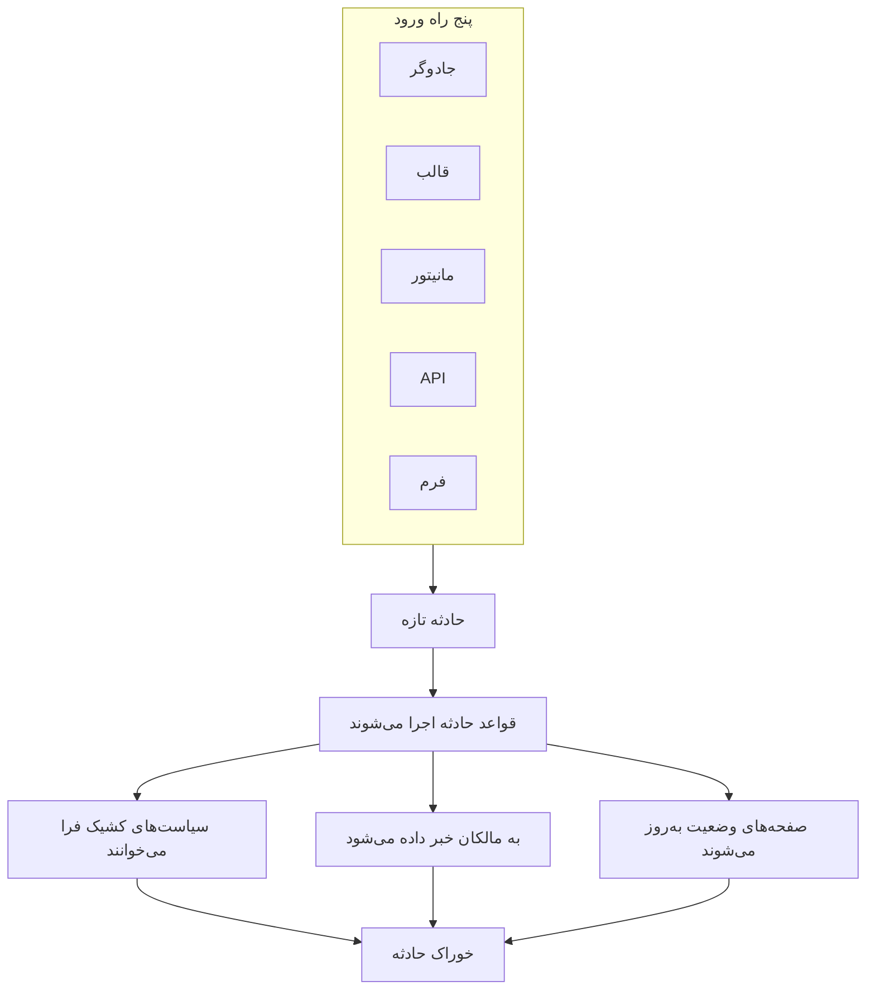
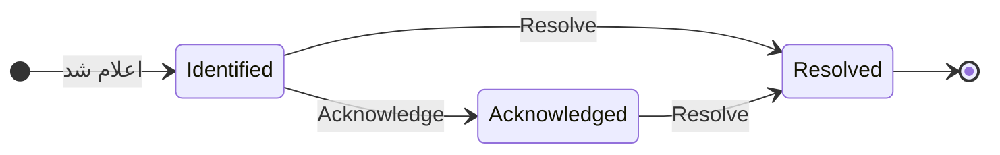

# نمای کلی حوادث

حادثه رکوردی است که تیم شما وقتی چیزی می‌شکند از روی آن کار می‌کند: چه چیزی متأثر است، چقدر بد است، پاسخ کجا ایستاده، مالکش کیست، و هر چیزی که در این میان نوشته می‌شود. اعلام یک حادثه چرخش کشیک درست را فرا می‌خواند، به مالکانش خبر می‌دهد و — اگر بخواهید — قطعی را روی صفحه وضعیتتان می‌گذارد تا مشتریان بدانند در جریانید.

:::cards
- [اعلام یک حادثه](/docs/incidents/declaring-incidents): دستی، از روی قالب، از مانیتور، از راه API یا با یک فرم.
- [وضعیت‌ها و شدت‌های حادثه](/docs/incidents/states-and-severities): چرخه زندگی، و آنچه تصدیق و برطرف کردن انجام می‌دهند.
- [یادداشت‌ها، مالکان و خوراک حادثه](/docs/incidents/notes-owners-and-feed): به‌روزرسانی برای مشتریان و برای تیمتان، و اینکه چه کسی از آن‌ها باخبر می‌شود.
- [هشدارهای پیوندشده](/docs/incidents/linked-alerts): هشدارهایی را که یک قطعی برانگیخته به حادثه‌ای که توضیحشان می‌دهد ببندید.
- [تنظیمات و خودکارسازی حادثه](/docs/incidents/settings): قالب‌ها، فیلدهای سفارشی، نقش‌ها، اندازه‌گیری‌ها و قواعد.
:::

## در یک نگاه

- **محصولی از آن خودش** — **Incidents** را از منوی **Products** در نوار بالا باز کنید؛ فهرست در `/dashboard/{projectId}/incidents` است.
- **سه وضعیت بذرشده** — **Identified**، **Acknowledged** و **Resolved** برای هر پروژه تازه‌ای ساخته می‌شوند. می‌توانید وضعیت‌های خودتان را بیفزایید؛ سه وضعیت بذرشده را می‌توان تغییر نام و رنگ داد اما هرگز حذف نه.
- **سه شدت بذرشده** — **Critical Incident**، **Major Incident** و **Minor Incident**. شدت برچسبی با رنگ و ترتیب است — رفتاری از خودش ندارد.
- **پنج راه ورود** — جادوگر **Declare Incident**، ‏**Create from Template**، قاعده‌ای از معیارهای مانیتور، `POST /api/incident`، یا یک [فرم](/docs/forms/index) که هر کسی با پیوندش می‌تواند پرش کند.
- **شماره‌گذاری به ازای هر پروژه** — هر حادثه شماره‌ای از شمارنده‌ای به ازای هر پروژه می‌گیرد که با پیشوند پروژه‌تان نشان داده می‌شود: `INC-42` در پروژه‌ای تازه، یا `#42` بدون پیشوند.
- **دو گونه یادداشت** — یادداشت‌های خصوصی (یادداشت‌های داخلی) برای تیمتان، یادداشت‌های عمومی برای مشترکان صفحه وضعیت.
- **هشدارها به حادثه‌ها پیوند می‌شوند** — هشدارهایی را که بخشی از یک حادثه‌اند به آن پیوند دهید، یا حادثه‌ای را مستقیم از روی هشدارها اعلام کنید — از فهرست هشدارها یا از صفحه خودِ یک هشدار — و همزمان آن‌ها را تصدیق کنید. [هشدارهای پیوندشده](/docs/incidents/linked-alerts) را ببینید.
- **تنظیمات زیر Incidents هستند، نه Project Settings** — وضعیت‌ها، شدت‌ها، قالب‌ها، فیلدهای سفارشی و موتورهای قاعده همه در **Incidents → Settings** و **Incidents → Rules** هستند.

## چگونه کار می‌کند

می‌توانید حادثه‌ای را ساعت سه بامداد دستی اعلام کنید، یا بگذارید مانیتوری همان لحظه که معیارهایش برآورده می‌شوند اعلامش کند. در هر دو حالت حادثه همان شیء است، با همان چرخه زندگی و همان رد مکتوب در پایان.

### ۱. اعلام می‌شود

پنج مسیر به همان شیء می‌رسند:

- **دستی** — از فهرست Incidents، روی **Declare Incident** کلیک کنید. جادوگر **Declare New Incident** باز می‌شود، با سه گام: **Incident Details**، **Resources Affected**، **On-Call & Roles**. گام نخست عنوان، شدت و توضیحات را می‌پرسد، و آنچه بیشتر حادثه‌ها هرگز لازم ندارند زیر **More fields** تاشده است. فقط گام نخست چیزی می‌پرسد که باید پاسخش دهید: **Next** از باقی گام‌ها می‌گذرد، و **Declare Incident** روی خلاصه پایانی است.
  - **از روی هشدارها** — **Declare Incident** روی گزینشی از هشدارها، یا در سرصفحه یک هشدار، همان جادوگر را از پیش پرشده از روی هشدارها باز می‌کند، آن‌ها را به حادثه تازه پیوند می‌دهد و، اگر تیک جعبه را برندارید، تصدیقشان می‌کند تا تشدیدشان متوقف شود — [هشدارهای پیوندشده](/docs/incidents/linked-alerts) را ببینید.
- **از روی قالب** — روی **Create from Template** کلیک کنید و یک **Incident Template** ذخیره‌شده برگزینید. قالب‌ها عنوان، توضیحات، شدت، وضعیت آغازین، منابع، سیاست‌های کشیک، مالکان و برچسب‌ها را از پیش پر می‌کنند.
- **از مانیتور** — قاعده‌ای از معیارهای مانیتور که کلید «declare an incident» آن روشن است، همان لحظه که پالایه‌هایش برآورده شوند حادثه را خودکار می‌سازد. عنوان‌ها و توضیحات آنجا از قالب‌بندی `{{variable}}` پشتیبانی می‌کنند.
- **از راه API** — ‏`POST /api/incident` با یک کلید API. کارساز `declaredAt`، وضعیت ساخت و شماره حادثه را برایتان پر می‌کند.
- **با یک فرم** — کسی بیرون از تیمتان فرمی را پر می‌کند که به‌صورت پیوند به اشتراک گذاشته‌اید، بی‌آنکه حساب OneUptime داشته باشد. حادثه پنهان از صفحه‌های وضعیت اعلام می‌شود، و اگر فرم قالب حادثه داشته باشد از روی آن. [فرم‌ها](/docs/forms/index) را ببینید.

یکپارچه‌سازی‌ها هم حادثه باز می‌کنند: [Huntress](/docs/integrations/huntress) هر گزارش حادثه‌ای را که SOC آن می‌فرستد به یک حادثه تبدیل می‌کند که سیاست‌های کشیکی را که برمی‌گزینید فرا می‌خواند. برای پیمایش فیلدبه‌فیلد [اعلام یک حادثه](/docs/incidents/declaring-incidents) را ببینید.

### ۲. آدم‌های درست باخبر می‌شوند

هنگام ساخت، OneUptime خودکارسازی‌ای را که پیکربندی کرده‌اید اجرا می‌کند: قواعد حریم خصوصی، قواعد مالک، قواعد برچسب، قواعد کشیک و قواعد رانبوک. هر سیاست کشیکی که به حادثه پیوست است — دستی، از قالب، یا افزوده‌شده به دست قاعده کشیکی که برآورده شده — به‌طور موازی اجرا می‌شود.

به مالکان از راه کانال‌هایی خبر داده می‌شود که هر کدامشان در **User Settings → Notification Settings** روشن کرده‌اند: ایمیل، پیامک، تماس صوتی، اعلان فوری، WhatsApp، ‏Telegram، ‏Slack، ‏Microsoft Teams یا وب‌هوک. اگر حادثه‌ای اصلاً مالکی نداشته باشد، اعلان به‌جای گم شدن به مالکان پروژه می‌رسد.

اگر حادثه روی صفحه وضعیتی دیده شود و اعلان مشترکان روشن باشد، به مشترکان هم خبر داده می‌شود: مشترکان هر صفحه وضعیتی که یکی از مانیتورهای حادثه را فهرست کرده، یا فقط مشترکان صفحه‌هایی که حادثه را به آن‌ها محدود کرده‌اید. برای دادن صفحه وضعیتی جداگانه به هر مخاطب، [یک صفحه وضعیت برای هر مخاطب](/docs/status-pages/one-status-page-per-audience) را ببینید.

> [!NOTE]
> اعلان‌ها کرون‌محورند و هر دقیقه اجرا می‌شوند، پس به‌جای ارسال آنی، تا حدود یک دقیقه تأخیر انتظار داشته باشید.

### ۳. تیمتان رویش کار می‌کند

پاسخ‌دهندگان حادثه را تصدیق می‌کنند، منابع متأثر را پیوست می‌کنند، هشدارهایی را که به آن تعلق دارند پیوند می‌دهند، رانبوک‌ها را اجرا می‌کنند، نقش‌های حادثه را واگذار می‌کنند، و هر چه یاد می‌گیرند می‌نویسند — یادداشت‌های خصوصی برای تیم، یادداشت‌های عمومی برای مشتریان، و وقتی تصویر روشن‌تر شد صفحه‌های **Root Cause** و **Remediation**. هر کاری که می‌کنند در **Incident Feed** روی صفحه **Overview** ثبت می‌شود.

### ۴. برطرف می‌شود

زدن **Resolve** حادثه را به وضعیت برطرف‌شده می‌برد، خط زمانی وضعیت را مهر می‌زند، ساعت مدت را متوقف می‌کند، مانیتورهایی را که در دست دارد پس می‌دهد، و حادثه را از بخش فعال هر صفحه وضعیتی که رویش نشان داده می‌شد برمی‌دارد. برای این کار چیز دیگری لازم نیست تغییر کند — صفحه وضعیت فقط حادثه‌هایی را نشان می‌دهد که در وضعیتی بالای وضعیت برطرف‌شده‌اند. [برطرف کردن چه می‌کند](/docs/incidents/states-and-severities#برطرف-کردن-چه-میکند) را ببینید.

پس از آن می‌توانید پس‌رویدادنامه‌ای بنویسید و، اگر خواستید، روی صفحه وضعیت منتشرش کنید.

## اصطلاح‌های کلیدی

چند واژه در هر صفحه دیگر این بخش تکرار می‌شوند. نخست این‌ها را روشن کنید.

| اصطلاح | یعنی چه |
| ---------------------- | --------------------------------------------------------------------------------------------------------------------------------------------------- |
| **حادثه** | خود رکورد — عنوان، توضیحات، شدت، وضعیت جاری، منابع متأثر، و هر چیزی که در حین پاسخ رویش نوشته می‌شود. |
| **وضعیت حادثه** | حادثه کجای چرخه زندگی‌اش است. سطری محدود به پروژه با نام، رنگ و `order`، به‌علاوه پرچم‌هایی که به آن معنا می‌دهند. |
| **شدت حادثه** | چقدر بد است. سطری محدود به پروژه با نام، رنگ و `order`. صرفاً دسته‌بندی — هیچ‌چیز در محصول با شدتی رفتار ویژه نمی‌کند. |
| **شماره حادثه** | شمارنده‌ای به ازای هر پروژه که به‌صورت `#42` نشان داده می‌شود، یا با پیشوندی که پیکربندی می‌کنید، به‌صورت `INC-42`. |
| **منابع متأثر** | مانیتورها، میزبان‌ها، خوشه‌های Kubernetes، میزبان‌های Docker، سرویس‌ها و دیگر زیرساختی که به حادثه پیوست می‌کنید. |
| **یادداشت عمومی** | به‌روزرسانی‌ای که برای خوانندگان و مشترکان صفحه وضعیت نوشته می‌شود. روی خط زمانی صفحه وضعیت نمایش داده می‌شود. |
| **یادداشت خصوصی** | یادداشتی داخلی (مدل `IncidentInternalNote`) برای تیم پاسخ‌دهنده. هرگز به صفحه وضعیتی نمی‌رسد. |
| **مالک** | کاربر یا تیمی که مسئول حادثه است. مالکان وقتی حادثه ساخته می‌شود، وقتی یادداشتی منتشر می‌شود و وقتی وضعیت تغییر می‌کند باخبر می‌شوند. |
| **خوراک حادثه** | خط زمانی فعالیتِ فقط‌افزودنی روی **Overview** حادثه، که تغییر وضعیت‌ها، یادداشت‌ها، تغییر مالکان، اجرای قواعد و اعلان‌ها را ثبت می‌کند. |
| **خط زمانی وضعیت** | ثبت اینکه حادثه در چه وضعیتی، کی و چه مدت بوده — با وضعیت اعلان مشترکان برای هر گذار. |
| **هشدار پیوندشده** | هشداری که به‌عنوان بخشی از پاسخ به حادثه پیوند شده است. یک هشدار می‌تواند به بیش از یک حادثه پیوند شود، و وضعیت خودش را نگه می‌دارد. |

## سه وضعیتی که OneUptime برای هر پروژه بذر می‌کند

وقتی پروژه‌ای ساخته می‌شود، OneUptime دقیقاً سه وضعیت حادثه، به این ترتیب، بذر می‌کند:

| وضعیت | ترتیب | رنگ | یعنی چه |
| ---------------- | ----- | ------------------ | ------------------------------------------------------------------------- |
| **Identified** | ۱ | قرمز (`#fd625e`) | وضعیتی که حادثه‌ای تازه در آن می‌نشیند. این وضعیت ساخت است. |
| **Acknowledged** | ۲ | زرد (`#ffbf53`) | کسی حادثه را برداشته و رویش کار می‌کند. |
| **Resolved** | ۳ | سبز (`#2ab57d`) | حادثه تمام شده است. برطرف کردنش همان چیزی است که آن را از صفحه وضعیت شما برمی‌دارد. |

نام‌ها فقط برچسب‌اند — آنچه واقعاً رفتار را تعیین می‌کند سه مقدار بولی روی سطر وضعیت است: `isCreatedState`، `isAcknowledgedState` و `isResolvedState`. انتظار می‌رود در هر پروژه فقط یک وضعیت هر پرچم را داشته باشد.

این تمایز بیش از آنچه به نظر می‌رسد اهمیت دارد:

- `isCreatedState` تعیین می‌کند حادثه‌ای تازه کجا آغاز شود. اگر هنگام ساخت وضعیتی صریحاً برگزیده نشود، OneUptime وضعیت ساخت پروژه را پیدا می‌کند و به کار می‌برد.
- `isAcknowledgedState` و `isResolvedState` وضعیت‌های تصدیق‌شده و برطرف‌شده را مشخص می‌کنند. جایگاه وضعیت حادثه نسبت به آن‌ها دکمه‌های **Acknowledge** و **Resolve** در سرصفحه حادثه، دو کاشی آماری روی **Overview** حادثه، و نشان شمار **Active Incidents** در منوی کناری را تعیین می‌کند: حادثه‌ای که در وضعیت تصدیق‌شده یا هر وضعیتی پس از آن باشد تصدیق‌شده است، و حادثه‌ای که در وضعیت برطرف‌شده یا هر وضعیتی پس از آن باشد برطرف‌شده.
- **Active Incidents** صرفاً این‌گونه تعریف شده است: «وضعیت جاری بالای وضعیت برطرف‌شده است». پس وضعیت سفارشی‌ای که بالای وضعیت برطرف‌شده بیفزایید فعال است؛ وضعیتی که پس از آن بگذارید، مانند خود وضعیت برطرف‌شده، برطرف‌شده شمرده می‌شود.

> [!NOTE]
> نخستین وضعیت بذرشده **Identified** نام دارد، هرچند چند توصیف درون محصول هنوز آن را وضعیت ساخت (created) می‌نامند. اگر در فهرست وضعیت‌های پروژه‌تان دنبال «Created» می‌گردید، همان سطری است که **Identified** نام دارد.

می‌توانید وضعیت‌های خودتان را در **Incidents → Settings → Incident State** بیفزایید. وضعیت تازه درست بالای وضعیت برطرف‌شده افزوده می‌شود، و سطرها را با کشیدن مرتب می‌کنید؛ ستون **Counts as** نشان می‌دهد حادثه‌ای که در هر وضعیت است چه شمرده می‌شود — تصدیق‌نشده، تصدیق‌شده یا برطرف‌شده. سه وضعیت پرچم‌دار برچسب **Built-in** دارند: ترتیبشان را نگه می‌دارند و حذف نمی‌شوند، اما می‌توانید تغییر نام و رنگ دهید و جابه‌جایشان کنید، و به همین دلیل رابط کاربری نام وضعیت‌ها را به‌صورت پویا می‌خواند.

ترتیب اعمال می‌شود، نه اینکه آرایشی باشد: حادثه نمی‌تواند به وضعیتی برود که در ترتیب زودتر از وضعیت جاری‌اش قرار دارد. جزئیات کامل در [وضعیت‌ها و شدت‌های حادثه](/docs/incidents/states-and-severities) است.

## سه شدتی که OneUptime برای هر پروژه بذر می‌کند

هر پروژه تازه سه شدت هم می‌گیرد:

| شدت | ترتیب | رنگ | یعنی چه |
| --------------------- | ----- | ------------------ | ---------------------------------------------------------- |
| **Critical Incident** | ۱ | زرشکی (`#b70400`) | اثر بسیار بالا بر مشتری، با نیاز به پاسخ بی‌درنگ. |
| **Major Incident** | ۲ | قرمز (`#fd625e`) | اثر چشمگیر، معمولاً با نیاز به پاسخ بی‌درنگ. |
| **Minor Incident** | ۳ | زرد (`#ffbf53`) | اثر کم، معمولاً در ساعت‌های کاری رسیدگی می‌شود. |

شدت‌ها `name`، `description`، `color` و `order` دارند و نه چیز دیگری. پرچمی ندارند، و هیچ مسیری در کد با «Critical Incident» رفتاری متفاوت از هر سطر دیگری ندارد. شدت ابزار انسان‌ها برای اولویت‌بندی است، و وقتی قواعد کشیک می‌نویسید به‌عنوان معیار تطبیق در دسترس است — اما برگزیدن یک شدت به‌خودی‌خود کسی را فرا نمی‌خواند.

شدت‌ها را در **Incidents → Settings → Incident Severity** ویرایش کنید یا بیفزایید. توضیحات کامل شدت‌های بذرشده در [وضعیت‌ها و شدت‌های حادثه](/docs/incidents/states-and-severities) است.

## حادثه‌ها در داشبورد کجا هستند

**Incidents** را از منوی **Products** در نوار بالا باز کنید. منوی کناری‌اش به این بخش‌ها سازمان یافته است:

| بخش | آنجا چه می‌کنید |
| ------------- | -------------------------------------------------------------------------------------------------------------------------------------------------------------------------- |
| **Overview** | **All Incidents** و **Active Incidents** — دومی نشانی قرمز با شمار حادثه‌هایی دارد که در وضعیتی بالای وضعیت برطرف‌شده‌اند. |
| **Episodes** | اپیزودهای حادثه، قابلیتی جداگانه برای گروه‌بندی با صفحه‌های خودش. |
| **AI** | **Insights**، **Logs**، **Settings**: آنچه هوش مصنوعی OneUptime از حادثه‌های شما آموخت و هر کاری که برایشان کرد، و آنچه اجازه دارد خودش انجام دهد — همراه با قواعدی که تعیین می‌کنند کدام حادثه‌ها را بررسی و اصلاح کند. [AI SRE](/docs/ai/ai-sre) را ببینید. |
| **Workspace** | فضاهای کاری گفتگویی که این پروژه وصل کرده: **Slack**، **Microsoft Teams** یا هر دو، هر کدام با قواعد اعلانش برای حادثه‌ها. وقتی هیچ‌کدام وصل نباشد، **Connect Slack or Teams** را نگه می‌دارد، صفحه‌ای که هر دو و چگونگی وصل کردنشان را نشان می‌دهد. |
| **Integrations** | ابزارهایی که خودشان حادثه باز می‌کنند: **Huntress**، که گزارش‌های حادثه‌اش به حادثه‌هایی تبدیل می‌شوند که کشیک را فرا می‌خوانند. [Huntress](/docs/integrations/huntress) را ببینید. |
| **Rules** | موتورهای قاعده: **Grouping Rules**، **On-Call Rules**، **Owner Rules**، **Runbook Rules**، **Privacy Rules**، **Label Rules**، **SLA Rules**، **Reminder Rules**. |
| **Settings** | **Incident State**، **Incident Severity**، **Incident Templates**، **Note Templates**، **Postmortem Templates**، **Custom Fields**، **Incident Roles**، **Measurements**، **Linked Alerts**، **Number Prefix**. |

**Overview** و **Episodes** باز هستند؛ **AI**، **Workspace**، **Integrations**، **Rules**، **Settings** و **Developer** به‌طور پیش‌فرض جمع‌اند، تا منو روی فهرست‌هایی باز شود که هر روز به کار می‌برید. روی عنوان یک بخش کلیک کنید تا باز شود و صفحه‌هایی را که باقی این مستندات به آن‌ها ارجاع می‌دهند بیابید؛ هر بخش وقتی روی یکی از صفحه‌هایش باشید خودبه‌خود هم باز می‌شود. پیکربندی حادثه زیر Project Settings نیست؛ همه‌اش اینجاست.

خود فهرست حادثه‌ها **Incident Number**، **Title**، **State**، **Severity**، **Resources Affected**، **Declared**، **Duration**، **Labels** و **Owners** را نشان می‌دهد، با کنش انبوه **Change State** برای بستن چند حادثه با هم.

## هر صفحه یک حادثه چه نشان می‌دهد

حادثه‌ای را باز کنید؛ منوی کناری خودش صفحه‌هایش را این‌گونه گروه می‌کند:

| بخش منوی کناری | صفحه‌ها |
| ----------------- | ----------------------------------------------------------------------------------------- |
| **Overview** | **Overview**، **State Timeline**، **SLA** |
| **Investigation** | **Description**، **Root Cause**، **Remediation**، **Runbooks**، **Postmortem**، **Linked Alerts** |
| **Team** | **Roles**، **On-Call Executions**، **Owners** |
| **Notifications** | **Notification Logs**، **AI Logs** — تا روی **Notifications** کلیک نکنید جمع است |
| **Notes** | **Private Notes**، **Public Notes** |
| **Developer** | **Terraform**، **API**، **AI Assistants** — تا روی **Developer** کلیک نکنید جمع است |
| **Advanced** | **Custom Fields**، **Settings**، **Audit Logs**، **Delete Incident** — تا روی **Advanced** کلیک نکنید جمع است |

هر کدام چه دارد:

- **Overview** — پاسخ در یک نگاه. زیر سرصفحه، کاشی‌های آماری زمان تا تصدیق، زمان تا برطرف شدن و **Duration** کل را نشان می‌دهند. کارت **AI Investigation** در صدر صفحه است — آنچه هوش مصنوعی OneUptime یافت، یا اینکه چرا آغاز نشد — و **Incident Feed** زیر آن. کنار آن‌ها کارت **Video Call**، کارت **Incident Details** (عنوان، شدت، برچسب‌ها، شماره حادثه، زمان اعلام، اعلام‌کننده، سیاست‌های کشیک، و شناسه حادثه روی خط کوچک **ID** در پایینش که با یک کلیک در کلیپ‌بورد شماست)، **Incident Roles**، کارت **Affected Resources** و فیلدهای سفارشی حادثه قرار دارند. وقتی پروژه شما [اندازه‌گیری](/docs/incidents/settings#اندازهگیریها) دارد، کارت **Measurements** زیر **Incident Details** می‌گوید هر کدام برای این حادثه چه نشان می‌دهد: **12 minutes**، **Running for 5 minutes**، **Not reached**.
- **State Timeline** — هر وضعیتی که حادثه در آن بوده، با **Starts At**، **Ends At**، **Duration** و وضعیت اعلان مشترکان برای هر گذار. **View Cause** و **View Logs** توضیح می‌دهند چرا هر تغییری رخ داد.
- **SLA** — پیگیری SLA برای این حادثه.
- **Description**، **Root Cause**، **Remediation** — سه صفحه مارک‌داون. توضیحات همان است که روی صفحه وضعیت شما نشان داده می‌شود.
- **Runbooks** — اجراهای رانبوکی که به این حادثه پیوست‌اند.
- **Postmortem** — گزارش و پیوست‌هایش، که می‌توانید اختیاراً روی صفحه وضعیت منتشرش کنید. **Edit Postmortem Note** یادداشت و پیوست‌ها را می‌پرسد، سپس **Publish on Status Page** را؛ تنها وقتی آن روشن است **Notify Subscribers** و **Postmortem Published At** را می‌پرسد، که روشن کردن انتشار آن را روی اکنون می‌گذارد. **Generate with AI** یادداشت را برایتان پیش‌نویس می‌کند و **Apply Template** — که تنها وقتی پروژه قالب پس‌رویدادنامه دارد نشان داده می‌شود — آن را از یک قالب آغاز می‌کند. مشترکان یک بار باخبر می‌شوند، وقتی پس‌رویدادنامه منتشر می‌شود: نخستین باری که صفحه وضعیت آن را نشان می‌دهد، که روشن بودن **Publish on Status Page** و یادداشتی نوشته‌شده می‌خواهد. ذخیره دوباره، یا ویرایش آن در حالی که منتشر شده، صفحه وضعیت را به‌روز می‌کند و به کسی خبر نمی‌دهد؛ انتشار دوباره‌اش پس از برداشتن از صفحه وضعیت دوباره خبرشان می‌کند. پس‌رویدادنامه‌ای که هنگام پنهان بودن حادثه منتشر شده، وقتی حادثه نمایان شود فرستاده می‌شود. [پس‌رویدادنامه](/docs/status-pages/subscribers#پسرویدادنامه) را ببینید.
- **Linked Alerts** — هشدارهایی که به این حادثه پیوند شده‌اند، با وضعیت جاری هر هشدار، و اینکه چه کسی و کی پیوندش داد. هشدارها صفحه متناظر **Linked Incidents** دارند. [هشدارهای پیوندشده](/docs/incidents/linked-alerts) را ببینید.
- **Roles**، **On-Call Executions**، **Owners** — چه کسی رویش کار می‌کند، کدام سیاست‌ها اجرا شدند، و چه کسی باخبر می‌شود.
- **Notification Logs**، **AI Logs**، **Audit Logs** — چه چیزی فرستاده شد و چه چیزی تغییر کرد.
- **Private Notes** و **Public Notes** — آنچه به تیمتان و به مشتریانتان گفته شد. [یادداشت‌ها، مالکان و خوراک حادثه](/docs/incidents/notes-owners-and-feed) را ببینید.
- **Custom Fields**، **Settings**، **Delete Incident** — صفحه **Settings** گزینه‌های **Visible on Status Page** و **Private Incident**، کارت **Status Page Scope** که حادثه را به برخی صفحه‌های وضعیت محدود می‌کند، و کارت **Reminders** را نگه می‌دارد؛ کلید **Send reminders** این کارت همان لحظه که زده شود ذخیره می‌شود و زمان یادآوری بعدی را نشان می‌دهد.

## حادثه‌ها چگونه با باقی OneUptime جفت می‌شوند

- **مانیتورها مشکل را می‌بینند؛ حادثه‌ها ثبتش می‌کنند.** قاعده‌ای از معیارهای مانیتور می‌تواند حادثه‌ای را خودکار اعلام کند و عنوان، شدت، سیاست‌های کشیک، مالکان، برچسب‌ها و یادداشت‌های اصلاح را از پیش پر کند. برای متغیرهای در دسترس آنجا [قالب‌بندی حادثه و هشدار](/docs/monitor/incident-alert-templating) را ببینید.
- **هشدارها سیگنال‌اند؛ حادثه‌ها پاسخ.** هشدارهایی را که حادثه‌ای توضیحشان می‌دهد، از هر دو سو، به آن پیوند دهید، و دو کلید پروژه، که در پروژه‌های تازه روشن‌اند، آن هشدارها را همراه حادثه تصدیق و برطرف می‌کنند. [هشدارهای پیوندشده](/docs/incidents/linked-alerts) را ببینید.
- **سیاست‌های کشیک فراخوانی را انجام می‌دهند.** سیاست‌ها را در گام **On-Call & Roles** جادوگر اعلام، روی یک قالب، یا از راه **Incidents → Rules → On-Call Rules** پیوست کنید. هر قاعده‌ای که برآورده شود اجرا می‌شود — مجموعه اجراشده اجتماع همه تطابق‌ها به‌علاوه هر چیزی است که مستقیم پیوست شده، بدون تکرار.
- **رانبوک‌ها به آدم‌ها می‌گویند چه کنند.** قواعد رانبوک وقتی حادثه‌ای منطبق ساخته می‌شود خودکار رویه‌ای را پیوست می‌کنند، و پاسخ‌دهندگان می‌توانند یکی را دستی از روی حادثه آغاز کنند. [نمای کلی رانبوک‌ها](/docs/runbooks/index) را ببینید.
- **صفحه‌های وضعیت به مشتریان می‌گویند.** حادثه‌ای در فهرست فعال یک صفحه وضعیت نشان داده می‌شود وقتی صفحه یکی از مانیتورهایش را فهرست کرده باشد، صفحه حادثه‌ها را روشن داشته باشد، حادثه دیدنی روی صفحه وضعیت علامت خورده باشد، و وضعیت جاری‌اش بالای وضعیت برطرف‌شده باشد. حادثه‌ای که به برخی صفحه‌های وضعیت محدود شده فقط روی همان‌ها نشان داده می‌شود. حادثه‌های خصوصی همیشه از هر صفحه وضعیتی پنهان‌اند. [نمای کلی صفحات وضعیت](/docs/status-pages/index) و [یک صفحه وضعیت برای هر مخاطب](/docs/status-pages/one-status-page-per-audience) را ببینید.
- **گردش‌های کاری پیرامونش خودکارسازی می‌کنند.** تریگرهای **On Create Incident**، **On Update Incident** و **On Delete Incident** به شما امکان می‌دهند خودکارسازی بدون کد را روی چرخه زندگی حادثه بسازید. [نمای کلی گردش‌های کاری](/docs/workflows/index) را ببینید.

## گام‌های بعدی

:::cards
- [اعلام یک حادثه](/docs/incidents/declaring-incidents): جادوگر را فیلدبه‌فیلد بپیمایید، یا از روی قالب، مانیتور یا API اعلام کنید.
- [وضعیت‌ها و شدت‌های حادثه](/docs/incidents/states-and-severities): وضعیت‌های خودتان را بیفزایید و ببینید هر کدام دقیقاً چه می‌کند.
- [نمای کلی صفحات وضعیت](/docs/status-pages/index): حادثه‌ها چگونه به مشتریانتان می‌رسند.
- [مشترکان و اطلاعیه‌ها](/docs/status-pages/subscribers): وقتی حادثه‌ای جابه‌جا می‌شود به چه کسی خبر داده می‌شود.
:::
