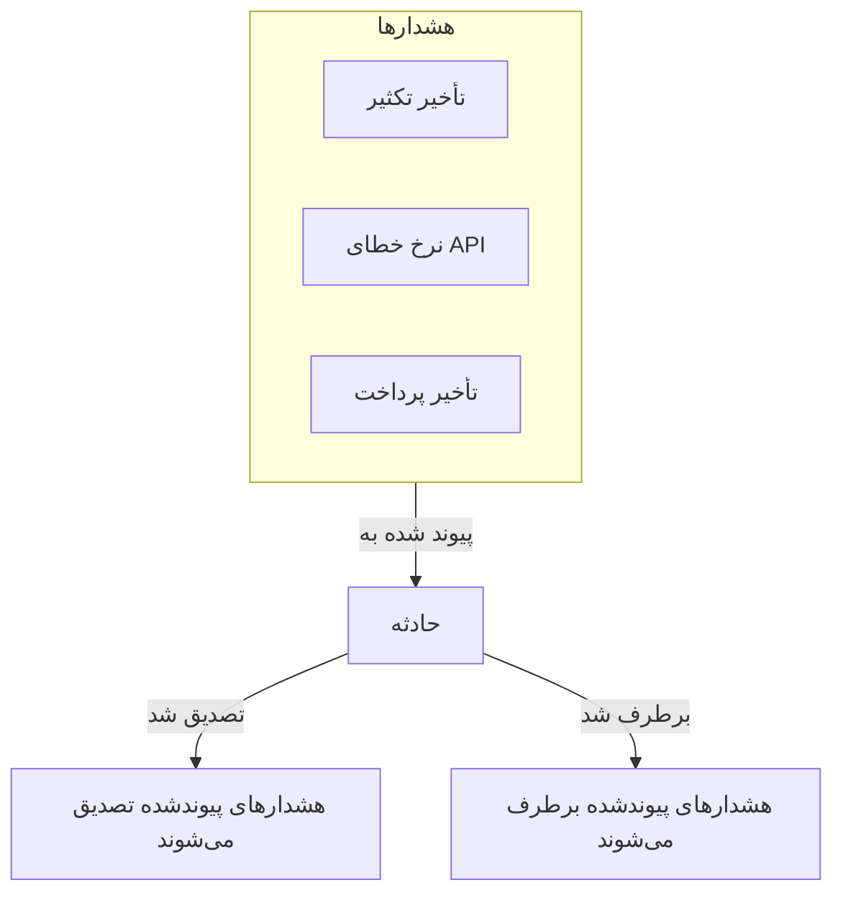
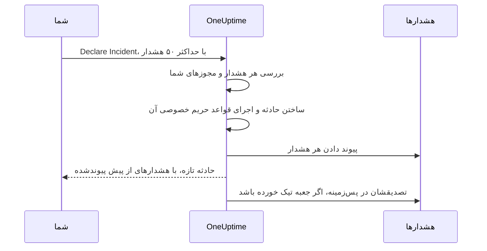

# هشدارهای پیوندشده

یک قطعی به‌ندرت فقط یک هشدار به راه می‌اندازد. وقتی پایگاه‌داده اصلی از کار می‌افتد، مانیتور تأخیر تکثیر فعال می‌شود، مانیتور نرخ خطای API فعال می‌شود، و SLO تأخیر پرداخت شروع به سوزاندن بودجه می‌کند — سه هشدار، یک مشکل. پیوند دادن آن هشدارها به حادثه همین را می‌گوید: حادثه جایی است که پاسخ در آن رخ می‌دهد، و هر هشدار نشان می‌دهد کدام حادثه توضیحش می‌دهد.

پیوند فقط یک پیوند است. هشدار وضعیت، مالکان، سیاست‌های کشیک، یادداشت‌ها و خوراک خودش را نگه می‌دارد؛ حادثه هم مال خودش را. پیوند دادن هیچ چیز را ادغام یا کپی نمی‌کند، و به‌خودی‌خود هرگز هشداری را تصدیق، برطرف یا خاموش نمی‌کند. (اعلام حادثه‌ای تازه از روی هشدارها فرق دارد: حادثه تازه از روی آن‌ها از پیش پر می‌شود، چنان‌که [پایین‌تر](#اعلام-حادثه-از-روی-هشدارها) آمده است، و اگر تیک جعبه روی فرم را برندارید، هشدارها هنگام اعلام حادثه تصدیق می‌شوند و تشدیدشان متوقف می‌شود — [تصدیق هشدارها هنگام اعلام](#تصدیق-هشدارها-هنگام-اعلام) را ببینید.) دو کلید پروژه، که در پروژه‌های تازه روشن‌اند، هشدارهای پیوندشده را همراه حادثه، هنگام تصدیق و برطرف شدنش، جلو می‌برند — [پایین‌تر](#همگام-نگه-داشتن-وضعیت-هشدارها-با-حادثه) را ببینید.

:::cards
- [پیوند دادن هشدارها به یک حادثه](#پیوند-دادن-هشدارها-از-یک-حادثه): از حادثه، از هشدار، یا چندتا با هم.
- [اعلام حادثه از روی هشدارها](#اعلام-حادثه-از-روی-هشدارها): حادثه‌ای تازه، از پیش پرشده و پیوندشده در یک گام.
- [هم‌گام نگه داشتن وضعیت هشدارها](#همگام-نگه-داشتن-وضعیت-هشدارها-با-حادثه): هشدارها را همراه حادثه تصدیق و برطرف کنید.
- [مجوزها](#مجوزها): چه کسی می‌تواند پیوند دهد، و پیوند دادن چه اجازه‌ای به او می‌دهد.
:::

> [!TIP]
> اگر از Opsgenie می‌آیید، این نسخه OneUptime از مرتبط کردن هشدارها با یک حادثه است.

## در یک نگاه

- **چندبه‌چند** — یک حادثه می‌تواند هر تعداد هشدار پیوندشده داشته باشد، و یک هشدار می‌تواند به چند حادثه پیوند شود.
- **سه جا برای پیوند دادن** — صفحه **Linked Alerts** حادثه، صفحه **Linked Incidents** هشدار، و کنش انبوه **Link to Incident** روی فهرست‌های اصلی هشدار، برای حداکثر **۵۰** هشدار در هر بار.
- **اعلام حادثه از روی هشدارها** — **Declare Incident** روی فهرست هشدارها، در سرصفحه یک هشدار یا در صفحه **Linked Incidents** آن، حادثه‌ای تازه را از روی هشدارها از پیش پر می‌کند و هنگام ساخته شدنش آن‌ها را پیوند می‌دهد. جعبه‌ای روی فرم، که به‌طور پیش‌فرض روشن است، آن‌ها را تصدیق هم می‌کند، و همین تشدید کشیک خودشان را متوقف می‌کند.
- **ثبت در هر دو سو** — هر پیوند و برداشتن پیوند، ورودی‌ای در خوراک حادثه و در خوراک هشدار می‌نویسد، جز اینکه حادثه‌ای که از روی هشدارها اعلام می‌شود یک ورودی می‌گیرد که همه آن‌ها را فهرست می‌کند. فقط ورودی‌های حادثه به Slack و Microsoft Teams فرستاده می‌شوند، و عنوان هشدار یا حادثه خصوصی هرگز در سوی دیگر نوشته نمی‌شود.
- **وضعیت هشدارها از حادثه پیروی می‌کند** — دو کلید پروژه، هر دو در پروژه‌های تازه روشن، هشدارهای پیوندشده را وقتی حادثه تصدیق و برطرف می‌شود تصدیق و برطرف می‌کنند. هر کدام را در **Incidents → Settings → Linked Alerts** خاموش کنید.
- **خودکارسازی‌پذیر** — پیوندها یک منبع معمولی API هستند، `/api/incident-alert`.

## چگونه کار می‌کند

هشدارها سیگنال‌اند: معیارهای یک مانیتور برآورده شد، یک SLO شروع به سوزاندن بودجه‌اش کرد، یک قاعده امنیتی فعال شد. حادثه پاسخ هماهنگ به یک مشکل است ([نمای کلی حادثه‌ها](/docs/incidents/index) را ببینید). بیشتر مشکل‌ها چند سیگنال تولید می‌کنند، و بدون پیوند، تنها چیزی که آن‌ها را به پاسخ وصل می‌کند حافظه کسی است.



وقتی هشدارها پیوند شده باشند:

- پاسخ‌دهندگان روی حادثه در یک فهرست می‌بینند کدام هشدارها بخشی از آن‌اند و هر کدام در چه وضعیتی است.
- کسی که یکی از آن هشدارها را باز می‌کند می‌بیند که از پیش، زیر کدام حادثه، به آن رسیدگی می‌شود، به‌جای اینکه برای همان قطعی حادثه دومی اعلام کند.
- خوراک حادثه ثبت می‌کند هر هشدار کی و به دست چه کسی پیوند شد، پس خط زمانی نشان می‌دهد تصویر چگونه کامل شد.
- با روشن بودن کلیدها، تصدیق حادثه تشدید کشیک هشدارها را متوقف می‌کند، پس کسانی که روی حادثه کار می‌کنند دوباره به‌خاطر نشانه‌هایش فراخوانده نمی‌شوند.

## پیوندها چگونه کار می‌کنند

هر پیوند یک هشدار را به یک حادثه وصل می‌کند. پیوندها دوسویه‌اند — همان پیوند روی صفحه **Linked Alerts** حادثه و روی صفحه **Linked Incidents** هشدار دیده می‌شود.

- **یک هشدار می‌تواند به چند حادثه پیوند شود.** از کار افتادن یک وابستگی مشترک می‌تواند نشانه دو حادثه جدا باشد. هر حادثه هشدار را فهرست می‌کند، و هشدار هر دو حادثه را.
- **هر جفت فقط یک بار پیوند می‌شود.** پیوند دادن هشداری به حادثه‌ای که از پیش به آن پیوند شده با «This alert is already linked to this incident.» رد می‌شود — حتی وقتی دو نفر همان جفت را در همان لحظه پیوند می‌دهند.
- **پیوندها ساخته یا برداشته می‌شوند، هرگز ویرایش نمی‌شوند.** پیوند جز حادثه، هشدار، زمان ساخت و سازنده‌اش فیلدی از خودش ندارد. برای بردن هشداری به حادثه‌ای دیگر، آن را به حادثه تازه پیوند دهید و پیوندش را از حادثه قبلی بردارید.
- **پیوندها درون یک پروژه می‌مانند.** هشدار و حادثه باید به یک پروژه تعلق داشته باشند.

## پیوند دادن هشدارها از یک حادثه

:::steps
### صفحه Linked Alerts حادثه را باز کنید

حادثه را باز کنید و در بخش **Investigation** منوی کناری‌اش **Linked Alerts** را برگزینید. جدول هر هشداری را که از پیش به آن پیوند شده فهرست می‌کند.

### هشدار را برگزینید

روی **Link Alert** کلیک کنید و آن را از فهرست کشویی **Alert** برگزینید. فهرست کشویی تازه‌ترین هشدارها را اول نشان می‌دهد، هر کدام با شماره‌اش — مانند `ALT-63: Checkout API is offline` — پس هشدارهایی که عنوانی یکسان دارند، مانند هشدارهای تکراری یک مانیتور، از هم تشخیص داده می‌شوند. برای یافتن هشداری قدیمی‌تر تایپ کنید: فهرست کشویی همه هشدارها را بر پایه عنوان جستجو می‌کند.

### پیوند را ذخیره کنید

در پنجره روی **Link Alert** کلیک کنید. هشدار در جدول پدیدار می‌شود، و هر دو خوراک پیوند را ثبت می‌کنند. اگر پیوند رد شود، مثلاً چون هشدار از پیش پیوند شده، پنجره باز می‌ماند و دلیلش را می‌گوید.
:::

| ستون | چه نشان می‌دهد |
| ----------------- | ------------------------------------------------ |
| **Alert #** | شماره هشدار، مانند `#17` یا `ALT-17`. |
| **Title** | عنوان هشدار، با پیوند به خود هشدار. |
| **Current State** | وضعیت خود هشدار، مانند **Acknowledged**. |
| **Linked At** | زمانی که هشدار پیوند شد. |
| **Linked By** | کسی که آن را پیوند داد. |

هر سطر **View Alert** برای باز کردن هشدار و **Unlink** برای برداشتن پیوند دارد.

## پیوند دادن حادثه‌ها از یک هشدار

سوی هشدار آینه سوی حادثه است. هشداری را باز کنید و در بخش **Basic** منوی کناری‌اش **Linked Incidents** را برگزینید. جدول هر حادثه‌ای را که هشدار به آن پیوند شده فهرست می‌کند، با شماره، عنوان و وضعیت جاری حادثه، و اینکه کی و به دست چه کسی پیوند شد.

- **Link Incident** این هشدار را به حادثه‌ای موجود پیوند می‌دهد. فهرست کشویی‌اش مانند سوی حادثه کار می‌کند: تازه‌ترین حادثه‌ها اول، هر کدام با شماره‌اش — مانند `INC-42: Checkout is down` — و تایپ کردن همه حادثه‌ها را بر پایه عنوان جستجو می‌کند.
- **View Incident** یک حادثه پیوندشده را باز می‌کند.
- **Unlink** یک پیوند را برمی‌دارد.
- **Declare Incident** حادثه‌ای تازه را از روی این هشدار آغاز می‌کند. همین دکمه در سرصفحه هشدار هم هست، کنار **Acknowledge** و **Resolve**. [اعلام حادثه از روی هشدارها](#اعلام-حادثه-از-روی-هشدارها) را ببینید.

## پیوند دادن چند هشدار با هم

فهرست‌های اصلی هشدار دو کنش انبوه برای این کار دارند: **All Alerts** و **Active Alerts**، هشدارهای فعال روی صفحه خانه، و صفحه **Alerts** یک مانیتور، سرویس، میزبان، خوشه Kubernetes، ‏SLO یا هر منبع دیگری که چنین صفحه‌ای دارد. فهرست **Member Alerts** یک اپیزود هشدار آن‌ها را ندارد — به‌جایش هشدارها را روی یکی از فهرست‌های اصلی برگزینید. هشدارها را برگزینید، سپس یکی از این‌ها را انتخاب کنید:

- **Link to Incident** — حادثه را در فهرست کشویی **Incident** برگزینید و روی **Link Alerts** کلیک کنید. تازه‌ترین حادثه‌ها اول و با شماره‌شان فهرست می‌شوند، و تایپ کردن همه حادثه‌ها را بر پایه عنوان جستجو می‌کند. OneUptime هر هشدار برگزیده را پیوند می‌دهد و در حین کار پیشرفت را نشان می‌دهد. هشداری که از پیش به آن حادثه پیوند شده انجام‌شده شمرده می‌شود نه ناموفق، پس اجرای دوباره کنش بی‌ضرر است.
- **Declare Incident** — فرم اعلام حادثه‌ای تازه را باز می‌کند که از روی هشدارهای برگزیده از پیش پر شده است. بخش بعدی را ببینید.

هر دو کنش حداکثر **۵۰** هشدار را در هر بار می‌پذیرند. بیشتر برگزینید و غیرفعال می‌شوند، با راهنمایی که دلیلش را می‌گوید. این سقف از آن روست که هر پیوند در هر دو خوراک می‌نویسد، و هر پیوندی که با **Link to Incident** ساخته شود در کانال‌های Slack و Microsoft Teams حادثه هم پست می‌شود — گزینشی هزارتایی آن‌ها را غرق می‌کرد.

## اعلام حادثه از روی هشدارها

وقتی موجی از هشدارها معلوم می‌شود حادثه‌ای است که هنوز کسی اعلامش نکرده، آن را از روی هشدارها اعلام کنید. سه راه ورود هست:

- هشدارها را روی یکی از فهرست‌های اصلی هشدار برگزینید و **Declare Incident** را انتخاب کنید.
- هشداری را باز کنید و در سرصفحه‌اش، کنار **Acknowledge** و **Resolve**، روی **Declare Incident** کلیک کنید. این دکمه پس از تصدیق یا برطرف شدن هشدار هم سر جایش می‌ماند، پس حتی پس از پایان کار یک هشدار هم می‌توانید برایش حادثه اعلام کنید — مثلاً تا برایش پس‌رویدادنامه بنویسید.
- صفحه **Linked Incidents** یک هشدار را باز کنید و روی **Declare Incident** کلیک کنید.

هر سه به اجازه ساختن حادثه و پیوند دادن هشدارها به آن نیاز دارند. بدون آن، دکمه قفل است و راهنمای آن مجوز گمشده را نام می‌برد.

از هر راهی که بیایید، به فرم معمول **Declare New Incident** می‌رسید، در حالی که هشدارها به‌عنوان هشدارهایی که پیوند خواهند شد فهرست شده‌اند و این فیلدها از پیش پر شده‌اند:

| فیلد | از پیش پر شده با |
| ---------------------- | -------------------------------------------------------------------------------------------------------------------------------------------------------------------------------------------------------------------------------------------------------------------------------------- |
| **Title** | یک هشدار: عنوانش. چند هشدار: عنوان شدیدترین هشدار. |
| **Description** | یک هشدار: توضیحاتش. چند هشدار: فهرستی با یک خط برای هر هشدار، با شماره و عنوانش. |
| **Incident Severity** | شدت شدیدترین هشدار، برگردانده به یک شدت حادثه. شدت حادثه‌ای با همان نام، بدون توجه به کوچکی و بزرگی حروف، برنده است. در غیر این صورت OneUptime شدت حادثه‌ای را برمی‌دارد که در ترتیب شدت‌ها در همان جایگاه است، یا اگر شدت‌های حادثه کمتری دارید آخری را. |
| **Resources Affected** | همه مانیتورها، میزبان‌ها، خوشه‌های Kubernetes، میزبان‌های Docker، میزبان‌های Podman و سرویس‌های هشدارهای برگزیده، با هم. مانیتورها زیر **Monitors** می‌روند و بقیه زیر **Other Affected Resources**. منابع دیگر، مانند SLOها یا خوشه‌های VMware، ‏Proxmox و Ceph، کپی نمی‌شوند — اگر حادثه بر آن‌ها اثر دارد خودتان بیفزاییدشان. |
| **Labels** | همه برچسب‌های همه هشدارهای برگزیده. |
| **Private Incident** | روشن، اگر هر کدام از هشدارها خصوصی باشد. فرم این را می‌گوید، و مالکان هشدارها مالک حادثه می‌شوند — پایین‌تر را ببینید. |

«شدیدترین» از ترتیب شدت‌های هشدار شما پیروی می‌کند: نخستین شدت هشدار در فهرست شدیدترین است. با شدت‌هایی که هر پروژه با آن‌ها آغاز می‌کند، هشدار **High** به **Critical Incident** و هشدار **Low** به **Major Incident** تبدیل می‌شود.

همه چیز پیش از ارسال ویرایش‌شدنی است. **Labels** و **Private Incident** زیر **More fields** در گام نخست فرم‌اند، که سرتیتر تاشده‌اش هر کدام را تا وقتی تنظیم شده باشد نشان می‌دهد.

**هشداری که از پیش حادثه‌ای دارد مشخص می‌شود.** با بودن **Declare Incident** روی صفحه هر هشدار، ممکن است دو پاسخ‌دهنده که برای یک قطعی فراخوانده شده‌اند هر کدام آن را اعلام کنند. پس کادری که هشدارها را فهرست می‌کند کنار هر هشداری که از پیش به حادثه‌ای پیوند شده می‌نویسد «(already linked to Incident INC-42)»، با پیوندی به آن حادثه، و یادداشتی می‌افزاید که متنش بسته به این است که چند تا از هشدارها پیوند شده‌اند:

- همه هشدارها، و فقط یک هشدار هست: «This alert is already linked to an incident. If it is the same problem, update that incident instead of declaring another one.»
- همه هشدارها، و چند هشدار هست: «These alerts are already linked to incidents. If it is the same problem, update that incident instead of declaring another one.»
- فقط برخی از آن‌ها: «Some of these alerts are already linked to an incident. If it is the same problem, link the other alerts to that incident from the alerts list instead of declaring another one.»

پیوندهای حادثه در زبانه‌ای تازه باز می‌شوند، پس می‌توانید حادثه موجود را بررسی کنید بی آنکه آنچه در فرم پر کرده‌اید از دست برود. این یادداشت یک یادآوری است، نه مانع، و فقط حادثه‌هایی نام برده می‌شوند که اجازه دیدنشان را دارید.

**سیاست‌های کشیک کپی نمی‌شوند.** هشدارها هنگام ساخته شدن سیاست‌های کشیک خودشان را اجرا کرده‌اند، پس کپی کردنشان روی حادثه همان آدم‌ها را بار دوم فرا می‌خواند. سیاست‌های کشیک حادثه همان‌هایی‌اند که در گام **On-Call & Roles** برمی‌گزینید به‌علاوه آنچه قواعد کشیک حادثه‌تان می‌افزایند — دقیقاً مانند هر حادثه دیگری.

**مانیتورهای هشدارها به‌عنوان مانیتورهای متأثر از پیش پر می‌شوند.** مانند هر حادثه‌ای که دستی اعلام می‌شود، پایش فعال روی مانیتورهای حادثه تا برطرف شدن حادثه متوقف می‌شود. اگر مانیتوری باید همچنان بررسی شود، پیش از ارسال آن را از **Monitors** در گام **Resources Affected** بردارید.

**هشدار خصوصی حادثه خصوصی می‌سازد.** اگر هر کدام از هشدارها خصوصی باشد، **Private Incident** روشن آغاز می‌شود، و کادری که هشدارها را فهرست می‌کند این را می‌گوید. حادثه خصوصی فقط برای مالکانش، Project Owner و Project Admin دیدنی است، پس OneUptime مطمئن می‌شود کسانی که می‌توانستند هشدارها را ببینند حادثه را هم می‌بینند: پس از اعلام آن، مالکان هر هشدار اعلام‌شده — چه کاربر و چه تیم — بی آنکه اعلانی بگیرند به‌عنوان مالک حادثه افزوده می‌شوند. آن‌ها درست پس از ساخته شدن کانال‌های Slack و Microsoft Teams حادثه افزوده می‌شوند، پس مانند هر مالک دیگری به آن کانال‌ها دعوت می‌شوند. خودتان هم مالک آن هستید، مانند هر حادثه‌ای که اعلام می‌کنید. وقتی یک قاعده حریم خصوصی حادثه، حادثه تازه را خصوصی کند نیز همین اتفاق می‌افتد. اگر پیش از ارسال **Private Incident** را خاموش کنید و هیچ قاعده حریم خصوصی‌ای اعمال نشود، حادثه خصوصی نیست و هیچ مالکی کپی نمی‌شود.



وقتی ارسال می‌کنید، کارساز پیش از ساختن هر چیزی هشدارها را بررسی می‌کند: حداکثر ۵۰ هشدار، هر کدام هشداری در همین پروژه که اجازه دیدنش را دارید، و باید اجازه پیوند دادن هشدارها به حادثه‌ها را داشته باشید. اگر هر بررسی‌ای ناموفق باشد، درخواست رد می‌شود و هیچ حادثه‌ای ساخته نمی‌شود — پس شناسه هشدار نادرست هرگز شماره حادثه‌ای را هدر نمی‌دهد. وقتی حادثه ساخته شد — و قواعد حریم خصوصی آن اجرا شدند، تا پیوندها بدانند حادثه خصوصی است یا نه — هر هشدار پیش از آنکه درخواست بازگردد پیوند می‌شود، پس صفحه **Linked Alerts** حادثه از همان ابتدا آن‌ها را فهرست می‌کند. اگر یک پیوند ناموفق باشد — مثلاً چون هشدار لحظه‌ای پیش‌تر حذف شده — حادثه همچنان اعلام می‌شود و هشدارهای دیگر همچنان پیوند می‌شوند.

خوراک حادثه به‌جای یک ورودی برای هر هشدار، یک ورودی **Alert Linked** می‌گیرد که هشدارها را فهرست می‌کند و پس از **Incident Created** نوشته می‌شود — [خوراک، Slack و Microsoft Teams](#خوراک-slack-و-microsoft-teams) را ببینید.

### تصدیق هشدارها هنگام اعلام

اعلام حادثه به‌خودی‌خود فراخوان‌های هشدارهایش را متوقف نمی‌کند: تشدید کشیک یک هشدار فقط وقتی می‌ایستد که خود هشدار تصدیق شود. پس وقتی هر کدام از هشدارها هنوز تصدیق نشده، کادر روی فرم یک جعبه انتخاب دارد که به‌طور پیش‌فرض روشن است — برای یک هشدار **Acknowledge this alert to stop its escalation**، و برای چند هشدار **Acknowledge these 3 alerts to stop their escalation**. اگر برخی از آن‌ها از پیش تصدیق شده باشند، فقط بقیه را نام می‌برد و می‌گوید آن‌ها همان‌طور که هستند می‌مانند.

روشن نگهش دارید، و وقتی حادثه اعلام شد و هشدارها پیوند شدند:

- **هشدارها به نام شما تصدیق می‌شوند.** هر کدام به وضعیت **Acknowledged** هشدار شما می‌رود، گویی خودتان روی آن **Acknowledge** را زده‌اید: **State Timeline** و خوراک هشدار شما را نام می‌برند، به مالکان هشدار اعلان فرستاده می‌شود، و تغییر مانند هر تغییر وضعیت هشدار دیگری در کانال‌های Slack و Microsoft Teams هشدار پست می‌شود. علت چنین خوانده می‌شود: «Acknowledged because Incident INC-42 was declared from this alert.» — یا برای حادثه خصوصی «Acknowledged because a private incident was declared from this alert.»، تا حادثه خصوصی هرگز جایی نام برده نشود که مخاطبان هشدار آن را می‌خوانند.
- **تشدید کشیک خودشان در حدود یک دقیقه متوقف می‌شود.** گام بعدی تشدید هشداری تصدیق‌شده می‌بیند و می‌ایستد. فراخوان‌هایی که از پیش فرستاده شده‌اند پس گرفته نمی‌شوند.
- **یادآوری‌ها فقط اگر قاعده یادآوری بخواهد متوقف می‌شوند.** یادآوری‌های یک هشدار فقط وقتی با تصدیق می‌ایستند که قاعده یادآوری‌اش **Stop Reminders When** را روی **Acknowledged** گذاشته باشد؛ وگرنه تا برطرف شدن هشدار ادامه می‌یابند.
- **اپیزود هشدار همچنان تشدید می‌شود.** اگر هشداری عضو اپیزودی باشد که با سیاست کشیک خودش فرا می‌خواند، آن اپیزود تا وقتی خودش تصدیق نشود همچنان تشدید می‌شود.
- **به هشدارهایی که از پیش تصدیق یا برطرف شده‌اند دست زده نمی‌شود.** مانند همه جای دیگر، وضعیت‌ها بر پایه ترتیبشان مقایسه می‌شوند، پس هشداری که در وضعیتی سفارشی پس از **Acknowledged** است تصدیق‌شده شمرده می‌شود، و هیچ چیز هرگز به عقب نمی‌رود.

برای اعلام بدون تصدیق، تیک جعبه را بردارید. هر وقت هشدارهایی تصدیق‌نشده بمانند — جعبه تیک‌نخورده یا قفل باشد — فرم این را می‌گوید: «Declaring the incident does not acknowledge the alert: it keeps escalating until it is acknowledged.» و اگر هشدارها را تصدیق کنید بی آنکه سیاست کشیکی برای حادثه برگزینید، خلاصه گام **On-Call & Roles** گوشزد می‌کند: «The alerts it is declared from are acknowledged too, so their own escalation stops. An alert episode they belong to keeps escalating until the episode is acknowledged, and an incident on-call rule, if any, may still page.»

**برای تصدیق هشدارها به اجازه‌اش نیاز دارید.** تصدیق آن‌ها هنگام اعلام به **Create Alert State Timeline** و **Edit Alert** نیاز دارد (تصدیق یک هشدار در صفحه خودش فقط اولی را می‌خواهد: [تغییر یک وضعیت](/docs/permissions/index#تغییر-یک-وضعیت) را ببینید): Project Owner، ‏Project Admin، ‏Project Member، ‏Alert Admin و Alert Member هر دو را دارند، اما Incident Admin و Incident Member، که می‌توانند از روی هشدارها حادثه اعلام کنند، هیچ‌کدام را ندارند. دامنه برچسب و مالکیت شما روی هشدارها هم باید هر هشداری را که تصدیق خواهد شد در بر بگیرد — فقط هشدارهایی بررسی می‌شوند که هنوز تصدیق نشده‌اند. هشدارهایی که از پیش تصدیق یا برطرف شده‌اند به هیچ مجوزی نیاز ندارند و هرگز جلوی اعلام را نمی‌گیرند. بدون این مجوزها جعبه قفل است، با راهنمایی که مجوز گمشده را نام می‌برد، و همچنان می‌توانید حادثه را اعلام کنید. کارساز پیش از ساختن هر چیزی، برای هر هشداری که تصدیق خواهد کرد، دوباره بررسی می‌کند: اگر اجازه تصدیق یکی از آن‌ها را نداشته باشید، هیچ حادثه‌ای ساخته نمی‌شود و فرم دلیلش را می‌گوید — تیک جعبه را بردارید و دوباره ارسال کنید.

**پروژه به وضعیت Acknowledged برای هشدارها نیاز دارد.** هر پروژه با یکی آغاز می‌کند. اگر پروژه شما چنین وضعیتی ندارد، جعبه نشان داده نمی‌شود.

هشدارها در پس‌زمینه، درست پس از پیوند شدن، چندتا چندتا — حداکثر ۵ هشدار هم‌زمان — تصدیق می‌شوند، پس صفحه حادثه ممکن است لحظه‌ای پیش از آن باز شود، و اعلام از روی هشدارهای زیاد آخرینشان را پشت همه بقیه منتظر نمی‌گذارد. هشداری که نتوان تصدیقش کرد — مثلاً چون در این فاصله حذف شده — ثبت می‌شود و هرگز جلوی بقیه یا حادثه را نمی‌گیرد، و هشداری که کس دیگری در این فاصله تصدیق یا برطرفش کند همان‌طور که او گذاشته می‌ماند.

**با روشن بودن کلیدهای هشدارهای پیوندشده پروژه، ممکن است کلیدها هشدارها را جابه‌جا کنند.** اگر حادثه مستقیم در وضعیتی تصدیق‌شده یا برطرف‌شده اعلام شود و یکی از [کلیدهای هشدارهای پیوندشده](#همگام-نگه-داشتن-وضعیت-هشدارها-با-حادثه) روی آن وضعیت عمل کند، کلید هشدارهای پیوندشده را هنگام پیوند جابه‌جا می‌کند، و جعبه آن هشدارها را به آن می‌سپارد تا هر هشدار فقط یک نویسنده داشته باشد. آن‌ها همان‌طور که کلید انجام می‌دهد تصدیق یا برطرف می‌شوند — با علت خود کلید، مانند «Acknowledged because linked Incident INC-42 was acknowledged.»، که حادثه را حتی وقتی خصوصی است با شماره‌اش نام می‌برد — به نام شما ثبت نمی‌شوند، و به مالکانشان اعلانی فرستاده نمی‌شود. اعلام در نخستین وضعیت حادثه‌تان، مانند همیشه، یا با خاموش بودن کلیدها، همه هشدارها را به جعبه می‌سپارد.

### اعلام از راه API

`POST /api/incident` شناسه‌های هشدارهایی را که باید پیوند شوند در `miscDataProps`، زیر `alertIdsToLink` می‌پذیرد، و اینکه آن هشدارها تصدیق شوند یا نه را زیر `acknowledgeAlertsToLink`:

```bash
curl -X POST https://oneuptime.com/api/incident \
  -H "apikey: $ONEUPTIME_API_KEY" \
  -H "Content-Type: application/json" \
  -d '{
    "data": {
      "title": "Primary database unavailable",
      "incidentSeverityId": "<incident-severity-id>"
    },
    "miscDataProps": {
      "alertIdsToLink": ["<alert-id>", "<another-alert-id>"],
      "acknowledgeAlertsToLink": true
    }
  }'
```

`alertIdsToLink` آرایه‌ای از ۱ تا ۵۰ شناسه هشدار است. تکراری‌ها نادیده گرفته می‌شوند، و همان بررسی‌های داشبورد، پیش از ساخته شدن حادثه، اعمال می‌شوند. از راه API چیزی از پیش پر نمی‌شود — عنوان، شدت و منابعی را که می‌خواهید بفرستید. کلید API به اجازه ساختن حادثه و پیوند دادن هشدارها به آن نیاز دارد، و باید بتواند هشدارها را بخواند. کلید API کاربر نیست، پس پیوندهایی که با آن ساخته می‌شوند **Linked By** ندارند. برای باقی بدنه درخواست، [اعلام یک حادثه](/docs/incidents/declaring-incidents) را ببینید.

`acknowledgeAlertsToLink` اختیاری است و تا آن را نفرستید خاموش است. آن را `true` بگذارید تا هشدارها پس از پیوند شدن تصدیق شوند، همان کاری که جعبه فرم می‌کند — به هشدارهایی که از پیش تصدیق یا برطرف شده‌اند دست زده نمی‌شود و به مجوزی نیاز ندارند. برای اعلام بدون تصدیق، آن را نفرستید یا `false` بفرستید. این مقدار همراه شناسه‌های هشدار و پیش از ساخته شدن حادثه بررسی می‌شود، و درخواست در این حالت‌ها با خطای ۴۰۰ رد می‌شود:

- مقدارش چیزی جز `true` یا `false` باشد؛
- بدون `alertIdsToLink` فرستاده شود؛
- پروژه وضعیت Acknowledged برای هشدارها نداشته باشد؛
- کلید API اجازه تصدیق هر هشداری را که هنوز تصدیق نشده نداشته باشد — برای آن **Create Alert State Timeline** و **Edit Alert** لازم است، با دامنه برچسبی که هر کدام از آن هشدارها را در بر بگیرد.

کلید API کاربر نیست، پس هشدارهایی که با آن تصدیق می‌شوند به نام هیچ‌کس ثبت نمی‌شوند، همان‌طور که پیوندهایش **Linked By** ندارند.

## پیوند دادن و برداشتن پیوند از راه API

پیوندها یک منبع استاندارد CRUD در `/api/incident-alert` هستند. برای پیوند دادن هشداری به حادثه‌ای، یکی بسازید:

```bash
curl -X POST https://oneuptime.com/api/incident-alert \
  -H "apikey: $ONEUPTIME_API_KEY" \
  -H "Content-Type: application/json" \
  -d '{
    "data": {
      "incidentId": "<incident-id>",
      "alertId": "<alert-id>"
    }
  }'
```

برای فهرست کردن هشدارهای پیوندشده یک حادثه، با `incidentId` پرس‌وجو کنید. برای یافتن حادثه‌هایی که هشداری به آن‌ها پیوند شده، به‌جایش با `alertId` پرس‌وجو کنید:

```bash
curl -X POST https://oneuptime.com/api/incident-alert/get-list \
  -H "apikey: $ONEUPTIME_API_KEY" \
  -H "Content-Type: application/json" \
  -d '{
    "query": { "incidentId": "<incident-id>" },
    "select": { "_id": true, "alertId": true, "createdAt": true },
    "limit": 50,
    "skip": 0
  }'
```

برای برداشتن پیوند، خود پیوند را با شناسه خودش حذف کنید — `_id` پیوند، نه هشدار یا حادثه:

```bash
curl -X DELETE https://oneuptime.com/api/incident-alert/<link-id> \
  -H "apikey: $ONEUPTIME_API_KEY"
```

هر دو شناسه الزامی‌اند. درخواست پیوند همچنین وقتی هشدار یا حادثه به پروژه‌ای دیگر تعلق دارد یا از آن‌هایی است که نمی‌توانید ببینید رد می‌شود. متن خطا چه هشدار یا حادثه وجود نداشته باشد و چه فقط از شما پنهان باشد یکسان است، پس هرگز فاش نمی‌کند که نمونه‌ای خصوصی وجود دارد.

همین منبع مؤلفه‌های تولیدشده گردش کار را می‌سازد — **On Create Incident Alert** وقتی هشداری پیوند می‌شود اجرا می‌شود و **On Delete Incident Alert** وقتی پیوندش برداشته می‌شود — و نیز ابزارهای Incident Alert کارساز MCP را. [مرجع API](/reference) شکل کامل درخواست و پاسخ را دارد.

## برداشتن پیوند

از هر دو سو می‌توانید پیوند را بردارید: **Unlink** روی سطری از صفحه **Linked Alerts** حادثه یا صفحه **Linked Incidents** هشدار، سپس تأیید. برای برداشتن چند پیوند با هم، سطرها را برگزینید و کنش انبوه **Unlink** را انتخاب کنید. فقط پیوندها را برمی‌دارد — خود هشدارها و حادثه‌ها حذف نمی‌شوند.

برداشتن پیوند فقط پیوند را برمی‌دارد و نه چیز دیگری. هشدار و حادثه وضعیت‌هایشان را نگه می‌دارند، و هشداری که به‌خاطر حادثه تصدیق یا برطرف شده همان‌طور می‌ماند — وضعیت هشدارها هرگز به عقب نمی‌رود. هر دو خوراک برداشتن پیوند را ثبت می‌کنند.

## مجوزها

پیوند دادن چهار مجوز جزئی از آن خودش دارد، در گروه **Incident** در [مرجع دسترسی‌ها](/docs/permissions/reference):

| مجوز | چه اجازه‌ای می‌دهد | نقش‌هایی که آن را دارند |
| ------------------------- | ---------------------------------------------------------------------------------------------------------------------- | -------------------------------------------------------------------------------------------------------- |
| **Create Incident Alert** | پیوند دادن هشدار به حادثه، از جمله هنگام اعلام حادثه از روی هشدارها. همچنین باید بتوانید هر دو را بخوانید. | Project Owner، Project Admin، Project Member، Incident Admin، Incident Member، Alert Admin، Alert Member |
| **Delete Incident Alert** | برداشتن پیوند. | Project Owner، Project Admin، Project Member، Incident Admin، Incident Member، Alert Admin، Alert Member |
| **Read Incident Alert** | دیدن فهرست‌های **Linked Alerts** و **Linked Incidents**. | همه موارد بالا، به‌علاوه Viewer، Incident Viewer و Alert Viewer |
| **Edit Incident Alert** | در عمل هیچ — پیوند فیلدی ندارد که بتوانید تغییرش دهید. | Project Owner، Project Admin، Project Member، Incident Admin، Incident Member، Alert Admin، Alert Member |

نقش‌های هشدار گنجانده شده‌اند تا کسانی که روی هشدارها کار می‌کنند بتوانند آن‌ها را پیوند دهند، و نقش‌های حادثه تا کسانی که روی حادثه‌ها کار می‌کنند بتوانند. هیچ‌کدام به‌تنهایی کافی نیست، چون پیوند فقط وقتی ساخته می‌شود که بتوانید هر دو سو را بخوانید:

- **نقش هشدار به دسترسی خواندن حادثه‌ها هم نیاز دارد** — Viewer، ‏Incident Viewer یا Read Incident را بیفزایید.
- **نقش حادثه به دسترسی خواندن هشدارها هم نیاز دارد** — Viewer، ‏Alert Viewer یا Read Alert را بیفزایید.

سه قاعده دیگر هم افزون بر این‌ها اعمال می‌شود:

- **باید بتوانید هر دو سو را ببینید.** پیوند فقط وقتی ساخته می‌شود که بتوانید هم هشدار و هم حادثه را بخوانید. هشدارها و حادثه‌های خصوصی، و محدودیت‌های برچسب، مانند همیشه اعمال می‌شوند.
- **پیوند متعلق به حادثه‌اش است.** اینکه بتوانید پیوندی را ببینید از دسترسی شما به حادثه‌اش پیروی می‌کند: محدودیت‌های برچسب و دامنه مالکیت روی حادثه‌ها به پیوند هم اعمال می‌شوند.
- **پیوند دادن به دسترسی خواندن هشدار نیاز دارد، نه ویرایش آن.** با روشن بودن کلیدهای هشدارهای پیوندشده پروژه، چنان‌که در پروژه‌های تازه روشن‌اند، همین کافی است تا پیوندی هشدار را تصدیق یا برطرف کند — [چه کسی هشدار پیوندشده را جابه‌جا می‌کند](#چه-کسی-هشدار-پیوندشده-را-جابهجا-میکند) را ببینید.

اعلام حادثه از روی هشدارها به اجازه ساختن حادثه هم نیاز دارد، و تصدیق هشدارهایش هنگام اعلام به **Create Alert State Timeline** و **Edit Alert** روی هر کدام از آن‌ها که هنوز تصدیق نشده — [تصدیق هشدارها هنگام اعلام](#تصدیق-هشدارها-هنگام-اعلام) را ببینید. در داشبورد، کنشی که یکی از مجوزهایش را ندارید قفل است، و راهنمای آن مجوز گمشده را نام می‌برد. دسترسی خواندن سوی دیگر هم از همین مجوزهاست: اگر نتوانید هشدارها را بخوانید **Link Alert** قفل است، و اگر نتوانید حادثه‌ها را بخوانید **Link Incident** و **Link to Incident**. برای اینکه نقش‌ها، مجوزهای جزئی، برچسب‌ها و دامنه مالکیت چگونه با هم ترکیب می‌شوند، [کاربران، تیم‌ها و دسترسی‌ها](/docs/permissions/index) را ببینید.

## خوراک، Slack و Microsoft Teams

هر پیوند و برداشتن پیوند در هر دو خوراک نوشته می‌شود، به نام کسی که تغییر را داده است:

| تغییر | خوراک حادثه | خوراک هشدار |
| --------- | ------------------------------------ | --------------------------------------------------- |
| پیوند دادن | **Alert Linked** (`AlertLinked`) | **Linked to Incident** (`LinkedToIncident`) |
| برداشتن پیوند | **Alert Unlinked** (`AlertUnlinked`) | **Unlinked from Incident** (`UnlinkedFromIncident`) |

هر ورودی سوی دیگر را با شماره‌اش نام می‌برد و به آن پیوند می‌دهد، پس می‌توانید از خوراک حادثه به هشدار بپرید و برگردید. عنوان سوی دیگر را هم می‌آورد، مگر آنکه آن سو خصوصی باشد:

- **عنوان هشدار خصوصی از ورودی حادثه بیرون می‌ماند**، و بنابراین از Slack و Microsoft Teams هم. ورودی برای نمونه چنین خوانده می‌شود: «Linked Alert #12 (private alert) to Incident #5».
- **عنوان حادثه خصوصی از ورودی هشدار بیرون می‌ماند**، که چنین خوانده می‌شود: «Linked to Incident #5 (private incident)».

این حتی وقتی هر دو خصوصی‌اند هم برقرار است، چون هشدار خصوصی و حادثه خصوصی می‌توانند مالکان متفاوتی داشته باشند. باز کردن هشدار یا حادثه پیوندشده، مانند همیشه، تابع حریم خصوصی خود آن است.

**فقط ورودی‌های حادثه به Slack و Microsoft Teams می‌رسند.** **Alert Linked** و **Alert Unlinked** هر جا که دیگر به‌روزرسانی‌های خوراک حادثه می‌روند پست می‌شوند. ورودی‌های سوی هشدار در داشبورد می‌مانند، پس هر پیوند یک پیام تولید می‌کند نه دو. برای راه‌اندازی آن کانال‌ها [Slack](/docs/workspace-connections/slack) و [Microsoft Teams](/docs/workspace-connections/microsoft-teams) را ببینید.

**اعلام حادثه از روی هشدارها یک ورودی می‌نویسد، نه یکی برای هر هشدار.** پیوندهایی که هنگام اعلام حادثه ساخته می‌شوند ورودی **Alert Linked** از خودشان نمی‌نویسند. به‌جایش، وقتی ورودی **Incident Created** حادثه نوشته شد — و کانال‌های Slack و Microsoft Teams خود حادثه، اگر از آن‌ها استفاده می‌کنید، ساخته شدند — حادثه یک ورودی **Alert Linked** می‌گیرد: «Declared from 3 alerts:» و پس از آن یک خط برای هر هشدار، با شماره و عنوانش (هشدار خصوصی بدون عنوانش). همین تنها پیامی است که به Slack و Microsoft Teams فرستاده می‌شود. هر هشدار همچنان ورودی **Linked to Incident** خودش را می‌گیرد.

پنجره‌های **Filter by event type** هر دو خوراک، در منوی **⋯** هر خوراک، این نوع رویدادها را فهرست می‌کنند، پس می‌توانید فعالیت پیوند را مانند هر نوع ورودی دیگری نشان دهید یا پنهان کنید. درباره خوراک حادثه در [یادداشت‌ها، مالکان و خوراک حادثه](/docs/incidents/notes-owners-and-feed) بیشتر بخوانید.

## هم‌گام نگه داشتن وضعیت هشدارها با حادثه

دو کلید پروژه به حادثه اجازه می‌دهند هشدارهای پیوندشده‌اش را همراه خودش ببرد. هر دو در پروژه‌های تازه روشن‌اند. پروژه‌ای که پیش از روشن شدن پیش‌فرضشان ساخته شده تنظیمی را که داشت نگه می‌دارد، که خاموش است مگر کسی روشنشان کرده باشد. صفحه تنظیمات خودشان را دارند، **Incidents → Settings → Linked Alerts**، که در کارت **Linked Alerts** آن هر کدام کلیدی است که به‌محض زدنش ذخیره می‌شود. فقط Project Owner و Project Admin می‌توانند تغییرشان دهند؛ برای بقیه کلیدها قفل‌اند و می‌گویند کدام مجوز لازم است:

- **Acknowledge Linked Alerts When Incident Is Acknowledged** — وقتی حادثه به وضعیت تصدیق‌شده شما می‌رسد، هر هشدار پیوندشده‌ای که هنوز تصدیق نشده به وضعیت **Acknowledged** هشدار شما می‌رود. همین است که تشدید کشیک آن هشدارها را متوقف می‌کند: گام بعدی تشدید هشداری تصدیق‌شده می‌بیند و در حدود یک دقیقه می‌ایستد. فراخوان‌هایی که از پیش فرستاده شده‌اند پس گرفته نمی‌شوند. یادآوری‌های هشدار هم متوقف می‌شوند اگر قاعده یادآوری هشدار **Stop Reminders When** را روی **Acknowledged** گذاشته باشد؛ وگرنه تا برطرف شدن هشدار ادامه می‌یابند.
- **Resolve Linked Alerts When Incident Is Resolved** — وقتی حادثه به وضعیت برطرف‌شده شما می‌رسد، هر هشدار پیوندشده‌ای که هنوز برطرف نشده به وضعیت **Resolved** هشدار شما می‌رود، جز هشداری که هنوز به حادثه دیگری پیوند شده که برطرف نشده است. آن هشدار برای حادثه دیگر باز می‌ماند — و اگر کلید تصدیق هم روشن باشد، تصدیق می‌شود — و وقتی آخرینِ حادثه‌هایش برطرف شود برطرف می‌شود.

با خاموش بودن هر دو کلید، پیوند دادن هیچ‌چیز را در وضعیت هشدار تغییر نمی‌دهد. هشدار پیوندشده همان جا که هست می‌ماند تا کسی جابه‌جایش کند، سیاست کشیکش همچنان تشدید می‌شود، و یادآوری‌هایش همچنان می‌رسند. تنها استثنا اعلام حادثه از روی هشدارهاست وقتی جعبه فرم را تیک‌خورده بگذارید، که آن‌ها را هنگام اعلام تصدیق می‌کند — [تصدیق هشدارها هنگام اعلام](#تصدیق-هشدارها-هنگام-اعلام) را ببینید.

### کلیدها چگونه رفتار می‌کنند

- **ترتیب، نه نام.** «می‌رسد» یعنی وضعیت جاری حادثه در ترتیب وضعیت‌های شما در وضعیت تصدیق‌شده یا برطرف‌شده یا پس از آن است. وضعیتی سفارشی میان Acknowledged و Resolved، مانند وضعیت **Monitoring**، تصدیق‌شده شمرده می‌شود. هشدارها هم به همین شیوه مقایسه می‌شوند، پس هشداری که در وضعیتی سفارشی پس از **Acknowledged** است از پیش تصدیق‌شده شمرده می‌شود.
- **هرگز به عقب.** فقط هشدارهایی که پشت وضعیت هدف‌اند جابه‌جا می‌شوند. کلید تصدیق به هشداری که از پیش تصدیق شده دست نمی‌زند، و به هشدار برطرف‌شده هرگز دست زده نمی‌شود.
- **برطرف کردن در حالی که فقط کلید تصدیق روشن است** هشدارهای پیوندشده را تصدیق می‌کند، چون برطرف‌شده پس از تصدیق‌شده است.
- **پیوند دادن به حادثه‌ای که از پیش تصدیق یا برطرف شده** کلیدها را بی‌درنگ روی هشدار تازه اعمال می‌کند، گویی حادثه همین حالا وضعیتش را عوض کرده است.
- **بازگشایی حادثه هشدارهایش را بازنمی‌گشاید.** هشدارها نمی‌توانند به وضعیتی زودتر بروند.
- **فقط وضعیت جاری شمرده می‌شود.** افزودن ورودی‌ای گذشته به **State Timeline** حادثه — ورودی‌ای با **Ends At** — هیچ هشداری را جابه‌جا نمی‌کند.
- **پیوند دادن به‌تنهایی هرگز وضعیت هشدار را تغییر نمی‌دهد.** با خاموش بودن هر دو کلید، حادثه هرگز هشدارهایش را جابه‌جا نمی‌کند.

هشدارها در پس‌زمینه، اندکی پس از حادثه، وضعیتشان را عوض می‌کنند. هر تغییر از خط زمانی وضعیت خود هشدار می‌گذرد با علتی مانند «Acknowledged because linked Incident INC-42 was acknowledged.»، پس **State Timeline** و خوراک هشدار نشان می‌دهند چرا جابه‌جا شد. برای آن اعلان تغییر وضعیت به مالکان هشدار فرستاده نمی‌شود، اما تغییر وضعیت مانند هر تغییر وضعیت هشدار دیگری در Slack و Microsoft Teams پست می‌شود. ناکامی یک هشدار در جابه‌جا شدن دیگران را متوقف نمی‌کند.

### چه کسی هشدار پیوندشده را جابه‌جا می‌کند

روشن کردن یک کلید، وضعیت هشدارهای پیوندشده را به دست حادثه می‌سپارد، و این عمدی است: حادثه جایی است که پاسخ در آن اداره می‌شود، پس هر کس حادثه را اداره می‌کند هشدارهایش را هم اداره می‌کند. از آن پس:

- **هر کس بتواند وضعیت حادثه‌ای را تغییر دهد، هشدارهای پیوندشده‌اش را جابه‌جا می‌کند.** تصدیق یا برطرف کردن حادثه آن‌ها را تصدیق یا برطرف می‌کند.
- **هر کس بتواند هشداری را پیوند دهد، می‌تواند جابه‌جایش کند.** پیوند دادن هشدار به حادثه‌ای که از پیش تصدیق یا برطرف شده، هشدار را همان هنگام پیوند جابه‌جا می‌کند.

هیچ‌کدام به اجازه ویرایش هشدارها نیاز ندارد. OneUptime خودش آن‌ها را جابه‌جا می‌کند، و پیوند دادن فقط به دسترسی خواندن هشدار نیاز دارد. پس با روشن بودن کلید تصدیق، هر کس بتواند هشدارها را پیوند دهد یا وضعیت حادثه‌ها را تغییر دهد، می‌تواند هر هشداری را که می‌بیند تصدیق کند — و تشدید کشیکش را متوقف کند؛ با روشن بودن کلید برطرف کردن، می‌تواند برطرفش هم بکند. به همین دلیل فقط Project Owner و Project Admin می‌توانند کلیدها را تغییر دهند. کلیدها در پروژه تازه روشن‌اند، پس اگر وضعیت هشدارها باید فقط به دست کسانی تغییر کند که می‌توانند هشدارها را ویرایش کنند، خاموششان کنید.

### برطرف کردن هشدارهای برخاسته از مانیتورها

تصدیق همیشه برای هشدار یک مانیتور بی‌خطر است: هشدار تصدیق‌شده همچنان باز شمرده می‌شود، پس مانیتور به‌جای باز کردن هشداری دیگر همان را به کار می‌برد.

> [!WARNING]
> برطرف کردن فرق دارد. اگر وقتی هشدار مانیتور برطرف می‌شود مانیتور هنوز ناموفق باشد، بررسی بعدی مانیتور هشداری تازه باز می‌کند — و هشدار تازه به حادثه پیوند نشده است. اگر حادثه‌هایتان اغلب پیش از بهبود مانیتورهایشان برطرف می‌شوند، کلید برطرف کردن را خاموش کنید و فقط کلید تصدیق را روشن نگه دارید، یا حادثه‌ها را فقط وقتی مانیتورهایشان سالم‌اند برطرف کنید.

## حذف هشدارها و حادثه‌ها

- **حذف یک هشدار** آن را از هر حادثه‌ای که به آن پیوند شده بود برمی‌دارد. حادثه‌ها جز این تغییری نمی‌کنند.
- **حذف یک حادثه** پیوندهایش را برمی‌دارد. هشدارها جز این تغییری نمی‌کنند و وضعیت‌هایشان را نگه می‌دارند.
- **حذف یک پروژه** همه پیوندهایش را همراه با همه چیز دیگر برمی‌دارد.

هیچ‌کدام از این‌ها ورودی خوراک **Alert Unlinked** یا **Unlinked from Incident** نمی‌نویسند — فقط برداشتن صریح پیوند می‌نویسد.

## گام‌های بعدی

:::cards
- [اعلام یک حادثه](/docs/incidents/declaring-incidents): فرم اعلام، قالب‌ها، معیارهای مانیتور و API.
- [وضعیت‌ها و شدت‌های حادثه](/docs/incidents/states-and-severities): ترتیب وضعیت‌هایی که کلیدها با آن مقایسه می‌کنند.
- [تنظیمات و خودکارسازی حادثه](/docs/incidents/settings): صفحه‌های تنظیمات حادثه، از جمله Linked Alerts.
- [کاربران، تیم‌ها و دسترسی‌ها](/docs/permissions/index): نقش‌ها، مجوزهای جزئی و دامنه.
:::
