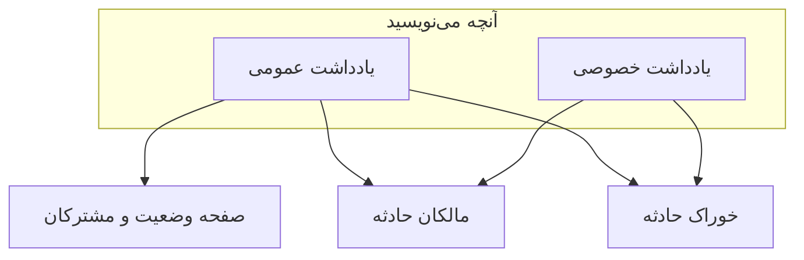

# یادداشت‌ها، مالکان و فید حادثه

هر حادثه در حین کار رویش رکوردی نوشتاری گرد می‌آورد: به‌روزرسانی برای مشتریانتان، یادداشت‌های کاری برای تیمتان، و خوراکی از فعالیت هر چیزی که رخ داده است. این صفحه نوشتن یادداشت‌های عمومی و خصوصی، اینکه هر کدام به چه کسی می‌رسد، خوراک حادثه، و مالکانی را که از هر تغییری باخبر می‌شوند پوشش می‌دهد.

:::cards
- [انتشار یک یادداشت عمومی](#انتشار-یک-یادداشت-عمومی): آنچه می‌دانید را روی صفحه وضعیت و با اعلان به مشتریان بگویید.
- [مشترکان کی خبردار می‌شوند](#یادداشت-عمومی-کی-واقعاً-به-مشترکان-میرسد): بررسی‌هایی که یادداشت عمومی از آن‌ها می‌گذرد، و نشانش.
- [خوراک حادثه](#خوراک-حادثه): خط زمانی هر چیزی که رخ داد.
- [مالکان](#مالکان): چه کسی مسئول است، و به آن‌ها چه گفته می‌شود.
:::

## چگونه کار می‌کند

بخشی از آنچه می‌نویسید برای مشتریان شماست — به‌روزرسانی‌ای که ساعت ۰۲:۱۴ روی صفحه وضعیت می‌رود و می‌گوید استقرار بد را یافته‌اید. باقی برای تیمتان است — ردیابی پشته‌ای که کسی چسبانده، نموداری که سرانجام معنا پیدا کرد، تصمیم به failover. OneUptime این دو مخاطب را از هم جدا نگه می‌دارد و هر دو را روی حادثه ثبت می‌کند.



**Public Notes** روی صفحه وضعیت شما منتشر می‌شوند و می‌توانند به مشترکان خبر دهند. **Private Notes** (مدل `IncidentInternalNote`) درون داشبورد می‌مانند. زیر هر دو، **Incident Feed** قرار دارد، خط زمانی‌ای فقط‌افزودنی که هر چیزی را که برای حادثه رخ داده ثبت می‌کند، و فهرست **Owners**، که تعیین می‌کند به چه کسی گفته شود.

همه این‌ها در منوی کناری حادثه‌اند: **Notes → Public Notes**، **Notes → Private Notes** و **Team → Owners**. خوراک روی صفحه **Overview** حادثه است.

## یادداشت‌های عمومی در برابر خصوصی

این دو گونه یادداشت در داشبورد شبیه هم به نظر می‌رسند و رفتاری بسیار متفاوت دارند.

| | یادداشت عمومی | یادداشت خصوصی |
| ------------------------ | ------------------------------------------------------------------- | --------------------------------------------------------------- |
| مدل | `IncidentPublicNote` | `IncidentInternalNote` |
| روی صفحه‌های وضعیت نشان داده می‌شود | بله، به‌عنوان بخشی از خط زمانی حادثه | هرگز — هیچ چیز در برنامه صفحه وضعیت آن را نمی‌خواند |
| زمان انتشار | `postedAt`، که می‌توانید خودتان بگذارید | ندارد: با `createdAt` مهر و مرتب می‌شود |
| به مشترکان خبر می‌دهد | وقتی **Notify status page subscribers** روشن است | هرگز: اصلاً فیلد مشترکی ندارد |
| پیوست‌ها در دسترس | بازدیدکنندگان صفحه وضعیت، از راه مسیری در صفحه وضعیت | فقط API احرازشده داشبورد |
| به مالکان خبر می‌دهد | بله | بله |

**«خصوصی» واقعاً یعنی چه.** یعنی «روی صفحه وضعیت منتشر نمی‌شود» — نه «به گروه کوچک‌تری از آدم‌ها محدود است». نقش‌های آماده‌ای که می‌توانند حادثه‌ای را بخوانند هر دو گونه یادداشت را می‌خوانند، پس هر کسی که بتواند حادثه را بخواند معمولاً یادداشت‌های خصوصی‌اش را هم می‌تواند بخواند؛ در یک نقش سفارشی این‌ها مجوزهای جداگانه‌اند، **Read Incident Status Page Note** و **Read Incident Internal Note**. اگر لازم است محدود کنید چه کسی اصلاً حادثه‌ای را ببیند، از پرچم **Private Incident** (`isPrivate`) روی خود حادثه استفاده کنید، که حادثه را از هر صفحه وضعیتی پنهان می‌کند و آن را به کاربران مالک حادثه، اعضای تیم‌های مالکش، و مدیران و مالکان پروژه محدود می‌کند.

**مالکان هر دو را می‌بینند.** کار اعلان به مالکان یادداشت‌های عمومی و خصوصی را با هم پرس‌وجو می‌کند. یادداشت خصوصی از مشترکان شما خصوصی است، نه از کسانی که پاسخ می‌دهند.

| اگر می‌خواهید… | برگزینید |
| ------------------------------------------------------ | ---------------- |
| به مشتریان بگویید چه می‌دانید و کی بیشتر خواهید دانست | **یادداشت عمومی** |
| به‌روزرسانی‌ای را که از پیش جای دیگری فرستاده‌اید با تاریخ گذشته ثبت کنید | **یادداشت عمومی** |
| فرضیه‌ای، فرمانی که اجرا کردید، یا بن‌بستی را ثبت کنید | **یادداشت خصوصی** |
| یک dump حافظه یا تصویری از داشبورد داخلی پیوست کنید | **یادداشت خصوصی** |

## انتشار یک یادداشت عمومی

:::steps
### یادداشت‌های عمومی را باز کنید

حادثه را باز کنید و در منوی کناری‌اش **Notes → Public Notes** را برگزینید. نگارنده بالای یادداشت‌ها پیش از انتشار می‌گوید چه کسی یادداشت را می‌خواند: **Public · Visible on your status page**.

### به‌روزرسانی را بنویسید

یادداشت را به مارک‌داون بنویسید، یا از یکی از **Templates** خود یا از **Draft with AI** آغاز کنید. اگر مشترکان باید فایل‌هایی را ببینند، آن‌ها را با **Attach** بیفزایید.

### تعیین کنید به چه کسی گفته شود

**Notify status page subscribers** را تیک‌خورده بگذارید تا به مشترکان خبر داده شود، یا تیکش را بردارید تا بی‌صدا منتشر شود. **Will notify** زیر آن نشان می‌دهد یادداشت به کدام صفحه‌های وضعیت می‌رسد، و **Preview** ایمیلی را که دریافت می‌کنند نشان می‌دهد.

### منتشرش کنید

روی **Post update** کلیک کنید، یا Ctrl+Enter (در Mac، ‏⌘+Enter) را بزنید. یادداشت در بالای فهرست پدیدار می‌شود، با نشانی که اعلانش را پی می‌گیرد.
:::

همین نگارنده از **Add Public Note** در منوی **Actions** خوراک حادثه هم در پنجره‌ای باز می‌شود ([خوراک حادثه](#خوراک-حادثه) را ببینید)، پس یادداشت از هر دو جا یکسان نوشته می‌شود.

| کنترل | کاربرد |
| ---------------------------------- | --------------------------------------------------------------------------------------------------------------------------------------------- |
| خود یادداشت | بدنه، به مارک‌داون. الزامی. |
| **Templates** | یکی از قالب‌های یادداشت شما را پس از آنچه تایپ کرده‌اید در یادداشت می‌گذارد. [قالب‌های یادداشت](#قالبهای-یادداشت) را ببینید. |
| **Draft with AI** | یادداشت را از روی حادثه پیش‌نویس می‌کند تا ویرایشش کنید. [تولید یادداشت با هوش مصنوعی](#تولید-یادداشت-با-هوش-مصنوعی) را ببینید. |
| **Attach** | فایل‌هایی که روی صفحه وضعیت با مشترکان به اشتراک گذاشته می‌شوند. اختیاری. |
| **Posted now** | زمانی که یادداشت می‌گوید منتشر شده: لحظه‌ای که منتشرش می‌کنید، مگر اینکه اینجا زمانی پیش‌تر برگزینید، در منطقه زمانی جاری شما. |
| **Notify status page subscribers** | جعبه انتخاب. به‌طور پیش‌فرض روشن، مگر اینکه حادثه بدون خبر دادن به مشترکان اعلام شده باشد — آن‌گاه خاموش آغاز می‌شود. برای انتشار بی‌صدا خاموشش کنید. |

**حادثه‌های بی‌صدا بی‌صدا می‌مانند.** اگر حادثه‌ای با **Notify Status Page Subscribers** خاموش (یا به‌صورت حادثه‌ای خصوصی) اعلام شده باشد، هرگز به مشترکانش درباره‌اش خبر داده نشده، پس یادداشت عمومی نباید نخستین چیزی باشد که می‌شنوند. روی چنین حادثه‌ای جعبه انتخاب خاموش آغاز می‌شود، با خطی زیر آن که دلیلش را می‌گوید. همچنان می‌توانید تیکش بزنید تا درباره آن یادداشت به مشترکان خبر داده شود. یادداشت‌هایی که بدون انتخابی صریح منتشر می‌شوند از همین قاعده پیروی می‌کنند: یادداشت‌های Slack و Microsoft Teams، گردش‌های کاری، و درخواست‌های API که `shouldStatusPageSubscribersBeNotifiedOnNoteCreated` را نمی‌فرستند. یک `true` یا `false` صریح همیشه نگه داشته می‌شود. یادداشت‌های عمومی روی [رویدادهای نگهداری زمان‌بندی‌شده](/docs/status-pages/subscribers#رویدادهای-نگهداری-زمانبندیشده) و [اپیزودهای حادثه](/docs/status-pages/subscribers) از قاعده‌ای مشابه پیروی می‌کنند، بر پایه اینکه آیا خود رویداد یا اپیزود هنگام ساخته شدن به مشترکان خبر داد؛ خصوصی کردن یک اپیزود بر آن اثری ندارد.

**ببینید یادداشت به چه کسی می‌رسد.** تا **Notify status page subscribers** تیک‌خورده است، سطر **Will notify** زیر آن صفحه‌های وضعیتی را که یادداشت به آن‌ها می‌رود با شمار «حداکثر» مشترکان برای هر کانال فهرست می‌کند، و صفحه‌هایی را که مانیتورهای حادثه را فهرست کرده‌اند اما خبردار نمی‌شوند، با دلیلش. وقتی کسی خبردار نخواهد شد چیزی نشان نمی‌دهد، مگر اینکه حادثه از صفحه‌های وضعیت پنهان باشد یا محدوده صفحه وضعیتش دلیلش باشد. از محدوده صفحه وضعیت حادثه پیروی می‌کند، پس یادداشتی روی حادثه‌ای که به دو صفحه سایت محدود شده می‌گوید به همان دو می‌رسد. [یک صفحه وضعیت برای هر مخاطب](/docs/status-pages/one-status-page-per-audience) را ببینید.

**ببینید چه چیزی به دستشان می‌رسد.** کنار همان جعبه انتخاب، **Preview** ایمیلی را نشان می‌دهد که مشترکان هرکدام از آن صفحه‌های وضعیت برای یادداشتی که می‌نویسید دریافت می‌کنند، و اینکه کدام قالب به کار می‌رود و چرا. تا یادداشت متنی نداشته باشد خاکستری می‌ماند. **Send test to me** همان ایمیل را به ایمیل حساب خود شما می‌فرستد، و به هیچ کس دیگر. [پیش‌نمایش ایمیل پیش از فرستادن](/docs/status-pages/subscribers#پیشنمایش-ایمیل-پیش-از-فرستادن) را ببینید.

> [!TIP]
> **زمان انتشار مهر زمانی واقعی یادداشت است.** صفحه‌های وضعیت یادداشت‌های عمومی را بر پایه `postedAt` مرتب و نمایش می‌دهند، نه بر پایه زمان تایپشان — پس اگر صفحه وضعیت را با به‌روزرسانی‌ای که ۴۰ دقیقه پیش فرستادید همراه می‌کنید، **Posted now** را برگزینید و زمانی را بگذارید که واقعاً رخ داد. اگر یادداشتی از راه API (`/api/incident-public-note`) بدون آن برسد، OneUptime زمان جاری را مهر می‌زند.

هر یادداشت نشان می‌دهد چه کسی آن را نوشته، زمان انتشارش، مارک‌داون نمایش‌داده‌شده با پیوست‌هایش و، در سرصفحه‌اش، اینکه اعلان مشترکانش در چه وضعی است. **Search notes…** یادداشت‌ها را بر پایه آنچه می‌گویند پیدا می‌کند، و خوراک را می‌توان از تازه‌ترین یا از قدیمی‌ترین خواند.

## انتشار یک یادداشت خصوصی

**Notes → Private Notes** عمداً ساده‌تر است. همان نگارنده است، که می‌گوید **Private · Only your team can see this**، با خود یادداشت، **Templates**، **Draft with AI** و **Attach** برای فایل‌هایی که برای تیم پاسخ به حادثه است. **Add Private Note** در منوی **Actions** خوراک حادثه آن را در پنجره‌ای باز می‌کند. از راه API، یادداشت‌های خصوصی `/api/incident-internal-note` هستند.

بدون زمان انتشار، بدون جعبه انتخاب مشترک — یادداشت هنگام ساخته شدن مهر می‌خورد.

هر دو گونه یادداشت در ویرایشگر مارک‌داون نوشته می‌شوند، که با **Indent** و **Outdent** — یا Tab و Shift+Tab — آیتم‌های فهرست را تودرتو می‌کند، و فهرست‌ها، پیوندها و قالب‌بندی آنچه را از Word، ‏Google Docs یا صفحه‌ای دیگر از OneUptime می‌چسبانید نگه می‌دارد. Ctrl+Z تورفتگی یا بیرون‌آمدگی را برمی‌گرداند، و در حالت دیداری بلوک‌ها و چسباندن‌هایی را هم که ویرایشگر گذاشته، به ترتیب و همراه با آنچه تایپ کرده‌اید. بلوک کدی که از یک یادداشت کپی شود به‌صورت بلوک کد چسبانده می‌شود، و واژه‌ای که از آن کپی شود به‌صورت کد درون‌خطی. [اعلام یک حادثه](/docs/incidents/declaring-incidents#گام-۱-incident-details) را ببینید.

## پیوست‌ها روی یادداشت‌ها

هر دو گونه یادداشت پیوست فایل را از راه دکمه **Attach** نگارنده می‌پذیرند، و هر دو زیر بدنه یادداشت فهرستی از پیوست‌ها با پیوند **Download attachment** برای هر فایل نمایش می‌دهند.

تفاوتشان در این است که چه کسی می‌تواند فایل را بگیرد:

- **پیوست‌های یادداشت عمومی** برای بازدیدکنندگان صفحه وضعیت از راه مسیری در صفحه وضعیت، کنار خود یادداشت، دریافت‌شدنی‌اند.
- **پیوست‌های یادداشت خصوصی** فقط از راه API احرازشده داشبورد در دسترس‌اند. هیچ مسیری در صفحه وضعیت برایشان نیست.

این پیوست‌ها را به همان تصمیم عمومی/خصوصی متن یادداشت تبدیل می‌کند. تصویری از خط زمانی برای مشتریان روی یادداشتی عمومی می‌رود؛ یک dump پیکربندی روی یادداشتی خصوصی.

تصویرها هم از همین تصمیم پیروی می‌کنند. تصویری که در یادداشتی می‌چسبانید یا رها می‌کنید، یا با **Upload Image** می‌افزایید، در پروژه حادثه ذخیره و درون یادداشت نشان داده می‌شود، و اینکه چه کسی آن را می‌بیند از یادداشت پیروی می‌کند:

- **در یادداشتی خصوصی** — یا در یادداشتی عمومی پیش از انتشار — تصویر فقط به اعضای پروژه نشان داده می‌شود، که همان‌طور که پروژه می‌خواهد وارد شده‌اند. هر کس دیگری که نشانی‌اش را باز کند چیزی نمی‌بیند، گویی آنجا تصویری نیست.
- **در یادداشتی عمومی** تصویر به هر کسی که می‌تواند یادداشت را ببیند نشان داده می‌شود: روی صفحه وضعیت، و در ایمیل‌هایی که مشترکانش می‌گیرند. یادداشت عمومی همیشه همراه حادثه‌اش نشان داده می‌شود، هرگز بی آن: تا وقتی حادثه از صفحه‌های وضعیت پنهان یا خصوصی است، تصویرهای یادداشت‌هایش هم فقط به اعضای پروژه نشان داده می‌شوند.

هر بارگذاری خصوصی آغاز می‌شود، چه از داشبورد چه از API. تصویر فقط تا وقتی برای همه دیدنی است که چیزی که صفحه‌های وضعیت شما نشان می‌دهند آن را داشته باشد: یادداشتی عمومی تا وقتی حادثه، اپیزود یا رویداد نگهداری زمان‌بندی‌شده‌اش روی صفحه‌های وضعیت نشان داده می‌شود، اطلاعیه‌ای از زمانی که نمایشش آغاز می‌شود، توضیحات حادثه تا وقتی حادثه **Visible on Status Page** است و خصوصی نیست، پس‌رویدادنامه‌اش وقتی آن هم آنجا منتشر شده باشد، توضیحات یک اپیزود یا یک رویداد نگهداری زمان‌بندی‌شده تا وقتی روی صفحه‌های وضعیت نشان داده می‌شود (هرگز تا وقتی اپیزود خصوصی است)، و توضیحات نمای کلی، گروه‌ها و منابع خود صفحه وضعیت. وقتی این پایان یابد — حادثه پنهان یا خصوصی شود، تصویر از متن برداشته شود، یادداشت یا حادثه حذف شود — تصویر دوباره خصوصی می‌شود، مگر اینکه چیز دیگری که صفحه‌های وضعیت شما نشان می‌دهند هنوز آن را داشته باشد. توضیحات یک فرم و پیام تشکرش هم، تا وقتی فرم ارسال می‌پذیرد، تصویرهایشان را به همین شکل به همه نشان می‌دهند.

خواندن یک یادداشت از راه API، ‏Terraform یا یک گردش کار فقط پیوست‌هایی را فهرست می‌کند که خواننده می‌تواند باز کند: فایل‌های پروژه یادداشت، و فایل‌های عمومی. پیوستی که یادداشت از پروژه‌ای دیگر نام می‌برد از فهرست کنار گذاشته می‌شود، گویی یادداشت آن را ندارد.

## تولید یادداشت با هوش مصنوعی

نگارنده دکمه **Draft with AI** دارد، هم در هر دو صفحه یادداشت و هم در پنجره‌های **Add Public Note** و **Add Private Note** خوراک. حادثه را به ارائه‌دهنده هوش مصنوعی پروژه شما می‌فرستد و مارک‌داون تولیدشده را در یادداشت می‌گذارد، جایی که پیش از انتشار ویرایشش می‌کنید — هیچ چیز خودکار منتشر نمی‌شود.

| پنجره | چه می‌نویسد | قالب‌ها |
| ---------------------------------- | -------------------------------------------------------------------- | ----------------------------------------------------------------- |
| **Generate Public Note with AI** | یادداشتی برای مشتریان، از تحلیل داده حادثه. | **Status Update**، **Resolution Notice**، **Maintenance Update** |
| **Generate Private Note with AI** | یادداشتی فنی و داخلی. | **Investigation Update**، **Technical Analysis**، **Shift Handoff** |

پشت دکمه، داشبورد به `/incident/generate-note-from-ai/{incidentId}` با قالب برگزیده و نوع یادداشت `public` یا `internal` درخواست می‌فرستد.

آنچه فرستاده می‌شود متن حادثه است. تصویر یا فایلی که در آن جاسازی شده — مثلاً عکس صفحه‌ای که در توضیحات چسبانده شده — با یادداشتی کوتاه مانند `[image omitted: PNG, 340 KB]` جایگزین می‌شود، و هر فیلد متنی به ۱۶٬۰۰۰ نویسه کوتاه می‌شود، تا یک چسباندن بزرگ هرگز جای بقیه را تنگ نکند. خود حادثه تصویرهایش را نگه می‌دارد.

## قالب‌های یادداشت

اگر تیمتان در هر قطعی همان سه به‌روزرسانی را می‌نویسد، یک بار ذخیره‌شان کنید. منوی **Templates** نگارنده، هم در هر دو صفحه یادداشت و هم در پنجره‌های یادداشت خوراک، آن‌ها را فهرست می‌کند، و برگزیدن یکی آن را در یادداشت می‌گذارد.

قالب‌ها میان یادداشت‌های عمومی و خصوصی مشترک‌اند: یک فهرست قالب به هر دو خدمت می‌کند، و همان قالب را می‌توان در هر گونه یادداشتی گذاشت.

جانگهدارهای یک قالب — `{{incident.title}}`، `{{incident.state}}`، `{{incident.customFields.impact}}` و دیگرانی که زیر [قالب‌های یادداشت](/docs/incidents/settings#قالبهای-یادداشت) فهرست شده‌اند — هنگام برگزیدن قالب با مقادیر کنونی حادثه پر می‌شوند، هم در صفحه‌های یادداشت و هم در پنجره‌های **Acknowledge** و **Resolve**. آنچه پیش‌تر تایپ کرده بودید هرگز تغییر نمی‌کند، و جانگهدار بی‌مقدار همان‌طور که نوشته شده باقی می‌ماند.

> [!IMPORTANT]
> پیش از انتشار یادداشتی عمومی، یادداشت پرشده را بخوانید: `{{incident.affectedStatusPages}}` نام همه صفحه‌های وضعیتی را که حادثه به آن‌ها می‌رسد می‌آورد، و مشترکان همه آن‌ها آن را می‌خوانند.

آن‌ها را در **Incidents → Settings → Note Templates** مدیریت می‌کنید — کارت **Public or Private Note Templates for Incidents** نام دارد و فرمش یک صفحه است: **Template Name** و **Template Description**، هر دو الزامی، و سپس بدنه. تا وقتی هیچ قالبی ندارید، منوی **Templates** همین را می‌گوید و به آنجا پیوند می‌دهد.

## انتشار یادداشت از Slack یا Microsoft Teams

اگر فضای کاری‌ای وصل کرده باشید، پاسخ‌دهندگان هرگز لازم نیست کانال را ترک کنند. هم Slack و هم Microsoft Teams کنشی برای افزودن یادداشت دارند که پنجره‌ای با فهرست کشویی **Note Type** — **Public Note** (منتشرشده روی صفحه وضعیت) یا **Private Note** (فقط برای اعضای تیم دیدنی) — و جعبه متن **Note** باز می‌کند، و نتیجه را مستقیم روی حادثه می‌نویسد.

سه جزئیات که دانستنشان می‌ارزد:

- **محافظت از تکرار** — هر یادداشت پیام Slackی را که از آن آمده ثبت می‌کند (`postedFromSlackMessageId`، با قالب `channel_id:message_ts`)، پس چند نفر که به همان پیام واکنش نشان می‌دهند یک یادداشت می‌سازند، نه پنج تا.
- **یادداشت‌ها بازتاب می‌یابند** — انتشار هر گونه یادداشتی پیامی هم به کانال حادثه وصل‌شده می‌فرستد، چون آیتم خوراک یادداشت با اعلان فضای کاری فعال ساخته می‌شود.
- **با نام کسی که خواست منتشر می‌شود** — یادداشتی که از پنجره یا از یک واکنش می‌آید با مجوزهای OneUptime همان شخص منتشر می‌شود، پس به مجوز او برای انتشار آن گونه یادداشت روی حادثه نیاز دارد. وقتی رد شود، دلیلش به او گفته می‌شود — در Slack با پیامی مستقیم، و در Microsoft Teams در همان گفتگو (برای یک واکنش، در رشته پیام) — و چیزی منتشر نمی‌شود.

## یادداشت عمومی کی واقعاً به مشترکان می‌رسد

ساختن یادداشتی عمومی با **Notify Status Page Subscribers** روشن به‌خودی‌خود تضمین نمی‌کند که ایمیلی بیرون برود. یادداشت باید از زنجیره‌ای از بررسی‌ها بگذرد، و هر ناکامی به‌جای خطا دادن دلیلی مشخص ثبت می‌کند:

```mermaid title="بررسی‌هایی که یادداشت عمومی پیش از رسیدن به مشترکان از آن‌ها می‌گذرد"
flowchart TB
    note["یادداشت عمومی منتشر شد"] --> box{"جعبه خبر دادن روشن است؟"}
    box -->|"خیر"| skipped["به مشترکان خبر داده نشد"]
    box -->|"بله"| incident{"حادثه روی صفحه‌های وضعیت است؟"}
    incident -->|"خیر"| skipped
    incident -->|"بله"| pages{"صفحه در محدوده است؟"}
    pages -->|"خیر"| skipped
    pages -->|"بله"| prefs{"مشترک خواسته است؟"}
    prefs -->|"بله"| sent["پیام فرستاده شد"]
```

1. **Notify Status Page Subscribers** باید روشن باشد. اگر نباشد، یادداشت همان لحظه ساخته شدن «گذشته‌شده» مهر می‌خورد. روی حادثه‌هایی که بدون خبر دادن به مشترکان اعلام شده‌اند خاموش آغاز می‌شود.
2. یادداشت باید به حادثه‌ای تعلق داشته باشد که هنوز وجود دارد.
3. حادثه باید دست‌کم یک مانیتور پیوست داشته باشد — بدون مانیتور، منبعی در صفحه وضعیت نیست که یادداشت به آن برسد.
4. پرچم **Visible on Status Page** حادثه (`isVisibleOnStatusPage`) باید true باشد، و حادثه نباید خصوصی باشد (`isPrivate`). حادثه خصوصی، هر چه آن پرچم بگوید، از هر صفحه وضعیتی پنهان است — [نگه داشتن حادثه بیرون از صفحه وضعیت](/docs/incidents/states-and-severities#نگه-داشتن-حادثه-بیرون-از-صفحه-وضعیت) را ببینید.
5. هر صفحه وضعیتی که حادثه به آن می‌رسد باید **Show Incidents** (`showIncidentsOnStatusPage`) را روشن داشته باشد. صفحه‌هایی که حادثه به آن‌ها می‌رسد همان‌هایی‌اند که مانیتورهایش را فهرست کرده‌اند، تنگ‌شده به صفحه‌هایی که حادثه به آن‌ها محدود شده، اگر باشد. حادثه‌ای که به هیچ صفحه‌ای محدود نشده از صفحه‌هایی که فقط حادثه‌های محدودشده به خودشان را نشان می‌دهند می‌گذرد. [یک صفحه وضعیت برای هر مخاطب](/docs/status-pages/one-status-page-per-audience) را ببینید.
6. هر مشترک باید از ترجیحات خودش بگذرد — لغو اشتراک نکرده باشد، و جایی که صفحه به مشترکان اجازه انتخاب می‌دهد، مشترک این منبع و نوع رویداد `Incident` باشد.

> [!NOTE]
> **اعلان‌ها آنی نیستند.** کاری که آن‌ها را می‌فرستد دقیقه‌ای یک بار اجرا می‌شود، پس میان ذخیره یادداشت و بیرون رفتن نامه تا حدود یک دقیقه انتظار داشته باشید. **Notifying subscribers soon** روی یک یادداشت، و **Sending Soon** روی اعلان‌های خود حادثه، همین معنا را دارند.

سرصفحه یادداشت عمومی کل این مسیر را با یک نشان پی می‌گیرد. روی آن کلیک کنید تا پیام وضعیت اعلان را بخوانید، که می‌گوید چه رخ داد:

| نشان | یعنی چه |
| ------------------------------ | ------------------------------------------------------------------------------------------------------------------------------------------------- |
| **Subscribers not notified** | چیزی فرستاده نشد: یادداشت با **Notify Status Page Subscribers** تیک‌نخورده منتشر شد، یا یکی از دروازه‌های بالا بسته بود. دلیل ثبت شده است. |
| **Notifying subscribers soon** | در صف، منتظر اجرای بعدی کار ارسال. |
| **Notifying subscribers** | کار در حال پیمودن فهرست مشترکان است. |
| **Subscribers notified** | پیام هر مشترکی فرستاده شد. پیام وضعیت، به ازای هر صفحه وضعیت، فهرست می‌کند چند پیام روی هر کانال رفت. |
| **Notification failed** | به هر مشترکی فرستاده نشد، یا کار با خطا ایستاد. پیام وضعیت می‌گوید کدام. |

**فرستاده یعنی فرستاده.** کار منتظر هر پیام می‌ماند: ایمیل یا پیامک وقتی فرستاده شمرده می‌شود که سرور ایمیل یا فراهم‌کننده پیامک آن را پذیرفته باشد، و پیام Slack، ‏Microsoft Teams یا وب‌هوک وقتی که طرف دیگر پاسخ داده باشد. پیامی که رد شود، خطا بدهد یا ظرف ۴ دقیقه پاسخی نگیرد ناموفق شمرده می‌شود، و یک ناکامی نشان را به **Notification failed** تبدیل می‌کند؛ به مشترکان دیگر همچنان فرستاده می‌شود. آن‌گاه پیام وضعیت چیزی شبیه این است: `Not every subscriber was sent this notification: 2 of 61 messages failed. Site 03: 41 email sent. Site 07: 16 email, 2 SMS sent; 2 email failed.` «فرستاده» تا جایی است که OneUptime می‌بیند: سرور ایمیل هنوز می‌تواند ایمیلی را بعداً برگرداند.

:::details صفحه‌های بزرگ و ارسال‌های طولانی
مشترکان یک صفحه وضعیت در دسته‌های ۱۰٬۰۰۰ تایی خوانده می‌شوند تا به همه‌شان برسد، و ۲۰ پیام هم‌زمان در راه‌اند. یک اعلان پس از ۲۰ دقیقه دیگر پیام تازه‌ای آغاز نمی‌کند: آنچه تا آن زمان به آن نرسیده فهرست می‌شود و **Notification failed** علامت می‌خورد. ارسالی که در میانه راه قطع شده باشد — سرورش از نو راه افتاده یا پاسخ نداده — هم **Notification failed** علامت می‌خورد، با پیامی که با `Interrupted:` آغاز می‌شود، وقتی ۴۰ دقیقه در **Notifying subscribers** مانده باشد، تا هرگز برای همیشه آنجا نماند. [بررسی آنچه فرستاده شد](/docs/status-pages/subscribers#بررسی-آنچه-فرستاده-شد) را ببینید.
:::

### فرستادن دوباره اعلان یک یادداشت

روی نشان اعلان یک یادداشت کلیک کنید تا ببینید چه رخ داد. یادداشتی که اعلانش ناموفق بوده **Retry notification** را پیشنهاد می‌کند، و یادداشتی که اعلانش رفته **Resend notification** را. هر دو نخست می‌پرسند: پنجره تأیید صفحه‌های وضعیتی را که یادداشت اکنون به آن‌ها می‌رسد، با شمار «حداکثر» گیرندگان هر کانال، فهرست می‌کند، یا می‌گوید که به هیچ‌کس نمی‌رسد، و می‌گوید چه رخ می‌دهد. هرکدام یادداشت را به حالت در انتظار برمی‌گرداند تا اجرای بعدی برش دارد، و آن را به هر صفحه وضعیتی که حادثه اکنون به آن می‌رسد می‌فرستد، از جمله به مشترکانی که پیش‌تر آن را گرفته‌اند. اگر از زمان انتشار یادداشت صفحه‌هایی را که حادثه به آن‌ها محدود است تغییر داده باشید، به صفحه‌هایی می‌رود که اکنون به آن‌ها محدود است. یادداشتی که با **Notify Status Page Subscribers** تیک‌نخورده منتشر شده هیچ‌کدام را پیشنهاد نمی‌کند، چون هرگز قرار نبود فرستاده شود، و تا وقتی اعلانی هنوز در صف است یا در حال فرستاده شدن است هم هیچ‌کدام پیشنهاد نمی‌شود. یادداشت‌های عمومی رویدادهای نگهداری زمان‌بندی‌شده و اپیزودهای حادثه فقط پس از ناکامی **Retry notification** را نگه می‌دارند.

فرستادن دوباره اعلان یک یادداشت، درست مانند انتشار آن، آنچه یادداشت می‌گوید را به همه مشترکان می‌گوید؛ پس هم مجوز انتشار یادداشت‌های عمومی‌ای که به مشترکان خبر می‌دهند لازم است و هم مجوز ویرایش یادداشت‌های عمومی. از راه API همان به‌روزرسانی‌ای است که داشبورد انجام می‌دهد، یعنی برگرداندن `subscriberNotificationStatusOnNoteCreated` به `Pending`؛ برای فراخواننده‌ای که این مجوزها را ندارد، برای یادداشتی که بدون خبر دادن به مشترکان منتشر شده، و تا وقتی اعلان یادداشت در حال فرستاده شدن است رد می‌شود.

:::details اعلان «ساخته شد» حادثه چگونه ادامه می‌یابد
فقط اعلان «ساخته شد» حادثه از همان جایی که ایستاده بود ادامه می‌یابد: صفحه‌های وضعیتی را که کامل به آن‌ها فرستاده ثبت می‌کند، و **Retry** در **Overview** حادثه از آن‌ها می‌گذرد. این ثبت به ازای هر صفحه وضعیت نگه داشته می‌شود، نه به ازای هر مشترک، پس صفحه‌ای که ارسال در میانه آن ایستاده دوباره کامل فرستاده می‌شود، از جمله به مشترکانی از آن صفحه که پیش‌تر آن را گرفته‌اند. پنجره تأیید **Retry** گزینه **Send it to every status page again, including the pages already reached** را پیشنهاد می‌کند که آن را به **Resend to all pages** تبدیل می‌کند، و **Resend** پس از یک ارسال موفق آن را دوباره به همه صفحه‌ها می‌فرستد. [یک صفحه وضعیت برای هر مخاطب](/docs/status-pages/one-status-page-per-audience#افزودن-صفحههای-وضعیت) را ببینید.
:::

### ویرایش یک یادداشت عمومی

**ویرایش یادداشت عمومی بی‌صداست، مگر آنکه بخواهید.** فرم ویرایش یادداشت جعبه انتخاب **Notify subscribers about this update** را دارد که هر بار تیک‌نخورده است. برای تغییری که مشترکان باید از آن باخبر شوند تیکش بزنید تا یادداشت ویرایش‌شده را، با نشانه به‌روزرسانی، دریافت کنند؛ آن‌گاه یادداشت کنار نشان اصلی، نشان دومی برای به‌روزرسانی نشان می‌دهد، که پس از ناکامی **Retry notification** خودش را دارد:

| نشان به‌روزرسانی | یعنی چه |
| ------------------- | --------------------------------------------------- |
| **Update queued** | منتظر اجرای بعدی کار ارسال. |
| **Sending update** | کار در حال پیمودن فهرست مشترکان است. |
| **Update sent** | یادداشت ویرایش‌شده برای هر مشترکی فرستاده شد. |
| **Update failed** | برای هر مشترکی فرستاده نشد. |
| **Update not sent** | یکی از دروازه‌های بالا جلویش را گرفت. |

به‌روزرسانی فرستاده‌شده دوباره پیشنهاد نمی‌شود: یادداشت را با همان جعبه انتخاب تیک‌خورده ویرایش کنید تا تازه‌ترین متن فرستاده شود، یا خود یادداشت را دوباره بفرستید. اگر اعلان اصلی هنوز فرستاده نشده باشد، به‌روزرسانی جداگانه‌ای نمی‌رود — اعلان اصلی ویرایش را با خود می‌برد. اگر همان لحظه در حال فرستاده شدن باشد، به‌روزرسانی منتظر می‌ماند تا کارش تمام شود و سپس فرستاده می‌شود. این جعبه انتخاب و **Retry notification** به‌روزرسانی همان مجوزهای فرستادن دوباره اعلان یادداشت را می‌خواهند؛ بدون آن‌ها همچنان می‌توانید یادداشت را ویرایش کنید، بی آنکه به کسی خبر داده شود. [مشترکان و اطلاعیه‌ها](/docs/status-pages/subscribers) را ببینید.

پیامی که واقعاً به مشترکان می‌رسد به ازای هر صفحه وضعیت و هر کانال قالب‌بندی می‌شود — ایمیل، پیامک، Slack و Microsoft Teams هرکدام قالب خودشان را برای رویداد **Subscriber Incident Note Created** دارند، با متغیرهایی برای نام و نشانی صفحه وضعیت، پیوند جزئیات، منابع متأثر، شدت و عنوان حادثه، بدنه یادداشت، برچسب‌ها، صفحه‌های وضعیت متأثر و فیلدهای سفارشی حادثه، و پیوند لغو اشتراکی برای هر مشترک. پیام‌های پیش‌فرض ایمیل، Slack و Microsoft Teams همچنین فیلدهای سفارشی حادثه را که **Include in Subscriber Notifications** برایشان روشن است، با مقادیر کنونی‌شان، فهرست می‌کنند. برای اینکه آن قالب‌ها و کانال‌ها چگونه پیکربندی می‌شوند [مشترکان و اطلاعیه‌ها](/docs/status-pages/subscribers) را ببینید.

## خوراک حادثه

کارت **Incident Feed** پایین ستون چپ صفحه **Overview** حادثه قرار دارد. داستان حادثه به ترتیب است: هر آیتم آیکنی، آواتار و نام کسی که آن را پدید آورد، مهر زمانی نسبی با زمان محلی دقیق هنگام نگه داشتن نشانگر، و بدنه‌ای مارک‌داون دارد. به‌طور پیش‌فرض تازه‌ترین آیتم‌ها در بالا هستند.

برخی آیتم‌ها جزئیات بیشتری دارند — برای نمونه اعلان مالک هر کسی را که نامه گرفت فهرست می‌کند، و اعلان مشترکان هر صفحه وضعیتی را که به آن رفت، با شمار پیام‌های فرستاده و ناموفق روی هر کانال و موضوعی که ایمیلش با آن رفت، و سپس، اگر چیزی فرستاده باشد، مقادیر فیلدهای سفارشی که در پیامی گذاشت، زیر **Custom fields sent**. این‌ها دکمه **More Information** نشان می‌دهند که پنل **More Information** را باز می‌کند.

سرصفحه کارت منوی **Actions** هم دارد تا بتوانید بدون ترک خط زمانی عمل کنید:

- **Execute Runbook** — [رانبوکی](/docs/runbooks/index) را روی این حادثه آغاز کنید.
- **Execute On-Call Policy** — سیاستی را درجا فرا بخوانید. سیاست بایگانی‌شده کسی را فرانمی‌خواند: گزارش اجرای آن روی حادثه می‌گوید که چون سیاست بایگانی شده اجرا نشد.
- **Add Public Note** — نگارنده صفحه **Public Notes**، در پنجره‌ای: یادداشت را بنویسید، سپس **Post update**. قالب‌ها، **Draft with AI**، پیوست‌ها، **Notify status page subscribers** با اینکه به چه کسی می‌رسد، و **Preview** همه آنجا هستند. یادداشت همین حالا منتشر می‌شود؛ برای گذاشتن زمانی پیش‌تر، **Posted now** را برگزینید.
- **Add Private Note** — نگارنده صفحه **Private Notes**، در پنجره‌ای: یادداشت را بنویسید، سپس **Add note**.

هر دو کنش یادداشت برای کسی که اجازه نوشتن یادداشت ندارد قفل‌اند و مجوزی را که کم است نام می‌برند. پس از انتشار یادداشت، پنجره بسته می‌شود و خوراک آن را نشان می‌دهد.

باقی چیزها پشت دکمه **⋯** کنارش هستند، همان دکمه **More options** که سرصفحه کارت یک جدول دارد، تا سرصفحه تا حد امکان دکمه کمتری نشان دهد:

- **Newest first** / **Oldest first** — ترتیبی که خوراک به آن خوانده می‌شود. ترتیب در حال استفاده تیک می‌خورد، و مرورگرتان این انتخاب را برای خوراک هر حادثه به خاطر می‌سپارد.
- **Filter by event type** — پنجره‌ای که نوع‌های رویداد خوراک را، هر کدام با آیکنی که آیتم‌هایش دارند، فهرست می‌کند و وقتی فهرست بلند است جعبه جستجو هم دارد. آن‌هایی را که می‌خواهید نشان داده شوند تیک بزنید و **Apply Filters** را برگزینید؛ اگر چیزی تیک نخورد، همه نوع‌ها نشان داده می‌شوند. تا وقتی خوراک پالایش شده است، جعبه‌ای بالای آن می‌گوید چند نوع رویداد را نشان می‌دهد، با یک برچسب برای هر نوع، و **Edit Filters** و **Clear Filters**. پالایه ذخیره نمی‌شود: از حادثه که بیرون بروید، خوراکش دوباره همه چیز را نشان می‌دهد.
- **Refresh** — خوراک را دوباره می‌گیرد.

> [!NOTE]
> **خوراک فقط‌افزودنی است، و گزارش حسابرسی شما نیست.** API ساخت و خواندن آیتم‌های خوراک را مجاز می‌کند اما به‌روزرسانی یا حذف آن‌ها را نه، پس کسی نمی‌تواند بی‌صدا تاریخچه حادثه‌ای را بازنویسی کند. دائمی هم نیست: در نصب‌های دارای صورت‌حساب، سطرهای خوراک قدیمی‌تر از سه سال برداشته می‌شوند. برای سابقه‌ای ماندگار از اینکه چه کسی چه چیزی را تغییر داد، از **Advanced → Audit Logs** در منوی کناری حادثه استفاده کنید.

## خوراک چه چیزی را ثبت می‌کند

آیتم‌های خوراک را خود سرویس حادثه، هر دو سرویس یادداشت، خط زمانی وضعیت، تغییرات مالک و عضو، پیوند دادن و برداشتن پیوند هشدارها، موتورهای قاعده، اجرای کشیک، اجراکننده‌های بررسی و پس‌رویدادنامه هوش مصنوعی، و کارهای کرون اعلان می‌نویسند. نوع‌های رویداد این‌ها را پوشش می‌دهند:

- **خود حادثه** — `IncidentCreated`، `IncidentUpdated`، `IncidentStateChanged`. ورودی `IncidentUpdated` ثبت می‌کند که یک ویرایش چه چیزی را تغییر داد: عنوان، توضیحات، ریشه علت، یادداشت‌های اصلاح، برچسب‌ها، شدت، مانیتورها و وضعیتی که روی آن‌ها گذاشته شده، و صفحه‌های وضعیتی که به محدوده حادثه افزوده یا از آن برداشته شده‌اند. برای هر مقداری که تغییر کرد یک خط دارد و برای مقداری که همان‌طور ذخیره شد هیچ خطی ندارد، پس ذخیره کارتی بدون تغییر، یا API یا گردش کاری که حادثه را همان‌طور که هست بازنویسی کند، هیچ ورودی‌ای نمی‌افزاید. متنی که یکسان خوانده می‌شود یکسان است (جز پایان خط‌ها و فاصله‌های پیرامونش)، و برچسب‌ها با هر ترتیبی همان مجموعه‌اند؛ مقداری که پاک شده به‌صورت برداشته‌شده خوانده می‌شود، و برداشتن همه برچسب‌ها به‌صورت "All labels removed.". ورودی‌های **Alert updated** یک هشدار هم همین‌گونه کار می‌کنند.
- **یادداشت‌ها و نوشته‌ها** — `PublicNote`، `PrivateNote`، `RootCause`، `RemediationNotes`، `PostmortemNote`. آیتم `PostmortemNote` وقتی نوشته می‌شود که یادداشت پس‌رویدادنامه تغییر کند، نه هر بار که پس‌رویدادنامه ذخیره می‌شود.
- **آدم‌ها** — `OwnerUserAdded`، `OwnerTeamAdded`، `OwnerUserRemoved`، `OwnerTeamRemoved`، `IncidentMemberAdded`، `IncidentMemberRemoved`.
- **هشدارهای پیوندشده** — `AlertLinked` و `AlertUnlinked`، که به‌صورت **Alert Linked** و **Alert Unlinked** نشان داده می‌شوند.
- **اعلان‌ها** — `OwnerNotificationSent`، `SubscriberNotificationSent`، `OnCallPolicy`، `OnCallNotification`.
- **خودکارسازی** — `LabelRuleExecuted`، `OwnerRuleExecuted`، `PrivacyRuleExecuted`، `OnCallRuleExecuted`، `AutoRemediation`.
- **تماس‌های تصویری** — `VideoCallStarted` و `VideoCallFailed`: تماسی که برای حادثه آغاز شد، همراه با پیوند پیوستن به آن، یا دلیلی که یک ارائه‌دهنده نتوانست تماسی را آغاز کند. [تماس‌های تصویری](/docs/workspace-connections/video-calls) را ببینید.

هر نوع آیکن خودش را دارد، پس می‌توانید خوراکی بلند را مرور کنید و تغییر وضعیت‌ها را از میان پرحرفی‌ها بیرون بکشید. تحلیل ریشه علتی که هوش مصنوعی تولید کرده به‌طور متمایز علامت می‌خورد و در حالت محدودی از مارک‌داون نمایش داده می‌شود. آیتم **Incident Created**، آیتمی که عنوان تازه را ثبت می‌کند و آیتم‌های پیوستن به یک اپیزود یا جدا شدن از آن، عنوان را دقیقاً همان‌طور که تایپ شده نشان می‌دهند: نویسه‌های `\`، `[`، `]`، `*`، `_`، `~`، بک‌تیک‌ها و \< را در آن خنثی می‌کنند، پس عنوان نمی‌تواند تصویر، HTML خام، اشاره‌ای در Slack مانند \<!here\>، پیوندی که متنش مقصدش را پنهان کند، یا متن پررنگ، کج یا کد شود. نشانی‌ای درون عنوان همچنان به‌صورت پیوندی به همان نشانی نشان داده می‌شود.

پیوند دادن یک هشدار روی خود هشدار هم ثبت می‌شود. هشدارها خوراک خودشان را دارند، جایی که همان تغییر به‌صورت **Linked to Incident** (`LinkedToIncident`) یا **Unlinked from Incident** (`UnlinkedFromIncident`)، با نام حادثه، دیده می‌شود. فقط ورودی‌های **Alert Linked** و **Alert Unlinked** حادثه به Slack و Microsoft Teams فرستاده می‌شوند، پس هر پیوند یک بار اعلام می‌شود. حادثه‌ای که از روی هشدارها اعلام می‌شود به‌جای یک ورودی برای هر هشدار، یک ورودی **Alert Linked** می‌گیرد که همه آن‌ها را فهرست می‌کند، و عنوان هشدار یا حادثه خصوصی در ورودی سوی دیگر نوشته نمی‌شود. [هشدارهای پیوندشده](/docs/incidents/linked-alerts) را ببینید.

خوراک‌ها به حریم خصوصی حادثه احترام می‌گذارند: برای حادثه‌های خصوصی، خواندن خوراک همان‌گونه پالایش می‌شود که خود حادثه.

## مالکان

مالکان آدم‌ها و تیم‌هایی‌اند که مسئول حادثه‌اند. همه چیزهایی که برای حادثه رخ می‌دهد به آن‌ها اعلام می‌شود — و دلیل این‌اند که حادثه‌ای، در حالی که همه گمان می‌کنند کس دیگری رویش است، بی‌توجه نماند.

در منوی کناری حادثه **Team → Owners** را باز کنید. کارت **Owners** نشان شماری دارد و مالکان را آدم‌ها و تیم‌هایی توصیف می‌کند که مسئول این حادثه‌اند و درباره تغییرات خبردار می‌شوند، با شماری جاری مانند «۲ نفر · ۱ تیم». مالکان به‌صورت آواتارهای روی‌هم نمایش داده می‌شوند؛ نگه داشتن نشانگر روی یکی ایمیل شخص را نشان می‌دهد یا ورودی را **Team** علامت می‌زند.

- برای باز کردن انتخابگری با جعبه جستجوی افراد یا تیم‌ها روی **Add owner** کلیک کنید.
- برای باز کردن تأیید **Remove owner** روی کنترل برداشتن یک آواتار کلیک کنید، سپس **Remove** را بزنید.
- وقتی هنوز مالکی نیست، کارت همین را می‌گوید و دعوتتان می‌کند هم‌تیمی یا تیمی بیفزایید تا درباره تغییرات خبردار شوند.

کاربران مالک و تیم‌های مالک رکوردهای جداگانه‌اند — افزودن یک تیم، هر عضو آن تیم را برای مقاصد اعلان مالک می‌کند بی آنکه تک‌تک فهرستشان کند. از راه API آن‌ها `/api/incident-owner-user` و `/api/incident-owner-team` هستند.

فقط تیم‌ها و اعضای خود پروژه شما می‌توانند مالک باشند. انتخابگر فقط همین‌ها را پیشنهاد می‌کند، و مالکانی که از راه API، ‏Terraform یا یک گردش کار افزوده می‌شوند نیز همین‌گونه سنجیده می‌شوند: تیمی از پروژه‌ای دیگر، یا کسی که عضو پروژه نیست، رد می‌شود.

## مالکان چگونه گمارده می‌شوند

چهار مسیر به فهرست مالکان هست:

- **از قالب حادثه** — قالب‌ها فیلد **Owners** دارند: افراد و تیم‌هایی که مالک حادثه‌اند و هنگام ساخت یا به‌روزرسانی آن خبردار می‌شوند، برگزیده از همان فهرست **Add owner**. ساخت حادثه از روی قالب آن‌ها را از پیش پر می‌کند، و وقتی افزوده می‌شوند که کانال‌های Slack و Microsoft Teams حادثه ساخته شده‌اند، پس قاعده اعلانی که مالکان حادثه را به کانال تازه دعوت می‌کند آن‌ها را هم دعوت می‌کند. داشبورد، و گام **Create One Incident** یک گردش کار که در آن یک **Incident Template** برگزیده شده، آن‌ها را بدون اعلان «شما افزوده شدید» می‌افزایند؛ [فرمی](/docs/forms/on-submit) که قالب دارد به آن‌ها خبر می‌دهد، و اعلان **Incident created** حادثه را تا افزوده شدن آن‌ها نگه می‌دارد. [اعلام یک حادثه](/docs/incidents/declaring-incidents) را ببینید.
- **از Incident Owner Rules** — قواعد منطبق هنگام ساخت خودکار مالک می‌افزایند.
- **هنگام ساخت از راه API** — کاربران و تیم‌های مالکی که با فراخوان ساخت فرستاده می‌شوند به همین شکل افزوده می‌شوند، وقتی کانال‌ها ساخته شده‌اند، و بدون اعلان «شما افزوده شدید».
- **دستی** — کنترل **Add owner** در صفحه **Owners**، در هر زمانی از حادثه.

افزودن دوباره همان شخص بی‌خطر است؛ مالکانی که از پیش گمارده شده‌اند تکرار نمی‌شوند.

## قواعد مالک حادثه

**Incident Owner Rules** وقتی حادثه‌های منطبق ساخته می‌شوند کاربران و تیم‌های مالک را خودکار می‌گمارند — لایه مسیردهی‌ای که باعث می‌شود حادثه‌ای مربوط به پایگاه داده، بی آنکه کسی به آن فکر کند، به تیم پایگاه داده برسد. آن‌ها را در **Incidents → Rules → Owner Rules** می‌یابید، و باقی خودکارسازی حادثه در [تنظیمات و خودکارسازی حادثه](/docs/incidents/settings) آمده است.

فرم قاعده دو گام دارد — **Match**، شرط‌هایی که حادثه باید برآورده کند، و سپس **Owners**، آنچه قاعده می‌افزاید:

- **Owners** — **Add owner** یک فهرست از افراد و تیم‌ها باز می‌کند؛ روی هر کدام کلیک کنید تا افزوده شود، و با **×** روی برچسبش آن را بردارید. وقتی قاعده منطبق شود، هر فرد و تیمی که برگزیده شده به‌عنوان مالک افزوده می‌شود، و مالکانی که از پیش گمارده شده‌اند تکرار نمی‌شوند.
- **Inherit Owners**، تاشده زیر **Owners** — به‌جای نام بردن مالکان، آن‌ها را از موجودیت‌های مرتبط بگمارید. **Inherit Owners From Monitors** هر مالک مانیتورهای حادثه را مالک حادثه می‌کند، و **Inherit Owners From Hosts**، **… From Kubernetes Clusters**، **… From Docker Hosts**، **… From Podman Hosts** و **… From Services** همین کار را برای آن منابع می‌کنند.

یک قاعده تازه باید کسی را بیفزاید: دست‌کم یک مالک برگزینید، یا یکی از کلیدهای **Inherit Owners** را روشن کنید. API و Terraform هم قاعده تازه‌ای را که کسی را نمی‌افزاید رد می‌کنند. **Name** آن از مالکانی که برمی‌گزینید پر می‌شود — یا، در قاعده‌ای که فقط به ارث می‌برد، از کلیدهایش (_Inherit owners from monitors_) — تا وقتی نامی از خودتان بنویسید. ویرایش یک قاعده هرگز مالک نمی‌خواهد، پس قاعده قدیمی‌ای که چیزی نمی‌افزاید را هنوز می‌توان تغییر نام داد یا خاموش کرد؛ فهرست آن را با **Adds nothing** مشخص می‌کند. [قواعد برچسب و مالکیت](/docs/configuration/label-and-owner-rules) را ببینید.

**Notify Owners**، زیر **More fields**، تعیین می‌کند که آیا آدم‌ها باخبر شوند. برای مسیردهی واقعی روشن نگهش دارید؛ برای افزودن بی‌صدای مالکان خاموشش کنید — وقتی قاعده‌ای برای سهولت دفترداری است نه فراخوانی، به کار می‌آید.

هر اجرای قاعده در خوراک حادثه نوشته می‌شود، پس همیشه می‌توانید بگویید شخصی را قاعده‌ای افزوده یا انسانی.

## مالکان درباره چه چیزی خبردار می‌شوند

پنج کار به مالکان خبر می‌دهند، که هر کدام دقیقه‌ای یک بار اجرا می‌شوند:

| اعلان | کی | موضوع ایمیل |
| -------------------------- | ------------------------------------------------------------ | -------------------------------------------------------------- |
| **حادثه ساخته شد** | حادثه اعلام می‌شود. | `[New Incident {number}] - {title}` |
| **یادداشتی منتشر شد** | یادداشتی عمومی *یا* خصوصی منتشر می‌شود. | `[Update Incident {number}] - {title}` |
| **وضعیت تغییر کرد** | حادثه به وضعیتی دیگر می‌رود. | `[{State} Incident {number}] - {title}` |
| **شما افزوده شدید** | شما به‌عنوان مالک افزوده می‌شوید. | `You have been added as the owner of Incident {number} - {title}` |
| **هنوز برطرف نشده** | یادآوری، بر پایه زمان یادآوری بعدی حادثه. | `[Reminder] Incident {number} is still {state} - {title}` |

هر اعلان روی کانال‌هایی می‌رود که هر شخص در **User Settings → Notification Settings** روشن کرده — ایمیل، پیامک، تماس صوتی، اعلان فوری، WhatsApp، ‏Telegram، ‏Slack، ‏Microsoft Teams یا وب‌هوک — که تعیین می‌کنند واقعاً چه فرستاده شود. هر گیرنده می‌تواند هر یک از این‌ها را جداگانه خاموش کند — تنظیمات هر کاربر به این صورت نوشته شده‌اند که اعلان‌های ساخته شدن حادثه، انتشار یادداشت، تغییر وضعیت، افزوده شدن مالک، گمارده شدن عضو، و یادآوری هنوز-باز را برایتان می‌فرستند. کسی که فقط برای تغییر وضعیت تماس می‌خواهد می‌تواند دقیقاً همان را داشته باشد. برای معنای تغییر وضعیت، [وضعیت‌ها و شدت‌های حادثه](/docs/incidents/states-and-severities) را ببینید.

**حادثه‌های بی‌مالک بی‌صدا نیستند.** اگر حادثه‌ای اصلاً مالکی نداشته باشد، کارهای اعلان به مالکان پروژه بازمی‌گردند، پس چیزی گم نمی‌شود. اعلان **Incident created** حادثه‌ای که از راه فرمی گزارش شده که قالبش مالک دارد، به‌جای آن منتظر همان مالکان می‌ماند. هر کسی که خبردار می‌شود به آیتم خوراک متناظر هم افزوده می‌شود، پس بعداً می‌توانید دقیقاً ببینید به چه کسی و در چه نشانی‌ای خبر داده شد.

## گام‌های بعدی

:::cards
- [تنظیمات و خودکارسازی حادثه](/docs/incidents/settings): قواعد مالک، قالب‌های یادداشت و باقی خودکارسازی.
- [مشترکان و اطلاعیه‌ها](/docs/status-pages/subscribers): یادداشت‌های عمومی به کجا می‌رسند و چه کسی آن‌ها را دریافت می‌کند.
- [یک صفحه وضعیت برای هر مخاطب](/docs/status-pages/one-status-page-per-audience): یادداشت‌های یک حادثه به کدام صفحه‌های وضعیت می‌رسند.
- [وضعیت‌ها و شدت‌های حادثه](/docs/incidents/states-and-severities): ماشین حالتی که نیمی از خوراک را می‌سازد.
:::
