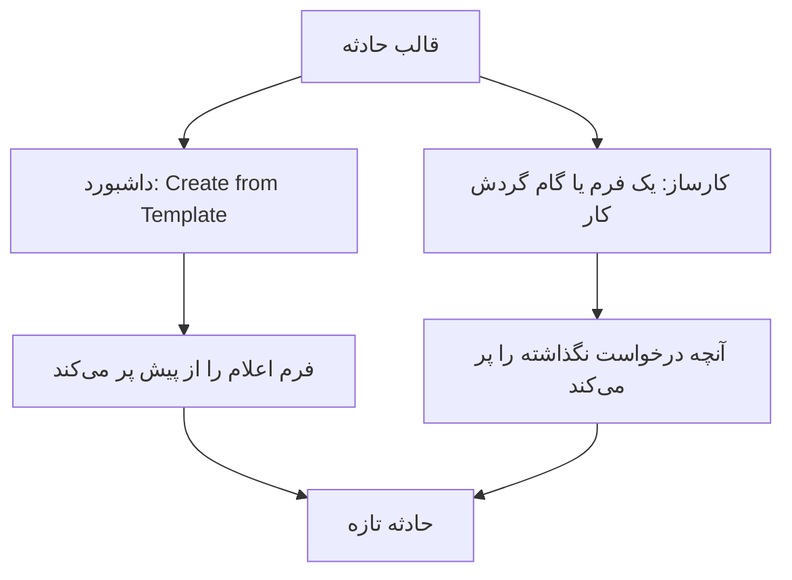
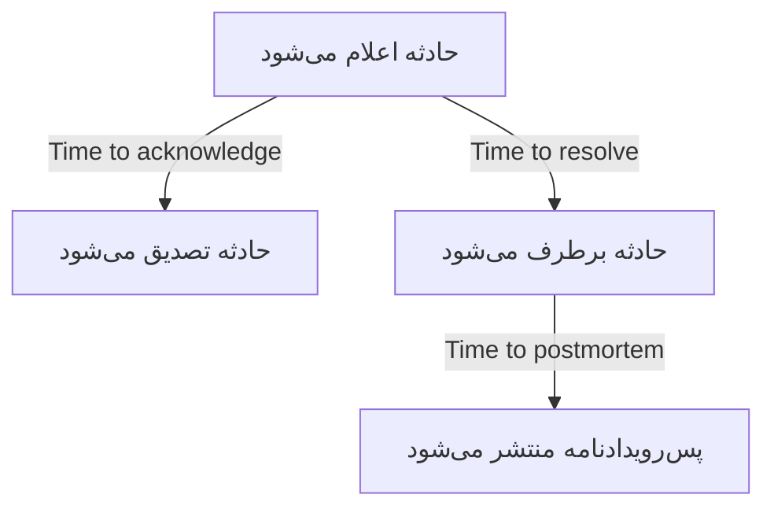
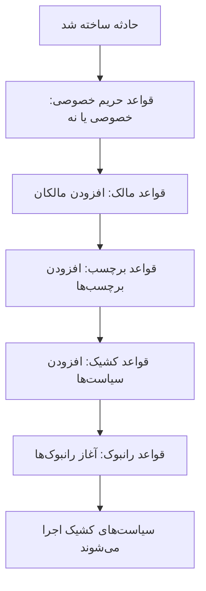

# تنظیمات و خودکارسازی حادثه

پیکربندی حادثه درون **Incidents** است، نه در **Project Settings**: وضعیت‌ها و شدت‌ها، قالب‌ها، فیلدهای سفارشی، نقش‌ها، اندازه‌گیری‌ها و پیشوندهای شماره، و قواعدی که روی هر حادثه تازه عمل می‌کنند. این صفحه مرجع هر یک از آن صفحه‌هاست، و مرجع آنچه همان لحظه که حادثه‌ای اعلام می‌شود خودبه‌خود اجرا می‌شود.

:::cards
- [قالب‌های حادثه](#قالبهای-حادثه): همان نوع حادثه را هر بار از پیش پرشده اعلام کنید.
- [فیلدهای سفارشی](#فیلدهای-سفارشی): فیلدهای خودتان روی هر حادثه، که هنگام اعلامش پرسیده می‌شوند.
- [اندازه‌گیری‌ها](#اندازهگیریها): زمان تا تصدیق، برطرف شدن یا کاهش اثر، محاسبه‌شده برای هر حادثه.
- [قواعد](#قواعدی-که-هنگام-ساخت-حادثه-اجرا-میشوند): مالکان، برچسب‌ها، فراخوانی و اپیزودها، خودکار تنظیم‌شده.
:::

## تنظیمات حادثه کجا زندگی می‌کنند

**Incidents** را از منوی **Products** در نوار بالا باز کنید، سپس **Settings** را پایین منوی کناری‌اش باز کنید. **Rules** و **Settings** هر دو جمع آغاز می‌شوند، پس پیش از آنکه صفحه‌های زیر پدیدار شوند بازشان کنید. همه چیز اینجا محدود به پروژه است: قالب‌ها، نقش‌ها، فیلدهای سفارشی و قواعد به یک پروژه تعلق دارند و روی هر حادثه‌ای که در آن اعلام شود اعمال می‌شوند، در مسیرهایی که با `/dashboard/{projectId}/incidents/settings/` آغاز می‌شوند.

| صفحه | آنجا چه می‌کنید |
| ------------------------ | -------------------------------------------------------------------------------------------- |
| **Incident State** | افزودن، تغییر نام، تغییر رنگ و مرتب کردن وضعیت‌هایی که حادثه از میانشان می‌گذرد. |
| **Incident Severity** | افزودن، تغییر نام، تغییر رنگ و مرتب کردن سطوح شدت. |
| **Incident Templates** | از پیش پر کردن کل حادثه — عنوان، توضیحات، منابع، سیاست‌های کشیک، مالکان، برچسب‌ها. |
| **Note Templates** | متن بازکاربردپذیر برای یادداشت‌های عمومی و خصوصی. |
| **Postmortem Templates** | ساختارهای بازکاربردپذیر پس‌رویدادنامه. |
| **Custom Fields** | تعریف فیلدهای اضافه‌ای که روی هر حادثه پدیدار می‌شوند. |
| **Incident Roles** | تعریف نقش‌هایی که پاسخ‌دهندگان را به آن‌ها می‌گمارید، مانند Incident Commander. |
| **Measurements** | سنجش مدت کارها، مانند زمان تا تصدیق یا زمان تا برطرف شدن، روی هر حادثه. |
| **Linked Alerts** | انتخاب اینکه آیا هشدارهای پیوندشده به یک حادثه همراه آن تصدیق و برطرف شوند. هر دو در پروژه‌های تازه روشن‌اند. |
| **Number Prefix** | متنی که پیش از شماره حادثه‌ها و اپیزودها می‌آید، مانند `INC-` در `INC-42`. |

آنچه هوش مصنوعی OneUptime خودش انجام می‌دهد اینجا تنظیم نمی‌شود: بخشی از آنِ خود دارد، **Incidents → AI**، در مسیرهایی که با `/dashboard/{projectId}/incidents/ai/` آغاز می‌شوند. صفحه **Settings** آن بررسی حادثه‌های تازه، اصلاح خودکارشان (که تا روشنش نکنید خاموش است)، با درخواست‌های ادغام اصلاح و تله‌متری گم‌شده که بخشی از اصلاح‌اند و زیر آن کشیده می‌شوند، و پیش‌نویس پس‌رویدادنامه را روشن یا خاموش می‌کند، و هر کلید همان لحظه که زده شود ذخیره می‌شود؛ قواعد بررسی و قواعد اصلاح خودکار، که محدود می‌کنند کدام حادثه‌ها بررسی و اصلاح شوند، و محدودیت‌های اختیاری‌ای که هوش مصنوعی زیرشان کار می‌کند، زیر **More settings** جمع شده‌اند، و هیچ‌کدام تا وقتی تنظیمشان نکنید اعمال نمی‌شود. **Insights** و **Logs** کنار آن‌اند: آنچه هوش مصنوعی از حادثه‌های شما آموخت، و هر کاری که کرد. [AI SRE](/docs/ai/ai-sre) را ببینید.

**Incident State** و **Incident Severity** به‌طور عمیق در [وضعیت‌ها و شدت‌های حادثه](/docs/incidents/states-and-severities) پوشش داده شده‌اند — باقی این صفحه از **Incident Templates** ادامه می‌دهد. فرم‌هایی که به آدم‌های بیرون از تیمتان اجازه می‌دهند حادثه گزارش کنند محصولی جداگانه‌اند: [فرم‌ها](/docs/forms/index) را ببینید. ابزارهایی که خودشان حادثه باز می‌کنند، مانند [Huntress](/docs/integrations/huntress)، زیر **Incidents → Integrations** راه‌اندازی می‌شوند.

**Rules** را باز کنید و هشت صفحه دیگر می‌بینید: **Grouping Rules**، **On-Call Rules**، **Owner Rules**، **Runbook Rules**، **Privacy Rules**، **Label Rules**، **SLA Rules** و **Reminder Rules**. آن‌ها پایین‌تر پوشش داده شده‌اند.

## قالب‌های حادثه

قالب حادثه اسکلتی ذخیره‌شده از یک حادثه است. به‌جای تایپ دوباره همان عنوان، همان فهرست مانیتور و همان سیاست کشیک هر بار که خوشه پرداخت می‌لرزد، یک بار ذخیره‌اش می‌کنید و از رویش اعلام می‌کنید.

:::steps
1. به **Incidents → Settings → Incident Templates** (`/dashboard/{projectId}/incidents/settings/templates`) بروید. کارت **Incident Templates** نام دارد.
2. روی **Create Incident Template** کلیک کنید. قالب را در **Template Info** نام‌گذاری کنید، سپس حادثه‌ای را که اعلام می‌کند در **Incident Details** پر کنید: یک **Title**، یک **Incident Severity** و یک **Description**.
3. با **Next** از گام‌های اختیاری بگذرید — منابع متأثر، فیلدهای سفارشی و سیاست‌های کشیکش — و آنچه هر حادثه‌ای از این نوع مشترک دارد پر کنید.
4. در گام آخر روی **Create Incident Template** کلیک کنید. از این پس **Create from Template** در فهرست حادثه‌ها این قالب را پیشنهاد می‌کند.
:::

ساختن یکی شما را از جادوگری چهارگامی می‌گذراند، که وقتی پروژه شما فیلدهای سفارشی حادثه دارد دو گام بیشتر دارد. فقط دو گام نخست چیزی می‌پرسند که باید پاسخش دهید: **Next** از گام‌های اختیاری پس از آن‌ها می‌گذرد، و **Create Incident Template** در گام آخر است.

- **Template Info** — **Template Name** و **Template Description**. این‌ها خود قالب را نام‌گذاری می‌کنند؛ هرگز روی حادثه پدیدار نمی‌شوند.
- **Incident Details** — **Title**، **Description** (مارک‌داون) و **Incident Severity**. زیر **More fields**، که سرتیتر تاشده‌اش هر سه را نام می‌برد و هر کدام را که تنظیم شده باشد نشان می‌دهد:
  - **Initial Incident State** — وضعیتی که حادثه‌های اعلام‌شده از این قالب در آن آغاز می‌شوند. مانند فرم اعلام خالی آغاز می‌شود و گزینه‌هایش به ترتیب وضعیت فهرست می‌شوند. اگر خالی بماند، همان‌طور که جانگهدارش می‌گوید، آن حادثه‌ها در وضعیت آغازین معمول آغاز می‌شوند: وضعیت ساخت پروژه، همان وضعیتی که هر حادثه تازه در آن آغاز می‌شود. قالبی که با وضعیتی ذخیره شده آن را نگه می‌دارد.
  - **Owners** — افراد و تیم‌هایی که مالک حادثه‌های اعلام‌شده از این قالب‌اند. **Add owner** یک فهرست از هر دو باز می‌کند، همان فهرست صفحه **Owners** حادثه؛ هر انتخاب به‌صورت برچسبی نمایش داده می‌شود که می‌توانید آن را بردارید. قالب موجود آن‌ها را روی کارت **Owners** نشان می‌دهد.
  - **Labels** — برچسب‌هایی که حادثه‌های اعلام‌شده از این قالب با آن‌ها آغاز می‌شوند.
- **Resources Affected** — مانند فرم اعلام: **Monitors**، سپس **Change Monitor Status to**، سپس **Other Affected Resources** برای میزبان‌ها، خوشه‌ها و سرویس‌ها، با **Limit to these status pages** زیر **More fields**. قالب همیشه **Change Monitor Status to** را می‌پرسد، چه مانیتوری برگزیده شده باشد چه نه: این وضعیت روی مانیتورهایی هم اعمال می‌شود که هنگام اعلام حادثه از روی قالب برگزیده می‌شوند، جایی که فرم اعلام به محض برگزیدن نخستین مانیتور آن را نشان می‌دهد. کارت **Affected Resources** قالب موجود هم به همین شکل می‌پرسد، و وضعیتی را که قالب برگزیده نشان می‌دهد، یا اگر وضعیتی برنگزیده باشد **Monitors keep their status.** را. **Limit to these status pages** حادثه‌هایی را که از روی قالب اعلام می‌شوند به برخی از صفحه‌های وضعیتی که مانیتورهایشان را فهرست کرده‌اند محدود می‌کند — قالب `Region East outage` می‌تواند صفحه‌های سایت‌های شرقی را با خود داشته باشد. قالب موجود آن را روی کارت **Status Page Scope**، با **Edit Status Page Scope**، نشان می‌دهد. [یک صفحه وضعیت برای هر مخاطب](/docs/status-pages/one-status-page-per-audience) را ببینید.
- **Custom Fields** — فقط وقتی پروژه شما فیلدهای سفارشی حادثه دارد: مقادیری که حادثه‌های اعلام‌شده از این قالب با آن‌ها آغاز می‌شوند. همه فیلدها اینجا پیشنهاد می‌شوند، نه فقط آن‌هایی که گام **Details** می‌پرسد، و هیچ‌کدام الزامی نیست. قالب موجود کارت **Custom Fields** برای تغییر آن‌ها دارد.
- **Custom Fields on Create** — این هم فقط وقتی پروژه شما فیلدهای سفارشی حادثه دارد: گام **Details** هنگام اعلام حادثه‌ای از روی این قالب کدام‌یک از آن‌ها را بپرسد، و کدام باید پر شود. قالب موجود کارت **Custom Fields on Create** برای تغییر آن‌ها دارد. [فیلدهای سفارشی هنگام ساخت](#فیلدهای-سفارشی-هنگام-ساخت) را ببینید.
- **On-Call** — **On-Call Policy**، سیاست‌هایی که هنگام اعلام حادثه‌ای ساخته‌شده از این قالب اجرا می‌شوند.

چند قاعده سریع:

- فهرست قالب‌ها فقط **Name** و **Description** را نشان می‌دهد. سطرها از فهرست ویرایش‌شدنی یا حذف‌شدنی نیستند — برای تغییر یک قالب آن را باز کنید (`/dashboard/{projectId}/incidents/settings/templates/{modelId}`).
- هر کسی که بتواند قالبی را ویرایش کند می‌تواند جزئیات و منابع متأثر آن را تغییر دهد، از جمله **Initial Incident State** و **Change Monitor Status to**: Project Ownerها، Project Adminها و Project Memberها، Incident Adminها و Incident Memberها، و نقشی با **Edit Incident Template**.
- قالب‌ها از وارد و صادر کردن JSON پشتیبانی می‌کنند، پس می‌توانید یکی را میان پروژه‌ها جابه‌جا کنید.
- بی هیچ قالبی، فهرست **No incident templates found** را می‌گوید و **Create Incident Template** درست زیر آن است.
- بی هیچ قالبی، **Create from Template** در فهرست حادثه‌ها هم پنجره **No Incident Templates** را باز می‌کند که می‌گوید قالب‌ها کجا ساخته می‌شوند، و دکمه **Create Template** آن **Incidents → Settings → Incident Templates** را باز می‌کند.

### قالب چگونه اعمال می‌شود

دو مسیر هست، و به یک شکل ادغام می‌کنند.



- **در داشبورد** — دکمه **Create from Template** در فهرست حادثه‌ها انتخابگر **Select Incident Template** را باز می‌کند، و صفحه اعلام قالب را از پارامتر رشته پرس‌وجوی `incidentTemplateId` می‌خواند، سپس فرم را با قالب به‌علاوه تیم‌ها و کاربران مالکش از پیش پر می‌کند. گام **Details** آن از [فیلدهای سفارشی هنگام ساخت](#فیلدهای-سفارشی-هنگام-ساخت) قالب پیروی می‌کند. این مالکان بی آنکه خبردار شوند مالک حادثه می‌شوند، وقتی کانال‌های Slack و Microsoft Teams حادثه ساخته شده‌اند، پس قاعده اعلانی که مالکان حادثه را به کانال تازه دعوت می‌کند آن‌ها را هم دعوت می‌کند.
- **روی کارساز** — [فرمی](/docs/forms/on-submit) که **Incident Template** دارد، و گام **Create One Incident** یک گردش کار که در آن یک **Incident Template** برگزیده شده، حادثه را روی کارساز از روی قالب اعلام می‌کنند. این گام قالب را به‌عنوان Project Admin پروژه گردش کار می‌خواند، پس قالبی از پروژه‌ای دیگر، یا قالبی که حذف شده، رد می‌شود، و در طرحی که قالب‌های حادثه را ندارد گام با نام طرحی که لازم دارد رد می‌شود. مالکان قالب، مانند داشبورد، مالک حادثه می‌شوند. [اعلام حادثه از روی قالب](/docs/workflows/components) را ببینید.

حادثه‌ای که روی کارساز اعلام می‌شود قالب را در `createdIncidentTemplateId` ثبت می‌کند. فقط خود OneUptime آن ستون را تنظیم می‌کند، برای فرم یا گام گردش کاری که قالبی را نام می‌برد: کلید API یا کاربر واردشده نمی‌تواند، و درخواستی که `createdIncidentTemplateId` بفرستد رد می‌شود. برای اعلام از روی قالب از راه API، قالب را از `/api/incident-templates` بخوانید و مقادیرش را در درخواست بفرستید.

> [!IMPORTANT]
> بخش مهم قاعده ادغام است: **قالب فقط فیلدی را پر می‌کند که تعریف‌نشده گذاشته‌اید**. عنوان، توضیحات، شدت حادثه، وضعیت آغازین حادثه، وضعیت مانیتور پشت **Change Monitor Status to**، مانیتورها، میزبان‌ها، خوشه‌های Kubernetes، میزبان‌های Docker، میزبان‌های Podman، سرویس‌ها، سیاست‌های کشیک، برچسب‌ها و صفحه‌های وضعیت فقط وقتی از قالب کپی می‌شوند که فراخواننده یا فرم چیزی نداده باشد. هر چیزی که صریحاً بگذارید همیشه برنده است، از جمله وضعیت: حادثه‌ای که وضعیتش را نام ببرد در همان آغاز می‌شود و باز هم همه چیز دیگر را از قالب می‌گیرد، همان‌طور که در داشبورد. مقادیر فیلدهای سفارشی فیلد به فیلد ادغام می‌شوند: قالب فیلدهایی را پر می‌کند که حادثه بدون آن‌ها اعلام شده، و مقداری که شما بگذارید — `0`، `false` و `null` هم — بر مقدار قالب برنده است.

### فیلدهای سفارشی هنگام ساخت

تنظیم‌های پروژه تعیین می‌کنند گام **Details** هنگام اعلام حادثه چه بپرسد: **Show on Create** فیلدی را می‌پرسد، و **Required on Create** آن را اجباری می‌کند. قالب می‌تواند هر دو را برای حادثه‌هایی که از رویش اعلام می‌شوند تغییر دهد. کارت **Custom Fields on Create** آن — و گام هم‌نام در جادوگر — هر فیلد سفارشی حادثه را به ترتیب **Order** آن فهرست می‌کند، با یک تنظیم برای هر کدام:

| تنظیم | وقتی حادثه‌ای از روی این قالب اعلام می‌شود |
| ------------ | ---------------------------------------------------------------------------------------------------------------------------------- |
| **Default** | فیلد از **Show on Create** و **Required on Create** خودش پیروی می‌کند. گزینه می‌گوید کدام، مانند **Default (Required)**. |
| **Required** | گام **Details** فیلد را می‌پرسد، و باید پر شود. فیلد بله/خیر باید روشن شود. |
| **Optional** | گام فیلد را می‌پرسد، و می‌توان خالی‌اش گذاشت — حتی وقتی پروژه آن را الزامی کرده است. |
| **Hidden** | گام فیلد را نمی‌پرسد، حتی وقتی پروژه آن را نشان می‌دهد یا الزامی کرده است. مقدار خود قالب برای آن همچنان اعمال می‌شود. |

روی کارت، فیلدی که قالب آن را **Required**، **Optional** یا **Hidden** گذاشته، زیر نوعش نشان می‌دهد پروژه با آن چه می‌کند: **Project default: Required**، **Project default: Optional** یا **Project default: Not Shown**. هر کسی که بتواند قالب را ببیند این را می‌بیند.

وقتی از آن استفاده کنید که حادثه‌های یک قالب پاسخی لازم دارند که بقیه ندارند — برای نمونه رده مشتری روی قالب `Customer data exposure` — یا برای بیرون نگه داشتن پرسشی که پروژه همه‌جا می‌پرسد از قالبی که با آن جور نیست.

- **کلیدگذاری با Template Variable.** هر تنظیم زیر **Template Variable** فیلد ذخیره می‌شود، که هرگز تغییر نمی‌کند، پس تغییر نام فیلد تنظیمش را نگه می‌دارد. فیلدی که حذف و دوباره با همان نام ساخته شود تنظیمش را پس می‌گیرد — برخلاف پرسش‌های یک فرم، که فیلد را با شناسه‌اش نام می‌برند، پس فیلدی که حذف و دوباره ساخته شود تا دوباره افزوده نشود پرسیده نمی‌شود.
- **Edit و Save آن‌ها را از نو می‌خوانند.** **Edit** روی کارت فیلدها و تنظیم‌های قالب را دوباره می‌خواند، و در این میان پنجره نشانگر بارگذاری را نشان می‌دهد، و **Save** آن‌ها را یک بار دیگر می‌خواند و فقط فیلدهایی را می‌نویسد که در پنجره تغییر داده‌اید. پس تغییری که مدیر دیگری در این میان روی فیلدهای دیگر داده نگه داشته می‌شود — از جمله تنظیمی که به فیلدی داده که وقتی پنجره شما باز بود ساخته شده — و تغییری که به فیلدی داده‌اید که در این میان حذف شده نوشته نمی‌شود. سپس کارت فیلدها را همان‌طور که هستند فهرست می‌کند. اگر هنگام زدن **Edit** خواندنشان ممکن نباشد، پنجره دلیلش را می‌گوید و به‌جای **Save**، **Try again** را پیشنهاد می‌کند؛ اگر هنگام زدن **Save** ممکن نباشد، دلیلش را می‌گوید، چیزی ذخیره نمی‌کند و انتخاب‌هایتان را نگه می‌دارد.
- **فقط داشبورد آن‌ها را اعمال می‌کند.** مانند **Required on Create**، این تنظیم‌ها فقط فرم **Declare Incident** را شکل می‌دهند و بس. حادثه‌هایی که از راه API، با یک گردش کار، یک مانیتور، Slack، ‏Microsoft Teams یا هوش مصنوعی اعلام می‌شوند به آن‌ها پایبند نیستند، و [فرم‌ها](/docs/forms/building) پرسش‌های خودشان را دارند. [Required on Create فقط در داشبورد بررسی می‌شود](#required-on-create-فقط-در-داشبورد-بررسی-میشود) را ببینید.
- **فیلدی که از فیلد سفارشی یک مانیتور کپی می‌شود** همچنان وقتی حادثه مانیتوری دارد پرسیده نمی‌شود، هر چه قالب بگوید.
- **هر کسی که بتواند قالب‌های حادثه را ویرایش کند می‌تواند آن‌ها را تغییر دهد** — از جمله Project Member و Incident Member — حتی برای فیلدی که یک Project Admin آن را برای کل پروژه **Required on Create** کرده است. خود تنظیم‌های سطح پروژه به Project Owner، ‏Project Admin یا مجوز **Edit Incident Custom Field** نیاز دارند.
- **همراه قالب جابه‌جا می‌شوند.** خروجی JSON قالب آن‌ها را در بر دارد، و در پروژه‌ای که قالب را به آن وارد می‌کنید روی فیلدهایی اعمال می‌شوند که همان **Template Variable** را دارند.

از راه API، این‌ها `customFieldSettings` قالب‌اند: شیئی که کلیدهایش **Template Variable** هر فیلد است، با `Required`، `Optional`، `Hidden` یا `Default` برای هر فیلد.

```json title="customFieldSettings"
{
  "customFieldSettings": {
    "impact": "Required",
    "affected_location": "Optional",
    "additional_information": "Hidden"
  }
}
```

فیلدی که فهرست نشده از تنظیم‌های خودش پیروی می‌کند، مانند `Default`. درخواست با خطای `400` رد می‌شود وقتی کلیدی **Template Variable** معتبری نباشد — حروف کوچک لاتین، رقم‌ها و زیرخط — یا مقداری یکی از این چهار نباشد. کلیدی که با هیچ فیلدی جور نیست نگه داشته و نادیده گرفته می‌شود.

## قالب‌های یادداشت

قالب‌های یادداشت به پاسخ‌دهندگان متنی آماده برای به‌روزرسانی حادثه می‌دهند، تا به‌روزرسانی صفحه وضعیت ساعت سه بامداد را کسی نیمه‌خواب از صفر ننویسد.

:::steps
1. به **Incidents → Settings → Note Templates** (`/dashboard/{projectId}/incidents/settings/note-templates`) بروید. کارت **Public or Private Note Templates for Incidents** نام دارد — یک کتابخانه به هر دو گونه یادداشت خدمت می‌کند.
2. روی **Create Incident Note Template** کلیک کنید و تنها صفحه آن را پر کنید: **Template Name** و **Template Description**، هر دو الزامی، سپس خود **Note**، به مارک‌داون، الزامی: متنی که یادداشت با برگزیدن قالب با آن آغاز می‌شود.
3. ذخیره‌اش کنید. **Templates** در هر دو صفحه یادداشت، و **Select Note Template** در پنجره‌های **Acknowledge Incident** و **Resolve Incident**، این قالب را پیشنهاد می‌کنند.
:::

مانند قالب‌های حادثه، سطرها به‌جای ویرایش درجا ساخته و دیده می‌شوند؛ برای تغییر یک قالب آن را باز کنید.

**متغیرها.** قالب یادداشت می‌تواند متغیرهایی داشته باشد که هنگام برگزیدن قالب با مقادیر حادثه پر می‌شوند، تا نویسنده متن نهایی را پیش از انتشار ببیند — و همچنان بتواند تغییرش دهد:

| متغیر | با چه پر می‌شود |
| ----------------------------------- | ------------------------------------------------------------------ |
| `{{incident.title}}` | عنوان حادثه. |
| `{{incident.number}}` | شماره‌اش، مثلاً `INC-42` یا `#42`. |
| `{{incident.severity}}` | شدتش. |
| `{{incident.state}}` | وضعیت کنونی‌اش. |
| `{{incident.startedAt}}` | زمان اعلامش، در منطقه زمانی نویسنده، با نام منطقه. |
| `{{incident.labels}}` | برچسب‌هایش، جداشده با ویرگول. |
| `{{incident.affectedStatusPages}}` | صفحه‌های وضعیتی که حادثه روی آن‌ها نشان داده می‌شود و به آن‌ها خبر می‌دهد و نویسنده می‌تواند ببیند. |
| `{{incident.customFields.<key>}}` | مقدار یک فیلد سفارشی، با **Template Variable** فیلد، که ویرایشگر **Note** آن را با نام فیلد زیر **Template variables** فهرست می‌کند. |

فیلدهای سفارشی پیش‌تر به شکل `{{customFields.<key>}}` نوشته می‌شدند؛ قالب‌هایی که هنوز آن را به کار می‌برند به همان شکل پر می‌شوند. متغیری که مقداری ندارد، یا در این فهرست نیست، دقیقاً همان‌طور که نوشته شده باقی می‌ماند تا نویسنده پرش کند. مقادیر به‌صورت متن گذاشته می‌شوند: عنوان حادثه نمی‌تواند در یادداشت منتشرشده به تصویر، HTML یا پیوندی تبدیل شود که متنش مقصدش را پنهان کند، هرچند نشانی‌ای درون آن همچنان به‌صورت پیوندی به همان نشانی نشان داده می‌شود. فیلد سفارشی **Rich text (Markdown)** همان مارک‌داونی که هست گذاشته می‌شود.

> [!IMPORTANT]
> متغیرهای فیلد سفارشی، برچسب و صفحه وضعیت با رکوردهای خود تیم شما پر می‌شوند، هر فیلد سفارشی چه **Include in Subscriber Notifications** برایش روشن باشد چه نه، و همین کتابخانه به یادداشت‌های عمومی هم خدمت می‌کند که روی صفحه‌های وضعیت حادثه نشان داده و برای مشترکانشان ایمیل می‌شوند. پیش از انتشار یادداشتی عمومی، متن پرشده را بخوانید.

**گذاشتن یک متغیر.** هیچ‌گاه لازم نیست نام متغیری را تایپ کنید. ویرایشگر **Note** متغیرها را از سه راه پیشنهاد می‌کند، و هر کدام متغیر را همان‌جایی می‌گذارد که نشانگر است:

- **Template variables**، جمع‌شده زیر ویرایشگر: بازش کنید تا هر متغیر را همراه با آنچه با آن پر می‌شود ببینید — فیلدهای سفارشی حادثه پروژه با نامشان — و روی یکی کلیک کنید.
- **Insert variable**، در انتهای نوار ابزار ویرایشگر: همان فهرست، با جعبه جستجو.
- تایپ `{{` در یادداشت فهرست را زیر نشانگر باز می‌کند. با ادامه تایپ فهرست را کوتاه کنید، با کلیدهای جهت انتخاب کنید و با Enter یا Tab متغیر را بگذارید؛ Escape فهرست را می‌بندد.

همین فهرست، دکمه و `{{` همراه قالب‌های دیگری هم می‌آیند که متغیر دارند: یادآوری‌های یادداشت یک قاعده SLA، عنوان و توضیحات اپیزود در یک قاعده گروه‌بندی حادثه یا هشدار، توضیحات و یادداشت‌های اصلاح حادثه و هشدار در یک قاعده مانیتور، قالب‌های یک قاعده نرخ سوختن SLO و قالب‌های سفارشی اعلان مشترکان یک صفحه وضعیت.

قالب‌های یادداشت جایی پدیدار می‌شوند که واقعاً لازمشان دارید: پنجره‌های تأیید **Acknowledge Incident** و **Resolve Incident** هر دو، تاشده زیر **Add a public note**، بالای فیلد **Public Note** گزینه **Select Note Template** را پیشنهاد می‌کنند. برای تفاوت یادداشت‌های عمومی و خصوصی [یادداشت‌ها، مالکان و خوراک حادثه](/docs/incidents/notes-owners-and-feed) را ببینید.

## قالب‌های پس‌رویدادنامه

قالب پس‌رویدادنامه اسکلت گزارشی است که پس از حادثه می‌نویسید — سرتیترهای شما، پرسش‌های راهنمای شما، پرسش‌های همیشگی شما — تا هر بازبینی‌ای در پروژه از همان شکل پیروی کند.

:::steps
1. به **Incidents → Settings → Postmortem Templates** (`/dashboard/{projectId}/incidents/settings/postmortem-templates`) بروید. کارت **Postmortem Templates** نام دارد.
2. روی **Create Incident Postmortem Template** کلیک کنید و تنها صفحه آن را پر کنید: **Template Name** و **Template Description**، هر دو الزامی، سپس **Postmortem Template**، خود بدنه، به مارک‌داون، الزامی.
3. ذخیره‌اش کنید. اکنون صفحه **Postmortem** هر حادثه **Apply Template** را پیشنهاد می‌کند.
:::

یکی را از حادثه اعمال می‌کنید، نه از تنظیمات. حادثه‌ای را باز کنید، **Postmortem** را در منوی کناری‌اش برگزینید (`/dashboard/{projectId}/incidents/{incidentId}/postmortem`)، و از **Apply Template** استفاده کنید. پنجره **Apply Postmortem Template** با فهرست کشویی **Select Template** باز می‌شود؛ برگزیدن یکی بدنه قالب را در ویرایشگر **Postmortem Note** بارگذاری می‌کند، جایی که پیش از ذخیره ویرایشش می‌کنید. اپیزودهای حادثه همان صفحه **Postmortem** را دارند و از همان کتابخانه قالب استفاده می‌کنند. **Apply Template** تنها وقتی نشان داده می‌شود که پروژه قالب پس‌رویدادنامه داشته باشد؛ اگر فقط یکی باشد، از پیش برگزیده شده است. ویرایشگر پس‌رویدادنامه حادثه را همان‌طور که هست باز می‌کند و قالب را یادداشت آن می‌گذارد، پس اینکه روی صفحه وضعیت هست یا نه، زمان انتشار و پیوست‌هایش همان‌طور که بودند می‌مانند.

## فیلدهای سفارشی

فیلدهای سفارشی به شما امکان می‌دهند فراداده خودتان را روی هر حادثه داشته باشید — نام یک سرویس داخلی، ارجاع به یک تیکت تغییر، رده مشتری — و هر بار که حادثه‌ای اعلام می‌شود همان پرسش‌ها را بپرسید، مانند میزان اثر آن و زمانی که انتظار می‌رود برطرف شود.

:::steps
1. به **Incidents → Settings → Custom Fields** (`/dashboard/{projectId}/incidents/settings/custom-fields`) بروید. صفحه **Incident Custom Fields** نام دارد و فیلدها را به ترتیب **Order** آن‌ها فهرست می‌کند، هر کدام تنها با **Field Name** و **Field Type** آن.
2. روی **Create Incident Custom Field** کلیک کنید و **Field Name**، **Field Description** و **Field Type** آن را پر کنید — و برای نوع کشویی، گزینه‌هایش را، درست زیر نوع.
3. برای اینکه فیلد هر بار که حادثه‌ای اعلام می‌شود پرسیده شود، **More fields** را باز کنید و **Show on Create** را روشن کنید، و اگر باید پاسخ داده شود **Required on Create** را هم.
4. ذخیره‌اش کنید، سپس سطر را با دستگیره‌اش به جایی بکشید که فیلد باید فهرست شود. **Edit** در سطر هر فیلد بقیه تنظیم‌های آن را باز می‌کند.
:::

ساختن فیلد، **Field Name**، **Field Description** و **Field Type** آن را در یک صفحه می‌پرسد — و برای نوع کشویی، گزینه‌هایش را، درست زیر نوع. مقادیر فیلد تازه تایپ می‌شوند. بقیه چیزها زیر **More fields** است، که چه هنگام ساختن فیلد و چه هنگام ویرایشش تاشده آغاز می‌شود؛ در حالت تاشده، سرتیترش نام آنچه را درون آن است می‌آورد و آنچه را تنظیم شده نشان می‌دهد. برای ساختن فیلدی که مقدارش را به‌جای تایپ از یک فیلد سفارشی مانیتور کپی می‌کند، منوی **More** (**⋯**) را کنار **Create Incident Custom Field** باز کنید و **Create Mapped Custom Field** را برگزینید — [فیلدهای کپی‌شده از مانیتور](#فیلدهای-کپیشده-از-مانیتور) را ببینید.

هر تعریف این‌ها را دارد:

- **Field Name** — الزامی، دست‌کم دو نویسه. جانگهدار نامی شبیه slug مانند `internal-service` پیشنهاد می‌دهد.
- **Field Description** — اختیاری.
- **Field Type** — الزامی. تعیین می‌کند داده چگونه وارد شود؛ نوع‌ها پایین‌تر فهرست شده‌اند. نوع‌های کشویی گزینه‌هایشان را هم لازم دارند.
- **Dropdown Options** — مقادیری که در فهرست کشویی پدیدار می‌شوند، هر کدام با رنگی اختیاری: دکمه کوچک کنار هر گزینه رنگش را نشان می‌دهد و همان رنگ‌های نام‌دار هر فیلد رنگ دیگر را باز می‌کند، با **No color** در آغاز و **Custom color** برای کدی دقیق. هر گزینه را با دستگیره ابتدای سطرش بکشید تا جایش در فهرست تغییر کند. پس از آنکه حادثه‌ها مقدار گرفتند هم می‌توان گزینه افزود، نامش را تغییر داد و آن را برداشت؛ [تغییر گزینه‌های فهرست کشویی](#تغییر-گزینههای-فهرست-کشویی) را ببینید.
- **Order** — جای فیلد میان فیلدهای سفارشی حادثه: در صفحه **Custom Fields** حادثه، در گام **Details** و در پیام‌های مشترکان. عددی وارد نمی‌شود: فیلد را با دستگیره ابتدای ردیفش بالا یا پایین بکشید، و فیلد تازه به انتهای فهرست افزوده می‌شود. تا وقتی پالایه یا جستجویی فهرست را محدود کرده است، کشیدن خاموش است.
- **Show on Create** — زیر **More fields**. هنگام اعلام حادثه از داشبورد، فیلد را در گام **Details** می‌پرسد ([اعلام یک حادثه](/docs/incidents/declaring-incidents) را ببینید). قالب حادثه می‌تواند به هر فیلدی مقدار آغازین بدهد، چه هنگام ساخت نشان داده شود چه نه، و می‌تواند فیلدی را برای حادثه‌هایی که از رویش اعلام می‌شوند بپرسد یا کنار بگذارد — [فیلدهای سفارشی هنگام ساخت](#فیلدهای-سفارشی-هنگام-ساخت) را ببینید. [فرم‌ها](/docs/forms/building#custom-fields) از آن پیروی نمی‌کنند: هر فرم فقط فیلدهایی را می‌پرسد که به آن افزوده شده‌اند.
- **Required on Create** — زیر **More fields**، که وقتی **Show on Create** روشن باشد پیشنهاد می‌شود. گام **Details** تا این فیلد پر نشود اجازه اعلام حادثه را نمی‌دهد، و فیلد **Boolean** باید روشن شود. داشبورد تنها جایی است که این بررسی می‌شود؛ [Required on Create فقط در داشبورد بررسی می‌شود](#required-on-create-فقط-در-داشبورد-بررسی-میشود) را ببینید.
- **Include in Subscriber Notifications** — زیر **More fields**. فیلد و مقدارش را همراه پیام‌های حادثه برای مشترکان صفحه وضعیت می‌فرستد: پیام‌های پیش‌فرض ایمیل، Slack و Microsoft Teams و وب‌هوک‌ها، اما نه پیامک. مشترکان معمولاً بیرون از تیم شما هستند، پس آن را فقط برای فیلدهایی روشن کنید که به اشتراک گذاشتنشان بی‌خطر است. [فیلدهای سفارشی حادثه در اعلان‌ها](/docs/status-pages/subscribers#فیلدهای-سفارشی-حادثه-در-اعلانها) را ببینید.
- **Template Variable** — کلیدی که یک قالب با آن به فیلد می‌رسد، `{{incident.customFields.<key>}}`، در قالب‌های یادداشت و قالب‌های سفارشی اعلان مشترکان. هنگام ساختن فیلد از نام آن ساخته می‌شود — حروف کوچک لاتین، رقم‌ها و زیرخط، پس `Expected Resolution` می‌شود `expected_resolution`، و اگر فیلد دیگری همین کلید را داشته باشد `_2`، `_3` و مانند آن افزوده می‌شود — و با تغییر نام فیلد عوض نمی‌شود. کسی آن را دستی تنظیم نمی‌کند: API مقداری را که برایش فرستاده شود نادیده می‌گیرد. قالب‌هایی که با شکل قدیمی‌تر `{{customFields.<key>}}` نوشته شده‌اند همچنان کار می‌کنند. هیچ‌گاه لازم نیست آن را پیدا کنید: ویرایشگرهایی که آن را می‌گذارند — **Note** یک قالب یادداشت و قالب‌های سفارشی اعلان مشترکان یک صفحه وضعیت برای رویدادهای حادثه — متغیر هر فیلد را با نام فیلد زیر **Template variables** فهرست می‌کنند. فرم **Edit** هر فیلد هم آن را، فقط‌خواندنی، در پایین **More fields** همراه با دکمه‌ای که کپی‌اش می‌کند نشان می‌دهد.

**Order**، **Show on Create**، **Required on Create**، **Include in Subscriber Notifications** و **Template Variable** فقط روی فیلدهای سفارشی حادثه وجود دارند. فیلدهای سفارشی مانیتورها، هشدارها، رویدادهای نگهداری زمان‌بندی‌شده و منابع دیگر آن‌ها را ندارند.

تعریف‌ها در مدل خودشان هستند؛ مقادیر روی خود حادثه در ستون `customFields`. روی یک حادثه آن‌ها را از **Custom Fields** در منوی کناری حادثه پر می‌کنید (`/dashboard/{projectId}/incidents/{incidentId}/custom-fields`)، جایی که فیلدها به ترتیب **Order** فهرست شده‌اند. قالب‌های حادثه مقادیر همین فیلدها را در `customFields` خودشان نگه می‌دارند.

**یک کمبود که دانستنش می‌ارزد.** تعریف‌های فیلدهای سفارشی حادثه تنها بخش خانواده حادثه‌اند که تریگر گردش کاری ندارند — بخش گردش کاری پایین‌تر را ببینید.

### نوع‌های فیلد

| نوع فیلد | چگونه وارد می‌شود | به کار می‌آید برای |
| ---------------------------- | ---------------------------------------------------- | -------------------------------------------------- |
| **Text** | یک خط متن | ارجاع به تیکت تغییر، نام یک سرویس داخلی |
| **Number** | یک عدد | مدت تخمینی به دقیقه، شمار کاربران درگیر |
| **Boolean** | کلید بله/خیر | یک تأیید، «رو به مشتری» |
| **Dropdown (single select)** | یک گزینه از یک فهرست | میزان اثر، منطقه |
| **Dropdown (multi-select)** | چند گزینه از یک فهرست | سامانه‌های درگیر |
| **Date** | یک تاریخ | تاریخ تمدید قرارداد |
| **Date and time** | یک تاریخ و یک زمان از روز | زمان مورد انتظار برای رفع |
| **Long text** | چند خط متن ساده | کاربران یا سامانه‌های درگیر، اطلاعات بیشتر |
| **Rich text (Markdown)** | متن قالب‌بندی‌شده، در ویرایشگر مارک‌داون با حالت دیداری آن | راه‌حلی موقت با پیوند و فهرست |

**Long text** و **Rich text (Markdown)** برای فیلدهای سفارشی همه منابع در دسترس‌اند، نه فقط حادثه‌ها. مقدار متن غنی به همان صورت مارک‌داونی که نوشته شده ذخیره می‌شود. نوعی برای دکمه‌های رادیویی یا گروه جعبه‌های انتخاب نیست: از **Dropdown (single select)**، **Dropdown (multi-select)** یا **Boolean** استفاده کنید.

### ‏Required on Create فقط در داشبورد بررسی می‌شود

**Required on Create** فقط فرم **Declare Incident** را نگه می‌دارد و بس. حادثه‌هایی که یک مانیتور، API، ‏Slack، ‏Microsoft Teams یا هوش مصنوعی باز می‌کند نمی‌توانند فرمی پر کنند، پس با فیلد خالی ساخته می‌شوند. وقتی حادثه‌ای ساخته شد، همه فیلدها در صفحه **Custom Fields** آن اختیاری می‌مانند، تا از پاسخ‌دهنده‌ای که وسط قطعی یک مقدار را درست می‌کند هرگز همه مقادیر دیگر خواسته نشود. آن را یادآوری برای کسانی بدانید که حادثه اعلام می‌کنند، نه تضمینی که هر حادثه مقداری دارد.

[فیلدهای سفارشی هنگام ساخت](#فیلدهای-سفارشی-هنگام-ساخت) یک قالب هم همین‌طورند: فقط فرم **Declare Incident** را شکل می‌دهند و بس. [فرم‌ها](/docs/forms/building#required-questions) استثنا هستند، چون کارساز پرسش‌های **Required** یک فرم را هنگام ارسال آن بررسی می‌کند.

### فیلدهای کپی‌شده از مانیتور

فیلد سفارشی می‌تواند مقدارش را به‌جای تایپ‌شدن از یک فیلد سفارشی مانیتورهای حادثه بگیرد — برای نمونه منطقه یا رده مشتری‌ای که مانیتورهایتان از پیش ثبت می‌کنند. برای ساختن آن، منوی **More** (**⋯**) را کنار **Create Incident Custom Field** باز کنید و **Create Mapped Custom Field** را برگزینید. سه چیز می‌پرسد:

- **Monitor Field** — فیلد سفارشی مانیتوری که کپی می‌شود. همه آن‌ها پیشنهاد می‌شوند، هر کدام با نوعش زیر نامش. فیلد تازه همان نوع را می‌گیرد، و برای فهرست کشویی گزینه‌هایش را، پس این دو همیشه با هم جورند.
- **Field Name** — با نام فیلد مانیتور آغاز می‌شود، تا وقتی نام دیگری تایپ کنید.
- **Field Description** — اختیاری.

مقدار هنگام ساختن حادثه‌ای که مانیتور دارد پر می‌شود، و هر وقت مقدار مانیتور تغییر کند به‌روز می‌ماند. وقتی مانیتورهای حادثه مقادیر گوناگون دارند، فیلد تک‌مقداری همان‌طور که هست می‌ماند و فیلد چندانتخابی همه آن‌ها را می‌گیرد. کپی کردن هرگز مقداری را پاک نمی‌کند: حادثه بدون مانیتور هر چه رویش تایپ شده نگه می‌دارد، و پاک کردن مقدار مانیتور کپی‌ها را دست‌نخورده می‌گذارد. گام **Details** وقتی حادثه مانیتور داشته باشد فیلد کپی‌شده را نمی‌پرسد.

برای کپی کردن مقدار فیلدی موجود از مانیتور، تغییر فیلد مانیتوری که کپی می‌کند، یا بازگشت به تایپ دستی، **Edit** را در سطر فیلد باز کنید و از **Map Value From** زیر **More fields** استفاده کنید. فیلدهای سفارشی هشدار و نگهداری زمان‌بندی‌شده هم به همین شکل می‌توانند از مانیتورهایشان کپی کنند.

### مقادیر فیلدهای سفارشی از راه API

در `POST /api/incident` و در به‌روزرسانی‌های یک حادثه، `customFields` شیئی است که کلیدهایش **Field Name** هر فیلد است:

```json title="customFields"
{
  "customFields": {
    "Impact": "Major",
    "Estimated Duration": 90,
    "Acknowledgement": true,
    "Expected Resolution": "2026-10-01T14:30:00.000Z"
  }
}
```

وقتی کاربر یا کلید API حادثه‌ای را می‌سازد یا به‌روز می‌کند، هر مقداری که درخواست تنظیم یا عوض می‌کند باید با فیلدش جور باشد، وگرنه درخواست با خطای `400` رد می‌شود که فیلد و مقدار فرستاده‌شده را نام می‌برد:

| نوع فیلد | می‌پذیرد |
| ---------------------------------------------------- | ------------------------------------------------------------ |
| **Text**، **Long text**، **Rich text (Markdown)** | متن. عدد، `true` یا `false` همان‌طور که فرستاده شده ذخیره می‌شود. |
| **Number** | یک عدد، یا متنی که عدد است، مانند `"42"`. |
| **Boolean** | `true` یا `false`، یا متن `"true"` یا `"false"`. |
| **Date**، **Date and time** | یک تاریخ، ترجیحاً به‌صورت متن ISO 8601. |
| **Dropdown (single select)** | یکی از گزینه‌هایش. |
| **Dropdown (multi-select)** | فهرستی از گزینه‌هایش، یا تنها یک گزینه. |

برای **Dropdown (multi-select)**، پیام رد ۱۰ مدخل نخستی را که در میان گزینه‌هایش نیستند نام می‌برد، و سپس می‌گوید چند مدخل دیگر هم هست.

آنچه بررسی نمی‌شود، تا یکپارچه‌سازی‌های موجود کار کنند:

- **مقادیری که درخواست دست‌نخورده می‌گذارد.** کارت **Custom Fields** وقتی یکی از مقادیر را ذخیره می‌کنید همه مقادیر را پس می‌فرستد، پس مقداری که پیش از این بررسی‌ها ذخیره شده، یا گزینه‌ای از فهرست کشویی که از آن پس برداشته شده، هرگز مانع ذخیره بقیه نمی‌شود. فیلد چندانتخابی مدخل‌هایی را که داشت نگه می‌دارد.
- **کلیدهایی که نام هیچ فیلد سفارشی حادثه نیستند**، مانند `jiraIssueKey` که [یکپارچه‌سازی Jira](/docs/integrations/jira) می‌نویسد.
- **مقادیر خالی.** `null` یا رشته خالی فیلد را پاک می‌کند.
- **مقادیری که از فیلد سفارشی مانیتور کپی می‌شوند**، و نوشتن‌هایی که خود OneUptime انجام می‌دهد.
- **Required on Create.** API هرگز فیلدی را نمی‌خواهد.

حادثه‌ای که یک فرم یا گام **Create One Incident** یک گردش کار از روی قالبی اعلام می‌کند (`createdIncidentTemplateId`) با مقادیر فیلدهای سفارشی قالب آغاز می‌شود، که فیلد به فیلد زیر مقادیری که خودش می‌فرستد ادغام می‌شوند ([قالب چگونه اعمال می‌شود](#قالب-چگونه-اعمال-میشود) را ببینید). کلید API نمی‌تواند از روی قالب اعلام کند: درخواستی که `createdIncidentTemplateId` بفرستد رد می‌شود.

### تغییر نام فیلد

مقادیر زیر نام فیلد ذخیره می‌شوند، پس تغییر نام فیلد باید آن‌ها را جابه‌جا کند. وقتی **Field Name** تازه‌ای ذخیره می‌کنید، OneUptime مقدار فیلد را روی هر حادثه و هر قالب حادثه در پروژه به نام تازه منتقل می‌کند، و نماهای ذخیره‌شده فهرست حادثه‌ها را که فیلد را نشان می‌دهند یا با آن پالایش می‌کنند به‌روز می‌کند. این انتقال هیچ گردش کار **On Update Incident** را آغاز نمی‌کند، و زمان آخرین به‌روزرسانی هیچ حادثه‌ای را عوض نمی‌کند. **Template Variable** فیلد همان‌طور که بود می‌ماند، پس قالب‌های یادداشت، قالب‌های سفارشی اعلان مشترکان و یکپارچه‌سازی‌های وب‌هوکی که از آن استفاده می‌کنند همچنان کار می‌کنند.

دو تغییر نام رد می‌شوند: تغییر به نامی که فیلد سفارشی حادثه دیگری از پیش دارد (بدون توجه به کوچکی و بزرگی حروف)، و درخواست API که چند فیلد را یک‌جا تغییر نام دهد. گردش‌های کاری و کلاینت‌های API که مقداری را با نام قدیمی فیلد می‌خوانند یا می‌نویسند باید به نام تازه تغییر داده شوند.

پس از تغییر نام، فیلد فقط مقادیر خودش را دارد. حذف یک فیلد مقادیرش را روی حادثه‌هایی که آن‌ها را داشتند باقی می‌گذارد، پس حادثه‌ها ممکن است هنوز زیر نام تازه مقادیری از فیلدی حذف‌شده داشته باشند؛ تغییر نام آن‌ها را پاک می‌کند، به‌جای آنکه آن‌ها را پاسخ‌های این فیلد نشان دهد یا برای مشترکان بفرستد. همه حادثه‌ها و قالب‌ها با هم منتقل می‌شوند: اگر انتقال ناموفق باشد، هیچ‌کدام تغییر نمی‌کند، فیلد نام قدیمی‌اش را نگه می‌دارد و ذخیره خطا را گزارش می‌دهد، پس می‌توانید به‌سادگی دوباره تلاش کنید. فیلدی که با نام یک فیلد حذف‌شده **ساخته** شود فرق دارد: مقادیری را که آن فیلد به جا گذاشته نشان می‌دهد، و وقتی **Include in Subscriber Notifications** روشن شود آن‌ها را برای مشترکان می‌فرستد.

حذف یک فیلد پرسش‌هایی را که آن را می‌پرسند در همه [فرم‌های](/docs/forms/building#custom-fields) پروژه نگه می‌دارد، اما دیگر پرسیده نمی‌شوند: سازنده فرم هر کدام را برای حذف علامت می‌زند. فیلدی که دوباره با همان نام ساخته شود فیلدی تازه است، و تا وقتی کسی آن را به فرمی نیفزاید در آن فرم پرسیده نمی‌شود. قالب‌های حادثه تنظیم **Custom Fields on Create** خود را برای آن نگه می‌دارند.

### تغییر گزینه‌های فهرست کشویی

گزینه‌های فیلد **Dropdown (single select)** یا **Dropdown (multi-select)** را هر زمان می‌توان تغییر داد: **Edit** را در سطر فیلد باز کنید. هر حادثه متن گزینه‌ای را که به آن داده شده نگه می‌دارد، پس آنچه یک تغییر بر سر حادثه‌هایی که آن گزینه را دارند می‌آورد به خود تغییر بستگی دارد:

| با گزینه چه می‌کنید | بر سر حادثه‌هایی که آن را دارند چه می‌آید |
| ----------------------------------- | ------------------------------------------------------------------------------------------------------------------ |
| **افزودن** | هیچ. از این پس پیشنهاد می‌شود. |
| **تغییر نام** (تغییر متن آن) | نام تازه را نشان می‌دهند. فرم زیر گزینه می‌گوید چند حادثه چنین خواهند کرد. |
| **برداشتن** (سطل زباله کنار آن) | آن را نگه می‌دارند و با برچسب _no longer an option_ نشان داده می‌شود، مگر اینکه زیر **No longer options** گزینه دیگری برایشان برگزینید. |
| **کشیدن** از دستگیره‌اش | هیچ. فقط ترتیب فهرست شدن گزینه‌ها تغییر می‌کند. |

وقتی فرم باز می‌شود، می‌شمارد چند حادثه هر مقدار را دارند. **No longer options** هر گزینه‌ای را که برمی‌دارید و حادثه‌ای هنوز آن را دارد، و هر مقداری را که حادثه‌ها دارند ولی هرگز گزینه نبوده (مثلاً مقداری که از راه API نوشته شده)، هر کدام با شمار حادثه‌هایی که آن را دارند فهرست می‌کند. برای هر کدام، یا همان‌طور نگهش دارید یا گزینه‌ای را که آن حادثه‌ها باید به‌جایش داشته باشند برگزینید. **Undo** گزینه‌ای را که به اشتباه برداشته‌اید بازمی‌گرداند.

گزینه‌ای که نامش را تغییر داده‌اید، و مقداری که برایش گزینه‌ای برگزیده‌اید، هنگام ذخیره منتقل می‌شوند: روی هر حادثه و هر قالب حادثه در پروژه، در نماهای ذخیره‌شده فهرست حادثه‌ها که با آن پالایش می‌کنند، و در پاسخ‌هایی که [قالب‌های فرم](/docs/forms/building) برای فیلد می‌دهند. مانند تغییر نام فیلد، این انتقال هیچ گردش کار **On Update Incident** را آغاز نمی‌کند و زمان آخرین به‌روزرسانی هیچ حادثه‌ای را عوض نمی‌کند؛ اگر ناموفق باشد، چیزی منتقل نمی‌شود و فیلد گزینه‌های قدیمی‌اش را نگه می‌دارد. گردش‌های کاری، کلاینت‌های API و پیکربندی‌های Terraform که گزینه‌ای را با متن قدیمی‌اش می‌نویسند به متن تازه نیاز دارند.

حادثه‌ای که فیلدش دیگر مقدار آن را پیشنهاد نمی‌دهد، مقدار را با برچسب _no longer an option_ در صفحه **Custom Fields** خود و در فهرست حادثه‌ها نشان می‌دهد. ویرایش فیلدهای دیگرش آن را نگه می‌دارد؛ برای تغییرش گزینه دیگری برگزینید.

فیلدهای سفارشی همه منابع دیگر هم همین‌گونه کار می‌کنند: مانیتورها، هشدارها، رویدادهای نگهداری زمان‌بندی‌شده، صفحه‌های وضعیت، سیاست‌های کشیک، تیم‌ها، اعضای تیم و آیتم‌های موجودی. تغییر نام یا افزودن گزینه‌ای در فیلد مانیتور، همین کار را با فیلدهای حادثه، هشدار و نگهداری زمان‌بندی‌شده‌ای که آن را کپی می‌کنند انجام می‌دهد ([فیلدهای کپی‌شده از مانیتور](#فیلدهای-کپیشده-از-مانیتور) را ببینید)، تا همچنان هر مقداری را که کپی می‌کنند پیشنهاد دهند.

از راه API، فهرست تازه را با `dropdownOptions` بفرستید، و تغییر نام‌ها را در `miscDataProps`:

```json
{
  "data": { "dropdownOptions": "Facility Alpha\nFacility B" },
  "miscDataProps": {
    "renamedDropdownOptions": [{ "from": "Facility A", "to": "Facility Alpha" }]
  }
}
```

هر `to` باید پس از ذخیره یکی از گزینه‌های فیلد باشد، و هر `from` فقط یک بار تغییر نام می‌گیرد. بدون `renamedDropdownOptions` فهرست تغییر می‌کند و هر مقدار ذخیره‌شده همان‌طور می‌ماند، که همان کاری است که تغییر `dropdown_options` در Terraform می‌کند.

### ‏Terraform

تنظیم‌ها روی منبع `oneuptime_incident_custom_field` با نام‌های `sort_order`، `show_on_create`، `is_required_on_create` و `include_in_subscriber_notifications` هستند. `variable_key` فقط‌خواندنی است: کلیدی که OneUptime هنگام ساختن فیلد ساخت.

اگر `sort_order` را ننویسید، فیلد تازه به انتهای فهرست می‌رود. اگر شماره‌ای بدهید که فیلد دیگری دارد، فیلد همان جا می‌نشیند و فیلدهای سر راه یک جا جابه‌جا می‌شوند. شماره‌ای که هیچ فیلد دیگری ندارد همان‌طور که نوشته‌اید می‌ماند.

## اندازه‌گیری‌ها

اندازه‌گیری، زمان میان دو لحظه در یک حادثه است. **Time to acknowledge** زمانِ از اعلام حادثه تا وقتی است که کسی آن را تصدیق کند؛ **time to resolve** از اعلام حادثه تا برطرف شدنش را می‌سنجد. اندازه‌گیری را یک بار برپا می‌کنید و OneUptime آن را برای هر حادثه، از جمله حادثه‌های گذشته، محاسبه می‌کند و در نمودار نشان می‌دهد، تا ببینید تیمتان سریع‌تر می‌شود یا نه.

به **Incidents → Settings → Measurements** (`/dashboard/{projectId}/incidents/settings/measurements`) بروید و **Create Incident Measurement** را برگزینید. هر تعریفی **نام**، **نقطه آغاز** و **نقطه پایان** دارد. **کلید** دائمی‌اش همان‌طور که نام را تایپ می‌کنید از نام ساخته می‌شود — «Time to Detect» می‌شود `time-to-detect` — پس چیزی برای پر کردن نیست. برای برگزیدن کلید خودتان، پیش از ساختن اندازه‌گیری روی **Edit** کنار آن کلیک کنید.



هشدارها و رویدادهای نگهداری زمان‌بندی‌شده همین قابلیت را دارند، در **Alerts → Settings → Measurements** و **Scheduled Maintenance → Settings → Measurements**. همه چیز در ادامه برای هر سه صدق می‌کند، با لحظه‌های خود هر کدام.

### اندازه‌گیری‌های آماده

فرم روی **What do you want to measure?** باز می‌شود. یکی از این‌ها را برگزینید تا نام، توضیحات و هر دو لحظه‌اش پر شوند: **Next** لحظه‌ها را نشان می‌دهد، و اندازه‌گیری از همان گام آخر ساخته می‌شود.

| کجا | اندازه‌گیری | آغاز وقتی | پایان وقتی |
| --------------------- | ------------------------ | ------------------------------------- | --------------------------------- |
| حادثه‌ها | **Time to acknowledge** | The incident is declared | The incident is acknowledged |
| حادثه‌ها | **Time to resolve** | The incident is declared | The incident is resolved |
| حادثه‌ها | **Time to postmortem** | The incident is resolved | The postmortem is published |
| هشدارها | **Time to acknowledge** | The alert is created | The alert is acknowledged |
| هشدارها | **Time to resolve** | The alert is created | The alert is resolved |
| نگهداری زمان‌بندی‌شده | **Start delay** | The maintenance is scheduled to start | The maintenance starts |
| نگهداری زمان‌بندی‌شده | **Overrun** | The maintenance is scheduled to end | The maintenance ends |
| نگهداری زمان‌بندی‌شده | **Maintenance duration** | The maintenance starts | The maintenance ends |

برای اینکه دو لحظه را خودتان برگزینید، **Something else** را انتخاب کنید. نامی که تایپ کرده باشید با برگزیدن یکی از این‌ها حفظ می‌شود.

### برگزیدن دو لحظه

گام دوم، **Start and End**، فیلدهای **Starts when** و **Ends when** را دارد. هر کدام لحظه‌هایی را که اندازه‌گیری می‌تواند در آن‌ها آغاز یا تمام شود به زبان ساده فهرست می‌کند. اندازه‌گیری تازه از اعلام حادثه آغاز می‌شود، پس بیشتر وقت‌ها فقط پایانش را برمی‌گزینید.

| لحظه | چه وقت رخ می‌دهد | در API به این شکل ذخیره می‌شود |
| --------------------------------------- | ---------------------------------------------------------------------------- | ----------------------------------------------------- |
| **The incident is declared** | زمانی که حادثه در OneUptime آغاز شد: هنگام ساخته شدن، مگر اینکه کسی زمان زودتری گذاشته باشد. | `Declared At` (`Timeline Start` همان لحظه است) |
| **The incident is acknowledged** | وقتی به وضعیت تصدیق‌شده شما، یا هر وضعیتی پس از آن، می‌رسد (برطرف شدن مستقیم از آغاز هم شمرده می‌شود). | `State Role Entered`، نقش `Acknowledged` |
| **The incident is resolved** | وقتی به وضعیت برطرف‌شده شما می‌رسد. | `State Role Entered`، نقش `Resolved` |
| **The postmortem is published** | وقتی پس‌رویدادنامه حادثه منتشر می‌شود. | `Postmortem Posted At` |
| **The incident enters a state you pick** | هر یک از وضعیت‌های حادثه شما. سپس فرم می‌پرسد کدام. | `State Entered`، همراه با وضعیت |
| **Impact starts** | زمانی که مشتریان نخستین بار متأثر شدند — پایین‌تر را ببینید. | `Impact Started At` |
| **The incident enters its first state** | وقتی به وضعیتی می‌رسد که حادثه‌های تازه در آن آغاز می‌شوند، مانند Identified. | `State Role Entered`، نقش `Created` |
| **The incident is created in OneUptime** | معمولاً همان لحظه‌ای که اعلام می‌شود. | `Created At` |

هشدارها از **The alert is created** آغاز می‌شوند و پس‌رویدادنامه ندارند؛ نگهداری زمان‌بندی‌شده **The maintenance is scheduled to start** و **to end**، یعنی پنجره برنامه‌ریزی‌شده، را در کنار **The maintenance starts**، **ends** و **is completed** دارد.

رسیدن به **acknowledged** یا **resolved** از هر وضعیتی که آن نقش را دارد پیروی می‌کند، پس اگر آن وضعیت را تغییر نام دهید یا جایگزین کنید همچنان کار می‌کند. **A state you pick** به همان یک وضعیت سنجاق می‌شود.

### فیلدهای بیشتر

چند گزینه که بیشتر اندازه‌گیری‌ها هرگز تغییرشان نمی‌دهند زیر **More fields** در انتهای گام **Start and End** جمع شده‌اند، با همان پیش‌فرض‌هایی که API هم به کار می‌برد. در حالت تاشده، سرتیترش نامشان را می‌آورد و آن‌هایی را که تغییر کرده‌اند نشان می‌دهد.

- **If the start happens more than once** و **If the end happens more than once** برای لحظه‌ای پدیدار می‌شوند که رسیدن به یک وضعیت است. حادثه‌ای که بازگشایی شود ممکن است دوباره به همان وضعیت برسد. **Use the first time** پیش‌فرض است و با زمان‌بندی‌های توکار حادثه می‌خواند؛ **Use the last time** حادثه بازگشایی‌شده را تا آخرین گذرش دنبال می‌کند.
- **Show durations in** واحدی است که نمودارهای اندازه‌گیری به کار می‌برند. **Automatic** پیش‌فرض است: ثانیه را رسم می‌کند، که نمودارها با بزرگ شدن عددها آن را به ثانیه، دقیقه، ساعت یا روز نشان می‌دهند. **Minutes**، **Hours** یا **Days** نمودار را در یک واحد نگه می‌دارند. هر نقطه با واحدی که برمی‌گزینید نوشته می‌شود، و تغییر آن نقطه‌های اندازه‌گیری را با واحد تازه بازنویسی می‌کند.
- **Chart summary** شیوه‌ای است که **View Chart** حادثه‌های زیادی را خلاصه می‌کند: به‌طور پیش‌فرض **Average**، یا **Median**، صدک ۹۰، ۹۵ یا ۹۹، **Longest** یا **Shortest**.
- **Show on incident pages** اندازه‌گیری را در کارت **Measurements** صفحه هر حادثه می‌گذارد (پایین‌تر را ببینید). به‌طور پیش‌فرض روشن است؛ برای اندازه‌گیری‌ای که فقط نمودارش را می‌خواهید خاموشش کنید. هشدارها و نگهداری زمان‌بندی‌شده آن را **Show on alert pages** و **Show on maintenance event pages** می‌نامند.

ویرایش یک اندازه‌گیری کلید **Enabled** را می‌افزاید: خاموشش کنید تا اندازه‌گیری حادثه‌ها متوقف شود. عددهایی که پیش‌تر ثبت شده‌اند نگه داشته می‌شوند.

### اندازه‌گیری چه گزارش می‌دهد

| وضعیت | معنا |
| ------------------ | ----------------------------------------------------------------------------------------- |
| **Recorded** | هر دو لحظه رخ داده‌اند. مدت روی حادثه است و در نمودار می‌آید. |
| **Pending** | لحظه‌ای هنوز رخ نداده، اما هنوز می‌تواند — حادثه هنوز باز است. |
| **Not Applicable** | لحظه‌ای هرگز نمی‌تواند رخ دهد — وضعیت از قلم افتاد، یا زمان هرگز ثبت نشد. |
| **Invalid** | هر دو لحظه رخ داده‌اند، اما پایان پیش از آغاز است. زمان‌های ثبت‌شده شما با هم نمی‌خوانند. |

فقط مقادیر **Recorded** به نقطه نمودار تبدیل می‌شوند. لحظه‌ای که از قلم افتاده به‌جای صفر چیزی نمی‌نویسد، پس نمی‌تواند میانگینی را به سوی خودش بکشد.

**Invalid** همان وضعیتی است که پاییدنش می‌ارزد. این همان چیزی است که اندازه‌گیری وقتی می‌گوید که خط زمانی‌ای که از آن محاسبه شده اشتباه است — برای نمونه پایانی ۱۷ دقیقه پیش از آغازش. این عمداً بلندتر از عددی به‌ظاهر درست است که کسی زیر سؤالش نمی‌برد.

### در صفحه هر حادثه

صفحه هر حادثه اندازه‌گیری‌های خودش را در کارت **Measurements**، درست زیر **Incident Details**، به ترتیب فهرست این صفحه تنظیمات نشان می‌دهد. هر کدام می‌گوید چه چیزی را می‌سنجد — **Declared → Acknowledged** — و برای این حادثه چه نشان می‌دهد:

| چه نشان می‌دهد | چه وقت |
| ----------------------------- | -------------------------------------------------------------------------------------------------------------------------------- |
| یک مدت، مانند **4 minutes** | هر دو لحظه رخ داده‌اند (**Recorded**). با واحد خود اندازه‌گیری است: **Automatic** مانند زمان‌بندی‌های دیگر صفحه خوانده می‌شود، **1 hour, 5 minutes**، و **Hours** می‌شود **1.5 hours**. |
| **Running for 12 minutes** | ساعت آغاز شده و پایان هنوز رخ نداده است. تا وقتی صفحه باز است بالا می‌رود. |
| **Not started yet** | آغاز هنوز رخ نداده، یا زمانی است که هنوز در پیش است، مانند آغاز برنامه‌ریزی‌شده یک رویداد نگهداری. |
| **Not reached** | حادثه برطرف شده، و لحظه‌ای که اندازه‌گیری منتظرش بود هرگز نرسید — حادثه‌ای که بی آنکه تصدیق شود برطرف شد. |
| **Not measured** | لحظه‌ای هرگز نمی‌تواند رخ دهد (**Not Applicable**)، همراه با دلیل، مانند وضعیتی که از قلم افتاد. |
| **Ends before it starts** | زمان‌های ثبت‌شده با هم نمی‌خوانند (**Invalid**)، همراه با اینکه چقدر از هم فاصله دارند. |
| **Not worked out yet** | OneUptime هنوز آن را برای این حادثه محاسبه نکرده است، مانند درست پس از ساختن اندازه‌گیری. |

اندازه‌گیری‌ای که آغاز یا پایانش را تغییر می‌دهید، تا وقتی OneUptime آن را از نو محاسبه کند، مقدار قدیمی‌اش را روی هر حادثه نشان می‌دهد، همان‌طور که نمودارش. درست پس از تغییر وضعیت از سرصفحه حادثه، کارت مقادیر تازه را همین که OneUptime محاسبه‌شان کرد نشان می‌دهد، که معمولاً بی‌درنگ است.

هشدارها و رویدادهای نگهداری زمان‌بندی‌شده همین کارت را در صفحه‌هایشان دارند. برای یک رویداد نگهداری، **Not reached** وقتی می‌آید که رویداد پایان یافته باشد. کارت وقتی کنار گذاشته می‌شود که هیچ اندازه‌گیری فعالی **Show on incident pages** را روشن نداشته باشد، و برای کسی که اجازه خواندن اندازه‌گیری‌ها را ندارد.

### ‏Impact Started At، و چرا خالی است

**Impact Started At** فیلدی روی حادثه، و روی هشدار، است. به‌طور پیش‌فرض خالی است و OneUptime هرگز پرش نمی‌کند. با فرم حادثه‌ای که می‌پرسد اثر کی آغاز شد ثبت می‌شود ([فرم‌ها](/docs/forms/index) را ببینید)، یا از راه API. تا وقتی ثبت نشود، اندازه‌گیری‌ای که در **Impact starts** آغاز یا تمام می‌شود برای آن حادثه عددی ندارد.

نکته همین است. `Declared At` ثبت می‌کند OneUptime کی باخبر شد، که برای حادثه‌ای که مانیتوری به راه انداخته زمان پردازش معیارهاست — نه زمان آغاز اثر. اگر «Time to Detect» آغازش را به‌طور پیش‌فرض همان مهر زمانی‌ای می‌گرفت که پایانش به کار می‌برد، هر حادثه صفر گزارش می‌کرد و نمودار می‌گفت «ما بی‌درنگ تشخیص می‌دهیم». فیلدی خالی و اندازه‌گیری‌ای **Not Applicable** حقیقت را می‌گویند: کسی ثبت نکرده این کی آغاز شد.

### تصحیح مهر زمانی اشتباه

هر اندازه‌گیری هر وقت داده زیرینش تغییر کند از صفر دوباره محاسبه می‌شود — ورودی‌ای از خط زمانی وضعیت ساخته، ویرایش یا حذف شود، یا `Impact Started At`، `Declared At` یا `Postmortem Posted At` روی حادثه اصلاح شود. هیچ چیز به‌صورت افزایشی وصله نمی‌شود، پس مقدار کهنه‌ای برای ترمیم نمی‌ماند.

فیلد **Starts At** روی ورودی خط زمانی وضعیت ویرایش‌شدنی است. اگر حادثه‌ای ساعت ۰۹:۱۲ تصدیق شده اما ورودی ۰۹:۲۹ می‌گوید، ورودی را اصلاح کنید و هر اندازه‌گیری‌ای که از آن به دست آمده همراهش جابه‌جا می‌شود.

### نمودارها، API و Terraform

روی یک اندازه‌گیری **View Chart** را برگزینید تا نمودارش در کاوشگر متریک، برای یک ماه گذشته و با شیوه خلاصه‌سازی خودش، باز شود. هر اندازه‌گیری فعال متریکی به نام `oneuptime.incident.measurement.<key>` می‌نویسد که می‌توانید آن را به هر داشبوردی هم بیفزایید. هشدارها `oneuptime.alert.measurement.<key>` و نگهداری زمان‌بندی‌شده `oneuptime.scheduled-maintenance.measurement.<key>` را به کار می‌برند. ستون **Key** فهرست، که به‌طور پیش‌فرض پنهان است، کلید هر اندازه‌گیری را نشان می‌دهد.

تعریف‌ها منابع معمولی API هستند، پس ارائه‌دهنده Terraform آن‌ها را به‌عنوان `oneuptime_incident_measurement`، `oneuptime_alert_measurement` و `oneuptime_scheduled_maintenance_measurement` مدیریت می‌کند. مقادیر محاسبه‌شده فقط‌خواندنی‌اند و به‌صورت منبع داده در دسترس‌اند. اگر گزینه‌های زیر **More fields** فرستاده نشوند، همان پیش‌فرض‌های داشبورد را می‌گیرند: `unit` برابر `seconds` است (یا `minutes`، `hours`، `days`)، `aggregation_type` برابر `Avg` (یا `P50`، `P90`، `P95`، `P99`، `Max`، `Min`)، و `start_state_occurrence` و `end_state_occurrence` برابر `First` (یا `Last`). `show_on_incident_view` (`show_on_alert_view`، `show_on_scheduled_maintenance_view`) برابر `true` است.

**کلید** دائمی است چون بخشی از نام متریک است — تغییرش سری را بی‌صاحب می‌کرد. اندازه‌گیری را آزادانه تغییر نام دهید؛ کلید می‌ماند.

در API و Terraform هم می‌توان کلید را نفرستاد: از نام ساخته می‌شود، و اگر اندازه‌گیری دیگری از پروژه همان کلید را داشته باشد `-2`، `-3` و مانند آن افزوده می‌شود. کلیدی که می‌فرستید همان‌طور که نوشته‌اید نگه داشته می‌شود. باید از حروف کوچک لاتین، رقم‌ها و خط تیره باشد، با یک حرف یا رقم آغاز شود، حداکثر ۵۰ نویسه داشته باشد، و هیچ اندازه‌گیری دیگری از پروژه آن را نداشته باشد.

### مهاجرت از پلتفرم حادثه دیگری

اگر از ابزاری با تعریف‌های اعلانی اندازه‌گیری می‌آیید، این‌ها مستقیم نگاشت می‌شوند:

| اندازه‌گیری آن‌ها | اینجا این‌گونه برپایش کنید |
| ----------------------- | --------------------------------------------------------------------------------------------------- |
| Time to Detect | **Something else**: **Impact starts** → **The incident is declared** |
| Time to Acknowledge | **Time to acknowledge** آماده |
| Time to Mitigate | **Something else**: **The incident is declared** → **The incident enters a state you pick**، وضعیت **Mitigated**ای که میان Acknowledged و Resolved می‌افزایید |
| Time to Resolve | **Time to resolve** آماده |

‏Time to Mitigate به وضعیتی نیاز دارد که به‌طور پیش‌فرض وجود ندارد. آن را در **Incidents → Settings → Incident State** بیفزایید — وضعیت تازه درست بالای وضعیت برطرف‌شده افزوده می‌شود، و می‌توانید آن را به هر جایی میان دیگر وضعیت‌ها بکشید.

> [!NOTE]
> **یک نکته درباره تاریخچه.** اندازه‌گیری‌ای که امروز می‌سازید برای حادثه‌های گذشته هم، در پس‌زمینه، محاسبه می‌شود: مقدار روی هر حادثه و نقطه‌اش روی نمودار. تغییر جای آغاز یا پایان یک اندازه‌گیری، یا واحدش، آن را برای هر حادثه از نو محاسبه می‌کند. برای نگه داشتن عددهای قدیمی، به‌جایش اندازه‌گیری تازه‌ای بسازید.

## نقش‌های حادثه

نقش‌های حادثه کارهای نام‌داری هستند که در حین پاسخ آدم‌ها را به آن‌ها می‌گمارید. آن‌ها را در **Incidents → Settings → Incident Roles** (`/dashboard/{projectId}/incidents/settings/roles`) تعریف کنید. جدول نام و توضیح هر نقش را فهرست می‌کند.

پروژه تازه با یک نقش آغاز می‌کند، **Incident Commander**، کسی که پاسخ را رهبری می‌کند. OneUptime این نقش را برایتان پر می‌کند: وقتی حادثه‌ای را از داشبورد اعلام می‌کنید و کسی را برای این نقش برنمی‌گزینید، خودتان Incident Commander آن می‌شوید، و حادثه‌ای که هنوز Incident Commander ندارد آن را به نخستین کسی می‌دهد که وضعیتش را تغییر می‌دهد، مگر آنکه او از پیش نقش دیگری در آن حادثه داشته باشد. نام Incident Commander را می‌توان تغییر داد، اما نمی‌توان آن را حذف کرد، و همیشه فقط یک نفر آن را بر عهده دارد. **Delete** آن قفل است و دلیلش را می‌گوید.

نقش‌های دیگری را که تیمتان به کار می‌برد، مانند Responder، ‏Communications Lead یا Scribe، با **Create Incident Role** بیفزایید. فرم یک صفحه است: یک نام و یک توضیح، سپس **More fields**، تاشده، با **Allow Multiple Users**، آیکن نقش و رنگ آن. رنگ نقش تازه از پیش برگزیده شده است، رنگی که نقش‌های فهرست هنوز به کار نبرده‌اند، و آیکن اختیاری است، پس **More fields** را فقط برای تغییر آن‌ها باز می‌کنید. هر نقش را در هر حادثه یک نفر بر عهده دارد، مگر آنکه **Allow Multiple Users** را روشن کنید. پروژه‌هایی که نسخه‌های پیشین OneUptime ساخته‌اند با Responder، ‏Communications Lead و Observer هم آغاز کرده‌اند. این نقش‌ها تا وقتی حذفشان نکنید می‌مانند.

نقش‌ها فقط تعریف‌اند. آدم‌ها را به ازای هر حادثه به آن‌ها می‌گمارید — جادوگر اعلام آن را در گام **On-Call & Roles** با فیلد **Assign Incident Roles** می‌پرسد، و هر حادثه صفحه **Roles** در منوی کناری‌اش دارد. معیارهای یک مانیتور و یک قاعده گروه‌بندی حادثه هم می‌توانند از پیش برای آن‌ها آدم برگزینند. همه این فرم‌ها با همان کارت‌ها می‌پرسند، یک کارت برای هر نقش: نقشی با برچسب **Primary** همان Incident Commander یا نقش اصلی دیگری است، و نقشی که یک نفر را می‌پذیرد پس از گرفتن یک نفر انتخابگرش را کنار می‌گذارد. در کارت **Roles** حادثه، نقشی که چند نفر را می‌پذیرد **Add More** را پیشنهاد می‌کند.

## پیشوندهای شماره

هر حادثه شماره‌ای از شمارنده‌ای به ازای هر پروژه می‌گیرد. بدون پیشوند به‌صورت `#42` نمایش داده می‌شود؛ با پیشوند به‌صورت `INC-42`. اگر تیم شما بلند می‌گوید «INC-42»، کاری کنید که محصول هم همان را بگوید. پروژه‌های تازه برای حادثه‌ها با `INC-` و برای اپیزودهای حادثه با `IE-` آغاز می‌کنند.

به **Incidents → Settings → Number Prefix** (`/dashboard/{projectId}/incidents/settings/number-prefix`) بروید. کارت **Number Prefix** یک سطر برای **Incidents** و یکی برای **Incident Episodes** دارد. هر سطر پیشوندش را نشان می‌دهد و نمونه‌ای از شماره‌ای که می‌سازد: `INC-`، سپس **Example:** `INC-42`. پروژه‌ای بی‌پیشوند **No prefix** و `#42` را نشان می‌دهد.

:::steps
1. روی **Update** کلیک کنید. پنجره **Edit Number Prefix** با دو فیلد باز می‌شود: **Incident Number Prefix** (جانگهدار `INC-`) و **Incident Episode Number Prefix** (جانگهدار `IE-`).
2. پیشوند را بنویسید. زیر هر فیلد، **Preview:** همان‌طور که تایپ می‌کنید شماره را نشان می‌دهد، پس پیش از ذخیره `OPS-` شماره `OPS-42` را می‌بینید. برای بازگشت به `#` فیلد را خالی بگذارید.
3. روی **Save Changes** کلیک کنید. حادثه‌ها و اپیزودهایی که از این پس ساخته می‌شوند پیشوند تازه را می‌گیرند.
:::

یک پیشوند:

- حداکثر ۲۰ نویسه دارد؛
- از حروف (هر الفبایی)، رقم‌ها و `-` `_` `.` `/` `:` `#` ساخته می‌شود — بدون فاصله، و بدون چیزی که Markdown، ‏Slack یا HTML آن را قالب‌بندی بخوانند؛
- به رقم ختم نمی‌شود، چون رقم به شماره می‌چسبد: `SEV1` حادثه ۴۲ را `SEV142` می‌کند.

پنجره پیش از ذخیره می‌گوید چه چیزی نادرست است، و API همان پیشوندها را رد می‌کند. فاصله‌های دو سوی پیشوند حذف می‌شوند.

**پیشوند تازه چه چیزی را تغییر می‌دهد.** فقط حادثه‌ها و اپیزودهایی که پس از ذخیره ساخته می‌شوند پیشوند تازه را می‌گیرند. هر مورد موجود شماره‌ای را که گرفته نگه می‌دارد: مقدار پیشونددار روی حادثه به‌عنوان `incidentNumberWithPrefix` ذخیره می‌شود، که فهرست حادثه‌ها، سرصفحه حادثه، اعلان‌ها و نام کانال‌های Slack و Microsoft Teams حادثه از آن استفاده می‌کنند. شمارنده ادامه می‌دهد: اگر آخرین حادثه `INC-41` بود و به `OPS-` تغییر دهید، حادثه بعدی `OPS-42` است.

Project Owner، ‏Project Admin و هر کسی با **Edit Project** می‌توانند پیشوندها را تغییر دهند. بقیه آن‌ها را با دکمه **Update** قفل‌شده می‌بینند.

هشدارها و رویدادهای نگهداری زمان‌بندی‌شده همین صفحه را دارند: **Alerts → Settings → Number Prefix** برای شماره هشدارها و اپیزودهای هشدار (`ALT-` و `AE-` برای پروژه‌های تازه)، و **Scheduled Maintenance → Settings → Number Prefix** برای شماره رویدادها (`SM-`). در هر سه، نشانی قدیمی **More Settings** (`…/settings/more`) هنوز کار می‌کند و **Number Prefix** را باز می‌کند.

## کلیدهای هشدارهای پیوندشده

پیوند دادن هشدارها به یک حادثه به‌خودی‌خود هرگز وضعیتشان را تغییر نمی‌دهد. دو کلید پروژه، روی کارت **Linked Alerts** در **Incidents → Settings → Linked Alerts** (`/dashboard/{projectId}/incidents/settings/linked-alerts`)، به حادثه اجازه می‌دهند هشدارهای پیوندشده‌اش را همراه خودش جلو ببرد:

- **Acknowledge Linked Alerts When Incident Is Acknowledged** — تصدیق حادثه هر هشدار پیوندشده‌ای را که هنوز تصدیق نشده تصدیق می‌کند، که تشدید کشیک آن هشدارها را متوقف می‌کند.
- **Resolve Linked Alerts When Incident Is Resolved** — برطرف کردن حادثه هر هشدار پیوندشده‌ای را که هنوز برطرف نشده برطرف می‌کند، جز هشداری که هنوز به حادثه دیگری پیوند شده که برطرف نشده است.

هر دو در پروژه‌های تازه روشن‌اند؛ پروژه‌ای که پیش از روشن شدن پیش‌فرضشان ساخته شده تنظیمی را که داشت نگه می‌دارد. هر کدام کلیدی است که به‌محض زدنش ذخیره می‌شود. فقط Project Owner و Project Admin می‌توانند تغییرشان دهند؛ برای بقیه کلیدها قفل‌اند و می‌گویند کدام مجوز لازم است. وضعیت‌ها با ترتیبشان مقایسه می‌شوند، پس وضعیت‌های سفارشی هم شمرده می‌شوند؛ هشدارها هرگز به عقب نمی‌روند، بازگشایی حادثه هشدارهایش را بازنمی‌گشاید، و هشداری که به حادثه‌ای از پیش تصدیق‌شده یا برطرف‌شده پیوند می‌شود همان هنگام پیوند هم‌تراز می‌شود. روشن کردن یک کلید، وضعیت هشدارهای پیوندشده را به دست حادثه می‌سپارد: هر کس بتواند وضعیت حادثه‌ای را تغییر دهد، یا هشداری را به حادثه‌ای از پیش تصدیق‌شده یا برطرف‌شده پیوند دهد، هشدارها را هم جابه‌جا می‌کند، بی آنکه به اجازه ویرایش هشدارها نیاز داشته باشد. [هشدارهای پیوندشده](/docs/incidents/linked-alerts) قاعده‌های کامل را دارد، از جمله اینکه چرا برطرف کردن هشداری که مانیتورش هنوز ناموفق است باعث می‌شود مانیتور هشداری تازه برانگیزد.

## قواعدی که هنگام ساخت حادثه اجرا می‌شوند

**Incidents → Rules** هشت موتور قاعده دارد، و **Incidents → AI → Settings** دو تای دیگر، زیر **More settings**: **Auto Remediation Rules** و **Investigation Rules**. همه یک کار را می‌کنند — همان لحظه که حادثه‌ای ساخته می‌شود به آن نگاه می‌کنند و اگر منطبق باشد عمل می‌کنند — اما در آنچه انجام می‌دهند و در اینکه چند قاعده منطبق چگونه با هم کنار می‌آیند فرق دارند.



قواعد گروه‌بندی، SLA، یادآوری، بررسی و اصلاح خودکار هم هر کدام جداگانه روی حادثه تازه عمل می‌کنند: هر قاعده را در ادامه ببینید.

- **Grouping Rules** — حادثه‌های مرتبط را در اپیزودها گروه می‌کنند. قواعد از بالای فهرست به پایین سنجیده می‌شوند؛ برای تغییر جای یک قاعده آن را بکشید. پایین‌تر با جزئیات آمده است.
- **On-Call Rules** — سیاست‌های کشیک را برای حادثه‌های منطبق اجرا می‌کنند. پایین‌تر با جزئیات آمده است.
- **Owner Rules** — مالکان را خودکار می‌گمارند.
- **Runbook Rules** — وقتی حادثه‌ای منطبق باشد [رانبوکی](/docs/runbooks/index) را آغاز می‌کنند.
- **Auto Remediation Rules**، زیر **AI** → **Settings** — تا وقتی **Fix new incidents automatically** روشن است، تعیین می‌کنند کدام حادثه‌های تازه اصلاح شوند و چگونه: با هوش مصنوعی OneUptime یا با رانبوک‌های خود قاعده، با پرسیدن پیش از اصلاح یا بی‌پرسش. بی هیچ قاعده‌ای، هر حادثه تازه اصلاح می‌شود. اگر بررسی هوش مصنوعی برای حادثه در صف باشد، وقتی آن بررسی تمام شود، با تحلیلش در دست، اجرا می‌شوند.
- **Investigation Rules**، زیر **AI** → **Settings** — تعیین می‌کنند هوش مصنوعی OneUptime کدام حادثه‌های تازه را بررسی کند. بی هیچ قاعده‌ای، همه بررسی می‌شوند. [AI SRE](/docs/ai/ai-sre) را ببینید.
- **Privacy Rules** — تعیین می‌کنند حادثه منطبق خصوصی باشد یا نه.
- **Label Rules** — برچسب‌ها را خودکار می‌گذارند.
- **SLA Rules** — زمان پاسخ و برطرف شدن را پی می‌گیرند. قواعد از بالای فهرست به پایین سنجیده می‌شوند؛ برای تغییر جای یک قاعده آن را بکشید.
- **Reminder Rules** — تا وقتی حادثه‌ای هنوز باز است به‌طور دوره‌ای به مالکان آن یادآوری می‌کنند. قواعد از بالای فهرست به پایین سنجیده می‌شوند و نخستین قاعده منطبق برنده است؛ برای تغییر جای یک قاعده آن را بکشید. قاعده یک حادثه وقتی شدت یا برچسب‌هایش تغییر کند یا کلید **Send reminders** آن زده شود دوباره تطبیق داده می‌شود، و انتظار برای یادآوری بعدی‌اش از نو آغاز می‌شود. ذخیره شدت و برچسب‌هایی که از پیش دارد — هر ذخیره کارت **Incident Details** آن‌ها را می‌فرستد — یادآوری بعدی‌اش را همان‌جا که بود می‌گذارد. هشدارها هم همین‌گونه کار می‌کنند.

> [!IMPORTANT]
> **معنای ترتیب یکسان نیست.** Grouping Rules، ‏SLA Rules و Reminder Rules به ترتیب سنجیده می‌شوند، و فهرستشان با کشیدن مرتب می‌شود: قاعده تازه به انتهای فهرست افزوده می‌شود. On-Call Rules این‌گونه نیستند — هر قاعده منطبقی اجرا می‌شود. گمان نکنید یک مدل برای هر ده تا صدق می‌کند.

صفحه‌های **On-Call Rules**، **Owner Rules**، **Label Rules** و **Privacy Rules** زبانه‌دارند — یک زبانه **Incident Rules** و یک زبانه **Episode Rules**، هر کدام با جدول خودش. مگر آنکه مشخصاً اپیزودها را در نظر داشته باشید، زبانه **Incident Rules** را پیکربندی کنید. **Grouping Rules**، **Runbook Rules**، **Auto Remediation Rules**، **Investigation Rules**، **SLA Rules** و **Reminder Rules** جدول‌هایی تکی‌اند.

قواعد مالک، برچسب و حریم خصوصی فقط روی حادثه‌ها و اپیزودهایی عمل می‌کنند که پس از وجود یافتن قاعده ساخته شوند. برای اعمال یکی از آن‌ها روی حادثه‌هایی که از پیش هستند، از **Run Now** در سطر قاعده، در صفحه خودش، یا از کنش‌های انبوه جدول استفاده کنید — [اجرای قواعد روی منابع موجود](/docs/configuration/run-rules-now) را ببینید. قواعد کشیک، رانبوک، اصلاح خودکار، بررسی، گروه‌بندی، SLA و یادآوری را نمی‌توان روی حادثه‌های موجود اجرا کرد.

**قاعده تازه روشن آغاز می‌شود.** ساختن قاعده نمی‌پرسد که آیا باید فعال باشد: فعال آغاز می‌شود، دقیقاً مانند قاعده‌ای که از راه API یا Terraform ساخته شود، و هر کلید دیگر فرم همان‌طور آغاز می‌شود که API آن را ذخیره می‌کرد — مثلاً **Notify Owners** روی یک قاعده مالک روشن است. برای مکث یک قاعده بدون حذفش، **Enabled** را در فرم ویرایشش خاموش کنید؛ فهرست برای هر قاعده نشان سبز **Enabled** یا قرمز **Disabled** نشان می‌دهد. قواعد گروه‌بندی استثنا هستند: فرم ساختشان کلید **Enabled** را، از پیش روشن، نشان می‌دهد.

**قاعده فقط رکوردهای پروژه شما را نام می‌برد.** مانیتورها، برچسب‌ها، شدت‌ها، سیاست‌های کشیک، نقش‌ها و تیم‌هایی که یک قاعده برمی‌گزیند از آنِ پروژه شما هستند و افراد، اعضای آن — انتخابگرهای فرم چیز دیگری پیشنهاد نمی‌کنند. قواعدی که از راه API، ‏Terraform یا یک گردش کار ذخیره می‌شوند نیز همین‌گونه سنجیده می‌شوند: قاعده‌ای که رکوردی از پروژه‌ای دیگر، رکوردی که وجود ندارد، یا کسی را که عضو پروژه نیست نام ببرد رد می‌شود، و خطا فیلد و شناسه را نام می‌برد. ویرایش یک قاعده فقط آنچه را ویرایش می‌افزاید می‌سنجد، پس قاعده‌ای که از کسی نام می‌برد که بعداً پروژه را ترک کرده هنوز ذخیره می‌شود. وقتی قاعده‌ای اجرا می‌شود، فقط تیم‌های خود پروژه شما را مالک می‌کند و فقط سیاست‌های کشیک خود پروژه شما را فرا می‌خواند.

## قواعد برچسب و مالکیت حادثه

**Incidents → Rules → Label Rules** به حادثه‌های تازه‌ای که منطبق‌اند برچسب می‌زند، و **Owner Rules** کاربران و تیم‌های مالک را به آن‌ها می‌افزاید. **Alerts → Rules** و **Scheduled Maintenance → Rules** همین دو صفحه را دارند و همین‌گونه کار می‌کنند. ساختن یک قاعده دو گام دارد: **Match**، شرط‌هایی که حادثه باید برآورده کند، و سپس **Labels** (یا **Owners**)، آنچه قاعده می‌افزاید. **Name** آن از آنچه برمی‌گزینید پر می‌شود تا وقتی نامی از خودتان بنویسید، و **Description** اختیاری (و **Notify Owners** یک قاعده مالک) زیر **More fields** منتظر است.

**یک قاعده می‌تواند به ارث ببرد.** زیر **Labels to Add** (یا **Owners**)، بخش تاشده **Inherit Labels** (یا **Inherit Owners**) شش کلید دارد که برچسب‌ها (یا مالکان) مانیتورها، میزبان‌ها، خوشه‌های Kubernetes، میزبان‌های Docker، میزبان‌های Podman و سرویس‌های حادثه را هم منتقل می‌کنند. قاعده‌ای که به ارث می‌برد می‌تواند **Labels to Add** را خالی بگذارد، و آن‌گاه به نام آنچه از آن به ارث می‌برد نامیده می‌شود (_Inherit labels from monitors, hosts_)؛ قاعده تازه‌ای که نه چیزی نام می‌برد و نه چیزی به ارث می‌برد ذخیره نمی‌شود — نه از فرم، نه از API و نه از Terraform. قواعد اپیزود، در زبانه **Episode Rules**، کلید ارث‌بری ندارند.

**قواعد قدیمی‌ای که چیزی نمی‌افزایند** — که پیش از آنکه OneUptime بپرسد چه می‌افزایند ذخیره شده‌اند — هنوز می‌توانند تغییر نام داده، خاموش یا حذف شوند، و فهرست هر کدام را با **Adds nothing** مشخص می‌کند. [قواعد برچسب و مالکیت](/docs/configuration/label-and-owner-rules) فرم را گام به گام شرح می‌دهد.

## قواعد گروه‌بندی حادثه

**Incidents → Rules → Grouping Rules** (`/dashboard/{projectId}/incidents/settings/grouping-rules`) حادثه‌های مرتبط را در یک اپیزود قرار می‌دهد. وقتی یک پایگاه داده از کار می‌افتد و ۲۰ مانیتور در عرض پنج دقیقه حادثه باز می‌کنند، یک قاعده می‌تواند هر ۲۰ مورد را در یک اپیزود قرار دهد که تیم شما یک‌جا تصدیق و برطرف می‌کند. **Alerts → Rules → Grouping Rules** همین کار را برای هشدارها می‌کند.

**با یک قالب آغاز کنید.** پروژه‌ای که هنوز قاعده گروه‌بندی ندارد به‌جای فهرست خالی چهار قاعده آماده می‌بیند؛ وقتی قاعده‌ای وجود داشته باشد، **Create from Template** روی کارت همان چهار را باز می‌کند. **Add Rule** یکی را با یک کلیک ذخیره می‌کند — فعال، در انتهای فهرست، و برای هر حادثه تازه. بعداً می‌توانید آن را مانند هر قاعده دیگری ویرایش کنید.

| قالب | گروه‌بندی | پنجره زمانی |
| ------------------------------------------ | ---------------------------------------------------------- | ----------- |
| **Group incidents from the same monitor** | یک اپیزود برای هر مانیتور | ۳۰ دقیقه |
| **Group incidents that happen together** | یک اپیزود مشترک، از هر مانیتوری | ۱۰ دقیقه |
| **Group incidents by severity** | یک اپیزود برای هر شدت | ۳۰ دقیقه |
| **Group repeats of the same incident** | یک اپیزود برای هر عنوان حادثه، با نادیده گرفتن اعداد و کوچکی و بزرگی حروف | ۱ ساعت |

**یا به دو پرسش پاسخ دهید.** **Create Custom Rule**، یا دکمه ساخت روی کارت، فرمی را باز می‌کند که از همان آغاز یک قاعده کارا است:

- **Grouping** — **Group incidents by**: **Monitor**، **Everything Together**، **Severity**، **Title** یا **Custom**. گزینه Custom گام **Group By** را با پنج کلیدی که زیر این پاسخ‌ها قرار دارند می‌افزاید (مانیتور، شدت، عنوان حادثه، برچسب‌های حادثه و برچسب‌های مانیتور؛ برچسب‌ها بر پایه مجموعه دقیقشان گروه‌بندی می‌شوند). **Only group incidents that arrive close together** به‌طور پیش‌فرض روشن است: حادثه فقط وقتی به یک اپیزود می‌پیوندد که در پنجره زمانی حادثه قبلی آن اپیزود برسد. اگر خاموش شود، حادثه‌های منطبق تا برطرف شدن اپیزود باز به آن می‌پیوندند. **Name** تا وقتی نام خودتان را ننوشته‌اید از پاسخ پیروی می‌کند، و **Enabled** روشن است.
- **Which Incidents** — شرط‌هایی که دامنه قاعده را تنگ می‌کنند. برای گروه‌بندی هر حادثه تازه آن را خالی بگذارید.

هر کار دیگری که یک قاعده می‌تواند انجام دهد زیر **More fields**، در انتهای گام **Grouping**، تا شده است، در سه گروه: **On-Call & Ownership** (سیاست‌های کشیکی که وقتی قاعده اپیزودی باز می‌کند اجرا می‌شوند، **Episode Owners**، و گماردن نقش‌های اپیزود)، **Episode Lifecycle** (بازگشایی اپیزودهای به‌تازگی برطرف‌شده، صبر پیش از برطرف کردن اپیزود، و برطرف کردن اپیزودهای ساکت — هر کدام یک کلید با دقیقه‌هایش) و **Details** (توضیحات خود قاعده، قالب‌های عنوان و توضیحات اپیزود، نمایش اپیزودها روی صفحه‌های وضعیت، و برچسب‌های اپیزود). در حالت تاشده، سرتیترش نام آنچه را در خود دارد می‌آورد، و هر تنظیمی که قاعده به کار می‌برد برچسبی است که می‌گوید روی چه چیزی تنظیم شده — «On-Call Duty Policies: 2»، «Reopen recently resolved episodes: 30 minutes» — پس ویرایش یک قاعده هرگز آنچه را انجام می‌دهد پنهان نمی‌کند. باز کردن آن گامی نمی‌افزاید: **Create Incident Grouping Rule** در **Which Incidents**، گام آخر، است. فرم هشدار تنظیم‌های صفحه وضعیت و نقش اپیزود را ندارد.

ستون **Grouping** فهرست می‌گوید هر قاعده چه می‌کند — «One episode per monitor»، «New incidents join while they arrive within 30 minutes of the last one» — با یادداشتی برای هر تنظیم چرخه زندگی که روشن است، برای سیاست‌های کشیکی که اجرا می‌کند و برای نمایش اپیزودها روی صفحه‌های وضعیت. **Match Criteria** نشان می‌دهد قاعده برای کدام حادثه‌هاست، و **Status** نشان می‌دهد روشن است یا نه.

**Episode Owners** یک انتخابگر برای افراد و تیم‌هاست که با **Add owner** باز می‌شود. هر کسی که برگزینید مالک هر اپیزودی می‌شود که این قاعده باز می‌کند: در صفحه **Owners** اپیزود فهرست می‌شود و مانند هر مالک دیگری اعلان می‌گیرد. فقط تیم‌ها و اعضای پروژه خودتان برگزیدنی‌اند، و API قاعده‌ای را که تیمی از پروژه‌ای دیگر یا کسی غیرعضو را نام ببرد رد می‌کند. کسی که بعداً پروژه را ترک کند نادیده گرفته می‌شود، و کسی که دعوتش هنوز در انتظار است مالک اپیزودهایی می‌شود که پس از پیوستنش باز می‌شوند. مالکان روی اپیزودهایی اعمال می‌شوند که قاعده پس از ذخیره باز می‌کند؛ اپیزودهایی که پیش‌تر باز کرده مالکان کنونی خود را نگه می‌دارند.

:::details قواعدی که با مسئول پیش‌فرض ذخیره شده‌اند
قواعدی که پیش از آنکه فرم مالکان را بپرسد ذخیره شده‌اند ممکن است هنوز یک تیم و کاربر پیش‌فرض داشته باشند، که فرم پیش‌تر با نام‌های Default Assign To Team و Default Assign To User می‌پرسید. هیچ جای OneUptime آن مسئول پیش‌فرض را نشان نمی‌داد، پس کسی را مسئول نمی‌کرد. ویرایش چنین قاعده‌ای این را روی سرتیتر تاشده **More fields** می‌گوید — برچسب **Default assignee** و جمله‌ای زیر آن که از شما می‌خواهد درباره‌اش تصمیم بگیرید — و باز کردن آن سطر **Default assignee** را زیر **Episode Owners** نشان می‌دهد که آن‌ها را نام می‌برد: **Add as owners** آن‌ها را از آن پس مالک اپیزودهایی می‌کند که قاعده باز می‌کند، و **Remove** تنظیم قدیمی را کنار می‌گذارد. هر کدام با ذخیره اعمال می‌شود. تا وقتی کسی تصمیم نگیرد، قاعده آن را نگه می‌دارد: API همچنان آن را به‌صورت `defaultAssignToUser` و `defaultAssignToTeam` برمی‌گرداند، و هر اپیزود تازه، تا وقتی به یک عضو و یکی از تیم‌های پروژه شما اشاره کند، آن را به‌صورت `assignedToUser` و `assignedToTeam` دارد، اما کسی را مالک نمی‌کند و برای کسی اعلان نمی‌فرستد.
:::

## قواعد کشیک حادثه

**Incidents → Rules → On-Call Rules** (`/dashboard/{projectId}/incidents/settings/on-call-rules`) جایی است که فراخوانی را خودکار می‌کنید. کارت **Incident On-Call Rules** قواعدی را توصیف می‌کند که وقتی حادثه‌های منطبق ساخته می‌شوند سیاست‌های کشیک را خودکار اجرا می‌کنند. صفحه دو زبانه دارد: **Incident Rules** و **Episode Rules**.

فرم ساخت سه گام دارد:

:::steps
1. **Basic Info** — **Name** (جانگهدار چیزی مانند فراخواندن تیم پایگاه داده برای هر حادثه پایگاه داده پیشنهاد می‌دهد) و **Description**. قاعده فعال آغاز می‌شود؛ فرم ویرایشش کلید **Enabled** را می‌افزاید، و فهرست برای هر قاعده نشان سبز **Enabled** یا قرمز **Disabled** نمایش می‌دهد.
2. **Match Criteria** — **Conditions** قاعده. هر شرط یک معیار برمی‌گزیند — **Monitors**، **Incident Severities**، **Incident Labels**، **Monitor Labels**، **Incident Title**، **Incident Description**، **Monitor Name** یا **Monitor Description** — یک عملگر و یک مقدار، و مانند یک جمله خوانده می‌شود: «If **Incident Title** contains `database`»، «And **Monitor Labels** has any of _Production_».
3. **On-Call Policies** — سیاست‌هایی که این قاعده اجرا می‌کند.
:::

### تطبیق چگونه تفکیک می‌شود

قواعدی که خود صفحه با آن‌ها می‌آید ارزش به خاطر سپردن دارند:

- با دو شرط یا بیشتر، **Match all** (هر شرط باید درست باشد) یا **Match any** (یکی کافی است) را برمی‌گزینید. قاعده‌ای بدون شرط با هر حادثه‌ای منطبق است.
- یک معیار فهرستی — **Monitors**، **Incident Severities**، **Incident Labels**، **Monitor Labels** — **Has any of**، **Has all of** یا **Has none of** مقادیری را که برمی‌گزینید به کار می‌برد.
- یک معیار متنی — عنوان و توضیحات حادثه، نام‌ها و توضیحات مانیتورهایش — **Contains**، **Does not contain**، **Equals**، **Does not equal**، **Starts with** یا **Ends with** را، بدون توجه به کوچکی و بزرگی حروف، یا **Matches pattern** / **Does not match pattern** را برای یک عبارت باقاعده بدون حساسیت به حروف یا یک wildcard `*` به کار می‌برد. شرط متنی تازه روی **Contains** آغاز می‌شود.
- **همه قواعد منطبق اجرا می‌شوند.** اولویتی نیست و هیچ قاعده‌ای بقیه را متوقف نمی‌کند.
- مجموعه سیاست‌هایی که واقعاً اجرا می‌شود اجتماع سیاست‌های هر قاعده منطبق به‌علاوه هر سیاستی است که دستی یا با یک قالب به حادثه پیوست شده، بدون تکرار، تا هر سیاست حداکثر یک بار اجرا شود.

> [!NOTE]
> شدت اینجا معیار تطبیق است و جای دیگری نه. روی شدت حادثه فیلد کشیکی وجود ندارد — برگزیدن «Critical Incident» به‌خودی‌خود کسی را فرا نمی‌خواند. اگر می‌خواهید شدت فراخوانی را تعیین کند، قاعده کشیکی بنویسید که بر پایه آن تطبیق کند.

## پیوست کردن مستقیم سیاست‌های کشیک

قواعد تنها مسیر نیستند. هر حادثه فهرست سیاست کشیک خودش را دارد، که به‌صورت فیلد **On-Call Policy** در گام **On-Call & Roles** جادوگر اعلام و در گام **On-Call** قالب حادثه دیده می‌شود. توضیحات فیلد صریح می‌گوید: این‌ها سیاست‌های کشیکی هستند که هنگام ساخت این حادثه اجرا می‌شوند.

وقتی حادثه‌ای ساخته می‌شود، OneUptime قواعد برچسب، سپس قواعد کشیک (که سیاست‌های منطبقشان را در فهرست حادثه ادغام می‌کنند)، سپس قواعد رانبوک را اجرا می‌کند — و اگر فهرست حاصل خالی نباشد، هر سیاستی در آن اجرا می‌شود. اجراها موازی‌اند و مستقل از هم به سرانجام می‌رسند، پس ناکامی یک سیاست بقیه را متوقف نمی‌کند. هر اجرا با حادثه‌ای که آن را به راه انداخته و با نوع رویداد اعلان «حادثه ساخته شد» برچسب می‌خورد.

برای دیدن آنچه رخ داد، حادثه را باز کنید و **On-Call Executions** را در منوی کناری‌اش برگزینید (`/dashboard/{projectId}/incidents/{incidentId}/on-call-policy-execution-logs`).

## راندن حادثه‌ها از گردش‌های کاری

تریگرهای گردش کاری برای حادثه‌ها دست‌نویس نیستند — OneUptime آن‌ها را از مدل‌های داده تولید می‌کند، پس هر مدل از خانواده حادثه مؤلفه‌های **On Create X**، **On Update X** و **On Delete X** را می‌گیرد، که از نام مفرد مدل نام‌گذاری می‌شوند. سه‌تای اصلی **On Create Incident**، **On Update Incident** و **On Delete Incident** هستند. آن‌ها را در پنل **Add Trigger** در `/dashboard/{projectId}/workflows`، زیر **OneUptime resources** → **Incident** می‌یابید؛ دو تای نخست زیر **Popular** هم هستند.

همان تولید، تریگرهایی برای خود پیکربندی هم به شما می‌دهد: **On Create Incident State**، **On Update Incident Severity**، **On Create Incident Template**، **On Create Incident Note Template**، **On Create Incident State Timeline**، **On Create Incident Public Note**، **On Create Incident Internal Note**، **On Create Incident On-Call Rule**، **On Create Incident Role**، **On Create Incident Member** و بیشتر. هر مدل مؤلفه‌های کنش متناظر هم می‌گیرد — **Find One Incident**، **Create One Incident**، **Update One Incident**، **Delete One Incident** و معادل‌های چندسطری‌شان — پس تریگر و کنشی با نام‌های مشابه کنار هم در همان دسته می‌نشینند. **On Create Incident** گردش کاری را آغاز می‌کند؛ **Create One Incident** حادثه‌ای باز می‌کند.

چند جزئیات که هنگام سیم‌کشی این‌ها مهم‌اند:

- **On Update X** آرگومان اختیاری **Listen on** می‌گیرد که تریگر را به به‌روزرسانی‌هایی محدود می‌کند که فیلدهای مشخصی را تغییر می‌دهند، به هر مقداری که تغییر کنند: خاموش کردن یک کلید یا پاک کردن یک فیلد هم شمرده می‌شود. فیلدی که با همان مقداری که دارد ذخیره شود تغییر نیست، پس فرم ویرایشی که آن را با هر ذخیره پس می‌فرستد گردش کار را بیدار نمی‌کند. برای اجرا روی هر تغییری خالی بگذاریدش. اگر به‌روزرسانی‌ای بدون سابقه‌ای از اینکه کدام فیلدها تغییر کرده‌اند برسد، پالایه نادیده گرفته می‌شود و گردش کار به‌هرحال اجرا می‌شود.
- **On Create X** و **On Update X** هر دو آرگومان الزامی **Select Fields** می‌گیرند؛ **On Delete X** آرگومانی نمی‌گیرد.
- هر سه یک درگاه خروجی **Success** دارند، و هر کدام آرگومان شناسه‌ای می‌پذیرند تا بتوانید گردش کار را دستی روی یک رکورد اجرا کنید.
- نام‌ها از نام مفرد مدل می‌آیند، نه از نام جدولش — به همین دلیل **On Create Incident Team Owner** و **On Create Incident User Owner** را می‌بینید نه نام‌هایی به شکل جدول.
- برای تعریف‌های فیلدهای سفارشی حادثه تریگری وجود ندارد. آن مدل تنها عضو خانواده حادثه است که گردش‌های کاری‌اش غیرفعال است.

برای ساختن باقی گردش کار، [نوشتن یک گردش کاری](/docs/workflows/authoring) و [متغیرها](/docs/workflows/variables) را ببینید.

## در ادامه چه بخوانیم

:::cards
- [اعلام یک حادثه](/docs/incidents/declaring-incidents): جایی که قالب‌ها، فیلدهای سفارشی و نقش‌ها هنگام اعلام پدیدار می‌شوند.
- [وضعیت‌ها و شدت‌های حادثه](/docs/incidents/states-and-severities): صفحه‌های تنظیمات وضعیت و شدت، و کار پرچم‌ها.
- [هشدارهای پیوندشده](/docs/incidents/linked-alerts): کلیدهای هشدارهای پیوندشده با هشدارهای یک حادثه چه می‌کنند.
- [نمای کلی گردش‌های کاری](/docs/workflows/index): خودکارسازی روی تریگرهای حادثه.
:::
