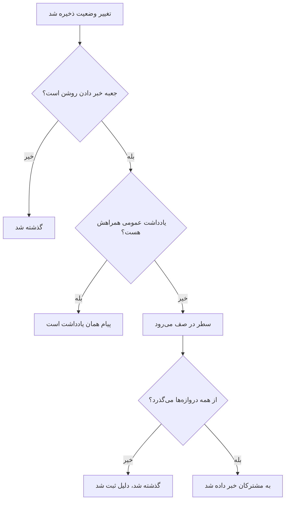

# وضعیت‌ها و شدت‌های حادثه

هر حادثه دو دسته‌بندی دارد: **وضعیتی** که می‌گوید پاسخ شما کجاست، و **شدتی** که می‌گوید چقدر درد دارد. این صفحه توضیح می‌دهد هر وضعیت چه می‌کند، چگونه وضعیت‌های خودتان را بیفزایید، و شدت‌ها چگونه رتبه می‌گیرند — برای هر کسی که حادثه‌ها را پیکربندی می‌کند، یا می‌خواهد بداند چرا یکی کسی را فراخواند یا نخواند، برطرف شد یا نشد، یا روی صفحه وضعیت آمد یا نیامد.

:::cards
- [افزودن وضعیت‌های خودتان](#افزودن-وضعیتهای-خودتان): پاسخ خود را مدل کنید، و ببینید هر وضعیت چه شمرده می‌شود.
- [تصدیق کردن چه می‌کند](#تصدیق-کردن-چه-میکند): فراخوانی متوقف می‌شود و SLA پاسخ‌داده‌شده علامت می‌خورد.
- [برطرف کردن چه می‌کند](#برطرف-کردن-چه-میکند): مانیتورها پس داده می‌شوند و SLA بسته می‌شود.
- [خبر دادن به مشترکان](#گفتن-تغییر-وضعیت-به-مشترکان-صفحه-وضعیت): دروازه‌هایی که تغییر وضعیت پیش از رسیدن به صفحه وضعیت از آن‌ها می‌گذرد.
:::

## چگونه کار می‌کند

در داشبورد، وضعیت‌ها و شدت‌ها شبیه هم به نظر می‌رسند — هر دو به‌صورت نشان‌های رنگی در فهرست حادثه‌ها و به‌صورت نقطه‌ای رنگی پیش از نام، هر جا یکی را برمی‌گزینید، نمایش داده می‌شوند، و هر دو فهرست‌هایی محدود به پروژه‌اند که می‌توانید تغییر نام و رنگ دهید. اما کارهای بسیار متفاوتی می‌کنند.

وضعیت‌ها رفتار را تعیین می‌کنند. سه پرچم بولی روی سطرهای وضعیت، همراه با ترتیب وضعیت‌ها، تعیین می‌کنند کدام حادثه‌ها فعال شمرده می‌شوند، کدام دکمه‌ها روی سرصفحه حادثه می‌آیند، ساعت SLA کی می‌ایستد، و حادثه کی از صفحه وضعیت شما برداشته می‌شود. شدت‌ها به‌خودی‌خود هیچ‌چیز را تعیین نمی‌کنند — برچسب‌هایی‌اند که اثر را توصیف می‌کنند و قواعد دیگر می‌توانند بر پایه آن‌ها تطبیق کنند.

```mermaid title="حادثه‌ها فقط رو به پایین فهرست می‌روند؛ جایگاه یک وضعیت تعیین می‌کند چه شمرده شود"
flowchart TB
    subgraph open["تصدیق‌نشده شمرده می‌شود"]
        identified["Identified"]
    end
    subgraph working["تصدیق‌شده شمرده می‌شود"]
        acknowledged["Acknowledged"]
        mitigated["Mitigated (سفارشی)"]
    end
    subgraph done["برطرف‌شده شمرده می‌شود"]
        resolved["Resolved"]
        closed["Closed (سفارشی)"]
    end
    identified --> acknowledged
    acknowledged --> mitigated
    mitigated --> resolved
    resolved --> closed
    identified -. "پرش به جلو" .-> resolved
```

مدل `IncidentState` فیلدهای `name`، `description`، `color` و `order` را دارد، به‌علاوه سه بولی: `isCreatedState`، `isAcknowledgedState` و `isResolvedState`. هر کاری که محصول با وضعیت‌ها می‌کند بر پایه همان بولی‌ها و `order` است — هرگز بر پایه نام وضعیت. به همین دلیل می‌توانید **Resolved** را به «Closed» تغییر نام دهید و چیزی نمی‌شکند: پرچم همراه سطر می‌ماند.

مدل `IncidentSeverity` فیلدهای `name`، `description`، `color` و `order` را دارد و نه چیز دیگری. پرچمی ندارد. هیچ‌چیز در OneUptime به‌خودی‌خود با **Critical Incident** رفتاری متفاوت از **Minor Incident** ندارد — شدت فقط جایی مهم است که چیزی را به آن نشانه بگیرید، مانند معیار تطبیق **Incident Severities** روی یک قاعده کشیک.

چند قاعده سریع:

- **شدت را برای بیان اثر برگزینید** — در فهرست حادثه‌ها و روی **Overview** حادثه نشان داده می‌شود، و هنگام اعلام حادثه فیلدی الزامی است.
- **وضعیت‌ها را برای مدل کردن فرایندتان برگزینید** — گام‌های پاسخی که واقعاً طی می‌کنید، به همان ترتیبی که طی می‌کنید.
- **فوریت را در وضعیت‌ها رمز نکنید** — وضعیتی به نام «Critical» کسی را فرا نمی‌خواند. شدت به‌علاوه یک قاعده کشیک این کار را می‌کند.

> [!TIP]
> هر دو فهرست هنگام ساخت پروژه‌تان بذر می‌شوند، و هر دو زیر **Incidents → Settings** ویرایش می‌شوند. آن بخش از منوی کناری Incidents به‌طور پیش‌فرض جمع است، پس پیش از گشتن دنبالشان **Settings** را باز کنید.

## وضعیت‌های بذرشده

سه وضعیت با پروژه ساخته می‌شوند، به این ترتیب. بذرپاشی تکرارپذیر است — وضعیتی فقط وقتی افزوده می‌شود که وضعیتی با آن نام از پیش نباشد.

| وضعیت | `order` | پرچم | رنگ | یعنی چه |
| ---------------- | ------- | --------------------- | --------- | -------------------------------------------------- |
| **Identified** | `1` | `isCreatedState` | `#fd625e` | وضعیتی که حادثه‌های تازه در آن می‌نشینند. |
| **Acknowledged** | `2` | `isAcknowledgedState` | `#ffbf53` | کسی حادثه را برداشته است. |
| **Resolved** | `3` | `isResolvedState` | `#2ab57d` | حادثه تمام شده و دیگر فعال شمرده نمی‌شود. |

> [!NOTE]
> نخستین وضعیت **Identified** نام دارد، هرچند چند توصیف درون محصول هنوز آن را وضعیت «created» می‌نامند. وقتی سندی یا راهنمایی «وضعیت ساخت» (created state) می‌گوید، منظورش هر وضعیتی است که `isCreatedState` را دارد — در پروژه‌ای تازه، همان **Identified**.

## هر پرچم وضعیت واقعاً چه می‌کند

| پرچم | کاربرد |
| --------------------- | ---------------------------------------------------------------------------------------------------------------------------------------------------------------------------------------------------- |
| `isCreatedState` | وضعیتی که حادثه وقتی کسی وضعیتی برنگزیده می‌گیرد. اگر هیچ وضعیتی در پروژه این پرچم را نداشته باشد، ساخت حادثه با خطایی ناموفق می‌شود که می‌گوید از تنظیمات یک وضعیت ساخت برای حادثه بیفزایید. |
| `isAcknowledgedState` | وضعیت تصدیق‌شده پروژه را مشخص می‌کند: همان که **Acknowledge** حادثه را به آن می‌برد و کاشی آماری تصدیق به نام آن است. حادثه‌ای که در آن، در هر وضعیتی پس از آن، یا برطرف‌شده باشد تصدیق‌شده است — دیگر **Acknowledge** برایش پیشنهاد نمی‌شود، کشیک دیگر برایش فرا نمی‌خواند، و SLA آن پاسخ‌داده‌شده علامت می‌خورد. |
| `isResolvedState` | وضعیت برطرف‌شده پروژه را مشخص می‌کند: همان که **Resolve** حادثه را به آن می‌برد و کاشی آماری برطرف‌شدن آن را نشان می‌دهد. حادثه‌ای که در آن، یا در هر وضعیتی پس از آن، باشد برطرف‌شده است — از **Active Incidents** و از بخش فعال صفحه وضعیت بیرون می‌رود، و SLA آن برطرف‌شده علامت می‌خورد. |

انتظار می‌رود در هر پروژه فقط یک وضعیت هر پرچم را داشته باشد — جستجوها نخستین سطر را به ترتیب می‌گیرند. سه وضعیت پرچم‌دار در صفحه تنظیمات برچسب **Built-in** دارند؛ نشانگر را روی آن ببرید (یا با Tab به آن برسید) تا بخوانید OneUptime با آن وضعیت چه می‌کند. می‌توان آن‌ها را تغییر نام و رنگ داد و کشید، اما:

- **ترتیبشان را نگه می‌دارند.** وضعیت ساخت پیش از تصدیق‌شده می‌آید، و تصدیق‌شده پیش از برطرف‌شده. کشیدنی که این را بشکند — مثلاً **Resolved** بالای **Acknowledged** — رد می‌شود، سطرها برمی‌گردند و صفحه دلیلش را می‌گوید.
- **حذف نمی‌شوند.** **Delete** آن‌ها در منوی سطر می‌ماند، قفل‌شده و با دلیل. حذف انبوه از آن‌ها می‌گذرد و آن‌ها را حذف‌نشده فهرست می‌کند. API هم از حذف آخرین وضعیت ساخت، تصدیق‌شده یا برطرف‌شده یک پروژه سر باز می‌زند.

چون رابط کاربری نام وضعیت‌ها را به‌صورت پویا می‌خواند، تغییر نام یک وضعیت آنچه را همه‌جا می‌بینید تغییر می‌دهد — کاشی‌های آماری (**Acknowledged in** و **Resolved in** با نام‌های بذرشده)، تأیید **Mark Incident as …** یک وضعیت سفارشی، و نشان در فهرست حادثه‌ها همه از نامی پیروی می‌کنند که به سطر داده‌اید.

## افزودن وضعیت‌های خودتان

وضعیتی که می‌افزایید گامی از پاسخ شماست که سه وضعیت بذرشده نامش را نمی‌برند: «Investigating»، «Mitigated»، «Monitoring»، «Closed».

:::steps
### فهرست وضعیت‌ها را باز کنید

به **Incidents → Settings → Incident State** بروید. کارت **Incident States** وضعیت‌های شما را به ترتیبشان فهرست می‌کند، هر کدام در یک سطر: دستگیره‌ای برای کشیدن، رنگ و نامش، اینکه حادثه‌ای که در آن است چه شمرده می‌شود (**Counts as**)، و توضیحاتش. جمله زیر عنوان آن را صریح می‌گوید: حادثه‌ها فقط رو به پایین این فهرست حرکت می‌کنند.

### وضعیت را بسازید

روی **Create Incident State** در سرصفحه کارت کلیک کنید و فرم را پر کنید (فیلدها در ادامه). وضعیت تازه **درست بالای وضعیت برطرف‌شده** افزوده می‌شود — جایی که بیشتر وضعیت‌ها به آن تعلق دارند، و هرگز زیر آن، جایی که بی‌صدا برطرف‌شده شمرده می‌شد.

### آن را سر جایش بکشید

سطری را با دستگیره‌اش بکشید تا جابه‌جا شود. ترتیب تازه همان لحظه که رهایش می‌کنید ذخیره می‌شود؛ عددی برای ترتیب تایپ نمی‌شود. با صفحه‌کلید، روی دستگیره بروید، Space را بزنید، با کلیدهای جهت جابه‌جا کنید و دوباره Space را بزنید. ستون **Counts as** با رها کردن سطر به‌روز می‌شود.
:::

**Edit** همان فرم ساخت را باز می‌کند. شناسه وضعیت زیر **Show ID** در منوی سطر است.

| فیلد | الزامی | چه می‌کند |
| --------------- | -------- | ------------------------------------------------------------------------------------------------------------------------------------------------------------------------------------------------------------------------------------------------------------------ |
| **Name** | بله | دست‌کم دو نویسه. جانگهدار چیزی مانند «Investigating» پیشنهاد می‌دهد. |
| **Description** | خیر | متن آزادی که توضیح می‌دهد حادثه کی در این وضعیت می‌نشیند. |
| **Color** | بله | هنگام باز شدن فرم از پیش برگزیده شده است: رنگی که هیچ‌یک از وضعیت‌های فهرست هنوز به کار نبرده، تا وضعیت تازه هرگز به همان قرمز وضعیت بالایی‌اش درنیاید. رنگ دیگری از ردیف رنگ‌های نام‌دار (Red، Orange، Lime، Green، Teal، Blue، Indigo، Purple، Magenta، Pink) برگزینید، یا برای رنگ دقیق برند مانند `#fd625e` از **Custom color** استفاده کنید. |

رنگ، نشان وضعیت و نقطه پیش از نامش را در هر انتخابگر وضعیت رنگ می‌کند: فرم‌های اعلام و قالب، کنش انبوه **Change State**، منوی وضعیت سرصفحه، و شرط‌های قواعد و پالایه‌ها. همه این انتخابگرها وضعیت‌ها را به همان ترتیبی فهرست می‌کنند که این صفحه می‌گذارد.

نمی‌توانید سه پرچم را از این فرم بگذارید — آن‌ها از آنِ سطرهای بذرشده‌اند. پس وضعیتی که می‌افزایید وضعیتی بی‌پرچم است، که سه پیامد دارد و برنامه‌ریزی برایشان می‌ارزد:

- **جایگاهش تعیین می‌کند چه شمرده شود.** ستون **Counts as** آن را نشان می‌دهد، و با کشیدن تغییر می‌کند: بالای وضعیت تصدیق‌شده، حادثه‌ای که در آن است **Not acknowledged** است؛ از وضعیت تصدیق‌شده به پایین **Acknowledged** شمرده می‌شود، پس سیاست‌های کشیک تشدیدش را متوقف می‌کنند؛ از وضعیت برطرف‌شده به پایین **Resolved** شمرده می‌شود، پس صفحه‌های وضعیت دیگر آن را فعال نشان نمی‌دهند.
- **بالای وضعیت برطرف‌شده، حادثه را فعال نگه می‌دارد.** **Active Incidents** حادثه‌هایی را در بر می‌گیرد که وضعیت جاری‌شان بالای وضعیت برطرف‌شده است، پس وضعیتی که آنجا بیفزایید حادثه را در فهرست فعال و در شمار منوی کناری نگه می‌دارد. وضعیتی که به زیر وضعیت برطرف‌شده بکشید همه‌جا برطرف‌شده شمرده می‌شود — در فهرست‌های فعال، صفحه‌های وضعیت، یادآوری‌ها و SLA — و بردن حادثه از **Resolved** به آن، برطرف کردن دوباره نیست.
- **حادثه را از منوی سرصفحه به آن می‌برید.** دکمه‌های سرصفحه فقط **Acknowledge** و **Resolve** هستند؛ وضعیت سفارشی زیر **Change state to** در منوی **⋯** کنار آن‌هاست، که هر وضعیتی پس از وضعیت جاری را فهرست می‌کند. پنجره تأیید آن **Mark Incident as `<state name>`** نام دارد، با دکمه ثبت **Mark as `<state name>`**.

> [!TIP]
> شکلی رایج، گامی برای کاهش اثر میان وضعیت‌های تصدیق‌شده و برطرف‌شده است — «Mitigated» را بسازید تا درست بالای **Resolved** و پس از **Acknowledged** بنشیند و تصدیق‌شده شمرده شود. برای گامی برای سنجش اولیه پیش از آنکه کسی حادثه را تصدیق کند، آن را بالای **Acknowledged** بکشید.

## ترتیب محدودیتی واقعی است، نه ترجیحی نمایشی

ترتیب هنگام نوشتن تغییر وضعیت اعمال می‌شود، نه فقط هنگام نمایش فهرست:

- **گذارهای رو به عقب رد می‌شوند.** بردن حادثه به وضعیتی که در ترتیب زودتر از وضعیت جاری‌اش قرار دارد با خطایی که هر دو وضعیت را نام می‌برد ناموفق می‌شود.
- **برگزیدن دوباره وضعیت جاری رد می‌شود.** گذاشتن حادثه روی وضعیتی که از پیش در آن است با «Incident state cannot be same as previous state.» ناموفق می‌شود.
- **سطری با تاریخ گذشته نمی‌تواند همسایه‌اش را تکرار کند.** درج سطری در خط زمانی که وضعیتش با سطر پس از خود یکی است هم رد می‌شود.
- **دکمه‌های سرصفحه از جایگاه وضعیت‌های پرچم‌دار در ترتیب پیروی می‌کنند.** **Acknowledge** و **Resolve** بر پایه جایگاه وضعیت جاری در فهرست مرتب‌شده پیشنهاد می‌شوند. وضعیت سفارشی‌ای که *پس از* وضعیت برطرف‌شده قرار گیرد هرگز دکمه **Resolve** نشان نمی‌دهد، چون حادثه‌ای که در آن است از پیش برطرف‌شده شمرده می‌شود.

پس وقتی وضعیتی می‌افزایید، آن را جایی بگذارید که حادثه واقعاً از آن می‌گذرد. نادرست مرتب کردنش فقط عجیب به نظر نمی‌رسد — گذارها را ناممکن می‌کند. جابه‌جا کردن یک وضعیت به پایین‌تر، همان لحظه که رهایش می‌کنید، شمرده شدن حادثه‌هایی را که از پیش در آن هستند تغییر می‌دهد.

از راه API و Terraform، ترتیب همان ستون `order` است: عددهای کوچک‌تر زودتر می‌آیند. وضعیتی که بدون آن ساخته شود درست بالای وضعیت برطرف‌شده می‌رود؛ وضعیتی که با یک عدد ساخته یا به‌روز شود آن جایگاه را می‌گیرد و وضعیت‌های سر راه یک پله پایین می‌روند. عددهایی که هیچ وضعیت دیگری ندارد همان‌طور که نوشته شده نگه داشته می‌شوند، پس وضعیتی که Terraform مدیریتش می‌کند همان عددی را برمی‌خواند که به آن داده شده.

## شدت‌های بذرشده

سه شدت با پروژه ساخته می‌شوند، به این ترتیب، از شدیدترین:

| شدت | `order` | رنگ | توضیحات بذرشده |
| --------------------- | ------- | --------- | ----------------------------------------------------------------------------------------------------------------------------------------------------------------------------------------- |
| **Critical Incident** | `1` | `#b70400` | مسائلی که اثر بسیار بالایی بر مشتریان دارند. پاسخ بی‌درنگ لازم است. نمونه‌ها: قطعی کامل یا نشت داده. |
| **Major Incident** | `2` | `#fd625e` | مسائلی که اثر چشمگیری دارند. معمولاً پاسخ بی‌درنگ لازم است. ممکن است راه‌حل‌های موقتی داشته باشیم که اثر را بر مشتریان کاهش دهند. نمونه: از کار افتادن زیرسامانه‌ای مهم. |
| **Minor Incident** | `3` | `#ffbf53` | مسائلی با اثر کم، که معمولاً در ساعت‌های کاری رسیدگی می‌شوند. بعید است بیشتر مشتریان متوجه مشکلی شوند. نمونه: افت اندکی در کارایی برنامه. |

شدت هنگام اعلام حادثه الزامی است، و روی هر مشخصات حادثه در معیارهای یک مانیتور هم الزامی است، پس هر حادثه‌ای — دستی یا خودکار — با یک شدت می‌رسد. برای جریان اعلام [اعلام یک حادثه](/docs/incidents/declaring-incidents) و برای مسیر مانیتورمحور [قالب‌بندی حادثه و هشدار](/docs/monitor/incident-alert-templating) را ببینید.

## ویرایش شدت‌ها

به **Incidents → Settings → Incident Severity** بروید. همان شکل صفحه وضعیت — یک سطر برای هر شدت، از شدیدترین، برای تغییر رتبه سطری را بکشید، و **Create Incident Severity** شدتی را در پایان (کم‌شدت‌ترین) می‌افزاید، با **Name**، **Description** و **Color** روی فرم و رنگی که، مانند فرم وضعیت، از پیش برگزیده شده.

رتبه هر جا که OneUptime شدت‌ها را مقایسه می‌کند مهم است: اپیزود شدت شدیدترین حادثه‌اش را می‌گیرد، و Critical و Warning یک پیشنهاد مانیتور به نخستین و دومین شدت شما نگاشت می‌شوند.

دو تفاوت با وضعیت‌ها:

- **محافظ حذفی نیست.** هر شدتی را می‌توان حذف کرد، از جمله سه شدت بذرشده.
- **نه پرچمی برای به ارث بردن، نه «Counts as».** شدت تازه دقیقاً مانند شدت‌های بذرشده رفتار می‌کند — برچسبی با رنگ و رتبه.

جایی که شدت بیش از توصیف کاری می‌کند: در **Incidents → Rules → On-Call Rules**، فیلد **Incident Severities** یک قاعده معیار تطبیق است. فهرست کردن **Critical Incident** آنجا همان راه بیان «برای هر چیز بحرانی تیم پایگاه داده را فرا بخوان» است — سیاست کشیک روی قاعده است، نه روی شدت.

**تغییر شدت یک حادثه** — با **Edit** روی کارت **Incident Details** حادثه، از راه API یا Terraform (`incidentSeverityId`)، با یک گردش کار یا با ابزارهای هوش مصنوعی — هر راهی که فرستاده شود همان چهار کار را می‌کند: خوراک حادثه ورودی **Incident updated** می‌گیرد که شدت تازه را نام می‌برد، مهلت‌های SLA حادثه دوباره حساب می‌شوند، قاعده یادآوری‌اش دوباره تطبیق داده می‌شود، و متریک‌های حادثه یک تغییر شدت می‌شمارند. ذخیره شدتی که حادثه از پیش دارد هیچ‌کدام را انجام نمی‌دهد، پس ویرایش فقط عنوان یک حادثه مهلت‌های SLA، یادآوری‌ها و شمار تغییر شدتش را همان‌طور که بودند می‌گذارد. شدت یک هشدار برای ورودی خوراک و یادآوری‌هایش به همین شکل کار می‌کند.

## بردن حادثه از میان وضعیت‌هایش

چهار راه هست که حادثه‌ای وضعیت عوض می‌کند:

| راه | کجا | چه می‌پرسد |
| ------------------- | ------------------------------------------------------------------------------------------- | ------------------------------------------------------------------------------------------------------------------------------------------------------------------------------------------------------------ |
| **دکمه‌های سرصفحه** | سرصفحه حادثه: **Acknowledge** و **Resolve**، و **Change state to** در منوی **⋯** آن | تأییدی کوتاه — **Acknowledge Incident** یا **Resolve Incident** — با **Notify Status Page Subscribers** و، تاشده زیر **Add a public note**، فیلد اختیاری **Public Note** و انتخابگر **Select Note Template** آن (وقتی پروژه قالب یادداشت دارد). |
| **خط زمانی وضعیت** | **State Timeline** در منوی کناری حادثه | سطری که دستی افزوده می‌شود، با **Incident Status**، **Starts At** و **Notify Status Page Subscribers**. |
| **تغییر انبوه** | **Change State** روی گزینشی در فهرست حادثه‌ها | یک صفحه با وضعیت، **Notify Status Page Subscribers** و همان **Add a public note** تاشده. |
| **خودکار** | یک معیار مانیتور، یا کد خودتان | معیاری که **Auto Resolve Incident** آن روشن است حادثه‌اش را وقتی معیار دیگر برآورده نشود برطرف می‌کند. API وضعیت را با ساختن سطری در `/api/incident-state-timeline` تغییر می‌دهد. |

اگر وضعیت جاری پیش از وضعیت تصدیق‌شده باشد، سرصفحه **Acknowledge** و **Resolve** را پیشنهاد می‌کند؛ اگر میان آن دو باشد، فقط **Resolve** را. تصدیق هر تشدید کشیک حادثه را هم متوقف می‌کند.

هر یک از این‌ها سطری در خط زمانی می‌نویسد. تغییر وضعیت چند کار دیگر هم می‌کند که لازم نیست بخواهید: ورودی‌ای در خوراک حادثه منتشر می‌کند، اگر حادثه هنوز Incident Commander ندارد یکی می‌گمارد، و ساعت SLA را به‌روز می‌کند. بازگشایی حادثه‌ای برطرف‌شده رکورد SLA تازه‌ای از زمان بازگشایی آغاز می‌کند.

## تصدیق کردن چه می‌کند

حادثه از لحظه‌ای تصدیق‌شده است که به وضعیت تصدیق‌شده شما، به هر وضعیتی پس از آن — وضعیت **Mitigated** یا **Investigating** که زیر **Acknowledged** گذاشته‌اید — یا به یک وضعیت برطرف‌شده برود، با هر کدام از چهار راه بالا که جابه‌جا شود. ستون **Counts as** در صفحه تنظیمات وضعیت نشان می‌دهد این وضعیت‌ها کدام‌اند. پس از تصدیق:

- **دیگر Acknowledge پیشنهاد نمی‌شود.** نه در سرصفحه حادثه، نه در اپ موبایل (دکمه و کشیدن آن)، نه در Slack یا Microsoft Teams، و نه با `acknowledge_incident` در سرور MCP خود OneUptime. تصدیق دوباره آن — از یک فراخوان کشیک، از Slack یا Teams — با "Incident is already acknowledged." (یا "Incident is already resolved.") رد می‌شود، به‌جای اینکه حادثه در فهرستش به بالا برگردد.
- **کشیک دیگر برایش فرا نمی‌خواند.** پاسخ‌دهنده‌ای که فراخوانش را پس از آنکه همکارش حادثه را تصدیق کرده یا جلو برده تصدیق کند، فراخوانش تصدیق می‌شود و حادثه همان‌جا که هست می‌ماند.
- **SLA پاسخ‌داده‌شده علامت می‌خورد**، در نخستین جابه‌جایی از این دست؛ جلو رفتن به وضعیت‌های بعدی همان زمان را نگه می‌دارد.
- **زمان تا تصدیق تا همان نخستین جابه‌جایی است** — کاشی آماری **Overview** حادثه، متریک **Time to Acknowledge**، اندازه‌گیری‌ای که با **The incident is acknowledged** پایان می‌یابد، و MTTA در خلاصه‌های Slack و Microsoft Teams. حادثه‌ای که مستقیم از **Identified** به **Investigating** برود همان موقع تصدیق شده است؛ حادثه‌ای که بی‌درنگ برطرف شود هنگام برطرف شدن تصدیق شده است.
- **پالایه Acknowledged** — مثلاً در ویجت فهرست حادثه‌های یک داشبورد — حادثه‌هایی را که در وضعیت تصدیق‌شده شما و در هر وضعیتی پس از آن، پیش از برطرف‌شدن، هستند نشان می‌دهد.

هشدارها و اپیزودها با وضعیت‌های هشدار شما از همین قاعده پیروی می‌کنند.

## برطرف کردن چه می‌کند

حادثه وقتی برطرف می‌شود که از وضعیتی بالای وضعیت برطرف‌شده شما به وضعیت برطرف‌شده یا به هر وضعیتی پس از آن برود — با هر کدام از چهار راه بالا که جابه‌جا شود. هر برطرف کردن:

- **مانیتورهایی را که حادثه در دست دارد پس می‌دهد.** حادثه‌ای که باز اعلام شده مانیتورهایش را در دست دارد: اگر **Change Monitor Status to** وضعیتی را نام ببرد آن‌ها را در آن وضعیت گذاشته، و اگر دستی اعلام شده، پایششان را متوقف کرده است. ویرایشی در حالی که باز است — افزودن مانیتور یا تغییر آن وضعیت — هم باعث می‌شود آن‌ها را در دست بگیرد. برطرف کردن پایش آن‌ها را از سر می‌گیرد و آن‌ها را به حالت عملیاتی برمی‌گرداند، مگر اینکه حادثه باز دیگری هنوز روی آن‌ها باشد، و از آن پس حادثه چیزی در دست ندارد. پس حادثه‌ای که از پیش برطرف‌شده اعلام شود چیزی پس نمی‌دهد، و برطرف کردن دوباره پس از بازگشایی هم چنین است: وضعیتی که مانیتورها در این میان گرفته‌اند — از پروب‌هایشان، از نگهداری یا به دست کسی — می‌ماند.
- **SLA را برطرف‌شده علامت می‌زند** و، وقتی پیش‌نویس پس‌رویدادنامه هوش مصنوعی OneUptime روشن است، پیش‌نویسی برای پس‌رویدادنامه می‌نویسد.

رفتن از **Resolved** به وضعیتی پس از آن — مثلاً **Closed** — برطرف کردن دوباره نیست: هیچ‌کدام از این‌ها دوباره اجرا نمی‌شود و SLA تازه‌ای آغاز نمی‌شود. حادثه‌ای که پیش از آنکه OneUptime ثبت این را آغاز کند اعلام شده، مانند گذشته مانیتورهایش را در برطرف کردن بعدی‌اش پس می‌دهد.

## خط زمانی وضعیت

صفحه **State Timeline** در منوی کناری حادثه، سابقه همه وضعیت‌هایی است که حادثه در آن‌ها بوده. کارت آن صفحه **Status Timeline** نام دارد و از تازه‌ترین مرتب شده است.

| ستون | چه نشان می‌دهد |
| ---------------------------------- | -------------------------------------------------------------------------------------------------------------------------------------------------------------------------------------------------------------------------------------------------------------- |
| **Incident Status** | نشانی رنگی با نام و رنگ وضعیت. |
| **Starts At** | حادثه کی وارد این وضعیت شد. |
| **Ends At** | کی از آن بیرون رفت. وضعیت جاری `Currently Active` نشان می‌دهد. |
| **Duration** | زمانی که در وضعیت گذشت، برای وضعیت جاری تا اکنون. |
| **Subscriber Notification Status** | اینکه اعلان صفحه وضعیت برای این تغییر فرستاده شد، از آن گذشته شد یا هنوز در انتظار است، با پیوند **more details**، و — وقتی ارسال ناموفق بوده — کنش **Retry**. **Retry** تغییر وضعیت را دوباره به هر صفحه وضعیتی که حادثه اکنون به آن می‌رسد می‌فرستد، از جمله به مشترکانی که پیش‌تر آن را گرفته‌اند. |

هر سطر دو کنش دارد:

- **View Cause** — پنجره **Root Cause** را باز می‌کند که مارک‌داون ثبت‌شده با آن تغییر وضعیت را نمایش می‌دهد.
- **View Logs** — پنجره‌ای باز می‌کند که توضیح می‌دهد چرا وضعیت تغییر کرد، با نمایشگر **Incident State Log**.

در داشبورد، سطرهای خط زمانی را می‌توان افزود و حذف کرد، اما ویرایش نه؛ حادثه همیشه دست‌کم یک سطر دارد. از راه API می‌توان `startsAt` یک سطر را اصلاح کرد، و هر اندازه‌گیری‌ای که از خط زمانی به دست می‌آید از آن پیروی می‌کند.

> [!WARNING]
> حذف سطری اشتباه تاریخچه حادثه را بازنویسی می‌کند، پس آن را ابزاری برای اصلاح بدانید نه عادتی برای پاک‌سازی.

## فهرست Active Incidents

**Incidents → Active Incidents** فهرستی است که در طول شیفت می‌پایید. تعریفش دقیقاً یک شرط است: وضعیت جاری حادثه بالای وضعیت برطرف‌شده شماست — نخستین وضعیتی در ترتیب که `isResolvedState` دارد. هیچ چیز دیگری در نظر گرفته نمی‌شود — نه شدت، نه سن، نه اینکه کسی آن را تصدیق کرده باشد.

آیتم منوی کناری نشان شمار قرمزی با همان پرس‌وجو دارد، پس نشان و فهرست همیشه با هم می‌خوانند. وقتی چیزی برای دیدن نباشد، صفحه همین را می‌گوید.

پیامد عملی: وضعیت سفارشی‌ای که بالای وضعیت برطرف‌شده بیفزایید حادثه‌ها را در این فهرست نگه می‌دارد — «Mitigated» یعنی «تمام» نیست — و وضعیتی که پس از آن بگذارید، مانند خود وضعیت برطرف‌شده، آن‌ها را از فهرست بیرون می‌برد. هشدارها و اپیزودها با وضعیت‌های خودشان از همین قاعده پیروی می‌کنند، و شمارهای منوی کناری، یادآوری‌ها، صفحه‌های وضعیت و اپ موبایل همگی آن را می‌خوانند.

## گفتن تغییر وضعیت به مشترکان صفحه وضعیت

تغییر وضعیت می‌تواند به مشترکان صفحه وضعیت شما خبر بدهد، اما از چند دروازه می‌گذرد. فهمیدن آن‌ها خیلی از اشکال‌زدایی‌های «چرا کسی خبردار نشد» را صرفه‌جویی می‌کند.



اعلان به ازای هر سطر خط زمانی با **Notify Status Page Subscribers** (`shouldStatusPageSubscribersBeNotified`) درخواست می‌شود، جعبه انتخاب روی پنجره تغییر وضعیت و روی فرم دستی خط زمانی. در پنجره تغییر وضعیت، وقتی حادثه بدون خبر دادن به مشترکان اعلام شده باشد خاموش آغاز می‌شود. همین جعبه تعیین می‌کند که آیا یادداشت عمومی پنجره به کسی خبر بدهد. وقتی خاموش باشد، سطر با وضعیت «گذشته‌شده» و توضیحی ذخیره می‌شود. وقتی روشن باشد، سطر در صف می‌رود و کاری پس‌زمینه‌ای آن را برمی‌دارد — این کار هر دقیقه اجرا می‌شود، پس تحویل سریع است اما آنی نیست.

**آن‌گاه سطر در صف وقتی هر کدام از این‌ها برقرار باشد گذشته می‌شود:**

- **وضعیت تازه همان وضعیت ساخت است.** وقتی حادثه اعلام شد از پیش به مشترکان خبر داده شده بود، پس نخستین سطر خط زمانی عمداً پیام دومی نمی‌فرستد.
- **حادثه هیچ مانیتوری پیوست ندارد.** بدون منبع، صفحه وضعیتی نیست که حادثه روی آن نگاشت شود.
- **حادثه روی صفحه وضعیت دیدنی نیست** (`isVisibleOnStatusPage` خاموش است).
- **صفحه وضعیت حادثه‌ها را خاموش کرده** (`showIncidentsOnStatusPage` خاموش است). این یکی به ازای هر صفحه وضعیت است — صفحه‌های دیگری که همان مانیتور را نشان می‌دهند همچنان خبردار می‌شوند.
- **صفحه وضعیت بیرون از محدوده حادثه است.** حادثه‌ای که با **Limit to these status pages** به برخی صفحه‌های وضعیت محدود شده، فقط به همان صفحه‌ها از میان صفحه‌هایی که مانیتورهایش را فهرست کرده‌اند خبر می‌دهد، و صفحه‌ای که **Only Show Incidents Scoped to This Page** را روشن دارد هرگز درباره حادثه‌ای که به آن محدود نشده خبردار نمی‌شود. این هم به ازای هر صفحه وضعیت است. [یک صفحه وضعیت برای هر مخاطب](/docs/status-pages/one-status-page-per-audience) را ببینید.

**یک چیز دیگر که نتیجه را تغییر می‌دهد.** اگر در پنجره تغییر وضعیت (زیر **Add a public note**) یا کنش انبوه **Change State**، وقتی **Notify Status Page Subscribers** روشن است، یک **Public Note** بنویسید، سطر خط زمانی به‌جای رفتن به صف، از پیش خبرداده‌شده علامت می‌خورد و پیام وضعیتش می‌گوید یادداشت آن را رساند. خود یادداشت همان چیزی است که به مشترکان می‌رسد، پس به‌جای دو پیام یکی می‌گیرند. یادداشتی که جز فاصله چیزی در آن نیست منتشر نمی‌شود و سطر مانند همیشه به صف می‌رود. تغییر وضعیت‌های نگهداری زمان‌بندی‌شده هم همین‌گونه کار می‌کنند. نوع رویداد پشت پیام ساده تغییر وضعیت `Subscriber Incident State Changed` است.

**یادداشت می‌گوید حادثه اکنون در چه وضعیتی است.** چون یادداشت همان یک پیام است، در هر کانال وضعیت تازه را نام می‌برد، همان‌طور که پیام تغییر وضعیت می‌برد: موضوع ایمیل `[Resolved Incident] <title>` است و جزئیاتش ردیف **Status** را به رنگ همان وضعیت نشان می‌دهد، پیامک می‌گوید `Incident <title> on <status page> is Resolved.`، پیام‌های Slack و Microsoft Teams سطر `**Status:** Resolved` را دارند، و محموله `IncidentNoteCreated` وب‌هوک در `data` مقدار `incidentState` را دارد. یادداشتی که جدا منتشر شود پیام همیشگی‌اش را دارد، و اعلان به‌روزرسانی یک ویرایش هم همین‌طور.

**انتشار یادداشت مجوز خودش را لازم دارد.** تغییر وضعیت و انتشار یادداشت عمومی دو مجوز جدا هستند (**Create Incident State Timeline** و **Create Incident Status Page Note** در یک نقش سفارشی؛ نقش‌های آماده حادثه و پروژه هر دو را دارند). تغییر وضعیت مجوز ویرایش حادثه را نمی‌خواهد: [تغییر یک وضعیت](/docs/permissions/index#تغییر-یک-وضعیت) را ببینید. به کسی که می‌تواند وضعیت حادثه را تغییر دهد اما نمی‌تواند یادداشت عمومی منتشر کند، **Add a public note** در پنجره یا در کنش انبوه **Change State** پیشنهاد نمی‌شود. تغییر وضعیتی که او از راه API با یادداشت بفرستد یکسره رد می‌شود، با پیامی که می‌گوید وضعیت تغییر نکرد و چرا، تا هیچ تغییری هرگز به‌عنوان «با یادداشتی خبرداده‌شده» ثبت نشود که هرگز منتشر نشد. یادداشت را کنار بگذارید و تغییر انجام می‌شود. هشدارها، اپیزودهای هشدار و اپیزودهای حادثه به‌جای آن همراه تغییر وضعیت یادداشتی خصوصی پیشنهاد می‌کنند (**Add a private note**) و همین‌گونه کار می‌کند: انتشار آن مجوز خود یادداشت را لازم دارد (**Create Alert Internal Note**، **Create Alert Episode Internal Note** یا **Create Incident Episode Internal Note** در یک نقش سفارشی؛ نقش‌های آماده هشدار، حادثه و پروژه آن‌ها را دارند)، و تغییر وضعیتی که کسی بدون آن مجوز همراه یادداشت خصوصی بفرستد یکسره رد می‌شود، پس وضعیت تغییر نمی‌کند.

**فرستاده یعنی برای هر مشترکی فرستاده شد.** کار منتظر هر پیام می‌ماند و آن را، به ازای هر صفحه وضعیت و کانال، فرستاده یا ناموفق می‌شمارد، و پیام وضعیت سطر همین شمارها را فهرست می‌کند. یک پیام ناموفق، یا ارسالی که وقتش تمام شد یا قطع شد، سطر را **Failed** می‌کند. [بررسی آنچه فرستاده شد](/docs/status-pages/subscribers#بررسی-آنچه-فرستاده-شد) را ببینید.

برای اینکه چه کسی این‌ها را دریافت می‌کند و قالب‌ها چگونه برگزیده می‌شوند، [مشترکان و اطلاعیه‌ها](/docs/status-pages/subscribers) را ببینید.

## نگه داشتن حادثه بیرون از صفحه وضعیت

چهار چیز جداگانه تعیین می‌کنند که حادثه‌ای اصلاً روی صفحه‌ای عمومی باشد یا نه، و هر چهار باید درست باشند:

- **Show Incidents** (`showIncidentsOnStatusPage`) روی خود صفحه وضعیت.
- **Visible on Status Page** (`isVisibleOnStatusPage`) روی حادثه — کلیدی در صفحه **Settings** حادثه. پیش‌فرضش true است و روی جادوگر اعلام نیست؛ یک معیار مانیتور می‌تواند با **Show Incident on Status Page** آن را تنظیم کند. حادثه‌ای که پنهان اعلام شده هنگام ساخته شدن به هیچ مشترکی خبر نمی‌دهد؛ وقتی بعداً این کلید را روشن کنید، فرم ویرایش **Notify subscribers that this incident was created** را پیشنهاد می‌کند. [اعلام یک حادثه](/docs/incidents/declaring-incidents) را ببینید.
- **صفحه در دسترس حادثه است.** صفحه یکی از مانیتورهای حادثه را فهرست کرده و، اگر حادثه به برخی صفحه‌های وضعیت محدود شده، یکی از آن‌هاست. صفحه‌ای که **Only Show Incidents Scoped to This Page** را روشن دارد فقط حادثه‌های محدودشده به خودش را نشان می‌دهد. [یک صفحه وضعیت برای هر مخاطب](/docs/status-pages/one-status-page-per-audience) را ببینید.
- **وضعیت جاری بالای وضعیت برطرف‌شده است.** همین است که حادثه را از بخش فعال برمی‌دارد: پرس‌وجوی صفحه وضعیت حادثه‌هایی را می‌گیرد که وضعیت جاری‌شان بالای وضعیت برطرف‌شده شماست، پس وضعیت برطرف‌شده و هر وضعیتی پس از آن حادثه را برمی‌دارد. چیزی را بایگانی یا بسته نمی‌کنید — برطرفش می‌کنید، و به تاریخچه می‌رود.

**حادثه‌های خصوصی هرگز پدیدار نمی‌شوند.** روشن کردن **Private Incident** حادثه را، صرف‌نظر از کلیدهای بالا، از هر صفحه وضعیتی پنهان می‌کند و آن را به مالکانش به‌علاوه مدیران و مالکان پروژه محدود می‌کند. هیچ چیزی درباره آن هم به مشترک صفحه وضعیتی نمی‌رسد: نه ساخته شدنش، نه تغییر وضعیت‌هایش، نه یادداشت‌های عمومی‌اش و نه پس‌رویدادنامه‌اش. تصویرهای توضیحات، پس‌رویدادنامه، فیلدهای سفارشی و یادداشت‌های عمومی‌اش تا وقتی خصوصی است برای همه دیدنی نیستند.

دو کلید با هم همگام نگه داشته می‌شوند، تا صفحه **Settings** حادثه همیشه همان چیزی را نشان دهد که صفحه‌های وضعیت انجام می‌دهند:

- خصوصی کردن حادثه **Visible on Status Page** را همراهش خاموش می‌کند.
- روشن کردن **Visible on Status Page** در حالی که حادثه خصوصی می‌ماند آن را خاموش نگه می‌دارد. برای انتشار حادثه‌ای خصوصی، **Private Incident** را خاموش و **Visible on Status Page** را روشن کنید — در یک ذخیره، یا یکی پس از دیگری.

این قاعده هر طور که حادثه نوشته شود برقرار است: داشبورد، API، ‏Terraform، یک گردش کار، یک مانیتور، یک قالب حادثه یا یک قاعده حریم خصوصی. مقداری که به‌صورت متن فرستاده شود، مانند `"true"`، همان `true` شمرده می‌شود. یک نوشتن روی چند حادثه که **Visible on Status Page** را روشن کند — مثلاً **Update Many** یک گردش کار — حادثه‌هایی را که خصوصی نیستند نشان می‌دهد و هر حادثه خصوصی را پنهان نگه می‌دارد. هر حادثه همان‌طور که هنگام رسیدن نوشتن به آن هست سنجیده می‌شود، پس تغییری در حریم خصوصی‌اش که در همان لحظه برسد هرگز نادیده نمی‌ماند: هیچ حادثه‌ای هرگز هم خصوصی و هم دیدنی ذخیره نمی‌شود. حادثه‌ای که خصوصی ساخته شود پنهان ساخته می‌شود، و به هیچ مشترکی نمی‌گوید که ساخته شد.

**اپیزودها از همین قاعده پیروی می‌کنند.** اپیزود حادثه خصوصی، هر چه کلید **Visible on Status Page** آن بگوید، از هر صفحه وضعیتی پنهان است و مشترکانش چیزی درباره آن نمی‌شنوند. در صفحه **Settings** اپیزود، کلید همین را می‌گوید و تا وقتی اپیزود خصوصی است خاموش می‌ماند. حادثه خصوصی هرگز اپیزودش را روی صفحه وضعیت نمی‌آورد: اپیزود فقط از راه حادثه‌هایی که خصوصی نیستند به یک صفحه می‌رسد.

:::details ارتقا از نسخه‌ای بدون این قواعد
حادثه‌ها و اپیزودهایی که پیش از این قواعد خصوصی ولی با **Visible on Status Page** روشن ذخیره شده بودند، هنگام ارتقا این گزینه‌شان خاموش می‌شود. چیزی برای کسی فرستاده نمی‌شود. تصویرهایی که چنین حادثه یا اپیزودی برای همه دیدنی کرده بود دوباره خصوصی می‌شوند، مگر اینکه چیزی که صفحه‌های وضعیت شما نشان می‌دهند هنوز آن‌ها را داشته باشد. تصویرهای یادداشت‌های عمومی حادثه‌ها، اپیزودها و رویدادهای نگهداری زمان‌بندی‌شده‌ای که صفحه‌های وضعیت شما نشانشان نمی‌دهند هم همین‌طور، که پیش‌تر برای همه دیدنی می‌ماندند.
:::

اینکه صفحه چه مقدار تاریخچه برطرف‌شده نگه دارد تنظیمی از صفحه وضعیت است، نه از حادثه. برای اینکه مانیتورهای روی صفحه چگونه تعیین می‌کنند اصلاً کدام حادثه‌ها نشان داده شوند، [منابع و گروه‌های صفحه وضعیت](/docs/status-pages/resources-and-groups) را ببینید.

## گام‌های بعدی

:::cards
- [اعلام یک حادثه](/docs/incidents/declaring-incidents): هنگام اعلام، وضعیت آغازین و شدت را برگزینید.
- [یادداشت‌ها، مالکان و خوراک حادثه](/docs/incidents/notes-owners-and-feed): یادداشت عمومی‌ای را که همراه تغییر وضعیت می‌رود منتشر کنید.
- [تنظیمات و خودکارسازی حادثه](/docs/incidents/settings): زمان میان وضعیت‌ها را بسنجید، و در قواعد شدت‌ها را تطبیق دهید.
- [مشترکان و اطلاعیه‌ها](/docs/status-pages/subscribers): چه کسی پیام‌هایی را که تغییر وضعیت می‌فرستد دریافت می‌کند.
:::
