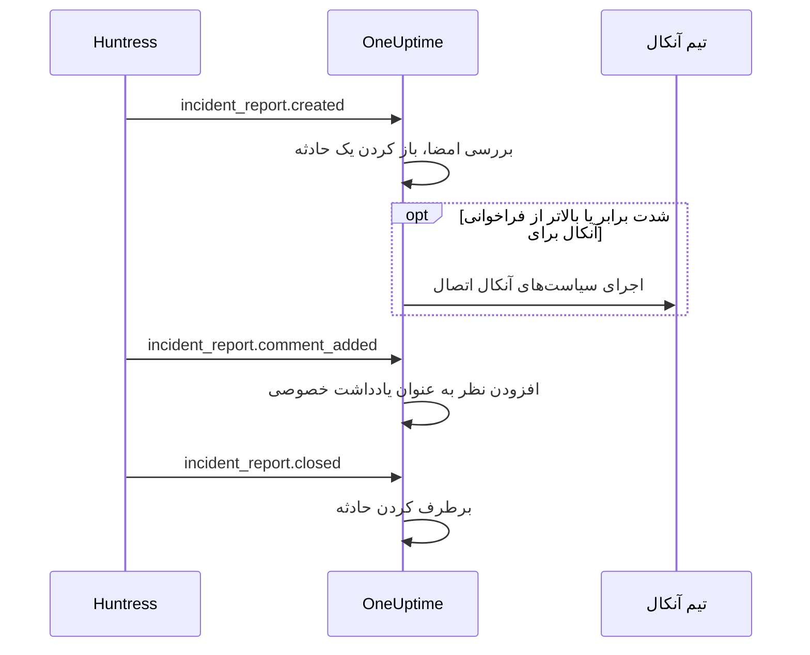

# یکپارچه‌سازی Huntress

برای گزارش‌های حادثه Huntress تیم آنکال خود را فرا بخوانید. وقتی SOC شرکت Huntress یک گزارش حادثه درباره یک نقطه پایانی یا یک هویت می‌فرستد، OneUptime برای آن یک حادثه باز می‌کند، با شدتی که انتخاب می‌کنید، سیاست‌های آنکالی را که برمی‌گزینید فرا می‌خواند و وقتی گزارش در Huntress بسته شود، حادثه را برطرف می‌کند.

این یکپارچه‌سازی **ورودی** است: Huntress هر رویداد یک گزارش حادثه را به نشانی وب‌هوکی می‌فرستد که OneUptime به شما می‌دهد و آن را با راز امضای نقطه پایانی امضا می‌کند. OneUptime هرگز Huntress را فراخوانی نمی‌کند، پس به هیچ کلید API از Huntress نیاز ندارد.

:::cards
- [چگونه کار می‌کند](#چگونه-کار-میکند): OneUptime با هر رویداد یک گزارش چه می‌کند.
- [راه‌اندازی](#راهاندازی-یکپارچهسازی): در OneUptime متصل کنید، نقطه پایانی را در Huntress اضافه کنید، راز امضای آن را ذخیره کنید و یک آزمایش بفرستید.
- [تنظیمات](#تنظیمات): فراخوانی، شدت‌ها، سازمان‌ها، برچسب‌ها و برطرف کردن.
- [عیب‌یابی](#عیبیابی): خطاهای اتصال چه معنایی دارند و چه چیزی را باید تغییر داد.
:::

## چگونه کار می‌کند

Huntress وقتی گزارش فرستاده می‌شود، وقتی کسی برای آن نظر می‌گذارد و وقتی بسته می‌شود، رویدادی درباره گزارش حادثه می‌فرستد. هر رویداد کل گزارش را در بر دارد.

1. **بررسی.** درخواست باید با راز امضای نقطه پایانی امضا شده باشد، حداکثر پنج دقیقه پیش از رسیدن. هر چیز دیگری رد می‌شود و صفحه اتصال دلیل آن را می‌گوید.
2. **باز کردن یک حادثه.** نخستین رویداد یک گزارش، حادثه‌ای با عنوانی برگرفته از گزارش باز می‌کند، مانند `Huntress: Incident on DESKTOP-01 (Acme Corp)`. شرح آن خلاصه گزارش، شدت آن در Huntress، سازمان، میزبان یا هویت آسیب‌دیده، شاخص‌هایی که Huntress یافته و پیوندی به گزارش در Huntress را دارد. رویدادهای بعدی همان گزارش، و تحویل‌هایی که Huntress دوباره می‌فرستد، همین حادثه را پیدا می‌کنند: یک گزارش هرگز دو حادثه باز نمی‌کند.
3. **فراخوانی.** حادثه با شدت حادثه‌ای باز می‌شود که اتصال برای شدت Huntress گزارش تعیین کرده است. وقتی این شدت برابر یا بالاتر از **فراخوانی آنکال برای** باشد، **سیاست‌های آنکال** اتصال اجرا می‌شوند.
4. **دنبال کردن گزارش.** نظری که در Huntress افزوده شود، یادداشتی خصوصی روی حادثه می‌شود. وقتی گزارش بسته یا رد شود، حادثه برطرف می‌شود.

حادثه‌هایی که این‌گونه باز می‌شوند هرگز روی صفحه وضعیت نمایش داده نمی‌شوند. قواعد حادثه شما (قواعد آنکال، مالک، برچسب و حریم خصوصی) مانند هر حادثه دیگری روی آن‌ها اعمال می‌شوند.

## پیش از شروع

- در OneUptime، نقش **Project Owner** یا **Project Admin**. اعضا، بینندگان و نقش‌های حادثه اتصال و گزارش‌های دریافتی آن را می‌بینند، اما نمی‌توانند آن را تغییر دهند.
- در Huntress، نقش **Account Admin**: فقط مدیران حساب می‌توانند وب‌هوک اضافه کنند.
- یک سیاست آنکال برای فراخوانی. بدون آن، گزارش‌ها حادثه باز می‌کنند و کسی را فرا نمی‌خوانند، مگر اینکه یک قاعده آنکال حادثه با آن‌ها مطابقت داشته باشد.
- در نصب خودمیزبان، OneUptime‌ای که Huntress بتواند از اینترنت از طریق HTTPS به آن برسد: Huntress وب‌هوک را فقط به نشانی‌های `https://` می‌فرستد.

## راه‌اندازی یکپارچه‌سازی

:::steps
### اتصال Huntress در OneUptime

**حوادث → یکپارچه‌سازی‌ها → Huntress** (`/dashboard/{projectId}/incidents/integrations/huntress`) را باز کنید. بخش **یکپارچه‌سازی‌ها** در منوی کناری حوادث به طور پیش‌فرض بسته است، پس ابتدا آن را باز کنید. روی **اتصال Huntress** کلیک کنید.

**سیاست‌های آنکال** را برای فراخوانی انتخاب کنید. سپس **فراخوانی آنکال برای** می‌پرسد کدام گزارش‌ها آن‌ها را فرا بخوانند و از **گزارش‌های بالا و بحرانی** شروع می‌کند. بقیه موارد با مقدار پیش‌فرض زیر **فیلدهای بیشتر** هستند ([تنظیمات](#تنظیمات) را ببینید). روی **اتصال Huntress** کلیک کنید. صفحه اتصال باز می‌شود، با کارت **اتصال Huntress** که شما را در سه مرحله بعدی راهنمایی می‌کند.

### افزودن نقطه پایانی وب‌هوک در Huntress

در صفحه اتصال روی **کپی نشانی وب‌هوک** کلیک کنید. نشانی شبیه `https://oneuptime.com/api/huntress/webhook/<connection-id>` است؛ در نصب خودمیزبان با میزبان خودتان شروع می‌شود.

در Huntress منوی بالا سمت راست را باز کنید و **Integrations** را انتخاب کنید. روی **Add an Integration** کلیک کنید، **Webhooks** را انتخاب کنید و روی **Add Endpoint** کلیک کنید. نشانی را جای‌گذاری کنید، **Incident Reports** را روشن کنید و ذخیره کنید. **Escalations**، **Platform Actions** و **Account Notices** را خاموش بگذارید: OneUptime این رویدادها را می‌پذیرد و کاری با آن‌ها نمی‌کند.

### ذخیره راز امضای نقطه پایانی

در Huntress منوی نقطه پایانی (⋯) را باز کنید و **View Signing Secret** را انتخاب کنید. همه آن را کپی کنید: با `whsec_` شروع می‌شود. در صفحه اتصال روی **ذخیره راز امضا** کلیک کنید، آن را جای‌گذاری کنید و روی **ذخیره راز امضا** کلیک کنید. راز رمزگذاری می‌شود و دیگر هرگز نمایش داده نمی‌شود.

تا وقتی راز ذخیره نشده باشد، OneUptime هر درخواستی به این نشانی را رد می‌کند. Huntress رویداد ردشده را بعدا دوباره می‌فرستد، پس رویدادی که اکنون رد شود باز هم می‌رسد.

### فرستادن یک آزمایش

در Huntress منوی نقطه پایانی (⋯) را باز کنید و **Send Test** را انتخاب کنید. در چند ثانیه، کارت صفحه اتصال به **اتصال** تبدیل می‌شود، با وضعیت **در حال دریافت گزارش‌ها**.

> [!NOTE]
> آزمایش هر چه در بر داشته باشد، اتصال نشان می‌دهد که رسیده است. آزمایشی که یک گزارش حادثه در بر دارد، مانند هر گزارش دیگری حادثه باز می‌کند و اگر به اندازه کافی شدید باشد، آنکال را فرا می‌خواند.
:::

## تنظیمات

**اتصال Huntress** فقط می‌پرسد چه کسی فراخوانده شود و برای کدام گزارش‌ها. بقیه موارد زیر **فیلدهای بیشتر** هستند، با مقدار پیش‌فرضی که برای بیشتر تیم‌ها مناسب است. برای تغییر یک تنظیم در آینده، روی **ویرایش تنظیمات** در کارت **تنظیمات** اتصال کلیک کنید.

| تنظیم | چه می‌کند | پیش‌فرض |
| --- | --- | --- |
| **سیاست‌های آنکال** | سیاست‌هایی که وقتی گزارش به اندازه کافی شدید باشد اجرا می‌شوند. برای باز کردن حادثه بدون فراخوانی کسی، خالی بگذارید. | هیچ |
| **فراخوانی آنکال برای** | کدام گزارش‌ها سیاست‌ها را فرا می‌خوانند: **فقط گزارش‌های بحرانی**، **گزارش‌های بالا و بحرانی** یا **همه گزارش‌ها**. هر گزارش در هر صورت یک حادثه باز می‌کند. | **گزارش‌های بالا و بحرانی** |
| **نام** | نام اتصال در OneUptime. | `Huntress` |
| **شدت برای گزارش‌های بحرانی**، **شدت برای گزارش‌های بالا**، **شدت برای گزارش‌های پایین** | شدت حادثه‌ای که هر شدت Huntress با آن باز می‌شود. | سه شدت بالاتر حادثه شما، به ترتیب |
| **فقط این سازمان‌ها** | سازمان‌های Huntress که گزارش‌هایشان حادثه باز می‌کنند، در هر خط یک نام یا شناسه سازمان. بزرگی و کوچکی حروف نام‌ها مهم نیست. | خالی: همه سازمان‌ها |
| **برچسب‌ها** | برچسب‌هایی که به هر حادثه افزوده می‌شوند، علاوه بر برچسبی به نام سازمان گزارش. | هیچ |
| **برطرف کردن وقتی Huntress گزارش را می‌بندد** | وقتی گزارش در Huntress بسته یا رد شود، حادثه را برطرف کن. اگر خاموش باشد، به‌جای آن یک یادداشت خصوصی روی حادثه این را می‌گوید. | روشن |

### شدت‌ها

Huntress به هر گزارش حادثه یکی از سه شدت را می‌دهد. اگر برای یکی از آن‌ها شدت حادثه انتخاب نکنید، گزارش به ترتیب شدت‌های حادثه شما باز می‌شود، همان‌طور که **حوادث → تنظیمات → شدت حادثه** آن‌ها را فهرست می‌کند:

| شدت در Huntress | منظور Huntress از آن | شدت حادثه |
| --- | --- | --- |
| Critical | مهاجمانی که مستقیم پشت صفحه‌کلید هستند، بدافزار خطرناک یا نفوذ فعال، که باید فورا مهار شود. | بالاترین |
| High | بدافزار تأییدشده که به رفع فوری نیاز دارد، یا نفوذ به هویتی که باید درباره‌اش اقدام کرد. | دومین |
| Low | برنامه‌های احتمالاً ناخواسته، بقایای بدافزار و یافته‌های قدیمی‌تر درباره هویت‌ها. | سومین |

پروژه‌ای که شدت‌های کمتری دارد، برای بقیه از پایین‌ترین شدت خود استفاده می‌کند. گزارشی که شدت ندارد، بالا در نظر گرفته می‌شود. اگر شدتی که انتخاب کرده‌اید حذف شود، دوباره ترتیب تصمیم می‌گیرد.

### سازمان‌ها

هر حادثه برچسبی به نام سازمان Huntress گزارش می‌گیرد، مانند _Acme Corp_. یک اتصال گزارش‌های همه سازمان‌های حساب Huntress شما را دریافت می‌کند و **فقط این سازمان‌ها** آن را محدود می‌کند.

> [!TIP]
> برای فراخواندن تیم خود هر مشتری، **سیاست‌های آنکال** اتصال را خالی بگذارید و برای هر سازمان یک قاعده آنکال حادثه اضافه کنید، مانند «اگر **برچسب‌های حادثه** یکی از _Acme Corp_ را دارد»، که سیاست آن مشتری را اجرا کند. [قواعد کشیک حادثه](/docs/incidents/settings#قواعد-کشیک-حادثه) را ببینید.

## گزارش‌ها در صفحه اتصال

فهرست **گزارش‌های حادثه** اتصال، هر گزارشی را که Huntress فرستاده نشان می‌دهد، از جدیدترین: میزبان یا هویت آسیب‌دیده، شدت و وضعیت آن در Huntress و **نتیجه** آن.

| نتیجه | چه اتفاقی افتاد |
| --- | --- |
| **حادثه باز شد** | گزارش یک حادثه باز کرد. **مشاهده حادثه** آن را باز می‌کند؛ **آنکال فراخوانده شد** یعنی اتصال سیاست‌هایش را فرا خواند. |
| **حادثه برطرف شد** | Huntress گزارش را بست و حادثه آن برطرف شد. |
| **نادیده گرفته شد: سازمان زیر نظر نیست** | سازمان گزارش در **فقط این سازمان‌ها** نیست. |
| **نادیده گرفته شد: از قبل در Huntress بسته شده** | گزارش نخستین باری که OneUptime از آن باخبر شد، از قبل بسته بود. |

گزارشی که نادیده گرفته شده، اگر بعدا تنظیمات را تغییر دهید هم نادیده گرفته شده می‌ماند. وقتی **برطرف کردن وقتی Huntress گزارش را می‌بندد** خاموش باشد، گزارش بسته‌شده نتیجه **حادثه باز شد** را نگه می‌دارد.

## امنیت

- **فقط درخواست‌های امضاشده.** OneUptime سرآیندهای `svix-id`، `svix-timestamp` و `svix-signature` را که Huntress می‌فرستد، با بدنه درخواست دقیقا همان‌طور که رسیده مقایسه می‌کند. درخواستی که با راز ذخیره‌شده امضا نشده باشد، یا بیش از پنج دقیقه زودتر یا دیرتر امضا شده باشد، رد می‌شود.
- **راز، راز می‌ماند.** به صورت رمزگذاری‌شده نگهداری می‌شود، API هرگز آن را برنمی‌گرداند و دیگر هرگز نمایش داده نمی‌شود. **جایگزینی راز امضا** در صفحه اتصال راز دیگری را ذخیره می‌کند، مانند راز یک نقطه پایانی جدید.
- **نشانی یک آدرس است، نه گذرواژه.** نشانی، اتصال را مشخص می‌کند؛ فقط درخواستی که با راز نقطه پایانی امضا شده باشد پردازش می‌شود.
- **یک نقطه پایانی برای هر اتصال.** هر اتصال نشانی و راز خودش را دارد. برای دریافت گزارش‌های یک حساب Huntress دیگر، دوباره متصل کنید.

## استفاده از ایمیل به‌جای آن

Huntress گزارش‌های حادثه را با ایمیل هم می‌فرستد و یک [مانیتور ایمیل ورودی](/docs/monitor/incoming-email-monitor) می‌تواند از این ایمیل‌ها حادثه باز کند، مثلا وقتی موضوع شامل `Critical Incident Report` باشد. اما ایمیل‌ها را وضعیت یک مانیتور واحد در نظر می‌گیرد: تا وقتی حادثه آن باز است، گزارش بعدی حادثه‌ای باز نمی‌کند و حادثه با معیارهای مانیتور برطرف می‌شود، نه وقتی Huntress گزارش را می‌بندد. اتصال Huntress برای هر گزارش یک حادثه باز می‌کند و هر کدام را همراه گزارشش برطرف می‌کند، پس آن را ترجیح دهید. وقتی اتصال گزارش دریافت کرد، فرستادن ایمیل‌ها به مانیتور را متوقف کنید، وگرنه هر گزارش دو بار فرا می‌خواند.

## عیب‌یابی

وقتی OneUptime درخواستی را رد می‌کند، صفحه اتصال دلیل آن را زیر **آخرین درخواست رد شد** نشان می‌دهد. در Huntress، **View Delivery Attempts** در منوی نقطه پایانی (⋯) هر تحویل را همراه پاسخ OneUptime فهرست می‌کند.

:::details "A request arrived but was refused, because no signing secret is saved for this connection yet"
راز امضای نقطه پایانی را ذخیره کنید: [راه‌اندازی یکپارچه‌سازی](#راهاندازی-یکپارچهسازی) را ببینید. Huntress درخواست ردشده را دوباره می‌فرستد.
:::

:::details "The request's signature does not match the signing secret"
راز ذخیره‌شده متعلق به این نقطه پایانی نیست. هر نقطه پایانی راز خودش را دارد: در Huntress منوی نقطه پایانی (⋯) را باز کنید، **View Signing Secret** را انتخاب کنید، همه آن را کپی کنید و با **جایگزینی راز امضا** ذخیره کنید.
:::

:::details "The request was signed more than five minutes from now"
ساعت Huntress و سرور OneUptime شما بیش از پنج دقیقه با هم فاصله دارند، یا درخواست تکرار یک درخواست قدیمی است. در نصب خودمیزبان، بررسی کنید که ساعت سرور درست باشد.
:::

:::details "No Huntress connection has this address."
اتصال حذف شده است، یا نشانی نقطه پایانی در Huntress نشانی این اتصال نیست. در صفحه اتصال روی **کپی نشانی وب‌هوک** کلیک کنید و نشانی را دوباره در نقطه پایانی در Huntress جای‌گذاری کنید.
:::

:::details "This project has no incident severities, so a Huntress report cannot open an incident"
یک شدت در **حوادث → تنظیمات → شدت حادثه** اضافه کنید. Huntress گزارش را دوباره می‌فرستد.
:::

:::details کسی فراخوانده نشد
گزارشی که پایین‌تر از **فراخوانی آنکال برای** باشد، حادثه را بدون فراخوانی باز می‌کند. در فهرست **گزارش‌های حادثه**، **آنکال فراخوانده شد** زیر نتیجه یک گزارش یعنی اتصال فرا خواند. صفحه **اجراهای آنکال** حادثه نشان می‌دهد هر سیاست چه کرد.
:::

## گام‌های بعدی

:::cards
- [قواعد کشیک حادثه](/docs/incidents/settings#قواعد-کشیک-حادثه): تیم خود هر سازمان را با برچسبش فرا بخوانید.
- [وضعیت‌ها و شدت‌های حادثه](/docs/incidents/states-and-severities): ترتیب شدت‌هایی را که گزارش‌های Huntress با آن‌ها باز می‌شوند تعیین کنید.
- [قواعد تشدید](/docs/on-call/escalation-rules): تصمیم بگیرید چه کسی فراخوانده شود و فراخوانی کی جلو برود.
- [نمای کلی یکپارچه‌سازی‌ها](/docs/integrations/index): ابزارهای دیگری که می‌توانید متصل کنید.
:::
