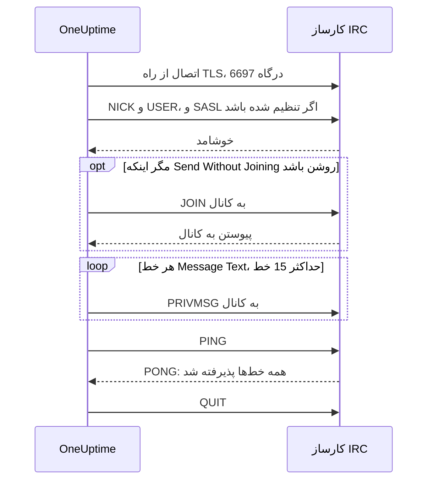

# یکپارچه‌سازی IRC

به‌روزرسانی‌های حادثه را در کانالی از هر شبکه IRC منتشر کنید: Libera.Chat، OFTC یا کارساز خودتان.

IRC وب‌هوک ندارد، برای همین مرحله گردش کاری **Send Message to IRC** در OneUptime مانند هر کارخواه IRC دیگری خودش به کارساز وصل می‌شود. چیزی برای نصب و هیچ برنامه‌ای برای ثبت وجود ندارد. این یکپارچه‌سازی **خروجی** است: OneUptime در کانال پیام می‌گذارد و گفت‌وگوهای آن را نمی‌خواند.

:::cards
- [چگونه کار می‌کند](#چگونه-کار-میکند): یک اجرای مرحله به کارساز چه می‌گوید.
- [راه‌اندازی](#راهاندازی-یکپارچهسازی): کارساز و کانال، گذرواژه‌ها و سپس گردش کاری: از قالب یا از صفر.
- [نکته‌ها](#نکتهها): ارسال بدون پیوستن، SASL، پیام‌های بلند و اجراهای پشت سر هم.
- [عیب‌یابی](#عیبیابی): خطاهای مرحله چه معنایی دارند و چه چیزی را باید تغییر داد.
:::

## چگونه کار می‌کند

هر اجرای مرحله، همان‌طور که یک کارخواه IRC رفتار می‌کند، گفت‌وگوی کوتاهی با کارساز IRC دارد و سپس ارتباط را قطع می‌کند.

1. **اتصال.** مرحله از راه TLS به درگاه `6697` وصل می‌شود و گواهی کارساز را بررسی می‌کند.
2. **ثبت.** با نام `OneUptime` ثبت می‌شود، مگر اینکه **Nickname** دیگری تنظیم کنید، و وقتی **SASL Username** و **SASL Password** پر شده باشند، با SASL وارد حساب می‌شود.
3. **پیوستن.** به کانال می‌پیوندد، مگر اینکه **Send Without Joining** روشن باشد، و اگر کانال کلید داشته باشد از **Channel Key** استفاده می‌کند.
4. **ارسال.** هر خط **Message Text** به‌صورت یک پیام IRC جداگانه، یعنی یک `PRIVMSG`، فرستاده می‌شود.
5. **تأیید.** IRC هرگز نمی‌گوید «تحویل شد»، برای همین مرحله یک `PING` می‌فرستد و منتظر `PONG` کارساز می‌ماند. کارساز به ترتیب پاسخ می‌دهد، پس تا آن لحظه هر ردّی از پیام رسیده است.
6. **خروج.** از کارساز خارج می‌شود.

مرحله به محض اینکه کارساز همه خط‌ها را بپذیرد، از خروجی **Success** ادامه می‌دهد. وقتی کارساز در دسترس نباشد، یا اتصال، نام مستعار، یک گذرواژه، کانال یا پیام را رد کند، از خروجی **Error** ادامه می‌دهد و اگر کارساز دلیلی گفته باشد، همان را با کلمات خود کارساز می‌آورد.

## پیش از شروع

- در OneUptime Cloud، طرح **Growth** یا طرحی بالاتر: گردش‌های کاری و متغیرهایشان جزو آن هستند. نصب‌های خودمیزبان بدون صورت‌حساب محدودیت طرح ندارند.
- نقشی که گردش کاری می‌سازد: **Project Owner**، **Project Admin** یا **Workflow Admin**.
- یک حساب در شبکه IRC، اگر شبکه بخواهد وارد حساب شوید. Libera.Chat این را برای اتصال از برخی نشانی‌های ابری و VPN می‌خواهد.

## راه‌اندازی یکپارچه‌سازی

:::steps
### انتخاب کارساز و کانال

تعیین کنید پیام‌ها به کجا بروند: نام میزبان کارساز، مثلاً `irc.libera.chat`، و کانال، مثلاً `#your-channel`.

- **IRC Server** فقط نام میزبان را می‌گیرد و هیچ چیز دیگر: نه `ircs://` و نه درگاه. مرحله از راه TLS به درگاه `6697` وصل می‌شود. اگر کارساز شما TLS را روی درگاه دیگری می‌پذیرد، آن را در **Port** زیر **More fields** تنظیم کنید.
- **Channel** باید یک کانال باشد. نام مستعاری که آنجا نوشته شود رد می‌شود، تا مرحله هرگز به اشتباه برای کسی پیام خصوصی نفرستد.

کارساز باید کارسازی باشد که OneUptime اجازه اتصال به آن را دارد. نشانی‌های loopback (`localhost`، `127.0.0.1`)، link-local و فراداده ابری همیشه رد می‌شوند. در OneUptime Cloud کارسازی که روی نشانی شبکه خصوصی باشد نیز رد می‌شود. نصب خودمیزبان می‌تواند به کارساز IRC در شبکه خودش برسد، مگر اینکه `DATA_SOURCE_BLOCK_PRIVATE_ADDRESSES` روی `true` تنظیم شده باشد.

### ذخیره گذرواژه‌ها در متغیرهای محرمانه

اگر کارساز، شبکه و کانال شما به هیچ گذرواژه‌ای نیاز ندارند، این گام را رد کنید. در غیر این صورت هر گذرواژه را در یک [متغیر سراسری](/docs/workflows/variables#متغیرهای-سراسری) محرمانه ذخیره کنید. آنگاه گردش کاری به‌جای گذرواژه نام متغیر را نگه می‌دارد و گذرواژه را فقط در یک جا تغییر می‌دهید.

| تنظیم               | چه زمانی پر شود                                                         | متغیر، برای نمونه     |
| ------------------- | ----------------------------------------------------------------------- | --------------------- |
| **Server Password** | کارساز یا bouncer شما هنگام اتصال گذرواژه می‌خواهد.                     | `IRC_SERVER_PASSWORD` |
| **SASL Password**   | شبکه می‌خواهد وارد حسابتان شوید. **SASL Username** نام حساب را می‌گیرد. | `IRC_SASL_PASSWORD`   |
| **Channel Key**     | کانال کلید دارد (حالت `+k`).                                            | `IRC_CHANNEL_KEY`     |

برای ذخیره یکی، **Workflows → Global Variables** را باز کنید و روی **Create Workflow Variable** بزنید. نام را در **Name** بنویسید و روی **Next** بزنید. گذرواژه را در **Content** بگذارید، **Secret** را روشن کنید و روی **Create Workflow Variable** بزنید. گزارش‌های اجرا به‌جای مقدار متغیر محرمانه `[REDACTED]` نشان می‌دهند.

### ساخت گردش کاری

از قالب شروع کنید، که کل گردش کاری را برایتان می‌سازد، یا از صفر.

:::tabs
@tab از قالب
1. **Workflows** را باز کنید و روی **Create Workflow** بزنید.
2. در **Search templates…** عبارت `IRC` را بنویسید، روی **Tell IRC when an incident opens** و سپس روی **Use this template** بزنید.
3. نام **Notify IRC on new incident** را نگه دارید یا تغییر دهید و روی **Next** بزنید.
4. **IRC Server** و **IRC Channel** را وارد کنید و روی **Create Workflow** بزنید.

گردش کاری در **Builder** با سه مرحله باز می‌شود: **On Create Incident**؛ **Send Message to IRC** که شماره، عنوان، شدت و وضعیت حادثه را در دو خط منتشر می‌کند؛ و یک مرحله **Log** روی خروجی **Error** آن که ثبت می‌کند چرا پیامی تحویل نشد. کارساز و کانال به‌صورت متغیرهای `ircServer` و `ircChannel` گردش کاری ذخیره می‌شوند. اگر در گام پیش گذرواژه‌هایی ذخیره کرده‌اید، روی **Send Message to IRC** بزنید، **More fields** را باز کنید و هر متغیر را با دکمه **{ }** تنظیم مربوطش انتخاب کنید.
@tab از صفر
1. **Workflows** را باز کنید، روی **Create Workflow** بزنید، **Start from scratch** را انتخاب کنید، برای گردش کاری نامی بگذارید و روی **Create Workflow** بزنید.
2. در **Builder** روی **Choose what starts this workflow** بزنید و **On Create Incident** را زیر **Popular** انتخاب کنید. روی تریگر بزنید و در **Select Fields** فیلدهایی از حادثه را که پیامتان نشان می‌دهد، مثلاً عنوان آن، انتخاب کنید.
3. روی **Add Component** بزنید، `irc` را جستجو کنید و روی **Send Message to IRC** بزنید. خروجی **Success** تریگر را به این مرحله وصل کنید.
4. روی مرحله تازه بزنید و **IRC Server**، **Channel** و **Message Text** را پر کنید. دکمه **{ }** در **Message Text** فیلدهای حادثه، مثلاً عنوان آن، را درج می‌کند.
5. اگر در گام پیش گذرواژه‌هایی ذخیره کرده‌اید، **More fields** را باز کنید. در **Server Password**، **SASL Password** یا **Channel Key** روی **{ }** بزنید و متغیر را زیر **Global variables** انتخاب کنید. نام حسابتان را در **SASL Username** بنویسید.
:::

### روشن کردن و آزمودن

کلید **Enabled** را در بالای **Builder** روشن کنید. از این پس هر حادثه تازه در کانال منتشر می‌شود.

برای آزمودن بدون باز کردن حادثه، روی **Run Workflow** بزنید و شناسه حادثه‌ای را که از پیش دارید در **Incident ID** بگذارید. صفحه حادثه شناسه‌اش را نشان می‌دهد. روی **Run Workflow Manually** بزنید و با **Run** تأیید کنید. پنل **Workflow Run** اجرا را دنبال می‌کند: گزارش مرحله IRC می‌گوید چند خط فرستاده، مثلاً `Sent 2 lines to #your-channel.`، و پیام در کانال پدیدار می‌شود. اگر مرحله به‌جای آن از **Error** ادامه دهد، گزارشش دلیل را می‌گوید: [عیب‌یابی](#عیبیابی) را ببینید.
:::

## نکته‌ها

- **ارسال بدون پیوستن.** بیشتر کانال‌ها فقط پیام اعضای خود را می‌پذیرند (حالت `+n`)، برای همین مرحله پیش از ارسال به کانال می‌پیوندد و بلافاصله پس از آن بیرون می‌رود. کانالی که روی `-n` تنظیم شده پیام‌های بیرونی را می‌پذیرد: **Send Without Joining** را زیر **More fields** روشن کنید تا کانال آمدن و رفتن مرحله را نبیند.
- **ورود با SASL.** در شبکه‌هایی که از SASL استفاده می‌کنند، مانند Libera.Chat، **SASL Username** و **SASL Password** را پر کنید تا وارد حسابتان شوید. Libera.Chat این را برای اتصال از برخی نشانی‌های ابری و VPN الزامی می‌داند. [راهنمای SASL در Libera.Chat](https://libera.chat/guides/sasl) را ببینید.
- **به سقف ۱۵ خط توجه کنید.** هر خط **Message Text** یک پیام IRC جداگانه است، خط بلند برای جا شدن تقسیم می‌شود و خط‌های خالی کنار گذاشته می‌شوند. هر پیام حداکثر در ۱۵ خط IRC فرستاده می‌شود: پیام بلندتر کوتاه می‌شود و خط آخرش این را می‌گوید. چهار خط نخست بی‌درنگ می‌روند و بقیه هر ثانیه یک خط، با همان آهنگ کارخواه‌های IRC، پس ۱۵ خط حدود ۱۱ ثانیه طول می‌کشد.
- **اجراهای پشت سر هم را در یک پیام جمع کنید.** هر اجرا یک اتصال جداگانه است و شبکه‌های IRC محدود می‌کنند که یک نشانی هر چند وقت یک بار می‌تواند وصل شود. اجراهای پشت سر هم ممکن است با دلیلی مانند `Reconnecting too fast` رد شوند و مثل هر ردّ دیگری از **Error** ادامه دهند. برای گردش کاری‌ای که ممکن است چندین بار در دقیقه اجرا شود، آنچه را باید بگوید در یک پیام جمع کنید یا از راه کارساز خودتان بفرستید.
- **قالب‌بندی با کدهای خود IRC.** IRC مارک‌داون ندارد، پس متن همان‌طور که نوشته شده فرستاده می‌شود. کدهای قالب‌بندی IRC، مانند پررنگ و رنگ‌ها، کار می‌کنند.
- **کارساز بدون TLS.** **Disable TLS** را فقط برای کارسازی روشن کنید که TLS ارائه نمی‌دهد: در این حالت مرحله به درگاه `6667` وصل می‌شود و هر گذرواژه‌ای رمزنگاری‌نشده فرستاده می‌شود. برای اعتماد به گواهی کارسازی که مرجع صدور گواهی خودتان صادر کرده، نصب خودمیزبان به‌جای آن `NODE_EXTRA_CA_CERTS` را تنظیم می‌کند.
- **نام مستعار دیگر.** پیام‌ها از `OneUptime` می‌آیند، مگر اینکه **Nickname** را تنظیم کنید. اگر نام مستعار گرفته شده باشد، مرحله یک زیرخط یا یک عدد به آن می‌افزاید.

## عیب‌یابی

وقتی مرحله از **Error** ادامه می‌دهد، گزارش اجرا دلیل را در جمله‌ای می‌گوید که مانند یکی از این‌ها آغاز می‌شود.

:::details "The IRC server refused the connection"
کارساز، یا bouncer شما، اتصال را رد کرده و پیام با دلیل آن پایان می‌یابد. وقتی کارساز گذرواژه بخواهد، پیام همین را می‌گوید: **Server Password** را پر کنید یا آن را بررسی کنید.
:::

:::details "SASL sign-in failed"
شبکه حساب یا گذرواژه را نپذیرفت. **SASL Username** و **SASL Password** را بررسی کنید.
:::

:::details "Could not join #your-channel"
کانال مرحله را به دلیلی که پیام می‌گوید راه نداد. کانالی که کلید دارد، به آن کلید در **Channel Key** نیاز دارد.
:::

:::details "Could not send to #your-channel"
کارساز پیام را به دلیلی که پیام خطا می‌گوید رد کرد. اگر **Send Without Joining** روشن باشد، ممکن است کانال فقط پیام اعضای خود را بپذیرد: آن را خاموش کنید.
:::

:::details "The TLS certificate of the IRC server … is not trusted"
گواهی کارساز از گواهی‌هایی نیست که OneUptime به آن‌ها اعتماد دارد. نصب خودمیزبان می‌تواند با `NODE_EXTRA_CA_CERTS` به مرجع صدور گواهی خودش اعتماد کند. **Disable TLS** را فقط برای کارسازی روشن کنید که TLS ارائه نمی‌دهد.
:::

## گام‌های بعدی

:::cards
- [مؤلفه‌ها → IRC](/docs/workflows/components#irc): همه تنظیمات مرحله و معنای خروجی‌های آن.
- [متغیرها](/docs/workflows/variables#متغیرهای-سراسری): متغیرهای سراسری محرمانه و اینکه مرحله‌ها چگونه از آن‌ها استفاده می‌کنند.
- [اجراها](/docs/workflows/runs-and-logs): ببینید هر اجرای گردش کاری چه کرد.
- [نمای کلی یکپارچه‌سازی‌ها](/docs/integrations/index): الگوی خروجی و ابزارهای دیگری که می‌توانید وصل کنید.
:::
