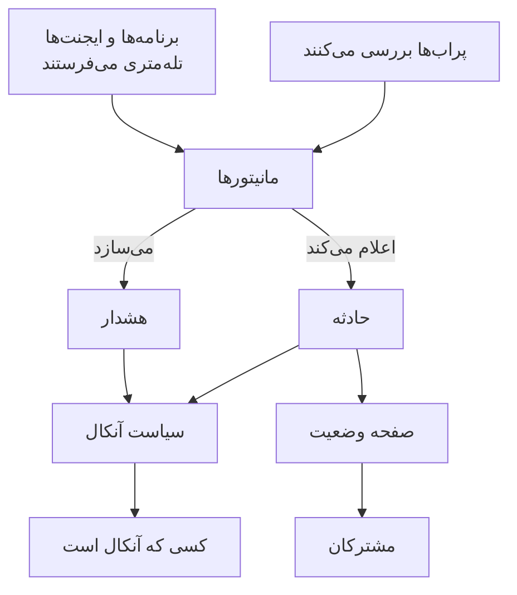

# مفاهیم اصلی

OneUptime محصولات زیادی دارد، اما همه بر چند ایده استوارند: پروژه‌ها، مانیتورها، حوادث و هشدارها، آنکال، صفحات وضعیت و تله‌متری. این صفحه هر کدام را در چند جمله توضیح می‌دهد، نشان می‌دهد چگونه به هم وصل می‌شوند، و به جایی پیوند می‌دهد که هر کدام کامل شرح داده شده است. یک بار آن را بخوانید، و هر صفحه دیگری از مستندات آسان‌تر خوانده می‌شود.

:::cards
- [پروژه‌ها و افراد](#پروژهها-و-افراد): همه چیز کجاست، و چه کسی چه کاری می‌تواند بکند.
- [مانیتورها و پراب‌ها](#مانیتورها-و-پرابها): OneUptime چگونه متوجه می‌شود که چیزی درست نیست.
- [حوادث و هشدارها](#حوادث-و-هشدارها): سابقه‌ای که تیم شما بر اساس آن کار می‌کند.
- [آنکال](#آنکال): چه کسی خبر می‌شود، چگونه، و نفر بعدی کیست.
:::

## اجزا چگونه به هم وصل می‌شوند

یک مشکل در یک جهت از OneUptime عبور می‌کند. پراب‌ها و تله‌متری خود شما به مانیتورها داده می‌دهند. معیارهای یک مانیتور تصمیم می‌گیرند چه زمانی چیزی اشتباه است و چه چیزی باز شود: یک حادثه، یک هشدار، یا هر دو. سیاست‌های آنکال افراد را درباره آن‌ها خبر می‌کنند، و صفحات وضعیت درباره حوادث به مشتریان شما می‌گویند.

## پروژه‌ها و افراد

یک **پروژه** همه چیز را در خود دارد: مانیتورها، حوادث، سیاست‌های آنکال، صفحات وضعیت، تله‌متری و تنظیمات. بیشتر شرکت‌ها به یکی نیاز دارند، و برخی برای هر محیط یا واحد کسب‌وکار یکی نگه می‌دارند. هر چیزی که در یک پروژه بسازید در پروژه دیگر دیده نمی‌شود.

**حساب** شما از پروژه‌هایتان جداست. یک حساب، با یک ایمیل و رمز عبور، می‌تواند عضو هر تعداد پروژه باشد؛ با انتخاب‌گر پروژه در بالا سمت چپ میان آن‌ها جابه‌جا شوید. [حساب کاربری شما](/docs/introduction/your-account) را ببینید.

افراد از طریق **تیم‌ها** در یک پروژه حضور دارند، و دسترسی‌های یک تیم تعیین می‌کند اعضایش چه کاری می‌توانند انجام دهند. هر پروژه تازه با سه تیم شروع می‌شود: Owners که شما عضو آن هستید، Admin و Members. در OneUptime Cloud، هر پروژه طرح خودش را دارد.

:::cards
- [کاربران، تیم‌ها و دسترسی‌ها](/docs/permissions/index): افراد را دعوت کنید و تعیین کنید چه کاری می‌توانند انجام دهند.
:::

## مانیتورها و پراب‌ها

یک **مانیتور** یک چیز را که اجرا می‌کنید بررسی می‌کند و تصمیم می‌گیرد آیا کار می‌کند یا نه. بیشتر مانیتورها را **پراب‌ها** بررسی می‌کنند: ماشین‌هایی که بررسی را طبق زمان‌بندی اجرا می‌کنند، مانند درخواست یک صفحه، فراخوانی یک API، ping کردن یک میزبان یا پرس‌وجو از یک پایگاه داده. OneUptime Cloud پراب‌ها را در چند منطقه اجرا می‌کند، یک نصب خودمیزبان پراب‌های خودش را اجرا می‌کند، و شما می‌توانید پراب‌های سفارشی را درون شبکه خود اضافه کنید. مانیتورهای دیگر به‌جای آن چیزی را می‌خوانند که شما می‌فرستید: تله‌متری برنامه‌هایتان، یا داده‌ای که یک ایجنت روی سرورها، کلاسترهای Kubernetes و دیگر زیرساخت‌های شما گزارش می‌دهد.

**معیارهای مانیتور** تعیین می‌کنند هر نتیجه چه معنایی دارد. آن‌ها به ترتیب بررسی می‌شوند، و نخستین معیاری که برقرار شود می‌تواند وضعیت مانیتور را تغییر دهد، یک حادثه اعلام کند، یک هشدار بسازد، یا هر سه را انجام دهد. هر پروژه تازه سه وضعیت مانیتور دارد: **عملیاتی**، **کاهش کارایی** و **آفلاین**.

:::cards
- [ساخت مانیتور](/docs/monitor/create-monitor): نوعی را انتخاب کنید و بگویید چه چیزی و هر چند وقت بررسی شود.
- [پراب‌های سفارشی](/docs/probe/custom-probe): چیزی را بررسی کنید که فقط شبکه خودتان به آن دسترسی دارد.
:::

## حوادث و هشدارها

هر دو یک مشکل را ثبت می‌کنند، و هر دو می‌توانند کسی را که آنکال است خبر کنند. تفاوت در این است که مشکل بر چه کسی اثر می‌گذارد.

| | حادثه | هشدار |
| --- | --- | --- |
| **چیست** | مشکلی که بر کاربران شما اثر می‌گذارد، مانند قطعی یا کندی | مشکلی که تیم شما باید پیش از اثر گذاشتن بر کاربران بررسی کند |
| **در صفحات وضعیت** | می‌تواند نمایش داده شود و به مشترکان خبر می‌دهد | هرگز |
| **وضعیت‌های آغازین** | **Identified**، **تأییدشده**، **برطرف‌شده** | **Identified**، **تأییدشده**، **برطرف‌شده** |
| **شدت‌های آغازین** | Critical Incident، Major Incident، Minor Incident | **High**، **Low** |

تأیید کردن نشان می‌دهد کسی مشغول رسیدگی است، و جلوی خبر کردن سطح بعدی توسط سیاست‌های آنکال را می‌گیرد. رفع کردن آن را می‌بندد. می‌توانید وضعیت‌ها و شدت‌های خودتان را اضافه کنید، و هشدارها را به حادثه‌ای پیوند دهید که معلوم شد بخشی از آن بوده‌اند.

یک **اپیزود** حوادث مرتبط، یا هشدارهای مرتبط، را گروه‌بندی می‌کند تا تیمتان روی آن‌ها به‌صورت یکجا کار کند. قواعد گروه‌بندی تعیین می‌کنند چه چیزهایی با هم هستند.

:::cards
- [نمای کلی حوادث](/docs/incidents/index): حوادث چگونه اعلام، پیگیری و رفع می‌شوند.
- [هشدارهای پیوندشده](/docs/incidents/linked-alerts): هشدارهایی را که یک قطعی ایجاد کرده به حادثه آن پیوند دهید.
:::

## آنکال

یک **سیاست آنکال** تعیین می‌کند درباره یک حادثه یا هشدار چه کسی خبر شود، و اگر کسی پاسخ ندهد نفر بعدی کیست. **قواعد تشدید** آن سطح‌های آن هستند: هر سطح افراد خودش را خبر می‌کند، سپس پیش از خبر کردن سطح بعدی منتظر می‌ماند تا کسی تأیید کند. یک سطح می‌تواند افراد، تیم‌ها، یا یک **زمان‌بندی آنکال** را خبر کند؛ زمان‌بندی آنکال چرخشی است که در هر لحظه می‌داند چه کسی آنکال است.

اینکه هر فرد چگونه دریافت می‌کند به خودش بستگی دارد. در **تنظیمات کاربر**، هر کس راه‌هایی را که OneUptime می‌تواند به او برسد نگه می‌دارد، مانند ایمیل، پیامک، تماس تلفنی، اعلان پوش، Slack یا Microsoft Teams، و اینکه هنگام خبر شدن از کدام‌ها استفاده شود.

:::cards
- [قواعد تشدید](/docs/on-call/escalation-rules): افراد را سطح به سطح خبر کنید تا کسی پاسخ دهد.
- [زمان‌بندی‌های آنکال](/docs/on-call/schedules): چرخش‌ها، لایه‌ها و تحویل شیفت.
:::

## صفحات وضعیت و نگهداری

یک **صفحه وضعیت** به مشتریان شما نشان می‌دهد آیا سرویس‌هایتان کار می‌کنند. شما انتخاب می‌کنید کدام مانیتورها را نشان دهد، با نام‌هایی که مشتریانتان می‌فهمند. وقتی حادثه‌ای روی یکی از آن مانیتورها فعال است، صفحه آن را نشان می‌دهد و **مشترکان** آن از طریق ایمیل، پیامک، Slack، Microsoft Teams یا وب‌هوک باخبر می‌شوند. یک صفحه وضعیت می‌تواند عمومی باشد، یا فقط برای کسانی که اجازه ورود می‌دهید خصوصی باشد.

**تعمیر و نگهداری زمان‌بندی‌شده** کار برنامه‌ریزی‌شده را از پیش اعلام می‌کند. یک رویداد از **زمان‌بندی‌شده**، **در جریان**، **پایان‌یافته** و **تکمیل‌شده** می‌گذرد، و صفحات وضعیتی که آن را روی‌شان نشان می‌دهید درباره‌اش به بازدیدکنندگان و مشترکان می‌گویند.

:::cards
- [نمای کلی صفحات وضعیت](/docs/status-pages/index): یک صفحه وضعیت بسازید و تعیین کنید چه چیزی نشان دهد.
- [مشترکان و اطلاعیه‌ها](/docs/status-pages/subscribers): به چه کسی و چه زمانی خبر داده می‌شود.
:::

## تله‌متری

**تله‌متری** چیزی است که سیستم‌های شما به OneUptime می‌فرستند: لاگ‌ها، متریک‌ها، ترِیس‌ها، استثناها و پروفایل‌ها. برنامه‌ها آن را با OpenTelemetry می‌فرستند، و ایجنت‌های OneUptime آن را از میزبان‌ها، کلاسترهای Kubernetes، میزبان‌های Docker و دیگر زیرساخت‌ها می‌فرستند. هر فرستنده از یک **کلید دریافت داده** استفاده می‌کند که زیر **تنظیمات پروژه → تله‌متری و APM → کلیدهای دریافت داده** ساخته می‌شود. در تله‌متری جستجو می‌کنید، آن را روی داشبوردها نمودار می‌کنید، و با مانیتورهای تله‌متری زیر نظرش می‌گیرید؛ این مانیتورها مانند هر مانیتور دیگری حادثه و هشدار ایجاد می‌کنند.

:::cards
- [OpenTelemetry](/docs/telemetry/open-telemetry): لاگ‌ها، متریک‌ها و ترِیس‌ها را از برنامه‌هایتان بفرستید.
- [مانیتور لاگ‌ها](/docs/monitor/logs-monitor): وقتی الگویی در لاگ‌هایتان ظاهر می‌شود باخبر شوید.
:::

## خودکارسازی و هوش مصنوعی

- **گردش‌های کاری** وقتی اتفاقی می‌افتد اقدام‌هایی را اجرا می‌کنند، مانند ارسال پیام در Slack وقتی حادثه‌ای اعلام می‌شود.
- **رانبوک‌ها** یک رویه پاسخ را به گام‌هایی تبدیل می‌کنند که تیم شما می‌تواند دستی یا خودکار اجرا کند.
- **OneUptime AI** حوادث و هشدارهای تازه را بررسی می‌کند و یافته‌هایش را در خط زمانی آن‌ها منتشر می‌کند، و **Ask AI** به پرسش‌ها درباره پروژه شما پاسخ می‌دهد. پروژه تازه با هوش مصنوعی روشن شروع می‌شود؛ کلید **فعال کردن هوش مصنوعی** زیر **تنظیمات پروژه → هوش مصنوعی → AI Features** همه آن را خاموش می‌کند.

:::cards
- [نمای کلی گردش‌های کاری](/docs/workflows/index): اقدام‌ها را با تریگرها و اجزا خودکار کنید.
- [AI SRE](/docs/ai/ai-sre): OneUptime AI چگونه حوادث و هشدارها را بررسی می‌کند.
:::

## برچسب‌ها و مالکان

**برچسب‌ها** تگ‌هایی هستند که روی مانیتورها، حوادث، صفحات وضعیت و بیشتر منابع دیگر می‌گذارید تا آن‌ها را فیلتر و گروه‌بندی کنید. دسترسی‌های یک تیم را می‌توان به منابعی با برچسب‌های خاص محدود کرد. **مالکان** افراد و تیم‌هایی هستند که مسئول یک منبع‌اند: وقتی برای آن اتفاقی می‌افتد باخبر می‌شوند. قواعد برچسب و قواعد مالکیت به‌طور خودکار به منابع تازه برچسب و مالک اضافه می‌کنند.

:::cards
- [قواعد برچسب و مالکیت](/docs/configuration/label-and-owner-rules): به منابع تازه به‌طور خودکار برچسب بزنید و مالک بدهید.
:::

## گام‌های بعدی

:::cards
- [شروع سریع](/docs/introduction/quickstart): این ایده‌ها را در پانزده دقیقه به کار ببندید.
- [صفحه اصلی و میان‌برها](/docs/introduction/home): هر محصولی را در داشبورد پیدا کنید.
- [ساخت مانیتور](/docs/monitor/create-monitor): نخستین مانیتور شما، فیلد به فیلد.
- [نمای کلی حوادث](/docs/incidents/index): پس از اینکه مانیتوری حادثه‌ای اعلام می‌کند چه اتفاقی می‌افتد.
:::
