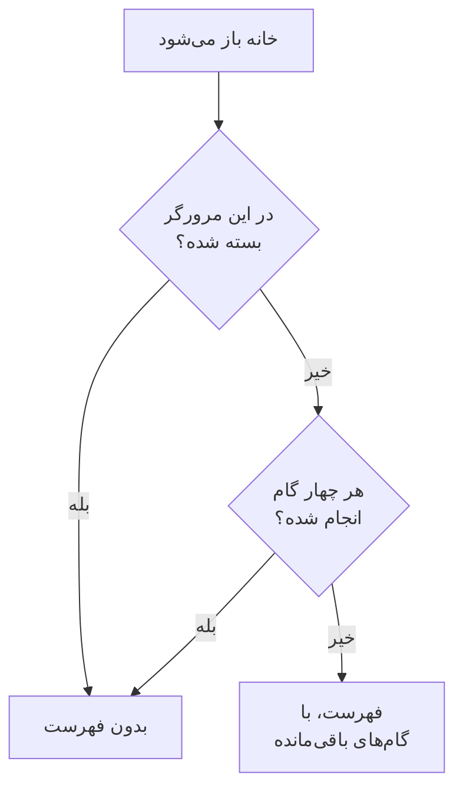

# صفحه اصلی و میان‌برها

خانه نخستین صفحه‌ای است که در یک پروژه می‌بینید. با یک نگاه به شما می‌گوید آیا همین حالا چیزی به شما نیاز دارد، و پروژه تازه را در نخستین راه‌اندازی‌اش همراهی می‌کند. این صفحه توضیح می‌دهد خانه چه چیزهایی نشان می‌دهد، چگونه هر محصول، صفحه یا اقدامی را در داشبورد پیدا کنید، و میان‌برهای صفحه‌کلیدی که شما را از رفت‌وآمد در منوها بی‌نیاز می‌کنند.

:::cards
- [آنچه خانه نشان می‌دهد](#آنچه-خانه-نشان-میدهد): فهرست خوشامد، پنج کاشی و حوادث فعال.
- [پیدا کردن راه](#پیدا-کردن-راه): منوی محصولات و نوارهای بالای هر صفحه.
- [جستجو](#جستجوی-یک-صفحه-یک-تنظیم-یا-یک-اقدام): هر صفحه، تنظیم یا اقدامی را با تایپ نامش پیدا کنید.
- [میان‌برهای صفحه‌کلید](#میانبرهای-صفحهکلید): با دو کلید به خانه، مانیتورها یا حوادث بروید.
:::

## آنچه خانه نشان می‌دهد

**خانه** را در نوار بالا باز کنید، یا از هر جایی `g` و سپس `h` را فشار دهید. خانه از بالا به پایین این‌ها را نشان می‌دهد:

1. **به OneUptime خوش آمدید 👋**، فهرستی برای پروژه تازه، تا وقتی کامل شود.
2. پنج کاشی که آنچه نیاز به توجه دارد را می‌شمارند.
3. **حوادث فعال**، همه حوادثی که هنوز رفع نشده‌اند.

### فهرست خوشامد

این فهرست شما را از چهار کاری می‌گذراند که یک پروژه پیش از مفید شدن به آن‌ها نیاز دارد. هر گام صفحه‌ای را باز می‌کند که آن کار را در آن انجام می‌دهید، و وقتی پروژه آنچه را می‌خواهد داشته باشد، خودش تیک می‌خورد.

| گام | چه زمانی انجام شده | چه چیزی باز می‌کند |
| --- | --- | --- |
| **اولین مانیتور خود را بسازید** | پروژه یک مانیتور دارد. | فرم **ساخت مانیتور**، یا برای کسی که نمی‌تواند مانیتور بسازد، فهرست **مانیتورها**. |
| **یک صفحهٔ وضعیت منتشر کنید** | پروژه یک صفحه وضعیت دارد. | **صفحات وضعیت** |
| **تیم خود را دعوت کنید** | کسی به‌جز شما در پروژه هست، یا به آن دعوت شده است. | **کاربران** |
| **یک سیاست آنکال تنظیم کنید** | پروژه یک سیاست آنکال دارد. | **کشیک آنکال** |

زیر گام‌ها، **OneUptime چگونه کار می‌کند** چهار محصول اصلی را به ترتیبی نشان می‌دهد که یک مشکل از آن‌ها عبور می‌کند: **مانیتورها**، **حوادث و هشدارها**، **کشیک آنکال** و **صفحات وضعیت**. روی هر کدام کلیک کنید تا باز شود.

فهرست وقتی هر چهار گام انجام شود کنار می‌رود. برای پنهان کردن زودترش، روی **بستن** کلیک کنید. بستن در همین مرورگر و برای همین پروژه به خاطر سپرده می‌شود؛ هر چیزی که گام‌ها باز می‌کنند همچنان در منوی **محصولات** هست.

### کاشی‌ها

هر کاشی چیزی را می‌شمارد، می‌گوید آیا به شما نیاز دارد، و فهرست پشت آن عدد را باز می‌کند.

| کاشی | چه چیزی می‌شمارد | وقتی شمار صفر است |
| --- | --- | --- |
| **حوادث فعال** | حوادثی که رفع نشده‌اند | **همه چیز مرتب است** |
| **هشدارهای فعال** | هشدارهایی که رفع نشده‌اند | **همه چیز مرتب است** |
| **مانیتورهای خارج از سرویس** | مانیتورهایی که وضعیتشان از وضعیت‌های عملیاتی نیست. مانیتورهای بایگانی‌شده شمرده نمی‌شوند. | **همه عملیاتی** |
| **تعمیر و نگهداری در حال انجام** | رویدادهای تعمیر و نگهداری زمان‌بندی‌شده که در جریان‌اند | **موردی در حال انجام نیست** |
| **SLOهای در معرض خطر** | SLOهای روشنی که در معرض خطرند یا بودجه خطایشان را مصرف کرده‌اند | **بودجه‌ها سالم هستند** |

شمار بیشتر از صفر **نیاز به توجه** را نشان می‌دهد، و روی کاشی‌های تعمیر و نگهداری و SLO به ترتیب **در حال انجام** و **بودجه در حال مصرف**. پروژه‌ای که هنوز مانیتوری ندارد روی کاشی مانیتورها **هنوز مانیتوری وجود ندارد** را می‌بیند، و پروژه‌ای که SLO ندارد **هنوز SLOای وجود ندارد** را: یک پروژه خالی با یک پروژه سالم یکی نیست. در این حالت آن دو کاشی فهرست‌های **مانیتورها** و **SLOs** را باز می‌کنند تا نخستین را بسازید.

### منوی کناری خانه

منوی کناری کنار خانه همان فهرست‌ها را دارد، هر کدام با شمارش:

| بخش | صفحه‌ها |
| --- | --- |
| **حوادث** | **حوادث فعال** و **اپیزودهای فعال** |
| **هشدارها** | **هشدارهای فعال** و **اپیزودهای فعال** |
| **مانیتورها** | **خارج از سرویس** |
| **رویدادهای زمان‌بندی‌شده** | **در جریان** |

یک اپیزود حوادث یا هشدارهای مرتبط را گروه‌بندی می‌کند تا روی آن‌ها به‌صورت یکجا کار کنید. [مفاهیم اصلی](/docs/introduction/core-concepts#حوادث-و-هشدارها) را ببینید.

## پیدا کردن راه

همه چیز در OneUptime زیر **محصولات** در نوار بالا است. منو گروه‌هایش را به‌صورت ردیف‌های یک فهرست نشان می‌دهد، و همیشه با نخستین آن‌ها، یعنی ملزومات، به‌صورت باز گشوده می‌شود: مانیتورها، حوادث، هشدارها، کشیک آنکال، صفحات وضعیت، تعمیر و نگهداری زمان‌بندی‌شده و SLOها. هر گروه دیگر (مشاهده‌پذیری، هوش مصنوعی، کد، منابع، زیرساخت، داشبوردها و خودکارسازی و تنظیمات) در یک ردیف از همان فهرست جمع شده است. هر ردیف نام محصولات آن گروه را می‌آورد و می‌گوید چند تا هستند. روی یک ردیف کلیک کنید تا باز یا جمع شود، یا با کلیدهای جهت‌نما به آن بروید و **Enter** را فشار دهید.

- **جستجو همه چیز را پیدا می‌کند.** در کادر جستجوی منو تایپ کنید تا هر محصولی را با نامش، با کاری که انجام می‌دهد، یا با واژه‌ای آشنا مانند `k8s` یا `RUM` پیدا کنید. جستجو درون گروه‌های جمع‌شده را هم می‌گردد.
- **از همان جایی که هستید شروع می‌کنید.** گروه صفحه‌ای که در آن هستید خودش باز می‌شود، و محصولاتی که اخیراً باز کرده‌اید در بالا فهرست می‌شوند.
- **انتخاب‌هایتان می‌مانند.** منو در مرورگر شما به خاطر می‌سپارد کدام‌یک از گروه‌های دیگر را باز یا جمع کرده‌اید. ملزومات هر بار که منو را باز می‌کنید دوباره باز است، حتی اگر جمعش کرده باشید.
- **روی گوشی**، دکمه منو محصولات را به همان شکل فهرست می‌کند: ملزومات در بالا باز است، و هر گروه دیگر یک ردیف است که با یک لمس باز می‌شود.

### نوارهای بالا

دو نوار در بالای هر صفحه کشیده شده‌اند.

| کجا | چه چیزی آنجاست |
| --- | --- |
| بالا سمت چپ | انتخاب‌گر پروژه: به پروژه دیگری از پروژه‌هایتان بروید، یا پروژه تازه‌ای بسازید. |
| بالا سمت راست | **جستجو** و **Ask AI**، زنگ اعلان با آنچه همین حالا به شما نیاز دارد (حوادث و هشدارهای فعال، سیاست‌های آنکالی که در آن‌ها کشیک هستید، دعوت‌های در انتظار)، **راهنما**، و تصویر شما که منوی [حساب](/docs/introduction/your-account) شما را باز می‌کند. |
| زیر آن‌ها | **خانه** و **محصولات** در سمت چپ، **تنظیمات کاربر** در سمت راست: اینکه OneUptime در این پروژه چگونه به شما می‌رسد. |

**راهنما** این مستندات (**مستندات**) و فهرست **Keyboard shortcuts** را باز می‌کند، و پشتیبانی از طریق ایمیل و Slack را پیشنهاد می‌دهد. روی صفحه‌ای باریک، مانند گوشی، **جستجو**، **Ask AI** و **راهنما** برای صرفه‌جویی در جا کنار گذاشته می‌شوند؛ زنگ و تصویر شما می‌مانند.

## جستجوی یک صفحه، یک تنظیم یا یک اقدام

**Cmd+K** (Mac) یا **Ctrl+K** (Windows و Linux) را فشار دهید، یا روی نماد جستجو در نوار بالا کلیک کنید، و شروع به تایپ کنید. جستجو این‌ها را پیدا می‌کند:

- **هر صفحه در منوها**، با نامی که منو به آن داده است: کلیدهای API، منطقه خطر، زمان‌بندی‌های آنکال، شدت حادثه، روش‌های اعلان خودتان. هر نتیجه می‌گوید کجا قرار دارد، مانند *تنظیمات پروژه › پیشرفته*، تا صفحه‌هایی که نام یکسانی دارند (فیلدهای سفارشی در حوادث، هشدارها و مانیتورها) به‌آسانی از هم تشخیص داده شوند.
- **اقدام‌ها**، بر اساس کاری که می‌خواهید انجام دهید: اعلام حادثه، ساخت مانیتور، یا Delete Project که منطقه خطر را باز می‌کند. اقدامی که چیزی را تغییر می‌دهد فقط به کسانی پیشنهاد می‌شود که اجازه انجامش را دارند.
- **مانیتورها، حوادث، هشدارها، صفحات وضعیت و سیاست‌های آنکال شما**، با نامشان.

جستجو آنچه تایپ می‌کنید را همان‌طور که منظورتان است می‌خواند:

- بزرگی و کوچکی حروف، اعراب، فاصله‌ها و خط‌تیره‌ها اهمیتی ندارند: *on-call*، *on call* و *oncall* همان صفحه‌ها را پیدا می‌کنند، و واژه‌ها می‌توانند به هر ترتیبی بیایند.
- برای بسیاری از صفحه‌ها واژه‌های دیگری هم می‌شناسد، به انگلیسی: *pager* یا *escalation* برای سیاست‌های آنکال، *rota* برای زمان‌بندی‌های آنکال، *2fa* برای احراز هویت دومرحله‌ای، *delete project* برای منطقه خطر.
- نام محصول را اضافه کنید تا جستجو محدودتر شود: *incident custom fields* صفحه فیلدهای سفارشی حوادث را پیدا می‌کند.
- یک غلط تایپی کوچک، مانند *incidnet*، وقتی هیچ چیز دقیقاً مطابق تایپ شما نباشد، باز هم آنچه منظورتان بود را پیدا می‌کند.

وقتی کادر جستجو خالی است، جستجو صفحه‌هایی که اخیراً باز کرده‌اید، اقدام‌ها و محصولات را فهرست می‌کند.

## میان‌برهای صفحه‌کلید

هر جای داشبورد `?` را فشار دهید تا همه میان‌برها را ببینید، یا **راهنما** را باز کنید و **Keyboard shortcuts** را انتخاب کنید. در Mac، `Mod` کلید Command است؛ در Windows و Linux، کلید Ctrl است.

| کلیدها | چه می‌کند |
| --- | --- |
| `Mod` + `K` | پالت فرمان را باز کنید: هر صفحه، تنظیم یا اقدامی را جستجو کنید. |
| `Mod` + `I` | درباره آنچه می‌بینید از هوش مصنوعی بپرسید. |
| `/` | در فهرست همین صفحه جستجو کنید. |
| `?` | میان‌برهای صفحه‌کلید را نشان دهید. |
| `Esc` | یک پنجره گفتگو یا پنل را ببندید. |

### رفتن به یک محصول

`g` و سپس یک حرف را فشار دهید تا مستقیم به یک محصول بروید. حرف را ظرف ۱٫۵ ثانیه پس از `g` فشار دهید.

| کلیدها | به کجا می‌رود |
| --- | --- |
| `g` سپس `h` | خانه |
| `g` سپس `m` | مانیتورها |
| `g` سپس `i` | حوادث |
| `g` سپس `a` | هشدارها |
| `g` سپس `o` | کشیک آنکال |
| `g` سپس `s` | صفحات وضعیت |
| `g` سپس `e` | تعمیر و نگهداری زمان‌بندی‌شده |
| `g` سپس `d` | داشبوردها |
| `g` سپس `l` | لاگ‌ها |
| `g` سپس `t` | ترِیس‌ها |

میان‌برها مزاحم کار شما نمی‌شوند. وقتی در یک فیلد تایپ می‌کنید، `?`، `/` و `g` کاری نمی‌کنند، و وقتی پنجره گفتگویی باز است هیچ چیز شما را از صفحه دور نمی‌کند، پس یک کلید اشتباه نمی‌تواند فرمی نیمه‌پر را از بین ببرد. هر محصول دیگری با `Mod` + `K` تنها یک جستجو فاصله دارد.

## گام‌های بعدی

:::cards
- [شروع سریع](/docs/introduction/quickstart): فهرست خوشامد را گام به گام انجام دهید.
- [حساب کاربری شما](/docs/introduction/your-account): پروفایل، امنیت ورود، زبان و پوسته.
- [پرسش از هوش مصنوعی](/docs/ai/ask-ai): Ask AI به چه پرسش‌هایی پاسخ می‌دهد و چه کارهایی برایتان انجام می‌دهد.
- [مفاهیم اصلی](/docs/introduction/core-concepts): مانیتورها، حوادث، هشدارها و آنکال چه هستند.
:::
