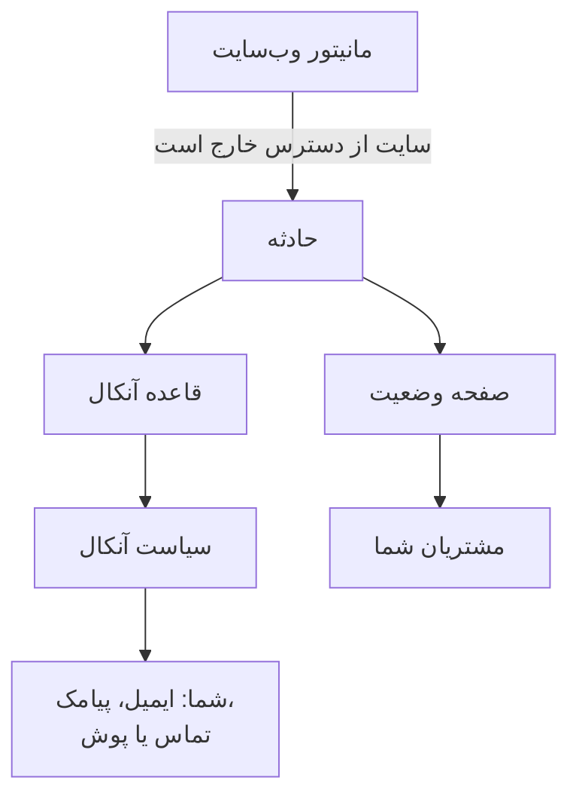

# شروع سریع

این راهنما شما را در حدود پانزده دقیقه از یک حساب تازه به یک راه‌اندازی کارا می‌رساند: مانیتوری که هر پنج دقیقه وب‌سایت شما را بررسی می‌کند، سیاست آنکالی که وقتی سایت از دسترس خارج شد شما را خبر می‌کند، و صفحه وضعیتی که به مشتریانتان اطلاع می‌دهد. این راهنما فهرست **به OneUptime خوش آمدید 👋** را در صفحه خانه پروژه شما دنبال می‌کند.

## پیش از شروع

- **یک حساب.** در OneUptime Cloud، در [oneuptime.com](https://oneuptime.com/accounts/register) ثبت‌نام کنید و پیوند ایمیلی را که برایتان می‌فرستد باز کنید. در نصب خودتان، آن را در مرورگر باز کنید و ثبت‌نام کنید: نخستین حساب مدیر ارشد می‌شود. برای نصب، [Docker Compose](/docs/installation/docker-compose) را ببینید.
- **یک وب‌سایت برای پایش.** هر نشانی‌ای که روی HTTP یا HTTPS پاسخ دهد، مانند صفحه اصلی شرکت شما.

## یک پروژه بسازید

همه چیز در OneUptime درون یک پروژه است: مانیتورها، حوادث، سیاست‌های آنکال، صفحات وضعیت و افرادی که روی آن‌ها کار می‌کنند.

:::steps
### یک پروژه تازه شروع کنید

نخستین بار که وارد می‌شوید، OneUptime پیام **هیچ پروژه‌ای نیست** را نشان می‌دهد. روی **ساخت پروژه جدید** کلیک کنید. اگر کسی پیش‌تر شما را به پروژه‌ای دعوت کرده، به‌جای آن دعوت را در همان صفحه بپذیرید.

### نامی برایش بگذارید

یک **نام پروژه** وارد کنید، مانند نام شرکتتان. در OneUptime Cloud، گام بعدی از شما می‌خواهد یک طرح انتخاب کنید.

### آن را بسازید

روی **ساخت پروژه** کلیک کنید. صفحه خانه پروژه شما باز می‌شود و فهرست **به OneUptime خوش آمدید 👋** در بالای آن است.
:::

## وب‌سایت خود را پایش کنید

:::steps
### ساخت مانیتور را باز کنید

در فهرست، روی **اولین مانیتور خود را بسازید** کلیک کنید. همچنین می‌توانید **مانیتورها** را از منوی **محصولات** باز کنید و روی **ساخت مانیتور** کلیک کنید.

### وب‌سایت را انتخاب کنید

زیر **نوع مانیتور**، **وب‌سایت** را انتخاب کنید. یک **نام** وارد کنید، مانند `Website`، و روی **بعدی** کلیک کنید.

### نشانی را وارد کنید

نشانی کامل سایت خود را در **نشانی وب‌سایت** وارد کنید، مانند `https://example.com`. OneUptime معیارها را برایتان اضافه می‌کند: وقتی سایت پاسخ ندهد یا با خطا پاسخ دهد، مانیتور **آفلاین** می‌شود و یک حادثه اعلام می‌کند. روی **بعدی** کلیک کنید.

### مانیتور را بسازید

**پراب‌ها** را همان‌طور که انتخاب شده‌اند و **بازه پایش** را روی **هر ۵ دقیقه** نگه دارید و روی **ساخت مانیتور** کلیک کنید. صفحه مانیتور باز می‌شود و پراب‌ها بررسی سایت شما را آغاز می‌کنند.
:::

برای آزمودن بررسی پیش از ذخیره، در گام دوم روی **آزمایش مانیتور** کلیک کنید. همه انواع دیگر مانیتور در [ساخت مانیتور](/docs/monitor/create-monitor) توضیح داده شده‌اند.

## وقتی از دسترس خارج شد خبر شوید

در حال حاضر، حادثه‌ای که مالکی ندارد برای مالکان پروژه ایمیل می‌شود، و شما هم جزو آن‌ها هستید. برای اینکه تا وقتی کسی پاسخ دهد خبر شوید، یک سیاست آنکال بسازید و کاری کنید که هر حادثه آن را خبر کند.

:::steps
### یک سیاست آنکال بسازید

در فهرست، روی **یک سیاست آنکال تنظیم کنید** کلیک کنید، یا **کشیک آنکال** را از منوی **محصولات** باز کنید. روی **ساخت سیاست آنکال** کلیک کنید و یک **نام** وارد کنید. زیر **اول به چه کسی خبر داده شود؟** روی **افزودن پاسخ‌دهنده** کلیک کنید و خودتان را انتخاب کنید. روی **ساخت سیاست آنکال** کلیک کنید.

### برای هر حادثه آن را خبر کنید

**حوادث** را از منوی **محصولات** باز کنید، **قواعد** را در منوی کناری باز کنید و **قواعد آنکال** را انتخاب کنید. روی **ساخت Incident On-Call Rule** کلیک کنید، یک **نام** وارد کنید و روی **بعدی** کلیک کنید. **معیار تطبیق** را خالی بگذارید تا قاعده با هر حادثه‌ای جور شود، و روی **بعدی** کلیک کنید. سیاست خود را زیر **سیاست‌های کشیک آنکال** انتخاب کنید و روی **ساخت Incident On-Call Rule** کلیک کنید.

### انتخاب کنید چگونه به شما برسند

ایمیل ورود شما از قبل راهی برای رسیدن به شماست. برای اینکه پیامک یا تماس هم دریافت کنید، **تنظیمات کاربر** را در نوار زیر نوار بالا باز کنید، به **روش‌های اعلان** بروید و در زبانه **Direct Contact**، شماره خود را زیر **شماره‌های تلفن برای اعلان‌های پیامکی** یا **شماره‌های تلفن برای اعلان‌های تماسی** اضافه کنید. روی **تأیید** کلیک کنید و کدی را که OneUptime برایتان می‌فرستد وارد کنید. شماره تأییدشده بی‌درنگ برای خبر کردن‌های آنکال به کار می‌رود.
:::

> [!NOTE]
> پیامک و تماس تلفنی در پروژه تازه خاموش هستند. مالک پروژه، یک Billing Admin یا کسی با دسترسی Manage Billing آن‌ها را در کارت **کانال‌های اعلان** زیر **تنظیمات پروژه → اعلان‌ها → تنظیمات اعلان** روشن می‌کند.

برای سطح‌های بیشتر، چرخش‌ها و اینکه هر سطح چه مدت منتظر می‌ماند، [قواعد تشدید](/docs/on-call/escalation-rules) و [زمان‌بندی‌های آنکال](/docs/on-call/schedules) را ببینید.

## یک صفحه وضعیت منتشر کنید

:::steps
### صفحه وضعیت را بسازید

در فهرست، روی **یک صفحهٔ وضعیت منتشر کنید** کلیک کنید، یا **صفحات وضعیت** را از منوی **محصولات** باز کنید. روی **ساخت صفحه وضعیت** کلیک کنید، یک **نام** وارد کنید، مانند `Acme Status`، و روی **ساخت صفحه وضعیت** کلیک کنید.

### مانیتور خود را اضافه کنید

صفحه وضعیت تازه را باز کنید. در منوی کناری آن، زیر **منابع**، **مانیتورها** را انتخاب کنید؛ در پروژه‌هایی که گروه‌های مانیتور در آن‌ها روشن است، نام این گزینه **منابع** است. روی **افزودن مانیتور** کلیک کنید، مانیتور وب‌سایت خود را انتخاب کنید و روی **افزودن مانیتور** کلیک کنید. این ردیف نام مانیتور را به بازدیدکنندگان نشان می‌دهد؛ اگر خواستید آن را زیر **نام نمایشی** تغییر دهید.

### صفحه را باز کنید

در منوی کناری **نمای کلی** را انتخاب کنید. کارت **Status Page Preview URL** به صفحه وضعیت شما پیوند دارد: آن را باز کنید، و وب‌سایت شما عملیاتی نشان داده می‌شود.
:::

صفحه وضعیت تازه عمومی است: هر کسی که نشانی آن را داشته باشد می‌تواند بازش کند. برای دادن دامنه، لوگو و رنگ‌های خودتان به آن، [برندینگ و دامنه‌های صفحه وضعیت](/docs/status-pages/branding-and-domains) را ببینید.

## تیم خود را دعوت کنید

در فهرست، روی **تیم خود را دعوت کنید** کلیک کنید، یا **کاربران** را از منوی **محصولات**، زیر **تنظیمات**، باز کنید. روی **دعوت کاربر** کلیک کنید، **ایمیل** آن‌ها را وارد کنید و یک **تیم** انتخاب کنید: در ابتدا تیم اعضا انتخاب شده است. روی **دعوت** کلیک کنید. OneUptime دعوت را برای آن‌ها ایمیل می‌کند، و تیم تعیین می‌کند چه کاری می‌توانند انجام دهند. [کاربران، تیم‌ها و دسترسی‌ها](/docs/permissions/index) را ببینید.

## امتحانش کنید

یک حادثه آزمایشی اعلام کنید تا کار کل زنجیره را ببینید.

:::steps
### یک حادثه آزمایشی اعلام کنید

**حوادث** را باز کنید و روی **اعلام حادثه** کلیک کنید. یک **عنوان** وارد کنید، مانند `Test incident`، یک **شدت حادثه** انتخاب کنید و روی **بعدی** کلیک کنید. زیر **مانیتورها**، مانیتور وب‌سایت خود را انتخاب کنید تا حادثه در صفحه وضعیت شما نمایش داده شود. تا رسیدن به خلاصه روی **بعدی** کلیک کنید، سپس روی **اعلام حادثه** کلیک کنید.

### اتفاق افتادنش را ببینید

ظرف یکی دو دقیقه، سیاست آنکال شما را خبر می‌کند و حادثه در صفحه وضعیت شما نمایش داده می‌شود.

### آن را رفع کنید

در صفحه حادثه، روی **رفع** کلیک کنید. خبر کردن متوقف می‌شود و حادثه از صفحه وضعیت شما برداشته می‌شود.
:::

> [!WARNING]
> هر کسی که صفحه وضعیت شما را باز کند، تا وقتی آن را رفع کنید حادثه آزمایشی را می‌بیند. آزمایش را پیش از اشتراک‌گذاری نشانی صفحه انجام دهید.

## رفع اشکال

:::details خبر نشدم
حادثه را باز کنید و در منوی کناری آن **اجراهای آنکال** را انتخاب کنید: نشان می‌دهد سیاست شما اجرا شد یا نه، و چه کسی را خبر کرد. اگر اجرا نشد، بررسی کنید قاعده آنکال شما فعال باشد و همان سیاست را نام ببرد. اگر اجرا شد، بررسی کنید روش‌های شما زیر **تنظیمات کاربر → روش‌های اعلان** تأیید شده باشند.
:::

:::details حادثه در صفحه وضعیت من نیست
صفحه وضعیت حادثه‌ای را نشان می‌دهد که یکی از مانیتورهای آن حادثه روی صفحه باشد. بررسی کنید که حادثه، مانیتور شما را در منابع تحت‌تأثیرش فهرست کرده باشد، و آن مانیتور روی صفحه وضعیت باشد.
:::

:::details مانیتور می‌گوید آفلاین است، اما سایت من کار می‌کند
مانیتور را باز کنید و ببینید پراب‌ها چه دریافت کرده‌اند. بخش رفع اشکال [مانیتور وب‌سایت](/docs/monitor/website-monitor) را ببینید.
:::

## گام‌های بعدی

:::cards
- [مفاهیم اصلی](/docs/introduction/core-concepts): ایده‌های پشت آنچه همین حالا راه انداختید.
- [زمان‌بندی‌های آنکال](/docs/on-call/schedules): آنکال بودن را با تیمتان تقسیم کنید.
- [برندینگ و دامنه‌های صفحه وضعیت](/docs/status-pages/branding-and-domains): صفحه وضعیت را از آن خودتان کنید.
- [OpenTelemetry](/docs/telemetry/open-telemetry): لاگ‌ها، متریک‌ها و ترِیس‌ها را از برنامه‌هایتان بفرستید.
:::
