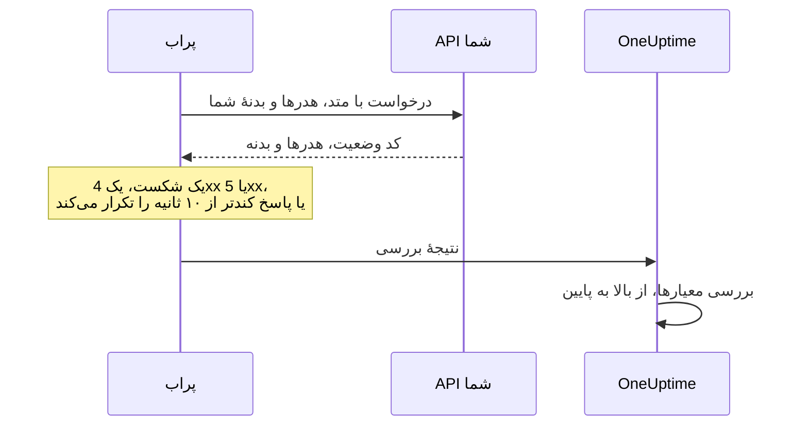

# مانیتور API

مانیتور API طبق یک زمان‌بندی، یک endpoint از نوع HTTP را با متد، هدرها و بدنه‌ای که انتخاب می‌کنید فراخوانی می‌کند و آنچه برمی‌گردد را بررسی می‌کند: کد وضعیت، زمان پاسخ، هدرها و بدنه. از آن برای endpointهای REST، JSON و GraphQL، بررسی‌های سلامت و هر فراخوانی که کاربرانتان به آن وابسته‌اند استفاده کنید.

:::cards
- [ساخت مانیتور](#ساخت-یک-مانیتور-api): شش گام در داشبورد.
- [گزینه‌های پیکربندی](#گزینههای-پیکربندی): متد، هدرها، بدنه، تغییر مسیرها، گواهی‌ها، وقفه‌ها و تلاش‌های مجدد.
- [معیارهای پایش](#معیارهای-پایش): از همان ابتدا چه چیزی بالا یا پایین به حساب می‌آید.
- [رفع اشکال](#رفع-اشکال): وقتی بررسی‌ای که باید موفق شود شکست می‌خورد.
:::

## چگونه کار می‌کند

در هر بررسی، پراب درخواست را می‌فرستد، هر تغییر مسیری را دنبال می‌کند و کد وضعیت، زمان پاسخ، هدرها و بدنه را ثبت می‌کند. درخواستی که شکست بخورد، به وقفه بخورد، با وضعیت `4xx` یا `5xx` پاسخ بگیرد یا بیش از ۱۰ ثانیه طول بکشد، تا تعداد تلاش‌های مجددی که اجازه می‌دهید دوباره امتحان می‌شود. سپس OneUptime نتیجه را از معیارهای مانیتور عبور می‌دهد.



پرابی که اتصال شبکهٔ خودش را از دست داده هیچ نتیجه‌ای گزارش نمی‌کند، پس نمی‌تواند API شما را آفلاین علامت بزند.

## پیش از شروع

- **نقشی که بتواند مانیتور بسازد**: Project Owner، Project Admin، Project Member، Monitor Admin یا Monitor Member، یا یک نقش سفارشی با مجوز Create Monitor.
- **پرابی که به API برسد.** پراب‌های پیش‌فرض پروژهٔ شما برای هر مانیتور تازه انتخاب می‌شوند. اگر دیوارهٔ آتشی جلوی API است، به [آدرس‌های IP پراب‌های OneUptime Cloud](/docs/configuration/ip-addresses) اجازه دهید. API در یک شبکهٔ خصوصی به یک [پراب سفارشی](/docs/probe/custom-probe) داخل همان شبکه نیاز دارد که اجازهٔ رسیدن به آدرس‌های خصوصی را داشته باشد: [دسترسی به شبکه خصوصی](/docs/self-hosted/private-network-access) را ببینید.
- **اعتبارنامه‌ها به‌صورت اسرار مانیتور.** اگر API به یک کلید یا توکن نیاز دارد، آن را اول به‌صورت یک [راز مانیتور](/docs/monitor/monitor-secrets) ذخیره کنید تا مانیتور فقط ارجاعی به آن نگه دارد.

## ساخت یک مانیتور API

:::steps
### شروع یک مانیتور تازه

به **مانیتورها** بروید و روی **ساخت مانیتور** کلیک کنید. در **نوع مانیتور**، **API** را انتخاب کنید.

### نام‌گذاری

یک **نام** وارد کنید، مثل `Orders API`، و روی **بعدی** کلیک کنید.

### وارد کردن درخواست

در **نشانی API**، نشانی کامل endpoint را وارد کنید، مثل `https://api.example.com/health`. **نوع درخواست API** را انتخاب کنید (اگر تغییرش ندهید، **GET**). برای افزودن هدرها یا بدنه، **فیلدهای بیشتر** را باز کنید و **هدرهای درخواست** و **بدنه درخواست (به‌صورت JSON)** را پر کنید.

### آزمایش

روی **آزمایش مانیتور** کلیک کنید، در **انتخاب پراب** یک پراب انتخاب کنید و روی **اجرای آزمایش** کلیک کنید. **نتیجه آزمایش مانیتور** نشان می‌دهد API چه پاسخی داد.

### بازبینی معیارها

**معیارهای مانیتور** با [معیارهای پیش‌فرض](#معیارهای-پیشفرض) شروع می‌شود: آفلاین وقتی API پاسخ نمی‌دهد یا با خطا پاسخ می‌دهد، آنلاین با هر وضعیت `2xx` یا `3xx`. برای اینکه آنچه API برمی‌گرداند هم بررسی شود، یک فیلتر اضافه کنید و روی **بعدی** کلیک کنید.

### انتخاب پراب‌ها و ساخت

**پراب‌ها** و **بازه پایش** (که از **هر ۵ دقیقه** شروع می‌شود) را نگه دارید یا تغییر دهید و روی **ساخت مانیتور** کلیک کنید. صفحهٔ مانیتور باز می‌شود.
:::

## گزینه‌های پیکربندی

### نشانی API

endpointی که فراخوانی می‌شود، به‌صورت یک نشانی کامل همراه با طرح آن، مثل `https://api.example.com/v1/health`. می‌توانید یک [راز مانیتور](/docs/monitor/monitor-secrets) را به‌صورت `{{monitorSecrets.NAME}}` در نشانی بگذارید.

### جای‌نگهدارهای پویای نشانی

وقتی یک CDN یا یک پراکسی کش جلوی API است، ممکن است پراب به‌جای سرور شما از کش پاسخ بگیرد. برای عبور از کش، یک جای‌نگهدار به نشانی اضافه کنید؛ پراب در هر بررسی آن را با مقداری تازه جایگزین می‌کند.

| جای‌نگهدار | جایگزین می‌شود با | مقدار نمونه |
| --- | --- | --- |
| `{{timestamp}}` | زمان کنونی Unix، به ثانیه | `1719500000` |
| `{{random}}` | یک رشتهٔ تصادفی و یکتا از ۳۲ نویسهٔ هگزادسیمال | `3f2b8c1d9e7a4b6c8d0e1f2a3b4c5d6e` |

نشانی‌ای با یک جای‌نگهدار:

```text
https://api.example.com/health?cb={{timestamp}}
```

آنچه پراب در دو بررسی با پنج دقیقه فاصله درخواست می‌کند:

```text
https://api.example.com/health?cb=1719500000
https://api.example.com/health?cb=1719500300
```

از `{{random}}` هم به همین شکل استفاده کنید: `https://api.example.com/health?nocache={{random}}`.

### نوع درخواست API

متد HTTP که فرستاده می‌شود. **GET** پیش‌فرض است؛ بقیه **POST**، **PUT**، **PATCH**، **DELETE** و **HEAD** هستند. اگر یک درخواست **HEAD** با وضعیت `4xx` یا `5xx` پاسخ بگیرد، پراب آن را به‌صورت `GET` تکرار می‌کند.

### فیلدهای بیشتر

این تنظیمات زیر **فیلدهای بیشتر** جمع شده‌اند. سرتیتر جمع‌شده آن‌ها را فهرست می‌کند و نشان می‌دهد کدام‌ها را تغییر داده‌اید.

| فیلد | پیش‌فرض | چه کاری انجام می‌دهد |
| --- | --- | --- |
| **هدرهای درخواست** | هیچ | هدرهایی که فرستاده می‌شوند، به‌صورت جفت‌های نام و مقدار. برای هر کدام روی **افزودن Request Header** کلیک کنید. |
| **بدنه درخواست (به‌صورت JSON)** | هیچ | یک شیء JSON که به‌عنوان بدنه فرستاده می‌شود، معمولاً همراه **POST**، **PUT** یا **PATCH**. باید JSON معتبر باشد. |
| **تغییر مسیرها را دنبال نکن** | خاموش | به‌جای دنبال کردن تغییر مسیرها، دربارهٔ نخستین پاسخ داوری می‌کند. [پایین‌تر](#تغییر-مسیرها-را-دنبال-نکن) را ببینید. |
| **اجازه گواهی‌های خودامضا** | خاموش | اعتبارسنجی گواهی TLS را برای نام میزبان خود مانیتور نادیده می‌گیرد. |
| **استفاده از گواهی کلاینت (mTLS)** | خاموش | یک گواهی کلاینت و کلید خصوصی ارائه می‌کند. [گواهی کلاینت (mTLS)](#گواهی-کلاینت-mtls) را ببینید. |
| **وقفه درخواست (ثانیه)** | `60` | مدت انتظار برای هر تلاش. بیشینه ۶۰ ثانیه است. |
| **تلاش‌های مجدد در صورت شکست** | پیش‌فرض پراب، معمولاً `3` | چند بار یک تلاش ناموفق تکرار شود. بیشینه ۳ است. [تلاش‌های مجدد و وقفه‌ها](#تلاشهای-مجدد-و-وقفهها) را ببینید. |

هدرهای درخواست و بدنهٔ درخواست می‌توانند از [اسرار مانیتور](/docs/monitor/monitor-secrets) استفاده کنند، برای نمونه یک هدر `Authorization` با مقدار `Bearer {{monitorSecrets.ApiKey}}`.

#### تغییر مسیرها را دنبال نکن

به‌طور پیش‌فرض، پراب تغییر مسیرها (`301`، `302`، `303`، `307` و `308`) را تا ۱۰ بار دنبال می‌کند و دربارهٔ پاسخی که به آن می‌رسد داوری می‌کند. برای اینکه به‌جای آن دربارهٔ خود پاسخ تغییر مسیر داوری شود، **تغییر مسیرها را دنبال نکن** را روشن کنید. [معیارهای پیش‌فرض](#معیارهای-پیشفرض) پاسخ تغییر مسیر را آنلاین به حساب می‌آورند.

وقتی یک تغییر مسیر را دنبال می‌کند:

- یک `303`، یا یک `301` یا `302` در پاسخ به یک `POST`، مثل مرورگرها درخواست را به یک `GET` بدون بدنه تبدیل می‌کند.
- هدرهای درخواست شما فقط به مبدأ خود نشانی (همان طرح، میزبان و پورت) می‌روند. تغییر مسیر به مبدأی دیگر بدون آن‌ها فرستاده می‌شود.
- اگر درخواست هنوز بدنه داشته باشد، یا متدی غیر از `GET` یا `HEAD` داشته باشد، تغییر مسیر به مبدأی دیگر بررسی را ناموفق می‌کند.
- **اجازه گواهی‌های خودامضا** تغییر مسیرهایی را دنبال می‌کند که روی نام میزبان خود مانیتور می‌مانند. تغییر مسیر به نام میزبانی دیگر طبق معمول اعتبارسنجی می‌شود.

#### گواهی کلاینت (mTLS)

اگر API به TLS دوطرفه نیاز دارد، **استفاده از گواهی کلاینت (mTLS)** را روشن کنید و این‌ها را پر کنید:

| فیلد | چه وارد کنید |
| --- | --- |
| **گواهی کلاینت (PEM)** | گواهی کلاینت با کدگذاری PEM که ارائه می‌شود. |
| **کلید خصوصی کلاینت (PEM)** | کلید خصوصی متناظر با کدگذاری PEM. |
| **عبارت عبور کلید خصوصی کلاینت** | اختیاری. عبارت عبور، فقط اگر کلید خصوصی رمزگذاری شده باشد. |

این معادل پرچم‌های `--cert` و `--key` در curl است:

```bash
curl --cert client.crt --key client.key https://api.example.com/health
```

برای اینکه کلید در تنظیمات مانیتور نماند، گواهی و کلید را به‌صورت [اسرار مانیتور](/docs/monitor/monitor-secrets) ذخیره کنید و در این فیلدها `{{monitorSecrets.NAME}}` را وارد کنید. اسرار روی سرور پر می‌شوند و مقدارشان هرگز در داشبورد دیده نمی‌شود.

گواهی کلاینت فقط تا وقتی ارائه می‌شود که درخواست روی مبدأ نشانی بماند. پس از تغییر مسیر به مبدأی دیگر، پراب بدون آن ادامه می‌دهد.

#### تلاش‌های مجدد و وقفه‌ها

**تلاش‌های مجدد در صورت شکست** تکرارهای _پس از_ تلاش اول را می‌شمارد، پس `0` بررسی را یک بار و `2` تا سه بار اجرا می‌کند. اگر خالی بماند، پیش‌فرض پراب به کار می‌رود: ۳، مگر اینکه `PROBE_MONITOR_RETRY_LIMIT` پراب چیز دیگری بگوید. پراب بین تلاش‌ها یک ثانیه صبر می‌کند و هر تلاش کل **وقفه درخواست (ثانیه)** را در اختیار دارد.

این شکست‌ها دوباره امتحان می‌شوند: خطاهای اتصال، وقفه‌ها، پاسخ‌های `4xx` و `5xx`، و پاسخ‌های کندتر از ۱۰ ثانیه. این‌ها نه، چون تلاش دوباره تغییرشان نمی‌دهد: نشانی نامعتبر یا مسدود، بیش از ۱۰ تغییر مسیر، و پاسخی بزرگ‌تر از ۵۱۲ KiB.

## معیارهای پایش

معیارها تعیین می‌کنند API چه زمانی آنلاین، کاهش کارایی یا آفلاین به حساب بیاید، و آیا این وضعیت حادثه اعلام کند یا هشدار بسازد. هر معیار یک یا چند فیلتر را بررسی می‌کند:

| فیلتر | شرط‌ها | چه چیزی را بررسی می‌کند |
| --- | --- | --- |
| **Is Online** | **درست**، **نادرست** | اینکه API اصلاً پاسخ داد یا نه، کد وضعیت هر چه باشد. |
| **کد وضعیت پاسخ** | **Equal To**، **Not Equal To**، **Greater Than**، **Less Than**، **Greater Than Or Equal To**، **Less Than Or Equal To** | کد وضعیت HTTP. |
| **زمان پاسخ (به میلی‌ثانیه)** | **Greater Than**، **Less Than**، **Greater Than Or Equal To**، **Less Than Or Equal To** | مدتی که درخواست طول کشید، با احتساب تغییر مسیرها. |
| **بدنه پاسخ** | **شامل است**، **Not Contains** | متنی در بدنهٔ پاسخ. تطبیق به بزرگی و کوچکی حروف حساس است. |
| **Response Header** | **شامل است**، **Not Contains** | اینکه پاسخ هدری با این نام دارد یا نه. نام را با حروف کوچک وارد کنید، مثل `x-request-id`. |
| **Response Header Value** | **شامل است**، **Not Contains** | اینکه یک هدر دقیقاً این مقدار را دارد یا نه، با مقایسه به حروف کوچک، مثل `application/json`. |
| **JavaScript Expression** | **Evaluates To True** | عبارتی روی پاسخ. [عبارت‌های JavaScript](/docs/monitor/javascript-expression) را ببینید. |
| **Is Request Timeout** | **درست**، **نادرست** | اینکه درخواست در همهٔ تلاش‌ها به وقفه خورد یا نه. |

یک پاسخ JSON به شکل فشرده‌اش بررسی می‌شود، بدون فاصله بین کلیدها و مقدارها. برای یافتن `"status": "ok"` با **بدنه پاسخ**، `"status":"ok"` را وارد کنید.

**افزودن معیار** معیاری اضافه می‌کند که از قبل به نام فیلترش نام‌گذاری شده است، برای نمونه _Response Time (in ms) is above 3000_. تا وقتی نامی از خودتان ننویسید، نام همراه با فیلترها تغییر می‌کند. توضیح اختیاری است: برای افزودن آن، **تنظیمات** معیار را باز کنید.

با دو فیلتر یا بیشتر، **شرط تطابق** تعیین می‌کند که **همه** باید مطابقت کنند یا **هر** کدام کافی است. **اقدام‌ها**ی یک معیار تعیین می‌کنند چه کاری انجام دهد: تغییر وضعیت مانیتور، ساخت هشدار، اعلام حادثه، یا هر ترکیبی از این‌ها.

### معیارهای پیش‌فرض

مانیتور API تازه با دو معیار شروع می‌شود، پس بدون هیچ تغییری کار می‌کند:

- **آفلاین** — API پاسخ نمی‌دهد، یا با کد وضعیت `400` یا بالاتر (یا کمتر از `200`) پاسخ می‌دهد. مانیتور **آفلاین** علامت می‌خورد و یک حادثه ساخته می‌شود. وقتی API برگردد، حادثه خودش حل می‌شود.
- **آنلاین** — API با هر کد وضعیت `2xx` یا `3xx` پاسخ می‌دهد، مثل `200`، `201`، `202` یا `204`. مانیتور **عملیاتی** علامت می‌خورد.

در فهرست معیارها، این دو به نام مانیتور نام‌گذاری شده‌اند: _Check if (name) is offline_ و _Check if (name) is online_.

پس endpointی که با `201 Created` یا `204 No Content` پاسخ می‌دهد بالا به حساب می‌آید. اگر برای شما فقط یک کد وضعیت به معنای سالم است، هر دو معیار را در صفحهٔ **پیکربندی → معیارها** مانیتور تغییر دهید: برای نمونه **کد وضعیت پاسخ** / **Equal To** / `200` در معیار آنلاین و **Not Equal To** / `200` در معیار آفلاین، به‌جای دو فیلتر کد وضعیتی که هر کدام دارند. برای اینکه آنچه API برمی‌گرداند هم بررسی شود، یک فیلتر **بدنه پاسخ** یا **JavaScript Expression** به معیار آفلاین اضافه کنید.

معیارها از بالا به پایین بررسی می‌شوند و نخستین معیاری که مطابقت کند تعیین می‌کند چه اتفاقی بیفتد.

وقتی هیچ‌کدام مطابقت نکند، مانیتور به وضعیت پیش‌فرضش برمی‌گردد: **عملیاتی**، مگر اینکه زیر **فیلدهای بیشتر** در پایین معیارها وضعیت دیگری انتخاب کنید. سرتیتر جمع‌شدهٔ **فیلدهای بیشتر** نشان می‌دهد آن وضعیت کدام است.

مانیتورهایی که پیش از تغییر این پیش‌فرض‌ها در OneUptime ساخته شده‌اند معیارهایی را که با آن‌ها ساخته شدند نگه می‌دارند، که فقط `200` را آنلاین به حساب می‌آورند. مانیتورهایی که از راه API یا Terraform ساخته می‌شوند از معیارهایی که می‌فرستید استفاده می‌کنند.

### ارزیابی در یک بازهٔ زمانی

**این معیار را در یک بازه زمانی ارزیابی کن** یک چک‌باکس زیر یک فیلتر است که برای **Is Online**، **کد وضعیت پاسخ** و **زمان پاسخ (به میلی‌ثانیه)** ارائه می‌شود. آن را روشن کنید تا به‌جای آخرین بررسی، دربارهٔ بازه‌ای از بررسی‌های گذشته داوری شود: در **ارزیابی** یک تجمیع و در **در (دقیقه) گذشته** بازه‌ای از ۲ تا ۶۰ دقیقه انتخاب کنید.

| تجمیع | چه زمانی مطابقت می‌کند |
| --- | --- |
| **میانگین**، **جمع**، **Maximum Value**، **Minimum Value** | آن عدد، در طول بازه، شرط را برآورده کند. فقط فیلترهای عددی. |
| **All Values** | همهٔ بررسی‌های بازه شرط را برآورده کنند. |
| **Any Value** | دست‌کم یک بررسی در بازه شرط را برآورده کند. |

**All Values** فقط وقتی مطابقت می‌کند که بازه واقعاً با داده پوشش داده شده باشد. مانیتوری که تازه ساخته شده، یا مانیتوری که ثبت بررسی‌هایش متوقف شده، سابقهٔ کافی برای گفتن چیزی دربارهٔ N دقیقهٔ گذشته ندارد، پس معیار به‌جای مطابقت با تنها خوانشی که دارد منتظر می‌ماند. **Any Value** تنظیم «همان لحظه که یک بررسی از آستانه گذشت خبرم کن» است و همچنان فوراً فعال می‌شود.

**اگر داده‌ای نبود** تعیین می‌کند وقتی بازه نمی‌تواند پشتوانهٔ معیار باشد چه اتفاقی بیفتد:

| گزینه | چه اتفاقی می‌افتد | برای چه |
| --- | --- | --- |
| **Ignore** (پیش‌فرض) | معیار مطابقت نمی‌کند. | هشدارهای معمولی مبتنی بر آستانه. |
| **تریگر** | نبود داده خودش مشکل به حساب می‌آید. | بررسی‌هایی که در آن‌ها سکوت خودش خرابی است. |
| **Treat As Zero** | بازه به‌صورت یک صفر واحد مقایسه می‌شود. | شمارنده‌هایی که در آن‌ها نبود رویداد واقعاً یعنی صفر. |

### نمونهٔ معیارها

| هدف | فیلتر | شرط | مقدار |
| --- | --- | --- | --- |
| وقتی API کند است آن را کاهش کارایی علامت بزنید | **زمان پاسخ (به میلی‌ثانیه)** | **Greater Than** | `1000` |
| وقتی بررسی سلامت مشکلی گزارش می‌کند آفلاین | **بدنه پاسخ** | **Not Contains** | `"status":"ok"` |
| همان، با خواندن از JSON تجزیه‌شده | **JavaScript Expression** | **Evaluates To True** | `"{{responseBody.status}}" !== "ok"` |
| فقط `201` را از یک `POST` بپذیرید | **کد وضعیت پاسخ** | **Equal To** | `201` |

## رفع اشکال

:::details API به درخواست‌های من پاسخ می‌دهد، اما مانیتور آفلاین است
پراب پاسخی متفاوت از شما گرفت. علت ریشه‌ای حادثه، و **گزارش‌های پایش** روی مانیتور، نشان می‌دهند پراب چه دید. بررسی کنید پراب همان چیزی را می‌فرستد که API انتظار دارد: متد، هدر `Authorization`، بدنه. یک دیوارهٔ آتش یا محدودکنندهٔ نرخ جلوی API هم ممکن است پراب‌ها را مسدود کند: به [آدرس‌های IP پراب‌های OneUptime Cloud](/docs/configuration/ip-addresses) اجازه دهید.
:::

:::details مانیتور `{{monitorSecrets.NAME}}` را عیناً می‌فرستد
مانیتور نمی‌تواند از آن راز استفاده کند، یا نام مطابقت ندارد. برای اینکه چه کسی می‌تواند از یک راز استفاده کند، [اسرار مانیتور](/docs/monitor/monitor-secrets) را ببینید.
:::

:::details بررسی با "unsafe cross-origin redirect" شکست می‌خورد
API درخواستی با بدنه، یا با متدی غیر از `GET` یا `HEAD`، را به مبدأی دیگر تغییر مسیر داد و پراب چنین درخواست‌هایی را جلو نمی‌فرستد. مانیتور را به نشانی‌ای ببرید که API به آن تغییر مسیر می‌دهد، یا **تغییر مسیرها را دنبال نکن** را روشن کنید و خود تغییر مسیر را بررسی کنید.
:::

:::details بررسی با "Remote response exceeded the allowed size." شکست می‌خورد
پراب حداکثر ۵۱۲ KiB از یک پاسخ را می‌خواند و این پاسخ بزرگ‌تر است. endpointی را فراخوانی کنید که کمتر برمی‌گرداند، برای نمونه با اندازهٔ صفحهٔ کوچک‌تر.
:::

## گام‌های بعدی

:::cards
- [عبارت‌های JavaScript](/docs/monitor/javascript-expression): فیلدهای عمیق یک پاسخ JSON را بررسی کنید.
- [اسرار مانیتور](/docs/monitor/monitor-secrets): کلیدهای API و توکن‌ها را بیرون از تنظیمات مانیتور نگه دارید.
- [مانیتور وب‌سایت](/docs/monitor/website-monitor): به‌جای یک endpoint، یک صفحهٔ وب را بررسی کنید.
- [قالب‌بندی حادثه و هشدار](/docs/monitor/incident-alert-templating): جزئیات پاسخ را در عنوان حادثه‌ها و هشدارها بگذارید.
:::
