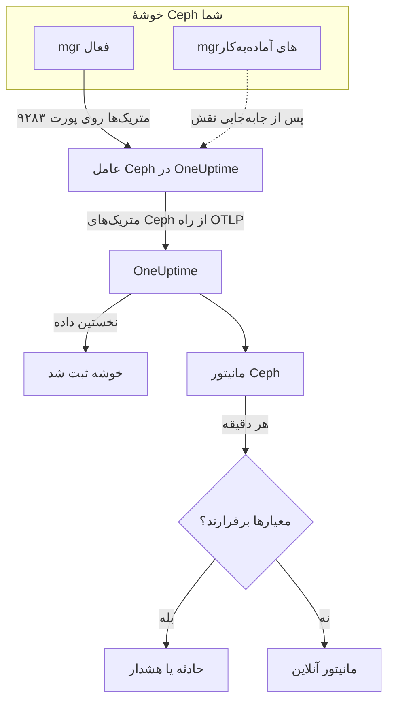

# مانیتور Ceph

مانیتور Ceph یک خوشهٔ Ceph را زیر نظر می‌گیرد — سلامت آن، بررسی‌های سلامت، حد نصاب mon، ‏OSDها، استخرها و گروه‌های جای‌گذاری — و همان لحظه که سلامت افت کند، یک OSD از کار بیفتد یا ظرفیت رو به پایان باشد به شما خبر می‌دهد. این مانیتور متریک‌های `ceph_*` را می‌خواند که ماژول `prometheus` در Ceph mgr صادر می‌کند و عامل Ceph در OneUptime جمع‌آوری می‌کند، پس هیچ چیزی از بیرون کاوش نمی‌شود.

:::cards
- [ساختن مانیتور](#ساختن-یک-مانیتور-ceph): شش گام در داشبورد.
- [قالب‌ها](#قالبهای-هشدار-آماده): ۲۳ هشدار آماده برای سلامت، OSDها، گروه‌های جای‌گذاری و ظرفیت.
- [بررسی‌های سلامت](#سریهای-بررسی-سلامت): برای هر بررسی سلامت Ceph با نامش هشدار بدهید.
- [متریک‌ها](#متریکهای-جمعآوریشده): همهٔ سری‌های `ceph_*` که مانیتور می‌تواند بر پایه‌شان هشدار بدهد.
:::

## چگونه کار می‌کند

ماژول `prometheus` در Ceph mgr متریک‌های خوشه را روی پورت ۹۲۸۳ ارائه می‌کند. عامل Ceph در OneUptime هر ۳۰ ثانیه همهٔ دیمن‌های mgr را واکشی می‌کند — mgr فعال پاسخ می‌دهد و mgrهای آماده‌به‌کار تا وقتی نقش را بر عهده نگیرند چیزی برنمی‌گردانند — برچسب‌های خودِ Ceph (`ceph_daemon`، `pool_id`) را نگه می‌دارد و متریک‌ها را با نام خوشه، `ceph.cluster.name`، از راه OTLP به OneUptime می‌فرستد. نخستین داده خوشه را ثبت می‌کند.

مانیتور Ceph به یک خوشه بسته است. هر دقیقه پرس‌وجوی خود را روی متریک‌های آن خوشه اجرا می‌کند و نتیجه را با معیارهایش مقایسه می‌کند.



## پیش از شروع

- روی خوشه **ماژول `prometheus` در mgr را فعال کنید**:

  ```bash
  ceph mgr module enable prometheus
  ```

- **عامل Ceph را نصب کنید**، روی ماشینی که به همهٔ دیمن‌های mgr روی پورت ۹۲۸۳ دسترسی دارد، و همهٔ آن‌ها را در `CEPH_MGR_ENDPOINTS` فهرست کنید. [راهنمای عامل Ceph](/docs/telemetry/ceph) نصب را شرح می‌دهد.
- **بررسی کنید که خوشه ثبت شده باشد.** حدود یک دقیقه پس از نخستین واکشی، خوشه با نام `CEPH_CLUSTER_NAME` عامل در **محصولات → زیرساخت → Ceph → همه خوشه‌ها** نمایش داده می‌شود.
- **برای هشدارهای بررسی سلامت**، Ceph Quincy یا نسخه‌های تازه‌تر را اجرا کنید. نسخه‌های قدیمی‌تر `ceph_health_detail` را صادر نمی‌کنند.

## ساختن یک مانیتور Ceph

:::steps
### یک مانیتور تازه را آغاز کنید

به **مانیتورها** بروید و روی **ساخت مانیتور** کلیک کنید.

### Ceph را برگزینید

زیر **نوع مانیتور**، روی **انواع دیگر مانیتور** کلیک کنید و **Ceph** را زیر **زیرساخت** برگزینید، یا `ceph` را در کادر جست‌وجو بنویسید. یک **نام** وارد کنید — در عنوان حادثه‌ها و هشدارها به کار می‌رود — و روی **بعدی** کلیک کنید.

### خوشه را برگزینید

زیر **Ceph Monitor Configuration**، خوشه را از **Ceph Cluster** برگزینید. هر خوشه‌ای که داده فرستاده باشد در فهرست هست.

### برگزینید چه چیزی را بپایید

یکی از سه زبانه را برگزینید:

- **Quick Setup** — روی یک [قالب](#قالبهای-هشدار-آماده) کلیک کنید. قالب متریک‌ها، پالایه‌ها، تجمیع، بازهٔ زمانی و آستانه‌ها را تنظیم می‌کند و معیارهای پایین را با معیارهای خودش جایگزین می‌کند. **بازه زمانی** را همچنان می‌توانید تغییر دهید.
- **Custom Metric** — یک متریک را از **Ceph Metric** برگزینید، سپس **تجمیع** و **بازه زمانی** را تنظیم کنید. **OSD** و **Pool ID** آن را به یک دیمن یا یک استخر محدود می‌کنند.
- **پیشرفته** — پرس‌وجوها و فرمول‌ها را خودتان زیر **انتخاب متریک‌ها** بسازید، برای نمونه نسبت ظرفیت مصرف‌شده از `ceph_cluster_total_used_bytes / ceph_cluster_total_bytes`. با **Group by** روی `ceph_daemon` یا `pool_id` هر دیمن یا استخر را جداگانه بسنجید.

### معیارها را بررسی کنید

هر معیار را زیر **معیارهای مانیتور** باز کنید و **متریک**، **تجمیع**، **شرط** و **Threshold** آن را بررسی کنید. قالب این‌ها را پر می‌کند. با **Custom Metric** یا **پیشرفته**، مانیتور با [معیارهای پیش‌فرض](#معیارهای-پیشفرض) آغاز می‌شود که فقط افت یک متریک به صفر را می‌بینند، پس آستانهٔ خودتان را تنظیم کنید.

### مانیتور را بسازید

روی **ساخت مانیتور** کلیک کنید. OneUptime صفحهٔ مانیتور را باز می‌کند و هر دقیقه آن را ارزیابی می‌کند. حادثه‌ها و هشدارهایی که این مانیتور ایجاد می‌کند در صفحه‌های **حوادث** و **هشدارها** خوشه هم فهرست می‌شوند.
:::

> [!TIP]
> برای راه‌اندازی چند قالب با هم، خوشه را از **محصولات → زیرساخت → Ceph** باز کنید و به **Recommendations** بروید. قالب‌هایی را که می‌خواهید برگزینید، مشخص کنید چه کسی فراخوانده شود، و OneUptime برای هر قالب یک مانیتور می‌سازد.

## تنظیمات مانیتور

| فیلد | زبانه | چه می‌کند |
| --- | --- | --- |
| **Ceph Cluster** | همه | الزامی. هر پرس‌وجو را به `resource.ceph.cluster.name` محدود می‌کند. |
| **OSD** | Custom Metric، پیشرفته | اختیاری. تطابق دقیق با برچسب `ceph_daemon`، برای نمونه `osd.3`. |
| **Pool ID** | Custom Metric، پیشرفته | اختیاری. تطابق دقیق با برچسب `pool_id`، برای نمونه `2`. |
| **Ceph Metric** | Custom Metric | یک متریک از [کاتالوگ](#متریکهای-جمعآوریشده). |
| **تجمیع** | Custom Metric | چگونگی ترکیب نمونه‌ها: **میانگین**، **بیشینه**، **کمینه**، **جمع** یا **تعداد**. با تجمیع معمول همان متریک آغاز می‌شود. |
| **بازه زمانی** | همه | پنجرهٔ غلتانی که پرس‌وجو می‌خواند، از **Past 1 Minute** تا **Past 365 Days**. مانیتور تازه با **Past 1 Minute** آغاز می‌شود؛ قالب‌ها مقدار خودشان را تنظیم می‌کنند. |
| **انتخاب متریک‌ها** | پیشرفته | سازندهٔ پرس‌وجو: **متریک**، **Aggregate by**، **Filter by attributes**، **Group by**، به‌علاوهٔ **افزودن متریک** و **افزودن فرمول** برای ترکیب پرس‌وجوها. |

سری‌های دادهٔ استخر فقط برچسب `pool_id` را دارند: نام استخر تنها روی `ceph_pool_metadata` وجود دارد. سری‌های استخر را بر پایهٔ `pool_id` بپالایید و گروه کنید، و هر وقت نام را لازم داشتید آن را در `ceph_pool_metadata` پیدا کنید.

### سری‌های بررسی سلامت

`ceph_health_detail` **به ازای هر بررسی سلامت فعال یک سری** صادر می‌کند، با برچسب‌های `name` (برای نمونه `OSD_NEARFULL` یا `RECENT_CRASH`) و `severity`. هر سری فقط تا وقتی بررسی‌اش فعال است وجود دارد، پس نبودِ سری یعنی سلامت. برای هشدار بر هر بررسی سلامت Ceph، بر پایهٔ `name` آن بپالایید، وقتی **بیشینه** از `0` بالاتر رفت برانگیخته شوید، و با تنظیم **اگر داده‌ای نبود** روی **Treat As Zero** در `0` بازیابی کنید — قالب‌های بررسی سلامت دقیقاً همین‌گونه ساخته شده‌اند. `ceph_daemon_health_metrics` به ازای هر دیمن به همین شکل کار می‌کند، با کلید برچسب `type` (برای نمونه `SLOW_OPS`) و `ceph_daemon`.

## قالب‌های هشدار آماده

**Quick Setup** ۲۳ قالب برای سلامت خوشه، OSDها، گروه‌های جای‌گذاری و ظرفیت پیشنهاد می‌کند. هر قالب یک مانیتور کامل می‌سازد — پرس‌وجوها، پالایه‌های برچسب، یک گروه‌بندی، معیاری که برانگیخته می‌شود و معیاری که بازیابی می‌شود. آستانه‌ها نقطهٔ شروعی‌اند که می‌توانید ویرایششان کنید.

قالب‌ها ۵ دقیقهٔ گذشته را می‌خوانند، مگر جدول چیز دیگری بگوید. معیار فقط وقتی برانگیخته می‌شود که شرط در همهٔ دقیقه‌های پنجره‌اش برقرار باشد، و معیار آستانه‌ای ۱۰٪ آن سوی آستانه‌اش بازیابی می‌شود تا مقداری که حول مرز نوسان می‌کند وضعیت را پی‌درپی عوض نکند. **شدت** برچسبی است که فهرست انتخاب نشان می‌دهد؛ حادثه و هشداری که قالب می‌سازد با شدیدترین شدت حادثه و شدت هشدار پروژهٔ شما آغاز می‌شوند.

### قالب‌های سلامت خوشه

| قالب | شدت | چه را می‌پاید | کی برانگیخته می‌شود | کی بازیابی می‌شود |
| --- | --- | --- | --- | --- |
| Cluster Health Error | بحرانی | `ceph_health_status`، Max، ۱ دقیقهٔ گذشته | ۲ یا بیشتر: `HEALTH_ERR` | زیر ۱٫۸: `HEALTH_WARN` یا بهتر |
| Cluster Health Warning | Warning | `ceph_health_status`، Max | ۱ یا بیشتر: `HEALTH_WARN` یا بدتر | زیر ۰٫۹: `HEALTH_OK` |
| Monitor Quorum Degraded | بحرانی | `ceph_mon_quorum_status`، Min به ازای هر `ceph_daemon`، ۱ دقیقهٔ گذشته | یک mon به زیر ۱ می‌رسد و از حد نصاب بیرون می‌افتد. یک حادثه به ازای هر mon | دوباره ۱ |
| Slow Operations | Warning | `ceph_healthcheck_slow_ops`، Max | بالای ۰: بررسی `SLOW_OPS` خوشه فعال است | در ۰ |
| Daemon Slow Operations | Warning | `ceph_daemon_health_metrics` برای `type = SLOW_OPS`، Max به ازای هر `ceph_daemon` | بالای ۰. یک حادثه به ازای هر OSD یا mon | سری ناپدید می‌شود |
| Daemon Crash | بحرانی | `ceph_health_detail` برای `name = RECENT_CRASH`، Max | بررسی فعال است: فروریزی‌های بایگانی‌نشدهٔ دیمن وجود دارد. mgr هیچ متریک `ceph_crash_*` ندارد، پس این تنها نشانهٔ فروریزی است | فروریزی‌ها بایگانی می‌شوند |
| Monitor Clock Skew | Warning | `ceph_health_detail` برای `name = MON_CLOCK_SKEW`، Max | بررسی فعال است: ساعت‌های mon بیش از انحراف مجاز (پیش‌فرض ۰٫۰۵ ثانیه) از هم فاصله گرفته‌اند | بررسی ناپدید می‌شود |
| Monitor Disk Critically Low | بحرانی | `ceph_health_detail` برای `name = MON_DISK_CRIT`، Max | بررسی فعال است: فضای آزاد دیسک پایگاه دادهٔ یک mon زیر ۵٪ است (پیش‌فرض) | بررسی ناپدید می‌شود |
| Monitor Disk Space Low | Warning | `ceph_health_detail` برای `name = MON_DISK_LOW`، Max | بررسی فعال است: فضای آزاد زیر ۳۰٪ است (پیش‌فرض) | بررسی ناپدید می‌شود |

### قالب‌های OSD

| قالب | شدت | چه را می‌پاید | کی برانگیخته می‌شود | کی بازیابی می‌شود |
| --- | --- | --- | --- | --- |
| OSD Down | بحرانی | `ceph_osd_up`، Min به ازای هر `ceph_daemon` | یک OSD به زیر ۱ می‌رسد. یک حادثه به ازای هر OSD | دوباره ۱ |
| OSD Out | Warning | `ceph_osd_in`، Min به ازای هر `ceph_daemon` | یک OSD به زیر ۱ می‌رسد: از توزیع داده بیرون گذاشته شده است | دوباره ۱ |
| OSD High Latency | Warning | `ceph_osd_apply_latency_ms`، Avg به ازای هر `ceph_daemon` | بالای ۱۰۰ میلی‌ثانیه. یک حادثه به ازای هر OSD | ۹۰ میلی‌ثانیه یا کمتر |
| OSD Slow Heartbeats | Warning | `ceph_health_detail` برای `name = OSD_SLOW_PING_TIME_FRONT` و `name = OSD_SLOW_PING_TIME_BACK`، Max | یکی از دو بررسی فعال است: ضربان‌ها روی شبکهٔ عمومی یا شبکهٔ خوشه کند هستند. mgr هیچ سنجهٔ زمان ping صادر نمی‌کند | هر دو بررسی ناپدید می‌شوند |

### قالب‌های گروه جای‌گذاری

| قالب | شدت | چه را می‌پاید | کی برانگیخته می‌شود | کی بازیابی می‌شود |
| --- | --- | --- | --- | --- |
| Inactive Placement Groups | بحرانی | `ceph_pg_total` − `ceph_pg_active`، Max به ازای هر `pool_id` | بالای ۰: PGها نمی‌توانند به I/O پاسخ دهند، پس درخواست‌های کلاینت به آن‌ها معلق می‌ماند. یک حادثه به ازای هر استخر | در ۰ |
| Degraded Placement Groups | Warning | `ceph_pg_degraded`، Max به ازای هر `pool_id` | بالای ۰: شیءها کمتر از تعداد پیکربندی‌شده رونوشت دارند | در ۰ |
| Undersized Placement Groups | Warning | `ceph_pg_undersized`، Max به ازای هر `pool_id` | بالای ۰: PGها به OSDهایی کمتر از تعداد رونوشتشان نگاشته شده‌اند | در ۰ |
| Damaged Placement Groups | بحرانی | `ceph_health_detail` برای `name = PG_DAMAGED` و `name = OSD_SCRUB_ERRORS`، Max | یکی از دو بررسی فعال است: scrub آسیب یا خطای خواندن پیدا کرده است | هر دو بررسی ناپدید می‌شوند |

### قالب‌های ظرفیت

| قالب | شدت | چه را می‌پاید | کی برانگیخته می‌شود | کی بازیابی می‌شود |
| --- | --- | --- | --- | --- |
| Cluster Near Full | Warning | `ceph_cluster_total_used_bytes` ÷ `ceph_cluster_total_bytes` × ۱۰۰ | بالای ۸۵٪، نسبت nearfull پیش‌فرض Ceph | ۷۶٫۵٪ یا کمتر |
| Cluster Full | بحرانی | همان نسبت | بالای ۹۵٪، نسبت full پیش‌فرض Ceph که در آن نوشتن در کل خوشه متوقف می‌شود | ۸۵٫۵٪ یا کمتر |
| Pool Near Full | Warning | `ceph_pool_stored` ÷ (`ceph_pool_stored` + `ceph_pool_max_avail`) × ۱۰۰، به ازای هر `pool_id` | بالای ۸۵٪ از آنچه استخر می‌تواند نگه دارد. یک حادثه به ازای هر استخر | ۷۶٫۵٪ یا کمتر |
| OSD Nearfull | Warning | `ceph_health_detail` برای `name = OSD_NEARFULL`، Max | بررسی فعال است: یک OSD از آستانهٔ nearfull (پیش‌فرض ۸۵٪) گذشته است. OSDهای تکی خیلی زودتر از میانگین خوشه پر می‌شوند | بررسی ناپدید می‌شود |
| OSD Backfillfull | Warning | `ceph_health_detail` برای `name = OSD_BACKFILLFULL`، Max | بررسی فعال است: backfill روی آن OSD پذیرفته نمی‌شود (پیش‌فرض ۹۰٪) و بازیابی داده متوقف می‌ماند | بررسی ناپدید می‌شود |
| OSD Full | بحرانی | `ceph_health_detail` برای `name = OSD_FULL`، Max، ۱ دقیقهٔ گذشته | بررسی فعال است: یک OSD به آستانهٔ full (پیش‌فرض ۹۵٪) رسیده و نوشتن پذیرفته نمی‌شود | بررسی ناپدید می‌شود |

- **قالب‌های از کار افتادن و حد نصاب از کمینه استفاده می‌کنند**، تا یک OSD از کار افتاده یا یک mon بیرون از حد نصاب آن‌ها را برانگیزد، نه اینکه پشت اکثریت سالم پنهان بماند.
- **قالب‌های شمارش و بررسی سلامت از بیشینه استفاده می‌کنند**، تا یک واکشی بد کافی باشد.
- **سری‌های PG و استخر به ازای هر استخرند**: هیچ سنجهٔ سراسری برای خوشه وجود ندارد، پس آن قالب‌ها بر پایهٔ `pool_id` گروه می‌کنند و به ازای هر استخر یک حادثه باز می‌کنند.
- **نسبت‌های ظرفیت** **جمع** هر دو طرف را می‌گیرند. هر دو از یک واکشی mgr می‌آیند، پس نتیجه درصدی واقعی است. **Inactive Placement Groups** در عوض **بیشینه** را به ازای هر استخر به کار می‌برد، چون جمع در یک تفریق واکشی‌ها را روی هم می‌انباشت.
- **قالب‌های بررسی سلامت** وقتی بررسی ناپدید شود بازیابی می‌شوند: معیارهای بازیابی‌شان سری غایب را ۰ به شمار می‌آورند.

برخی هشدارها قالب ندارند. عدم توازن PG به آمار میان‌سری نیاز دارد که معیارها نمی‌توانند حساب کنند. پیش‌بینی ظرفیت به برازش رشد نیاز دارد که به‌جایش داشبورد خوشه آن را رسم می‌کند. پیش‌بینی خرابی دیسک و کهنگی scrub هیچ متریکی در mgr ندارند، و NVMe-oF، آینه‌سازی RBD و cephadm صادرکننده‌های دیگری لازم دارند.

## متریک‌های جمع‌آوری‌شده

عامل هر ۳۰ ثانیه همهٔ دیمن‌های mgr را واکشی می‌کند و برچسب‌های خودِ Ceph را نگه می‌دارد، پس سری‌های به ازای هر دیمن `ceph_daemon` (`osd.3`، `mon.a`) و سری‌های به ازای هر استخر `pool_id` را دارند.

### متریک‌های سلامت خوشه

| متریک | واحد | شرح |
| --- | --- | --- |
| `ceph_health_status` | — | سلامت کلی: ۰ = `HEALTH_OK`، ۱ = `HEALTH_WARN`، ۲ = `HEALTH_ERR`. |
| `ceph_health_detail` | تعداد | به ازای هر بررسی سلامت **فعال** یک سری، با برچسب‌های `name` و `severity`. فقط Quincy و تازه‌تر. |
| `ceph_healthcheck_slow_ops` | تعداد | عملیات کند OSD و mon که بررسی `SLOW_OPS` گزارش می‌کند. |
| `ceph_daemon_health_metrics` | تعداد | متریک‌های سلامت به ازای هر دیمن، با کلید `type` (برای نمونه `SLOW_OPS`) و `ceph_daemon`. |
| `ceph_mon_quorum_status` | تعداد | وقتی mon در حد نصاب است ۱، به ازای هر `ceph_daemon` (برای نمونه `mon.a`). |
| `ceph_mon_metadata` | تعداد | فرادادهٔ mon، همیشه ۱. برای شمردن monها جمعش را بگیرید. |
| `ceph_cluster_total_bytes` | بایت | کل ظرفیت خام. |
| `ceph_cluster_total_used_bytes` | بایت | ظرفیت خام در حال استفاده. |

### متریک‌های OSD

| متریک | واحد | شرح |
| --- | --- | --- |
| `ceph_osd_up` | تعداد | وقتی OSD بالا است ۱، به ازای هر `ceph_daemon` (برای نمونه `osd.3`). |
| `ceph_osd_in` | تعداد | وقتی OSD در توزیع داده است ۱. |
| `ceph_osd_apply_latency_ms` | میلی‌ثانیه | زمان اعمال یک عملیات روی ذخیره‌گاه زیرین. |
| `ceph_osd_commit_latency_ms` | میلی‌ثانیه | زمان ثبت یک عملیات در ژورنال یا WAL. |
| `ceph_osd_stat_bytes` | بایت | ظرفیت خام دستگاه OSD. |
| `ceph_osd_stat_bytes_used` | بایت | بایت‌های خام استفاده‌شده روی OSD. با کل مقایسه کنید تا OSDهای نامتوازن یا نزدیک به پر را پیدا کنید. |
| `ceph_osd_numpg` | تعداد | گروه‌های جای‌گذاری روی OSD. |
| `ceph_osd_metadata` | تعداد | فرادادهٔ OSD (نام میزبان، کلاس دستگاه، نسخه)، همیشه ۱. برای شمردن OSDها جمعش را بگیرید. |

### متریک‌های استخر

| متریک | واحد | شرح |
| --- | --- | --- |
| `ceph_pool_stored` | بایت | دادهٔ کاربر که در استخر ذخیره شده است. |
| `ceph_pool_max_avail` | بایت | بایت‌هایی که هنوز می‌توان در استخر نوشت، با در نظر گرفتن نمایهٔ تکثیر یا erasure coding آن. |
| `ceph_pool_objects` | تعداد | شیءهای استخر. |
| `ceph_pool_rd` | عملیات | عملیات خواندن روی استخر. شمارندهٔ تجمعی. |
| `ceph_pool_wr` | عملیات | عملیات نوشتن روی استخر. شمارندهٔ تجمعی. |
| `ceph_pool_rd_bytes` | بایت | بایت‌های خوانده‌شده از استخر. شمارندهٔ تجمعی. |
| `ceph_pool_wr_bytes` | بایت | بایت‌های نوشته‌شده در استخر. شمارندهٔ تجمعی. |
| `ceph_pool_metadata` | تعداد | فرادادهٔ استخر، همیشه ۱ — تنها سری‌ای که `pool_id` را به یک نام نگاشت می‌کند. |

### متریک‌های گروه جای‌گذاری

هر سری `ceph_pg_*` به ازای هر استخر است و برچسب `pool_id` دارد؛ برای شمار سراسری خوشه، روی همهٔ استخرها جمع بگیرید.

| متریک | واحد | شرح |
| --- | --- | --- |
| `ceph_pg_total` | تعداد | گروه‌های جای‌گذاری در استخر. |
| `ceph_pg_active` | تعداد | PGهایی که `active` هستند و می‌توانند به I/O پاسخ دهند. |
| `ceph_pg_clean` | تعداد | PGهایی که `clean` هستند و کاملاً تکثیر شده‌اند. |
| `ceph_pg_degraded` | تعداد | PGهایی که `degraded` هستند. |
| `ceph_pg_undersized` | تعداد | PGهایی که `undersized` هستند. |
| `ceph_num_objects_degraded` | تعداد | شیءهایی با رونوشت‌های کمتر از تعداد پیکربندی‌شده. |
| `ceph_num_objects_misplaced` | تعداد | شیءهایی که جایی نیستند که CRUSH می‌خواهد. داده امن است؛ فقط جای‌گذاری نادرست است. |

## معیارهای مانیتورینگ

هر معیار یکی از پرس‌وجوها یا فرمول‌های مانیتور را با یک آستانه مقایسه می‌کند. معیارهای مانیتور Ceph **نوع فیلتر** ندارند: هر قاعده مقدار متریک را با این فیلدها بررسی می‌کند.

| فیلد | چه می‌کند |
| --- | --- |
| **متریک** | پرس‌وجو یا فرمولی که بررسی می‌شود، با نام متغیرش. |
| **تجمیع** | اینکه مقدارهای پنجره چگونه به یک پاسخ تبدیل می‌شوند: **میانگین**، **جمع**، **Maximum Value**، **Minimum Value**، **All Values** (همهٔ مقدارها باید جور باشند) یا **Any Value** (یکی کافی است). |
| **شرط** | **Greater Than**، **Less Than**، **Greater Than Or Equal To**، **Less Than Or Equal To** یا **Equal To** — یا یک شرط ناهنجاری: **Anomalously High**، **Anomalously Low** یا **Anomalous**. |
| **Threshold** | مقداری که با آن مقایسه می‌شود. وقتی متریک واحد دارد، فهرستی از واحدها کنارش هست. برای شرط‌های ناهنجاری نشان داده نمی‌شود. |
| **حساسیت** | فقط شرط‌های ناهنجاری. **Low** (۴σ)، **Medium** (۳σ، پیش‌فرض) یا **High** (۲σ). |
| **پنجره مبنا** | فقط شرط‌های ناهنجاری. ۱۴ روز (پیش‌فرض)، ۲۸، ۶۰ یا ۹۰ روز سابقه. |
| **اگر داده‌ای نبود** | زیر **فیلدهای بیشتر**. وقتی پنجره هیچ نمونه‌ای ندارد چه رخ می‌دهد: **Ignore** (پیش‌فرض)، **Treat As Zero** یا **تریگر**. |

شرط‌های ناهنجاری هر مقدار را با همان ساعت از هفته در مبنا مقایسه می‌کنند. تا وقتی پنجرهٔ مبنا سابقهٔ کافی نداشته باشد، در حالت "Learning" می‌مانند و چیزی ایجاد نمی‌کنند.

هر معیار همچنین می‌گوید هنگام جور شدن چه کاری انجام شود: تغییر وضعیت مانیتور، ساختن یک هشدار یا اعلام یک حادثه. معیارها از بالا به پایین بررسی می‌شوند و نخستین معیاری که جور شود تصمیم می‌گیرد.

### معیارهای پیش‌فرض

مانیتوری که از روی قالب نمی‌سازید با دو معیار آغاز می‌شود:

| ترتیب | معیار | کی جور می‌شود | سپس |
| --- | --- | --- | --- |
| ۱ | Check if _نام مانیتور_ is offline | هر مقداری از نخستین پرس‌وجو `0` باشد | مانیتور را **آفلاین** علامت می‌زند و حادثهٔ "_نام مانیتور_ is offline" را اعلام می‌کند که با بازیابی مانیتور خودبه‌خود حل می‌شود. |
| ۲ | Check if _نام مانیتور_ is online | هر مقداری بالای `0` باشد | مانیتور را **عملیاتی** علامت می‌زند. |

این پیش‌فرض‌ها با متریک‌های اندکی از Ceph جور درمی‌آیند: `ceph_health_status` وقتی خوشه سالم است ۰ است. یک قالب برگزینید یا معیارهای خودتان را تنظیم کنید.

> [!IMPORTANT]
> سکوت با هیچ‌کدام از معیارها جور نمی‌شود: خوشه‌ای که دیگر داده نمی‌فرستد مانیتور را همان‌طور که بود رها می‌کند. برای اینکه وقتی داده قطع می‌شود باخبر شوید، **اگر داده‌ای نبود** را روی یک معیار به **تریگر** تنظیم کنید.

## عیب‌یابی

:::details خوشه در فهرست Ceph Cluster نیست
خوشه‌ها از روی دادهٔ عامل خودشان ثبت می‌شوند. بررسی کنید که عامل در حال اجرا است و داده می‌فرستد ([راهنمای عامل Ceph](/docs/telemetry/ceph) را ببینید)، و اینکه `CEPH_CLUSTER_NAME` تنظیم شده است.
:::

:::details متریک‌ها پس از جابه‌جایی نقش mgr قطع شدند
عامل باید **همهٔ** دیمن‌های mgr را واکشی کند، نه فقط mgr فعال را: mgrهای آماده‌به‌کار تا وقتی نقش را بر عهده نگیرند چیزی برنمی‌گردانند. همهٔ mgrها را در `CEPH_MGR_ENDPOINTS` فهرست کنید.
:::

:::details ceph_health_status برابر ۱ است اما چیزی برانگیخته نمی‌شود
بررسی کنید که معیار از **Greater Than Or Equal To** `1` استفاده کند، نه **Greater Than**، و اینکه **بازه زمانی** مانیتور دست‌کم یک واکشی ۳۰ ثانیه‌ای را در بر بگیرد.
:::

:::details قالب‌های بررسی سلامت هرگز برانگیخته نمی‌شوند
قالب‌هایی که `ceph_health_detail` را می‌پایند — Daemon Crash، Monitor Clock Skew، OSD Nearfull، OSD Backfillfull، OSD Full، دو قالب دیسک mon، Damaged Placement Groups و OSD Slow Heartbeats — به ماژول `prometheus` در mgr از Quincy یا تازه‌تر نیاز دارند. تا وقتی یک بررسی فعال است، مطمئن شوید که سری وجود دارد:

```bash
curl http://ACTIVE_MGR:9283/metrics | grep ceph_health_detail
```

سری‌های بررسی سلامت، از جمله `ceph_daemon_health_metrics`، فقط تا وقتی یک بررسی فعال است وجود دارند، پس پیدا نکردن هیچ‌کدام در حالی که خوشه سالم است طبیعی است.
:::

:::details شمارنده‌هایی مثل ceph_pool_wr_bytes همیشه فقط بالا می‌روند
سری‌های I/O استخر شمارنده‌های تجمعی‌اند و معیارها مقدارهای خام را مقایسه می‌کنند: هیچ عملگر نرخی وجود ندارد و **Convert to per-second rate** در سازندهٔ پرس‌وجو فقط نمودار را تغییر می‌دهد. آن‌ها را به‌صورت نرخ در نمودار ببینید، یا با یک فرمول بر رشدشان هشدار بدهید، مثلاً یک پرس‌وجوی **بیشینه** منهای یک پرس‌وجوی **کمینه** از همان شمارنده.
:::

## گام‌های بعدی

:::cards
- [عامل Ceph](/docs/telemetry/ceph): عاملی را که این مانیتور می‌خواند نصب و به‌روزرسانی کنید.
- [مانیتور Proxmox](/docs/monitor/proxmox-monitor): خوشهٔ Proxmox VE را که از این ذخیره‌سازی استفاده می‌کند زیر نظر بگیرید.
- [مانیتور آرایه ذخیره‌سازی](/docs/monitor/storage-array-monitor): همین نوع مانیتور برای آرایه‌های Pure Storage.
- [حوادث](/docs/incidents/index): پس از اینکه یک معیار حادثه‌ای اعلام کرد چه رخ می‌دهد.
:::
