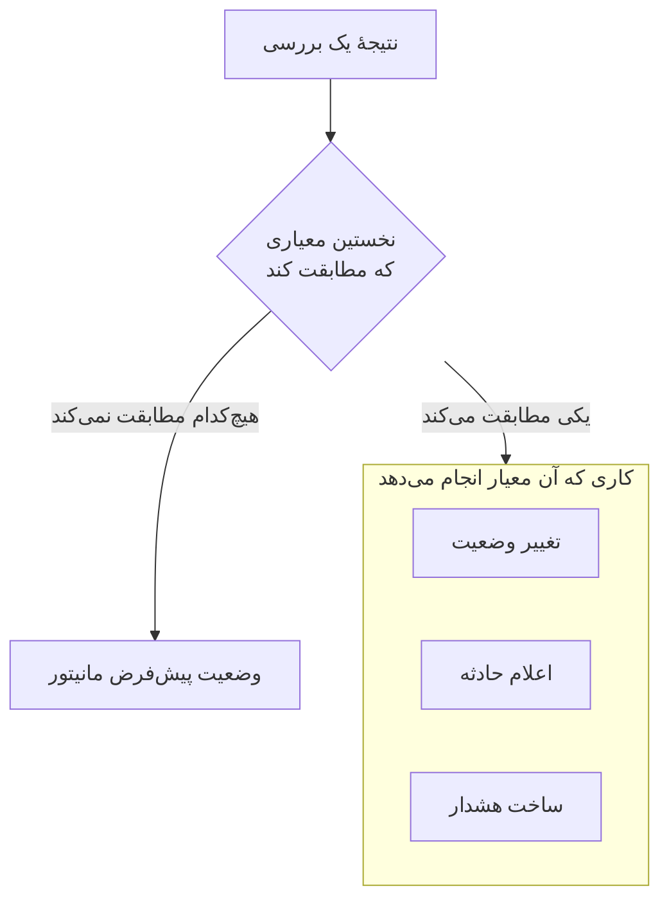

# ساخت مانیتور

مانیتور چیزی را که شما اجرا می‌کنید، مثل یک وب‌سایت، یک API، یک میزبان یا یک کلاستر Kubernetes، بررسی می‌کند و وقتی از کار بیفتد به شما خبر می‌دهد. **ساخت مانیتور** اول می‌پرسد چه چیزی پایش شود، بعد چه چیزی بررسی شود و بعد هر چند وقت یک بار. همه چیز جز نوع، نام و آنچه بررسی می‌شود با مقادیر پیش‌فرضی شروع می‌شود که برای بیشتر مانیتورها مناسب‌اند.

> [!NOTE]
> برای ساخت مانیتور به نقش Project Owner، Project Admin، Project Member، Monitor Admin یا Monitor Member، یا یک نقش سفارشی با مجوز Create Monitor نیاز دارید.

## اطلاعات مانیتور

مرحلهٔ اول می‌پرسد چه چیزی پایش شود و نام مانیتور چه باشد.

:::steps
### باز کردن ساخت مانیتور

به **مانیتورها** بروید و روی **ساخت مانیتور** کلیک کنید. فرم روی مرحلهٔ اولش، **اطلاعات مانیتور**، باز می‌شود.

### انتخاب نوع مانیتور

نخستین پرسش **نوع مانیتور** است: می‌خواهید چه چیزی را پایش کنید؟

- شش نوعی که بیشتر ساخته می‌شوند اول می‌آیند: **وب‌سایت**، **API**، **Ping**، **پورت**، **SSL Certificate** و **Incoming Request** برای ضربان‌های cron jobها و webhookها.
- **انواع دیگر مانیتور** همهٔ نوع‌های دیگر را زیر دسته‌شان نشان می‌دهد، مثل **زیرساخت** (Kubernetes، Docker، میزبان) و **تله‌متری** (لاگ‌ها، متریک‌ها، ترِیس‌ها). **Manual**، مانیتوری که وضعیتش را خودتان تعیین می‌کنید، زیر **سایر** است.
- یا در کادر جست‌وجو بنویسید. کلمه‌هایی را که خودتان به کار می‌برید، مثل `k8s`، `postgres`، `heartbeat` یا `tls`، می‌شناسد و **Enter** نخستین نتیجه را انتخاب می‌کند.

نوعی که انتخاب می‌کنید به یک خط کوچک می‌شود. برای انتخاب نوعی دیگر روی **تغییر** کلیک کنید؛ هنگام انتخاب **Escape** را بزنید تا همان نوع قبلی بماند.

### نام‌گذاری مانیتور

**نام** را پر کنید. نام در هشدارها و عنوان حادثه‌ها به کار می‌رود. **توضیحات** و **برچسب‌ها** اختیاری‌اند و زیر **فیلدهای بیشتر** هستند.

مانیتور **Manual** به چیز دیگری نیاز ندارد، پس **ساخت مانیتور** در همین مرحله است. برای هر نوع دیگر روی **بعدی** کلیک کنید.
:::

## معیارها

مرحلهٔ دوم می‌پرسد چه چیزی بررسی شود و تعیین می‌کند چه چیزی مشکل به حساب بیاید.

:::steps
### وارد کردن آنچه بررسی می‌شود

این مرحله با آنچه بررسی می‌شود شروع می‌شود. برای یک وب‌سایت، نشانی آن است و نمونه‌ای در کادر دیده می‌شود؛ نوع‌های دیگر یک میزبان، یک کوئری، یک کلاستر یا یک فیلتر لاگ می‌خواهند. تنظیماتی که بیشتر مانیتورها هرگز تغییرشان نمی‌دهند، مثل وقفه‌ها و تلاش‌های مجدد، زیر **فیلدهای بیشتر** جمع شده‌اند.

برای مانیتوری که پراب‌ها بررسی‌اش می‌کنند، **آزمایش مانیتور** بررسی را پیش از ذخیره یک بار اجرا می‌کند: در **انتخاب پراب** یک پراب انتخاب کنید و روی **اجرای آزمایش** کلیک کنید. پاسخ در **نتیجه آزمایش مانیتور** باز می‌شود.

### بازبینی معیارها

زیر آن، **معیارهای مانیتور** تعیین می‌کنند مانیتور چه زمانی وضعیتش را تغییر می‌دهد، حادثه اعلام می‌کند یا هشدار می‌سازد. مانیتور تازه با معیارهایی شروع می‌شود که برای بیشتر مانیتورها مناسب‌اند و هر کدام به یک خط جمع شده که می‌گوید چه چیزی را بررسی می‌کند و چه کاری انجام می‌دهد. برای نمونه، مانیتور تازهٔ یک وب‌سایت وقتی سایت پاسخ ندهد یا با کد وضعیت خطا پاسخ دهد، آفلاین علامت می‌خورد و حادثه اعلام می‌کند.

روی یک معیار کلیک کنید تا باز شود و تغییرش دهید. **افزودن معیار** معیاری تازه، باز و آمادهٔ پر شدن، اضافه می‌کند. برای تغییر ترتیب، یک معیار را از دستگیرهٔ سمت چپش بکشید.

### رفتن به مرحلهٔ بعد

روی **بعدی** کلیک کنید. در این مرحله تا وقتی روی **بعدی** کلیک نکنید، هیچ چیزی جاافتاده علامت نمی‌خورد.
:::

### معیارها چگونه ارزیابی می‌شوند

نتیجهٔ هر بررسی از بالا به پایین از معیارها می‌گذرد و نخستین معیاری که مطابقت کند تعیین می‌کند چه اتفاقی بیفتد. آن معیار می‌تواند وضعیت مانیتور را تغییر دهد، حادثه اعلام کند، هشدار بسازد یا هر ترکیبی از این سه را انجام دهد. وقتی هیچ معیاری مطابقت نکند، مانیتور **وضعیت پیش‌فرض مانیتور** را نشان می‌دهد که زیر **فیلدهای بیشتر** در پایین معیارها تنظیم می‌شود (اگر چیز دیگری انتخاب نکنید، **عملیاتی**).

حادثه‌ها و هشدارهایی که برای حل خودکار تنظیم شده‌اند، مثل آن‌هایی که معیارهای پیش‌فرض می‌سازند، وقتی معیارشان دیگر مطابقت نکند خودشان حل می‌شوند. مانیتوری که بیش از یک پراب بررسی‌اش می‌کند فقط وقتی تغییر می‌کند که پراب‌هایش هم‌نظر باشند: به‌طور پیش‌فرض، هر پرابی که روشن و متصل است باید به همان نتیجه برسد. برای اینکه تعداد کمتری لازم باشد، **توافق پراب‌ها** را در صفحهٔ **پیکربندی → پراب‌ها و بازه** مانیتور تنظیم کنید.

## پراب‌ها و بازه

مانیتورهایی که پراب‌ها بررسی می‌کنند با این مرحله تمام می‌شوند: وب‌سایت، API، Ping، IP، پورت، SSL Certificate، DNS، DNSSEC، NTP، دامنه، SQL Query، Database Health، Synthetic Monitor، Custom JavaScript Code و External Status Page. **پراب‌ها** ماشین‌هایی هستند که بررسی‌ها را اجرا می‌کنند و پراب‌های پیش‌فرض پروژهٔ شما از قبل انتخاب شده‌اند. **بازه پایش** از **هر ۵ دقیقه** شروع می‌شود.

:::steps
### انتخاب پراب‌ها

**پراب‌ها**ی انتخاب‌شده را نگه دارید یا پراب‌های دیگری انتخاب کنید. مانیتوری که هیچ پرابی ندارد هرگز بررسی نمی‌شود. برای بررسی چیزی در یک شبکهٔ خصوصی، یک [پراب سفارشی](/docs/probe/custom-probe) را داخل همان شبکه اجرا کنید و آن را اینجا انتخاب کنید.

### انتخاب تعداد دفعات بررسی

یک **بازه پایش** از **هر دقیقه** تا **هر هفته** انتخاب کنید. برای مانیتورهای Synthetic Monitor، Custom JavaScript Code و SSL Certificate فقط بازه‌های ۵ دقیقه یا طولانی‌تر ارائه می‌شود.

### ساختن مانیتور

روی **ساخت مانیتور** کلیک کنید. صفحهٔ مانیتور تازه باز می‌شود. برای تغییر پراب‌ها یا بازه‌اش در آینده، **پیکربندی → پراب‌ها و بازه** را در همان صفحه باز کنید.
:::

همهٔ نوع‌های دیگر به‌جز Manual از مرحلهٔ **معیارها** ساخته می‌شوند.

## شروع از یک قالب یا یک پیوند

یک قالب مانیتور، و پیوندهایی که در جاهای دیگر OneUptime (روی نمودار یک متریک، یک دستگاه شبکه یا یک قاعدهٔ تشخیص) مانیتور می‌سازند، **ساخت مانیتور** را با نوعِ انتخاب‌شده و بقیهٔ موارد پرشده باز می‌کنند. برای انتخاب نوعی دیگر روی **تغییر** کلیک کنید. فرم خود قالب هم از همین انتخاب‌گر نوع استفاده می‌کند: [قالب‌های مانیتور](/docs/monitor/monitor-templates) را ببینید.

هر نوع مانیتور صفحهٔ خودش را با تنظیمات، معیارهای پیش‌فرض و نمونه‌هایش دارد. جاهای خوب برای ادامه:

:::cards
- [مانیتور وب‌سایت](/docs/monitor/website-monitor): بررسی کنید که یک صفحه بارگذاری می‌شود و چه پاسخی می‌دهد.
- [مانیتور API](/docs/monitor/api-monitor): یک endpoint را با یک متد، هدرها و بدنه فراخوانی کنید.
- [قالب‌های مانیتور](/docs/monitor/monitor-templates): مانیتورهای زیادی را از یک پیکربندی بسازید و هماهنگ نگه دارید.
- [حوادث](/docs/incidents/index): پس از اینکه مانیتوری حادثه اعلام می‌کند چه اتفاقی می‌افتد.
:::
