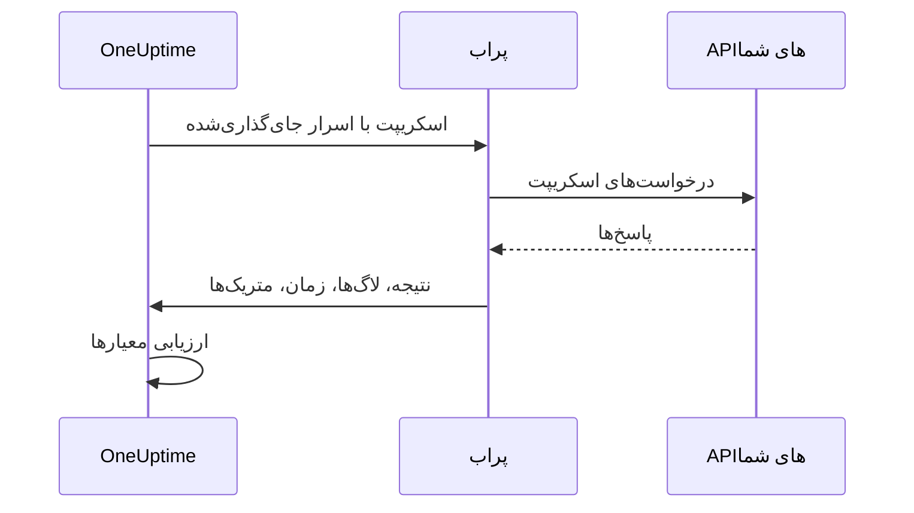

# مانیتور کد سفارشی

مانیتور کد سفارشی یک اسکریپت JavaScript را که خودتان می‌نویسید، از یک پراب و بر پایه زمان‌بندی اجرا می‌کند. از آن برای بررسی‌هایی استفاده کنید که انواع دیگر مانیتور نمی‌توانند بیان کنند — ورود به سیستم و سپس یک فراخوانی API احراز هویت‌شده، تراکنشی چندمرحله‌ای، یا مقداری که از چند پاسخ محاسبه می‌کنید. اگر اسکریپت خطا پرتاب کند، بررسی شکست می‌خورد؛ آنچه اسکریپت برمی‌گرداند در اختیار معیارها و قالب‌های حادثه شما قرار می‌گیرد.

:::cards
- [مانیتور را بسازید](#ساخت-مانیتور-کد-سفارشی): اسکریپتی بنویسید و پراب‌هایی را که آن را اجرا می‌کنند برگزینید.
- [اسکریپت را بنویسید](#اسکریپت-را-بنویسید): یک بررسی API چندمرحله‌ای آماده اجرا برای شروع.
- [از اسرار استفاده کنید](#استفاده-از-اسرار-مانیتور): گذرواژه‌ها و توکن‌ها را بیرون از اسکریپت نگه دارید.
- [متریک‌های سفارشی ثبت کنید](#متریکهای-سفارشی): هر عددی را که اسکریپت محاسبه می‌کند در نمودار ببینید.
:::

## چگونه کار می‌کند

در هر بررسی، یک پراب اسکریپت شما را در یک sandbox جداشده JavaScript اجرا می‌کند که اسرار مانیتور از پیش در آن جای گرفته‌اند. اسکریپت هرچه را لازم دارد فرا می‌خواند و سپس نتیجه‌ای برمی‌گرداند یا خطایی پرتاب می‌کند. پراب نتیجه، پیام‌های لاگ اسکریپت، مدت اجرا و متریک‌هایی را که ثبت کرده گزارش می‌دهد، و OneUptime معیارهای شما را بر پایه آن‌ها ارزیابی می‌کند.



این sandbox محیط Node.js نیست: در آن `require`، `process`، `fetch` یا سامانه فایل وجود ندارد، فقط [ماژول‌هایی که در ادامه آمده‌اند](#ماژولهای-در-دسترس-در-اسکریپت) در دسترس‌اند.

## پیش از شروع

- یک **پراب** که به همه endpointهایی که اسکریپت فرا می‌خواند دسترسی داشته باشد. برای endpointهای درون شبکه خودتان از [پراب سفارشی](/docs/probe/custom-probe) استفاده کنید.
- برای فراخوانی یک نشانی خصوصی (مانند `10.0.0.5`)، پراب باید اجازه آن را بدهد: روی آن پراب `PROBE_ALLOW_PRIVATE_NETWORK_MONITORS=true` را تنظیم کنید. نشانی‌های loopback، ‏link-local و فراداده ابری همیشه رد می‌شوند. [دسترسی به شبکه خصوصی](/docs/self-hosted/private-network-access) را ببینید.
- هر گذرواژه، کلید API یا توکنی که اسکریپت لازم دارد، به‌صورت [راز مانیتور](/docs/monitor/monitor-secrets) ذخیره شده باشد.

## ساخت مانیتور کد سفارشی

:::steps
### یک مانیتور تازه آغاز کنید

به **مانیتورها** بروید و روی **ساخت مانیتور** کلیک کنید. در **نوع مانیتور** روی **انواع دیگر مانیتور** کلیک کنید و **Custom JavaScript Code** را زیر **Synthetic Monitoring** برگزینید، یا در جعبه جست‌وجو `script` را تایپ کنید. یک **نام** وارد کنید و سپس روی **بعدی** کلیک کنید.

### اسکریپت را اضافه کنید

اسکریپت خود را در ویرایشگر **کد JavaScript** بنویسید. از [نمونه زیر](#اسکریپت-را-بنویسید) شروع کنید.

### آن را بیازمایید

روی **آزمایش مانیتور** کلیک کنید تا اسکریپت یک بار از یک پراب اجرا شود، و نتیجه‌اش را بررسی کنید.

### معیارها را بازبینی کنید

مانیتور با دو معیار آغاز می‌شود: وقتی اسکریپت شکست بخورد آفلاین می‌شود و حادثه‌ای اعلام می‌کند، و وقتی شکست نخورد آنلاین است. آن‌ها را تغییر دهید یا معیارهای خودتان را بیفزایید — [معیارها](#معیارها) را ببینید — و سپس روی **بعدی** کلیک کنید.

### پراب‌ها را برگزینید و بسازید

**پراب‌ها**یی را که به endpointهای شما دسترسی دارند و یک **بازه پایش** برگزینید — برای مانیتورهای کد سفارشی بازه‌های ۵ دقیقه یا بیشتر پیشنهاد می‌شود — و سپس روی **ساخت مانیتور** کلیک کنید.
:::

## اسکریپت را بنویسید

اسکریپت بدنه یک تابع `async` است: می‌توانید در سطح بالا `await` کنید، با `return` نتیجه‌ای برگردانید، و با `throw` بررسی را شکست دهید. این نمونه وارد سیستم می‌شود، با توکنی که پس گرفته یک endpoint را فرا می‌خواند، و اگر پاسخ آن چیزی نباشد که انتظار دارد شکست می‌خورد:

```javascript title="Custom code monitor script"
// 1. Log in. axios rejects a 4xx or 5xx response, which fails the check.
const login = await axios.post("https://api.example.com/v1/login", {
  username: "monitoring@example.com",
  password: "{{monitorSecrets.ApiPassword}}",
});

// 2. Call an endpoint that needs the token.
const orders = await axios.get("https://api.example.com/v1/orders?limit=10", {
  headers: { Authorization: `Bearer ${login.data.token}` },
  timeout: 10000,
});

// 3. Fail the check when the data is wrong, not only when the request fails.
if (!Array.isArray(orders.data.items)) {
  throw new Error("The orders endpoint returned no items");
}

console.log(`Fetched ${orders.data.items.length} orders`);

// 4. Return what the criteria and incident templates should see.
return {
  data: orders.data.items.length,
};
```

| برای | این کار را بکنید | آنچه OneUptime ثبت می‌کند |
| --- | --- | --- |
| گزارش یک نتیجه | `return { data: ... }` با هر مقدار JSON | **نتیجه**. فقط ویژگی `data` نگه داشته می‌شود: `return 5` هیچ نتیجه‌ای ثبت نمی‌کند. |
| شکست دادن بررسی | `throw new Error("...")` | **خطای اسکریپت**، که معیارهای پیش‌فرض آن را به حادثه تبدیل می‌کنند. |
| به جا گذاشتن ردپا | `console.log(...)` | **پیام‌های لاگ**، تا ۱٬۰۰۰ پیام در هر اجرا. |

برای دیدن یک اجرا، **نمای کلی** مانیتور را باز کنید: کارت **خلاصه مانیتور** پراب، زمان اجرا و خطا را نشان می‌دهد، و **نمایش جزئیات بیشتر** نتیجه، خطای اسکریپت و پیام‌های لاگ را نشان می‌دهد. **گزارش‌های پایش** همین خلاصه را برای بررسی‌های پیشین دارد.

> [!NOTE]
> ‏`axios` در این sandbox از تغییر مسیرها پیروی نمی‌کند، و درخواست‌هایش از پراکسی‌ای که روی پراب پیکربندی شده عبور نمی‌کنند. نشانی نهایی را درخواست کنید.

## استفاده از اسرار مانیتور

در هر جای اسکریپت به یک راز با `{{monitorSecrets.NAME}}` ارجاع دهید. OneUptime پیش از رسیدن اسکریپت به پراب، این ارجاع را با مقدار راز، به‌صورت متن ساده، جایگزین می‌کند. پس برای استفاده از یک راز به‌عنوان رشته آن را در گیومه بگذارید، و برای استفاده از آن به‌عنوان عدد یا مقدار بولی بدون گیومه رهایش کنید:

```javascript
// Used as a string: wrap it in quotes.
const apiKey = "{{monitorSecrets.ApiKey}}";

// Used as a number or a boolean: leave it bare.
const retryLimit = {{monitorSecrets.RetryLimit}};
const verbose = {{monitorSecrets.Verbose}};

// Check the secret was filled in without logging the secret itself.
console.log(apiKey.length > 0);
```

مقدار رازی که گیومه دارد، رشته پیرامون خود را می‌شکند. ارجاعی که مانیتور نمی‌تواند از آن استفاده کند، همان‌طور که نوشته شده در اسکریپت می‌ماند. برای ساخت یک راز و انتخاب مانیتورهایی که می‌توانند از آن استفاده کنند، [اسرار مانیتور](/docs/monitor/monitor-secrets) را ببینید.

## متریک‌های سفارشی

می‌توانید با تابع `oneuptime.captureMetric()` از اسکریپت خود متریک‌های سفارشی ثبت کنید. این متریک‌ها در OneUptime ذخیره می‌شوند و می‌توان آن‌ها را با Metric Explorer در داشبوردها به نمودار درآورد.

```javascript
oneuptime.captureMetric(name, value, attributes);
```

| پارامتر | نوع | توضیح |
| --- | --- | --- |
| `name` | string، الزامی | نام متریک (برای نمونه `"api.response.time"`). به‌طور خودکار با پیشوند `custom.monitor.` ذخیره می‌شود. |
| `value` | number، الزامی | مقدار عددی متریک. مقداری که عدد نباشد نادیده گرفته می‌شود. |
| `attributes` | object، اختیاری | جفت‌های کلید-مقدار برای زمینه بیشتر. مقدارهای رشته، عدد و بولی ثبت می‌شوند (عددها و مقدارهای بولی به‌صورت متن ذخیره می‌شوند، چون ویژگی‌های متریک بُعد هستند نه اندازه‌گیری). مقدارهای هر نوع دیگری نادیده گرفته می‌شوند. |

### نمونه

```javascript
const response = await axios.get("https://api.example.com/health");

// Capture a simple metric
oneuptime.captureMetric("api.response.time", response.data.latency);

// Capture a metric with attributes
oneuptime.captureMetric("api.queue.depth", response.data.queueDepth, {
  region: "us-east-1",
  environment: "production",
});

return {
  data: response.data,
};
```

پس از ثبت، این متریک‌ها در Metric Explorer با نام‌هایی مانند `custom.monitor.api.response.time` و در صفحه **متریک‌ها**ی مانیتور زیر **متریک‌های سفارشی** نمایش داده می‌شوند. OneUptime مانیتور و پراب را به هر نقطه داده می‌افزاید، تا بتوانید آن‌ها را به نمودار درآورید، روی آن‌ها هشدار بگذارید، و بر پایه مانیتور، پراب یا هر ویژگی سفارشی‌ای که داده‌اید فیلتر کنید.

### محدودیت‌ها

| محدودیت | مقدار | فراتر از محدودیت |
| --- | --- | --- |
| متریک در هر اجرای اسکریپت | ۱۰۰ | فراخوانی‌های بعدی نادیده گرفته می‌شوند. |
| طول نام متریک | ۲۰۰ نویسه | نام بریده می‌شود. |
| ویژگی در هر متریک | ۵۰ | ویژگی‌های بعدی کنار گذاشته می‌شوند. |
| طول کلید ویژگی | ۲۰۰ نویسه | کلید بریده می‌شود. |
| طول مقدار ویژگی | ۱۰۰۰ نویسه | مقدار بریده می‌شود. |

### کلیدهای ویژگی رزروشده

برخی نام‌های ویژگی متعلق به خود OneUptime هستند و اسکریپت نمی‌تواند آن‌ها را بنویسد. اگر اسکریپت شما یکی از آن‌ها را تنظیم کند، آن ویژگی کنار گذاشته می‌شود — خود متریک همچنان ثبت می‌شود — و هشداری با نام آن کلید در لاگ‌های سرور OneUptime نوشته می‌شود. این‌ها عبارت‌اند از:

- هویت مانیتور: `monitorId`، `projectId`، `monitorName`، `probeName`، `probeId`، `isCustomMetric`.
- هر چیزی در فضای‌نام‌های `oneuptime.` یا `resource.` — این‌ها شناسه‌هایی را دارند که OneUptime هنگام دریافت داده می‌زند.
- ویژگی‌های هویت منبع: `service.name`، `host.name`، `k8s.cluster.name`، `iot.fleet.name`، `proxmox.cluster.name`، `vmware.vcenter.name`، `ceph.cluster.name`، `storage.array.name` و `docker.swarm.cluster.name`.

این نام‌ها فقط برچسب نیستند — OneUptime آن‌ها را به‌عنوان ادعایی درباره اینکه یک نقطه داده به کدام منبع تعلق دارد بازمی‌خواند. متریکی با برچسب `service.name: payments-api` در زبانه متریک‌های آن سرویس نشان داده می‌شود، و اگر بعدها مانیتور متریکی بسازید که بر پایه `service.name` گروه‌بندی شده باشد، هشدارهایش به آن سرویس پیوند می‌خورند، مالکان آن سرویس را فرا می‌خوانند، و در بازه نگهداری آن سرویس خاموش می‌مانند. برای پیوند دادن یک مانیتور به یک سرویس یا میزبان، به‌جای این کار از برچسب‌های خود مانیتور استفاده کنید.

## معیارها

معیارهای مانیتور کد سفارشی می‌توانند این‌ها را بررسی کنند:

| نوع فیلتر | آنچه بررسی می‌کند | شرط‌های فیلتر |
| --- | --- | --- |
| **خطا** | خطایی که اسکریپت پرتاب کرده، اگر باشد. | شامل است، Not Contains، Equal To، Not Equal To، Is Empty، Is Not Empty |
| **Result Value** | ‏`data` ای که اسکریپت برگردانده. اگر عدد باشد، به‌صورت عدد مقایسه می‌شود. | همان‌ها، به‌علاوه Greater Than، Less Than، Greater Than Or Equal To، Less Than Or Equal To، درست و نادرست |
| **زمان اجرا (به میلی‌ثانیه)** | اسکریپت چه مدت اجرا شده. | مقایسه‌های عددی |

معیارهای پیش‌فرض وقتی **خطا** خالی باشد مانیتور را آنلاین علامت می‌زنند، و وقتی خالی نباشد آفلاین — با حادثه‌ای که وقتی اسکریپت دوباره موفق شود خودبه‌خود رفع می‌شود. در قالب‌های حادثه و هشدار، اجرا به‌صورت `{{result}}`، `{{scriptError}}`، `{{logMessages}}` و `{{executionTimeInMs}}` در دسترس است: [قالب‌بندی حادثه و هشدار](/docs/monitor/incident-alert-templating) را ببینید.

### هشدار روی داده بازگشتی

هرچه اسکریپت به‌عنوان `data` برمی‌گرداند، **Result Value** مانیتور است، و یک معیار می‌تواند آن را مقایسه کند — برای نمونه _Result Value is Equal To `UP`_.

وقتی `data` یک شیء یا آرایه باشد، **مسیر فیلد (اختیاری)** را روی فیلتر Result Value پر کنید تا به‌جای کل مقدار، یک فیلد آن مقایسه شود. برای فیلدهای تودرتو از نقطه و برای عضوهای آرایه از `[n]` استفاده کنید:

```javascript
const response = await axios.get("https://api.example.com/health");

return {
  data: {
    status: response.data.status, // "UP"
    cpu_busy_percent: response.data.cpu, // 42
    healthy: response.data.healthy, // true
    checks: response.data.checks, // [{ name: "db", latency: 12 }]
  },
};
```

| مسیر فیلد | آنچه مقایسه می‌کند | نمونه شرط |
| --- | --- | --- |
| `status` | `"UP"` | Not Equal To `UP` |
| `cpu_busy_percent` | `42` | Greater Than `90` |
| `healthy` | `true` | نادرست |
| `checks[0].latency` | `12` | Greater Than `500` |

برای هر فیلدی که می‌خواهید بررسی کنید یک فیلتر بیفزایید؛ هر فیلتر می‌تواند شرط و مقدار خودش را داشته باشد.

- برای مقایسه کل مقدار، مسیر فیلد را خالی بگذارید، مانند اسکریپتی که یک عدد یا یک رشته برمی‌گرداند.
- ‏Greater Than، ‏Less Than و دیگر شرط‌های عددی فقط با عدد تطبیق می‌یابند، پس فیلد را به‌صورت `42` برگردانید، نه `"42"`. درست و نادرست فقط با مقدار بولی تطبیق می‌یابند.
- فیلدی که در داده بازگشتی نیست — کلیدی که وجود ندارد، یا اندیس آرایه‌ای فراتر از انتهای آن — خالی مقایسه می‌شود: **Is Empty** با آن تطبیق می‌یابد، و هیچ شرط دیگری نه.
- فیلدی که نامش نقطه دارد با مسیر قابل نشانی‌دهی نیست.
- در Terraform، ‏`custom_code_monitor_options` فیلتر مسیر فیلد را تنظیم می‌کند: [مراحل مانیتور](/docs/terraform/monitor-steps#مقایسه-یک-فیلد-از-نتیجه-اسکریپت) را ببینید.

## ماژول‌های در دسترس در اسکریپت

| نام | چیست |
| --- | --- |
| `axios` | یک کلاینت HTTP مبتنی بر Promise: ‏`axios(...)` را فرا بخوانید، یا `axios.get`، `post`، `put`، `patch`، `delete`، `head`، `options`، `request` و `create` را. اندازه درخواست‌ها و پاسخ‌ها محدود است (هرکدام ۱۰ MB)، تغییر مسیرها دنبال نمی‌شوند، و از پراکسی پراب استفاده نمی‌شود. |
| `crypto` | ‏`createHash` و `createHmac` (یک بار `update()` را فرا بخوانید، سپس `digest()` را)، `randomBytes`، `randomInt` و `randomUUID`. این ماژول `crypto` در Node.js نیست: رمزنگاری یا امضا ندارد. |
| `http`، `https` | فقط کلاس `Agent` آن‌ها، برای دادن به `axios` — برای نمونه `httpsAgent: new https.Agent({ rejectUnauthorized: false })`. ‏`request` یا `get` وجود ندارد. |
| `console.log` | داده را برای اشکال‌زدایی لاگ می‌کند. فقط `console.log` وجود دارد؛ ‏`console.error` و بقیه نه. |
| `oneuptime.captureMetric` | یک متریک سفارشی ثبت می‌کند. [متریک‌های سفارشی](#متریکهای-سفارشی) را ببینید. |
| `setTimeout`، `clearTimeout`، `sleep(ms)` | انتظار درون اسکریپت. هیچ تأخیری از مهلت اسکریپت فراتر نمی‌رود. |

## نکته‌هایی که باید در نظر گرفت

- **مهلت.** اسکریپتی که بیش از ۶۰ ثانیه اجرا شود متوقف می‌شود و بررسی با "Script execution timed out" شکست می‌خورد. روی پراب خودمیزبان، ‏`PROBE_CUSTOM_CODE_MONITOR_SCRIPT_TIMEOUT_IN_MS` این محدودیت را تغییر می‌دهد.
- **حافظه.** هر اجرا sandbox خودش را با محدودیت حافظه ۱۲۸ MB می‌گیرد.
- **تغییر مسیرها.** ‏`axios` آن‌ها را دنبال نمی‌کند، پس نشانی‌ای که تغییر مسیر می‌دهد درخواست را شکست می‌دهد. از نشانی نهایی استفاده کنید.

## عیب‌یابی

:::details بررسی با "Script execution timed out" شکست می‌خورد
اسکریپت بیش از محدودیت زمانی اجرا شده است. به هر درخواست `timeout` خودش را (به میلی‌ثانیه) بدهید، تا endpoint کند زود و با خطایی که نامش را می‌برد شکست بخورد.
:::

:::details درخواستی با وضعیت ۳۰۱ یا ۳۰۲ شکست می‌خورد
‏`axios` در اینجا از تغییر مسیرها پیروی نمی‌کند. نشانی را به نشانی‌ای که به آن تغییر مسیر داده می‌شود عوض کنید.
:::

:::details درخواست به یک نشانی داخلی رد می‌شود
پراب نشانی‌های شبکه خصوصی را مجاز نمی‌داند. روی پرابی درون شبکه خود `PROBE_ALLOW_PRIVATE_NETWORK_MONITORS=true` را تنظیم کنید و مانیتور را از آن اجرا کنید — [دسترسی به شبکه خصوصی](/docs/self-hosted/private-network-access) را ببینید.
:::

:::details یک راز جای‌گذاری نمی‌شود
مانیتور نمی‌تواند از آن راز استفاده کند، یا نام در ارجاع دقیقاً با نام راز یکی نیست. [اسرار مانیتور](/docs/monitor/monitor-secrets) را ببینید.
:::

## گام‌های بعدی

:::cards
- [مانیتور سینتتیک](/docs/monitor/synthetic-monitor): به‌جای فراخوانی APIها، یک مرورگر واقعی را هدایت کنید.
- [اسرار مانیتور](/docs/monitor/monitor-secrets): اعتبارنامه‌هایی را که اسکریپت به کار می‌برد ذخیره کنید.
- [قالب‌بندی حادثه و هشدار](/docs/monitor/incident-alert-templating): نتیجه و لاگ‌های اسکریپت را در حادثه‌ها بگذارید.
:::
