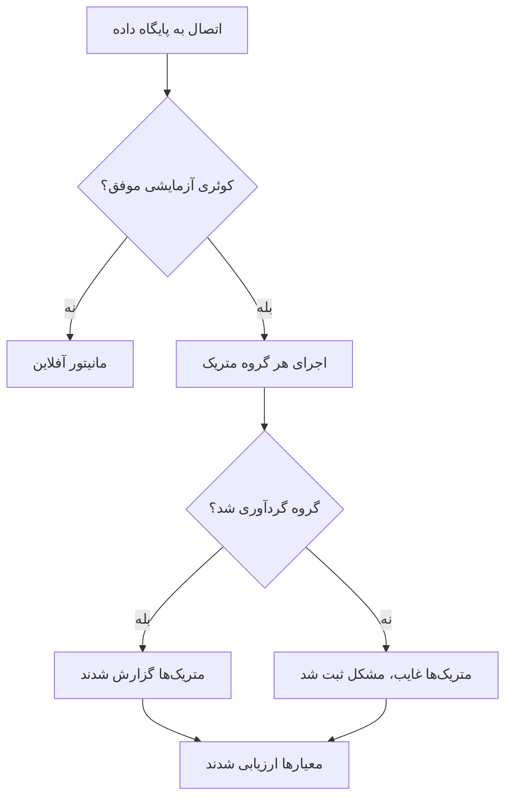

# مانیتور سلامت پایگاه داده

مانیتور Database Health طبق یک زمان‌بندی به PostgreSQL، MySQL یا Microsoft SQL Server وصل می‌شود و نشانه‌های سلامت خودِ سرور را گزارش می‌کند — حاشیهٔ اتصال‌ها، نشست‌های مسدودشده، تأخیر تکثیر، نسبت برخورد حافظهٔ نهان، اندازهٔ پایگاه داده، دورزدن شناسهٔ تراکنش و حدود سی مورد دیگر — تا بتوانید برای آن‌ها هشدار بگذارید، همان‌طور که برای از دسترس افتادن یک وب‌سایت هشدار می‌گذارید.

لازم نیست SQL بنویسید. پراب مجموعه‌ای ثابت از کوئری‌های کاتالوگ فقط‌خواندنی را اجرا می‌کند که بر اساس موتور انتخاب شده‌اند، و چند عدد نام‌دار را گزارش می‌کند.

:::cards
- [ساختن کاربر پایش](#ساختن-کاربر-پایش): مجوزهایی که هر موتور نیاز دارد. مهم‌ترین گام همین است.
- [ساختن مانیتور](#ساختن-یک-مانیتور-database-health): یک پراب را به سمت پایگاه داده بگیرید و انتخاب کنید چه چیزی گردآوری شود.
- [متریک‌های گردآوری‌شده](#متریکهای-گردآوریشده): همهٔ سری‌ها، همراه با موتورهایی که آن‌ها را گزارش می‌کنند.
- [تنظیم معیارها](#تنظیم-معیارها): برای اتصال‌ها، مسدودشدن، تأخیر و دورزدن شناسه هشدار بگذارید.
:::

## Database Health یا SQL Query؟

این دو نوع مانیتور پایگاه داده به پرسش‌های متفاوتی پاسخ می‌دهند و برای استفادهٔ هم‌زمان ساخته شده‌اند.

| | Database Health | [SQL Query](/docs/monitor/sql-monitor) |
|---|---|---|
| پرسشی که پاسخ می‌دهد | «آیا خودِ پایگاه داده سالم است؟» | «آیا داده‌های من همانی است که انتظار دارم؟» |
| کوئری | داخلی، جدا برای هر موتور، فقط‌خواندنی | کوئری خودتان |
| چه گزارش می‌کند | متریک‌های عددی نام‌دار ([متریک‌های گردآوری‌شده](#متریکهای-گردآوریشده) را ببینید) | تعداد ردیف‌ها، مقدار اسکالر، ردیف نخست، زمان اجرا |
| هشدار معمول | اتصال‌های در حال استفاده بالای ۹۰٪ | بیش از ۵۰ سفارش لغوشده در پنج دقیقهٔ گذشته |
| مجوزهای لازم | دسترسی خواندن آمار/DMVها — [ساختن کاربر پایش](#ساختن-کاربر-پایش) را ببینید | `SELECT` روی جدول‌هایی که کوئری شما با آن‌ها سروکار دارد |

اگر می‌خواهید برای یک شرط کسب‌وکاری هشدار بگذارید، از مانیتور SQL Query استفاده کنید. اگر می‌خواهید پیش از آنکه شرط کسب‌وکاری اصلاً فرصت خراب شدن پیدا کند بدانید که اتصال‌های سرور رو به اتمام است، از این مانیتور استفاده کنید.

## پایگاه‌های داده‌ای که پشتیبانی می‌شوند

| پایگاه داده | پورت پیش‌فرض |
|---|---|
| **PostgreSQL** | `5432` |
| **MySQL** | `3306` |
| **Microsoft SQL Server** | `1433` |

Azure SQL Database و Azure SQL Managed Instance به‌عنوان **Microsoft SQL Server** وصل می‌شوند. مجوزهای متفاوتی لازم دارند — [ساختن کاربر پایش](#ساختن-کاربر-پایش) را ببینید.

موتورهای سازگار با PostgreSQL و MySQL که همان پروتکل ارتباطی را به کار می‌برند معمولاً کار می‌کنند، ولی ممکن است نماهای آماری کمتری داشته باشند؛ در این صورت متریک‌های مربوط به‌جای گردآوری شدن، «در دسترس نیست» گزارش می‌شوند. فقط سه موتور بالا رسماً آزموده شده‌اند.

هر پایگاه داده‌ای که برنامه‌ها، خوشه‌ها و میزبان‌های شما به کار می‌برند — این سه موتور و بسیاری موتورهای دیگر — صفحهٔ خودش را هم دارد، با متریک‌های موتور، لاگ‌ها و سرویس‌هایی که آن را فراخوانی می‌کنند: [پایگاه‌های داده](/docs/telemetry/databases) را ببینید. وقتی میزبان و پورتی که یک مانیتور Database Health به آن وصل می‌شود یکی از نقطه‌های پایانی یک پایگاه داده باشد، هشدارها و حادثه‌های مانیتور در صفحهٔ آن پایگاه داده هم نشان داده می‌شوند ([هشدارهای یک پایگاه داده](/docs/telemetry/databases#alerts-on-a-database) را ببینید).

## چگونه کار می‌کند

در هر بررسی، یک پراب:

1. با اعتبارنامه‌هایی که تنظیم کرده‌اید به پایگاه داده وصل می‌شود.
2. یک کوئری آزمایشی سبک اجرا می‌کند. **این تنها دستوری است که شکستش می‌تواند مانیتور را آفلاین کند.**
3. کوئری‌های کاتالوگ هر [گروه متریک](#گروههای-متریک) فعال را یکی‌یکی اجرا می‌کند، هر کدام با یک مهلت زمانی برای دستور.
4. عددهایی را که گردآوری کرده گزارش می‌کند، به‌علاوهٔ یادداشتی برای هر گروهی که نتوانسته گردآوری کند، همراه با دلیل.



فقط تجمیع‌های عددی نام‌دار به OneUptime فرستاده می‌شوند. هیچ متن کوئری، هیچ ردیفی از جدول‌های شما و هیچ نام شِمایی از شبکهٔ شما بیرون نمی‌رود — کوئری‌ها نماهای آماری خودِ موتور را می‌خوانند (`pg_stat_activity`، `performance_schema.global_status`، `sys.dm_exec_sessions` و مانند آن‌ها)، هرگز داده‌های شما را.

چون بررسی از یک پراب اجرا می‌شود، کافی است پایگاه داده فقط از پراب در دسترس باشد. یک [پراب سفارشی](/docs/probe/custom-probe) داخل شبکهٔ خود بگذارید تا OneUptime اصلاً به هیچ مسیری تا پایگاه داده نیاز نداشته باشد.

## پیش از شروع

- یک **پراب** که از راه شبکه به میزبان و پورت پایگاه داده دسترسی داشته باشد. اگر پایگاه داده از اینترنت در دسترس است از پرابی که OneUptime میزبانی می‌کند استفاده کنید، وگرنه از یک [پراب سفارشی](/docs/probe/custom-probe) داخل شبکهٔ خود.
- یک **کاربر پایش** که طبق بخش بعدی ساخته شده باشد، و اطلاعات اتصال آن.

## ساختن کاربر پایش

**این مهم‌ترین گام است.** مانیتور نماهای آماری‌ای را می‌خواند که ورودهای معمولی اجازهٔ دیدنشان را ندارند، و ورودی که مجوز کافی ندارد همیشه با خطا شکست نمی‌خورد — در PostgreSQL پاسخ نادرست می‌دهد. یک ورود اختصاصی بسازید که دقیقاً همین مجوزها را داشته باشد و نه چیز دیگری.

### PostgreSQL

```sql
CREATE USER oneuptime_health WITH PASSWORD 'a-strong-password';
GRANT CONNECT ON DATABASE mydb TO oneuptime_health;
-- The one grant that matters. Without it, see the note below.
GRANT pg_monitor TO oneuptime_health;
```

`pg_monitor` یک نقش داخلی است (PostgreSQL 10 و تازه‌تر) که دسترسی خواندن به نماهای آماری و پایشی می‌دهد. هیچ دسترسی‌ای به جدول‌های شما نمی‌دهد.

> [!IMPORTANT]
> **چرا `pg_monitor` در PostgreSQL اختیاری نیست.** بدون آن، `pg_stat_activity` شکست نمی‌خورد — کوئری موفق می‌شود و فقط ردیف خودِ نشست پایش را برمی‌گرداند. آن‌وقت شمار اتصال‌ها برای همیشه `1`، نشست‌های مسدودشده `0` و تأخیر تکثیر `0` نشان داده می‌شود، روی سروری که در واقع آتش گرفته است. برای همین پراب **پیش از** اجرای آن کوئری‌ها بررسی می‌کند که ورود عضو `pg_monitor` (یا `pg_read_all_stats`) باشد یا ابرکاربر باشد. اگر هیچ‌کدام نباشد، پراب گروه‌های Connections، Activity و Locks را «در دسترس نیست» گزارش می‌کند، همراه با `GRANT`ی که لازم دارید. گزارش ندادن هیچ چیز پاسخ صادقانه است؛ گزارش دادن `1` نیست.

در سرویس مدیریت‌شده‌ای که `pg_monitor` در دسترس نیست، `pg_read_all_stats` همان نماها را پوشش می‌دهد. در Amazon RDS به `GRANT rds_superuser` نیازی نیست — `GRANT pg_monitor TO oneuptime_health;` به‌عنوان عضو `rds_superuser` کار می‌کند.

### MySQL

```sql
CREATE USER 'oneuptime_health'@'%' IDENTIFIED BY 'a-strong-password';
-- INNODB_TRX (open transactions, longest query) and replication status.
GRANT PROCESS, REPLICATION CLIENT ON *.* TO 'oneuptime_health'@'%';
-- Status counters, server variables, and lock waits.
GRANT SELECT ON performance_schema.* TO 'oneuptime_health'@'%';
-- Database size: information_schema.TABLES only shows tables the login can see.
GRANT SELECT ON mydb.* TO 'oneuptime_health'@'%';
FLUSH PRIVILEGES;
```

`performance_schema` در MySQL باید روشن باشد (`performance_schema = ON`، که از نسخهٔ 5.6 پیش‌فرض است). اگر خاموش باشد، گروه‌های Connections، Throughput و Locks «در دسترس نیست» گزارش می‌شوند و راه‌حل، راه‌اندازی دوبارهٔ سرور است، نه یک مجوز.

### Microsoft SQL Server و Azure SQL Managed Instance

```sql
-- A server-level grant only runs while the current database is master.
USE master;
CREATE LOGIN oneuptime_health WITH PASSWORD = 'a-strong-password';
-- Every DMV the monitor reads. On SQL Server 2022 and later,
-- VIEW SERVER PERFORMANCE STATE alone is also enough.
GRANT VIEW SERVER STATE TO oneuptime_health;

USE mydb;
CREATE USER oneuptime_health FOR LOGIN oneuptime_health;
```

اگر `GRANT VIEW SERVER STATE` از هر پایگاه دادهٔ دیگری اجرا شود، با Msg 4621 شکست می‌خورد: «Permissions at the server scope can only be granted when the current database is master».

> [!WARNING]
> **دسترسی خواندن به جدول‌هایتان کافی نیست.** ورودی که فقط می‌تواند داده بخواند — `db_datareader` یا هر نقش «دسترسی خواندن» دیگری — می‌تواند وصل شود و اندازهٔ پایگاه داده را می‌گیرد، و نه هیچ چیز دیگر. SQL Server نماهایی را که مانیتور می‌خواند با `The user does not have permission to perform this action.` (Msg 297) رد می‌کند. پیامِ پیش از آن می‌گوید چه چیزی رد شده است: Msg 300 `VIEW SERVER STATE` (در 2022 `VIEW SERVER PERFORMANCE STATE`) برای نماهای سرور، از جمله فضای لاگ تراکنش و فضای آزاد tempdb، یا Msg 262 `VIEW DATABASE STATE` (در 2022 `VIEW DATABASE PERFORMANCE STATE`) برای نمای تکثیر. مانیتور آنلاین می‌ماند، گزارش می‌کند که گروه‌های Connections، Activity، Throughput، Locks، Storage و Replication مجوز کم دارند، و `GRANT` بالا را کنارشان نشان می‌دهد. `VIEW SERVER STATE` همهٔ آن‌ها را پوشش می‌دهد.
>
> دو نما رد نمی‌کنند: بدون این مجوز، `sys.dm_exec_sessions` و `sys.dm_exec_requests` بی‌سروصدا فقط نشست خودِ مانیتور را نشان می‌دهند. مانیتور هرگز آن‌ها را به‌تنهایی نمی‌خواند — همیشه همراه نمایی که رد می‌کند — پس نبود یک مجوز هرگز به‌صورت «۱ اتصال» ثبت نمی‌شود.

### Azure SQL Database

Azure SQL Database مجوزهای سطح سرور ندارد — `GRANT VIEW SERVER STATE` آنجا شکست می‌خورد — پس همان نماها به‌جایش با یک مجوز سطح پایگاه داده باز می‌شوند. یک ورود در `master` بسازید، در پایگاه داده‌ای که پایش می‌کنید برایش یک کاربر بسازید، و مجوز را همان‌جا بدهید، نه در `master`:

```sql
-- Connected to master, as the server admin:
CREATE LOGIN oneuptime_health WITH PASSWORD = 'a-strong-password';

-- Connected to the monitored database:
CREATE USER oneuptime_health FOR LOGIN oneuptime_health;
GRANT VIEW DATABASE STATE TO oneuptime_health;
```

این برای پایگاه‌های دادهٔ vCore و پایگاه‌های دادهٔ DTU از S2 به بالا کافی است. در **Basic، S0 و S1**، و برای هر پایگاه داده‌ای در یک **استخر کشسان**، Azure فقط به سرپرست سرور، سرپرست Microsoft Entra یا اعضای نقش سرور `##MS_ServerStateReader##` اجازهٔ خواندن این نماها را می‌دهد، هر چه مجوزهای پایگاه داده بگویند. در این حالت سرپرست سرور ورود را به آن نقش هم اضافه می‌کند:

```sql
-- Connected to master, as the server admin:
ALTER SERVER ROLE ##MS_ServerStateReader## ADD MEMBER oneuptime_health;
```

`##MS_ServerStateReader##` در همهٔ سطح‌های سرویس کار می‌کند، پس اگر `VIEW DATABASE STATE` کافی نبود، راه جایگزین هم همین است. عضویت تازه در یک نقش ممکن است چند دقیقه طول بکشد تا اعمال شود و فقط به اتصال‌های تازه می‌رسد؛ پراب در هر بررسی یک اتصال تازه باز می‌کند.

یک کاربر پایگاه دادهٔ مستقل (`CREATE USER oneuptime_health WITH PASSWORD = '...'` در پایگاه دادهٔ پایش‌شده، بدون ورود) از S2 به بالا با `VIEW DATABASE STATE` کار می‌کند، ولی نمی‌تواند به `##MS_ServerStateReader##` بپیوندد: نقش‌های سرور فقط ورودها را می‌پذیرند. برای بردن یک کاربر مستقل به آن نقش، آن را حذف کنید (`DROP USER oneuptime_health;`) و دستورهای بالا را دنبال کنید.

پراب Azure SQL Database را از روی `SERVERPROPERTY('EngineEdition')` می‌شناسد، نه از روی نسخه‌اش — Azure SQL Database هر چه واقعاً اجرا کند `12.0.2000.8` را گزارش می‌دهد که مثل SQL Server 2014 خوانده می‌شود. برای همین **Engine** مانیتور `Azure SQL Database 12.0.2000.8` را نشان می‌دهد، و نبود مجوز به‌صورت دستور Azure بالا نشان داده می‌شود، هرگز به‌صورت `VIEW SERVER STATE`.

- **تکثیر در Azure SQL Database گردآوری نمی‌شود.** Azure SQL Database نمای `sys.dm_hadr_database_replica_states` را ندارد، پس گروه Replication آنجا نادیده گرفته می‌شود، به‌جای اینکه در هر بررسی شکست‌خورده گزارش شود. نماهای تکثیر خودِ Azure (`sys.dm_database_replica_states`، `sys.dm_geo_replication_link_status`) هنوز خوانده نمی‌شوند.
- **اتصال‌ها برای هر پایگاه داده جدا شمرده می‌شوند.** با `VIEW DATABASE STATE`، Azure SQL Database فقط نشست‌های پایگاه دادهٔ پایش‌شده را نشان می‌دهد، پس Connections همان پایگاه داده را می‌شمارد، نه سرور منطقی را. هر پایگاه داده‌ای را که برایتان مهم است جداگانه پایش کنید.
- **در یک استخر کشسان، TempDB Free Space مقدار کل استخر است.** پایگاه‌های دادهٔ یک استخر یک tempdb مشترک دارند.

## ساختن یک مانیتور Database Health

:::steps
### یک مانیتور تازه را آغاز کنید

به **مانیتورها** بروید و روی **ساخت مانیتور** کلیک کنید. زیر **نوع مانیتور**، روی **انواع دیگر مانیتور** کلیک کنید و **Database Health** را زیر **Database Monitoring** برگزینید، یا `health` را در کادر جست‌وجو بنویسید. یک **نام** وارد کنید و سپس روی **بعدی** کلیک کنید.

### اطلاعات اتصال را وارد کنید

**Database Type** را برگزینید، سپس میزبان، پورت، نام پایگاه داده و اعتبارنامه‌های کاربر پایش را پر کنید. به‌جای تایپ کردن رمز عبور، آن را به‌صورت یک [راز مانیتور](#استفاده-از-راز-مانیتور-برای-رمز-عبور) ارجاع دهید. هر فیلد در [پیکربندی](#پیکربندی) شرح داده شده است.

### برگزینید چه چیزی گردآوری شود

همهٔ گروه‌های زیر **Metric Groups** را روشن بگذارید، مگر اینکه دلیلی برای خاموش کردن یکی از آن‌ها داشته باشید — [گروه‌های متریک](#گروههای-متریک) را ببینید.

### اتصال را آزمایش کنید

روی **آزمایش مانیتور** کلیک کنید تا پیش از ذخیره یک بررسی اجرا شود، و ببینید چه چیزی گردآوری کرده است.

### معیارها را مشخص کنید

معیارهایی را که مانیتور با آن‌ها آغاز می‌شود مرور کنید و معیارهای خودتان را اضافه کنید — [تنظیم معیارها](#تنظیم-معیارها) را ببینید. سپس روی **بعدی** کلیک کنید.

### پراب‌ها را برگزینید و بسازید

**پراب‌ها**یی را که به پایگاه داده دسترسی دارند و یک **بازه پایش** برگزینید، سپس روی **ساخت مانیتور** کلیک کنید.
:::

## پیکربندی

| فیلد | چه وارد کنید |
|---|---|
| **Database Type** | PostgreSQL، MySQL یا Microsoft SQL Server. انتخاب نوع، پورت پیش‌فرض را تنظیم می‌کند و تعیین می‌کند کدام کوئری‌ها اجرا شوند. |
| **میزبان** | میزبان پایگاه داده که از پراب در دسترس است (برای نمونه `db.internal`). |
| **پورت** | پورت پایگاه داده. |
| **نام پایگاه داده** | پایگاه داده‌ای که به آن وصل می‌شوید. متریک‌های سطح پایگاه داده (اندازه، نسبت برخورد حافظهٔ نهان، سرریز به فایل‌های موقت) برای همین پایگاه داده گزارش می‌شوند؛ متریک‌های سطح سرور (اتصال‌ها، زمان کارکرد، تکثیر) برای کل سرور — جز در Azure SQL Database که اتصال‌ها فقط برای پایگاه دادهٔ پایش‌شده شمرده می‌شوند. |
| **Use Windows Integrated Authentication** | فقط Microsoft SQL Server. احراز هویت با هویت فرایند پراب، به‌جای نام کاربری و رمز عبور. [احراز هویت یکپارچهٔ ویندوز](/docs/monitor/sql-monitor) را در صفحهٔ مانیتور SQL Query ببینید — راه‌اندازی یکسان است. |
| **نام کاربری** | کاربر پایش. الزامی است، مگر اینکه از احراز هویت یکپارچهٔ ویندوز استفاده کنید. |
| **رمز عبور** | رمز عبور. به‌جای تایپ کردنش به‌صورت متن ساده، با `{{monitorSecrets.name}}` به یک [راز مانیتور](/docs/monitor/monitor-secrets) ارجاع دهید ([استفاده از راز مانیتور](#استفاده-از-راز-مانیتور-برای-رمز-عبور) را ببینید). |
| **Use SSL/TLS** | اتصال از راه TLS. وقتی روشن است، می‌توانید برای یک گواهی خودامضا **Verify server certificate** را خاموش کنید. |
| **Metric Groups** | کدام گروه‌ها اجرا شوند: Connections، فعالیت، Throughput، Locks and Blocking، ذخیره‌سازی، Replication و نگهداری. همه به‌طور پیش‌فرض روشن‌اند؛ [گروه‌های متریک](#گروههای-متریک) را ببینید. جزئیات مانیتور آن‌ها را با عنوان **Collected Metric Groups** فهرست می‌کند. |

### فیلدهای بیشتر

| فیلد | پیش‌فرض | بیشینه | چه چیزی را محدود می‌کند |
|---|---|---|---|
| **Connection Timeout (ms)** | `10000` | `30000` | مدت انتظار برای برقرار شدن اتصال. |
| **Statement Timeout (ms)** | `10000` | `60000` | سقف زمان هر کوئری کاتالوگ. |

مهلت پیش‌فرض دستورها عمداً از مانیتور SQL Query تنگ‌تر است: این کوئری‌ها روی یک سرور سالم در چند میلی‌ثانیه پاسخ می‌دهند، پس اگر `pg_stat_activity` ده ثانیه طول بکشد، نشانهٔ مفید این است که «این سرور گرفتار است»، نه انتظار بیشتر. مقداری بالاتر از بیشینه تا بیشینه پایین آورده می‌شود.

## استفاده از راز مانیتور برای رمز عبور

تا رمز عبور هرگز به‌صورت متن ساده روی مانیتور ذخیره نشود:

:::steps
1. به **مانیتورها → تنظیمات → اسرار** بروید و یک [راز مانیتور](/docs/monitor/monitor-secrets) بسازید.
2. نامی برایش بگذارید (برای نمونه `dbPassword`) و به این مانیتور اجازهٔ دسترسی به آن را بدهید.
3. در فیلد **رمز عبور** مانیتور، `{{monitorSecrets.dbPassword}}` را وارد کنید.
:::

راز پیش از آنکه پیکربندی به پراب سپرده شود در سمت سرور جایگزین می‌شود. فیلدهای میزبان، نام کاربری و نام پایگاه داده هم همین ارجاع را می‌پذیرند. اعتبارنامه‌ها هرگز در لاگ‌ها، فیدهای مانیتور یا قالب‌های هشدار نوشته نمی‌شوند.

## گروه‌های متریک

گروه واحدی است که روشن یا خاموشش می‌کنید، و واحدی که نبود یک مجوز برایش گزارش می‌شود. گروه‌ها برای این هستند که نبود یک مجوز فقط یک گروه را از شما بگیرد، نه کل مانیتور را. دستورهای یک گروه یکی‌یکی اجرا می‌شوند، پس یک گروه می‌تواند بخشی‌اش گردآوری شده باشد: در این صورت هم در `collectedGroups` و هم در `unavailableGroups` می‌آید. حالت رایج، گروه Storage در SQL Server برای ورودی بدون `VIEW SERVER STATE` است — اندازهٔ پایگاه داده گردآوری می‌شود، ولی فضای لاگ و فضای آزاد tempdb نه.

| گروه | چه گردآوری می‌کند | نیاز دارد |
|---|---|---|
| Connections | شمار اتصال‌ها، سقف پیکربندی‌شده، اتصال‌های نیمه‌کاره‌مانده، زمان کارکرد سرور | PostgreSQL: `pg_monitor`. MySQL: `performance_schema`. SQL Server: `VIEW SERVER STATE` |
| Activity | طولانی‌ترین کوئری در حال اجرا، طولانی‌ترین تراکنش باز، تراکنش‌های باز | PostgreSQL: `pg_monitor`. MySQL: `PROCESS`. SQL Server: `VIEW SERVER STATE` |
| Throughput | تراکنش‌ها، کوئری‌ها، نسبت برخورد حافظهٔ نهان، خواندن و نوشتن دیسک، زمان I/O | PostgreSQL: چیزی جز `CONNECT` لازم نیست. MySQL: `performance_schema`. SQL Server: `VIEW SERVER STATE` |
| Locks | نشست‌های مسدودشده، انتظار برای قفل، بن‌بست‌ها، انتظار برای قفل جدول | PostgreSQL: `pg_monitor`. MySQL: `performance_schema`. SQL Server: `VIEW SERVER STATE` |
| Storage | اندازهٔ پایگاه داده، سرریز به فایل‌های موقت، فضای لاگ، فضای آزاد tempdb | PostgreSQL: چیزی جز `CONNECT` لازم نیست. MySQL: `SELECT` روی پایگاه داده. SQL Server: برای اندازهٔ پایگاه داده چیزی لازم نیست؛ برای فضای لاگ و فضای آزاد tempdb `VIEW SERVER STATE` |
| Replication | رونوشت‌های متصل، تأخیر تکثیر بر حسب ثانیه و بایت، اسلات‌های غیرفعال، وضعیت بازیابی | PostgreSQL: `pg_monitor`. MySQL: `REPLICATION CLIENT`. SQL Server: `VIEW SERVER STATE`؛ در Azure SQL Database گردآوری نمی‌شود |
| Maintenance | حاشیهٔ باقی‌مانده تا دورزدن شناسهٔ تراکنش، تاپل‌های مرده، جدول‌هایی که autovacuum هرگز سراغشان نرفته، چک‌پوینت‌ها | PostgreSQL: `pg_monitor` |

در Azure SQL Database، هر جا این جدول `VIEW SERVER STATE` می‌گوید، `VIEW DATABASE STATE` بخوانید — یا در Basic، S0، S1 و استخرهای کشسان `##MS_ServerStateReader##`. [Azure SQL Database](#azure-sql-database) را ببینید.

خاموش کردن یک گروه بی‌صدا انجام می‌شود: نه متریکی، نه مشکل گردآوری‌ای، نه هشداری. در دو حالت این کار درست است:

- **نمی‌توانید مجوز را بگیرید.** خاموش کردن گروه جلوی تکرار مشکل گردآوری در هر بررسی را می‌گیرد.
- **کوئری‌ها بیش از حد پرهزینه‌اند.** در MySQL، **ذخیره‌سازی** گزینهٔ معمول است: اندازهٔ پایگاه داده از جمع زدن `information_schema.TABLES` به دست می‌آید که روی شِمایی با ده‌ها هزار جدول ارزان نیست و در هر بررسی اجرا می‌شود. آن را خاموش کنید، یا آن مانیتور را به بازهٔ پنج‌دقیقه‌ای ببرید.

برداشتن تیک همهٔ گروه‌ها راهی برای گردآوری نکردن هیچ چیز نیست — یک فهرست خالی دوباره به همهٔ گروه‌ها برگردانده می‌شود، پس مانیتور هرگز در حالتی ذخیره نمی‌شود که بی‌صدا هیچ چیزی گردآوری نکند.

## وقتی یک متریک گردآوری نمی‌شود چه رخ می‌دهد

**نبود یک مجوز هرگز مانیتور را آفلاین نمی‌کند.** این مهم‌ترین رفتار این نوع مانیتور است و ارزش دارد دقیق بیان شود.

| چه چیزی شکست می‌خورد | وضعیت مانیتور | آنچه می‌بینید |
|---|---|---|
| **اتصال**، یا کوئری آزمایشی — اعتبارنامهٔ نادرست، اتصال ردشده، شکست TLS، پایان مهلت اتصال | **آفلاین** | `Database Is Online` برابر false است، و هر حادثه و سیاست آنکالی که به آن وصل کرده‌اید فعال می‌شود. |
| **یک گروه** — نبود مجوز، `performance_schema` خاموش، پایان مهلت دستور | **آنلاین می‌ماند** | متریک‌هایی که آن گروه نتوانسته بخواند **غایب‌اند**، نه صفر. هیچ خطی در نمودار کشیده نمی‌شود، هیچ آستانه‌ای روی آن سری‌ها جور نمی‌شود، و هیچ حادثه‌ای از آن‌ها برنمی‌خیزد. بررسی یک مشکل گردآوری ثبت می‌کند که نام گروه، دلیل و — اگر باشد — `GRANT` دقیقی را که باید اجرا شود در بر دارد؛ این در خلاصهٔ مانیتور نشان داده می‌شود و در **Metric Groups Failed** شمرده می‌شود. |
| **موتور اصلاً نمی‌تواند متریک را فراهم کند** — MySQL استاندارد شمارندهٔ بن‌بست ندارد؛ SQL Server به‌طور پیش‌فرض سقف اتصال خود را نامحدود می‌گذارد، پس «درصد استفاده‌شده» معنایی ندارد | **آنلاین می‌ماند** | متریک فقط وجود ندارد. این **یک مشکل گردآوری نیست**، در Metric Groups Failed شمرده نمی‌شود و چیزی هم برای درست کردن نیست. ستون Engines را در [متریک‌های گردآوری‌شده](#متریکهای-گردآوریشده) ببینید. |

غایب همیشه یعنی غایب. مقداری که اندازه‌گیری نشده هرگز `0` گزارش نمی‌شود، چون نموداری پر از صفرهای ساختگی از یک جای خالی بدتر است — جای خالی را دست‌کم می‌توانید ببینید.

> [!TIP]
> برای هشدار دربارهٔ از دست رفتن دید، از `Database Collection Error` یا یک آستانه روی **Metric Groups Failed** استفاده کنید. هر دو را هشدار بگذارید نه حادثه: مجوزی که پس گرفته شده یک تیکت است، نه یک فراخوان آنکال.

### "The user does not have permission to perform this action"

این پیام SQL Server (Msg 297) برای ورودی است که می‌تواند وصل شود ولی نمی‌تواند نماهای وضعیت سرور را بخواند. همیشه به معنای نبود یک مجوز است، هرگز به معنای خرابی در پایگاه داده. SQL Server آن را دوم می‌فرستد، پس از پیامی که مجوز ردشده را نام می‌برد، و مانیتور هر دو را نشان می‌دهد: برای نمونه `VIEW SERVER STATE permission was denied on object 'server', database 'master'. The user does not have permission to perform this action.` کنار آن دستوری می‌آید که مشکل را برای سکویی که پراب به آن وصل شده برطرف می‌کند:

- **SQL Server یا Azure SQL Managed Instance** — `GRANT VIEW SERVER STATE TO oneuptime_health;`، اجراشده در `master` (مانیتور آن را به‌صورت `GRANT VIEW SERVER STATE TO [<monitoring_login>]; -- run in master` نشان می‌دهد).
- **Azure SQL Database** — `GRANT VIEW DATABASE STATE TO oneuptime_health;`، اجراشده در پایگاه دادهٔ پایش‌شده؛ در Basic، S0، S1 و استخرهای کشسان، به‌جایش عضویت در `##MS_ServerStateReader##`. [Azure SQL Database](#azure-sql-database) را ببینید.

در این میان اندازهٔ پایگاه داده همچنان گردآوری می‌شود، چون تنها متریک گروه Storage است که هر ورودی می‌تواند بخواند.

## متریک‌های گردآوری‌شده

چهل‌ویک سری در هشت دسته. ستون Engines موتورهایی را نام می‌برد که واقعاً می‌توانند آن سری را فراهم کنند؛ در هر موتور دیگری آن سری فقط وجود ندارد. ستون Group گروه گردآوری‌ای است که سری به آن تعلق دارد — همان چیزی که روشن و خاموشش می‌کنید و همان چیزی که با هم از دست می‌رود.

### دسترس‌پذیری

| متریک | سری | Group | Engines |
|---|---|---|---|
| **Uptime** (s) | `oneuptime.monitor.database.uptime.seconds` | Connections | PostgreSQL, MySQL, SQL Server |
| **Metric Groups Failed** | `oneuptime.monitor.database.metric.groups.failed` | Connections | PostgreSQL, MySQL, SQL Server |

### اتصال‌ها

| متریک | سری | Group | Engines |
|---|---|---|---|
| **Connections** | `oneuptime.monitor.database.connections.total` | Connections | PostgreSQL, MySQL, SQL Server |
| **Active Connections** | `oneuptime.monitor.database.connections.active` | Connections | PostgreSQL, MySQL, SQL Server |
| **Maximum Connections** | `oneuptime.monitor.database.connections.max` | Connections | PostgreSQL, MySQL |
| **Connections Used** (%) | `oneuptime.monitor.database.connections.used.percent` | Connections | PostgreSQL, MySQL |
| **Idle In Transaction** | `oneuptime.monitor.database.connections.idle.in.transaction` | Connections | PostgreSQL |
| **Aborted Connects** | `oneuptime.monitor.database.connections.aborted.total` | Connections | MySQL |

### توان عملیاتی

| متریک | سری | Group | Engines |
|---|---|---|---|
| **Transactions** | `oneuptime.monitor.database.transactions.total` | Throughput | PostgreSQL, SQL Server |
| **Queries** | `oneuptime.monitor.database.queries.total` | Throughput | MySQL, SQL Server |
| **Slow Queries** | `oneuptime.monitor.database.queries.slow.total` | Throughput | MySQL |
| **Rollback Ratio** (%) | `oneuptime.monitor.database.rollback.percent` | Throughput | PostgreSQL |
| **Longest Running Query** (s) | `oneuptime.monitor.database.query.longest.seconds` | Activity | PostgreSQL, MySQL, SQL Server |
| **Longest Open Transaction** (s) | `oneuptime.monitor.database.transaction.longest.seconds` | Activity | PostgreSQL, MySQL, SQL Server |
| **Open Transactions** | `oneuptime.monitor.database.transaction.open.count` | Activity | MySQL |

### قفل‌ها و مسدودشدن

| متریک | سری | Group | Engines |
|---|---|---|---|
| **Blocked Sessions** | `oneuptime.monitor.database.sessions.blocked` | Locks | PostgreSQL, MySQL, SQL Server |
| **Lock Waits** | `oneuptime.monitor.database.locks.waiting` | Locks | PostgreSQL, MySQL, SQL Server |
| **Deadlocks** | `oneuptime.monitor.database.deadlocks.total` | Locks | PostgreSQL, SQL Server |
| **Table Lock Waits** | `oneuptime.monitor.database.table.locks.waited.total` | Locks | MySQL |

MySQL استاندارد هیچ نوع شمارندهٔ بن‌بستی ارائه نمی‌کند، برای همین Deadlocks فقط در PostgreSQL و SQL Server هست.

### حافظهٔ نهان و I/O

| متریک | سری | Group | Engines |
|---|---|---|---|
| **Cache Hit Ratio** (%) | `oneuptime.monitor.database.cache.hit.percent` | Throughput | PostgreSQL, MySQL, SQL Server |
| **Disk Reads** | `oneuptime.monitor.database.disk.reads.total` | Throughput | PostgreSQL, MySQL, SQL Server |
| **Disk Writes** | `oneuptime.monitor.database.disk.writes.total` | Throughput | MySQL, SQL Server |
| **I/O Read Time** (ms) | `oneuptime.monitor.database.io.read.time.ms` | Throughput | PostgreSQL, SQL Server |
| **I/O Write Time** (ms) | `oneuptime.monitor.database.io.write.time.ms` | Throughput | PostgreSQL, SQL Server |
| **Page Life Expectancy** (s) | `oneuptime.monitor.database.page.life.expectancy.seconds` | Throughput | SQL Server |
| **Memory Grants Pending** | `oneuptime.monitor.database.memory.grants.pending` | Throughput | SQL Server |

PostgreSQL زمان خواندن و نوشتن I/O را فقط وقتی اندازه می‌گیرد که `track_io_timing` روشن باشد. این گزینه به‌طور پیش‌فرض خاموش است و در این حالت PostgreSQL هر دو را `0` گزارش می‌کند — پس در PostgreSQL صفرِ ثابت در این دو سری معمولاً یعنی «اندازه‌گیری نشده»، نه «سریع». این یک تنظیم سرور است، نه مشکل مجوز.

### فضای ذخیره‌سازی

| متریک | سری | Group | Engines |
|---|---|---|---|
| **Database Size** (بایت) | `oneuptime.monitor.database.size.bytes` | Storage | PostgreSQL, MySQL, SQL Server |
| **Temp Bytes Written** (بایت) | `oneuptime.monitor.database.temp.bytes.total` | Storage | PostgreSQL |
| **Temp Disk Tables** | `oneuptime.monitor.database.temp.disk.tables.total` | Storage | MySQL |
| **Log Space Used** (%) | `oneuptime.monitor.database.log.space.used.percent` | Storage | SQL Server |
| **TempDB Free Space** (بایت) | `oneuptime.monitor.database.tempdb.free.bytes` | Storage | SQL Server |

### تکثیر

| متریک | سری | Group | Engines |
|---|---|---|---|
| **Connected Replicas** | `oneuptime.monitor.database.replica.count` | Replication | PostgreSQL, SQL Server |
| **Replication Lag** (s) | `oneuptime.monitor.database.replication.lag.seconds` | Replication | PostgreSQL, MySQL |
| **Replication Lag (Bytes)** (بایت) | `oneuptime.monitor.database.replication.lag.bytes` | Replication | PostgreSQL, SQL Server |
| **Is In Recovery** | `oneuptime.monitor.database.is.in.recovery` | Replication | PostgreSQL |
| **Inactive Replication Slots** | `oneuptime.monitor.database.replication.slots.inactive` | Replication | PostgreSQL |

متریک‌های تکثیر از همان سمتی از پیوند گزارش می‌شوند که مانیتور به آن وصل است. یک مانیتور را به سمت سرور اصلی بگیرید تا رونوشت‌های متصل و صف ارسال را ببینید؛ برای هر سرور آماده‌به‌کار هم یک مانیتور بگذارید تا ببینید همان سرور واقعاً چقدر عقب است.

تأخیر بر حسب ثانیه روی یک سرور اصلی بیکار صفر نشان داده می‌شود، حتی وقتی یک رونوشت خیلی عقب است، چون چیز تازه‌ای نوشته نشده است. **Replication Lag (Bytes)** این نقطهٔ کور را ندارد، پس برای هر دو هشدار بگذارید.

### نگهداری

| متریک | سری | Group | Engines |
|---|---|---|---|
| **Transaction ID Used** (%) | `oneuptime.monitor.database.transaction.id.used.percent` | Maintenance | PostgreSQL |
| **Dead Tuples** | `oneuptime.monitor.database.dead.tuples` | Maintenance | PostgreSQL |
| **Tables Never Autovacuumed** | `oneuptime.monitor.database.tables.never.autovacuumed` | Maintenance | PostgreSQL |
| **Requested Checkpoints** | `oneuptime.monitor.database.checkpoints.requested.total` | Maintenance | PostgreSQL |
| **Timed Checkpoints** | `oneuptime.monitor.database.checkpoints.timed.total` | Maintenance | PostgreSQL |

> [!IMPORTANT]
> **Transaction ID Used** سزاوار یک معیار روی هر مانیتور PostgreSQL است که می‌سازید. وقتی به ۱۰۰٪ برسد PostgreSQL همهٔ نوشتن‌ها را رد می‌کند، بازیابی به یک vacuum در حالت تک‌کاربره با پایگاه دادهٔ خاموش نیاز دارد، و تقریباً هیچ‌کس آن را زیر نظر ندارد. خیلی پیش از لبهٔ پرتگاه هشدار بگذارید — ۸۰٪ در بیشتر بارهای کاری چند روز حاشیه می‌دهد.

شمارنده‌هایی که به `total` ختم می‌شوند از زمان راه‌اندازی سرور تجمعی‌اند. برای به دست آوردن نرخ، دو نقطهٔ زمانی را مقایسه کنید؛ یک مقدار تنها فقط در برابر تاریخچهٔ خودش معنا دارد، و با راه‌اندازی دوبارهٔ سرور به صفر برمی‌گردد (چیزی که **Uptime** به شما نشان می‌دهد).

## تنظیم معیارها

| نوع فیلتر | چه چیزی را بررسی می‌کند |
|---|---|
| **Database Is Online** | اینکه پایگاه داده در دسترس بود و کوئری آزمایشی موفق شد یا نه. این همان معیار آفلاینی است که مانیتور با آن ساخته می‌شود، و تنها بررسی‌ای که دسترس‌پذیری را نشان می‌دهد. |
| **Database Metric** | یک متریک برگزینید، سپس مقایسه‌اش کنید: Greater Than، Less Than، Greater Than Or Equal To، Less Than Or Equal To، Equal To یا Not Equal To. انتخابگر متریک فقط متریک‌هایی را پیشنهاد می‌دهد که موتور انتخاب‌شدهٔ شما می‌تواند فراهم کند، پس نمی‌توانید معیاری بسازید که برای همیشه برآورده‌نشده بماند (یک استثنا: متریک‌های Replication که برای Microsoft SQL Server پیشنهاد می‌شوند، در Azure SQL Database هرگز گردآوری نمی‌شوند). اگر متریک در یک بررسی گردآوری نشده باشد — گروه شکست خورده، یا موتور آن را گزارش نمی‌کند — فیلتر جور نمی‌شود، و به‌صورت «false» هم جور نمی‌شود: نادیده گرفته می‌شود. یک مشکل مجوز نمی‌تواند کسی را فرابخواند. |
| **Database Collection Error** | خلاصهٔ مشکلات گردآوری در بررسی، یک «گروه: پیام» برای هر گروه در دسترس نبوده. وقتی خالی نیست هشدار بگذارید تا از دست رفتن دید را بفهمید، یا از Contains استفاده کنید تا یک گروه خاص را زیر نظر بگیرید. |
| **JavaScript Expression** | کنترل کامل. [عبارت‌های JavaScript](/docs/monitor/javascript-expression) را ببینید. |

آستانه‌ها عدد صحیح‌اند. `90` بنویسید، نه `90.5` — درصدها و ثانیه‌ها به‌صورت عدد صحیح مقایسه می‌شوند.

**Database Is Online** و **Database Metric** را می‌توان در طول زمان بررسی کرد: تیک **این معیار را در یک بازه زمانی ارزیابی کن** را بزنید، سپس در **ارزیابی** برگزینید که مقدارها چگونه سنجیده شوند (برای نمونه **All Values**) و **در (دقیقه) گذشته** را پر کنید. در طول زمان، تنظیم **اگر داده‌ای نبود** در فیلتر تعیین می‌کند مقدار غایب چه معنایی دارد؛ آن را روی **Ignore** نگه دارید تا نبود یک مجوز همچنان نتواند کسی را فرابخواند.

### متغیرهای عبارت JavaScript

برای یک مانیتور Database Health، عبارت به این متغیرها دسترسی دارد:

| متغیر | نوع | شرح |
|---|---|---|
| `isOnline` | boolean | اینکه هم اتصال و هم کوئری آزمایشی موفق شدند یا نه |
| `engineVersion` | string | رشتهٔ نسخه‌ای که سرور گزارش داد (در SQL Server همان `ProductVersion` خام؛ خلاصهٔ مانیتور نام سکو را کنارش می‌آورد) |
| `connectionError` | string | خطای اتصال پاک‌سازی‌شده، و خالی وقتی خطایی نبوده |
| `collectedGroups` | array | گروه‌هایی که در این بررسی مقدار تولید کردند |
| `unavailableGroups` | array | گروه‌هایی که دستوری داشتند که گردآوری نشد، هر کدام با دلیل و راه‌حل. گروهی که بخشی‌اش گردآوری شده در هر دو فهرست هست |
| `metrics` | object | مقدارهای گردآوری‌شده با نام سری به‌عنوان کلید؛ سری‌ای که گردآوری نشده وجود ندارد |

```javascript
{{isOnline}} === true && {{collectedGroups}}.length >= 5
```

برای خواندن یک متریک در یک عبارت، کل شیء `metrics` را با اندیس بخوانید — نام سری‌ها نقطه دارند، پس نمی‌توانند داخل آکولادها بیایند:

```javascript
{{metrics}}['oneuptime.monitor.database.connections.used.percent'] > 90
```

برای آستانه روی یک متریک تنها، به‌جای عبارت سراغ **Database Metric** بروید: سری را برایتان پیدا می‌کند، فقط چیزی را پیشنهاد می‌دهد که موتور شما می‌تواند فراهم کند، و وقتی مقدار گردآوری نشده بررسی را نادیده می‌گیرد، به‌جای اینکه با هیچ مقایسه کند.

### نمونه: یک سرور اصلی PostgreSQL

| ترتیب | معیار | فیلتر |
|---|---|---|
| ۱ | **آفلاین** | `Database Is Online` برابر `false` است. |
| ۲ | **کاهش کارایی** | `Database Metric` → Connections Used بزرگ‌تر از `90` است، که در ۵ دقیقه با All Values ارزیابی می‌شود تا یک جهش تکی کسی را فرانخواند. |
| ۳ | **کاهش کارایی** | `Database Metric` → Transaction ID Used بزرگ‌تر از `80` است. |
| ۴ | **کاهش کارایی** | `Database Metric` → Blocked Sessions در ۵ دقیقه بزرگ‌تر از `0` است. |
| ۵ | **Online** | `Database Is Online` برابر `true` است. |

معیارها از بالا به پایین ارزیابی می‌شوند و نخستین جور شدن برنده است، پس معیارهای هشدار را اول و معیار سالم را آخر بگذارید.

یک سیاست آنکال به معیار آفلاین وصل کنید، و هر چیزی را که از **Metric Groups Failed** یا `Database Collection Error` برمی‌آید به‌صورت هشداری بدون سیاست آنکال باقی بگذارید.

## نکته‌هایی که باید در نظر گرفت

- **کوئری‌ها در هر بررسی اجرا می‌شوند.** طراحی‌شان کم‌هزینه است، ولی «کم‌هزینه» نسبت به بازه سنجیده می‌شود. بازهٔ یک‌دقیقه‌ای روی سروری با هزاران نشست یعنی پیمایش `pg_stat_activity` بیش از آنچه شاید بخواهید؛ برای متریک‌های ظرفیت، پنج دقیقه کاملاً کافی است.
- **مانیتور را به سمت پایگاه داده‌ای بگیرید که برایتان مهم است.** اندازه، نسبت برخورد حافظهٔ نهان و سرریز به فایل‌های موقت برای هر پایگاه داده جداست. اتصال‌ها، زمان کارکرد و تکثیر برای کل سرورند و از هر پایگاه داده‌ای روی آن نمونه یکسان خوانده می‌شوند.
- **برای هر نمونه یک مانیتور، نه برای هر پایگاه داده**، مگر اینکه مشخصاً متریک‌های اندازه و حافظهٔ نهان را برای هر پایگاه داده بخواهید — وگرنه کوئری‌های سطح سرور را بدون هیچ اطلاعات تازه‌ای چند برابر می‌کنید. Azure SQL Database استثناست: اتصال‌ها را برای هر پایگاه داده جدا گزارش می‌کند، پس آنجا هر پایگاه داده را پایش کنید.
- **روی نرخ‌ها هشدار بگذارید، نه روی شمارنده‌ها.** هر چیزی که به `total` ختم شود فقط بالا می‌رود، پس آستانهٔ «بزرگ‌تر از» روی آن یک بار برانگیخته می‌شود و هرگز بازیابی نمی‌شود. آن را در نمودار ببینید، یا در یک پنجرهٔ زمانی مقایسه‌اش کنید.
- **راز مانیتور را به رمز عبور متن ساده ترجیح دهید.** آن‌وقت اعتبارنامه در حالت ذخیره رمزنگاری‌شده می‌ماند و هرگز روی مانیتور نشان داده نمی‌شود.
- **مانیتور هرگز چیزی نمی‌نویسد.** هر کوئری خواندنی از یک نمای آماری است — در PostgreSQL درون یک تراکنش فقط‌خواندنی، در MySQL در یک نشست فقط‌خواندنی. آنچه نتواند بخواند به‌صورت متریک غایب گزارش می‌شود، هرگز به‌صورت قطعی.

## عیب‌یابی

:::details مانیتور آفلاین است، ولی پایگاه داده کار می‌کند
آفلاین یعنی پراب نتوانسته وصل شود یا کوئری آزمایشی شکست خورده است: میزبان یا پورت از پراب در دسترس نیست، ورود رد شده، TLS شکست خورده یا مهلت اتصال تمام شده است. خلاصهٔ مانیتور خطا را نشان می‌دهد. بررسی کنید که پراب به پایگاه داده دسترسی داشته باشد (پرابی که OneUptime میزبانی می‌کند به نشانی عمومی نیاز دارد؛ وگرنه از یک [پراب سفارشی](/docs/probe/custom-probe) استفاده کنید)، نام کاربری و رمز عبور یا راز مانیتور آن را بررسی کنید، و برای یک گواهی خودامضا **Verify server certificate** را خاموش کنید. سپس روی **آزمایش مانیتور** کلیک کنید تا دوباره بررسی شود.
:::

:::details در PostgreSQL گروه‌های Connections، Activity و Locks غایب‌اند
ورود نه عضو `pg_monitor` است و نه `pg_read_all_stats`، و ابرکاربر هم نیست، پس پراب به‌جای ثبت عددهای نادرست آن گروه‌ها را نادیده می‌گیرد. `GRANT pg_monitor TO oneuptime_health;` را همان‌طور که در [PostgreSQL](#postgresql) آمده اجرا کنید.
:::

:::details در MySQL گروه‌های Connections، Throughput و Locks غایب‌اند
یا ورود روی `performance_schema` مجوز `SELECT` ندارد، یا `performance_schema` روی سرور خاموش است؛ خلاصهٔ مانیتور پیام MySQL را نشان می‌دهد. برای نبود مجوز، دستورهای [MySQL](#mysql) را اجرا کنید. `performance_schema` خاموش به `performance_schema = ON` در پیکربندی سرور و یک راه‌اندازی دوباره نیاز دارد.
:::

:::details در PostgreSQL مقدار I/O Read Time و I/O Write Time همیشه 0 است
PostgreSQL آن‌ها را فقط وقتی اندازه می‌گیرد که `track_io_timing` روشن باشد، و این گزینه به‌طور پیش‌فرض خاموش است. برای دیدن مقدارهای واقعی، آن را در پیکربندی سرور یا در گروه پارامترهای سرویس مدیریت‌شده‌تان روشن کنید. این نبود مجوز نیست.
:::

:::details Metric Groups Failed در هر بررسی بالای 0 است
گروهی در هیچ بررسی‌ای گردآوری نمی‌شود، پس همان مشکل گردآوری تکرار می‌شود. خلاصهٔ مانیتور نام گروه، دلیل و `GRANT`ی را که مشکل را برطرف می‌کند نشان می‌دهد. مجوز را اجرا کنید، یا اگر نمی‌توانید آن را بگیرید، آن گروه را زیر **Metric Groups** خاموش کنید تا مشکل دیگر تکرار نشود.
:::

## گام‌های بعدی

:::cards
- [مانیتور کوئری SQL](/docs/monitor/sql-monitor): برای نتیجهٔ کوئری خودتان هشدار بگذارید، در کنار سلامت سرور.
- [پایگاه‌های داده](/docs/telemetry/databases): متریک‌ها، لاگ‌ها و فراخوانندگان هر پایگاه داده را در یک صفحه ببینید.
- [اسرار مانیتور](/docs/monitor/monitor-secrets): رمز عبور کاربر پایش را رمزنگاری‌شده نگه دارید.
- [پراب‌های سفارشی](/docs/probe/custom-probe): به پایگاه داده‌ای درون شبکهٔ خود دسترسی پیدا کنید.
:::
