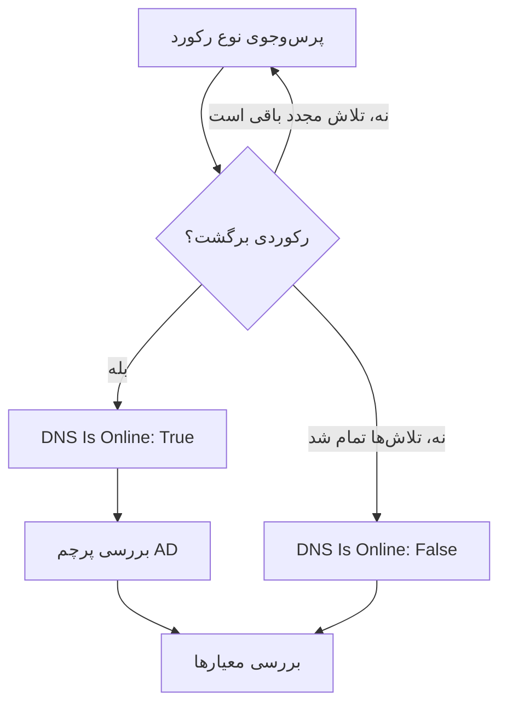

# مانیتور DNS

مانیتور DNS طبق یک زمان‌بندی یک رکورد DNS را پرس‌وجو می‌کند و پاسخ را بررسی می‌کند: اینکه نام resolve می‌شود، با چه سرعتی، و رکوردها چه می‌گویند. از آن برای گرفتن قطعی DNS، رکوردی که تغییر کرده یا ناپدید شده، یا یک resolver کند، پیش از آنکه کاربران متوجه شوند استفاده کنید.

:::cards
- [ساخت مانیتور](#ساخت-یک-مانیتور-dns): شش گام در داشبورد.
- [گزینه‌های پیکربندی](#گزینههای-پیکربندی): نام، نوع رکورد و سرور DNS.
- [معیارهای پایش](#معیارهای-پایش): resolve شدن، رکوردها، زمان پاسخ و DNSSEC.
- [رفع اشکال](#رفع-اشکال): وقتی مانیتور و `dig` نتیجهٔ متفاوتی نشان می‌دهند.
:::

## چگونه کار می‌کند

در هر بررسی، پراب از یک سرور DNS یک نوع رکورد از یک نام را می‌پرسد، برای نمونه رکوردهای `A` دامنهٔ `example.com`. وقتی سرور با دست‌کم یک رکورد از آن نوع پاسخ دهد، نام آنلاین است. پرس‌وجویی که شکست بخورد، به وقفه بخورد یا هیچ رکوردی برنگرداند، یک ثانیه بعد دوباره امتحان می‌شود، تا تعداد تلاش‌های مجددی که تعیین می‌کنید. سپس پراب از یک resolver اعتبارسنج می‌پرسد که آیا پاسخ پرچم authenticated data (AD) مربوط به DNSSEC را دارد، و OneUptime نتیجه را از معیارهای مانیتور عبور می‌دهد.



پرابی که اتصال شبکهٔ خودش را از دست داده هیچ نتیجه‌ای گزارش نمی‌کند، پس نمی‌تواند DNS شما را آفلاین علامت بزند.

## پیش از شروع

- **نقشی که بتواند مانیتور بسازد**: Project Owner، Project Admin، Project Member، Monitor Admin یا Monitor Member، یا یک نقش سفارشی با مجوز Create Monitor.
- **پرابی که به سرور DNS برسد.** پراب‌های پیش‌فرض پروژهٔ شما برای هر مانیتور تازه انتخاب می‌شوند. برای پرس‌وجو از یک سرور DNS در یک شبکهٔ خصوصی، مانند یک resolver داخلی، از یک [پراب سفارشی](/docs/probe/custom-probe) داخل همان شبکه استفاده کنید.

## ساخت یک مانیتور DNS

:::steps
### شروع یک مانیتور تازه

به **مانیتورها** بروید و روی **ساخت مانیتور** کلیک کنید. در **نوع مانیتور** روی **انواع دیگر مانیتور** کلیک کنید و زیر **DNS Monitoring** گزینهٔ **DNS** را انتخاب کنید.

### نام‌گذاری

یک **نام** وارد کنید، مثل `example.com A records`، و روی **بعدی** کلیک کنید.

### وارد کردن پرس‌وجو

**نام دامنه**‌ای را که باید پرس‌وجو شود وارد کنید، مثل `example.com`، و **نوع رکورد** آن را انتخاب کنید. برای پرس‌وجو از یک سرور خاص، آن را در **سرور DNS (اختیاری)** وارد کنید؛ برای استفاده از resolver خود پراب، آن را خالی بگذارید.

### آزمایش

روی **آزمایش مانیتور** کلیک کنید، در **انتخاب پراب** یک پراب انتخاب کنید و روی **اجرای آزمایش** کلیک کنید. **نتیجه آزمایش مانیتور** رکوردهایی را که پراب دریافت کرد نشان می‌دهد.

### بازبینی معیارها

**معیارهای مانیتور** با [معیارهای پیش‌فرض](#معیارهای-پیشفرض) شروع می‌شود: آفلاین وقتی نام resolve نمی‌شود، آنلاین وقتی می‌شود. برای بررسی اینکه رکوردها چه می‌گویند، یک فیلتر **DNS Record Value** اضافه کنید و سپس روی **بعدی** کلیک کنید.

### انتخاب پراب‌ها و ساخت

**پراب‌ها** و **بازه پایش** (که از **هر ۵ دقیقه** شروع می‌شود) را نگه دارید یا تغییر دهید و روی **ساخت مانیتور** کلیک کنید. صفحهٔ مانیتور باز می‌شود.
:::

## گزینه‌های پیکربندی

| فیلد | پیش‌فرض | چه وارد کنید |
| --- | --- | --- |
| **نام دامنه** | هیچ | نامی که پرس‌وجو می‌شود، مثل `example.com` یا `_sip._tcp.example.com`. برای رکورد `PTR`، نام معکوس، مثل `34.216.184.93.in-addr.arpa`. |
| **نوع رکورد** | `A` | نوع رکوردی که پرس‌وجو می‌شود. [نوع‌های رکورد](#نوعهای-رکورد) را ببینید. |
| **سرور DNS (اختیاری)** | resolver پراب | یک سرور DNS که به‌جای آن پرس‌وجو می‌شود، مثل `8.8.8.8` یا `ns1.example.com`. همهٔ نوع‌های رکورد، از جمله `CAA`، از آن پرسیده می‌شوند. |
| **پورت** (زیر **فیلدهای بیشتر**) | `53` | پورت سرور در **سرور DNS (اختیاری)**. بررسی DNSSEC هم از همین پورت می‌پرسد. |
| **وقفه (میلی‌ثانیه)** (زیر **فیلدهای بیشتر**) | `5000` | مدت انتظار برای پاسخ، به میلی‌ثانیه. |
| **تلاش‌های مجدد** (زیر **فیلدهای بیشتر**) | `3` | تلاش‌های مجدد پس از شکست نخستین تلاش. `0` یعنی فقط یک تلاش. |

### نوع‌های رکورد

معیاری با **DNS Record Value** متن شما را با هر رکورد به همان شکلی که پراب آن را می‌نویسد مقایسه می‌کند، پس از این قالب پیروی کنید:

| نوع رکورد | چه چیزی در خود دارد | قالب مقدار، برای معیارها |
| --- | --- | --- |
| `A` | نشانی‌های IPv4 | `93.184.216.34` |
| `AAAA` | نشانی‌های IPv6 | `2606:2800:220:1:248:1893:25c8:1946` |
| `CNAME` | نامی که این نام نام مستعار آن است | `example.net` |
| `MX` | سرورهای ایمیل | `10 mail.example.com` (اولویت، سپس سرور) |
| `NS` | Nameserverها | `ns1.example.com` |
| `TXT` | متن، مثل رکوردهای SPF و تأیید | `v=spf1 include:_spf.example.com ~all` |
| `SOA` | آغاز اختیار (start of authority) زُن | `ns1.example.com hostmaster.example.com 2024010101 7200 3600 1209600 3600` (سرور، تماس، شمارهٔ سریال، refresh، retry، expire، کمینهٔ TTL) |
| `PTR` | نامی که یک نشانی به آن برمی‌گردد (DNS معکوس) | `server1.example.com` |
| `SRV` | سرویس‌ها | `10 5 5060 sip.example.com` (اولویت، وزن، پورت، مقصد) |
| `CAA` | مراجع صدور گواهی که اجازهٔ صدور برای این نام را دارند | `0 letsencrypt.org` (پرچم، سپس مرجع) |

رکورد `TXT`ای که به چند رشته تقسیم شده باشد به یک مقدار پیوسته تبدیل می‌شود.

## معیارهای پایش

معیارها تعیین می‌کنند نام چه زمانی آنلاین، کاهش کارایی یا آفلاین به حساب بیاید، و آیا این وضعیت حادثه اعلام کند یا هشدار بسازد. هر معیار یک یا چند فیلتر را بررسی می‌کند:

| فیلتر | شرط‌ها | چه چیزی را بررسی می‌کند |
| --- | --- | --- |
| **DNS Is Online** | **درست**، **نادرست** | اینکه پرس‌وجو دست‌کم یک رکورد از آن نوع برگرداند یا نه. |
| **DNS Response Time (in ms)** | **Greater Than**، **Less Than**، **Greater Than Or Equal To**، **Less Than Or Equal To** | مدتی که پرس‌وجو طول کشید. |
| **DNS Record Exists** | **درست**، **نادرست** | اینکه رکوردی از آن نوع برگشت یا نه. |
| **DNS Record Value** | **شامل است**، **Not Contains**، **Starts With**، **Ends With**، **Equal To**، **Not Equal To** | مقدار رکوردها. فیلتر وقتی مطابقت می‌کند که یک رکورد مطابقت کند. |
| **DNSSEC Is Valid** | **درست**، **نادرست** | اینکه یک resolver اعتبارسنج پرچم AD را روی پاسخ می‌گذارد یا نه. |

**DNS Record Value** وقتی مطابقت می‌کند که _هر یک_ از رکوردها مطابقت کند. با چند رکورد `A`، **Equal To** `93.184.216.34` وقتی مطابقت می‌کند که یکی از آن‌ها همان نشانی باشد، و **Not Equal To** وقتی مطابقت می‌کند که یکی از آن‌ها آن نشانی نباشد.

**DNSSEC Is Valid** از سرور **سرور DNS (اختیاری)**، روی **پورت** آن، می‌پرسد، یا وقتی آن فیلد خالی است از Google Public DNS (`8.8.8.8`)، پس سروری که تعیین می‌کنید باید DNSSEC را اعتبارسنجی کند. وقتی پراب نمی‌تواند این بررسی را اجرا کند، فیلتر هیچ مقداری ندارد و به هیچ سویی مطابقت نمی‌کند. برای بررسی کامل یک زُن امضاشده، از [مانیتور DNSSEC](/docs/monitor/dnssec-monitor) استفاده کنید.

با دو فیلتر یا بیشتر، **شرط تطابق** تعیین می‌کند که **همه** باید مطابقت کنند یا **هر** کدام کافی است. **اقدام‌ها**ی یک معیار تعیین می‌کنند چه کاری انجام دهد: تغییر وضعیت مانیتور، ساخت هشدار، اعلام حادثه، یا هر ترکیبی از این‌ها.

### معیارهای پیش‌فرض

مانیتور DNS تازه با دو معیار شروع می‌شود:

- **آفلاین** — نام پس از همهٔ تلاش‌های مجدد resolve نمی‌شود، یا هیچ رکوردی از آن نوع ندارد. مانیتور **آفلاین** علامت می‌خورد و حادثه‌ای با نام «_monitor name_ is offline» ساخته می‌شود. وقتی نام دوباره resolve شود، حادثه خودش حل می‌شود.
- **آنلاین** — نام resolve می‌شود. مانیتور **عملیاتی** علامت می‌خورد.

معیارها از بالا به پایین بررسی می‌شوند و نخستین معیاری که مطابقت کند تعیین می‌کند چه اتفاقی بیفتد. وقتی هیچ‌کدام مطابقت نکند، مانیتور وضعیت پیش‌فرضش را نشان می‌دهد: **عملیاتی**، مگر اینکه زیر **فیلدهای بیشتر** در پایین معیارها وضعیت دیگری انتخاب کنید.

### ارزیابی در یک بازهٔ زمانی

**این معیار را در یک بازه زمانی ارزیابی کن** یک چک‌باکس زیر یک فیلتر است که برای **DNS Is Online** و **DNS Response Time (in ms)** ارائه می‌شود. آن را روشن کنید تا به‌جای آخرین بررسی، دربارهٔ بازه‌ای از بررسی‌های گذشته داوری شود: در **ارزیابی** یک تجمیع و در **در (دقیقه) گذشته** بازه‌ای از ۲ تا ۶۰ دقیقه انتخاب کنید.

| تجمیع | چه زمانی مطابقت می‌کند |
| --- | --- |
| **میانگین**، **جمع**، **Maximum Value**، **Minimum Value** | آن عدد، در طول بازه، شرط را برآورده کند. فقط **DNS Response Time (in ms)**. |
| **All Values** | همهٔ بررسی‌های بازه شرط را برآورده کنند. |
| **Any Value** | دست‌کم یک بررسی در بازه شرط را برآورده کند. |

**All Values** فقط وقتی مطابقت می‌کند که بازه واقعاً با داده پوشش داده شده باشد. مانیتوری که تازه ساخته شده، یا مانیتوری که ثبت بررسی‌هایش متوقف شده، سابقهٔ کافی برای گفتن چیزی دربارهٔ N دقیقهٔ گذشته ندارد، پس معیار به‌جای مطابقت با تنها خوانشی که دارد منتظر می‌ماند. **Any Value** تنظیم «همان لحظه که یک بررسی از آستانه گذشت خبرم کن» است و همچنان فوراً فعال می‌شود.

**اگر داده‌ای نبود** تعیین می‌کند وقتی بازه نمی‌تواند پشتوانهٔ معیار باشد چه اتفاقی بیفتد:

| گزینه | چه اتفاقی می‌افتد | برای چه |
| --- | --- | --- |
| **Ignore** (پیش‌فرض) | معیار مطابقت نمی‌کند. | هشدارهای معمولی مبتنی بر آستانه. |
| **تریگر** | نبود داده خودش مشکل به حساب می‌آید. | بررسی‌هایی که در آن‌ها سکوت خودش خرابی است. |
| **Treat As Zero** | بازه به‌صورت یک صفر واحد مقایسه می‌شود. | شمارنده‌هایی که در آن‌ها نبود رویداد واقعاً یعنی صفر. |

### نمونهٔ معیارها

| هدف | فیلتر | شرط | مقدار |
| --- | --- | --- | --- |
| آفلاین وقتی نام دیگر resolve نمی‌شود | **DNS Is Online** | **نادرست** | — |
| هشدار وقتی تنها رکورد `A` یک نام تغییر می‌کند | **DNS Record Value** | **Not Equal To** | `93.184.216.34` |
| هشدار وقتی یک رکورد `MX` به بیرون از دامنهٔ شما اشاره می‌کند | **DNS Record Value** | **Not Contains** | `example.com` |
| علامت‌زدن DNS به‌عنوان کاهش کارایی وقتی کند است | **DNS Response Time (in ms)** | **Greater Than** | `500` |
| هشدار وقتی اعتبارسنجی DNSSEC شکست می‌خورد | **DNSSEC Is Valid** | **نادرست** | — |

## رفع اشکال

:::details مانیتور آفلاین می‌گوید، اما نام برای من resolve می‌شود
پراب از سرور دیگری، یا برای نوع رکورد دیگری، پرسید. **نوع رکورد** را بررسی کنید: نامی که فقط یک `CNAME`، یا فقط رکوردهای `AAAA` دارد، رکورد `A` ندارد. با `dig` روی همان سرور مقایسه کنید:

```bash
dig @8.8.8.8 example.com A
```
:::

:::details معیاری با Not Equal To فعال می‌شود، با اینکه نشانی درست آنجاست
**DNS Record Value** وقتی مطابقت می‌کند که یک رکورد مطابقت کند. با چند رکورد، **Not Equal To** همین که یکی از آن‌ها متفاوت باشد فعال می‌شود. برای بررسی اینکه یک مقدار خاص در میان رکوردها هست، به ترتیب معیارها تکیه کنید، چون نخستین مطابقت برنده است:

1. معیار آفلاین پیش‌فرض را در بالا نگه دارید: **DNS Is Online** / **نادرست**.
2. زیر آن، معیاری با **DNS Record Value** / **Equal To** / مقدار مورد انتظار اضافه کنید که مانیتور را **عملیاتی** علامت بزند.
3. زیر آن هم، معیاری با **DNS Is Online** / **درست** اضافه کنید که مانیتور را **آفلاین** علامت بزند و حادثه اعلام کند. این معیار فقط با پاسخ‌هایی مطابقت می‌کند که آن مقدار را ندارند.
:::

:::details DNSSEC Is Valid هرگز مطابقت نمی‌کند
سرور **سرور DNS (اختیاری)** DNSSEC را اعتبارسنجی نمی‌کند، پس هرگز پرچم AD را نمی‌گذارد، یا پراب نتوانست بررسی را اجرا کند. برای اعتبارسنجی با `8.8.8.8` فیلد را خالی بگذارید، یا از [مانیتور DNSSEC](/docs/monitor/dnssec-monitor) استفاده کنید.
:::

## گام‌های بعدی

:::cards
- [مانیتور DNSSEC](/docs/monitor/dnssec-monitor): زنجیرهٔ اعتماد یک زُن امضاشده را اعتبارسنجی کنید.
- [مانیتور دامنه](/docs/monitor/domain-monitor): ثبت و انقضای دامنه را زیر نظر بگیرید.
- [پراب‌های سفارشی](/docs/probe/custom-probe): از شبکهٔ خودتان سرورهای DNS داخلی را پرس‌وجو کنید.
- [نمای کلی حوادث](/docs/incidents/index): پس از آنکه مانیتور حادثه‌ای اعلام کرد چه اتفاقی می‌افتد.
:::
