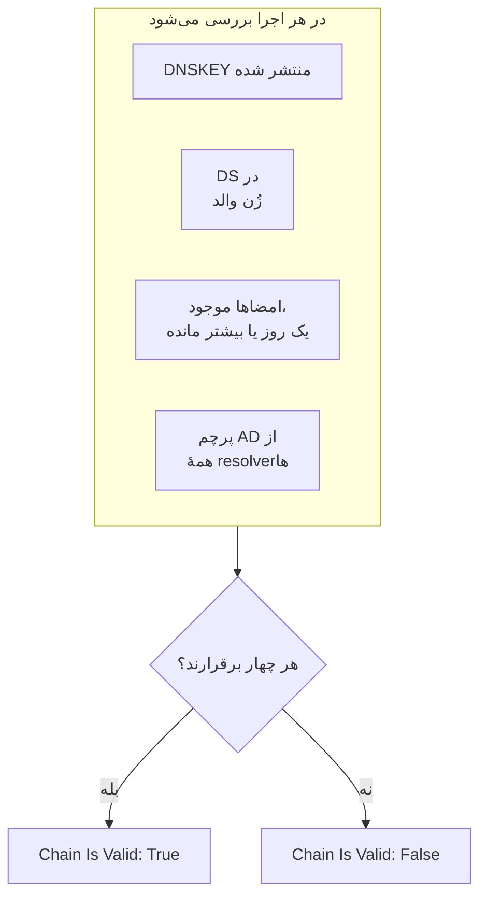

# مانیتور DNSSEC

مانیتور DNSSEC بررسی می‌کند که یک زُن DNS امضاشده هنوز اعتبارسنجی می‌شود: اینکه کلیدهایش را منتشر می‌کند، اینکه زُن والدش آن را تأیید می‌کند، اینکه امضاهایش منقضی نشده‌اند، و اینکه resolverهای اعتبارسنج آن را می‌پذیرند. از آن برای گرفتن زنجیرهٔ اعتماد شکسته پیش از آنکه resolverها برای دامنهٔ شما `SERVFAIL` برگردانند استفاده کنید.

:::cards
- [ساخت مانیتور](#ساخت-یک-مانیتور-dnssec): شش گام در داشبورد.
- [چه چیزی بررسی می‌شود](#چگونه-کار-میکند): بررسی‌های پشت یک زنجیرهٔ معتبر.
- [معیارهای پایش](#معیارهای-پایش): اعتبار زنجیره، کلیدها، رکوردهای DS، امضاها، resolverها و Nameserverها.
- [بهترین شیوه‌ها](#بهترین-شیوهها): آستانه‌ها و resolverهایی که جواب می‌دهند.
:::

## چگونه کار می‌کند

در هر بررسی، پراب مجموعه‌ای از پرس‌وجوهای DNS را روی زُن اجرا می‌کند:

| پرس‌وجو | از چه کسی پرسیده می‌شود | چه چیزی به شما می‌گوید |
| --- | --- | --- |
| `DNSKEY` | نخستین resolver در **Resolverها** | اینکه زُن کلیدهای امضای خود را منتشر می‌کند یا نه. |
| `DS` | نخستین resolver در **Resolverها** | اینکه زُن والد برای این زُن یک رکورد delegation signer منتشر می‌کند یا نه. |
| `SOA`، همراه با رکوردهای DNSSEC | نخستین resolver در **Resolverها** | اینکه رکوردهای زُن امضا شده‌اند یا نه (`RRSIG`ای که رکورد `SOA` آن را امضا می‌کند)، و زودترین امضا کی منقضی می‌شود. |
| `A`، همراه با اعتبارسنجی DNSSEC | همهٔ resolverهای **Resolverها** | اینکه هر resolver اعتبارسنج زُن را می‌پذیرد یا نه، که آن را با پرچم authenticated data (AD) نشان می‌دهد. |
| `NS`، سپس `SOA` | نخستین resolver، سپس هر Nameserver معتبری که نام می‌برد | اینکه همهٔ Nameserverها یک شمارهٔ سریال SOA یکسان ارائه می‌دهند یا نه. فقط وقتی **بررسی سازگاری Nameserverها** روشن است. |

resolverهای اعتبارسنج زنجیرهٔ اعتماد را از ریشه به پایین بررسی می‌کنند، پس پرچم AD به شما می‌گوید کل زنجیره برقرار است. زنجیره وقتی معتبر به حساب می‌آید که همهٔ این‌ها برقرار باشند:

امضایی که کمتر از یک روز از عمرش مانده از همین حالا شکسته به حساب می‌آید، پس تا یک روز پیش از آنکه resolverها زُن را رد کنند از آن باخبر می‌شوید. بررسی‌ای که زنجیره را شکسته یا Nameserverها را ناهماهنگ ببیند، یک ثانیه بعد دوباره اجرا می‌شود، تا تعداد تلاش‌های مجددی که تعیین می‌کنید، پیش از آنکه OneUptime نتیجه را از معیارهای مانیتور عبور دهد. همهٔ پرس‌وجوهای یک تلاش مهلتی برابر با سه برابر **وقفه (میلی‌ثانیه)** دارند؛ تلاشی که وقتش تمام شود وقفه گزارش می‌دهد، نه حکمی دربارهٔ زُن.

## پیش از شروع

- **نقشی که بتواند مانیتور بسازد**: Project Owner، Project Admin، Project Member، Monitor Admin یا Monitor Member، یا یک نقش سفارشی با مجوز Create Monitor.
- **یک زُن امضاشده.** زُن باید امضا شده باشد و رکورد DS آن از طریق ثبت‌کنندهٔ شما در زُن والد منتشر شده باشد.
- **DNS خروجی از پراب** به resolverهایی که فهرست می‌کنید و، برای بررسی سازگاری Nameserverها، به Nameserverهای معتبر زُن. پراب‌های پیش‌فرض پروژهٔ شما برای هر مانیتور تازه انتخاب می‌شوند.

## ساخت یک مانیتور DNSSEC

:::steps
### شروع یک مانیتور تازه

به **مانیتورها** بروید و روی **ساخت مانیتور** کلیک کنید. در **نوع مانیتور** روی **انواع دیگر مانیتور** کلیک کنید و زیر **DNS Monitoring** گزینهٔ **DNSSEC** را انتخاب کنید.

### نام‌گذاری

یک **نام** وارد کنید، مثل `example.com DNSSEC`، و روی **بعدی** کلیک کنید.

### وارد کردن زُن

در **زُن (نام دامنه)** زُنی را که باید اعتبارسنجی شود وارد کنید، مثل `example.com`. **Resolverها**ی پیش‌فرض را نگه دارید، یا resolverهای خودتان را با کاما جدا کنید. مگر اینکه شبکهٔ شما DNS به سرورهای دلخواه را مسدود کند، **بررسی سازگاری Nameserverها** را روشن بگذارید.

### آزمایش

روی **آزمایش مانیتور** کلیک کنید، در **انتخاب پراب** یک پراب انتخاب کنید و روی **اجرای آزمایش** کلیک کنید. **نتیجه آزمایش مانیتور** نشان می‌دهد هر بررسی چه یافت.

### بازبینی معیارها

**معیارهای مانیتور** با [معیارهای پیش‌فرض](#معیارهای-پیشفرض) شروع می‌شود: آفلاین وقتی زنجیره شکسته است، آنلاین وقتی معتبر است. برای اینکه پیش از انقضای امضاها هشدار بگیرید، یک معیار اضافه کنید ([بهترین شیوه‌ها](#بهترین-شیوهها) را ببینید) و سپس روی **بعدی** کلیک کنید.

### انتخاب پراب‌ها و ساخت

**پراب‌ها** و **بازه پایش** (که از **هر ۵ دقیقه** شروع می‌شود) را نگه دارید یا تغییر دهید و روی **ساخت مانیتور** کلیک کنید. صفحهٔ مانیتور باز می‌شود.
:::

## گزینه‌های پیکربندی

| فیلد | پیش‌فرض | چه وارد کنید |
| --- | --- | --- |
| **زُن (نام دامنه)** | هیچ | زُنی که اعتبارسنجی می‌شود، مثل `example.com`. |
| **Resolverها** | `1.1.1.1, 8.8.8.8, 9.9.9.9` | resolverهای اعتبارسنجی که پرس‌وجو می‌شوند، جداشده با کاما. هر کدام باید پرچم AD را برگرداند تا زنجیره معتبر به حساب بیاید. |
| **بررسی سازگاری Nameserverها** | روشن | هر Nameserver معتبر را مستقیماً پرس‌وجو کن و شماره‌های سریال SOA آن‌ها را مقایسه کن. اگر شبکهٔ شما DNS خروجی به سرورهای دلخواه را مسدود می‌کند، آن را خاموش کنید. |
| **هشدار انقضای امضا (روز)** (زیر **فیلدهای بیشتر**) | `7` | همراه مانیتور ذخیره می‌شود. فیلتر **DNSSEC Signature Expires In Days** از مقداری استفاده می‌کند که در معیار به آن می‌دهید، پس آستانهٔ خود را آنجا تعیین کنید. |
| **وقفه (میلی‌ثانیه)** (زیر **فیلدهای بیشتر**) | `10000` | مدت انتظار برای هر پرس‌وجوی DNS، به میلی‌ثانیه. یک تلاش ممکن است در مجموع تا سه برابر این مدت طول بکشد. |
| **تلاش‌های مجدد** (زیر **فیلدهای بیشتر**) | `3` | تلاش‌های مجدد پس از شکست نخستین تلاش. `0` یعنی فقط یک تلاش. |

## معیارهای پایش

معیارها تعیین می‌کنند زُن چه زمانی آنلاین، کاهش کارایی یا آفلاین به حساب بیاید، و آیا این وضعیت حادثه اعلام کند یا هشدار بسازد. هر معیار یک یا چند فیلتر را بررسی می‌کند:

| فیلتر | شرط‌ها | چه چیزی را بررسی می‌کند |
| --- | --- | --- |
| **DNSSEC Chain Is Valid** | **درست**، **نادرست** | هر چهار بررسی بالا برقرارند: کلیدها منتشر شده‌اند، DS در زُن والد هست، امضاها با یک روز یا بیشتر باقی‌مانده موجودند، و پرچم AD از همهٔ resolverها. |
| **DNSSEC DNSKEY Record Exists** | **درست**، **نادرست** | زُن دست‌کم یک رکورد DNSKEY منتشر می‌کند. |
| **DNSSEC DS Record Exists At Parent** | **درست**، **نادرست** | زُن والد برای این زُن یک رکورد DS منتشر می‌کند. |
| **DNSSEC Signature Expires In Days** | **Greater Than**، **Less Than**، **Greater Than Or Equal To**، **Less Than Or Equal To** | روزهای کامل تا انقضای زودترین امضا (RRSIG). |
| **DNSSEC Resolver Consensus (AD Flag)** | **درست**، **نادرست** | همهٔ resolverهای **Resolverها** پرچم AD را برمی‌گردانند. |
| **DNSSEC Nameservers Are Consistent** | **درست**، **نادرست** | همهٔ Nameserverهای معتبر با یک شمارهٔ سریال SOA یکسان پاسخ می‌دهند. تا وقتی **بررسی سازگاری Nameserverها** خاموش است، همیشه **درست** است. |

با دو فیلتر یا بیشتر، **شرط تطابق** تعیین می‌کند که **همه** باید مطابقت کنند یا **هر** کدام کافی است. **اقدام‌ها**ی یک معیار تعیین می‌کنند چه کاری انجام دهد: تغییر وضعیت مانیتور، ساخت هشدار، اعلام حادثه، یا هر ترکیبی از این‌ها.

### معیارهای پیش‌فرض

مانیتور DNSSEC تازه با دو معیار شروع می‌شود:

- **زنجیره شکسته است** — **DNSSEC Chain Is Valid** **نادرست** است. مانیتور **آفلاین** علامت می‌خورد و حادثه‌ای با نام «_monitor name_ DNSSEC chain is broken» ساخته می‌شود. وقتی زنجیره دوباره معتبر شود، حادثه خودش حل می‌شود.
- **زنجیره معتبر است** — مانیتور **عملیاتی** علامت می‌خورد.

معیارها از بالا به پایین بررسی می‌شوند و نخستین معیاری که مطابقت کند تعیین می‌کند چه اتفاقی بیفتد. وقتی هیچ‌کدام مطابقت نکند، مانیتور وضعیت پیش‌فرضش را نشان می‌دهد: **عملیاتی**، مگر اینکه زیر **فیلدهای بیشتر** در پایین معیارها وضعیت دیگری انتخاب کنید.

معیارهای پیش‌فرض به‌تنهایی انقضای امضا یا سازگاری Nameserverها را زیر نظر نمی‌گیرند. برای آن‌ها، مانند زیر، معیار اضافه کنید.

### نمونهٔ معیارها

| هدف | فیلتر | شرط | مقدار |
| --- | --- | --- | --- |
| آفلاین وقتی زنجیره شکسته است (یک معیار پیش‌فرض) | **DNSSEC Chain Is Valid** | **نادرست** | — |
| هشدار پیش از انقضای امضاها | **DNSSEC Signature Expires In Days** | **Less Than** | `7` |
| گرفتن واگذاری‌ای که رکورد DS خود را از دست داده | **DNSSEC DS Record Exists At Parent** | **نادرست** | — |
| گرفتن resolverهایی که با هم اختلاف دارند | **DNSSEC Resolver Consensus (AD Flag)** | **نادرست** | — |
| گرفتن Nameserverهای ناهماهنگ | **DNSSEC Nameservers Are Consistent** | **نادرست** | — |

## بهترین شیوه‌ها

1. **resolverهایی انتخاب کنید که همیشه در دسترس‌اند.** هر resolver باید پرچم AD را برگرداند تا زنجیره معتبر به حساب بیاید، پس resolverی که پراب به آن نمی‌رسد، وقتی تلاش‌های مجدد تمام شوند بررسی را شکست می‌دهد. پیش‌فرض‌ها، `1.1.1.1`، `8.8.8.8` و `9.9.9.9`، را سه گردانندهٔ متفاوت اداره می‌کنند، که زُنی را هم که روی یک resolver اعتبارسنجی می‌شود ولی روی دیگری نه، می‌گیرد.
2. **پیش از انقضای امضاها هشدار بگیرید.** امضاکننده‌ها پیش از تمام شدن امضاهای یک زُن آن را دوباره امضا می‌کنند، پس امضایی که به انقضا نزدیک است یعنی امضای دوباره متوقف شده است. معیاری با **DNSSEC Signature Expires In Days** / **Less Than** / `7` اضافه کنید که هشدار بسازد، و معیار دومی با `2` که حادثه اعلام کند. هر دو را بالای معیاری که زنجیره را معتبر علامت می‌زند بکشید، و معیار `2` روزه را اول بگذارید، چون نخستین معیاری که مطابقت کند برنده است. آستانه‌هایی پایین‌تر از زمانی انتخاب کنید که امضاکنندهٔ شما معمولاً پیش از امضای دوباره روی یک امضا باقی می‌گذارد، تا تا وقتی امضای دوباره کار می‌کند ساکت بمانند.
3. **هر زُن امضاشده را پایش کنید.** دامنهٔ apex، زیردامنه‌های امضاشده، و هر زُنی را که به گردانندهٔ دیگری واگذار شده در نظر بگیرید.
4. **بررسی سازگاری Nameserverها را روشن نگه دارید،** و برای آن معیاری اضافه کنید. این بررسی سرور ثانویه‌ای را می‌گیرد که دریافت انتقال زُن از سرور اصلی را متوقف کرده است، چیزی که اعتبارسنجی DNSSEC به‌تنهایی ممکن است از دست بدهد.

## رفع اشکال

:::details زنجیره شکسته گزارش می‌شود، اما زُن با `dig` اعتبارسنجی می‌شود
یکی از resolverهای **Resolverها** پرچم AD را برنگرداند: یا از پراب در دسترس نبود، یا DNSSEC را اعتبارسنجی نمی‌کند. جدول **Resolver Checks**، در **نتیجه آزمایش مانیتور** و در خلاصهٔ هر بررسی، پاسخ و خطای هر resolver را نشان می‌دهد. resolverهایی را که پراب به آن‌ها نمی‌رسد حذف کنید و فقط resolverهای اعتبارسنج را فهرست کنید.
:::

:::details درست پس از یک تغییر، Nameserverها ناسازگار گزارش می‌شوند
سرورهای ثانویه ممکن است تا مدتی پس از تغییر زُن از سرور اصلی عقب بمانند. جدول **Nameserver Consistency** در خلاصهٔ بررسی، شمارهٔ سریال SOA هر Nameserver را نشان می‌دهد. اگر یکی عقب بماند، آن سرور ثانویه دریافت انتقال را متوقف کرده است. اگر همهٔ Nameserverها خطا نشان دهند، ممکن است پراب از پرس‌وجوی مستقیم آن‌ها منع شده باشد: **بررسی سازگاری Nameserverها** را خاموش کنید.
:::

:::details بررسی وقفه گزارش می‌دهد
همهٔ پرس‌وجوهای یک تلاش سه برابر **وقفه (میلی‌ثانیه)** را میان خود تقسیم می‌کنند. یک resolver کند یا در دسترس نبودن یک resolver آن زمان را مصرف می‌کند؛ آن را از **Resolverها** حذف کنید، یا وقفه را بیشتر کنید.
:::

## گام‌های بعدی

:::cards
- [مانیتور DNS](/docs/monitor/dns-monitor): بررسی کنید که یک نام resolve می‌شود و رکوردهایش چه می‌گویند.
- [مانیتور دامنه](/docs/monitor/domain-monitor): ثبت و انقضای دامنه را زیر نظر بگیرید.
- [مانیتور گواهی SSL](/docs/monitor/ssl-certificate-monitor): گواهی‌هایی را که روی دامنه ارائه می‌شوند زیر نظر بگیرید.
- [نمای کلی حوادث](/docs/incidents/index): پس از آنکه مانیتور حادثه‌ای اعلام کرد چه اتفاقی می‌افتد.
:::
