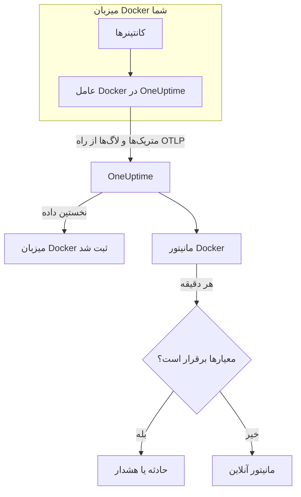

# مانیتور Docker

مانیتور Docker کانتینرهای روی یک میزبان Docker را زیر نظر می‌گیرد و وقتی کانتینری داغ کار می‌کند، حافظه‌اش تمام می‌شود یا در حلقه خرابی می‌افتد به شما خبر می‌دهد. این مانیتور متریک‌هایی را می‌خواند که عامل Docker در OneUptime از میزبان می‌فرستد، پس هیچ چیز از بیرون کاوش نمی‌شود: عامل را نصب کنید، سپس مانیتور را از یک الگو یا پرس‌وجوی خودتان بسازید.

:::cards
- [ساخت مانیتور](#ساخت-یک-مانیتور-docker): شش گام در داشبورد.
- [الگوها](#الگوهای-هشدار-آماده): شش هشدار آماده، یک حادثه به ازای هر کانتینر.
- [متریک‌ها](#متریکهای-جمعآوریشده): عامل چه چیزی جمع می‌کند و هر متریک چه معنایی دارد.
- [لاگ‌ها](#لاگهای-جمعآوریشده): لاگ‌های کانتینر و درایور لاگی که به آن نیاز دارند.
:::

## چگونه کار می‌کند

عامل Docker در OneUptime به‌صورت یک کانتینر روی میزبان اجرا می‌شود. هر ۳۰ ثانیه آمار کانتینرها را از API موتور Docker می‌خواند، فایل‌های لاگ کانتینرها را دنبال می‌کند و هر دو را از راه OTLP به OneUptime می‌فرستد. نخستین داده از یک میزبان آن را در OneUptime ثبت می‌کند.

مانیتور Docker به یک میزبان وابسته است. هر دقیقه پرس‌وجوی خود را روی متریک‌های کانتینر آن میزبان اجرا می‌کند و نتیجه را با معیارهایش مقایسه می‌کند.



## پیش از شروع

- **عامل Docker را نصب کنید**، روی میزبان. [راهنمای عامل Docker](/docs/telemetry/docker-host) نصب، ارتقا و بررسی آن را پوشش می‌دهد.
- **بررسی کنید میزبان ثبت شده باشد.** به محض رسیدن نخستین داده، با نام `DOCKER_HOST_NAME` عامل زیر **محصولات → زیرساخت → Docker → همه میزبان‌ها** پدیدار می‌شود.
- **برای لاگ‌های کانتینر**، کانتینرها را با درایور لاگ `json-file` در Docker اجرا کنید. [الزام درایور لاگ](#الزام-درایور-لاگ) را ببینید.

## ساخت یک مانیتور Docker

:::steps
### یک مانیتور تازه شروع کنید

به **مانیتورها** بروید و روی **ساخت مانیتور** کلیک کنید.

### Docker Container را برگزینید

زیر **نوع مانیتور**، روی **انواع دیگر مانیتور** کلیک کنید و **Docker Container** را زیر **زیرساخت** برگزینید، یا در کادر جست‌وجو `docker` را تایپ کنید. یک **نام** وارد کنید – در عنوان حادثه‌ها و هشدارها به کار می‌رود – و روی **بعدی** کلیک کنید.

### میزبان را برگزینید

زیر **پیکربندی مانیتور Docker**، میزبان را از **میزبان Docker** برگزینید. هر میزبانی که داده فرستاده در فهرست است.

### برگزینید چه چیزی پایش شود

یکی از سه زبانه را برگزینید:

- **Quick Setup** – روی یک [الگو](#الگوهای-هشدار-آماده) کلیک کنید. متریک، تجمیع، بازه زمانی و آستانه‌ها را تعیین می‌کند و معیارهای زیر را با معیارهای خودش جایگزین می‌کند. همچنان می‌توانید **بازه زمانی** را تغییر دهید.
- **Custom Metric** – یک متریک از **متریک Docker** برگزینید، سپس **تجمیع** و **بازه زمانی** را تعیین کنید. **نام کانتینر** و **ایمیج کانتینر** آن را به برخی کانتینرها محدود می‌کنند.
- **پیشرفته** – پرس‌وجوها و فرمول‌ها را خودتان زیر **انتخاب متریک‌ها** بسازید. برای سنجش جداگانه هر کانتینر از **Group by** `resource.container.name` استفاده کنید.

### معیارها را بررسی کنید

هر معیار را زیر **معیارهای مانیتور** باز کنید و **متریک**، **تجمیع**، **شرط** و **Threshold** آن را بررسی کنید. الگو این‌ها را پر می‌کند. با **Custom Metric** یا **پیشرفته**، مانیتور با [معیارهای پیش‌فرض](#معیارهای-پیشفرض) شروع می‌شود که فقط افت متریک به صفر را می‌بینند، پس آستانه خودتان را تعیین کنید.

### مانیتور را بسازید

روی **ساخت مانیتور** کلیک کنید. OneUptime صفحه مانیتور را باز می‌کند و آن را هر دقیقه ارزیابی می‌کند. حادثه‌ها و هشدارهایی که باز می‌کند در صفحه‌های **حوادث** و **هشدارها**ی میزبان هم فهرست می‌شوند.
:::

> [!TIP]
> برای راه‌اندازی هم‌زمان چند الگو، میزبان را از **محصولات → زیرساخت → Docker** باز کنید و به **Recommendations** بروید. الگوهای دلخواه و کسانی را که باید خبر داده شوند برگزینید، و OneUptime به ازای هر الگو یک مانیتور می‌سازد.

## تنظیمات مانیتور

| فیلد | زبانه | چه می‌کند |
| --- | --- | --- |
| **میزبان Docker** | همه | الزامی. هر پرس‌وجو را به `resource.host.name` میزبان محدود می‌کند. OneUptime همچنین `resource.container.runtime = docker` را به هر پرس‌وجو اضافه می‌کند. |
| **متریک Docker** | Custom Metric | یک متریک از فهرست عامل، گروه‌بندی‌شده به‌صورت CPU، حافظه، شبکه، I/O بلوکی و کانتینر. |
| **نام کانتینر** | Custom Metric، پیشرفته | اختیاری. تطابق دقیق با `resource.container.name`، برای نمونه `my-container`. |
| **ایمیج کانتینر** | Custom Metric، پیشرفته | اختیاری. تطابق دقیق با `resource.container.image.name`، برای نمونه `nginx:latest`. |
| **تجمیع** | Custom Metric | شیوه ترکیب نمونه‌ها: **میانگین**، **بیشینه**، **کمینه**، **جمع** یا **تعداد**. از تجمیع معمول متریک شروع می‌شود. |
| **بازه زمانی** | همه | پنجره غلتانی که پرس‌وجو می‌خواند، از **Past 1 Minute** تا **Past 365 Days**. مانیتور تازه از **Past 1 Minute** شروع می‌شود؛ الگوها پنجره خودشان را تعیین می‌کنند. |
| **انتخاب متریک‌ها** | پیشرفته | سازنده پرس‌وجو: **متریک**، **Aggregate by**، **Filter by attributes**، **Group by**، به همراه **افزودن متریک** و **افزودن فرمول** برای ترکیب پرس‌وجوها. |

## الگوهای هشدار آماده

**Quick Setup** شش الگو ارائه می‌دهد. هر کدام یک مانیتور کامل می‌سازد: یک پرس‌وجوی گروه‌بندی‌شده بر پایه `resource.container.name`، یک معیار که فعال می‌شود و یکی که بهبود می‌یابد. هر کانتینر جداگانه سنجیده می‌شود، پس یک کانتینر پرمشغله کانتینر دیگری را پنهان نمی‌کند، و هر کانتینری که از آستانه بگذرد حادثه و هشدار خودش را می‌گیرد. آستانه‌ها نقطه شروع‌اند و می‌توانید ویرایششان کنید.

مگر جدول چیز دیگری بگوید، یک معیار فقط وقتی فعال می‌شود که شرط در همه دقیقه‌های پنجره‌اش برقرار باشد، و ۱۰٪ آن‌سوی آستانه بهبود می‌یابد تا مقداری که حول مرز نوسان دارد مدام جابه‌جا نشود.

| الگو | شدت | چه چیزی را پایش می‌کند | چه وقت فعال می‌شود | چه وقت بهبود می‌یابد |
| --- | --- | --- | --- | --- |
| High Container CPU Usage | Warning | `container.cpu.utilization`، Max به ازای هر کانتینر، ۵ دقیقه گذشته | بیش از ۸۰ (درصدِ یک هسته) | ۷۲ یا کمتر |
| High Container Memory Usage | Warning | `container.memory.percent`، Max به ازای هر کانتینر، ۵ دقیقه گذشته | بیش از ۸۵٪ | ۷۶٫۵٪ یا کمتر |
| Container Restart Loop | بحرانی | رشد `container.restarts` به ازای هر کانتینر، ۱۵ دقیقه گذشته | بیش از ۳ راه‌اندازی دوباره در پنجره (جمع) | ۲٫۷ یا کمتر |
| Container CPU Throttling | Warning | رشد `container.cpu.throttling_data.throttled_time` بر حسب ms به ازای هر کانتینر، ۵ دقیقه گذشته | بیش از ۱۰۰۰ ms در پنجره (جمع) | ۹۰۰ ms یا کمتر |
| High Container Process Count | Warning | `container.pids.count`، Max به ازای هر کانتینر، ۵ دقیقه گذشته | بیش از ۲۰۰۰ | ۱۸۰۰ یا کمتر |
| Container Down (Low Uptime) | بحرانی | `container.uptime`، Min به ازای هر کانتینر، ۱ دقیقه گذشته | برابر با ۰ | بیش از ۰ |

**شدت** برچسبی است که فهرست انتخاب نشان می‌دهد. حادثه و هشداری که یک الگو می‌سازد از شدیدترین شدت حادثه و هشدار پروژه شما شروع می‌شوند؛ آن‌ها را در معیارها تغییر دهید.

> [!NOTE]
> `container.cpu.utilization` همان عددی است که `docker stats` نشان می‌دهد: ۱۰۰٪ یعنی یک هسته کامل CPU، نه کل میزبان، پس کانتینری که دو هسته مصرف می‌کند ۲۰۰ نشان می‌دهد. روی میزبانی با چند هسته، آستانه ۸۰ یک بودجه CPU است، نه سهمی از ماشین.

> [!NOTE]
> `container.memory.percent` وقتی برای کانتینر محدودیت حافظه تعیین شده باشد بر آن تقسیم می‌کند، و در غیر این صورت بر کل حافظه **میزبان**. پیش از آنکه گذشتن از حد را نشانه کشته شدن قریب‌الوقوع به دلیل کمبود حافظه بدانید، بررسی کنید که کانتینر با `--memory` اجرا شده باشد.

> [!WARNING]
> `container.restarts` و `container.cpu.throttling_data.throttled_time` فقط افزایش می‌یابند، پس این دو الگو بر پایه اینکه در پنجره چقدر رشد کرده‌اند هشدار می‌دهند: یک پرس‌وجوی Maximum و یک پرس‌وجوی Minimum در هر دقیقه، که یک فرمول از هم کم و سپس جمعشان می‌کند. با جمع‌آوری ۳۰ ثانیه‌ای عامل، این روش حدود نیمی از فعالیت واقعی را می‌بیند و آستانه‌ها از قبل این را در نظر گرفته‌اند. اگر `collection_interval` عامل را به ۶۰ ثانیه یا بیشتر برسانید، هر دقیقه فقط یک نمونه دارد و هر دو الگو دیگر هشدار نمی‌دهند.

> [!CAUTION]
> **Container Down (Low Uptime)** نمی‌تواند کانتینری را بگیرد که متوقف می‌شود و متوقف می‌ماند. عامل فقط کانتینرهای در حال اجرا را گزارش می‌دهد، پس کانتینر متوقف‌شده هیچ داده‌ای نمی‌فرستد و مدت روشن‌بودنش هرگز ۰ نمی‌شود. برای سرویسی که باید روشن بماند، آنچه را ارائه می‌دهد هم پایش کنید – برای نمونه با یک [مانیتور API](/docs/monitor/api-monitor).

## متریک‌های جمع‌آوری‌شده

عامل هر ۳۰ ثانیه از گیرنده `docker_stats` در OpenTelemetry روی سوکت Docker استفاده می‌کند. متریک‌های هر کانتینر هویت آن را به‌صورت ویژگی‌های منبع با خود دارند: `resource.container.name`، `resource.container.image.name`، `resource.container.id`، `resource.container.runtime` (`docker`) و `resource.host.name`.

### CPU

| متریک | توضیح |
| --- | --- |
| `container.cpu.utilization` | مصرف CPU، که در آن ۱۰۰٪ یک هسته کامل CPU است (ستون CPU% در `docker stats`). |
| `container.cpu.usage.total` | زمان CPU مصرف‌شده از آغاز کانتینر، بر حسب نانوثانیه. شمارنده‌ای در طول عمر. |
| `container.cpu.throttling_data.throttled_time` | نانوثانیه‌هایی که کانتینر از آغاز به دلیل محدودیت CPU خود محدود شده است. شمارنده‌ای در طول عمر. |
| `container.cpu.throttling_data.throttled_periods` | دوره‌های محدودسازی از آغاز کانتینر. شمارنده‌ای در طول عمر. |

### حافظه

| متریک | توضیح |
| --- | --- |
| `container.memory.usage.total` | حافظه در حال استفاده، بر حسب بایت. |
| `container.memory.usage.limit` | محدودیت حافظه، بر حسب بایت. |
| `container.memory.percent` | مصرف حافظه به‌صورت درصدی از محدودیت کانتینر، یا از کل حافظه میزبان وقتی کانتینر محدودیتی ندارد. |

### شبکه

| متریک | توضیح |
| --- | --- |
| `container.network.io.usage.rx_bytes` | بایت‌های دریافتی. شمارنده‌ای در طول عمر. |
| `container.network.io.usage.tx_bytes` | بایت‌های ارسالی. شمارنده‌ای در طول عمر. |

### I/O بلوکی

| متریک | توضیح |
| --- | --- |
| `container.blockio.io_service_bytes_recursive.read` | بایت‌های خوانده‌شده از دستگاه‌های بلوکی. |
| `container.blockio.io_service_bytes_recursive.write` | بایت‌های نوشته‌شده در دستگاه‌های بلوکی. |

### کانتینر

| متریک | توضیح |
| --- | --- |
| `container.uptime` | ثانیه‌های گذشته از آغاز کانتینر. فقط کانتینرهای در حال اجرا آن را گزارش می‌دهند. |
| `container.restarts` | دفعاتی که کانتینر از زمان ساخت دوباره راه‌اندازی شده است. شمارنده‌ای در طول عمر. |
| `container.pids.count` | وظایف درون کانتینر. کنترل‌گر pids در cgroup رشته‌ها را هم مانند فرایندها می‌شمارد. |

فهرست **متریک Docker** همچنین `container.cpu.usage.percpu`، `container.memory.rss`، `container.memory.cache` و شمارنده‌های بسته‌های شبکه را ارائه می‌دهد. پیکربندی عامل همراه، این‌ها را روشن نمی‌کند، پس پیش از تکیه بر آن‌ها صفحه **متریک‌ها**ی میزبان را بررسی کنید. `container.cpu.throttling_data.throttled_periods` در فهرست نیست؛ آن را از **پیشرفته** پرس‌وجو کنید.

## معیارهای مانیتورینگ

یک معیار یکی از پرس‌وجوها یا فرمول‌های مانیتور را با یک آستانه مقایسه می‌کند. معیارهای مانیتور Docker **نوع فیلتر** ندارند: هر قاعده مقدار متریک را با این فیلدها بررسی می‌کند.

| فیلد | چه می‌کند |
| --- | --- |
| **متریک** | پرس‌وجو یا فرمولی که بررسی می‌شود، بر پایه نام متغیرش. |
| **تجمیع** | اینکه مقدارهای پنجره چطور به یک پاسخ تبدیل می‌شوند: **میانگین**، **جمع**، **Maximum Value**، **Minimum Value**، **All Values** (همه مقدارها باید جور باشند) یا **Any Value** (یکی کافی است). |
| **شرط** | **Greater Than**، **Less Than**، **Greater Than Or Equal To**، **Less Than Or Equal To** یا **Equal To** – یا یک شرط ناهنجاری: **Anomalously High**، **Anomalously Low** یا **Anomalous**. |
| **Threshold** | مقداری که با آن مقایسه می‌شود. وقتی متریک یکا دارد، فهرستی از یکاها کنارش هست. برای شرط‌های ناهنجاری نشان داده نمی‌شود. |
| **حساسیت** | فقط شرط‌های ناهنجاری. **پایین** (۴σ)، **متوسط** (۳σ، پیش‌فرض) یا **بالا** (۲σ). |
| **پنجره مبنا** | فقط شرط‌های ناهنجاری. ۱۴ روز (پیش‌فرض)، ۲۸، ۶۰ یا ۹۰ روز سابقه. |
| **اگر داده‌ای نبود** | زیر **فیلدهای بیشتر**. وقتی پنجره هیچ نمونه‌ای ندارد چه شود: **Ignore** (پیش‌فرض)، **Treat As Zero** یا **تریگر**. |

شرط‌های ناهنجاری هر مقدار را با همان ساعت از هفته در خط مبنا مقایسه می‌کنند. تا وقتی پنجره مبنا سابقه کافی نداشته باشد، در وضعیت «Learning» می‌مانند و چیزی پدید نمی‌آورند.

هر معیار همچنین می‌گوید وقتی برقرار شد چه باید کرد: تغییر وضعیت مانیتور، ساختن یک هشدار یا اعلام یک حادثه. معیارها از بالا به پایین بررسی می‌شوند و نخستین معیاری که برقرار شود تصمیم می‌گیرد.

### معیارهای پیش‌فرض

مانیتوری که از الگو نمی‌سازید با دو معیار شروع می‌شود:

| ترتیب | معیار | وقتی برقرار است که | سپس |
| --- | --- | --- | --- |
| ۱ | Check if _monitor name_ is offline | هر مقداری از نخستین پرس‌وجو `0` باشد | مانیتور را **آفلاین** علامت می‌زند و حادثه «_monitor name_ is offline» را اعلام می‌کند، که با بهبود مانیتور خودش برطرف می‌شود. |
| ۲ | Check if _monitor name_ is online | هر مقداری بیش از `0` باشد | مانیتور را **عملیاتی** علامت می‌زند. |

> [!IMPORTANT]
> سکوت با هیچ‌یک از دو معیار جور نیست: میزبانی که دیگر داده نمی‌فرستد مانیتور را همان‌طور که بود رها می‌کند. برای اینکه وقتی داده قطع شد خبردار شوید، **اگر داده‌ای نبود** را در یک معیار روی **تریگر** بگذارید. زمانی که خود OneUptime داده دریافت نمی‌کرد هرگز «بدون داده» به حساب نمی‌آید: بررسی‌ای که پنجره‌اش چنین زمانی را در بر دارد به جای آن صبر می‌کند، همان‌طور که [وقتی OneUptime داده دریافت نمی‌کند](/docs/monitor/when-oneuptime-is-not-receiving) توضیح می‌دهد.

## لاگ‌های جمع‌آوری‌شده

عامل فایل `*-json.log` هر کانتینر را هم دنبال می‌کند و هر خط را به‌صورت یک رکورد لاگ OpenTelemetry با این موارد می‌فرستد:

| فیلد | مقدار |
| --- | --- |
| `resource.host.name` | میزبان، از `DOCKER_HOST_NAME`. |
| `resource.container.id` | شناسه کامل کانتینر. |
| `resource.container.runtime` | همیشه `docker`. |
| `attributes["log.iostream"]` | `stdout` یا `stderr`. |
| `severityText` / `severityNumber` | از کلیدواژه سطح، هر جا سطحی در خط آمده باشد، خوانده می‌شود (`[ERROR]`، `app.INFO:`، `{"level":"warn"}`، `level=error`). خطی که سطح ندارد بر پایه جریانش تعیین می‌شود: `stderr` یعنی `ERROR`، `stdout` یعنی `INFO`. |
| `body` | خطی که کانتینر نوشته است. خطوطی که با فاصله سفید یا پرانتز بسته شروع می‌شوند، مانند فریم‌های ردگیری پشته، به خط پیشین پیوست می‌شوند. |
| `time` | مهر زمانی دیمن Docker برای آن خط. |

لاگ‌ها در صفحه **لاگ‌ها**ی میزبان و در صفحه هر کانتینر نمایش داده می‌شوند.

### الزام درایور لاگ

عامل فقط می‌تواند لاگ کانتینرهایی را بخواند که از درایور لاگ `json-file` در Docker استفاده می‌کنند. این پیش‌فرض Docker است، اما یک کانتینر یا کل دیمن ممکن است درایور دیگری به کار ببرد:

| درایور | آنچه عامل می‌بیند |
| --- | --- |
| `json-file` | همه خطوط. |
| `local` | هیچ: فایل دودویی است و عامل نمی‌تواند آن را تجزیه کند. |
| `journald`، `syslog`، `fluentd`، `gelf`، `awslogs`، `splunk`، … | هیچ: لاگ‌ها به جای دیگری می‌روند، پس فایلی برای دنبال کردن نیست. |
| `none` | هیچ: لاگ‌ها دور ریخته می‌شوند. |

درایور یک کانتینر و پیش‌فرض دیمن را بررسی کنید:

```bash
docker inspect <container> --format '{{.HostConfig.LogConfig.Type}}'
docker info --format '{{.LoggingDriver}}'
```

به `json-file` تغییر دهید. Docker درایور لاگ یک کانتینر را هنگام ساخت آن تعیین می‌کند، پس پس از تغییر، هر کانتینر را دوباره بسازید – راه‌اندازی دوباره درایور قدیمی را نگه می‌دارد.

:::tabs
@tab Docker Compose
درایور را روی هر سرویس، همراه با چرخش، تعیین کنید:

```yaml title="docker-compose.yml"
services:
  my-app:
    image: my-app:latest
    logging:
      driver: "json-file"
      options:
        max-size: "100m"
        max-file: "5"
```

سپس سرویس را دوباره بسازید:

```bash
docker compose up -d --force-recreate <service>
```
@tab دیمن Docker
`json-file` را پیش‌فرض هر کانتینری کنید که از این پس ساخته می‌شود:

```json title="/etc/docker/daemon.json"
{
  "log-driver": "json-file",
  "log-opts": {
    "max-size": "100m",
    "max-file": "5"
  }
}
```

دیمن Docker را دوباره راه‌اندازی کنید، سپس هر کانتینر را حذف و دوباره بسازید:

```bash
docker rm -f <container>
docker run ... <image>
```
:::

## رفع اشکال

:::details میزبان در فهرست میزبان Docker نیست
میزبان‌ها خودشان از روی داده‌های عامل ثبت می‌شوند. بررسی کنید کانتینر عامل در حال اجرا باشد و میزبان زیر **محصولات → زیرساخت → Docker → همه میزبان‌ها** فهرست شده باشد. [راهنمای عامل Docker](/docs/telemetry/docker-host) بررسی‌هایی را دارد که باید روی میزبان اجرا کنید.
:::

:::details متریک‌ها می‌رسند اما صفحه لاگ‌ها خالی است
کانتینرها تقریباً به‌طور قطع از درایور لاگ `json-file` استفاده نمی‌کنند. آن‌ها را با فرمان‌های [الزام درایور لاگ](#الزام-درایور-لاگ) بررسی کنید، کانتینرهایی را که لاگشان را می‌خواهید تغییر دهید و دوباره بسازید.
:::

:::details عامل «no files match the configured criteria» را در لاگ ثبت می‌کند
عامل به دنبال `/var/lib/docker/containers/*/*-json.log` گشته و چیزی نیافته است. یا هیچ کانتینری روی میزبان از `json-file` استفاده نمی‌کند، یا سوارکردن `/var/lib/docker/containers` در عامل (`-v /var/lib/docker/containers:/var/lib/docker/containers:ro`) وجود ندارد یا خالی است، یا عامل روی Docker Desktop برای macOS اجرا می‌شود که فایل‌های کانتینرش درون ماشین مجازی Linux آن قرار دارند.
:::

:::details داده با نام میزبان نادرست می‌رسد
OneUptime هر میزبان را با `resource.host.name` شناسایی می‌کند که عامل آن را از `DOCKER_HOST_NAME` می‌گیرد. تغییر `DOCKER_HOST_NAME` پس از نخستین داده، به جای تغییر نام میزبان نخست، میزبان دومی می‌سازد، و مانیتور به همان نامی که با آن ساخته شده وابسته می‌ماند.
:::

:::details یک هشدار CPU هرگز فعال نمی‌شود
مانند الگوی **High Container CPU Usage**، پرس‌وجو را بر پایه `resource.container.name` گروه‌بندی کنید و با **بیشینه** تجمیع کنید. میانگین همه کانتینرهای یک میزبان پرمشغله را کانتینرهای بیکار پایین می‌کشند. به یاد داشته باشید ۱۰۰٪ یعنی یک هسته کامل، پس کانتینری که اجازه استفاده از چند هسته را دارد به آستانه بالاتری نیاز دارد.
:::

:::details الگوی حلقه راه‌اندازی دوباره یا محدودسازی دیگر هشدار نمی‌دهد
هر دو می‌سنجند که یک شمارنده بین دو نمونه در یک دقیقه چقدر رشد کرده است. اگر `collection_interval` عامل ۶۰ ثانیه یا بیشتر باشد، هر دقیقه یک نمونه دارد، رشد همیشه ۰ است و هیچ‌کدام از الگوها فعال نمی‌شوند. پیش‌فرض ۳۰ ثانیه عامل را نگه دارید.
:::

## گام‌های بعدی

:::cards
- [عامل Docker](/docs/telemetry/docker-host): عاملی را که این مانیتور می‌خواند نصب، ارتقا و اشکال‌زدایی کنید.
- [مانیتور Podman](/docs/monitor/podman-monitor): همین مانیتور برای میزبان‌های Podman.
- [مانیتور Docker Swarm](/docs/monitor/docker-swarm-monitor): وظایف یک خوشه Swarm را پایش کنید.
- [نمای کلی حوادث](/docs/incidents/index): پس از آنکه یک معیار حادثه‌ای اعلام کرد چه اتفاقی می‌افتد.
:::
