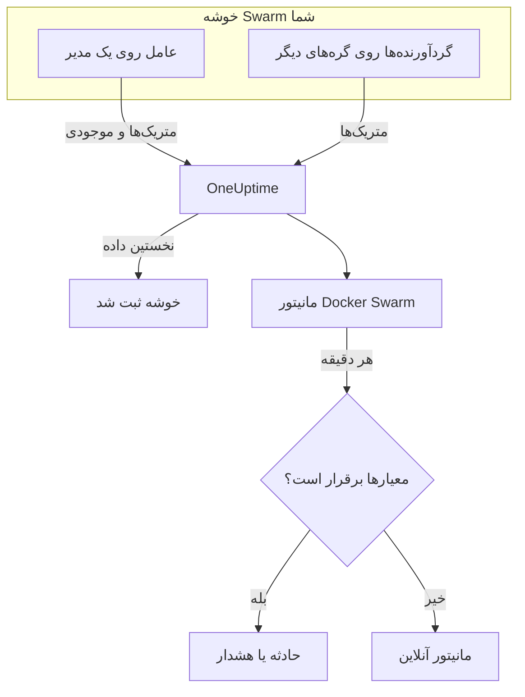

# مانیتور Docker Swarm

مانیتور Docker Swarm کانتینرهای پشت وظایف سرویس‌های یک خوشه Swarm را زیر نظر می‌گیرد و وقتی وظیفه‌ای دوباره راه‌اندازی می‌شود، داغ کار می‌کند یا حافظه‌اش تمام می‌شود به شما خبر می‌دهد. این مانیتور متریک‌های کانتینری را می‌خواند که عامل Docker Swarm در OneUptime می‌فرستد، پس هیچ چیز از بیرون کاوش نمی‌شود: عامل را نصب کنید، سپس مانیتور را از یک الگو یا پرس‌وجوی خودتان بسازید.

:::cards
- [ساخت مانیتور](#ساخت-یک-مانیتور-docker-swarm): شش گام در داشبورد.
- [الگوها](#الگوهای-هشدار-آماده): چهار هشدار آماده، یک حادثه به ازای هر وظیفه.
- [متریک‌ها](#متریکهای-جمعآوریشده): متریک‌های کانتینری که می‌توانید بر پایه‌شان هشدار دهید.
- [فیلترها](#تنظیمات-مانیتور): یک مانیتور را به یک سرویس، یک وظیفه یا یک ایمیج محدود کنید.
:::

## چگونه کار می‌کند

عامل Docker Swarm در OneUptime روی یک گره مدیر اجرا می‌شود. گردآورنده آن هر ۳۰ ثانیه آمار کانتینرها را از دیمن Docker همان گره می‌خواند و روی هر دسته نام خوشه، `docker.swarm.cluster.name`، را می‌زند. یک پرسشگر کوچک موجودی در کنار آن هر ۵ دقیقه گره‌ها، سرویس‌ها و وظایف خوشه را از API در Swarm می‌خواند. نخستین داده خوشه را در OneUptime ثبت می‌کند.

گردآورنده فقط کانتینرهای گره‌ای را می‌بیند که روی آن اجرا می‌شود. برای گرفتن متریک از همه گره‌ها، گردآورنده را روی هر گره با همان `DOCKER_SWARM_CLUSTER_NAME` اجرا کنید.

مانیتور Docker Swarm به یک خوشه وابسته است. هر دقیقه پرس‌وجوی خود را روی متریک‌های کانتینر آن خوشه اجرا می‌کند و نتیجه را با معیارهایش مقایسه می‌کند.

## پیش از شروع

- **عامل Docker Swarm را نصب کنید**، روی یک گره مدیر. [راهنمای عامل Docker Swarm](/docs/telemetry/docker-swarm) نصب و ارتقای آن و اجرای گردآورنده روی گره‌های دیگر را پوشش می‌دهد.
- **بررسی کنید خوشه ثبت شده باشد.** به محض رسیدن نخستین داده، با نام `DOCKER_SWARM_CLUSTER_NAME` عامل زیر **محصولات → زیرساخت → Docker Swarm → همه خوشه‌ها** پدیدار می‌شود.

## ساخت یک مانیتور Docker Swarm

:::steps
### یک مانیتور تازه شروع کنید

به **مانیتورها** بروید و روی **ساخت مانیتور** کلیک کنید.

### Docker Swarm را برگزینید

زیر **نوع مانیتور**، روی **انواع دیگر مانیتور** کلیک کنید و **Docker Swarm** را زیر **زیرساخت** برگزینید، یا در کادر جست‌وجو `swarm` را تایپ کنید. یک **نام** وارد کنید – در عنوان حادثه‌ها و هشدارها به کار می‌رود – و روی **بعدی** کلیک کنید.

### خوشه را برگزینید

زیر **Docker Swarm Monitor Configuration**، خوشه را از **Docker Swarm Cluster** برگزینید. هر خوشه‌ای که داده فرستاده در فهرست است.

### برگزینید چه چیزی پایش شود

یکی از سه زبانه را برگزینید:

- **Quick Setup** – روی یک [الگو](#الگوهای-هشدار-آماده) کلیک کنید. متریک، تجمیع، بازه زمانی و آستانه‌ها را تعیین می‌کند و معیارهای زیر را با معیارهای خودش جایگزین می‌کند. همچنان می‌توانید **بازه زمانی** را تغییر دهید.
- **Custom Metric** – یک متریک از **Docker Swarm Metric** برگزینید، سپس **تجمیع** و **بازه زمانی** را تعیین کنید. [فیلترها](#تنظیمات-مانیتور) آن را به برخی وظایف محدود می‌کنند.
- **پیشرفته** – پرس‌وجوها و فرمول‌ها را خودتان زیر **انتخاب متریک‌ها** بسازید. برای سنجش جداگانه هر وظیفه از **Group by** `resource.container.name` استفاده کنید.

### معیارها را بررسی کنید

هر معیار را زیر **معیارهای مانیتور** باز کنید و **متریک**، **تجمیع**، **شرط** و **Threshold** آن را بررسی کنید. الگو این‌ها را پر می‌کند. با **Custom Metric** یا **پیشرفته**، مانیتور با [معیارهای پیش‌فرض](#معیارهای-پیشفرض) شروع می‌شود که فقط افت متریک به صفر را می‌بینند، پس آستانه خودتان را تعیین کنید.

### مانیتور را بسازید

روی **ساخت مانیتور** کلیک کنید. OneUptime صفحه مانیتور را باز می‌کند و آن را هر دقیقه ارزیابی می‌کند. حادثه‌ها و هشدارهایی که باز می‌کند در صفحه‌های **حوادث** و **هشدارها**ی خوشه هم فهرست می‌شوند.
:::

> [!TIP]
> برای راه‌اندازی هم‌زمان چند الگو، خوشه را از **محصولات → زیرساخت → Docker Swarm** باز کنید و به **Recommendations** بروید. الگوهای دلخواه و کسانی را که باید خبر داده شوند برگزینید، و OneUptime به ازای هر الگو یک مانیتور می‌سازد.

## تنظیمات مانیتور

| فیلد | زبانه | چه می‌کند |
| --- | --- | --- |
| **Docker Swarm Cluster** | همه | الزامی. هر پرس‌وجو را به `resource.docker.swarm.cluster.name` محدود می‌کند. این تنها ویژگی منبعی است که عامل می‌زند، پس مانیتور فیلتری روی `container.runtime` یا `host.name` اضافه نمی‌کند. |
| **نام سرویس** | Custom Metric، پیشرفته | اختیاری. تطابق دقیق با `docker.swarm.service.name`، برای نمونه `web`. |
| **نام گره** | Custom Metric، پیشرفته | اختیاری. تطابق دقیق با `docker.swarm.node.name`، برای نمونه `swarm-node-1`. |
| **نام کانتینر** | Custom Metric، پیشرفته | اختیاری. تطابق دقیق با `resource.container.name`. نام کانتینر یک وظیفه `<service>.<slot>.<taskid>` است، برای نمونه `web.1.abc123`. |
| **ایمیج کانتینر** | Custom Metric، پیشرفته | اختیاری. تطابق دقیق با `resource.container.image.name`، برای نمونه `nginx:latest`. |
| **Docker Swarm Metric** | Custom Metric | یک متریک از [فهرست](#متریکهای-جمعآوریشده). |
| **تجمیع** | Custom Metric | شیوه ترکیب نمونه‌ها: **میانگین**، **بیشینه**، **کمینه**، **جمع** یا **تعداد**. از تجمیع معمول متریک شروع می‌شود. |
| **بازه زمانی** | همه | پنجره غلتانی که پرس‌وجو می‌خواند، از **Past 1 Minute** تا **Past 365 Days**. مانیتور تازه از **Past 1 Minute** شروع می‌شود؛ الگوها پنجره خودشان را تعیین می‌کنند. |
| **انتخاب متریک‌ها** | پیشرفته | سازنده پرس‌وجو: **متریک**، **Aggregate by**، **Filter by attributes**، **Group by**، به همراه **افزودن متریک** و **افزودن فرمول** برای ترکیب پرس‌وجوها. |

> [!WARNING]
> عامل همراه هنوز `docker.swarm.service.name` یا `docker.swarm.node.name` را تعیین نمی‌کند، پس مانیتوری که **نام سرویس** یا **نام گره** در آن پر شده باشد هیچ داده‌ای پیدا نمی‌کند. به جای آن با **ایمیج کانتینر** محدود کنید، یا بر پایه `resource.container.name` گروه‌بندی کنید.

## الگوهای هشدار آماده

**Quick Setup** چهار الگو ارائه می‌دهد. هر کدام یک مانیتور کامل می‌سازد: یک پرس‌وجوی گروه‌بندی‌شده بر پایه `resource.container.name`، یک معیار که فعال می‌شود و یکی که بهبود می‌یابد. هر وظیفه جداگانه سنجیده می‌شود و حادثه و هشدار خودش را می‌گیرد، که علت ریشه‌ای آن وظایف آسیب‌دیده و مقدارهایشان را فهرست می‌کند. آستانه‌ها نقطه شروع‌اند و می‌توانید ویرایششان کنید.

مگر جدول چیز دیگری بگوید، یک معیار فقط وقتی فعال می‌شود که شرط در همه دقیقه‌های پنجره‌اش برقرار باشد، و ۱۰٪ آن‌سوی آستانه بهبود می‌یابد تا مقداری که حول مرز نوسان دارد مدام جابه‌جا نشود.

| الگو | شدت | چه چیزی را پایش می‌کند | چه وقت فعال می‌شود | چه وقت بهبود می‌یابد |
| --- | --- | --- | --- | --- |
| Task Down (Low Uptime) | بحرانی | `container.uptime`، Min به ازای هر وظیفه، ۱ دقیقه گذشته | هر مقداری کمتر از ۶۰ ثانیه باشد | همه مقدارها ۶۶ ثانیه یا بیشتر باشند |
| High Task CPU Usage | Warning | `container.cpu.utilization`، Avg به ازای هر وظیفه، ۵ دقیقه گذشته | بیش از ۸۰ (درصدِ یک هسته) | ۷۲ یا کمتر |
| High Task Memory Usage | Warning | `container.memory.percent`، Avg به ازای هر وظیفه، ۵ دقیقه گذشته | بیش از ۸۵٪ | ۷۶٫۵٪ یا کمتر |
| High Task Process Count | Warning | `container.pids.count`، Max به ازای هر وظیفه، ۵ دقیقه گذشته | بیش از ۵۰۰ | ۴۵۰ یا کمتر |

**شدت** برچسبی است که فهرست انتخاب نشان می‌دهد. حادثه و هشداری که یک الگو می‌سازد از شدیدترین شدت حادثه و هشدار پروژه شما شروع می‌شوند؛ آن‌ها را در معیارها تغییر دهید.

> [!NOTE]
> **Task Down (Low Uptime)** با یک نمونه تازه تنها فعال می‌شود، چون راه‌اندازی دوباره یک رویداد است، نه یک سطح. Swarm به وظیفه جایگزین یک کانتینر تازه و در نتیجه یک سری تازه می‌دهد، و به همین دلیل الگو به جای ۰ به دنبال مدت روشن‌بودنی کمتر از یک دقیقه می‌گردد. یک استقرار یا افزایش مقیاس هم آن را فعال می‌کند، و وقتی وظایف تازه از یک دقیقه مدت روشن‌بودن گذشتند برطرف می‌شود. وظیفه‌ای که از کار می‌افتد و جایگزین نمی‌شود چیزی نمی‌فرستد، پس گرفته نمی‌شود.

## متریک‌های جمع‌آوری‌شده

گردآورنده عامل از گیرنده `docker_stats` در OpenTelemetry استفاده می‌کند، پس متریک‌ها همان متریک‌های استاندارد کانتینرند، یک سری به ازای هر کانتینر وظیفه. هیچ متریک `docker_swarm_*` وجود ندارد: گره‌ها، سرویس‌ها و وظایف به‌صورت موجودی دنبال می‌شوند، در صفحه‌های **سرویس‌ها**، **وظایف**، **گره‌ها** و صفحه‌های مرتبط خوشه.

### CPU

| متریک | یکا | توضیح |
| --- | --- | --- |
| `container.cpu.utilization` | % | مصرف CPU کانتینر یک وظیفه، که در آن ۱۰۰٪ یک هسته کامل CPU است. |

### حافظه

| متریک | یکا | توضیح |
| --- | --- | --- |
| `container.memory.usage.total` | بایت | حافظه‌ای که کانتینر یک وظیفه مصرف می‌کند. |
| `container.memory.percent` | % | حافظه مصرف‌شده به‌صورت درصدی از محدودیت کانتینر، یا از کل حافظه گره وقتی سرویس محدودیتی تعیین نکرده است. |

### شبکه

| متریک | یکا | توضیح |
| --- | --- | --- |
| `container.network.io.usage.rx_bytes` | بایت | بایت‌های دریافتی کانتینر یک وظیفه. شمارنده‌ای در طول عمر. |
| `container.network.io.usage.tx_bytes` | بایت | بایت‌های ارسالی کانتینر یک وظیفه. شمارنده‌ای در طول عمر. |

### کانتینر

| متریک | یکا | توضیح |
| --- | --- | --- |
| `container.pids.count` | تعداد | فرایندهای درون کانتینر یک وظیفه. افزایش ناگهانی می‌تواند نشانه یک بمب fork یا نشت باشد. |
| `container.uptime` | ثانیه | مدت زمانی که کانتینر یک وظیفه در حال اجراست. وظیفه‌ای که دوباره زمان‌بندی یا راه‌اندازی شود، کانتینر تازه‌ای را از ۰ شروع می‌کند. |

هر سری هویت کانتینر را به‌صورت ویژگی‌های منبع با خود دارد: `resource.container.name` (`<service>.<slot>.<taskid>`)، `resource.container.image.name` و `resource.docker.swarm.cluster.name`.

## معیارهای مانیتورینگ

یک معیار یکی از پرس‌وجوها یا فرمول‌های مانیتور را با یک آستانه مقایسه می‌کند. معیارهای مانیتور Docker Swarm **نوع فیلتر** ندارند: هر قاعده مقدار متریک را با این فیلدها بررسی می‌کند.

| فیلد | چه می‌کند |
| --- | --- |
| **متریک** | پرس‌وجو یا فرمولی که بررسی می‌شود، بر پایه نام متغیرش. |
| **تجمیع** | اینکه مقدارهای پنجره چطور به یک پاسخ تبدیل می‌شوند: **میانگین**، **جمع**، **Maximum Value**، **Minimum Value**، **All Values** (همه مقدارها باید جور باشند) یا **Any Value** (یکی کافی است). |
| **شرط** | **Greater Than**، **Less Than**، **Greater Than Or Equal To**، **Less Than Or Equal To** یا **Equal To** – یا یک شرط ناهنجاری: **Anomalously High**، **Anomalously Low** یا **Anomalous**. |
| **Threshold** | مقداری که با آن مقایسه می‌شود. وقتی متریک یکا دارد، فهرستی از یکاها کنارش هست. برای شرط‌های ناهنجاری نشان داده نمی‌شود. |
| **حساسیت** | فقط شرط‌های ناهنجاری. **پایین** (۴σ)، **متوسط** (۳σ، پیش‌فرض) یا **بالا** (۲σ). |
| **پنجره مبنا** | فقط شرط‌های ناهنجاری. ۱۴ روز (پیش‌فرض)، ۲۸، ۶۰ یا ۹۰ روز سابقه. |
| **اگر داده‌ای نبود** | زیر **فیلدهای بیشتر**. وقتی پنجره هیچ نمونه‌ای ندارد چه شود: **Ignore** (پیش‌فرض)، **Treat As Zero** یا **تریگر**. |

شرط‌های ناهنجاری هر مقدار را با همان ساعت از هفته در خط مبنا مقایسه می‌کنند. تا وقتی پنجره مبنا سابقه کافی نداشته باشد، در وضعیت «Learning» می‌مانند و چیزی پدید نمی‌آورند.

هر معیار همچنین می‌گوید وقتی برقرار شد چه باید کرد: تغییر وضعیت مانیتور، ساختن یک هشدار یا اعلام یک حادثه. معیارها از بالا به پایین بررسی می‌شوند و نخستین معیاری که برقرار شود تصمیم می‌گیرد.

### معیارهای پیش‌فرض

مانیتوری که از الگو نمی‌سازید با دو معیار شروع می‌شود:

| ترتیب | معیار | وقتی برقرار است که | سپس |
| --- | --- | --- | --- |
| ۱ | Check if _monitor name_ is offline | هر مقداری از نخستین پرس‌وجو `0` باشد | مانیتور را **آفلاین** علامت می‌زند و حادثه «_monitor name_ is offline» را اعلام می‌کند، که با بهبود مانیتور خودش برطرف می‌شود. |
| ۲ | Check if _monitor name_ is online | هر مقداری بیش از `0` باشد | مانیتور را **عملیاتی** علامت می‌زند. |

> [!IMPORTANT]
> سکوت با هیچ‌یک از دو معیار جور نیست: خوشه‌ای که دیگر داده نمی‌فرستد مانیتور را همان‌طور که بود رها می‌کند. برای اینکه وقتی داده قطع شد خبردار شوید، **اگر داده‌ای نبود** را در یک معیار روی **تریگر** بگذارید. زمانی که خود OneUptime داده دریافت نمی‌کرد هرگز «بدون داده» به حساب نمی‌آید: بررسی‌ای که پنجره‌اش چنین زمانی را در بر دارد به جای آن صبر می‌کند، همان‌طور که [وقتی OneUptime داده دریافت نمی‌کند](/docs/monitor/when-oneuptime-is-not-receiving) توضیح می‌دهد.

## رفع اشکال

:::details خوشه در فهرست Docker Swarm Cluster نیست
خوشه‌ها خودشان از روی داده‌های عامل ثبت می‌شوند. بررسی کنید عامل روی یک گره مدیر در حال اجرا باشد، `DOCKER_SWARM_CLUSTER_NAME` تعیین شده باشد و خوشه زیر **محصولات → زیرساخت → Docker Swarm → همه خوشه‌ها** فهرست شده باشد. [راهنمای عامل Docker Swarm](/docs/telemetry/docker-swarm) بررسی‌هایی را دارد که باید روی گره اجرا کنید.
:::

:::details فقط برخی وظایف متریک دارند
گردآورنده دیمن Docker گره‌ای را می‌خواند که روی آن اجرا می‌شود، پس فقط وظایف همان گره را می‌بیند. گردآورنده را روی هر گره با همان `DOCKER_SWARM_CLUSTER_NAME` اجرا کنید.
:::

:::details مانیتوری که با سرویس یا گره فیلتر شده داده‌ای پیدا نمی‌کند
**نام سرویس** و **نام گره** با `docker.swarm.service.name` و `docker.swarm.node.name` تطبیق می‌دهند که عامل همراه آن‌ها را تعیین نمی‌کند. آن‌ها را پاک کنید و با **ایمیج کانتینر** محدود کنید، یا بر پایه `resource.container.name` گروه‌بندی کنید.
:::

:::details همه وظایف به‌صورت یک سری نشان داده می‌شوند
مانند الگوها، بر پایه ویژگی منبع `resource.container.name` گروه‌بندی کنید. `container.name` تنها با هیچ چیزی جور نمی‌شود، پس همه وظایف در یک سری با نام خالی ادغام می‌شوند.
:::

## گام‌های بعدی

:::cards
- [عامل Docker Swarm](/docs/telemetry/docker-swarm): عاملی را که این مانیتور می‌خواند نصب و ارتقا دهید.
- [مانیتور Docker](/docs/monitor/docker-monitor): کانتینرهای یک میزبان Docker را پایش کنید.
- [نمای کلی حوادث](/docs/incidents/index): پس از آنکه یک معیار حادثه‌ای اعلام کرد چه اتفاقی می‌افتد.
- [زمان‌بندی‌های آنکال](/docs/on-call/schedules): تصمیم بگیرید وقتی وظیفه‌ای از کار افتاد به چه کسی خبر داده شود.
:::
