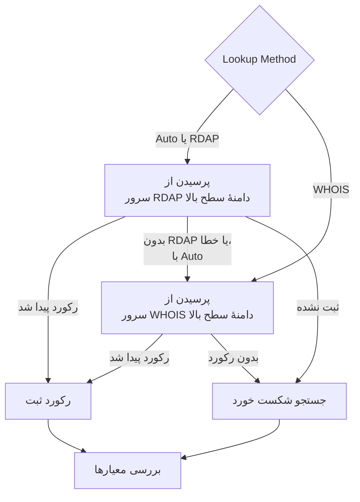

# مانیتور دامنه

مانیتور دامنه طبق یک زمان‌بندی رکورد ثبت دامنهٔ شما را می‌خواند تا تاریخ انقضا، ثبت‌کننده، Nameserverها و کدهای وضعیت آن را دنبال کند، و پیش از انقضای دامنه به شما هشدار می‌دهد. از آن برای هر دامنه‌ای که وب‌سایت‌ها، APIها و ایمیل شما به آن وابسته‌اند استفاده کنید: ثبتی که منقضی شود همهٔ آن‌ها را یک‌جا از کار می‌اندازد.

:::cards
- [ساخت مانیتور](#ساخت-یک-مانیتور-دامنه): شش گام در داشبورد.
- [روش‌های جستجو](#روشهای-جستجو): RDAP، WHOIS، و اینکه چرا **Auto** پیش‌فرض است.
- [معیارهای پیش‌فرض](#معیارهای-پیشفرض): هشدار انقضا ۳۰ روز زودتر، بدون هیچ تنظیمی.
- [رفع اشکال](#رفع-اشکال): سرورهای WHOIS ازکارافتاده، پراکسی‌ها و تاریخ‌های گمشده.
:::

## چگونه کار می‌کند

در هر بررسی، پراب بسته به **Lookup Method** رکورد ثبت دامنه را از راه RDAP یا WHOIS جستجو می‌کند و آنچه را می‌یابد یکدست می‌کند: تاریخ انقضا، ثبت‌کننده، Nameserverها و کدهای وضعیت. جستجویی که شکست بخورد، تا تعداد تلاش‌های مجددی که تعیین می‌کنید دوباره امتحان می‌شود. سپس OneUptime رکورد را از معیارهای مانیتور عبور می‌دهد.

اگر یک جستجو نتواند دادهٔ ثبت را به دست دهد — چون سرویس دامنهٔ سطح بالا از کار افتاده، یا دامنه ثبت نشده است — مانیتور به‌جای اینکه با یک تاریخ انقضای خالی سالم گزارش شود، **آفلاین** گزارش می‌شود و علت آن در پاسخ پراب مانیتور نشان داده می‌شود. رجیستری‌ای که پاسخ دهد «این دامنه آزاد است» (برای نمونه `Status: free` در DENIC) به‌عنوان **ثبت نشده** در نظر گرفته می‌شود، نه یک رکورد سالم.

نام‌های دامنهٔ بین‌المللی در هر دو شکل پذیرفته می‌شوند: `münchen.de` پیش از جستجو به برچسب A آن (`xn--mnchen-3ya.de`) تبدیل می‌شود.

## پیش از شروع

- **نقشی که بتواند مانیتور بسازد**: Project Owner، Project Admin، Project Member، Monitor Admin یا Monitor Member، یا یک نقش سفارشی با مجوز Create Monitor.
- **دسترسی خروجی از پراب** به رجیستری‌ها. پراب‌های پیش‌فرض پروژهٔ شما برای هر مانیتور تازه انتخاب می‌شوند؛ یک [پراب سفارشی](/docs/probe/custom-probe) باید به این‌ها برسد:

| مقصد | پروتکل | برای چه |
| --- | --- | --- |
| `https://data.iana.org/rdap/dns.json` | HTTPS، پورت ۴۴۳ | رجیستری bootstrap مربوط به RDAP از IANA، که می‌گوید سرور RDAP هر دامنهٔ سطح بالا کجاست. یک بار دریافت و به مدت ۲۴ ساعت نگه‌داری می‌شود. |
| سرورهای RDAP رجیستری‌ها | HTTPS، پورت ۴۴۳ | جستجوهای RDAP. |
| سرورهای WHOIS | پورت TCP شمارهٔ ۴۳ | جستجوهای WHOIS. |

درخواست‌های RDAP از تنظیمات `HTTP_PROXY_URL` / `HTTPS_PROXY_URL` / `NO_PROXY` پراب پیروی می‌کنند. WHOIS روی یک سوکت خام اجرا می‌شود و پیروی نمی‌کند. اگر پرابی نتواند به `data.iana.org` برسد، **Auto** به WHOIS برمی‌گردد و پنج دقیقه بعد دوباره IANA را امتحان می‌کند.

## ساخت یک مانیتور دامنه

:::steps
### شروع یک مانیتور تازه

به **مانیتورها** بروید و روی **ساخت مانیتور** کلیک کنید. در **نوع مانیتور** روی **انواع دیگر مانیتور** کلیک کنید و زیر **Basic Monitoring** گزینهٔ **دامنه** را انتخاب کنید.

### نام‌گذاری

یک **نام** وارد کنید، مثل `example.com registration`، و روی **بعدی** کلیک کنید.

### وارد کردن دامنه

**نام دامنه** را وارد کنید، مثل `example.com`. مگر اینکه دلیلی داشته باشید، **Lookup Method** را روی **Auto** بگذارید ([روش‌های جستجو](#روشهای-جستجو) را ببینید).

### آزمایش

روی **آزمایش مانیتور** کلیک کنید، در **انتخاب پراب** یک پراب انتخاب کنید و روی **اجرای آزمایش** کلیک کنید. **نتیجه آزمایش مانیتور** رکورد ثبتی را که پراب خواند نشان می‌دهد، و اینکه RDAP پاسخ داد یا WHOIS.

### بازبینی معیارها

**معیارهای مانیتور** با [معیارهای پیش‌فرض](#معیارهای-پیشفرض) شروع می‌شود: آفلاین وقتی ثبت منقضی شده یا قابل خواندن نیست، هشدار وقتی در ۳۰ روز یا کمتر منقضی می‌شود. در صورت نیاز آن‌ها را تغییر دهید و روی **بعدی** کلیک کنید.

### انتخاب پراب‌ها و ساخت

**پراب‌ها** و **بازه پایش** (که از **هر ۵ دقیقه** شروع می‌شود) را نگه دارید یا تغییر دهید و روی **ساخت مانیتور** کلیک کنید. صفحهٔ مانیتور باز می‌شود.
:::

## گزینه‌های پیکربندی

| فیلد | پیش‌فرض | چه وارد کنید |
| --- | --- | --- |
| **نام دامنه** | هیچ | دامنهٔ ثبت‌شده، مثل `example.com`. نشانی چسبانده‌شده هم کار می‌کند: `https://example.com/pricing` به‌صورت `example.com` خوانده می‌شود. |
| **Lookup Method** | **Auto** | **Auto**، **RDAP** یا **WHOIS**. [روش‌های جستجو](#روشهای-جستجو) را ببینید. |
| **وقفه (میلی‌ثانیه)** (زیر **فیلدهای بیشتر**) | `10000` | مدت انتظار برای هر جستجوی ثبت، به میلی‌ثانیه. |
| **تلاش‌های مجدد** (زیر **فیلدهای بیشتر**) | `3` | تلاش‌های مجدد پس از شکست نخستین تلاش. `0` یعنی فقط یک تلاش. |

هر جستجوی ناموفق دوباره امتحان می‌شود، با یک ثانیه مکث میان تلاش‌ها. این شامل رجیستری‌ای هم می‌شود که پاسخ دهد دامنه ثبت نشده، یا سرویس ثبتی ندارد، برای حالتی که آن پاسخ یک خطای گذرا بوده باشد. فقط نام دامنه‌ای که شکل نادرست دارد بی‌درنگ و بدون جستجو گزارش می‌شود.

وقفه برای هر درخواست اعمال می‌شود، نه برای کل بررسی: یک بررسی با **Auto** که RDAP را امتحان می‌کند و سپس به WHOIS برمی‌گردد، ممکن است دو برابر یا بیشتر طول بکشد.

### روش‌های جستجو

دادهٔ ثبت را می‌توان از راه دو پروتکل خواند، و اینکه کدام کار کند به دامنهٔ سطح بالا بستگی دارد.

| روش | رفتار |
| --- | --- |
| **Auto** | پیش‌فرض. وقتی دامنهٔ سطح بالا یک سرویس RDAP منتشر می‌کند از RDAP استفاده می‌کند، و وقتی منتشر نمی‌کند، یا جستجوی RDAP شکست می‌خورد، به WHOIS برمی‌گردد. |
| **RDAP** | فقط RDAP. اگر دامنهٔ سطح بالا هیچ سرویس RDAPی منتشر نکند، با یک خطای روشن شکست می‌خورد. |
| **WHOIS** | فقط WHOIS. |

**RDAP** ([RFC 9083](https://www.rfc-editor.org/rfc/rfc9083)) جایگزین WHOIS است که ICANN آن را الزامی کرده است. سرور معتبر هر دامنهٔ سطح بالا از [رجیستری bootstrap مربوط به IANA](https://www.rfc-editor.org/rfc/rfc9224) پیدا می‌شود، پس با جابه‌جایی رجیستری‌ها درست می‌ماند. همهٔ gTLDها یکی منتشر می‌کنند. وقتی سرور RDAP دامنهٔ سطح بالا بگوید دامنه ثبت نشده، **Auto** همان را پاسخ می‌گیرد و از WHOIS نمی‌پرسد.

**WHOIS** هیچ سازوکار کشف مشابهی ندارد — کلاینت‌ها یک نگاشت ثابت از دامنهٔ سطح بالا به میزبان WHOIS همراه خود دارند، و این نگاشت‌ها کهنه می‌شوند. همهٔ دامنه‌های سطح بالای Identity Digital (`.digital`، `.email`، `.life`، `.today`، `.zone` و حدود ۲۹۰ دامنهٔ دیگر) هنوز به میزبانی ازکارافتاده نگاشت شده‌اند که اکنون به هر پرس‌وجو به‌جای یک رکورد با متن عینی `TLD is not supported.` پاسخ می‌دهد. WHOIS برای بسیاری از ccTLDها که اصلاً هیچ سرویس RDAPی منتشر نمی‌کنند، مثل `.io`، `.co`، `.de`، `.ch` و `.jp`، تنها گزینه باقی می‌ماند.

## معیارهای پایش

معیارها تعیین می‌کنند دامنه چه زمانی سالم یا خراب به حساب بیاید، و آیا این وضعیت حادثه اعلام کند یا هشدار بسازد. هر معیار یک یا چند فیلتر را بررسی می‌کند:

| فیلتر | شرط‌ها | چه چیزی را بررسی می‌کند |
| --- | --- | --- |
| **Is Online** | **درست**، **نادرست** | اینکه خود جستجوی ثبت موفق شد یا نه. |
| **Is Request Timeout** | **درست**، **نادرست** | اینکه جستجو در همهٔ تلاش‌ها به وقفه خورد یا نه. |
| **Domain Expires In Days** | **Greater Than**، **Less Than**، **Greater Than Or Equal To**، **Less Than Or Equal To** | روزهای باقی‌مانده تا انقضای ثبت، رو به بالا به یک روز کامل گرد شده. |
| **Domain Is Expired** | **درست**، **نادرست** | اینکه تاریخ انقضا گذشته است یا نه. |
| **Domain Registrar** | **شامل است**، **Not Contains**، **Starts With**، **Ends With**، **Equal To**، **Not Equal To** | نام ثبت‌کننده. |
| **Domain Name Server** | **شامل است**، **Not Contains**، **Starts With**، **Ends With**، **Equal To**، **Not Equal To** | Nameserverهای دامنه. وقتی هر یک از آن‌ها مطابقت کند مطابقت می‌کند. |
| **Domain Status Code** | **شامل است**، **Not Contains**، **Starts With**، **Ends With**، **Equal To**، **Not Equal To** | کدهای وضعیت EPP دامنه. وقتی هر یک از آن‌ها مطابقت کند مطابقت می‌کند. |

کدهای وضعیت، صرف‌نظر از اینکه کدام پروتکل پاسخ داده، به نام‌های EPP خود (`clientTransferProhibited`) یکدست می‌شوند، پس وقتی **Auto** میان RDAP و WHOIS جابه‌جا می‌شود معیار همچنان مطابقت می‌کند. _نام‌های_ ثبت‌کننده همان چیزی است که سرویس پاسخ‌دهنده منتشر می‌کند و ممکن است میان دو پروتکل کمی فرق کند، پس برای معیار **Domain Registrar**، **شامل است** را به **Equal To** ترجیح دهید.

تاریخ‌ها به ISO 8601 یکدست می‌شوند. تاریخی که یک رجیستری به شکلی منتشر کند که قابل تجزیه نیست، به‌جای ذخیره شدن کنار گذاشته می‌شود، تا معیار انقضا نتواند تصمیم بگیرد و مطابقت نکند، نه اینکه برای همیشه بی‌صدا پاسخ «منقضی نشده» بدهد.

با دو فیلتر یا بیشتر، **شرط تطابق** تعیین می‌کند که **همه** باید مطابقت کنند یا **هر** کدام کافی است. **اقدام‌ها**ی یک معیار تعیین می‌کنند چه کاری انجام دهد: تغییر وضعیت مانیتور، ساخت هشدار، اعلام حادثه، یا هر ترکیبی از این‌ها.

### معیارهای پیش‌فرض

مانیتور دامنهٔ تازه با سه معیار شروع می‌شود، پس بدون هیچ تنظیمی پیش از انقضای ثبت به شما هشدار می‌دهد:

1. **بررسی دامنه شکست خورد** — ثبت منقضی شده، یا دادهٔ ثبت آن قابل خواندن نبود. مانیتور **آفلاین** علامت می‌خورد و حادثه‌ای با نام «_monitor name_ domain check failed» ساخته می‌شود. وقتی ثبت دوباره خوانده شود و معتبر باشد، حادثه خودش حل می‌شود.
2. **دامنه به‌زودی منقضی می‌شود** — ثبت منقضی نشده اما در ۳۰ روز یا کمتر منقضی می‌شود. یک **هشدار** با نام «_monitor name_ domain expires soon» ساخته می‌شود.
3. **دامنه منقضی نشده است** — مانیتور **عملیاتی** علامت می‌خورد.

هشدار «به‌زودی منقضی می‌شود» یک هشدار است، نه حادثه: در صفحات وضعیت شما نشان داده نمی‌شود، تا وقتی یک سیاست آنکال به آن اضافه نکنید کسی را فرا نمی‌خواند، و وضعیت مانیتور را تغییر نمی‌دهد. از دومین شدت هشدار پروژهٔ شما استفاده می‌کند، که در یک پروژهٔ تازه **Low** است. همین که تمدید در رکورد ثبت دیده شود، هشدار خودش حل می‌شود. رجیستری‌ای که هیچ تاریخ انقضایی منتشر نمی‌کند چیزی به هشدار نمی‌دهد، پس هشدار ساکت می‌ماند.

معیارها از بالا به پایین بررسی می‌شوند و نخستین معیاری که مطابقت کند تعیین می‌کند چه اتفاقی بیفتد. به همین دلیل «به‌زودی منقضی می‌شود» بالای «منقضی نشده است» قرار دارد: دامنه‌ای که در آستانهٔ انقضاست هنوز منقضی نشده، پس با هر دو مطابقت می‌کرد.

برای اینکه زودتر هشدار بگیرید، مقدار فیلتر **Domain Expires In Days** را در معیار «به‌زودی منقضی می‌شود» تغییر دهید، برای نمونه به `60`. برای اینکه به‌جای آن کسی فرا خوانده شود، **اقدام‌ها**ی آن معیار را باز کنید: **وقتی فیلترها مطابقت پیدا کردند، یک حادثه اعلام کن.** را روشن کنید، یا هشدار را نگه دارید و زیر **سیاست‌های آنکال** یک سیاست آنکال به آن اضافه کنید.

:::details افزودن هشدار به مانیتوری که پیش از وجود آن ساخته شده
مانیتورهایی که پیش از افزوده شدن این هشدار به OneUptime ساخته شده‌اند معیار «به‌زودی منقضی می‌شود» را ندارند. برای افزودن آن:

1. روی مانیتور، **پیکربندی → معیارها** را باز کنید و روی **ویرایش معیارهای پایش** کلیک کنید.
2. روی **افزودن معیار** کلیک کنید. فیلتر آن را روی **Domain Is Expired** / **نادرست** بگذارید، روی **افزودن فیلتر** کلیک کنید و دومی را روی **Domain Expires In Days** / **Less Than Or Equal To** / `30` بگذارید. **شرط تطابق** را روی **همه** بگذارید (وقتی دو فیلتر باشد، زیر فیلترها ظاهر می‌شود).
3. زیر **اقدام‌ها**، **وقتی فیلترها مطابقت پیدا کردند، یک هشدار بساز.** را روشن کنید و **وقتی فیلترها مطابقت پیدا کردند، وضعیت مانیتور را تغییر بده.** را خاموش بگذارید، تا هشدار بسازد و وضعیت مانیتور را تغییر ندهد.
4. معیار تازه را بالای معیاری که مانیتور را آنلاین علامت می‌زند بکشید و سپس ذخیره کنید.
:::

### نمونهٔ معیارها

| هدف | فیلتر | شرط | مقدار |
| --- | --- | --- | --- |
| هشدار وقتی دامنه ظرف ۳۰ روز منقضی می‌شود (یک معیار پیش‌فرض) | **Domain Expires In Days** | **Less Than Or Equal To** | `30` |
| آفلاین وقتی دامنه منقضی شده است | **Domain Is Expired** | **درست** | — |
| آفلاین وقتی ثبت قابل خواندن نیست | **Is Online** | **نادرست** | — |
| هشدار وقتی Nameserverها تغییر می‌کنند | **Domain Name Server** | **Not Contains** | `ns1.example.com` |
| هشدار وقتی قفل انتقال دامنه باز می‌شود | **Domain Status Code** | **Not Contains** | `clientTransferProhibited` |

**Domain Name Server** و **Domain Status Code** وقتی مطابقت می‌کنند که _هر یک_ از مقدارها مطابقت کند، پس **Not Contains** همین که یک Nameserver، یا یک کد وضعیت، آن متن را نداشته باشد مطابقت می‌کند.

## بهترین شیوه‌ها

1. **به خودتان برای تمدید فرصت بدهید** — هشدار پیش‌فرض ۳۰ روز پیش از انقضا می‌آید. اگر تمدید به تأییدها یا پرداختی نیاز دارد که بیشتر طول می‌کشد، آن را به ۶۰ روز افزایش دهید.
2. **جستجوهای ناموفق را پوشش دهید** — یک فیلتر **Is Online** / **نادرست** در معیار آفلاین خود بگذارید تا ثبتی که قابل خواندن نیست با یک ثبت سالم اشتباه گرفته نشود. مانیتورهای تازه آن را در معیارهای پیش‌فرض خود دارند؛ مانیتوری که پیش از افزوده شدن آن ساخته شده باید آن را دستی اضافه کند. برای کنار آمدن با سرور WHOISی که گاه‌به‌گاه نرخ درخواست‌های پراب را محدود می‌کند، زیر آن فیلتر **این معیار را در یک بازه زمانی ارزیابی کن** را تیک بزنید و **All Values** را انتخاب کنید: آنگاه دامنه فقط وقتی آفلاین می‌شود که همهٔ جستجوهای بازه شکست خورده باشند.
3. **همهٔ دامنه‌های حیاتی را پایش کنید** — دامنه‌های اصلی، زیردامنه‌هایی که جداگانه ثبت شده‌اند، و هر دامنه‌ای را که برای ایمیل یا APIها به کار می‌رود در نظر بگیرید.
4. **تغییر ثبت‌کننده را دنبال کنید** — برای گرفتن یک انتقال غیرمجاز، معیاری با **Domain Registrar** / **Not Contains** / نام ثبت‌کنندهٔ خودتان اضافه کنید.

## رفع اشکال

:::details سرور WHOIS «answered without any registration data»
میزبان WHOIS دامنهٔ سطح بالا از کار افتاده، نرخ درخواست‌های پراب را محدود می‌کند، یا به‌طور موقت خراب است. یک میزبان ازکارافتاده، مثل میزبانی که هنوز برای دامنه‌های سطح بالای Identity Digital نگاشت شده، هر بار `TLD is not supported.` پاسخ می‌دهد. اگر شکست با **Lookup Method** روی **WHOIS** ادامه یابد، به **Auto** بروید، تا پراب هر جا که سرویس RDAP هست آن را بخواند.
:::

:::details بررسی با «No RDAP service is published» شکست می‌خورد
مانیتور از **RDAP** استفاده می‌کند، و دامنهٔ سطح بالا هیچ سرویس RDAPی منتشر نمی‌کند، همان‌طور که بسیاری از ccTLDها نمی‌کنند. **Lookup Method** را روی **Auto** بگذارید، که به WHOIS برمی‌گردد.
:::

:::details دامنه ثبت نشده گزارش می‌شود
رجیستری پاسخ داد که دامنه آزاد است. املای آن را بررسی کنید، و اینکه دامنهٔ ثبت‌شده را وارد کرده‌اید، مثل `example.com`، نه یک زیردامنه.
:::

:::details جستجوها روی پرابی پشت پراکسی شکست می‌خورند
RDAP از تنظیمات پراکسی پراب عبور می‌کند، WHOIS نه. پورت TCP خروجی ۴۳ را برای WHOIS باز کنید، یا برای دامنه‌های سطح بالایی که سرویس RDAP منتشر می‌کنند از **Auto** یا **RDAP** استفاده کنید.
:::

:::details تاریخ انقضا خالی است، و معیارهای انقضا هرگز فعال نمی‌شوند
رجیستری هیچ تاریخ انقضایی منتشر نمی‌کند، یا آن را به شکلی منتشر می‌کند که قابل تجزیه نیست. معیارهای انقضا بدون تاریخ نمی‌توانند تصمیم بگیرند، پس ساکت می‌مانند. **Is Online** همچنان به شما می‌گوید که آیا رکورد قابل خواندن است.
:::

## گام‌های بعدی

:::cards
- [مانیتور گواهی SSL](/docs/monitor/ssl-certificate-monitor): پیش از انقضای گواهی‌های روی دامنه هشدار بگیرید.
- [مانیتور DNS](/docs/monitor/dns-monitor): بررسی کنید که رکوردهای دامنه resolve می‌شوند و چه می‌گویند.
- [مانیتور DNSSEC](/docs/monitor/dnssec-monitor): زنجیرهٔ اعتماد یک زُن امضاشده را اعتبارسنجی کنید.
- [قواعد تشدید](/docs/on-call/escalation-rules): تعیین کنید هشدارها و حوادث چه کسی را فرا بخوانند.
:::
