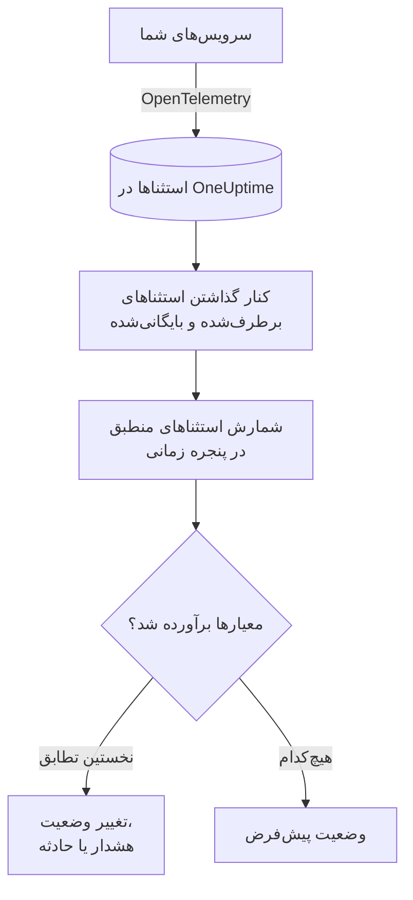

# مانیتور استثناها

مانیتور استثناها استثناهایی را که سرویس‌های شما به OneUptime گزارش می‌دهند و با فیلترهای شما (پیام، نوع استثنا، محیط، سرویس) منطبق‌اند، در یک پنجره زمانی می‌شمارد. وقتی این شمارش معیارهای شما را برآورده کند، وضعیت مانیتور را تغییر می‌دهد، هشدار می‌سازد یا حادثه اعلام می‌کند. از آن برای هشدار روی هر کرش تازه در production، روی یک نوع استثنا یا روی افزایش ناگهانی خطاها استفاده کنید.

:::cards
- [ساخت مانیتور](#ساخت-یک-مانیتور-استثناها): استثناهایی که شمرده می‌شوند و زمان هشدار را انتخاب کنید.
- [محیط‌ها](#محیطها): مانیتور را به `production` محدود کنید.
- [چگونه ارزیابی می‌شود](#چگونه-ارزیابی-میشود): چه چیزی شمرده می‌شود، و برطرف کردن یک استثنا چه اثری دارد.
- [معیارها](#معیارها): شرط‌ها و پیش‌فرض‌ها.
:::

## چگونه کار می‌کند



هر دقیقه، OneUptime استثناهایی را که با فیلترهای مانیتور منطبق‌اند و در پنجره زمانی آن رخ داده‌اند می‌شمارد و استثناهایی را که برطرف‌شده یا بایگانی‌شده علامت زده‌اید کنار می‌گذارد. سپس این شمارش را از بالا به پایین با معیارهای مانیتور می‌سنجد و نخستین معیاری که منطبق شود تعیین می‌کند چه اتفاقی بیفتد. وقتی هیچ‌کدام منطبق نشود، مانیتور به وضعیت پیش‌فرض خود برمی‌گردد.

## پیش از شروع

- سرویس‌های شما استثناها را از طریق OpenTelemetry به OneUptime می‌فرستند. [OpenTelemetry](/docs/telemetry/open-telemetry) را ببینید.
- برای محدود کردن مانیتور به یک محیط، سرویس‌های شما باید ویژگی منبع `deployment.environment` را تنظیم کنند.

## ساخت یک مانیتور استثناها

:::steps
### شروع یک مانیتور تازه

به **مانیتورها** بروید و روی **ساخت مانیتور** کلیک کنید.

### انتخاب نوع استثناها

در **نوع مانیتور**، روی **انواع دیگر مانیتور** کلیک کنید و **استثناها** را زیر **تله‌متری** انتخاب کنید، یا در کادر جستجو `exceptions` را تایپ کنید. یک **نام** وارد کنید و روی **بعدی** کلیک کنید.

### انتخاب استثناهایی که شمرده می‌شوند

در **پیکربندی مانیتور استثنا**، **فیلتر پیام استثنا**، **انواع استثنا**، **Environments** و **پایش استثناها به مدت (زمان)** را تنظیم کنید. فیلتری که خالی بگذارید با همهٔ استثناها منطبق است. **پیش‌نمایش استثناها**، زیر فیلترها، استثناهایی را نشان می‌دهد که همین حالا با آن‌ها منطبق‌اند.

### محدودتر کردن آن‌ها (اختیاری)

برای فیلتر بر اساس سرویس تله‌متری یا موجودیت زیرساخت، یا برای اینکه استثناهای برطرف‌شده و بایگانی‌شده هم شمرده شوند، **فیلدهای بیشتر** را باز کنید.

### تعیین معیارها

کارت **معیارهای مانیتور** با دو معیار شروع می‌شود: آفلاین همراه با یک حادثه، وقتی هر استثنایی منطبق باشد؛ آنلاین، وقتی هیچ‌کدام منطبق نباشد. آن‌ها را به آنچه می‌خواهید روی آن هشدار بگیرید تغییر دهید ([معیارها](#معیارها) را ببینید).

### ساخت مانیتور

روی **ساخت مانیتور** کلیک کنید. مانیتور در صفحهٔ **نمای کلی** خود باز می‌شود و نخستین ارزیابی آن ظرف یک دقیقه اجرا می‌شود.
:::

## چه چیزی را پرس‌وجو می‌کند

| فیلد | با چه چیزی منطبق است | پیش‌فرض |
| --- | --- | --- |
| **فیلتر پیام استثنا** | استثناهایی که پیامشان این متن را دارد، بدون توجه به بزرگی و کوچکی حروف. | خالی: همهٔ استثناها |
| **انواع استثنا** | استثناهایی از هر یک از این نوع‌ها، جداشده با ویرگول، مثل `TypeError, NullReferenceException`. نام نوع باید دقیقاً منطبق باشد. | خالی: همهٔ نوع‌ها |
| **Environments** | استثناهایی از هر یک از این محیط‌ها، جداشده با ویرگول ([محیط‌ها](#محیطها) را ببینید). | خالی: همهٔ محیط‌ها |
| **پایش استثناها به مدت (زمان)** | استثناهای ۵ ثانیهٔ گذشته تا ۲۴ ساعت گذشته. | **۱ دقیقه گذشته** |
| **فیلتر بر اساس سرویس تله‌متری** (زیر **فیلدهای بیشتر**) | استثناهای هر یک از سرویس‌های انتخاب‌شده. | خالی: همهٔ سرویس‌ها |
| **Filter by Infrastructure Entity** (زیر **فیلدهای بیشتر**) | استثناهای هر یک از میزبان‌ها، پادها، کانتینرها و دیگر موجودیت‌های انتخاب‌شده. | خالی: همهٔ موجودیت‌ها |
| **شامل استثناهای برطرف‌شده** (زیر **فیلدهای بیشتر**) | استثناهایی را هم که برطرف‌شده علامت خورده‌اند می‌شمارد. | خاموش |
| **شامل استثناهای بایگانی‌شده** (زیر **فیلدهای بیشتر**) | استثناهایی را هم که بایگانی شده‌اند می‌شمارد. | خاموش |

برای اینکه یک استثنا شمرده شود، باید با همهٔ فیلترهایی که تنظیم کرده‌اید منطبق باشد.

### محیط‌ها

محیط‌ها از ویژگی منبع OpenTelemetry به نام `deployment.environment` روی هر استثنا می‌آیند، همان مقداری که کاوشگر استثناها با `env:production` بر اساس آن فیلتر می‌کند. یک محیط، یا چند محیط جداشده با ویرگول، وارد کنید؛ یک استثنا وقتی شمرده می‌شود که محیطش با هر یک از آن‌ها منطبق باشد.

تطابق دقیق و حساس به بزرگی و کوچکی حروف است: `production` با `Production` یا `prod` منطبق نیست. وقتی این فیلتر تنظیم شده باشد، استثناهای بدون محیط شمرده نمی‌شوند. برای شمردن استثناهای همهٔ محیط‌ها، از جمله آن‌هایی که محیط ندارند، آن را خالی بگذارید.

فیلتر محیط با همهٔ فیلترهای دیگر ترکیب می‌شود، پس مانیتوری که به یک سرویس تله‌متری و `production` محدود شده فقط استثناهای production همان سرویس را می‌شمارد.

هنگام ساخت مانیتور از طریق API، `environments` را در `exceptionMonitor` مرحله روی فهرستی از نام محیط‌ها تنظیم کنید:

```json
{
  "exceptionMonitor": {
    "telemetryServiceIds": [],
    "environments": ["production"],
    "exceptionTypes": [],
    "message": "",
    "includeResolved": false,
    "includeArchived": false,
    "lastXSecondsOfExceptions": 300
  }
}
```

## چگونه ارزیابی می‌شود

- **هر دقیقه.** مانیتور استثناها را پراب‌ها بررسی نمی‌کنند، پس بازه‌ای برای تنظیم ندارد و صفحهٔ **پراب‌ها و بازه** هم ندارد.
- **رخدادها، نه نوع استثناها.** مانیتور هر باری را که یک استثنای منطبق در **پایش استثناها به مدت (زمان)** رخ داده می‌شمارد. استثنایی که ۴۰ بار پرتاب شده، ۴۰ شمرده می‌شود.
- **استثناهای برطرف‌شده و بایگانی‌شده کنار گذاشته می‌شوند.** مگر اینکه **شامل استثناهای برطرف‌شده** یا **شامل استثناهای بایگانی‌شده** را روشن کنید، رخدادهای استثنایی که برطرف‌شده یا بایگانی‌شده علامت زده‌اید شمرده نمی‌شوند. بنابراین برطرف‌شده علامت زدن یک استثنا می‌تواند حادثه‌ای را که باز کرده ببندد. وقتی یک استثنای برطرف‌شده دوباره رخ دهد، به‌طور خودکار از حالت برطرف‌شده بیرون می‌آید و دوباره شمرده می‌شود.
- **نبود استثنا یعنی شمارش ۰.**
- **قطعی خود OneUptime سکوت نیست.** تا وقتی پنجره زمانی شامل زمانی است که خود OneUptime داده دریافت نمی‌کرد (در حال راه‌اندازی دوباره، ارتقا یا جبران عقب‌ماندگی بود)، بررسی صبر می‌کند: وضعیت تغییر نمی‌کند و هیچ حادثه یا هشداری باز یا رفع نمی‌شود. [وقتی OneUptime داده دریافت نمی‌کند](/docs/monitor/when-oneuptime-is-not-receiving) را ببینید.
- **معیارها از بالا به پایین.** نخستین معیاری که منطبق شود تصمیم می‌گیرد، پس شدیدترین را اول بگذارید.

هر تغییر وضعیت، همراه با دلیل آن، در **خط زمانی وضعیت** مانیتور ثبت می‌شود.

## معیارها

معیارهای مانیتور استثناها یک **نوع فیلتر** دارند: **Exception Count**، یعنی تعداد استثناهایی که در پنجره منطبق شدند. یک **شرط فیلتر** و یک **مقدار** انتخاب کنید.

| شرط فیلتر | منطبق است وقتی شمارش استثنا… |
| --- | --- |
| **Greater Than** | بیشتر از مقدار باشد |
| **Greater Than Or Equal To** | برابر مقدار یا بیشتر از آن باشد |
| **Less Than** | کمتر از مقدار باشد |
| **Less Than Or Equal To** | برابر مقدار یا کمتر از آن باشد |
| **Equal To** | دقیقاً برابر مقدار باشد |
| **Not Equal To** | هر چیزی جز مقدار باشد |

شمارش استثناها شرط ناهنجاری ندارد: مبنایی برای مقایسه با آن‌ها وجود ندارد.

مانیتور استثناهای تازه با این معیارها شروع می‌شود:

| معیار | فیلتر | اثر |
| --- | --- | --- |
| Check if … has exceptions | **Exception Count** **Greater Than** `0` | مانیتور را آفلاین علامت می‌زند و حادثه‌ای اعلام می‌کند که خودکار رفع می‌شود |
| Check if … has no exceptions | **Exception Count** **Equal To** `0` | مانیتور را آنلاین علامت می‌زند |

## مثال کاربردی: فقط استثناهای production

می‌خواهید هر بار که API در production استثنا پرتاب می‌کند حادثه‌ای اعلام شود، و برای staging هیچ. **Environments** را روی `production` و **پایش استثناها به مدت (زمان)** را روی **۵ دقیقه گذشته** می‌گذارید و معیارهای پیش‌فرض را نگه می‌دارید. در پنج دقیقهٔ گذشته:

| استثناها | محیط | حالت | شمرده می‌شود؟ |
| --- | --- | --- | --- |
| `TypeError` × ۳ | `production` | فعال | بله: ۳ |
| `TypeError` × ۴۰ | `staging` | فعال | نه: محیطی دیگر |
| `TimeoutError` × ۲ | هیچ | فعال | نه: بدون محیط |
| `NullReferenceException` × ۴ | `production` | پس از رخ دادن برطرف شد | نه: برطرف‌شده |

**Exception Count** برابر ۳ است، پس **Greater Than** `0` منطبق می‌شود: مانیتور آفلاین می‌شود و حادثه‌ای اعلام می‌شود. وقتی پنج دقیقه بدون هیچ استثنای فعالی در production بگذرد، معیار آنلاین منطبق می‌شود و حادثه خودبه‌خود رفع می‌شود.

## رفع اشکال

:::details استثناها در کاوشگر دیده می‌شوند، اما مانیتور ۰ می‌شمارد
مقدار **Environments** را با فیلتر `env:` کاوشگر مقایسه کنید: تطابق دقیق و حساس به بزرگی و کوچکی حروف است، و وقتی فیلتر تنظیم شده باشد استثناهای بدون محیط کنار گذاشته می‌شوند. سپس بررسی کنید آیا آن استثناها برطرف‌شده یا بایگانی‌شده‌اند. صفحهٔ **معیارها** را در مانیتور (زیر **پیکربندی**) باز کنید و روی **Edit Monitoring Criteria** کلیک کنید: **پیش‌نمایش استثناها** نشان می‌دهد فیلترها با چه چیزی منطبق‌اند.
:::

:::details وقتی استثنا را برطرف‌شده علامت زدم، حادثه رفع شد
این رفتار مورد انتظار است. استثناهای برطرف‌شده شمرده نمی‌شوند، پس شمارش کاهش یافت و معیار دیگر منطبق نشد. اگر استثنا دوباره رخ دهد، از حالت برطرف‌شده بیرون می‌آید و دوباره شمرده می‌شود. برای شمردن آن‌ها در هر حال، **شامل استثناهای برطرف‌شده** را روشن کنید.
:::

:::details فیلتر نوع استثنا با هیچ چیزی منطبق نمی‌شود
**انواع استثنا** دقیقاً با نام نوعی که استثنا با آن گزارش شده مقایسه می‌شوند، مثل `TypeError`. نوع را از کاوشگر استثناها کپی کنید.
:::

## گام‌های بعدی

:::cards
- [مانیتور ترِیس‌ها](/docs/monitor/traces-monitor): روی اسپن‌ها و endpointهای ناموفق هشدار بگیرید.
- [مانیتور لاگ‌ها](/docs/monitor/logs-monitor): روی حجم و محتوای لاگ هشدار بگیرید.
- [قالب‌بندی حادثه و هشدار](/docs/monitor/incident-alert-templating): عنوان و توضیحات مفیدی برای هشدارها بنویسید.
- [OpenTelemetry](/docs/telemetry/open-telemetry): استثناها را به OneUptime بفرستید.
:::
