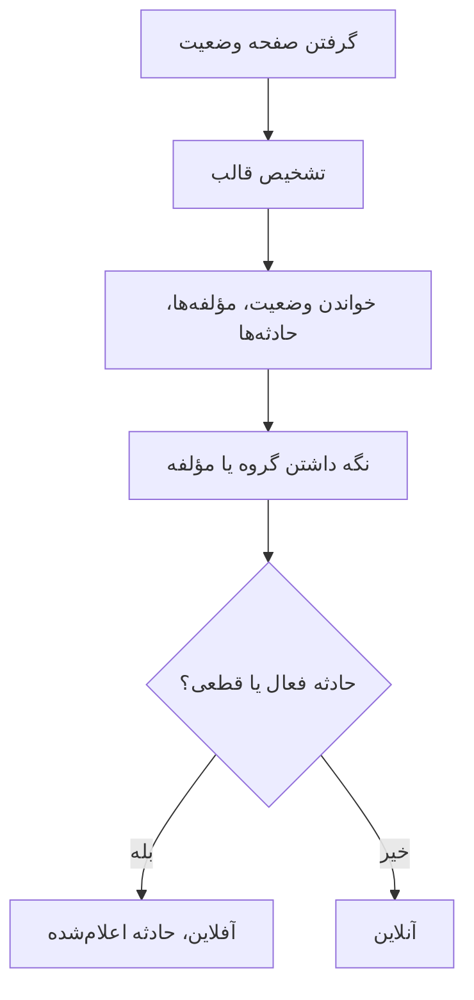

# مانیتور صفحه وضعیت خارجی

مانیتور صفحه وضعیت خارجی صفحه وضعیت عمومی سرویسی را که به آن وابسته‌اید زیر نظر می‌گیرد — AWS، ‏GCP، ‏Azure، ‏GitHub، ‏OpenAI، ‏Anthropic و بسیاری دیگر — و وقتی آن ارائه‌دهنده از قطعی یا کاهش کارایی خبر می‌دهد به شما هشدار می‌دهد. از آن استفاده کنید تا به محض اینکه ارائه‌دهنده مشکلات بالادستی را گزارش داد از آن‌ها باخبر شوید، و آن‌ها را از مشکلات خودتان جدا کنید.

:::cards
- [مانیتور را بسازید](#ساخت-مانیتور-صفحه-وضعیت-خارجی): نشانی یک صفحه وضعیت را بچسبانید و برگزینید چه چیزی پاییده شود.
- [دامنه را محدود کنید](#گزینههای-پیکربندی): یک گروه مؤلفه یا یک مؤلفه را زیر نظر بگیرید.
- [معیارها](#معیارهای-پایش): به‌طور پیش‌فرض چه چیزی از کار افتاده به شمار می‌آید.
- [صفحه‌های وضعیت پرکاربرد](#نشانی-صفحههای-وضعیت-پرکاربرد): نشانی سرویس‌هایی که بیشتر تیم‌ها به آن‌ها وابسته‌اند.
:::

## چگونه کار می‌کند

در هر بررسی، یک پراب صفحه وضعیت را می‌گیرد، قالب آن را تشخیص می‌دهد، و وضعیت کلی، مؤلفه‌ها و حادثه‌های فعال را می‌خواند. اگر دامنه مانیتور را به یک گروه مؤلفه یا یک مؤلفه محدود کرده باشید، فقط همان‌ها شمرده می‌شوند. سپس معیارها تصمیم می‌گیرند که مانیتور آنلاین است یا آفلاین.

می‌توانید از آن برای این کارها استفاده کنید:

- پایش دسترس‌پذیری سرویس‌های شخص ثالثی که برنامه شما به آن‌ها وابسته است
- گرفتن هشدار وقتی ارائه‌دهندگان بالادستی دچار قطعی می‌شوند
- ردیابی وضعیت تک‌تک مؤلفه‌ها
- محدود کردن پایش به یک گروه مؤلفه (برای نمونه فقط "APIs" ‏OpenAI)، تا حادثه‌های نامرتبط در جاهای دیگر صفحه مانیتور شما را فعال نکنند
- شناسایی کاهش کارایی پیش از آنکه بر کاربرانتان اثر بگذارد
- پیوند دادن حادثه‌های خودتان با مشکلات ارائه‌دهندگان بالادستی

## ارائه‌دهندگان پشتیبانی‌شده

| ارائه‌دهنده | توضیح |
| ------------------------ | ---------------------------------------------------------------------- |
| **Auto** (پیش‌فرض) | قالب صفحه وضعیت را خودکار تشخیص می‌دهد |
| **Atlassian Statuspage** | صفحه‌های وضعیتی که بر پایه Atlassian Statuspage کار می‌کنند (JSON API) |
| **incident.io** | صفحه‌های وضعیتی که بر پایه incident.io کار می‌کنند (برای نمونه `https://status.openai.com`) |
| **RSS** | صفحه‌های وضعیتی که خوراک RSS دارند |
| **Atom** | صفحه‌های وضعیتی که خوراک Atom دارند |

### تشخیص خودکار

وقتی روی **Auto** تنظیم شده باشد، OneUptime قالب صفحه وضعیت را به این ترتیب خودکار تشخیص می‌دهد:

1. نخست، API صفحه وضعیت incident.io ‏(`/proxy/<host>`) را می‌آزماید.
2. سپس، JSON API ‏Atlassian Statuspage ‏(`/api/v2/status.json`، `/api/v2/components.json` و `/api/v2/incidents/unresolved.json`) را می‌آزماید.
3. اگر این‌ها شکست بخورند، می‌کوشد صفحه را به‌صورت خوراک RSS یا Atom تجزیه کند.
4. در آخرین گام، یک بررسی ساده دسترس‌پذیری HTTP انجام می‌دهد.

> [!NOTE]
> ‏incident.io نخست بررسی می‌شود چون برخی صفحه‌های وضعیت incident.io (مانند `https://status.openai.com`) یک endpoint محدود و سازگار با Atlassian هم دارند که گروه‌های مؤلفه و حادثه‌های فعال را کنار می‌گذارد. بررسی نخستِ incident.io تضمین می‌کند که داده‌های غنی‌تر و گروه‌دار به کار روند.

بررسی دسترس‌پذیری همچنین جایگزین است وقتی ارائه‌دهنده‌ای که صریحاً برگزیده‌اید شکست بخورد. این بررسی فقط می‌گوید آیا صفحه پاسخ می‌دهد — آنلاین با پاسخ `2xx` یا `3xx` — و هیچ مؤلفه یا حادثه‌ای گزارش نمی‌دهد.

## ساخت مانیتور صفحه وضعیت خارجی

:::steps
### یک مانیتور تازه آغاز کنید

به **مانیتورها** بروید و روی **ساخت مانیتور** کلیک کنید. در **نوع مانیتور** روی **انواع دیگر مانیتور** کلیک کنید و **External Status Page** را زیر **Basic Monitoring** برگزینید، یا در جعبه جست‌وجو `statuspage` را تایپ کنید. یک **نام** وارد کنید و سپس روی **بعدی** کلیک کنید.

### نشانی صفحه وضعیت را وارد کنید

‏**نشانی صفحه وضعیت** را وارد کنید. ‏**ارائه‌دهنده** را روی **Auto** بگذارید، مگر اینکه قالب را بدانید.

### در صورت نیاز دامنه را محدود کنید

‏**فیلدهای بیشتر** را باز کنید تا یک **Component Group Filter (Optional)**، مانند `APIs`، و یک **فیلتر نام مؤلفه (اختیاری)** برای زیر نظر گرفتن یک مؤلفه (درون گروه، اگر گروهی تنظیم شده باشد) وارد کنید.

### آن را بیازمایید

روی **آزمایش مانیتور** کلیک کنید تا صفحه یک بار گرفته شود، و ارائه‌دهنده، مؤلفه‌ها و حادثه‌هایی را که پیدا کرده بررسی کنید.

### معیارها را بازبینی کنید

گام معیارها با [معیارهای پیش‌فرض](#معیارهای-پیشفرض) آغاز می‌شود، که وقتی ارائه‌دهنده یک حادثه فعال یا قطعی در دامنه گزارش دهد مانیتور را آفلاین علامت می‌زنند. اگر لازم است آن‌ها را تغییر دهید، سپس روی **بعدی** کلیک کنید.

### پراب‌ها را برگزینید و بسازید

‏**پراب‌ها** و یک **بازه پایش** برگزینید — که از **هر ۵ دقیقه** آغاز می‌شود — سپس روی **ساخت مانیتور** کلیک کنید.
:::

## گزینه‌های پیکربندی

| گزینه | چه وارد کنید | پیش‌فرض |
| --- | --- | --- |
| **نشانی صفحه وضعیت** | نشانی صفحه وضعیت. برای سایت‌هایی که بر پایه Atlassian Statuspage و incident.io کار می‌کنند، معمولاً نشانی ریشه است (برای نمونه `https://status.example.com`). برای خوراک‌های RSS/Atom، نشانی خوراک را مستقیم وارد کنید. | — |
| **ارائه‌دهنده** | ‏**Auto** برای تشخیص قالب، یا **Atlassian Statuspage**، ‏**incident.io**، ‏**RSS** یا **Atom** اگر آن را می‌دانید. | **Auto** |
| **Component Group Filter (Optional)** | گروهی که دامنه مانیتور به آن محدود می‌شود. زیر **فیلدهای بیشتر**. | همه گروه‌ها |
| **فیلتر نام مؤلفه (اختیاری)** | مؤلفه‌ای که زیر نظر گرفته می‌شود. زیر **فیلدهای بیشتر**. | همه مؤلفه‌های درون دامنه |
| **وقفه (میلی‌ثانیه)** | بیشترین زمان انتظار برای صفحه وضعیت. زیر **فیلدهای بیشتر**. | `10000` (۱۰ ثانیه) |
| **تلاش‌های مجدد** | پس از شکست تلاش نخست، چند بار با فاصله یک ثانیه دوباره تلاش شود؛ `0` یعنی یک تلاش. زیر **فیلدهای بیشتر**. | `3` (تا ۴ تلاش) |

### Component Group Filter

اگر صفحه وضعیت مؤلفه‌هایش را در گروه‌هایی سازمان داده باشد، می‌توانید دامنه مانیتور را به یک گروه محدود کنید. برای نمونه، در `https://status.openai.com` وارد کردن `APIs` دامنه مانیتور را به سرویس‌های API ‏OpenAI محدود می‌کند.

وقتی یک گروه مؤلفه تنظیم شده باشد، **شمار حادثه‌های فعال** و **وضعیت کلی** فقط با مؤلفه‌های آن گروه محاسبه می‌شوند — حادثه‌ای که گروهی نامرتبط (برای نمونه ChatGPT) را تحت تأثیر قرار دهد، مانیتوری را که به گروه "APIs" محدود شده فعال نمی‌کند.

فیلتر کردن بر پایه گروه مؤلفه برای ارائه‌دهندگان **Atlassian Statuspage** و **incident.io** پشتیبانی می‌شود. خوراک‌های RSS و Atom گروه مؤلفه ندارند.

### فیلتر نام مؤلفه

اگر صفحه وضعیت درباره چند مؤلفه گزارش دهد، می‌توانید نام یک مؤلفه را تعیین کنید تا فقط همان پاییده شود. فیلتر با هر مؤلفه‌ای که نامش شامل چیزی باشد که وارد می‌کنید، بدون توجه به بزرگی و کوچکی حروف، تطبیق می‌یابد — `actions` با مؤلفه‌ای به نام "Actions" تطبیق می‌یابد.

وقتی یک گروه مؤلفه هم تنظیم شده باشد، فیلتر نام مؤلفه **درون** همان گروه اعمال می‌شود، تا بتوانید یک مؤلفه را درون گروهی بزرگ‌تر هدف بگیرید. وقتی هیچ‌کدام از فیلترها تعیین نشده باشد، همه مؤلفه‌های درون دامنه پاییده می‌شوند. در خوراک RSS یا Atom، فیلتر نام با عنوان آیتم‌های خوراک تطبیق داده می‌شود.

> [!WARNING]
> فیلتری که با هیچ چیز تطبیق نیابد سالم به نظر می‌رسد: بدون مؤلفه‌ای در دامنه، چیزی نیست که قطعی را گزارش دهد. املا را با صفحه وضعیت مقایسه کنید، و با **آزمایش مانیتور** ببینید فیلتر چه چیزی را نگه می‌دارد.

## معیارهای پایش

می‌توانید معیارهایی پیکربندی کنید تا تعیین شود سرویس خارجی چه زمانی آنلاین یا آفلاین به شمار می‌آید، بر پایه:

| نوع فیلتر | آنچه بررسی می‌کند | شرط‌های فیلتر |
| --- | --- | --- |
| **External Status Page Is Online** | آیا صفحه وضعیت در دسترس است و داده وضعیت برمی‌گرداند | درست یا نادرست |
| **External Status Page Overall Status** | وضعیت کلی‌ای که صفحه گزارش می‌دهد | Equal To، Not Equal To، شامل است، Not Contains، Starts With، Ends With |
| **External Status Page Component Status** | وضعیت مؤلفه‌های درون دامنه (با رعایت فیلترهای گروه مؤلفه / نام مؤلفه): عملیاتی، Under Maintenance، Degraded Performance، Partial Outage، Major Outage یا Full Outage | Equal To، Not Equal To، شامل است، Not Contains، Starts With، Ends With |
| **External Status Page Active Incidents** | شمار حادثه‌های فعال کنونی گزارش‌شده در صفحه وضعیت (وقتی فیلتری تنظیم شده باشد، محدود به گروه مؤلفه / مؤلفه) | Equal To، Not Equal To، و مقایسه‌های عددی |
| **External Status Page Response Time (in ms)** | گرفتن داده‌های صفحه وضعیت چه مدت طول می‌کشد | Greater Than، Less Than، Greater Than Or Equal To، Less Than Or Equal To |

وضعیت کلی همان چیزی است که صفحه می‌گوید، پس مقدارهایش از ارائه‌دهنده‌ای به ارائه‌دهنده دیگر فرق می‌کند: یک Atlassian Statuspage توضیح خودش را گزارش می‌دهد، مانند `All Systems Operational`؛ یک خوراک `operational` یا `degraded_performance` را گزارش می‌دهد؛ بررسی دسترس‌پذیری `reachable` یا `unreachable` را گزارش می‌دهد. این مقایسه‌ها به بزرگی و کوچکی حروف حساس‌اند. برای هشدار درباره قطعی‌ها، **External Status Page Active Incidents** و **External Status Page Component Status** معمولاً قابل‌اعتمادترند.

در خوراک RSS یا Atom، آیتم‌های ۲۴ ساعت گذشته حادثه فعال به شمار می‌آیند: آیتم RSS بر پایه تاریخ انتشارش، و ورودی Atom بر پایه تاریخ به‌روزرسانی‌اش.

### معیارهای پیش‌فرض

به‌طور پیش‌فرض، OneUptime معیارهایی را بر پایه آنچه واقعاً برای یک صفحه وضعیت مهم است می‌سازد — حادثه‌های فعال و سلامت مؤلفه‌های آن، نه صرفاً دسترس‌پذیری:

| معیار | فیلترها | اثر |
| --- | --- | --- |
| Offline | **هر** یک از این‌ها: صفحه آنلاین نیست؛ دست‌کم یک حادثه فعال در دامنه هست؛ یک مؤلفه در دامنه Degraded Performance، ‏Partial Outage، ‏Major Outage یا Full Outage گزارش می‌دهد | مانیتور را آفلاین علامت می‌زند و حادثه‌ای اعلام می‌کند، که وقتی معیار دیگر تطبیق نیابد خودبه‌خود رفع می‌شود |
| Online | **همه** این‌ها: صفحه آنلاین است؛ هیچ حادثه فعالی در دامنه نیست | مانیتور را آنلاین علامت می‌زند |

چون شمار حادثه‌های فعال و وضعیت مؤلفه‌ها فیلترهای گروه مؤلفه / نام مؤلفه را رعایت می‌کنند، این معیارهای پیش‌فرض خودکار فقط مؤلفه‌هایی را هدف می‌گیرند که برایتان مهم‌اند.

## متغیرهای قالب

هنگام ساخت حادثه یا هشدار از مانیتورهای صفحه وضعیت خارجی، می‌توانید این متغیرها را در عنوان‌ها، توضیح‌ها و یادداشت‌های رفع مشکل به کار ببرید ([قالب‌بندی حادثه و هشدار](/docs/monitor/incident-alert-templating) را ببینید):

| متغیر | توضیح |
| ------------------------- | ------------------------------------------------------------------------------- |
| `{{isOnline}}`            | آیا صفحه وضعیت آنلاین است (true/false) |
| `{{responseTimeInMs}}`    | زمان پاسخ به میلی‌ثانیه |
| `{{failureCause}}`        | علت شکست، اگر باشد |
| `{{overallStatus}}`       | مقدار شاخص وضعیت کلی |
| `{{activeIncidentCount}}` | شمار حادثه‌های فعال (محدود به فیلتر، اگر باشد) |
| `{{componentStatuses}}`   | آرایه JSON از وضعیت مؤلفه‌ها (`name`، `status`، `description`، `groupName`) |
| `{{provider}}`            | ارائه‌دهنده تشخیص‌داده‌شده (Atlassian Statuspage، ‏incident.io، ‏RSS، ‏Atom)؛ پس از بررسی دسترس‌پذیری خالی است |
| `{{componentGroup}}`      | گروه مؤلفه‌ای که دامنه مانیتور به آن محدود شده، اگر باشد |
| `{{componentName}}`       | مؤلفه‌ای که دامنه مانیتور به آن محدود شده، اگر باشد |

## نشانی صفحه‌های وضعیت پرکاربرد

این فهرستی از صفحه‌های وضعیت سرویس‌های پرکاربرد است. بسیاری از آن‌ها از Atlassian Statuspage یا incident.io استفاده می‌کنند، پس ارائه‌دهنده **Auto** آن‌ها را خودکار تشخیص می‌دهد. صفحه‌ای که بر پایه هیچ‌کدام ساخته نشده و خوراک هم نیست، فقط بررسی دسترس‌پذیری می‌گیرد — برای این‌ها، اگر ارائه‌دهنده خوراک RSS یا Atom منتشر می‌کند، به‌جای آن همان خوراک را بپایید.

| سرویس | نشانی صفحه وضعیت |
| ---------------------------- | --------------------------------------------- |
| AWS                          | `https://health.aws.amazon.com/health/status` |
| Google Cloud Platform        | `https://status.cloud.google.com`             |
| Microsoft Azure              | `https://status.azure.com`                    |
| GitHub                       | `https://www.githubstatus.com`                |
| OpenAI                       | `https://status.openai.com`                   |
| Anthropic                    | `https://status.anthropic.com`                |
| Cloudflare                   | `https://www.cloudflarestatus.com`            |
| Datadog                      | `https://status.datadoghq.com`                |
| PagerDuty                    | `https://status.pagerduty.com`                |
| Twilio                       | `https://status.twilio.com`                   |
| Stripe                       | `https://status.stripe.com`                   |
| Slack                        | `https://status.slack.com`                    |
| Atlassian (Jira, Confluence) | `https://status.atlassian.com`                |
| Vercel                       | `https://www.vercel-status.com`               |
| Netlify                      | `https://www.netlifystatus.com`               |
| DigitalOcean                 | `https://status.digitalocean.com`             |
| Heroku                       | `https://status.heroku.com`                   |
| MongoDB Atlas                | `https://status.cloud.mongodb.com`            |
| Fastly                       | `https://status.fastly.com`                   |
| New Relic                    | `https://status.newrelic.com`                 |
| Sentry                       | `https://status.sentry.io`                    |
| CircleCI                     | `https://status.circleci.com`                 |

## بهترین روش‌ها

- **از ارائه‌دهنده Auto استفاده کنید** مگر اینکه قالب دقیق را بدانید — تشخیص خودکار برای بیشتر صفحه‌های وضعیت خوب کار می‌کند.
- **دامنه را به یک گروه مؤلفه محدود کنید** اگر فقط به بخشی از یک ارائه‌دهنده وابسته‌اید (برای نمونه فقط "APIs" ‏OpenAI)، تا حادثه‌های نامرتبط نویز نسازند.
- **مؤلفه‌های مشخص را بپایید** اگر فقط به سرویس‌های خاصی وابسته‌اید.
- **با مانیتورهای خودتان ترکیب کنید** — مانیتورهای صفحه وضعیت خارجی را کنار مانیتورهای API و وب‌سایت خودتان بگذارید. وقتی هر دو همزمان از کار بیفتند، صفحه وضعیت بالادستی شما را سریع‌تر به علت ریشه‌ای می‌رساند.

## عیب‌یابی

:::details مانیتور آفلاین است، اما حادثه درباره بخشی از سرویس است که از آن استفاده نمی‌کنم
دامنه مانیتور را با یک **Component Group Filter**، یک **فیلتر نام مؤلفه**، یا هر دو محدود کنید. آن‌گاه شمار حادثه‌های فعال و وضعیت مؤلفه‌ها فقط آنچه را در دامنه است می‌شمارند.
:::

:::details مانیتور هرگز آفلاین نمی‌شود، حتی هنگام قطعی
شاید فیلترها با هیچ چیز تطبیق نیابند، که سالم به نظر می‌رسد، یا شاید صفحه فقط بررسی دسترس‌پذیری بگیرد. ‏**آزمایش مانیتور** را اجرا کنید و ارائه‌دهنده و مؤلفه‌هایی را که پیدا کرده بررسی کنید.
:::

:::details Auto قالب نادرستی برمی‌گزیند، یا هیچ مؤلفه‌ای پیدا نمی‌کند
‏**ارائه‌دهنده** را روی همانی بگذارید که می‌دانید صفحه از آن استفاده می‌کند. برای خوراک RSS یا Atom، نشانی خود خوراک را وارد کنید نه نشانی صفحه وضعیت را.
:::

:::details یک صفحه وضعیت داخلی در دسترس نیست
پراب نشانی‌های شبکه خصوصی را رد می‌کند مگر اینکه اجازه دسترسی به آن‌ها را داشته باشد. روی پرابی درون شبکه خود `PROBE_ALLOW_PRIVATE_NETWORK_MONITORS=true` را تنظیم کنید — [دسترسی به شبکه خصوصی](/docs/self-hosted/private-network-access) را ببینید.
:::

## گام‌های بعدی

:::cards
- [قالب‌بندی حادثه و هشدار](/docs/monitor/incident-alert-templating): وضعیت ارائه‌دهنده را در عنوان حادثه‌های خود بگذارید.
- [مانیتور API](/docs/monitor/api-monitor): endpointهای خودتان را کنار وضعیت ارائه‌دهنده بررسی کنید.
- [ساخت مانیتور](/docs/monitor/create-monitor): گام‌هایی که همه انواع مانیتور در آن‌ها مشترک‌اند.
:::
